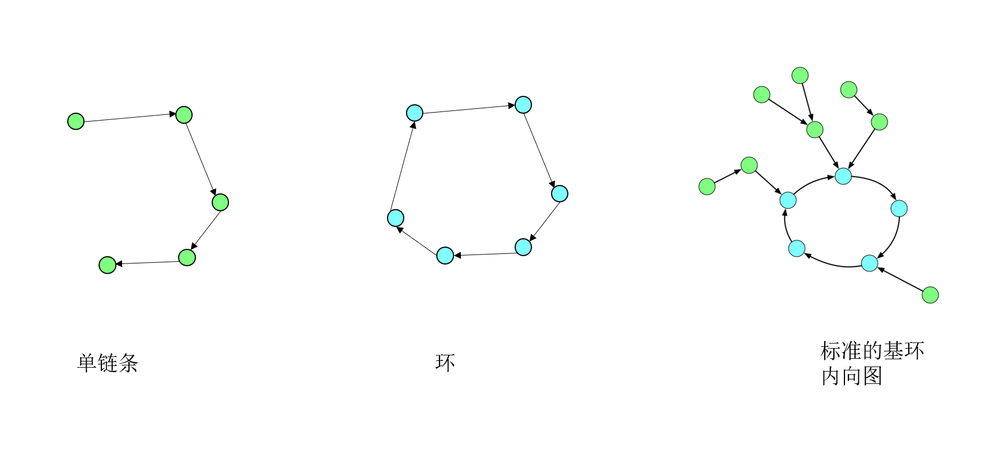

# leetcode

## 322. 零钱兑换

f(n, m)=min(f(n, m-arr[n]), f(n-1, m))

```python
import sys
class Solution:
    def coinChange(self, coins: List[int], amount: int) -> int:
        n = len(coins)
        matrix = [[sys.maxsize for _ in range(amount+1)] for _ in range(n+1)]
        for i in range(n+1):
            matrix[i][0]=0
        
        for i in range(1, n+1):
            for j in range(1, amount+1):
                matrix[i][j]=matrix[i-1][j]
                if j>=coins[i-1]:
                    matrix[i][j]=min(matrix[i][j], matrix[i][j-coins[i-1]]+1)
        if matrix[-1][-1]>=sys.maxsize:
            return -1
        return matrix[-1][-1]
```

## 323 无向图中连通分量的数目

并查集、BFS、DFS都行

```python
class unionSet():
    def __init__(self, n):
        self.parent = [i for i in range(n)]
        self.rank = [0 for i in range(n)]

    def find(self, x):
        if x!=self.parent[x]:
            self.parent[x]=self.find(self.parent[x])
        return x
    
    def merge(self, x, y):
        x = self.find(x)
        y = self.find(y)
        if x==y:
            return 
        if self.rank[x]==self.rank[y]:
            self.parent[y]=x
            self.rank[x]+=1
        elif self.rank[x]>self.rank[y]:
            self.parent[y]=x
        else:
            self.parent[x]=y
        return 


def countComponents(n, edges):
    union = unionSet(n)
    for x, y in edges:
        union.merge(x, y)
    res=0
    for i in range(n):
        if i!=union.parent[i]:
            res+=1
    return res
```

## 324. 摆动排序 II

基本思路：从小到大排序，令A为前半部分的数字，B为后半部分的数字，len(A)-len(B)=[0, 1]，例如nums=[1,2,2,3,4]，A=[1,2,2], B=[3, 4]，然后让A和B交叉排序即可。O(nlogn),O(n)
由因为A=[1,2], B=[2,3]，交叉排序为[1,2,2,3]，会出现相邻，这是因为A的末尾和B的开头出现了相同数字r，简单证明，在可以得到有效结果的前提下，len(r)=(n+1)//2，会出现相邻的情况。一种可行的方法是将A，B倒序，显然可以证明，倒序后AB交叉排序不会发生相邻。

对于优化，我们不需要确切地排序，第一步：需要通过快速选择方法找到中位数，第二步：对中位数进行3-way-partion，即分成三类：小于,等于,大于，第三步：交叉插入.O(n), O(n)

进一步优化:虚地址 #define A(i) nums[(1+2*(i)) % (n|1)]
举例说明：
nums: 1 3 5 7 9 0 2 4 6 8
A:    0 1 2 3 4 5 6 7 8 9
这样只需要对A从大到小排序，就可以实现nums的摆动排序


```python
class Solution:
    def wiggleSort(self, nums: List[int]) -> None:
        """
        Do not return anything, modify nums in-place instead.
        """
        n = len(nums)
        self.quickselect(nums, 0, n-1, n//2)
        base = nums[n//2]
        self.threePartion(nums, base)
        self.merge(nums)

    def quickselect(self, nums, start, end, mid):
        base = nums[end]
        i, j = -1, 0
        for j in range(end+1):
            if nums[j]<=base:
                i+=1
                nums[i], nums[j] = nums[j], nums[i]
        if i<mid:
            self.quickselect(nums, i+1, end, mid)
        elif i>mid:
            self.quickselect(nums, start, i-1, mid)

    def threePartion(self, nums, base):
        n = len(nums)
        i, j, k = -1, 0, n
        while j<k:
            if nums[j]<base:
                k-=1
                nums[j], nums[k] = nums[k], nums[j]
            elif nums[j]>base:
                i+=1
                nums[i], nums[j] = nums[j], nums[i]
                j+=1
            else:
                j+=1
        return 
    
    def merge(self, nums):
        n = len(nums)
        A = nums[n//2:]
        B = nums[:n//2]
        j1, j2 = 0, 0
        for i in range(len(A)):
            nums[2*i] = A[i]
        for i in range(len(B)):
            nums[2*i+1] = B[i]
        return
```

## 325 和等于 k 的最长子数组长度

前缀和+hash

```python
def maxSubArrayLen(nums, k):
    hash = {0:-1}
    res = 0
    cur = 0
    for i, num in enumerate(nums):
        cur += num
        if cur not in hash:
            hash[cur]=i
        if cur-k in hash:
            res = max(res, i-hash[cur-k])
    return res
```

## 495. 提莫攻击

假设上一次中毒的终止时间是T，下一次攻击发生在t，每次攻击持续x秒中毒状态，当下一次攻击时间t小于上一次中毒结束时间T时，总中毒时间需要减去重复的中毒的时间T-t

```python
class Solution:
    def findPoisonedDuration(self, timeSeries: List[int], duration: int) -> int:
        res = 0
        T = 0
        for t in timeSeries:
            res += duration
            if T>t:
                res -= T-t
            T=t+duration
        return res  
```

或者说，当连续两次中毒的时间差小于毒性时间时，取连续两次中毒的时间差，反之取毒性时间

```python
class Solution:
    def findPoisonedDuration(self, timeSeries: List[int], duration: int) -> int:
        n = len(timeSeries)
        if n == 0:
            return 0
        
        total = 0
        for i in range(n - 1):
            total += min(timeSeries[i + 1] - timeSeries[i], duration)
        return total + duration
```

## 1569. 将子数组重新排序得到同一个二叉查找树的方案数

相同的二叉查找树，根节点必须相同，其次，左子树的元素需要保持顺序，右子树的元素需要保持顺序，最后，左子树的元素可以在n-1个位置中随意选一组位置，即 C(L+R, L)。

4，2，1，3，6，5
4，6，5，2，1，3
4，2，6，5，1，3

```python
MOD = 10**9+7
class Solution:
    def numOfWays(self, nums: List[int]) -> int:

        def ways(nums):
            if len(nums)<=2:
                return 1
            base = nums[0]
            left = [val for val in nums if val<base]
            right = [val for val in nums if val>base]
            res = comb(len(left)+len(right), len(left))*ways(left)*ways(right)%MOD
            return res
        
        res = (int(ways(nums))-1)%MOD
        return res
```

类似快速排序
时间复杂度 O(nlgn) 空间复杂度 O(nlgn)

## 98. Validate Binary Search Tree

```python
class Solution:
    def isValidBST(self, root: TreeNode) -> bool:
        if not root:
            return True
        
        self.last_val = None # self.last_val 记录中序遍历到当前结点时，前一个结点的值
        res = self.inorder(root)
        return res
        
    def inorder(self, root):
        """
        :param root: TreeNode
        :return: 返回当前root是否是有效二叉搜索树
        """
        if not root:
            return True
        if not self.inorder(root.left):
            return False
        # print(self.last_val, root.val)
        if self.last_val==None or self.last_val<root.val:
            self.last_val = root.val
        else:
            return False
        if not self.inorder(root.right):
            return False
        return True
```

## 1642. Furthest Building You Can Reach

medium

整体思路：楼层高度相差大的用梯子，相差小的用砖块

思路一：二分法

对能到达的第n个楼二分，因为满足前面的m个楼都能到达，后面的m+1~n个楼都不能到达。
二分的判断标准：对于第m个楼，前面m个楼层高度排序，最高的用梯子，剩下的用砖块，判断砖块是否够用
res记录最大的可以到达的位置。

时间复杂度 O(nlogn)，空间复杂度 O(n)

```C++
class Solution {
public:
    int furthestBuilding(vector<int>& heights, int bricks, int ladders) {
        const int n = heights.size();
        if (ladders>=n-1)
            return n-1;
        vector<int> diffs(n);
        for(int i=1; i<n; i++){
            diffs[i-1] = max(0, heights[i]-heights[i-1]);
        }
        int l = ladders;
        int r = n-1;
        int res = l;
        while (l<=r){
            int m = l+(r-l)/2;
            vector<int> d(begin(diffs), begin(diffs)+m);
            nth_element(begin(d), end(d)-ladders, end(d));
            if (accumulate(begin(d), end(d)-ladders, 0)>bricks)
                r = m-1;            
            else{
                l = m+1;
                res = m;
            }
        }
        return res;
    }
};
```

思路二：优先队列+贪心

时间复杂度 O(nlogL), 空间复杂度 O(L)

在移动的过程中，我们会需要若干次需要使用砖块或者梯子的情况。假设当前我们需要移动到下一建筑物，但必须使用 11 架梯子或者 \Delta hΔh 个砖块，那么我们如何抉择是使用梯子还是砖块呢？

我们可以用贪心的思路来想这个问题。「梯子」相当于一次性的无限量砖块，那么我们一定是把梯子用在刀刃上。也就是说，如果我们有 ll 架梯子，那么我们会在 \Delta hΔh 最大的那 ll 次使用梯子，而在剩余的情况下使用砖块。

这样一来，我们就可以得到正确的算法了：我们使用优先队列实时维护不超过 ll 个最大的 \Delta hΔh，这些就是使用梯子的地方。对于剩余的 \Delta hΔh，我们需要使用砖块，因此需要对它们进行累加，如果某一时刻这个累加值超过了砖块的数目 bb，那么我们就再也无法移动了。

```python
class Solution:
    def furthestBuilding(self, heights: List[int], bricks: int, ladders: int) -> int:
        n = len(heights)
        q = list()
        sumH = 0
        res = n-1
        for i in range(1, n):
            
            deltaH = heights[i]-heights[i-1]
            if deltaH<0:
                continue
            heapq.heappush(q, deltaH)
            if len(q)>ladders:
                sumH = sumH + heapq.heappop(q)
            if sumH>bricks:
                res = i-1
                break
        return res
        
```

## 1681. 最小不兼容性

### 思路一：朴素搜索

https://www.bilibili.com/video/BV16p4y1z79z

令 m = n/k，第一次先从n个数中取出m个数，第二次从n-m个数中取m个数，以此类推，复杂度是 n!/(m!^k)

或者将n个数字全排列，n!种情况，然后遍历。

### 思路二：状态压缩动态规划：状态DP

用二进制位表示第某个数字有没有被取。

第一步：将所有可能的m=len(nums)/k个数字的组合全部遍历一遍，得到基本解。
第二步：状态转移：f[mask]= (sub is valid) min {f[mask⊕sub]+value[sub]}

https://leetcode-cn.com/problems/minimum-incompatibility/solution/zui-xiao-bu-jian-rong-xing-by-zerotrac2-rwje/

时间复杂度： 3^n, 空间复杂度 2^n

```python
class Solution:
    def minimumIncompatibility(self, nums: List[int], k: int) -> int:
        n = len(nums)
        # 特殊判断，如果元素数量等于组数
        if n == k:
            return 0
        
        value = dict()
        for sub in range(1 << n):
            # 判断 sub 是否有 n/k 个 1
            if bin(sub).count("1") == n // k:
                # 使用哈希表进行计数
                freq = set()
                flag = True
                for j in range(n):
                    if sub & (1 << j):
                        # 任意一个数不能出现超过 1 次
                        if nums[j] in freq:
                            flag = False
                            break
                        freq.add(nums[j])
                
                # 如果满足要求，那么计算 sub 的不兼容性
                if flag:
                    value[sub] = max(freq) - min(freq)
        
        f = dict()
        f[0] = 0
        for mask in range(1 << n):
            # 判断 mask 是否有 n/k 倍数个 1
            if bin(mask).count("1") % (n // k) == 0:
                # 枚举子集
                sub = mask
                while sub > 0:
                    if sub in value and mask ^ sub in f:
                        if mask not in f:
                            f[mask] = f[mask ^ sub] + value[sub]
                        else:
                            f[mask] = min(f[mask], f[mask ^ sub] + value[sub])
                    sub = (sub - 1) & mask
            
        return -1 if (1 << n) - 1 not in f else f[(1 << n) - 1]
```

### 思路三：状态压缩  状态DP

定义dp[mask][i]: mask 表示取数的二进制位，dp[mask][i] 表示取到mask中的数字，且以nums[i]结尾的最小代价
https://www.bilibili.com/video/BV16p4y1z79z

状态转移：
dp[mask|1<<j][j] =  dp[mask][i] , 如果mask中1的个数是 n/k 的倍速
dp[mask|1<<j][j] =  dp[mask][i]+nums[j]-nums[i]，如果mask中1的个数不是 n/k 的倍速

保证每个数组里的数字都是从小到大排列的

```python
class Solution:
    def minimumIncompatibility(self, nums: List[int], k: int) -> int:
        nums = sorted(nums)
        n = len(nums)
        m = n//k
        dp = [[sys.maxsize for _ in range(n)] for _ in range(2**n)]
        for i in range(n):
            dp[1<<i][i] = 0
        for mask in range(2**n):
            for i in range(n):
                if (1<<i)&mask==0:
                    continue
                for j in range(n):
                    if (1<<j)&mask!=0 or (dp[mask][i]==sys.maxsize):
                        continue
                    if bin(mask).count("1") % m==0:
                        dp[mask|1<<j][j] = min(dp[mask|1<<j][j], dp[mask][i])
                    elif nums[j]>nums[i]:
                        dp[mask|1<<j][j] = min(dp[mask|1<<j][j], dp[mask][i]+nums[j]-nums[i])
                    else:
                        continue
                    
        if dp[-1][-1]==sys.maxsize:
            res = -1
        else:
            res = dp[-1][-1]
        return res
```

时间复杂度 n^2*2^n, 空间复杂度 n *2^n


## 1690. 石子游戏 VII

https://www.bilibili.com/video/BV1wf4y1e7xH

dp[l][r] 表示对于区间l，r的先手，可以比后手最多高多少分

状态转移：斜线
dp[l][r] = max(sum[l+1][r]-dp[l+1][r], sum[l][r-1]-dp[l][r-1])

边界：
dp[i][i] = 0

备注：连续区间的和 sum[l+1][r] 可以用累加和代替

```python

class Solution:
    def stoneGameVII(self, stones: List[int]) -> int:
        n = len(stones)
        dp = [[0 for _ in range(n)] for _ in range(n)]
        s = [0 for _ in range(n+1)]
        for i in range(n):
            s[i+1] = s[i]+stones[i]
        for c in range(1, n):
            for l in range(n-c):
                r = l + c
                dp[l][r] = max(s[r+1]- s[l+1] - dp[l+1][r], 
                               s[r]- s[l] - dp[l][r-1])
        return dp[0][n-1]
```

## 1674. 使数组互补的最少操作次数

参考链接：https://www.bilibili.com/video/BV1qz4y1k7Cm

优化：用hash表记录变化的点与变化的插值，排序，求最小前缀和

数组 
a = [2,2,2,2,2,1,1,1,1,0,1,1,1,2,2,2,]
b = [2,2,2,1,1,1,1,0,1,1,1,1,1,2,2,2,]
...
求这些数组的和的最小值
aa = a+b+...

将a转换成 {0:2, 5：-1, 9:-1,10:1,13:1}，表示在哪个位置变化了多少
将b转换成 {0:2, 3:-1, 7:-1,8:1,13:1}
将a，b的字典合并
ab_dict = {0:4, 3:-1, 5:-1, 7:-1, 8:1, 9:-1, 10:1, 13:2}
此时aa[i] = ab_dict 的前缀和
比如aa[3] = 4+(-1)=3

```python
class Solution:
    def minMoves(self, nums: List[int], limit: int) -> int:
        n = len(nums)
        delta = [0 for _ in range(2*limit+2)]
        for i in range(n//2):
            a = min(nums[i], nums[n-1-i])
            b = max(nums[i], nums[n-1-i])
            delta[2] += 2
            delta[a+1] -= 1
            delta[a+b] -= 1
            delta[a+b+1] += 1
            delta[b+limit+1] += 1
        res = n
        cur = 0
        for i in range(2, 2*limit+1):
            cur = cur+delta[i]
            res = min(res, cur)
        return res
```

时间复杂度: O(n), 空间复杂度: O(limit)

## 1675. 数组的最小偏移量

https://www.bilibili.com/video/BV15541157p6
https://leetcode-cn.com/problems/minimize-deviation-in-array/solution/you-xu-ji-he-you-xian-dui-lie-xun-huan-chu-li-by-m/

第一步：先将其中的奇数乘以2，之后只需要考虑除以2即可
第二步：每次取出最大的数字，记录差值，并将最大数字除以2放回原数组、更新最小值
第三步：直到最大的数字是奇数，此时其他的偶数除以2得到的差值也不会更小

```python
import heapq
class Solution:
    def minimumDeviation(self, nums: List[int]) -> int:
        res = sys.maxsize
        nums = [-2*val if val%2==1 else -val for val in nums ]
        low = -max(nums)
        
        heapq.heapify(nums)
        
        while -nums[0]%2==0:
            # print(nums)
            high = -heapq.heappop(nums)
            res = min(res, high-low)
            high = high//2
            heapq.heappush(nums, -high)
            low = min(high, low)
        # print(nums)
        high = -heapq.heappop(nums)
        res = min(res, high-low)
        return res
```

时间复杂度 O(n logm log n) m是nums中的最大值

思路二：

https://leetcode-cn.com/problems/minimize-deviation-in-array/solution/yi-chong-fu-za-du-geng-di-de-zuo-fa-by-heltion-2/

先找到 p_max, 然后再操作

```C++
class Solution {
public:
    int minimumDeviation(vector<int>& nums) {
        int p_max = 1;
        for(int a : nums){
            while(a % 2 == 0) a /= 2;
            p_max = max(p_max, a);
        }
        vector<int> upper;
        int min = p_max;
        for(int a : nums){
            if(a % 2 == 1) a *= 2;
            while(a >= 2 * p_max) a /= 2;
            if(a >= p_max) upper.push_back(a);
            min = std::min(min, a);
        }
        sort(upper.begin(), upper.end());
        int ans = upper.back() - min;
        for(int i = upper.size() - 1; upper[i] > p_max; i -= 1){
            min = std::min(min, upper[i] / 2);
            ans = std::min(ans, upper[i - 1] - min);
        }
        return ans;
    }
};

作者：Heltion
链接：https://leetcode-cn.com/problems/minimize-deviation-in-array/solution/yi-chong-fu-za-du-geng-di-de-zuo-fa-by-heltion-2/
来源：力扣（LeetCode）
著作权归作者所有。商业转载请联系作者获得授权，非商业转载请注明出处。
```

时间复杂度 O(n(lgm+lgn))，空间复杂度 O(n)

## 1696. 跳跃游戏 VI

https://www.bilibili.com/medialist/play/watchlater/BV1554y1t7Tz

递归公式： dp[n] = nums[i] + max( dp[j]) (i-k<=j < i )

### 思路一：递归或者动态

### 思路二：单调队列

max( dp[j]) 是滑动窗口最大值

```python
class Solution:
    def maxResult(self, nums: List[int], k: int) -> int:
        q = [(0, nums[0])]

        n = len(nums)
        for i in range(1, n):
            cur = nums[i] + q[0][1]
            while q and q[-1][1]<cur:
                q.pop(-1)
            while q and i-q[0][0]>=k:
                q.pop(0)
            # print(i, q)
            q.append((i, cur))

        return q[-1][1]
```

## 1206. 设计跳表

### down-right 型实现

https://www.bilibili.com/medialist/play/watchlater/BV1kT4y1F7Nr

搜索：
1. 在当前层找到最大的结点N，N.val<= T
2. 如果 N.val == T, 返回 true; 否则 进入下一层
3. 重复步骤1、2，直到最后一层
4. 到最后一层还没有找到，返回 False

Delete(T):
1. 在当前层找到最大的结点N，N.val< T
2. 如果 N.right.val == T: N.next = N.next.next
3. 进入一下层
4. 重复步骤1 2 3，直到最后一层


删除时，不需要考虑调整上一层的的结点，因为有1/2的概率删除只删除本层结点(本层n-1,上一层n/2)，1/2的概率删除本层和上一层的结点(本层n-1,上一层n/2-1)，期望本层n-1, 上一层 n/2-1/2，上一层的结点个数依然是本层的1/2

Insert(T):
1. 对于第 i 层，找到并记录结点 Ni, Ni.val< T
2. 进入下一层
3. 重复步骤1 2，直到最后一层
4. 从下到上，以 (1/2)^(d-i)的概率在Ni的右边插入元素T

第1层：(1/2)^(d-i)

第 d-1 层：1/2
第d层：1

5. 连接不同层的新插入的结点

插入时以1/2的概率插入，本层以1的概率为n+1,上一层1/2的概率是n/2, 1/2的概率是n/2+1，期望是 n/2+1/2，是本层的 1/2.

跳表的每一层的结点个数是上一层的2倍，空间复杂度是(n+n/2+n/4...) = 2n = O(n)

给跳表的每一层起始加入dummy head，并且给跳表新建只有dummy heand 的最高一层

```python
import random

class Node:
    def __init__(self, val=-1, right=None, down=None):
        self.val = val
        self.right = right
        self.down = down

class Skiplist:

    def __init__(self):
        self.head = Node()
        

    def search(self, target: int) -> bool:
        node = self.head
        while node:
            # 从左到右找到小于等于target的最大值
            while node.right and node.right.val<=target:
                node = node.right
            if node.val == target:
                return True
            # 从上到下
            node = node.down
        return False

    def add(self, num: int) -> None:
        nodes = []
        node = self.head
        
        while node:
            # 从左到右找到小于num的最大值
            while node.right and node.right.val < num:
                node = node.right
            nodes.append(node)
            # 从上到下
            node = node.down
        
        insert = True
        down = None
        while insert and nodes:
            node = nodes.pop()
            node.right = Node(num, node.right, down)
            down = node.right
            # 在本层插入的前提下，上一层以1/2的概率插入
            insert = (random.getrandbits(1)==0)
        
        # 如果现在的最高层也插入了元素，则再添加一个只有dummy head 的最高层
        if insert:
            self.head = Node(-1, None, self.head)

        return None


    def erase(self, num: int) -> bool:
        node  = self.head
        found = False
        while node:
            # 从左到右找到小于num的最大值
            while node.right and node.right.val < num:
                node = node.right
            # 如果当前结点的右边等于num, 删除
            if node.right and node.right.val == num:
                node.right = node.right.right
                found = True
            # 从上到下
            node = node.down
        
        return found

# Your Skiplist object will be instantiated and called as such:
# obj = Skiplist()
# param_1 = obj.search(target)
# obj.add(num)
# param_3 = obj.erase(num)
```

空间复杂度O(n)
增、删、查的时间复杂度O(logn)


### reids 的 Skiplist 实现

https://leetcode-cn.com/problems/design-skiplist/solution/can-kao-redisshi-xian-by-bakezq/
http://zhangtielei.com/posts/blog-redis-skiplist.html

https://leetcode-cn.com/problems/design-skiplist/solution/javashou-xie-shi-xian-tiao-biao-by-feng-omdm0/


```python

import random

class Node:
    def __init__(self, val=-1, max_level=1):
        # 对于reids实现的跳表，最下面一层是第0层
        self.val = val
        self.level = [None for _ in range(max_level)]
        

class Skiplist:

    def __init__(self):
        self.MAX_LEVEL = 32 # 跳表的最高层
        self.cur_max_level = 1 # 当前跳表的层数
        self.p = 1/4 # 结点插入时向上一层的概率
        self.head = Node(-1, self.MAX_LEVEL)
        
    def _search(self, target):
        """输入 target，在每一层找到小于 target 的结点，记录到prevs中"""
        # prevs 直接用 MAX_LEVEL 更方便
        prevs = [self.head for _ in range(self.MAX_LEVEL)]
        node = self.head
        # 从左到右， 从上到下
        for i in range(self.cur_max_level-1, -1, -1):
            while(node.level[i] and node.level[i].val <target):
                node = node.level[i]
            prevs[i] = node
        return prevs

    def search(self, target: int) -> bool:
        
        prevs = self._search(target)
        if prevs[0].level[0] and prevs[0].level[0].val==target:
            return True
        else:
            return False
    
    def _random_level(self):
        # 以 self.p 的概率加层
        level = 1
        if random.random() < self.p and level < self.MAX_LEVEL:
            level += 1
        return level


    def add(self, num: int) -> None:
        prevs = self._search(num)
        level = self._random_level()
        self.cur_max_level = max(self.cur_max_level, level)
        cur = Node(num, level)
        # 从下往上或者从上往下都可以
        for i in range(level):
            cur.level[i] = prevs[i].level[i]
            prevs[i].level[i] = cur
        
        return None

    def erase(self, num: int) -> bool:
        prevs = self._search(num)
        if (not prevs[0].level[0]) or (not prevs[0].level[0].val==num):
            return False
        # 从上到下或者从下到上都可以
        for i in range(self.cur_max_level):
            if prevs[i].level[i] and prevs[i].level[i].val == num:
                prevs[i].level[i] = prevs[i].level[i].level[i]
        # 更新 cur_max_level
        while self.cur_max_level>1 and (not self.head.level[self.cur_max_level-1]):
            self.cur_max_level -= 1
        return True

# Your Skiplist object will be instantiated and called as such:
# obj = Skiplist()
# param_1 = obj.search(target)
# obj.add(num)
# param_3 = obj.erase(num)
```

## 1617. 统计子树中城市之间最大距离

https://leetcode-cn.com/problems/count-subtrees-with-max-distance-between-cities/

https://www.bilibili.com/video/BV1Ei4y1j7h5?t=1470
树形DP：dp 表示 根节点为u的子树数量，满足 u到其他结点的最大距离为k，树的直径是d的数量
dp[u][k][d]的更新公式
dp[u][k][d] = sum(dp[u][k1][d1]*dp[v][k2][d2]), k = max(k1, k2+1), d = max(d1, d2, k1+k2+1)， v是u的子节点

```python
import copy

class Solution:
    def countSubgraphsForEachDiameter(self, n: int, edges: List[List[int]]) -> List[int]:
        dp = [ [[ 0 for _ in range(n)] for _ in range(n)] for _ in range(n) ]
        
        for i in range(n):
            dp[i][0][0] = 1
        # print(dp)
        g = [[] for _ in range(n)]
        for edge in edges:
            g[edge[0]-1].append(edge[1]-1)
            g[edge[1]-1].append(edge[0]-1)
        def dfs(u, p):
            # print("dfs ", u, p, g[u])
            children = []
            for v in g[u]:
                if v==p:
                    continue
                children.append(v)
                dfs(v, u)
            # print(u, p, children)
            for v in children:
                dp_tmp = copy.deepcopy(dp[u])
                for d1 in range(n):
                    for k1 in range(d1+1):
                        if dp[u][k1][d1]==0:
                            continue
                        for d2 in range(n-1-d1):
                            for k2 in range(d2+1):
                                if dp[v][k2][d2]==0:
                                    continue            
                                d = max(d1, d2, k1+k2+1)
                                k = max(k1, k2+1)
                                dp_tmp[k][d] += dp[u][k1][d1]*dp[v][k2][d2]
                # print(dp_tmp)
                dp[u] = dp_tmp
            return 0
        
        res = [0 for _ in range(n)]
        dfs(0, -1)
        for i in range(n):
            for k in range(n):
                for d in range(1, n):
                    res[d] += dp[i][k][d]
        return res[1:]
```

https://leetcode-cn.com/problems/count-subtrees-with-max-distance-between-cities/solution/5538-java-6msfloyedbfszhuang-ya-by-zhangyixing/
状态压缩：

```C++
class Solution {
    public int[] countSubgraphsForEachDiameter(int n, int[][] edges) {
        int[][] dist=new int[n][n]; //存储两点之间的距离
        for(int i=0; i<n; i++){
            Arrays.fill(dist[i], Integer.MAX_VALUE);
            //之后要求最小值 所以初始化成最大整数
            //其实初始化成任何一个大于等于n的数字都可以
            dist[i][i]=0;//本身到本身显然为0
        }        
        int[] dp=new int[1<<(n)];
        //状态压缩存储 dp[j]表示子树j的最大距离
        //j表示成二进制，从右数第k位为1表示第k个节点在子集中否则不在
        for(int[] edge:edges){
            // 直接相连的两点之间距离显然为1
            dist[edge[0]-1][edge[1]-1]=1;
            dist[edge[1]-1][edge[0]-1]=1;
            // 直接相连的两点可以构成一棵子树 它们的最大距离为1
            dp[(1<<(edge[0]-1)) + (1<<(edge[1]-1))]=1;
        }
        // Floyed算法 求每两点之间的最短距离 请全文背诵
        for(int k=0; k<n; k++){
            for(int i=0; i<n; i++){
                for(int j=0; j<n; j++){
                    if(dist[i][k]!=Integer.MAX_VALUE && dist[k][j]!=Integer.MAX_VALUE){
                        dist[i][j]=Math.min(dist[i][j], dist[i][k]+dist[k][j]);
                    }
                }
            }
        }
        // 把对j的循环放在外面
        // 因为显然如果子树A是子树B的一部分 jA<jB
        // 所以要把数字小的j全部求好了再去求数字大的j
        for(int j=1; j<dp.length; j++){
            // 以下我们从子树 j 扩展到子树 j+(1<<i)
            // 即把节点i加入到子树j中
            // 如果本身j就无法构成一棵子树（如果j表示的节点不能相互连通）
            // 那么也就没有必要继续了 所以continue
            if(dp[j]==0) continue;
            
            for(int i=0; i<n; i++){
                
                // 如果节点i已经在子树j中 或者 j+(1<<i)已经被计算过了 就没必要算了
                // 为什么它可能会已经被计算过呢？ 
                // 因为 111=101+10=11+100 添加点的顺序不同 但是能得出同样的一棵子树
                if(((1<<i)&j)!=0 || dp[j+(1<<i)]!=0) continue;
                // 检查 j 子树中是否有和 i 直接相连的点 
                // 这其实是相对于子树（而不是某个节点的）的bfs
                bool isFind = false;
                for(int k=0; k<n; k++){
                    if(((1<<k)&j)!=0 && dist[i][k]==1){
                        isFind = true;
                        break;
                    }
                }
                // 如果j 子树中没有和 i 直接相连的点
                // 那么也就无法添加这个节点i了
                if(!isFind) continue;
                // 把节点i添加进来 就要更新新子树的最大距离 dp[j+(1<<i)]
                // 更新的办法是 对于原子树的每一个节点和新节点求最大距离
                // 因为只产生了这些新距离 做增量计算就好
                for(int kk=0; kk<n; kk++){
                    if(((1<<kk)&j)!=0){
                        dp[j+(1<<i)]=Math.max(dp[j+(1<<i)], dist[i][kk]);
                    }
                }
            }
        }
        // 统计结果 由于下标从1开始 
        // ans[0]其实记录的是最大距离为1的子树有多少棵 统计时要-1
        int[] ans=new int[n-1];
        for(int j=0; j<dp.length; j++){
            if(dp[j]!=0) ans[dp[j]-1]++;
        }
        return ans;
    }
}

```

时间复杂度 O(n^4), 空间复杂度 O(n^3)

## 1659. 最大化网格幸福感

按轮廓线进行状态压缩

类似： 1349. 参加考试的最大学生数

暴力 (3 * * nm)

当前位置选择 cur=0, 1, 2 时能获得的分数
score[i][j] = init[cur] + gain(cur)*(has_left+has_up) + gain(left) *has_left + gain(up) * has_up
这里将当前结点对右、下点的影响计算延迟到右、下结点出现时再计算

2进制数
得到第i位：s&(1<< i ) 或者 (s>>i)&1 或者 (s//2 * * i)%2
左移并设置最后一位是b：((s<<1) | b) & (1<< n) 或者 (s*2+b)%(2 * * n)

3进制数
得到第i位：(s//3 * * i)%3。 i=1,2...
左移并设置最后一位是b: (s * 3+b)%(3 * * n)

dp(x, y, I, E, mask): 从位置 (y,x)到(m, n)填充，剩余 I 个内向，E 个外向的，前n个cell的状态是mask时的最大分数

状态转移：
dp(x, y, I, E, mask) =max(
    dp(x+1, y, I, E, mask),
    dp(x+1, y, I-1, E, shift_and_set(mask, 1)),
    dp(x+1, y, I, E-1, shift_and_set(mask, 2)),
)
当x+1=n时，x++

边界条件：
    I+E=0, return 0
    x==n, return 0

res = dp(0, 0, I, E, 0)

时间复杂度(n* m* I * E* 3**n)
空间复杂度(n* m* I * E* 3**n)


```python
class Solution:
    def getMaxGridHappiness(self, m, n, I, E):
        init, gain = [None, 120, 80], [None, -30, 20]
        def get(val, i):
            return (val//(3**i))%3
        def update(val, s):
            return (val*3+s)%(3**n)
        
        @lru_cache(None)
        def dp(x, y, i, e, mask):
            x, y = x%n, y+(x//n)
            if i+e==0 or y==m:
                return 0
            up, left = get(mask, n-1), get(mask, 0)

            ans = dp(x+1, y, i, e, update(mask, 0)) # 当前位置放0
            for cur, cnt in enumerate([i, e], 1):
                if cnt==0:
                    continue
                s = init[cur]
                if x>0 and left: s += gain[cur] + gain[left]
                if y>0 and up: s += gain[cur]+gain[up]
                ans = max(ans, s+dp(x+1, y, i-(cur==1), e-(cur==2), update(mask, cur)))
            
            return ans
        res = dp(0, 0, I, E, 0)
        return res

```

## 字典树模板：最大异或值

```python
class TreeNode():
    def __init__(self,):
        self.left = None
        self.right = None
        self.cnt = 0 # 记录以node为根结点的叶子结点一共有多少个，用于删除
class Tri():
    def __init__(self,):
        self.root = TreeNode()
    def insert(self, val):
        node = self.root
        for i in range(31, -1, -1):
            bit = (val>>i)&1
            if bit==0:
                if not node.left:
                    node.left = TreeNode()
                node = node.left
            elif bit==1:
                if not node.right:
                    node.right = TreeNode()
                node = node.right
            node.cnt+=1
    def erase(self, val):
        node = self.root
        for i in range(31, -1, -1):
            bit = (val>>i)&1
            if bit==0:
                node = node.left
            elif bit==1:
                node = node.right
            node.cnt-=1
    def query(self, val):
        node = self.root
        res = 0
        for i in range(31, -1, -1):
            bit = (val>>i)&1
            if bit==0:
                if node.right and node.right.cnt>0:
                    node = node.right
                    res = res | (1<<i)
                else:
                    node = node.left
            elif bit==1:
                if node.left and node.left.cnt>0:
                    node = node.left
                    res = res | (1<<i)
                else:
                    node = node.right
        return res

```

## 421. 数组中两个数的最大异或值

https://www.bilibili.com/video/BV13v411t742

前缀树、按位字典树
最大异或值：对应位数互补
查找指定位数为1或者为0的数字是否存在

时间复杂度 O(32)

```python
class TreeNode():
    def __init__(self):
        self.children = [None, None]

class Solution:
    def __init__(self, ):
        self.root = TreeNode()

    def findMaximumXOR(self, nums: List[int]) -> int:
        for num in nums:
            self.insert(num)
        res = 0
        for num in nums:
            res = max(res, self.query(num))
        return res

    def insert(self, num):
        node = self.root
        for i in range(31, -1, -1):
            bit = (num>>i) & 1
            if not node.children[bit]:
                node.children[bit] = TreeNode()
            node = node.children[bit]
        return 0;
    
    def query(self, num):
        node = self.root
        res = 0
        for i in range(31, -1, -1):
            bit = (num>>i)&1
            if node.children[1-bit]:
                node = node.children[1-bit]
                res = res | (1<<i)
            else:
                node = node.children[bit]
            
        return res

```

时间复杂度：O(n)
空间复杂度: O(n)

## 1707. 与数组中元素的最大异或值

排序：避免计算时超出阈值

最大异或：前缀树、字典树

```python
class TreeNode():
    def __init__(self):
        self.children = [None, None]

class Solution:
    def __init__(self, ):
        self.root = TreeNode()

    def maximizeXor(self, nums: List[int], queries: List[List[int]]) -> List[int]:
        nums = sorted(nums)
        queries = [ q+[i] for i, q in enumerate(queries)]
        
        queries = sorted(queries, key= lambda x:x[1])
        i = 0
        res = [-1 for _ in range(len(queries))]
        for q in queries:
            while(i<len(nums) and nums[i]<=q[1]):
                self.insert(nums[i])
                i = i+1
            res[q[2]] = self.query(q[0])
        return res

    def insert(self, num):
        node = self.root
        for i in range(31, -1, -1):
            bit = (num>>i) & 1
            if not node.children[bit]:
                node.children[bit] = TreeNode()
            node = node.children[bit]
        return 0;
    
    def query(self, num):
        node = self.root
        res = 0
        for i in range(31, -1, -1):
            bit = (num>>i)&1
            if node.children[1-bit]:
                node = node.children[1-bit]
                res = res | (1<<i)
            elif node.children[bit]:
                node = node.children[bit]
            else:
                return -1
            
        return res
```

## 1655. 分配重复整数

https://www.bilibili.com/video/BV1qt4y1a7Lm
https://leetcode-cn.com/problems/distribute-repeating-integers/solution/zi-ji-mei-ju-jing-dian-tao-lu-zhuang-ya-dp-by-arse/

### 暴力：

对每个顾客，尝试分配一个重复数字
m = len(quantity)
n = len(cnt)
时间复杂度：O(n**m)
空间复杂度：O(n+m)

### bitmask

状态DP：对每个重复数字，尝试分配多个顾客，顾客用 bitmask 表示 

dp[mask][i]: 表示对于顾客mask，分配cnt[1...i]是否可行。
对于mask的子集subset，如果存在子集 subset 可以都分配cnt[i], 即 sums[subset]<=cnt[i] and dp[mask^subset][i-1]也行，则 dp[mask][i] = 1
其中cnt 表示nums中不同数字的频率。  sums表示不同顾客同时使用一种重复数字时的订单总量。

```python
from collections import Counter, defaultdict
class Solution:
    def canDistribute(self, nums: List[int], quantity: List[int]) -> bool:
        cnt = list(Counter(nums).values())
        sums = defaultdict(int)
        m = len(quantity)
        n = len(cnt)
        for mask in range(1<<m):
            for i in range(m):
                if mask&(1<<i):
                    sums[mask] += quantity[i]
        
        dp = [[0 for _ in range(n+1)] for _ in range(1<<m)]
        for j in range(n+1):
            dp[0][j] = 1
        # print(cnt)
        # print(sums)
        for mask in range(1<<m):
            for i in range(1, n+1):
                subset = mask
                dp[mask][i] = dp[mask][i-1] # 表示 子集为空
                while subset:
                    if dp[mask][i] == 1:
                        break
                    if(sums[subset]<=cnt[i-1] and dp[mask^subset][i-1]):
                        dp[mask][i] = 1
                    subset = (subset-1)&mask
        res = dp[-1][-1]==1
        # print(dp)
        return res

```

## 1095. 山脉数组中查找目标值

https://www.bilibili.com/video/BV1qt4y1a7Lm

复用二叉搜索：左右闭区间，左边为不满足条件 false, 右边为满足条件  true，返回满足条件的最小位置，然后二次判断是否是想要的位置。

```python
# """
# This is MountainArray's API interface.
# You should not implement it, or speculate about its implementation
# """
#class MountainArray:
#    def get(self, index: int) -> int:
#    def length(self) -> int:

class Solution:
    def findInMountainArray(self, target: int, mountain_arr: 'MountainArray') -> int:
        n = mountain_arr.length()
        p = self.binary_search(0, n-1, lambda i: mountain_arr.get(i)>mountain_arr.get(i+1))
        l = self.binary_search(0, p, lambda i:mountain_arr.get(i)>=target)
        if mountain_arr.get(l)==target:
            return l
        r = self.binary_search(p, n-1, lambda i: mountain_arr.get(i)<=target)
        if mountain_arr.get(r)==target:
            return r
        return -1

    def binary_search(self, l, r, cond):
        while l<r:
            mid = l+(r-l)//2
            if cond(mid):
                r = mid
            else:
                l = mid+1
        return r
            
```

## 1711. 大餐计数

https://www.bilibili.com/video/BV1VK4y157To

两数之和等于target，用 hash 表记录。

```python
from collections import defaultdict
class Solution:
    def countPairs(self, deliciousness: List[int]) -> int:
        hash = defaultdict(int)
        mod = 10**9+7
        res = 0
        for d in deliciousness:
            for i in range(22):
                x = (1<<i)-d
                if x in hash:
                    res = (res + hash[x])%mod
            hash[d] = hash[d]+1
        return res%mod
```

## 1712. 将数组分成三个子数组的方案数

https://www.bilibili.com/video/BV1VK4y157To

第一：前缀和s[i]: 表示a[0,...,i-1]的和， a[i, ..., j] = s[j+1]-s[i]
第二：给定i，求left 和mid中的x的取值范围 j1, j2
第三：x的取值范围随着 i 而增大。while 循环即可


```python
class Solution:
    def waysToSplit(self, nums: List[int]) -> int:
        n = len(nums)
        mod = 10**9+7
        s = [0 for _ in range(n+1)]
        for i in range(n):
            s[i+1] = s[i] + nums[i]
        j1, j2 = 1, 1
        res = 0
        for i in range(2, n):
            while((j1<i) and (s[i]-s[j1]>s[n]-s[i])):
                j1 = j1+1
            while((j2+1<i) and (s[j2+1]-s[0]<=s[i]-s[j2+1])):
                j2 = j2+1
            # print(j1, j2, i, s[j2]-s[0], s[i]-s[j2], s[i]-s[j1], s[n]-s[i])
            if j2>=j1 and s[i]-s[j1]<=s[n]-s[i] and s[j2]-s[0]<=s[i]-s[j2]:
                res = (res+j2-j1+1)%mod
        return res
```

时间复杂度 O(n), 空间复杂度 O(n)

## 1713. 得到子序列的最少操作次数

https://www.bilibili.com/video/BV1VK4y157To

第一步：最少操作次数等同于求最长公共子序列，时间复杂度  O(n^ 2)
第二步：对于不同的数字，求最长公共子序列等同于求最长上升子序列 O(nlogn)

```python
class Solution:
    def minOperations(self, target: List[int], arr: List[int]) -> int:
        target_dict = {k:v for v, k in enumerate(target)}
        arr2 = [ target_dict[k] for k in arr if k in target_dict ]

        n = len(arr2)
        h = [-1 for _ in range(n)]
        h_len = 0
        for val in arr2:
            pos = self.upper_bound(h, h_len, val)
            h[pos] = val
            h_len = max(pos+1, h_len)
        return len(target)-h_len
        
    def upper_bound(self, h, h_len, target):
        if h_len==-1:
            return 0
        left, right = 0, h_len-1
        res = h_len
        while left<=right:
            mid = left+(right-left)//2
            if h[mid]>=target:
                res = mid
                right = mid-1
            else:
                left = mid+1
        return res
```

## 1648. 销售价值减少的颜色球

第一种: 大顶堆 时间 O(orders*log(inventory))

第二种：

对于同种颜色的同时取出 O(nlogn), n = len(inventory)

https://www.bilibili.com/video/BV11z4y1C7PC

```python
class Solution:
    def maxProfit(self, inventory: List[int], orders: int) -> int:
        mod = 10**9+7
        inventory = sorted(inventory, reverse=True)
        cur = inventory[0]
        c = 0
        res = 0
        n = len(inventory)
        while orders>0:
            while c<n and inventory[c] == cur:
                c = c+1
            if c==n:
                nxt = 0
            else:
                nxt = inventory[c]
            if orders<(cur-nxt)*c:
                t = orders//c
                r = orders%c
                orders = 0
            else:
                t = cur-nxt
                r = 0
                orders = orders - (cur-nxt)*c
            nxt = cur-t
            res = (res + (cur+nxt+1)*(cur-nxt)*c//2+nxt*r)%mod
            cur = nxt
        return res

```

## consistent hashing

https://www.bilibili.com/medialist/play/watchlater/BV19t4y1k7Mk
https://zhuanlan.zhihu.com/p/129049724
https://blog.csdn.net/sparkliang/article/details/5279393

负载均衡、增加减少结点只影响 k/N 个 object、

## 1706. 球会落何处

模拟球的下落过程：球碰到挡板先向左一下，然后根据左移是否越界和左移是否和原位置卡成V，判断是否卡了

```python
class Solution:
    def findBall(self, grid: List[List[int]]) -> List[int]:
        m, n = len(grid), len(grid[0])
        res = []
        for x in range(n):
            for i in range(m):
                y = x+grid[i][x]
                if y<0 or y>n-1 or grid[i][x]+grid[i][y] == 0:
                    x = -1
                    break
                else:
                    x = y
            res.append(x)
        return res
```

## 1642. 可以到达的最远建筑

每次选择最短的楼高差用砖头，

```python
import heapq
class Solution:
    def furthestBuilding(self, heights: List[int], bricks: int, ladders: int) -> int:
        min_heap = []
        n = len(heights)
        for i in range(1, n):
            if heights[i]<heights[i-1]:
                continue
            diff = heights[i]-heights[i-1]
            heapq.heappush(min_heap, diff)
            if(len(min_heap)>ladders):
                min_diff = heapq.heappop(min_heap)
                bricks = bricks - min_diff
            if bricks<0:
                return i-1
        return n-1

```

## 61. 旋转链表

```python
# Definition for singly-linked list.
# class ListNode:
#     def __init__(self, val=0, next=None):
#         self.val = val
#         self.next = next
class Solution:
    def rotateRight(self, head: ListNode, k: int) -> ListNode:
        if not head:
            return head
        l = 1
        tail = head
        while tail.next:
            tail = tail.next
            l = l+1
        
        k = k%l
        if k==0:
            return head
        P = head
        for _ in range(l-k-1):
            P = P.next
        N = P.next
        tail.next = head
        P.next = None
        return N
       
```

## 1631. 最小体力消耗路径

https://www.bilibili.com/video/BV1tr4y1w725

dijstra算法

点分为三种：已经选出的最短路径的点集合A，与集合A中的点相互邻居的点集合B，与集合A中的点不是相互邻居的集合C
优先级队列 q: 记录B中的点，
dist：记录A中的点的最短路径

第一步：初始化，q = [(0, 0, 0)] # x, y, cost， dist[0] = max
第二步：更新q，从q中弹出最短路径的点u1(x1, y1, cost1)，判断该点是否已经最短路径点: node.cost>=dist[node.y][node.x]，如果不是，跳过
       如果是，更新 node的邻居，如果邻居不在集合A中 ncost>=dist[ny][nx]，跳过，反之，压入优先级队列

因为每次会把邻居都加进去，所以会出现一个点以不同的距离在优先级队列中出现，所以需要判断该点是否已经是最短路径点，node.cost>dist[node.y][node.x]，这里不能用等于是因为压入优先级队列该点第一次出现时


```python
import heapq
class Node():
    def __init__(self, x, y, cost):
        self.x = x
        self.y = y
        self.cost = cost
    def __lt__(self, other):
        return self.cost<=other.cost
class Solution:
    def minimumEffortPath(self, heights: List[List[int]]) -> int:
        q = []
        dirs = [0, -1, 0, 1, 0]
        r, c = len(heights), len(heights[0])
        dist = [ [10**9 for _ in range(c)] for _ in range(r)]
        heapq.heappush(q, Node(0, 0, 0))
        while q:
            node = heapq.heappop(q)
            # 是否是最短路径点
            if node.cost>=dist[node.y][node.x]:
                continue
            dist[node.y][node.x] = node.cost
            if node.y==r-1 and node.x==c-1:
                return dist[node.y][node.x]
            for d in range(4):
                nx = node.x+dirs[d]
                ny = node.y+dirs[d+1]
                if nx<0 or nx>=c or ny<0 or ny>=r:
                    continue
                diff = abs(heights[node.y][node.x]-heights[ny][nx])
                ncost = max(node.cost, diff)
                # 对于已经选过的邻居
                if ncost>=dist[ny][nx]:
                    continue
                # dist[ny][nx] = ncost
                heapq.heappush(q, Node(nx, ny, ncost))
        return dist[r-1][c-1]
```

## 货仓选址-一维

在一条数轴上有 N 家商店，它们的坐标分别为 A1~AN。

现在需要在数轴上建立一家货仓，每天清晨，从货仓到每家商店都要运送一车商品。

为了提高效率，求把货仓建在何处，可以使得货仓到每家商店的距离之和最小。

https://www.bilibili.com/medialist/play/watchlater/BV13T4y1N7sh

对于两个点 a1, a2, 易证 |a1-x|+|a2-x|>=|a1-a2|，当a1<=x<=a2时，等号成立，
对于n个点，有|a1-x|+|a2-x|+...+|a(n-1)-x|+|an-x|=|a1-x|+|an-x|+...>=|a1-an|+...
显然，当n是偶数时，x在两个中位数之间取到等于号
当n是奇数时，x等于中位数时取到等于号

## 1515. 服务中心的最佳位置-二维

选址

https://leetcode-cn.com/problems/best-position-for-a-service-centre/solution/fu-wu-zhong-xin-de-zui-jia-wei-zhi-by-leetcode-sol/

hessian矩阵半正定(所有主子式大于等于0)==二维函数凸函数

三分法：[L, R] ，取 L< x< x2< R,如果x1>x2,则最优值一定不在 [L, x1] 中

```python
class Solution:
    def getMinDistSum(self, positions: List[List[int]]) -> float:
        def dist(x, y):
            return sum([((xi-x)**2 + (yi-y)**2)**0.5 for xi, yi in positions])
        
        def three_divede(l, r, f, eps=10**(-6)):
            while r-l>eps:
                x1 = l + (r-l)/3
                x2 = l + (r-l)/3*2
                if f(x1)>f(x2):
                    l = x1
                else:
                    r = x2
            return (l+r)/2
        
        def cal_my_given_mx(mx):
            my = three_divede(0, 100, lambda y:dist(mx, y))
            return my

        def cal_dist_given_mx(mx):
            my = cal_my_given_mx(mx)
            return dist(mx, my)
        
        mx = three_divede(0, 100, cal_dist_given_mx)
        my = cal_my_given_mx(mx)

        return dist(mx, my)
```

爬山法：四个方向取最小

```python
class Solution:
    def getMinDistSum(self, positions: List[List[int]]) -> float:
        dirs = [(-1, 0), (1, 0), (0, -1), (0, 1)]

        eps = 1e-7
        step = 1.0
        decay = 0.5

        n = len(positions)

        x = sum(pos[0] for pos in positions) / n
        y = sum(pos[1] for pos in positions) / n
        
        # 计算服务中心 (xc, yc) 到客户的欧几里得距离之和
        getDist = lambda xc, yc: sum(((x - xc) ** 2 + (y - yc) ** 2) ** 0.5 for x, y in positions)
        
        while step > eps:
            modified = False
            for dx, dy in dirs:
                xNext = x + step * dx
                yNext = y + step * dy
                if getDist(xNext, yNext) < getDist(x, y):
                    x, y = xNext, yNext
                    modified = True
                    break
            if not modified:
                step *= (1.0 - decay)

        return getDist(x, y)

作者：LeetCode-Solution
链接：https://leetcode-cn.com/problems/best-position-for-a-service-centre/solution/fu-wu-zhong-xin-de-zui-jia-wei-zhi-by-leetcode-sol/
来源：力扣（LeetCode）
著作权归作者所有。商业转载请联系作者获得授权，非商业转载请注明出处。
```

## 1721. 交换链表中的节点

```python
# Definition for singly-linked list.
# class ListNode:
#     def __init__(self, val=0, next=None):
#         self.val = val
#         self.next = next
class Solution:
    def swapNodes(self, head: ListNode, k: int) -> ListNode:
        dummp = ListNode(val=-1)
        dummp.next = head
        n = 0
        cur = dummp
        while cur:
            n += 1
            cur = cur.next
        a1 = dummp
        for _ in range(k-1):
            a1 = a1.next
        a2, a3 = a1.next, a1.next.next
        b1 = dummp
        print(n, k)
        for _ in range(n-k-1):
            b1 = b1.next
        b2, b3 = b1.next, b1.next.next
        if (a1==b1):
            return dummp.next
        elif a1.next == b1:
            a1.next = b2
            b2.next = a2
            a2.next = b3
        elif b1.next == a1:
            b1.next = a2
            a2.next = b2
            b2.next = a3
        else:
            a1.next = b2
            b2.next = a3
            b1.next = a2
            a2.next = b3

        return dummp.next

```

## 1722. 执行交换操作后的最小汉明距离

并查集将可以互换的位置连起来
对连通域，使用集合相减就可以得到最小的汉明距离

https://www.bilibili.com/medialist/play/watchlater/BV1MX4y1K7LV

```python
from collections import defaultdict

class Solution:
    def minimumHammingDistance(self, source: List[int], target: List[int], allowedSwaps: List[List[int]]) -> int:
        n = len(source)
        father = list(range(n))
        def find(x):
            if x!=father[x]:
                father[x] = find(father[x])
            return father[x]
        def merge(x, y):
            x_father = find(x)
            y_father = find(y)
            if x_father!=y_father:
                father[y_father] = x_father
        for x, y in allowedSwaps:
            merge(x, y)
        
        count_dict = defaultdict(dict)
        for i, val in enumerate(source):
            count_dict[find(i)][val] = count_dict[find(i)].get(val, 0) + 1
        res = 0
        for i, val in enumerate(target):
            if count_dict[find(i)].get(val, 0)>0:
                count_dict[find(i)][val] -= 1
            else:
                res +=1
        return res
```

## 1723. 完成所有工作的最短时间

第一种思路：
https://www.bilibili.com/medialist/play/watchlater/BV1MX4y1K7LV

dfs(a, b, c): a=[0, len(jobs)-1], b=[0, k-1], 对于jobs[a]，已经分配了b-1个工人(0, ..., b-1)，对于第b个没有分配工作的工人，有两种情况：
第一种是分别分配给前b-1个工人，第二种是分配给没有工作的第b个工人。

```python
class Solution:
    def minimumTimeRequired(self, jobs: List[int], k: int) -> int:
        res = 10**9;
        s = [0 for _ in range(k)]
        def dfs(a, b, c):
            nonlocal res
            if c>res:
                return 
            if a==len(jobs):
                res = min(res, c)
                return 
            for i in range(b):
                s[i] += jobs[a]
                dfs(a+1, b, max(c, s[i]))
                s[i] -= jobs[a]
            if b<k:
                s[b] = jobs[a]
                dfs(a+1, b+1, max(c, s[b]))
                s[b] = 0
            return 
        dfs(0, 0, 0)
        return res

```
时间复杂度：k!

思路二：

状态压缩  状态DP

https://zhuanlan.zhihu.com/p/131585177
https://leetcode-cn.com/problems/find-minimum-time-to-finish-all-jobs/solution/zhuang-ya-dp-jing-dian-tao-lu-xin-shou-j-3w7r/

to[i] 表示工作的一个子集需要的时间
dp[j][i]: 前j个工人 完成工作子集i 总的最大工作时间， i< 1<< n-1, j< k

```python
class Solution:
    def minimumTimeRequired(self, jobs: List[int], k: int) -> int:
        n = len(jobs)
        to = [0 for _ in range(1<<n)]
        for i in range(1, 1<<n):
            for j in range(n):
                if (i>>j)&1==1:
                    to[i] = to[i-(1<<j)]+jobs[j]
                    break
        
        dp = [[10**9 for _ in range(1<<n)] for _ in range(k)]
        dp[0] = to
        for i in range(1<<n):
            for j in range(1, k):
                s=i
                while s:
                    dp[j][i] = min(dp[j][i], max(dp[j-1][i-s], to[s] ))
                    s = (s-1)&i
        print()
        res = dp[-1][-1]
        return res

[[0, 3, 2, 5, 3, 6, 5, 8], [1000000000, 3, 2, 3, 3, 3, 3, 5], [1000000000, 1000000000, 1000000000, 3, 1000000000, 3, 3, 3]]

```

状态压缩一般是 倒推的动态规划，即当前状态可以由哪些状态得到
时间复杂度 O(3^N)

## 1719. 重构一棵树的方案数

https://leetcode-cn.com/problems/number-of-ways-to-reconstruct-a-tree/solution/onmde-luan-gao-zuo-fa-by-weak-chicken-y2mv/

这道题具体证明还有待提出。

```python
from collections import defaultdict
class Solution:
    def checkWays(self, pairs: List[List[int]]) -> int:
        c = defaultdict(int)
        g = defaultdict(list)
        for u, v in pairs:
            c[u]+=1
            c[v]+=1
            g[u].append(v)
            g[v].append(u)
        n = len(c)
        c_list = sorted(c.keys(), key=lambda u:c[u], reverse=True)
        res = 1
        for u, v in pairs:
            if c[u] == c[v]:
                res = 2
        if c[c_list[0]]!=n-1:
            res = 0
            return res
        par = {val:c_list[0] for val in c_list}
        vis = set([c_list[0]])
        for i in range(1, n):
            u = c_list[i]
            vis.add(u)
            for v in g[u]:
                if v in vis:
                    continue
                if par[u]!=par[v]:
                    res = 0
                    return res
                par[v] = u
        return res
```

## 1718. 构建字典序最大的可行序列

https://leetcode-cn.com/problems/construct-the-lexicographically-largest-valid-sequence/solution/shuang-bai-lei-si-ba-huang-hou-biao-zhun-9qe0/

回溯法：如果出现正确答案，就不再进行。

```python
res = [0 for _ in range(n)]
def dfs(pos):
    if pos>=n:
        return True
    for i in range(n):
        res[pos] = i
        if dfs(pos+1):
            return True
        res[pos] = 0
    return False
```

```python
class Solution:
    def constructDistancedSequence(self, n: int) -> List[int]:
        res = [0 for _ in range(2*n-1)]
        visited = [ False for _ in range(n+1)]
        
        def dfs(pos):
            if pos>=2*n-1:
                return True
            if res[pos]!=0:
                
                return dfs(pos+1)
            for i in range(n, 0, -1):
                if visited[i]:
                    continue
                if i==1:
                    res[pos]=i
                    visited[i]=True
                    if dfs(pos+1):
                        return True
                    res[pos]=0
                    visited[i]=False
                else:
                    if pos+i>=2*n-1:
                        continue
                    if res[pos+i]!=0:
                        continue
                    res[pos]=i
                    res[pos+i]=i
                    visited[i]=True
                    if dfs(pos+1):
                        return True
                    res[pos]=0
                    res[pos+i]=0
                    visited[i]=False
            return False
        dfs(0)
        return res

```

## 1726. 同积元组

https://www.bilibili.com/video/BV1Ao4y1o7Sq 

```python
class Solution:
    def tupleSameProduct(self, nums: List[int]) -> int:
        n = len(nums)
        hash = {}
        for i in range(n):
            for j in range(i+1, n):
                hash[nums[i]*nums[j]] = hash.get(nums[i]*nums[j], 0)+1
        res = 0
        for k, val in hash.items():
            res += (val*(val-1))//2*8
        return res
```

## 5655. 重新排列后的最大子矩阵

https://www.bilibili.com/video/BV1Ao4y1o7Sq

```python
class Solution:
    def largestSubmatrix(self, matrix: List[List[int]]) -> int:
        n, m = len(matrix), len(matrix[0])
        for i in range(1, n):
            for j in range(m):
                if matrix[i][j]==1:
                    matrix[i][j] += matrix[i-1][j]
        res = 0
        for i in range(n):
            q = list(matrix[i])
            q = sorted(q, reverse=True)
            for j in range(m):
                res = max(res, (j+1)*q[j])
        
        return res
```

## 1728. 猫和老鼠 II

https://www.bilibili.com/video/BV1Ao4y1o7Sq

状态： f[cx][cy][mx][my][k]: 猫的位置cx, cy，老鼠的位置 mx, my, 当前进行到第k步。
不能写成 f[cx][cy][mx][my][k%2]，因为k和边界100步有关，如果写成k%2，比如第100步，老鼠以前没走，最后一次共走1步，不成功，f[cx][cy][mx][my][0]=0，但是不意味着 老鼠从mx,my 出发到不了食物。

```python
class Solution:
    def canMouseWin(self, grid: List[str], catJump: int, mouseJump: int) -> bool:
        n, m = len(grid), len(grid[0])
        f = [[[[[-1 for _ in range(100)]for _ in range(m)] for _ in range(n)] for _ in range(m)] for _ in range(n)]
        for i in range(n):
            for j in range(m):
                if grid[i][j]=="C":
                    cx, cy = i, j 
                elif grid[i][j]=="M":
                    mx, my = i, j 
        dx = [-1, 0, 1, 0]
        dy = [0, -1, 0, 1]
        def dp(cx, cy, mx, my, k):
            # print(cx, cy, mx, my, k)
            if k>=100:
                # print("20", 0)
                return 0
            if f[cx][cy][mx][my][k]!=-1:
                return f[cx][cy][mx][my][k]
            if k%2==1:
                for i in range(4):
                    for j in range(catJump+1):
                        nx, ny = cx + dx[i]*j, cy+dy[i]*j
                        if (nx<0 or nx>=n or ny<0 or ny>=m or grid[nx][ny]=="#"):
                            break
                        if ((grid[nx][ny]=="F") or (nx==mx and ny==my) or dp(nx, ny, mx, my, k+1)==0):
                            f[cx][cy][mx][my][k]=0
                            return 0
                f[cx][cy][mx][my][k]=1
                return 1
            else:
                for i in range(4):
                    for j in range(mouseJump+1):
                        nx, ny = mx + dx[i]*j, my+dy[i]*j
                        if (nx<0 or nx>=n or ny<0 or ny>=m or grid[nx][ny]=="#"):
                            break
                        if(cx==nx and cy==ny):
                            continue
                        if((grid[nx][ny]=="F") or dp(cx, cy, nx, ny, k+1)==1):
                            f[cx][cy][mx][my][k] = 1
                            return 1
                f[cx][cy][mx][my][k]=0
                return 0         

        dp(cx, cy, mx, my, 0)
        res = f[cx][cy][mx][my][0]
        return res==1
```

## 995. K 连续位的最小翻转次数

https://leetcode-cn.com/problems/minimum-number-of-k-consecutive-bit-flips/solution/tan-xin-he-hua-dong-chuang-kou-liang-chong-jie-fa-/

因为最左边的灯只能通过反转最左边的K位改变，所以利用贪心算法，先改变第一位，然后固定第一位再改变第二位，以此类推

每一个位置顶多只会操作一次
在一套方案中，操作的顺序无关紧要

思路一：贪心

O(k*n)

```C++
class Solution {
    public int minKBitFlips(int[] A, int K) {
        int ans = 0;
        int len = A.length;
        for(int i=0;i<len;i++){
            if(A[i] == 0){
                if(i + K > len) return -1;
                ans++;
                for(int j=i;j<i+K;j++)
                    A[j] ^= 1;
            }
        }
        return ans;
    }
}
```

思路二：滑动窗口

```python
from collections import deque
class Solution:
    def minKBitFlips(self, A: List[int], K: int) -> int:
        q = deque([])
        n = len(A)
        res = 0
        for i in range(n):
            while q and q[0]+K<=i:
                q.popleft()
            if(A[i]==len(q)%2):
                res += 1
                if i+K>n:
                    return -1
                q.append(i)
        return res
```

## 995 改编 K 连续位的最小翻转次数

在仅包含 0 和 1 的数组 A 中，每次翻转第i位时，会自动将第i-1位和第i+1位翻转，最后能否全部为1.

思路：对于第0位，有两种操作会影响，翻转第0位和翻转第1位。
在翻转第0位后，第0位的数字只能由第1位决定，可以采用贪心算法。
即对于第0位，有两种情况：第一种情况不翻转，然后采用贪心；第二种翻转，然后采用贪心

```python
from collections import deque
class Solution:
    def minKBitFlips(self, A):
        q = deque([])
        n = len(A)
        res_all = sys.maxsize
        for i in range(2):
            res = 0
            B = list(A)
            B[0] = B[0]^i
            B[1] = B[1]^i
            for j in range(2, n-1):
                if B[j-1]==0：
                    res+=1
                    B[j-1], B[j], B[j+1] = B[j-1]^1, B[j]^1, B[j+1]^1
            if B[n-1]==1:
                res_all = min(res_all, res)
        if res_all==sys.maxsize:
            res_all = -1
        return res_all
```

## 995 改编 K 连续位的最小翻转次数  二维

day-10

https://www.acwing.com/problem/content/description/97/

你玩过“拉灯”游戏吗？25盏灯排成一个5x5的方形。每一个灯都有一个开关，游戏者可以改变它的状态。每一步，游戏者可以改变某一个灯的状态。游戏者改变一个灯的状态会产生连锁反应：和这个灯上下左右相邻的灯也要相应地改变其状态。

```python
// 思路：我们枚举第一行的点击方法，共32种，完成第一行的点击后，固定第一行，
// 从第一行开始递推，若达到第n行不全为0，说明这种点击方式不合法。
// 在所有合法的点击方式中取点击次数最少的就是答案。
// 对第一行的32次枚举涵盖了该问题的整个状态空间，因此该做法是正确的
// 
// 时间复杂度：32*20*5*500
// 对第一行操作有32种可能 * 对前四行有20种操作可能 * 每一次操作都要改变5个灯的状态 * 最多读入的时候可能有500次light矩阵
//
// 最关键的两个性质
// 每一个位置最多只会被点击一次
// 如果固定了第一行，那么满足题意的点击方案最多只有一种
#include <iostream>
#include <vector>
#include <cstring>
#include <limits.h>

//定义全局变量时，需要赋值的时候要慎重考虑
using namespace std;
char light[10][10];

void turn(int x, int y) {
    int dx[5] = {0, -1, 1, 0, 0}, dy[5] = {0, 0, 0, -1, 1};
    for (int i = 0; i < 5; i ++ ) {
        int a = x + dx[i], b = y + dy[i];
        if (a >= 0 && a < 5 && b >= 0 && b < 5) {
            light[a][b] ^= 1;
        }
    }
}

int work() {  //无参数

    int res = INT_MAX; //不能定义为全局变量，每运行一次work，就要重新设置res为最大变量
    //遍历32个第一行的操作可能
    for (int k = 0; k < 1 << 5; k ++ ) {

        int cnt = 0; //不能定义为全局变量，每次新的第一行状态，都要重新开始计算cnt
        char backup[10][10];
        memcpy(backup, light, sizeof light); //备份，因为下面的操作会改变light


        //第一行按灯一共有32种可能，对于每一种可能，我们操作选择后，开始固定，
        //此时第一行不一定是全亮的状态，第一行只是32种操作可能的一种
        //然后遍历前四行，如果light[i][j] == '0', 那么turn(i+1, j)


        //这一步是枚举第一行的点击方法，只要第一行固定了，那么满足题意的点击方法就只有一种了。
        //假如第一行是10101, k从0到31进行枚举，如果k = 11000，
        //那么代表light矩阵中第一行的第一个和第二个灯要点击一下，
        //第一行变为01101，
        //之后固定这一行，改变下面的灯看是否能全变亮。
        //这也就是为什么我们copy light, 每一次对k的枚举都会改变light。
        for (int i = 0; i < 5; i ++ ) 
            if (k >> i & 1) {
                turn(0, i); //这里面已经改变了light[0][i]
                cnt ++ ;
            }

        for (int i = 0; i< 4; i ++ )
            for (int j = 0; j < 5; j ++ ) {
                if (light[i][j] == '0') { //如果前一行 == ‘0’，那么改变下一行
                    turn(i+1, j);
                    cnt ++ ;
                }
            }

        //用一个bool来表示最后一行的状态，是全亮的话bool就为true
        bool is_successful = true;
        for (int i = 0; i < 5; i ++ ) {
            if (light[4][i] == '0') {
                is_successful = false;
                break;
            }
        }

        //对于32种第一行的操作后，每一次或许可以让light的灯都变亮, 或许不可以
        //每一次，我们都记录一下操作次数cnt，更新res，直到res是最小的操作数
        if (is_successful == true) res = min(res, cnt); 

        memcpy(light, backup, sizeof light); //备份，使light变为最开始第一行未操作的状态
    }

    if (res <= 6) return res;
    else return -1;
}


int main() {
    int n;
    cin >> n;
    //读入
    while (n -- ) {
        for (int i = 0; i < 5; i ++ )
            for (int j = 0; j < 5; j ++ ) 
                cin >> light[i][j];
        cout << work() << endl;
    }
    return 0;
}

作者：Tie
链接：https://www.acwing.com/solution/content/6773/
来源：AcWing
著作权归作者所有。商业转载请联系作者获得授权，非商业转载请注明出处。
```

## 56. 合并区间

区间合并

https://www.bilibili.com/medialist/play/watchlater/BV1o5411n7jo
day-8

区间按照左边界排序，如果前一个的右边界大于后一个的左边界，合并

```python
class Solution:
    def merge(self, intervals: List[List[int]]) -> List[List[int]]:
        res = []
        intervals = sorted(intervals, key=lambda x:x[0])
        L, R = intervals[0]
        for l, r in intervals:
            if l<=R:
                R = max(R, r)
            else:
                res.append([L, R])
                L, R = l, r
        res.append([L, R])
        return res
```

## 57. 插入区间

区间合并

从头到尾扫描区间，重叠有两种情况: intervals[i][1] >= newInterval[0] 或者 intervals[i][0] <= newInterval[1]

```python
class Solution:
    def insert(self, intervals: List[List[int]], newInterval: List[int]) -> List[List[int]]:
        res = []
        l1, r1 = newInterval
        flag = True
        for l2, r2 in intervals:
            if r2<l1:
                res.append([l2, r2])
            elif l2>r1:
                if flag:
                    res.append([l1, r1])
                    flag=False
                res.append([l2, r2])
            else:
                l1 = min(l1, l2)
                r1 = max(r1, r2)
        # 如果 intervals 为空集，则 newInterval 一直没有插入
        if flag:
            res.append([l1, r1])
        return res
```

这个逻辑更好看一些

```java
function insert(intervals, newInterval) {
  const res = [];
  let i = 0;
  const len = intervals.length;

  while (i < len && intervals[i][1] < newInterval[0]) { // 当前遍历的是蓝左边的，不重叠的区间
    res.push(intervals[i]);
    i++;
  }

  while (i < len && intervals[i][0] <= newInterval[1]) { // 当前遍历是有重叠的区间
    newInterval[0] = Math.min(newInterval[0], intervals[i][0]); //左端取较小者，更新给兰区间的左端
    newInterval[1] = Math.max(newInterval[1], intervals[i][1]); //右端取较大者，更新给兰区间的右端
    i++;
  }
  res.push(newInterval); // 循环结束后，兰区间为合并后的区间，推入res

  while (i < len) {                 // 在蓝右边，没重叠的区间
    res.push(intervals[i]);
    i++;
  }
  
  return res;
}

作者：xiao_ben_zhu
链接：https://leetcode-cn.com/problems/insert-interval/solution/shou-hua-tu-jie-57-cha-ru-qu-jian-fen-cheng-3ge-ji/
来源：力扣（LeetCode）
著作权归作者所有。商业转载请联系作者获得授权，非商业转载请注明出处。
```

## 435. 无重叠区间

将区间按照左边界从左到右排序，贪心算法，last_right 记录从左到右无重叠区间的最右边界，如果新区间[l, r] 有重叠，则取 min(last_right, r) 作为无重叠区间的右边界，如果没有重叠，则取 r 无重叠区间的右边界

```python
class Solution:
    def eraseOverlapIntervals(self, intervals: List[List[int]]) -> int:
        if not intervals:
            return 0
        intervals = sorted(intervals, key = lambda x: x[0])
        last_right = intervals[0][1]
        res = 0
        for i in range(1, len(intervals)):
            l, r = intervals[i]
            if l<last_right:
                res+=1
                last_right = min(last_right, r)
            else:
                last_right = r
        return res
```

## 986. 区间列表的交集

贪心

```python
class Solution:
    def intervalIntersection(self, firstList: List[List[int]], secondList: List[List[int]]) -> List[List[int]]:
        i, j = 0, 0
        res = []
        while i<len(firstList) and j<len(secondList):
            l = max(firstList[i][0], secondList[j][0])
            r = min(firstList[i][1], secondList[j][1])
            if l<=r:
                res.append([l, r])
            if firstList[i][1]<secondList[j][1]:
                i+=1
            else:
                j+=1
        return res
```

## 1736. 替换隐藏数字得到的最晚时间

我直接想到的只是分情况讨论，没有想到还能这么粗暴，倒序遍历+检查

https://www.bilibili.com/medialist/play/watchlater/BV1nV411q73b

```python
class Solution:
    def maximumTime(self, time: str) -> str:
        for i in range(23, -1, -1):
            for j in range(59, -1, -1):
                res = "{:0>2d}:{:0>2d}".format(i, j)
                if self.check(time, res):
                    return res
        return ""
    
    def check(self, time, res):
        for i in range(5):
            if time[i]!="?" and time[i]!=res[i]:
                return False
        return True
```

## 1737. 满足三条件之一需改变的最少字符数

https://www.bilibili.com/medialist/play/watchlater/BV1nV411q73b

```python
import sys
class Solution:
    def minCharacters(self, a: str, b: str) -> int:
        s1 = [0 for _ in range(27)]
        s2 = [0 for _ in range(27)]
        for val in a:
            s1[ord(val)-ord('a')+1]+=1
        for val in b:
            s2[ord(val)-ord('a')+1]+=1
        # 前缀和
        for i in range(1, 27):
            s1[i]+=s1[i-1]
            s2[i]+=s2[i-1]
                
        res = sys.maxsize
        n, m = len(a), len(b)
        # 条件三
        for i in range(1, 27):
            res = min(res, n+m-(s1[i]-s1[i-1])-(s2[i]-s2[i-1]))
        # 条件一、二
        res = min(res, self.work(s1, s2), self.work(s2, s1))
        return res
    
    def work(self, s1, s2):
        res = sys.maxsize
        for i in range(2, 27):
            res = min(res, s1[26]-s1[i-1]+s2[i-1])
        return res
```

## 1738. 找出第 K 大的异或坐标值

异或=加减法
异或是不进位的加减法

```python
class Solution:
    def kthLargestValue(self, matrix: List[List[int]], k: int) -> int:
        n, m = len(matrix), len(matrix[0])
        cnt = 0
        q = list()
        for i in range(n):
            for j in range(m):
                if j>0: matrix[i][j] = matrix[i][j]^matrix[i][j-1] 
                if i>0: matrix[i][j] = matrix[i][j]^matrix[i-1][j]
                if i>0 and j>0:  matrix[i][j] = matrix[i][j]^matrix[i-1][j-1]
                q.append(matrix[i][j])
        res = sorted(q, reverse=True)[k-1]
        return res
```

## 1739. 放置盒子

https://www.bilibili.com/medialist/play/watchlater/BV1nV411q73b

```python
class Solution:
    def minimumBoxes(self, n: int) -> int:
        k1 = 0
        sum1 = 0
        while sum1+(k1+1)*(k1+2)//2 <= n:
            sum1+=(k1+1)*(k1+2)//2
            k1+=1
        res = k1*(k1+1)//2
        k2=0
        sum2 = 0
        while sum1+sum2<n:
            k2+=1
            sum2 += k2
            res+=1
        return res
```

f(k) 依次递增，找到第一个k, f(k)< n<= f(k+1)

```python
k=0
while f(k+1)<n:
    k+=1
```

f(k) 依次递增，找到第一个k，f(k-1)< n <= f(k)

```python
k=0
while f(k)<n:
    k+=1
```

## 1735. 生成乘积数组的方案数

https://leetcode-cn.com/problems/count-ways-to-make-array-with-product/solution/32msrong-wo-zheng-li-xia-si-lu-by-simon1-98ny/

1. 埃氏筛法求每个数的质数分解
2. 插板法求组合数：n个相同的球放到m个不同的盒子中，盒子可以空着，组合数是 C(n+m-1, m)
3. 求组合数的多种方法

```python
import math
class Solution:
    def waysToFillArray(self, queries: List[List[int]]) -> List[int]:
        MOD = 10**9+7
        prime_pre = [0 for _ in range(10**4+1)]
        for i in range(2, 10**4+1):
            if prime_pre[i]!=0:
                continue
            else:
                k = 2
                prime_pre[i] = i
                while k*i<10**4+1:
                    prime_pre[k*i] = i
                    k+=1
        
        res = list()
        for query in queries:
            prime_num = dict()
            n, k = query
            while k>1:
                prime_num[prime_pre[k]] = prime_num.get(prime_pre[k], 0)+1
                k = k//prime_pre[k]
            ans = 1
            for prime, num in prime_num.items():
                ans = (ans*math.comb(n+num-1, num))%MOD
            res.append(ans)
        return res
```

求组合数

```python
# 方法一： 
import math
math.comb(n, m)

# 方法二：公式递归
# c(n, m) = c(n-1, m)+c(n-1, m-1)
n,m = map(int,input().split())
def rec(n,m):
    if m == n:
        return 1
    elif m == 1:
        return n
    else:
        return rec(n-1,m-1)+rec(n-1,m)
```

```C++
// 方法三：费马小定理
    int MOD = (int) 1e9 + 7;
    private int C(int n, int k) {
        if (k == 0) return 1;
        int ans = 1;
        for (int i = n; i >= n - k + 1; i--) {
            ans = (int) (((long) ans * i) % MOD);
        }
        int t = 1;
        for (int i = 2; i <= k; i++) {
            t = (int) (((long) t * i) % MOD);
        }
        //快速幂求乘法逆元
        t = power(t, MOD - 2);
        return (int) (((long) ans * t) % MOD);
    }

    //快速幂
    private int power(int n, int k) {
        if (k == 0) return 1;
        if (n == 1) return 1;
        int ans = 1;
        while (k > 0) {
            if (k % 2 == 1) ans = (int) (((long) ans * n) % MOD);
            n = (int) (((long) n * n) % MOD);
            k >>= 1;
        }
        return ans;
    }

```

## 1734. 解码异或后的排列

https://leetcode-cn.com/problems/decode-xored-permutation/solution/ling-ji-yi-dong-de-jie-fa-by-motmlsc-5zkm/

```python
class Solution:
    def decode(self, encoded: List[int]) -> List[int]:
        n = len(encoded)+1
        all = 0
        for i in range(n+1):
            all = all^i
        all_but_first = 0
        for i in range(1, n-1, 2):
            all_but_first = all_but_first^encoded[i]
        res = [all^all_but_first]
        for i in range(n-1):
            res.append(res[-1]^encoded[i])
        return res
```

## 1733. 需要教语言的最少人数

https://leetcode-cn.com/problems/minimum-number-of-people-to-teach/solution/cshuang-bai-hashmapqiu-wu-gong-tong-yu-y-eptr/

很显然，我们第一步需要找出哪些好友没有共同的语言，那些有共同语言的好友可以不用考虑。
其次，题目要求我们只能额外让他们再学一种语言，那么意味着那些没有共同语言的好友一定会通过学习某种语言建立联系。因为只能选一种语言，那么显然，选出的这个语言如果本来会的人就多，就是一种更有效率的选择。因为之前挑出的那些节点，肯定要通过新的某一种语言与别人建立联系，那么所有没有该语言的节点都应该学会他。


```python
import sys
class Solution:
    def minimumTeachings(self, n: int, languages: List[List[int]], friendships: List[List[int]]) -> int:
        def connect(person0, person1):
            for lag in languages[person0-1]:
                if lag in languages[person1-1]:
                    return True
            return False
        person_notconnected = set()
        for person0, person1 in friendships:
            if connect(person0, person1):
                continue
            person_notconnected.add(person0)
            person_notconnected.add(person1)
        ans = 0
        lag_count_dict = {}
        for person in person_notconnected:
            for lag in languages[person-1]:
                lag_count_dict[lag] = lag_count_dict.get(lag, 0)+1
        n = len(person_notconnected)
        if n==0:
            return 0
        res = sys.maxsize
        for k, v in lag_count_dict.items():
            res = min(res, n-v)
        return res
 
```

## 1705. 吃苹果的最大数目

https://leetcode-cn.com/problems/maximum-number-of-eaten-apples/solution/you-xian-dui-lie-you-xian-chi-zui-zao-gu-3ti9/

优先队列：先吃快过期的

```python
from queue import PriorityQueue
class Solution:
    def eatenApples(self, apples: List[int], days: List[int]) -> int:
        q = PriorityQueue()
        n = len(apples)
        i = 0
        res = 0
        while i<n or (not q.empty()):
            # 扔掉过期的
            while (not q.empty()) and q.queue[0][0]<=i:
                _ = q.get()
            # 添加新的苹果
            if i<n and days[i]!=0:
                q.put((days[i]+i, apples[i]))
            # 吃掉一个最快过期的
            if not q.empty():
                res+=1
                day, apple = q.get()
                if apple-1>0:
                    q.put((day, apple-1))
            i+=1
        return res

```

```python
# 优先队列

```

## 5654. 盒子中小球的最大数量

===
方法一：遍历每个数字，对每个数字求数位和
https://www.bilibili.com/medialist/play/watchlater/BV1AN411R7zi

时间复杂度 O(nlgn)

```python
class Solution:
    def countBalls(self, lowLimit: int, highLimit: int) -> int:
        sum_list = [0 for _ in range(50)]
        res = 0
        for i in range(lowLimit, highLimit+1):
            x, sum_t = i, 0
            while x:
                sum_t += x % 10
                x = x//10
            sum_list[sum_t] += 1
            res = max(res, sum_list[sum_t])
        return res
```

===
方法二：利用上一个数字求出下一个数字的数位之和
一般情况下，下一个数字的数位之和=上一个数字的数位之和+1
特殊地：9--10: +1-9, 99--100:+1-9 * 2, 999--1000:+1-9 * 3
所以等于减去下一个的数字的末尾0之和*9+1

https://leetcode-cn.com/problems/maximum-number-of-balls-in-a-box/solution/li-yong-shang-yi-ge-xiao-qiu-he-zi-bian-f6xbe/

```python
class Solution:
    def countBalls(self, lowLimit: int, highLimit: int) -> int:
        sum_list = [0 for _ in range(50)]
        res = 0
        x, sum_t = lowLimit, 0
        while x:
            sum_t += x % 10
            x = x//10
        sum_list[sum_t] += 1
        res = max(res, sum_list[sum_t])

        def EndZeroCount(val):
            res = 0
            while val%10==0:
                val = val//10
                res+=1
            return res

        for i in range(lowLimit+1, highLimit+1):
            endzero = EndZeroCount(i)
            sum_t = sum_t + 1 - 9*endzero
            sum_list[sum_t] += 1
            res = max(res, sum_list[sum_t])
        return res

        return res
```

## 1744. 你能在你最喜欢的那天吃到你最喜欢的糖果吗？

https://www.bilibili.com/medialist/play/watchlater/BV1AN411R7zi

将所有水果排成一排  0 0 0 0 1 1 1 2 2 2 2
第d天可以吃到的水果位置 d, (d+1)*c-1
第t种水果的位置 pre_sum[t], pre_sum[t+1]-1
判断是否有交集：比我预想的 根据 d, (d+1)*c-1 判断水果类型要好很多

```python
class Solution:
    def canEat(self, candiesCount: List[int], queries: List[List[int]]) -> List[bool]:
        n = len(candiesCount)
        pre_sum = [0 for _ in range(n+1)]
        for i in range(n):
            pre_sum[i+1] = pre_sum[i] + candiesCount[i]
        
        def check(L, R, L2, R2):
            if L>R2 or L2>R:
                return False
            return True
        # print(pre_sum)
        res = list()
        for (t, d, c) in queries:
            L, R = d, (d+1)*c-1
            # print(pre_sum, d)
            L2, R2 = pre_sum[t], pre_sum[t+1]-1
            res.append(check(L, R, L2, R2))
        return res
```

## 5672. 检查数组是否经排序和轮转得到

https://leetcode-cn.com/problems/check-if-array-is-sorted-and-rotated/solution/li-yong-fei-di-jian-xu-lie-de-xing-zhi-b-y689/

如果数组本身就是排序后的数组就直接返回true；
遍历数组，查看出现nums[i] > nums[i + 1]的次数，如果大于1就返回false；
最后需要检查最后一个元素是否小于等于第一个元素。

```python
class Solution:
    def check(self, nums: List[int]) -> bool:
        n = len(nums)
        cnt = 0
        for i in range(n-1):
            if nums[i]>nums[i+1]:
                cnt+=1
        if cnt==0:
            return True
        if cnt>1:
            return False
        if cnt==1 and nums[0]>=nums[-1]:
            return True
        else:
            return False
```

# 1768. 交替合并字符串

这个写法有点优雅

```python
class Solution:
    def mergeAlternately(self, word1: str, word2: str) -> str:
        res = ""
        i, j = 0, 0
        while i<len(word1) or j<len(word2):
            if i<len(word1):
                res += word1[i]
                i+=1
            if j<len(word2):
                res += word2[j]
                j+=1
        return res
```

# 1784. 检查二进制字符串字段

给你一个二进制字符串 s ，该字符串 不含前导零 。

如果 s 最多包含 一个由连续的 '1' 组成的字段 ，返回 true​​​ 。否则，返回 false 

```python
class Solution:
    def checkOnesSegment(self, s: str) -> bool:
        i, j = 0, len(s)-1
        while i<=j and s[i]=="0":
            i+=1
        while i<=j and s[j]=="0":
            j-=1
        # print(i, j)
        for k in range(i, j+1):
            if s[k]=="0":
                return False
        return True

# 解法二
class Solution:
    def checkOnesSegment(self, s: str) -> bool:
        return '01' not in s
```

# 1785. 构成特定和需要添加的最少元素

a/b 取上界: (a+b-1)//b

```python
class Solution:
    def minElements(self, nums: List[int], limit: int, goal: int) -> int:
        sum_nums = sum(nums)
        res = (abs(sum_nums-goal)+limit-1)//limit
        return res
```

# 单源最短路径

## Bellman-Ford 算法

```python
伪代码：
V个点，E条边

重复N次：
   遍历每一条边j
      dist[edge[j].end] = min(dist[edge[j].end], dist[edge[j].start]+edge[j].weight)
```

简易证明：https://www.cnblogs.com/willaty/p/8243881.html
每个点都存在自己的最短路，为（e0, e1, e2, ..., ek），至多N步就可以从source走到该点
第1次迭代，会更新与 source 直连的点
第2次迭代，会更新 source 最多走两步到达的点
依此类推，第N次迭代，会更新 source 最多走N步到达的点

适用于：无负权环图。（无向有环、有向有环都也可以）

时间复杂度：O(VE)
适用情况广，时间复杂度大

```python
class Graph:
	def __init__(self, V):
		self.V = V
		self.graph = []
	# add edges
	def add_edge(self, s, d, w):
		self.graph.append([s, d, w])

	# print the solution
	def print_solution(self, dist):
		print(" Vertex Distance from Source")
		for i in range(self.V):
			print("{0}\t\t{1}".format(i, dist[i]))

	def bellman_ford(self, src):
		# step 1: fill the distance array and predecessor array
		dist = [float("Inf")] * self.V
		# Mark the source vertex
		dist[src] = 0
		
		# step 2 : relax edges |V|-1 times
		for _ in range(self.V - 1):
			for s, d, w in self.graph:
				if dist[s]!= float("Inf") and dist[s] + w < dist[d]:
					dist[d] = dist[s] + w
		# step 3: detect negative cycle
		for s, d, w in self.graph:
			if dist[s] != float("Inf") and dist[s] + w < dist[d]:
				print("Graph contains negative weight cycle")
				return 

		# No negative weight cycle found, print the distance
		self.print_solution(dist)
	

if __name__=='__main__':
	g = Graph(5)
	for s,d,w in [(0,1,4),(0,2,2),(1,2,3),(2,1,1),(1,3,2),(1,4,3),(2,4,5),(2,3,4),(4,3,-5)]:
		g.add_edge(s,d,w)
	g.bellman_ford(0)	
```

## Dijstra 算法

```python
伪代码
Step1：初始化，将源点加入集合V中，将其他节点加入集合U中，dis数组初始化为INT_MAX, dis[src] = 0;
Step2：对V中的每个节点(v)：遍历集合U中的节点(u)，找到使dis[v] + edge(v-u)最小的(v-u)，执行v记录为u的前驱，dis[u] = dis[v] + edge(v-u)。
Step3：重复Step2，直到V为空，此时dis数组记录了每个节点距离源点的距离。
```

适用于：有权有向且权重都为正。 有权图、无权图、有向图、无向图（无权图视权为1，无向图视连接为双向连接）。无法识别出负权。

时间复杂度：O(ElogV)： 优先队列的长度是点的个数，对于优先队列，增加元素 E 次，即每条边只会遍历一次，删除元素V次，即每次得到一个新点，所以等于(ElgV). 如果是普通的优先队列，优先队列最大长度可能大于点个数；如果是索引式优先队列，支持直接根据key修改优先级，则长度最大是n，每次调整需要logV.

或者时间复杂度：O(V**2):如果是完全图，那么每次不是边，而是遍历点。

```python
# 优先队列
pq = PriorityQueue()
pq.put((0, 0))
dist_0 = [sys.maxsize for _ in range(n)]
while not pq.empty():
    cost, node = pq.get()
    if cost>=dist_0[node]: # 弹出时，如果不是最优路径，跳过
        continue
    dist_0[node] = cost # 弹出
    for nextnode in graph[node]:
        if cost+dist[node][nextnode]<dist_0[nextnode]:
            pq.put((cost+dist[node][nextnode], nextnode)) # 压入
```

```python
# 优先队列实现
graph = [[] for _ in range(n+1)]
for edge in edges:
    u, v, weight = edge
    graph[u].append((v, weight))
    graph[v].append((u, weight))
def dij_pq(start, graph):
    n = len(graph)
    pq = pQueue()  # 队列中的元素为[cost, v, parent]形式，cost是该路径的花销， v是去往的结点, parent 是前向结点
    visited = [False for _ in range(n)]
    dis = [ sys.maxsize for _ in range(n)]
    parents = [-1 for _ in range(n)]
    pq.put([0, start, -1])
    while len(t) < n:
        # 从优先队列中找出未被确定的最短路径
        minPath = pq.get()
        if visited[minPath[1]]:
          continue
        minNode = minPath[1]
        visited[minNode] = True
        parents[minNode] = minPath[2]

        # 从该最短路径的结点开始找邻边，入队. 已经是最优解的边不需要入队
        for edge in graph[minNode]:
            if edge.weight + dis[minNode] < dis[edge.end]:
                dist[edge.end] = edge.weight + dis[minNode]
                pq.put([dist[edge.end], edge.end, minNode])
    return t, parents
————————————————
版权声明：本文为CSDN博主「AivenZ」的原创文章，遵循CC 4.0 BY-SA版权协议，转载请附上原文出处链接及本声明。
原文链接：https://blog.csdn.net/AivenZhong/article/details/84385736
```

## SPFA 算法

Bellman-Ford 算法 复杂度高，Dijkstra 算法 不能用于负权环图，所以提出了 SPFA 算法

```python
伪代码
　　在以下说明中, 队列 q 用于存放更新点, visited[] 记录点是否在队列中, 使用链式前向星存图, 结果保留在 dist[] 中. visited 

　　(1):初始化,源的距离 dist[s] 设为 0, 其他点的距离设置为 INF, 新建一个队列, 将源点 s 入队, 标记源点 s 已经在对列中.

　　(2):从队首取出一个点 top, 标记top出队, top 出队的次数加 1,并对这个次数检查, 如果大于 n, 说明出现负环, 结束算法. 否则遍历从点 top 出发的边, 如果边 k 的终点 to 的 dist[] 可以更新, 即 dist[ edge[k].to ] > dist[top] + edge[k].w, 则更新 dist[ edge[k].to ] = dist[top] + edge[k].w, 并且检查 to 是否在队列内, 如果不在则加入队列.

　　(3)重复执行步骤(2), 直至队列为空.
```

SPFA 算法也可以看成是 bfs 算法

证明：
Bellman-Ford算法每次实际只更新了可以与源点第k步相联的点，所以每次更新点A后，只更新A相连的点即可。队列 q 中放的都是更新点A，visited 是为了防止一个点同时进两次队列，没有必要。
时间复杂度 最坏情况下：O(VE)

```python
from queue import Queue
graph = [[] for _ in range(n+1)]
for edge in edges:
    u, v, weight = edge
    graph[u].append((v, weight))
    graph[v].append((u, weight))
def spfa_simple(s, graph, n):
    q = Queue()
    q.put(0)
    dist = [ sys.maxsize for _ in range(n)]
    visited = [ False for _ in range(n)]
    dist[0] = 0
    visited[0] = True

    while not q.empty():
        t = q.get()
        visited[t] = False
        for edge in graph[t]:
            if dist[edge.end] > dist[t]+dist[edge.weight]:
                dist[edge.end] = dist[t]+dist[edge.weight]
                if not visited[dist[edge.end]]:
                    q.put(edge.end)
                    visited[edge.end] = True
    return dist

————————————————
版权声明：本文为CSDN博主「A-Star」的原创文章，遵循CC 4.0 BY-SA版权协议，转载请附上原文出处链接及本声明。
原文链接：https://blog.csdn.net/ye_xiao_yu/article/details/79441384
```

# 1786. 从第一个节点出发到最后一个节点的受限路径数

https://www.bilibili.com/video/BV1Av411a77B

```python
class Solution:
    def countRestrictedPaths(self, n: int, edges: List[List[int]]) -> int:
        graph = [[] for _ in range(n+1)]
        for edge in edges:
            u, v, weight = edge
            graph[u].append((v, weight))
            graph[v].append((u, weight))
        Mod = 10**9+7
        # SPFA 算法
        # from queue import Queue
        # Mod = 10**9+7
        # q = Queue()
        # visited = [ False for _ in range(n+1)]
        # dist = [sys.maxsize for _ in range(n+1)]
        # q.put(n)
        # visited[n] = True
        # dist[n] = 0
        # while not q.empty():
        #     u = q.get()
        #     visited[u] = False
            
        #     for v, weight in graph[u]:
        #         if dist[v]>dist[u]+weight:
        #             dist[v] = dist[u]+weight
        #             if not visited[v]:
        #                 q.put(v)
        #                 visited[v] = True
        # dijstra 算法
        q = []
        dist = [sys.maxsize for _ in range(n+1)]
        # dist[n] = 0
        visited = [False for _ in range(n+1)]
        import heapq
        heapq.heappush(q, (0, n))
        while q:
            cost, u = heapq.heappop(q)
            # print(cost, u)
            if visited[u]:
                continue
            visited[u] = True
            dist[u] = min(dist[u], cost)
            for v, weight in graph[u]:
                if not visited[v]:
                    heapq.heappush(q, (cost+weight, v))
        # print(dist)
        # 拓扑排序
        cost = [ (dist[i], i) for i in range(1, n+1)]
        cost = sorted(cost, key=lambda x:x[0])
        res = [0 for _ in range(n+1)]
        res[n] = 1
        for weight_n, u in cost:
            for v, _ in graph[u]:
                if dist[u] > dist[v]:
                    res[u] = (res[u] + res[v])%Mod
        return res[1]
```

奇怪的是 spfa 算法会超时，但是 Dijkstra 算法可以通过

# 1787. 使所有区间的异或结果为零

第一种情况:某一列修改为新数字
显然，其他列都取众数，该列变成其他新数字，所以该列的众数是最少的，才能让不变的数字达到最大

第二种情况：所有列都取原数字
dp[i][last] 表示到第i行，从0-i行取分别取不同的数字的异或结果为last的不变数字个数
有
dp[0][last] = cnt[0]
dp[i][last] = max(dp[i-1][last^val] + cnt[i][val]), val in cnt[i]

cnt[i][val] 表示第i行，值val出现的次数。

https://www.bilibili.com/video/BV1Av411a77B
https://leetcode-cn.com/problems/make-the-xor-of-all-segments-equal-to-zero/solution/fen-lei-tao-lun-tan-xin-dp-by-endlessche-y14r/

```python
class Solution:
    def minChanges(self, nums: List[int], k: int) -> int:
        n = len(nums)
        N = 1024
        m = (n+k-1)//k
        cnt = [[ 0 for _ in range(N)] for _ in range(k)]
        for i, val in enumerate(nums):
            cnt[i%k][val]+=1
        # 第一种情况:某一列修改为新数字
        sum_tmp = 0
        min_tmp = sys.maxsize
        for i in range(k):
            sum_tmp += max(cnt[i])
            min_tmp = min(min_tmp, max(cnt[i]))
        res_1 = sum_tmp - min_tmp
        # print(cnt)
        # 第二种情况,所有列都是用的原数字, dp 记录的不更改的个数
        dp = [[ 0 for _ in range(N)] for _ in range(k) ]
        dp[0] = cnt[0]

        for i in range(1, k):
            for last in range(N):
                for u in range(i, n, k):
                    val = nums[u]
                    dp[i][last] = max(dp[i][last], dp[i-1][last^val] + cnt[i][val])
        
        res_2 = dp[-1][0]
        res = n - max(res_1, res_2)
        return res
```

# 1782. 统计点对的数目

https://www.bilibili.com/video/BV1H54y1a7CC

d[a]+d[b]-d[a,b]>q
将结果分成两种：
d[a, b]>0, 可以遍历边得到 d[a]+d[b]-d[a,b]>q， 记为S1
d[a, b]=0.  即 d[a]+d[b]>q

进一步，第二种情况又可以看成 S3: d[a]+d[b]>q 中去掉 S2: d[a]+d[b]>q && d[a, b]>0
S2可以通过遍历边得到
S3: 对度排序，找到这样的j, i, 遍历j++, i--，d[j]+d[i]>q, 则这样的满足条件的点对(j, i), j< i， 有i-j个 


```python
class Solution:
    def countPairs(self, n: int, edges: List[List[int]], queries: List[int]) -> List[int]:
        d = [0 for _ in range(n)]
        from collections import defaultdict
        cnt = defaultdict(int)
        for edge in edges:
            a, b = min(edge), max(edge)
            d[a-1]+=1
            d[b-1]+=1
            cnt[(a-1, b-1)]+=1
        ds = sorted(d)

        res = list()
        for q in queries:
            S1, S2, S3 = 0, 0, 0
            for (a, b), v in cnt.items():
                if d[a]+d[b]-v>q:
                    S1+=1
                if d[a]+d[b] > q:
                    S2+=1
            i, j = n-1, 0

            while i>j:
                while j<i and ds[i]+ds[j]<=q:
                    j+=1
                if j<i and ds[i]+ds[j]>q:
                    S3 += i-j
                i -= 1
            res.append(S1+S3-S2)
        return res
```

# 1770. 执行乘法运算的最大分数

区间dp

https://leetcode-cn.com/problems/maximum-score-from-performing-multiplication-operations/solution/dong-tai-gui-hua-er-wei-zhuang-tai-ding-slg21/

```python
class Solution:
    def maximumScore(self, nums: List[int], multipliers: List[int]) -> int:
        n, m = len(nums), len(multipliers)
        dp = [[0 for _ in range(m+1)] for _ in range(m+1)]
        for i in range(1, m+1):
            dp[i][0] = dp[i-1][0] + nums[i-1]*multipliers[i-1]
        for j in range(1, m+1):
            dp[0][j] = dp[0][j-1] + nums[n-j]*multipliers[j-1]
        for i in range(1, m+1):
            for j in range(1, m+1):
                if i+j>m:
                    continue
                # print(i, j, len(dp), len(dp[0]))
                dp[i][j] = max(dp[i-1][j] + nums[i-1]*multipliers[i+j-1], dp[i][j-1] + nums[n-j]*multipliers[i+j-1])
        res = -sys.maxsize
        for i in range(m+1):
            j = m-i
            res = max(res, dp[i][j])
        return res
```

# 1771. 由子序列构造的最长回文串的长度

https://leetcode-cn.com/problems/maximize-palindrome-length-from-subsequences/solution/dong-tai-gui-hua-jie-jue-hui-wen-chuan-w-yfvc/

```python
class Solution:
    def longestPalindrome(self, word1: str, word2: str) -> int:
        word = word1 + word2
        n = len(word)
        l1, l2 = len(word1), len(word2)
        dp = [[0 for _ in range(n)] for _ in range(n)]
        res = 0
        for i in range(n):
            dp[i][i] = 1
        for i in range(n-1):
            if word[i]==word[i+1]:
                dp[i][i+1] = 2
                if i<l1 and i+1>=l1:
                    res = max(res, dp[i][i+1])
            else:
                dp[i][i+1] = 1
        # print(res)
        for l in range(3, n+1):
            for i in range(n-l+1):
                j = i+l-1
                dp[i][j] = max(dp[i+1][j], dp[i][j-1])
                if word[i]==word[j]:
                    dp[i][j] = max(dp[i][j], dp[i+1][j-1]+2)
                    if i<l1 and j>=l1:
                        res = max(res, dp[i][j])
                        # print(i, j, res)
        # print(dp)
        return res
```

# 5703. 最大平均通过率

https://leetcode-cn.com/problems/maximum-average-pass-ratio/solution/zui-da-ping-jun-tong-guo-lu-by-zerotrac2-84br/
https://leetcode-cn.com/problems/maximum-average-pass-ratio/solution/gao-zan-jie-fa-de-jin-yi-bu-jie-shi-by-y-ltb2/

优先队列+贪心：每次选择使通过率提高最大的组

证明：

(x+2)/(y+2)-(x+1)/(y+1) > (x+1)/(y+1) - x/y
最优结果是使总体通过率最大等价于总体通过率提升最大，以两个班为例 (a0, b0) k0,   (a1, b1) k1
(a0+k0)/(b0+k0)-a0/b0 + (a1+k1)/(b1+k1)-a1/b1 = 
(a0+k0)/(b0+k0)-(a0+k0-1)/(b0+k0-1)+(a0+k0-1)/(b0+k0-1)-...-(a0+1)/(b0+1)-a0/b0 + 
(a1+k1)/(b1+k1)-(a1+k1-1)/(b1+k1-1)+(a1+k1-1)/(b1+k1-1)-...-(a1+1)/(b1+1)-a1/b1
=
diff(a0+k0-1,b0+k0-1)+diff(a0+k0-2,b0+k0-2)....
+diff(a1+k1-1,b1+k1-1)+diff(a1+k1-2,b1+k1-2)

即从 两个队列中 diff(a0+k,b0+k)... diff(a0+1,b0+1), diff(a1+k,b1+k)... diff(a1+1,b1+1) 分别选出k0和k1个最大的数字，(k0+k1=k)，
等价于多个已经排序的队列中，选出k个最大的数字===优先队列+贪心 

```python
class Solution:
    def maxAverageRatio(self, classes: List[List[int]], extraStudents: int) -> float:
        from queue import PriorityQueue
        def diff(x, y):
            return (x+1)/(y+1) - x/y
        pq = PriorityQueue()
        n = len(classes)
        all_pass = 0
        for i in range(n):
            x, y = classes[i]
            pq.put((-diff(x, y), x, y))
            all_pass += x/y
            
        for i in range(extraStudents):
            delta, x, y = pq.get()
            all_pass += (-delta)
            pq.put((-diff(x+1, y+1), x+1, y+1))
        res = all_pass/n
        return res
```

# 1775. 通过最少操作次数使数组的和相等

https://leetcode-cn.com/problems/equal-sum-arrays-with-minimum-number-of-operations/solution/tong-guo-zui-shao-cao-zuo-ci-shu-shi-shu-o8no/

思路与算法

设 s_1s 和 s_2s 分别是数组 nums1 和 nums2 的和，不失一般性，可以设 s_1 < s_2s 
从直观上来说，要想使得操作次数最小，我们应当「尽可能增加 nums1 中元素的值，同时尽可能减小 nums2 中元素的值」，因此：
nums1 中的每个元素 x 可以增加的量为 6-x
nums2 中的每个元素 xx 可以减少的量为 x-1 
diff = sum2-sum1. 那么我们需要选出最少的元素，使得nums1中的元素的增加量与nums2中的元素的减少量之和大于等于 diff。因此我们贪心地从 这个增加 和减少量开始递减地选取即可。

在实际的代码编写中，我们只需要使用一个长度为 66 的数组，其下标为增加 / 减少量，值为对应的元素数量。


```python
class Solution:
    def minOperations(self, nums1: List[int], nums2: List[int]) -> int:
        import math
        sum1 = sum(nums1)
        sum2 = sum(nums2)
        if sum1==sum2:
            return 0
        if sum1>sum2:
            return self.minOperations(nums2, nums1)
        nums = [0 for _ in range(6)]
        diff = sum2-sum1
        

        for val in nums1:
            nums[6-val]+=1
        for val in nums2:
            nums[val-1]+=1
        res = 0
        for i in range(5, -1, -1):
            if i*nums[i]>=diff:
                res+= math.ceil(diff/i)
                diff -= i*nums[i]
                break
            else:
                diff -= i*nums[i]
                res+= nums[i]
        if diff>0:
            return -1
        else:
            return res
        
```

# 1774. 最接近目标价格的甜点成本

https://leetcode-cn.com/problems/closest-dessert-cost/solution/zhuan-hua-wei-0-1bei-bao-qiu-jie-by-luci-o5yt/

转换成0-1背包问题

```python
# 0-1背包

一共n个物品，重量是weight, 价值是value，包的容量是target
# 第一种写法
dp = [[0 for _ in range(target+1)] for _ in range(n)] # 表示一共i个物品，容量是j的价值
for j in range(target+1):
    if j>=weight[0]:
        dp[0][j] = value[0]
    else:
        dp[0][j] = 0
for i in range(1, n):
    for j in range(target+1):
        dp[i][j] = dp[i-1][j]
        if j>=weight[i]:
            dp[i][j] = max(dp[i-1][j], dp[i-1][j-weight[i]]+value[i])


# 第二种写法
dp = [0 for _ in range(target+1)]:
for j in range(target+1):
    if j>=weight[0]:
        dp[j] = value[0]
    else:
        dp[j] = 0
for i in range(1, n):
    for j in range(target+1, weight[i]-1, -1):
        dp[j] = max(dp[j], dp[j-weight[i]])
```

该题中，dp[i][j] 表示第0~i个辅料，是否可以达到成本j

```python
class Solution:
    def closestCost(self, baseCosts: List[int], toppingCosts: List[int], target: int) -> int:
        dp = [False for _ in range(20002)]
        for cost in baseCosts:
            dp[cost] = True
        toppingCosts = toppingCosts + toppingCosts
        for i, weight in enumerate(toppingCosts):
            for j in range(20000, weight-1,-1):
                dp[j] = dp[j] or dp[j-weight]
        res = 0
        min_gap = sys.maxsize
        for j in range(1, 20001):
            if dp[j] and abs(j-target)<min_gap:
                res = j
                min_gap = abs(j-target)
        return res
```

# 1776. 车队 II

单调栈  https://leetcode-cn.com/problems/car-fleet-ii/solution/che-dui-ii-si-lu-tui-dao-zhan-de-ying-yo-jqym/

Ci追上Ci+1 之间 Ci+1 已经追上其他车，此时 对于C0,C1 Ci 而言，Ci+1 已经没有意义了，直接计算追Ci+1追上的车就可以

单调栈中的元素：从栈顶开始，都是可以追得上下一辆车的元素；如果第i辆车与栈顶车的时间大于栈顶车的撞车时间，弹出栈顶。


```python
class Solution:
    def getCollisionTimes(self, cars: List[List[int]]) -> List[float]:
        stack = []
        n = len(cars)
        res = [ 0 for _ in range(n)]
        def get_time(car1, car2):
            if car1[1]<=car2[1]:
                time_ = sys.maxsize
            else:
                time_ = (car2[0] - car1[0]) / (car1[1] - car2[1])
            return time_
        for i in range(n-1, -1, -1):
            while stack:
                if get_time(cars[i], cars[stack[-1]])>res[stack[-1]]:
                    stack.pop()
                else:
                    break
            if stack:
                res[i] = get_time(cars[i], cars[stack[-1]])
            else:
                res[i] = sys.maxsize
            stack.append(i)
        res2 = list()
        for val in res:
            if val==sys.maxsize:
                res2.append(-1)
            else:
                res2.append(val)
        return res2
```

下凸包计算：https://www.bilibili.com/video/BV15X4y1V77n?t=3388

每次取 min((p2-p1)/(v1-v2))，等价于 min((v1-v2)/(p1-p2))

```python
class Solution:
    def getCollisionTimes(self, cars: List[List[int]]) -> List[float]:
        stack = []
        n = len(cars)
        res = [ 0 for _ in range(n)]
        def cross(x1, y1, x2, y2):
            return x1*y2-x2*y1
        
        def area(car0, car1, car2):
            return cross(car1[0]-car0[0], car1[1]-car0[1], car2[0]-car0[0], car2[1]-car0[1])
        def get_time(car1, car2):
            return (car2[0] - car1[0]) / (car1[1] - car2[1])
        for i in range(n-1, -1, -1):
            while len(stack)>1:
                if area(cars[i], cars[stack[-1]], cars[stack[-2]])<=0:
                    stack.pop()
                else:
                    break
            if len(stack)==0:
                res[i] = -1
            else:
                if cars[i][1] <= cars[stack[-1]][1]:
                    res[i] = -1
                else:
                    res[i] = get_time(cars[i], cars[stack[-1]])
            stack.append(i)
        return res
```

# 1766. 互质树

https://leetcode-cn.com/problems/tree-of-coprimes/solution/bu-tai-yi-yang-de-dfs-ji-lu-suo-you-zui-d3xeu/

```python
class Solution:
    def getCoprimes(self, nums: List[int], edges: List[List[int]]) -> List[int]:
        

        def gcd(x, y):
            if y==0:
                return x
            else:
                return gcd(y, x%y)
        n = len(nums)
        pos = [-1 for _ in range(51)] # 1-50 对应数字的最深结点
        res = [-1 for _ in range(n)]
        graph = [[] for _ in range(n)]
        dep = [0 for _ in range(n)]
        for edge in edges:
            graph[edge[0]].append(edge[1])
            graph[edge[1]].append(edge[0])
        primes = [[] for _ in range(51)]
        for i in range(1, 51):
            for j in range(i, 51):
                if gcd(j, i)==1:
                    primes[i].append(j)
                    primes[j].append(i)
        def dfs(cur, pre):
            if pre!=-1:
                dep[cur] = dep[pre]+1
            # print(cur, pre, pos, dep, res)
            cur_val = nums[cur]
            for next_val in primes[cur_val]:
                # print(pos[next_val], )
                if pos[next_val] == -1:
                    continue
                elif res[cur]==-1 or dep[res[cur]] < dep[pos[next_val]] : # 这里有两种情况：1. res[cur] 还没有值  2. res[cur] 已经有祖先结点
                    res[cur] = pos[next_val]
            tmp = pos[cur_val]
            pos[cur_val] = cur
            for child in graph[cur]:
                if child==pre:
                    continue
                else:
                    dfs(child, cur)
                
            pos[cur_val] = tmp
        
        dfs(0, -1)
        return res
```

# 1765. 地图中的最高点

BFS

```python
class Solution:
    def highestPeak(self, isWater: List[List[int]]) -> List[List[int]]:
        from queue import Queue
        q = Queue()
        n, m = len(isWater), len(isWater[0])
        visited = [[0 for _ in range(m)] for _ in range(n)]
        res = [[0 for _ in range(m)] for _ in range(n)]
        for i in range(n):
            for j in range(m):
                if isWater[i][j] == 1:
                    visited[i][j] = 1
                    q.put((i, j, 0))
        def inarea(i, j):
            return i>=0 and i<n and j>=0 and j<m
        while not q.empty():
            i, j, h = q.get()
            res[i][j] = h
            for dx, dy in [(0, -1), (0, 1), (-1, 0), (1, 0)]:
                di, dj = i+dx, j+dy
                if inarea(di, dj) and not visited[di][dj]:
                    visited[di][dj] = 1
                    q.put((di, dj, h+1))
        return res
```

# KMP算法

指针回退

```python
def get_next(p):
    n = len(p)
    next = [-1 for _ in range(n+1)]
    i, j = 0, -1
    while i<n:
        if j==-1 or p[i] == p[j]:
            i, j = i+1, j+1
            next[i] = j
        else:
            j = next[j]
    return next

def KMP(s1, s2):
    next = get_next(s1)
    i, j = 0, 0
    n1, n2 = len(s1), len(s2)
    while i<n1 and j<n2:
        if i==-1 or s1[i] == s2[j]:
            i, j = i+1, j+1
            # next_s2[j] = i
        else:
            i = next[i]
    if i == n1:
        return j-i
    else:
        return False

```

# 1793. 好子数组的最大分数

双指针+贪心
https://leetcode-cn.com/problems/maximum-score-of-a-good-subarray/solution/c-shuang-zhi-zhen-tan-xin-zui-jian-ji-zu-b3vf/

那么可以从k开始向左向右寻找以 nums[k] 为最小值的好子数组(l, r)(不包括l, r)：

nums[r] >= nums[k] : r++
nums[l] >= nums[k] : l--
直到左右边界都出现比nums[k]小的数，此时计算最大可能分数 res = (r - l - 1) * nums[k]

更新最小值：
    取 nums[l], nums[r] 的最大值作为下次循环的最小值，不漏掉可能解

```python
class Solution:
    def maximumScore(self, nums: List[int], k: int) -> int:
        i = k-1
        j = k+1
        n = len(nums)
        min_val = nums[k]
        res = 0
        while True:
            while i>=0 and nums[i]>=min_val:
                i -= 1
            while j<n and nums[j]>=min_val:
                j+=1
            res = max(res, min_val*(j-i-1)  )
            if i>=0 and j<n:
                min_val = max(nums[i], nums[j])
            elif i<0 and j>=n:
                break
            elif i<0 and j<n:
                min_val = nums[j]
            else:
                min_val = nums[i]
        return res
```

或者用单调栈，但是没有必要

# 1797. 设计一个验证系统

LRU 双向链表+哈希表
O(1) 的实际复杂度

```python
class Node():
    def __init__(self, expire, key, prev=None, nex=None):
        self.expire = expire
        self.key = key
        self.prev = prev
        self.nex = nex

class AuthenticationManager:

    def __init__(self, timeToLive: int):
        self.head = Node(-1, "-1")
        self.tail = Node(-1, "-1")
        self.head.nex = self.tail
        self.tail.prev = self.head
        self.ttl = timeToLive
        self.map = dict()

    def generate(self, tokenId: str, currentTime: int) -> None:
        new_node = Node(currentTime+self.ttl, tokenId)
        self.map[tokenId] = new_node
        
        last = self.tail.prev
        last.nex = new_node
        new_node.prev = last
        new_node.nex = self.tail
        self.tail.prev = new_node

        head = self.head
        while(head.nex):
            head = head.nex


    def renew(self, tokenId: str, currentTime: int) -> None:
        if tokenId in self.map and self.map[tokenId].expire > currentTime:
            node = self.map[tokenId]
            node.expire = currentTime+self.ttl
            prev_node = node.prev
            nex_node = node.nex
            prev_node.nex = nex_node
            nex_node.prev = prev_node


            last = self.tail.prev
            last.nex = node
            node.prev = last
            node.nex = self.tail
            self.tail.prev = node
        
        head = self.head
        while(head.nex):
            head = head.nex

    def countUnexpiredTokens(self, currentTime: int) -> int:
        while self.head.nex.expire !=-1 and self.head.nex.expire<=currentTime:
            
            nex_node = self.head.nex
            tokenId = nex_node.key
            self.head.nex = nex_node.nex
            nex_node.nex.prev = self.head
            
            self.map.pop(tokenId)
        return len(self.map)


# Your AuthenticationManager object will be instantiated and called as such:
# obj = AuthenticationManager(timeToLive)
# obj.generate(tokenId,currentTime)
# obj.renew(tokenId,currentTime)
# param_3 = obj.countUnexpiredTokens(currentTime)
```

# 1798. 你能构造出连续值的最大数目

https://leetcode-cn.com/problems/maximum-number-of-consecutive-values-you-can-make/solution/ni-neng-gou-zao-chu-lian-xu-zhi-de-zui-d-hlxf/

一定是从0开始的

```python
class Solution:
    def getMaximumConsecutive(self, coins: List[int]) -> int:
        res = 0
        coins.sort()
        for val in coins:
            if res+1<val:
                break
            else:
                res = res+val
        return res+1
```

# 1799. N 次操作后的最大分数和

状态压缩 状态DP
 
https://leetcode-cn.com/problems/maximize-score-after-n-operations/solution/python3-zhuang-tai-ya-suo-dp-by-yim-6-tahb/

dp[i] = max(dp[i-tmp], cnt*gcd(nums[j], nums[k]))
其中i表示状态 1<<n, cnt表示i中的1的个数， j和k表示第j、k个数，tmp= (1 << j) | (1 << k)

```python
import math
class Solution:
    def maxScore(self, nums: List[int]) -> int:
        n = len(nums)
        dp = [0 for _ in range(1<<n)]

        for i in range(1<<n):

            cnt = bin(i).count("1")
            if cnt&1==1:
                continue
            cnt = cnt//2
            for j in range(n):
                for k in range(j+1, n):
                    tmp = (1<<j) | (1<<k)
                    if i&tmp==tmp:
                        
                        dp[i] = max(dp[i], dp[i-tmp] + cnt*math.gcd(nums[j], nums[k]))
        res = dp[-1]
        return res          
```

# 1801. 积压订单中的订单总数

优先队列：https://leetcode-cn.com/problems/number-of-orders-in-the-backlog/solution/c-you-xian-dui-lie-by-raymond_yp-7p1k/

因为每次处理之后 buy的最高价格都是低于sell的最低价格，所以对于新订单，直接压入优先队列即可，而不需要分情况讨论sell订单和buy订单

```python
class Solution:
    def getNumberOfBacklogOrders(self, orders: List[List[int]]) -> int:
        from queue import PriorityQueue
        sellQ = PriorityQueue()
        buyQ = PriorityQueue()
        res = 0
        for price, amount, ordertype in orders:
            if ordertype == 0:
                buyQ.put([-price, price, amount])
            else:
                sellQ.put([price, price, amount])
            res += amount
            while True:
                if buyQ.empty() or sellQ.empty():
                    break
                buy = buyQ.get()
                sell = sellQ.get()
                if buy[1]<sell[1]:
                    buyQ.put(buy)
                    sellQ.put(sell)
                    break
                elif buy[1]>=sell[1]:
                    diff = min(buy[2], sell[2])
                    buy[2] -= diff
                    sell[2] -= diff
                    res -= 2*diff
                    if buy[2]>0:
                        buyQ.put(buy)
                    if sell[2]>0:
                        sellQ.put(sell)
        return res% (10**9 + 7)
```

# 1802. 有界数组中指定下标处的最大值

方法一： 二分搜索
https://leetcode-cn.com/problems/maximum-value-at-a-given-index-in-a-bounded-array/solution/c-python3-er-fen-cha-zhao-kuang-jia-zui-w258g/

```python
class Solution:
    def maxValue(self, n: int, index: int, maxSum: int) -> int:
        # 二分法
        left, right = 1, 10**9
        res = -1
        def get_sum(mid, index):
            if mid>index:
                return (index+1)*(mid-index+mid)/2
            else:
                return mid*(mid+1)/2  + index+1-mid    

        def helper(mid, n, index, maxSum):
            left_sum = get_sum(mid, index)
            right_sum = get_sum(mid, n-index-1)
            sum_tmp = left_sum + right_sum - mid 
            return sum_tmp <= maxSum

        while left<=right:
            mid = (right-left)//2+left
            if helper(mid, n, index, maxSum):
                left = mid+1
                res = mid
            else:
                right = mid-1
        return res

```

方法二：数学过程模拟

https://leetcode-cn.com/problems/maximum-value-at-a-given-index-in-a-bounded-array/solution/shu-xue-guo-cheng-mo-ni-zui-qing-xi-de-j-gz30/

```python
class Solution:
    def maxValue(self, n: int, index: int, maxSum: int) -> int:
        # 
        left, right = index, index
        rest = maxSum - n
        res = 1
        while left>0 or right<n-1:
            len_ = right - left + 1
            if rest>=len_:
                rest -= len_
                res += 1
            else:
                break
            left = max(0, left-1)
            right = min(n-1, right+1)

        if rest>=n:
            res += rest // n
        return res
```

# 1803. 统计异或值在范围内的数对有多少

前缀树加上count
1. [low, high] = [0, high+1) - [0, low)
2. query：统计小于 lowlimit 的异或值更方便：lowbit = (lowlimit>>i)&1， 如果 lowbit=1, 那么对应位置异或值为0的那些数字都可以取，如果 lowbit=0, 那么对应位置异或值只能为0，需要看下一位
3. insert：count+=1：node指向的对应位置的父节点，所以需要 node.children[index] 再加1

```python
class TreeNode():
    def __init__(self):
        self.count = 0
        self.children = [None, None]
    

class Solution:
    def insert(self, num):
        node = self.root
        for i in range(32, -1, -1):
            index = (num>>i) & 1
            if not node.children[index]:
                node.children[index] = TreeNode()
            node = node.children[index]
            node.count+=1 # 
    
    def query(self, num, lowlimit):
        node = self.root
        res = 0
        for i in range(32, -1, -1):
            if not node: # 
                break
            lowbit = (lowlimit>>i)&1
            index = (num>>i)&1
            if lowbit==1: # 
                if node.children[index]:
                    res+=node.children[index].count
                node = node.children[1-index]
            else:
                node = node.children[index]
        return res

    
    def countPairs(self, nums, low, high):
        self.root = TreeNode()
        res = 0
        for num in nums:
            res += (self.query(num, high+1) - self.query(num, low))
            self.insert(num)
        return res
        
```

# 1806. 还原排列的最少操作步数

https://leetcode-cn.com/problems/minimum-number-of-operations-to-reinitialize-a-permutation/solution/shu-xue-on-suan-fa-by-arsenal-591-xatz/

1. 令i表示转换后的下标, f(i) = 2 * i(第一种情况), = 2*i - n-1(第二种情况), 所以统一为 f(i) = 2 * i %(n-1), 进而k次转换后 f^k(i) = 2^k *i %(n-1)
2. 要使k次转换后数组还原，2^k==1 % (n-1)
3. 欧拉公式，欧拉定理：证明复杂度是 O(n)
4. 欧拉定理 a n 互质，有 a^phi(n) == 1 % n，其中 phi(n) 表示 [1, n] 中与n互质的个数，< n
5. 所以有 k<= n-1，所以时间复杂度 O(n-1)

1. 欧拉公式已经见过两次了
2. 下标转换考虑求通用公式，以及欧拉公式

```python
class Solution:
    def reinitializePermutation(self, n: int) -> int:
        if n==2:
            return 1
        res = 1
        pow2 = 2
        mod = n-1
        while pow2!=1:
            res+=1
            pow2 = (pow2*2)%mod
        return res
```

# 1807. 字符串中不同整数的数目

start表示数字的第一个位置，end表示数字之后的第一个位置

```python
class Solution:
    def numDifferentIntegers(self, word: str) -> int:
        hashset = set()
        n = len(word)
        start, end = 0, 0
        while start<n:
            while start<n and (not word[start].isdigit()):
                start+=1
            end = start
            while end<n and word[end].isdigit():
                end+=1
            if start<end:
                hashset.add(int(word[start:end]))
                start = end
        return len(hashset)
```

# 1808. 替换字符串中的括号内容

python 正则表达式 re.sub

```python
class Solution:
    def evaluate(self, s: str, knowledge: List[List[str]]) -> str:
        map1 = {k:v for k, v in knowledge}
        def to_map(matched):
            # matched.group(0): (name)  (age)
            if matched.group(0)[1:-1] not in map1:
                return "?"
            else:
                return map1[matched.group(0)[1:-1]]
        s2 = re.sub("\(([a-z]*)\)", to_map, s)
        return s2
```

# 343. 整数拆分

和一定，怎么拆分乘积最大

https://leetcode-cn.com/problems/integer-break/solution/zheng-shu-chai-fen-by-leetcode-solution/

函数极值证明法 不严谨，暂时也没有想到怎么打补丁
归纳证明法严谨(n>=5)：

第一步：最优解中没有大于等于5的数字x。
否则，令x分解成 2*(x-2)>x，不是最优解。
第二步：最优解可以没有数字4.
因为可以将4分解成2*2
第三步：最优解没有1
否则在x-1的最优解中(因为最优解只能是 1 2 3，所以x-1的最优解个数一定大于等于2 )，将1随便加上哪个数字上，得到的乘积都比 当前的最优解的乘积大
第四步：最优解中2的个数最多有两个
否则，对于三个2，可以重新分解成 3+3，3 *3 >2 *2 *2

所以最优解中由2、3组成，并且2的个数分别可能是0，1，2个，分别对应除以3的余数是0，2，1

```python
class Solution:
    def integerBreak(self, n: int) -> int:
        if n == 2:
            return 1
        if n == 3:
            return 2
        if n == 4:
            return 4
        p = n//3
        q = n%3
        if q==0:
            return 3**p
        if q==1:
            return 3**(p-1)*4
        if q==2:
            return 3**p*2
```

一般地，和固定，整数拆分求乘积最大，不限制分解个数，对于n>=5，最优解固定

1. 如果 n % 3 == 0, 都分解成 3 
2. 如果 n % 3 == 1, 分解成 k-1 个3，和 2+2
3. 如果 n % 3 == 2, 分解成 k个3，和一个2


```python
class Solution:
    def integerBreak(self, n: int) -> int:
        if n == 2:
            pass
        if n == 3:
            pass
        if n == 4:
            pass
        p = n//3
        q = n%3
        if q==0:
            return 3**p
        if q==1:
            return 3**(p-1)*4
        if q==2:
            return 3**p*2
```

# 50. Pow(x, n)

https://leetcode-cn.com/problems/powx-n/solution/50-powx-n-kuai-su-mi-qing-xi-tu-jie-by-jyd/

res 保存最终值，x*x 表示n的二进制表示中从低位到高位的x的幂次

```python
class Solution:
    def myPow(self, x: float, n: int) -> float:
        # if x==0.0:
        #     return 0.0
        # res = 1
        # if n<0:
        #     x = 1/x
        #     n = -n

        while n:
            if n&1==1:
                res *= x
            x *= x
            n = (n>>1)
        return res
```

# 1808. 好因子的最大数目

https://leetcode-cn.com/problems/maximize-number-of-nice-divisors/solution/fan-yi-wan-zhi-hou-jiu-xiang-dang-yu-yua-113z/

和固定，求乘积最大
快速幂次

```python
class Solution:
    def maxNiceDivisors(self, primeFactors: int) -> int:
        if primeFactors == 1:
            return 1
        if primeFactors == 2:
            return 2
        if primeFactors == 3:
            return 3
        if primeFactors == 4:
            return 4
        MOD = (10**9 + 7)

        def my_pow(x, n):
            res = 1
            while n:
                if n&1==1:
                    res= res * x % MOD
                x = x * x % MOD
                n = n>>1
            return res

        p = primeFactors//3
        q = primeFactors%3
        if q==0:
            return my_pow(3, p) % MOD
        if q==1:
            return my_pow(3, p-1)*4 % MOD
        if q==2:
            return my_pow(3, p) * 2 % MOD
```

# 395. 至少有 K 个重复字符的最长子串

https://leetcode-cn.com/problems/longest-substring-with-at-least-k-repeating-characters/solution/zhi-shao-you-kge-zhong-fu-zi-fu-de-zui-c-o6ww/

滑动窗口：字符种类数、每个字符的个数，[l, r], cnt[26], 种类数 total，出现次数小于k的字符数量less。对于给定的种类数 t, 对于每一个r，求最小的 lmin，使 total<=t.
显然 lmin 是单调递增的；且如果 [lmin, r]中存在字符次数小于k，显然，[lmin, r]的子字符串或者会出现在其它解中(该字符数目等于0)，或者不满足题意(字符次数非0)，
所以最优解一定是在 {[lmin, r], r=[0, n-1]} 中。
为了方便统计 [lmin, r] 中的次数大于k的字符数量，用 less 表示 出现次数小于k的字符数量。


```python
class Solution:
    def longestSubstring(self, s: str, k: int) -> int:
        if k==1:
            return len(s)
        
        def longSubstring_t(s, k, t):
            l, r = 0, 0
            n = len(s)
            cnt = [0 for _ in range(26)]
            less = 0
            total = 0
            res_cur = 0
            while r<n:
                # 此时元素 s[r] 还没有加入 cnt 中
                index = ord(s[r])-ord('a')
                cnt[index]+=1
                if cnt[index]==1:
                    less+=1
                    total+=1
                if cnt[index]==k:
                    less-=1
                while total >t:
                    index = ord(s[l])-ord('a')
                    cnt[index] -= 1
                    if cnt[index]==0:
                        less-=1
                        total-=1
                    if cnt[index]==k-1:
                        less+=1
                    l+=1
                if less==0 and total==t:
                    res_cur = max(res_cur, r-l+1)
                r+=1
            return res_cur
        res = 0
        for t in range(1, 27):
            res = max(res, longSubstring_t(s, k, t))
        return res
```

# 1763. 最长的美好子字符串

https://leetcode-cn.com/problems/longest-nice-substring/solution/onfen-zhi-suan-fa-by-boille-gpxb/

滑动窗口

```python
class Solution:
    def longestNiceSubstring(self, s: str) -> str:

        def helper(s, t):
            upper = [0 for _ in range(26)]
            lower = [0 for _ in range(26)]
            start, end = 0, 0
            n = len(s)
            types = 0
            cur_start, cur_end = -1, -1
            while end<n:
                # print(end)
                if s[end].islower():
                    index = ord(s[end])-ord('a')
                    lower[index]+=1
                if s[end].isupper():
                    index = ord(s[end])-ord('A')
                    upper[index]+=1
                if lower[index]+upper[index]==1:
                    types+=1
                while types>t:
                    if s[start].islower():
                        index = ord(s[start])-ord('a')
                        lower[index]-=1
                    if s[start].isupper():
                        index = ord(s[start])-ord('A')
                        upper[index]-=1
                    if lower[index]+upper[index]==0:
                        types-=1
                    start+=1
                cnt = 0
                for i in range(26):
                    if lower[i] >0 and upper[i]>0:
                        cnt+=1
                if types==t and cnt==types and (end-start>cur_end-cur_start) :
                    cur_start, cur_end = start, end
                end+=1
            return cur_start, cur_end
        
        res_start, res_end = -1, -1
        for i in range(1, 26):
            cur_start, cur_end = helper(s, i)
            if cur_end - cur_start > res_end - res_start:
                res_start, res_end = cur_start, cur_end
        if res_start!=-1:
            return s[res_start:res_end+1]
        else:
            return ""
```

# 1761. 一个图中连通三元组的最小度数

https://leetcode-cn.com/problems/minimum-degree-of-a-connected-trio-in-a-graph/solution/gei-wu-xiang-tu-ding-xiang-by-lucifer100-c72d/

度数排序：按照点的度数从小到大遍历，可以证明，排序后的点遍历复杂度是 O(M**(3/2))

给无向图定向：按照度数小的点指向度数大的点，可以证明任意点的出度不超过 根号2M，否则该点以及该点指向的点的个数大于根号2M，且这些点的度数都大于根号2M，则这些点的度数总和大于2M，与 M 条边相违背。
对于(u, v, w)中的 (u, v) 的时间复杂度 O(M)，w 的时间复杂度 O(M**(1/2))，总的时间复杂度 O(M**(3/2))


```python
class Solution:
    def minTrioDegree(self, n: int, edges: List[List[int]]) -> int:
        graph = [[0 for _ in range(n+1)] for _ in range(n+1)]
        degrees = [0 for _ in range(n+1)]
        adj = [[] for _ in range(n+1)]

        for u, v in edges:
            graph[u][v] = 1
            graph[v][u] = 1
            degrees[u] += 1
            degrees[v] += 1
        
        for u, v in edges:
            if degrees[u]<=degrees[v]:
                adj[u].append(v)
            else:
                adj[v].append(u)
        
        res = sys.maxsize
        for u in range(1, n+1):
            for v in adj[u]:
                for w in adj[v]:
                    if graph[u][w]==1:
                        res = min(res, degrees[u]+degrees[v]+degrees[w]-6)
        if res==sys.maxsize:
            return -1
        else:
            return res
```

# 1760. 袋子里最少数目的球

https://leetcode-cn.com/problems/minimum-limit-of-balls-in-a-bag/solution/dai-zi-li-zui-shao-shu-mu-de-qiu-by-zero-upwe/

二分法  判定转换：
  划分问题：长度是 n[i] 的一堆木材，一共划分成 m 段，每一段的最大值记为全局最大值，问全局最大值最小是多少 T.
           每个木材可以划分成 m[i] 段，所以有 max(i)(n[i]//m[i]), \sum(i)m[i]=m
           转换成对于全局最大值 T，每个木材可以划分成 n[i]//T 段，\sum(i) (n[i]//T)单调递减
           所以对 T 用二分法，target=m
           
  对于最大值y，每个元素需要的操作次数之和是 \sum (nums[i]-1)//y
  首先转换成判定问题：给定 maxOperations 次操作次数，能否可以使得单个袋子里球数目的最大值不超过 y。
  反之，对于最大值y，所有数需要的操作总次数是单调递减的。
  这种题型之前应该见过。

```python
class Solution:
    def minimumSize(self, nums: List[int], maxOperations: int) -> int:
        left = 1
        right = max(nums)
        res = -1
        while left<=right:
            mid = left + (right-left)//2
            ops = 0
            for num in nums:
                ops += (num-1)//mids
            if ops<=maxOperations:
                res = mid
                right = mid-1
            else:
                left = mid+1
        return res
```

# 1759. 统计同构子字符串的数目

双指针 [L, R] 表示 L~R-1 的元素是相等的

或者滑动窗口：滑动窗口是双指针的升级版：https://leetcode-cn.com/problems/count-number-of-homogenous-substrings/solution/biao-zhun-hua-dong-chuang-kou-jie-fa-by-109jl/

```python
class Solution:
    def countHomogenous(self, s: str) -> int:
        mod = 10**9+7
        L, R = 0, 0
        res = 0
        n = len(s)
        while L<n:
            while R<n and s[R]==s[L]:
                R+=1
            m = R-L
            res = (res + m*(m+1)//2) % mod
            L = R
        return res
```

# 1755. 最接近目标值的子序列和

https://leetcode-cn.com/problems/closest-subsequence-sum/solution/zhuang-ya-dp-zhi-cong-kan-shu-ju-fan-wei-kve3/

状态DP：暴力遍历每一种子序列的情况

可以加速的地方：分成两部分，求出 lsum, rsum, 最终的结果或者只在 lsum ，或者只在 rsum，或者一个在lsum，一个在rsum

```python
class Solution:
    def minAbsDifference(self, nums: List[int], goal: int) -> int:
        n = len(nums)
        ls = n//2
        rs = n-n//2
        lsum = [0 for _ in range(1<<ls)]
        rsum = [0 for _ in range(1<<rs)]
        for i in range(1<<ls):
            for j in range(ls):
                if i&(1<<j)!=0:
                    lsum[i] = lsum[i-(1<<j)]+nums[j]
                    break
        for i in range(1<<rs):
            for j in range(rs):
                if i&(1<<j)!=0:
                    rsum[i] = rsum[i-(1<<j)]+nums[ls+j]
                    break
        n1 = len(lsum)
        n2 = len(rsum)
        i, j = 0, n2-1
        lsum.sort()
        rsum.sort()
        res = sys.maxsize
        # print(lsum, rsum)
        while i<n1 and j>=0:
            # print(i, j)
            res = min(res, abs(lsum[i]+rsum[j]-goal))
            if lsum[i]+rsum[j]>goal:
                j-=1
            else:
                i+=1
        return res
```

# 1754. 构造字典序最大的合并字符串

每次比较word1 和 word2 的剩余字符串的字典序

```python
class Solution:
    def largestMerge(self, word1: str, word2: str) -> str:
        n1, n2 = len(word1), len(word2)
        i, j = 0, 0
        res = ""
        while (i<n1 and j<n2):
            if word1[i:]>word2[j:]:
                res += word1[i]
                i+=1
            else:
                res += word2[j]
                j+=1
        res = res+word1[i:]+word2[j:]
        return res
```

# 1753. 移除石子的最大得分

排序：从小到大 a, b, c

如果 a+b<=c，先取 a c 直到 a 为空，再取 b c 直到 b 为空，得分 a+b
如果 a+b>c ，想象成一个三角形，然后a b 放到c上，重合的地方记为d，即 d = a+b-c, 且 a-d+b-d=c-d

https://leetcode-cn.com/problems/maximum-score-from-removing-stones/solution/zhao-gui-lu-shu-xue-zheng-ming-by-kuai-l-zoka/

```python
class Solution:
    def maximumScore(self, a: int, b: int, c: int) -> int:
        a, b, c = sorted([a, b, c])
        if a+b<=c:
            return a+b
        else:
            return (a+b+c)//2
```

# 1751. 最多可以参加的会议数目 II

https://leetcode-cn.com/problems/maximum-number-of-events-that-can-be-attended-ii/solution/po-su-dp-er-fen-dp-jie-fa-by-ac_oier-88du/

0-1 背包+二分搜索

dp[i][j] 表示前i个会议最多参加j个的最大价值和

递推： dp[i][j] = max(dp[i-1][j], dp[last][j-1])：不参加会议i；参加会议i，并且参加会议i后，会议last的结束时间不超过会议i的开始时间，即前last个会议最多参加j-1个的最大价值和

```python
class Solution:
    def maxValue(self, events: List[List[int]], k: int) -> int:
        n = len(events)
        dp = [[0 for _ in range(k+1)] for _ in range(n+1)]
        events = sorted(events, key=lambda x:x[1])
        # print(events)
        def upper_bound(events, target):
            res = -1
            L, R = 0, len(events)
            while L<=R:
                mid = L+(R-L)//2
                if events[mid][1]<target:
                    res = mid
                    L = mid+1
                else:
                    R = mid-1
            return res
        
        for i in range(1, n+1):
            t = upper_bound(events, events[i-1][0])
            # print(i, t)
            if t == -1:
                for j in range(1, k+1):
                    dp[i][j] = max(dp[i-1][j], events[i-1][2])
            else:
                for j in range(1, k+1):
                    dp[i][j] = max(dp[i-1][j], dp[t+1][j-1]+events[i-1][2])
        print(dp)
        return dp[-1][-1]
```

# 1750. 删除字符串两端相同字符后的最短长度

https://leetcode-cn.com/problems/minimum-length-of-string-after-deleting-similar-ends/solution/c-python3shuang-zhi-zhen-by-849061136-wh0b/

双指针+贪心

```python
class Solution:
    def minimumLength(self, s: str) -> int:
        n = len(s)
        L, R = 0, n-1
        while L<R:
            if s[L]!=s[R]:
                break
            c = s[L]
            while L<=R and s[L]==c:
                L+=1
            while L<=R and s[R]==c:
                R-=1
        return R-L+1
```

# 1749. 任意子数组和的绝对值的最大值

https://leetcode-cn.com/problems/maximum-absolute-sum-of-any-subarray/solution/zi-shu-zu-zui-da-zi-shu-zu-zui-xiao-zi-s-rlgr/

动态规划：分别求最大和最小

```python
class Solution:
    def maxAbsoluteSum(self, nums: List[int]) -> int:
        n = len(nums)
        dp_max = -sys.maxsize
        dp_min = sys.maxsize
        res = 0

        for i in range(n):
            dp_max = max(dp_max+nums[i], nums[i])
            dp_min = min(dp_min+nums[i], nums[i])
            res = max(res, dp_max, -dp_min)
        return res
```

# 1703. 得到连续 K 个 1 的最少相邻交换次数

https://leetcode-cn.com/problems/minimum-adjacent-swaps-for-k-consecutive-ones/solution/de-dao-lian-xu-k-ge-1-de-zui-shao-xiang-lpa9i/

转化+滑动窗口+中位数，公式太难打了，

结论：对于单调递增的序列 p0,...p(k-1),转换成 连续的序列 q, q+1,...q+k-1, 的变化次数最小是 \sum|pi-q-i|=\sum|pi-i-q|
令 gi=pi-i,也是单调递增，则 \sum|gi-q|，令 q 是 gi 的中位数，和最小

更一般地，即使 p0,...p(k-1) 不是单调递增的，当 q 是gi 的中位数时，和最小，但是需要对 gi 排序，才能求出中位数。

1. 绝对值的和最小 \sum_(ai-b)，b为中位数的时候和最小
2. 如何从假设 1 的位置分别为 p0,p1,...pk-1，单个滑窗的讨论，拓展到所有1的位置，但是不需要每次都重置滑窗，这一步也是利用了中位数的一个性质，即eg:[a b c d] k=3，第一个滑窗是[a b c]，第二个滑窗是[b c d]，变换后应该是第一个滑窗是[a b-1 c-2]，第二个滑窗是[b c-1 d-2]，但是为什么不需要每一次滑窗都重置，即第二个滑窗可以直接用第一个滑窗的预处理，即[b-1 c-2 d-3]可以代替[b c-1 d-2]，这也是将复杂度从n2降低到n的关键步骤
从数学角度上看(c-2)-(b-1)+(d-3)-(c-2)==(c-1)-b+(d-2)-(c-1)，所以可以直接沿用上一个滑窗的预处理
从语文上看，本质是lc462.最少移动次数使数组元素相等II，其实就是往中位数去凑，那么整个数组整体的移动（所有元素加或减同一个元素，在本题是滑窗内元素整体+1）并不会改变最终的步数，因为关心的是相对的差值，而不是绝对差值
原先按照1在nums的位置数组一定是个升序数组，而且经过预处理pi'=pi-i后也一定是个升序数组（不是严格升序，但还是升序），所以还是可以直接取索引中间的就是中位数，虽然一想就明白了，但是做题时候稍微疑问了下下
3. 然后将每个 1 按照位置先后依次放入位置中。如果不按照顺序放入，那么交换的路线就会产生「交叉」，不会比按照顺序要优。一定是按照相对位置放的。

```python
class Solution:
    def minMoves(self, nums: List[int], k: int) -> int:
        cnt = 0
        total = [0]
        g = []
        n = len(nums)
        for i in range(n):
            if nums[i]==1:
                cnt+=1
                g.append(i-cnt)
                total.append(total[-1]+g[-1])
        m = len(g)
        res = sys.maxsize
        for i in range(m-k+1):
            mid = (2*i+k-1)//2
            q = g[mid]
            res_tmp = (2*(mid-i)-k+1)*q - (total[mid]-total[i]) + (total[i+k]-total[mid+1])
            res = min(res_tmp, res)
        return res
```

# 1702. 修改后的最大二进制字符串

https://leetcode-cn.com/problems/maximum-binary-string-after-change/solution/maximum-binary-string-after-change-by-ik-tugt/

构造方法：左边连续的1不动，用10->01将0集中到中间，然后用00->10统一都变成1，只剩1个0
证明：第一，最大的数字只有1个0，否则，可以通过上述方法，得到更大的数字
第二，上述方法得到的数字更大，否则
不妨 10100110，上述方法得到的解是 11110111，假设可以得到更大的数字 11111011，那么最后一个0只能是由 11110011得到，再次逆推到4个0的时候，只能是11000011，此时左边连续的1有两个，两种变化方法都不能将1左移，所以对不上原始数字的特征。

```python
class Solution:
    def maximumBinaryString(self, binary: str) -> str:
        n = len(binary)
        find_zero = n
        # 找到第一个0的位置
        for i in range(n):
            if binary[i]=="0":
                find_zero = i
                break
        if find_zero == n:
            return binary
        # 数一数右边0的个数
        right_cnt = 0
        for i in range(find_zero, n):
            if binary[i]=="1":
                right_cnt += 1
        res = ["1" for _ in range(n)]
        res[n-1-right_cnt] = "0"
        res = "".join(res)
        return res
```

# 1700. 无法吃午餐的学生数量

https://leetcode-cn.com/problems/number-of-students-unable-to-eat-lunch/solution/xue-sheng-wu-zu-qing-zhong-1700-wu-fa-ch-sdj3/

```python
class Solution:
    def countStudents(self, students: List[int], sandwiches: List[int]) -> int:
        nums = [0, 0]
        n = len(students)
        for val in students:
            nums[val] += 1
        res = 0
        for i, val in enumerate(sandwiches):
            if nums[val]==0:
                res = n-i
                break
            nums[val]-=1
        return res
```

# 1697. 检查边长度限制的路径是否存在

https://leetcode-cn.com/problems/checking-existence-of-edge-length-limited-paths/solution/jian-cha-bian-chang-du-xian-zhi-de-lu-ji-c756/

排序+并查集+离线思维

对 edgeList 和 query 排序，对每个limit，找到小于 limit的边都放到并查集里，然后查询两点是否连接

将小于limit边的路径是否存在转换成了 小于limit的边是否可以两点连通：这个思维好像之前也遇到过

```python
class UnionSet():
    def __init__(self, n):
        self.parent = [i for i in range(n)]
        
    def find(self, x):
        if x!=self.parent[x]:
            self.parent[x] = self.find(self.parent[x])
        return self.parent[x]
    
    def merge(self, x, y):
        x_p = self.find(x)
        y_p = self.find(y)
        if x_p!=y_p:
            self.parent[x_p] = y_p
        return 
    
    def connected(self, x, y):
        x_p = self.find(x)
        y_p = self.find(y)
        return x_p == y_p

class Solution:
    def distanceLimitedPathsExist(self, n: int, edgeList: List[List[int]], queries: List[List[int]]) -> List[bool]:
        m1, m2 = len(edgeList), len(queries)
        union_set = UnionSet(n)
        edgeList = sorted(edgeList, key=lambda x:x[2])
        queries = sorted(enumerate(queries), key=lambda x:x[1][2])
        i = 0
        res = [0 for _ in range(m2)]
        for j in range(m2):
            while i<m1 and edgeList[i][2] < queries[j][1][2]:
                union_set.merge(edgeList[i][0], edgeList[i][1])
                i+=1
            res[queries[j][0]] = union_set.connected(queries[j][1][0], queries[j][1][1])
        return res
```

# 树上倍增

https://blog.csdn.net/saramanda/article/details/54963914

对于一颗树，结点i的第1个父亲是父节点，第2个父亲是父节点的父节点，以此类推
求结点i的第 2**j 个父亲，father[i][j], i=0,1,...,n-1, j=1,...lgn
递推公式： fa[i][j] = fa[ fa[i][j-1] ][j-1]
i 的第 2**j 个父亲 是i的第 2 **(j-1) 个父亲的第 2 **(j-1) 个父亲。
进而求i的第k个父亲是复杂度从 O(n) 降到了 O(lgn)
第k个父亲可以写成第 2 **j1 个父亲的第2 **j2 个父亲，其中 k=2 **j1 + 2 **j2. j1，j2位是1

```python

def father(i, k, n):
    # 一共n个结点，求结点i的第k个父亲
    for x in range(lgn+1):
        if (1<<x)&k:
            i = fa[i][x]
    return i

def dfs(x):
    # 初始化 father 数组, fa[x][i]==-1 表示i没有第2**j个父亲
    # dep[y] 保留每个结点的深度
    for i in range(1, lgn+1):
        if fa[x][i-1]!=-1:
            fa[x][i] = fa[fa[x][i-1]][i-1]
        else:
            break
    for y in gragh[x]: # 每一个与x相连的节点y
        if y!=fa[x][0]:
            fa[y][0] = x
            dep[y] = dep[x]+1
            dfs(y)
```

```python
def LCA(u, v):
    if dep[u]<dep[v]:
        u, v = v, u
    delta = dep[u]-dep[v]
    for x in range(0, lgn+1):
        if (1<<x)&delta:
            u = fa[u][x]
    if u==v:
        return u
    for x in range(lgn, -1, -1):
        if fa[u][x]!=fa[v][x]:
            u = fa[u][x]
            v = fa[v][x]
    return fa[u][0]
```

# 5707. 得到新鲜甜甜圈的最多组数

https://leetcode-cn.com/problems/maximum-number-of-groups-getting-fresh-donuts/solution/dfs-jian-zhi-by-fan_hadoop-5zz7/

时间复杂度分析：https://leetcode-cn.com/problems/maximum-number-of-groups-getting-fresh-donuts/solution/cji-yi-hua-sou-suo-by-oldyan-658o/
(3+1) ** 2  ⋅ (4+1)**6

状态压缩：只是这次用状态压缩不太好写，所以用dfs+cache 的写法

```python
class Solution:
    def maxHappyGroups(self, batchSize: int, groups: List[int]) -> int:
        ret = 0
        cnt = [0 for _ in range(9)]
        element = 0
        for val in groups:
            index = val%batchSize
            if index==0:
                ret+=1
            else:
                cnt[index]+=1
                element += 1
        cache = dict()
        
        def dfs(pre, cnt, element, batchSize):
            if element==0:
                return 0
            key = " ".join(str(val) for val in cnt)
            if key in cache:
                return cache[key]
            res = 0
            if pre==0:
                happy=1
            else:
                happy=0
            for i in range(1, 9):
                if cnt[i]==0:
                    continue
                cnt[i] -= 1
                res = max(res, dfs((pre+i)%batchSize, cnt, element-1, batchSize)+happy)
                cnt[i] += 1
            cache[key] = res
            return res
        
        res = dfs(0, cnt, element, batchSize)
        return ret+res
```

# 5725. 序列中不同最大公约数的数目

https://leetcode-cn.com/problems/number-of-different-subsequences-gcds/solution/xu-lie-zhong-bu-tong-zui-da-gong-yue-shu-lrka/
https://leetcode-cn.com/problems/number-of-different-subsequences-gcds/solution/lei-su-shu-shai-fa-by-simpleqin-kpc4/

类素数筛法：对于每一个公约数i，判断 i, 2i, 3i, ...ki 是否在nums中，且存在的这些数的最大公约数是否是i。
时间复杂度：筛法的复杂度为n/1 + n/2 + n/3 + … + n/n，渐进为O(n * logn)，而gcd的复杂度为O(logn)，所以总复杂度为O(n * logn * logn)。

状态DP时间复杂度太大。

```python
class Solution:
    def countDifferentSubsequenceGCDs(self, nums: List[int]) -> int:
        import math
        nums = set(nums)
        c = max(nums)
        res = 0
        
        for y in range(1, c+1):
            g = None
            for x in range(y, c+1, y):
                if x in nums:
                    if g is None:
                        g = x
                    else:
                        g = math.gcd(g, x)
                    if g == y:
                        res+=1
                        break
        return res
```

# 1695. 删除子数组的最大得分

https://leetcode-cn.com/problems/maximum-erasure-value/solution/c-python3-zui-da-de-lian-xu-zi-shu-zu-de-j46d/

滑动窗口：用集合set记录是否出现过重复数字；或者用hash_map 记录是否有重复数字

```python
class Solution:
    def maximumUniqueSubarray(self, nums: List[int]) -> int:
        # 方法一：用set记录滑动窗口内是否有重复的值
        L = 0
        win = set()
        n = len(nums)
        res = 0
        sum_tmp = 0
        for R in range(n):
            while win and nums[R] in win:
                win.remove(nums[L])
                sum_tmp -= nums[L]
                L += 1
            win.add(nums[R])
            sum_tmp += nums[R]
            res = max(res, sum_tmp)
        return res

        # 方法二：用hashmap记录滑动窗口内是否有重复的值，需要配合前缀和
        n = len(nums)
        pre_sum = [0 for _ in range(n+1)]
        for i in range(n):
            pre_sum[i+1] = pre_sum[i]+nums[i]
        hash_map = dict()
        L = 0
        res = 0
        sum_tmp = 0
        for R in range(n):
            if nums[R] in hash_map and hash_map[nums[R]]>=L:
                L = hash_map[nums[R]]+1
                hash_map[nums[R]] = R 
            else:
                 hash_map[nums[R]] = R
            
            sum_tmp = pre_sum[R+1] - pre_sum[L]
            # print(hash_map, L, R, sum_tmp)
            res = max(res, sum_tmp)
        return res
```

# 1691. 堆叠长方体的最大高度

https://leetcode-cn.com/problems/maximum-height-by-stacking-cuboids/solution/dui-die-chang-fang-ti-de-zui-da-gao-du-b-qzgy/

动态规划+自定义排序

1. 长方体三条边自身排序，选择最长的边作为高，可以得到最优解
2. 对cuboids拓扑排序，保证在高处的长方体在低处的长方体左边
3. 动态规划： 求递增子序列最长。时间复杂度 O(n**2)

```python
class Solution:
    def maxHeight(self, cuboids: List[List[int]]) -> int:
        cuboids = [sorted(val) for val in cuboids]
        n = len(cuboids)
        cuboids.sort(key=lambda x: (x[2], x[0], x[1]))
        # print(cuboids)
        dp = [0 for _ in range(n)]
        res = 0
        for R in range(n):
            pre_max = 0
            for L in range(R):
                if cuboids[L][0]<=cuboids[R][0] and cuboids[L][1]<=cuboids[R][1] and cuboids[L][2]<=cuboids[R][2]:
                    pre_max = max(pre_max, dp[L])
            dp[R] = pre_max + cuboids[R][2]
            res = max(res, dp[R])
        return res
```

# 1688. 比赛中的配对次数

https://leetcode-cn.com/problems/count-of-matches-in-tournament/solution/java-n-1-by-zhong-dian-dao-da-xpfz/
每一场比赛淘汰一个队伍，一共淘汰n-1个队伍，所以需要n-1场比赛

```python
class Solution:
    def numberOfMatches(self, n: int) -> int:
        return n-1
```

# 1687. 从仓库到码头运输箱子

https://leetcode-cn.com/problems/delivering-boxes-from-storage-to-ports/solution/cong-cang-ku-dao-ma-tou-yun-shu-xiang-zi-dqnq/

动态规划 + 单调队列优化：滑动窗口

f[i]: 表示 [0, i-1] 个箱子的运输箱子的最小行程，其中当i=0时，表示不运送箱子，最小行程是0，f[0] = 0。i=0...n
f[i] = min_j(f[j]+cost[j+1, i]+2)，表示最后一趟拉的是 [j, i-1]的箱子时的不同点的个数，当j=0时，表示最后一趟把所有箱子都拉走了。
cost[j+1, i] 用前缀和表示 neg[i]-neg[j+1]. 这里和一般的前缀和不同。neg[i] 表示[0, i-1]箱子的不同点个数。所以 [j, i]的箱子不同点个数=[0, i]的不同点个数-[0, j]的不同点个数。而不是 [0, i]的不同点个数-[0, j-1]的不同点个数，因为此时还有 [j-1, j]的不同点个数也会被统计进来。推而广之，如果前缀和表示i的和，则cost[j, i] = pre_sum[i]-pre_sum[j-1]，cost[1, i]=pre_sum[i]-pre_sum[0]，如果前缀和表示 [i-1, i]的和，cost[j, i] = pre_sum[i]-pre_sum[j]，cost[1, i]=pre_sum[i]-pre_sum[1]. pre_sum[0] 没有意义。
f[i] = min_j(f[j]+neg[i]-neg[j+1]+2) = min_j(f[j]-neg[j+1])+neg[i]+2
令g[j] = f[j]-neg[j+1]
f[i]=min(g[j])+neg[i]+2
可以用滑动窗口和双端单调队列做
滑动窗口的大小 i-j+1<=maxBoxes+1，因为最后一趟拉的是[j+1, i]，所以j最小可以刚好出去maxBoxes的范围
同理 W[i]-W[j]<=maxWeight.


```python
class Solution:
    def boxDelivering(self, boxes: List[List[int]], portsCount: int, maxBoxes: int, maxWeight: int) -> int:
        from collections import deque
        n = len(boxes)
        neg = [0 for _ in range(n+1)]
        W = [0 for _ in range(n+1)]
        for i in range(1, n+1):
            if i>1 and boxes[i-1][0]!=boxes[i-2][0]:
                neg[i] = neg[i-1]+1
            else:
                neg[i] = neg[i-1]
            W[i] = W[i-1] + boxes[i-1][1]
        
        opt = deque([0])
        f = [0 for _ in range(n+1)]
        g = [0 for _ in range(n+1)]
        for i in range(1, n+1):
            while opt and (opt[0]<i-maxBoxes or W[opt[0]]<W[i]-maxWeight):
                opt.popleft()
            f[i] = g[opt[0]]+neg[i]+2
            if i!=n:
                g[i] = f[i]-neg[i+1]
                while opt and g[opt[-1]]>=g[i]:
                    opt.pop()
                opt.append(i)
        return f[-1]
```

# 1686. 石子游戏 VI

贪心：https://leetcode-cn.com/problems/stone-game-vi/solution/tan-xin-by-o0o0o0o0o0-rzvp/

```python
class Solution:
    def stoneGameVI(self, aliceValues: List[int], bobValues: List[int]) -> int:
        n = len(aliceValues)
        ab_sum = [(aliceValues[i]+bobValues[i], i) for i in range(n)]
        ab_sum.sort(reverse=True)
        a_sum = sum(aliceValues[i] for val, i in ab_sum[::2])
        b_sum = sum(bobValues[i] for val, i in ab_sum[1::2])
        # print(a_sum, b_sum, ab_sum)
        if a_sum == b_sum:
            return 0
        elif a_sum>b_sum:
            return 1
        else:
            return -1
```

# 1685. 有序数组中差绝对值之和

https://leetcode-cn.com/problems/sum-of-absolute-differences-in-a-sorted-array/solution/javashuang-bai-cai-yong-shu-xue-de-si-lu-uueb/

result[i] = pre_sum(n) - nums[i] * n + (nums[i] * i - pre_sum(i)) * 2

```python
class Solution:
    def getSumAbsoluteDifferences(self, nums: List[int]) -> List[int]:
        n = len(nums)
        pre_sum = [0 for _ in range(n+1)]
        for i in range(1, n+1):
            pre_sum[i] = pre_sum[i-1]+nums[i-1]
        res = [0 for _ in range(n)]
        for i in range(n):
            res[i] = pre_sum[n]-nums[i]*n+2*(nums[i]*i-pre_sum[i])
        return res 
```

# 1680. 连接连续二进制数字

https://leetcode-cn.com/problems/concatenation-of-consecutive-binary-numbers/solution/lian-jie-lian-xu-er-jin-zhi-shu-zi-by-ze-t40j/

公式：res = res<<(get_bit(i))+i  ，其中 get_bit(i) 表示二进制表示的位数

i&(i-1)==0 表示 1000 这样的数字，此时res左移的位数才加1

```python
class Solution:
    def concatenatedBinary(self, n: int) -> int:
        mod = 10**9+7
        res = 0
        shift = 0
        for i in range(1, n+1):
            if i&(i-1)==0:
                shift+=1
            res = ((res<<shift) + i)%mod
        return res
```

# 1673. 找出最具竞争力的子序列

https://leetcode-cn.com/problems/find-the-most-competitive-subsequence/solution/dian-xing-de-dan-diao-zhan-wen-ti-by-elegantq/

单调栈：保留固定数目的最小字典序的子序列

1.当前元素大于等于栈顶元素，入栈；否则，将栈中大于当前元素的数一直出栈，再将当前元素压栈，以此保证栈中最小字典序的顺序。
2.其中记录删除了多少元素，题目保留k个元素，即删除n-k个元素，若删除的数目达到上限，则保留栈中元素不再删除。

类似题目：

402. 移掉K位数字
316. 取出重复字母
321. 拼接最大数

简单证明：在没有删除n-k个数字之前，单调栈中的字典序是全局最小。删除n-k个数字之后，剩下的数字不能再删除。假设有更优的组合，对比，删除n-k个数字时留在栈中的数字，可以发现，与 在没有删除n-k个数字之前，单调栈中的字典序是全局最小 相矛盾。

```python
class Solution:
    def mostCompetitive(self, nums: List[int], k: int) -> List[int]:
        from collections import deque
        stack = deque()
        n = len(nums)
        k2 = n-k
        for num in nums:
            while k2 and stack and stack[-1]>num:
                stack.pop()
                k2-=1
            stack.append(num)
        # print(stack, k, list(stack)[:k])
        res = list(stack)[:k]
        return res
```

# 1671. 得到山形数组的最少删除次数

https://leetcode-cn.com/problems/minimum-number-of-removals-to-make-mountain-array/solution/jian-dan-dong-tai-gui-hua-by-monologue-s/

最长递增子序列：从左到右求递增子序列，求出的dp就是以i为结尾的最长递增子序列

```python
class Solution:
    def minimumMountainRemovals(self, nums: List[int]) -> int:
        n = len(nums)
        delleft = [1 for _ in range(n)]
        delright = [1 for _ in range(n)]

        for i in range(n):
            for j in range(0, i):
                if nums[j]<nums[i]:
                    delleft[i] = max(delleft[i], delleft[j]+1)
        
        for i in range(n-1, -1, -1):
            for j in range(i+1, n):
                if nums[j]<nums[i]:
                    delright[i] = max(delright[i], delright[j]+1)
        res = 0
        print(delleft, delright)
        for i in range(1, n-1):
            if delleft[i]==1 or delright[i]==1:
                continue
            res = max(res, delleft[i]+delright[i]-1)
            # print(i, res)
        return n-res
```

# 1670. 设计前中后队列

两个双端队列：
第一个长度为n，第二个长度为n或者n-1. 
压入中间值时，如果两个双端队列长度相等，将第一个双端队列的末尾给第二个，然后中间值压入第一个双端队列，否则 直接将中间值压入第一个双端队列；
弹出中间值时，总是弹出第一个双端队列的末尾。
弹出末尾时，特殊情况下，只剩一个值在first中，second没有值

也可以用双向链表和指向中间位置的指针表示。

```python
from collections import deque
class FrontMiddleBackQueue:

    def __init__(self):
        self.first = deque()
        self.second = deque()
        self.size = 0
    def check(self):
        while len(self.first)>len(self.second)+1:
            ret = self.first.pop()
            self.second.appendleft(ret)
        while len(self.second)>len(self.first):
            ret = self.second.popleft()
            self.first.append(ret)

    def pushFront(self, val: int) -> None:
        self.first.appendleft(val)
        self.check()
        self.size += 1


    def pushMiddle(self, val: int) -> None:
        if len(self.first) == len(self.second):
            self.first.append(val)
        else:
            self.second.appendleft(self.first.pop())
            self.first.append(val)
        self.check()
        self.size += 1
        # print(self.first, self.second)

    def pushBack(self, val: int) -> None:
        self.second.append(val)
        self.check()
        self.size += 1
        # print(self.first, self.second)

    def popFront(self) -> int:
        
        if len(self.first)==0:
            return -1
        ret = self.first.popleft()
        self.size -= 1
        self.check()
        # print(self.first, self.second)
        return ret

    def popMiddle(self) -> int:
        if len(self.first)==0:
            return -1
        ret = self.first.pop()
        self.check()
        self.size -= 1
        # print(self.first, self.second)
        return ret

    def popBack(self) -> int:
        if self.size == 0:
            return -1
        if self.size == 1:
            ret = self.first.pop()
        else:
            ret = self.second.pop()
        self.check()
        self.size -= 1
        # print(self.first, self.second)
        return ret


# Your FrontMiddleBackQueue object will be instantiated and called as such:
# obj = FrontMiddleBackQueue()
# obj.pushFront(val)
# obj.pushMiddle(val)
# obj.pushBack(val)
# param_4 = obj.popFront()
# param_5 = obj.popMiddle()
# param_6 = obj.popBack()
```

# 1665. 完成所有任务的最少初始能量

https://leetcode-cn.com/problems/minimum-initial-energy-to-finish-tasks/solution/wan-cheng-suo-you-ren-wu-de-zui-shao-chu-shi-neng-/

按照 m-a 从大到小排序：证明思路，对于当前解，交换顺序能使解更优，得出交换规则，转变成排序方法

模板：

E>=a1+(m2-a2)
E>=a1+a2+(m2-a2)
E>=a1+a2+a3+(m3-a3)
...
E>=a1+...+an+(mn-an)

所以E的最优解是使这些数的最大值最小

```python
class Solution:
    def minimumEffort(self, tasks: List[List[int]]) -> int:
        tasks.sort(key=lambda x: x[1]-x[0], reverse=True)
        res = 0
        pre_sum = 0
        for a, m in tasks:
            res = max(res, pre_sum+m)
            pre_sum += a
        return res

```

# 1664. 生成平衡数组的方案数

https://leetcode-cn.com/problems/ways-to-make-a-fair-array/solution/shuang-bai-zheng-fu-jiao-ti-qian-zhui-he-by-letian/

正负交替前缀和 dp[i+1] = dp[i]+(-1)**i *nums[i]
i 前面的奇偶前缀和 dp[i]
i 后面的奇偶和 dp[n] - dp[i+1]，且此时奇偶发生改变
所以删除i后应该是 dp[i] - dp[n] - dp[i+1] ==0

```python
class Solution:
    def waysToMakeFair(self, nums: List[int]) -> int:
        n = len(nums)
        dp = [0 for _ in range(n+1)]
        for i in range(n):
            if i%2==0:
                dp[i+1] = dp[i] + nums[i]
            else:
                dp[i+1] = dp[i] - nums[i]
        res = 0
        for i in range(n):
            if dp[i] == dp[n]-dp[i+1]:
                res += 1
        return res
```

# 1663. 具有给定数值的最小字符串

https://leetcode-cn.com/problems/smallest-string-with-a-given-numeric-value/solution/ju-you-gei-ding-shu-zhi-de-zui-xiao-zi-fu-chuan-by/

求当前字符的下界

```python
class Solution:
    def getSmallestString(self, n: int, k: int) -> str:
        res = []
        for i in range(n):
            rest = n-i
            bound = k-26*(rest-1)
            if bound<=0:
                res.append("a")
                k -= 1
            else:
                res.append(chr(bound-1+ord("a")))
                k -= bound
        return "".join(res)
            
```

# 1658. 将 x 减到 0 的最小操作数

求左右和等于x 等价于 求 中间和等于sum-x
滑动窗口

```python
class Solution:
    def minOperations(self, nums: List[int], x: int) -> int:
        left = 0
        right = 0
        y = sum(nums) - x
        n = len(nums)
        res = -1
        sum_tmp = 0
        if y<0:
            return -1
        for left in range(n):
            while right<n and sum_tmp<y:
                sum_tmp += nums[right]
                right += 1
            # print(sum_tmp, y)
            if sum_tmp==y:
                res = max(res, right-left)
            sum_tmp -= nums[left]
        if res==-1:
            return -1
        return n-res
```

# 1657. 确定两个字符串是否接近

https://leetcode-cn.com/problems/determine-if-two-strings-are-close/solution/c-python3-tong-ji-1zi-fu-chong-lei-yao-x-pay0/

长度相同，字符种类相同，频率相同

```python
class Solution:
    def closeStrings(self, word1: str, word2: str) -> bool:
        n1 = len(word1)
        n2 = len(word2)
        if n1!=n2:
            return False
        w1 = [0 for _ in range(26)]
        w2 = [0 for _ in range(26)]
        for i in range(n1):
            w1[ord(word1[i])-ord("a")] += 1
        for i in range(n2):
            w2[ord(word2[i])-ord("a")] += 1
        for i in range(26):
            if w1[i]==0 and w2[i]!=0 or w1[i]!=0 and w2[i]==0:
                return False
        w1.sort()
        w2.sort()
        return w1==w2 
```

# 1654. 到家的最少跳跃次数

证明：https://leetcode-cn.com/problems/minimum-jumps-to-reach-home/solution/dao-jia-de-zui-shao-tiao-yue-ci-shu-zui-duan-lu-zh/

最优解路径一定在 [0, M+b+a] 中，证明思路：如果存在可以到家的路径，可以通过折叠，使路径点总是在 [0, M+b+a] 中。其中 M = max(forbidden, x)
最少跳跃次数=最短路径+dijstra算法

```python
import math
from queue import PriorityQueue 
class Solution:
    def minimumJumps(self, forbidden: List[int], a: int, b: int, x: int) -> int:
        g = math.gcd(a, b)
        if x%g != 0:
            return -1
        
        pq = PriorityQueue()
        vis = [False for _ in range(6002)]
        for val in forbidden:
            vis[val] = True
        
        pq.put((0, 0))
        while not pq.empty():
            steps, node = pq.get()
            # print(node)
            if node == x:
                return steps
            if a>=b and node>x:
                continue
            if not vis[node]:
                vis[node] = True
                if node+a<=6000 and (not vis[node+a]):
                    pq.put((steps+1, node+a))
                if node+a-b<=6000 and node+a-b>=0 and (not vis[node+a-b]) and node+a<=6000 and (not vis[node+a]):
                    pq.put((steps+2, node+a-b))
        return -1
```

# 1653. 使字符串平衡的最少删除次数

https://leetcode-cn.com/problems/minimum-deletions-to-make-string-balanced/solution/dong-tai-gui-hua-by-_dc-ok1j/

动态规划：dp[i]: 表示 [0, i] 之间的最优解。当s[i]=a时，或者删除a，或者保留a并且删除前面的b；当s[i]=b时，不需要删除，

```python
class Solution:
    def minimumDeletions(self, s: str) -> int:
        res = 0
        cnt_b = 0
        n = len(s)
        for i in range(n):
            if s[i]=="a":
                res = min(1+res, cnt_b)
            else:
                cnt_b += 1
        return res
```

https://leetcode-cn.com/problems/minimum-deletions-to-make-string-balanced/solution/qian-zhui-he-by-zhu-wo-keng-ren-wu-ren-keng-wo/
前缀和

# 1649. 通过指令创建有序数组

https://leetcode-cn.com/problems/create-sorted-array-through-instructions/solution/gui-bing-pai-xu-by-provencih/
归并排序（从大到小）+记录小于当前数的个数

```python
class Solution:
    def createSortedArray(self, instructions: List[int]) -> int:

        def merge_sort(instructions, ids, leftsmaller, left, right):
            if right - left <= 0:
                return
            mid = left+(right-left)//2
            merge_sort(instructions, ids, leftsmaller, left, mid)
            merge_sort(instructions, ids, leftsmaller, mid+1, right)
            merge(instructions, ids, leftsmaller, left, mid, right)
        
        def merge(instructions, ids, leftsmaller, left, mid, right):
            helper = [0 for _ in range(right-left+1)]
            p = left
            q = mid+1
            cnt = 0
            while p<=mid or q<=right:
                if p>mid or (q<=right and instructions[ids[p]] < instructions[ids[q]]):
                    # print(leftsmaller)
                    leftsmaller[ids[q]] += mid-p+1
                    helper[cnt] = ids[q]
                    q += 1
                else:
                    helper[cnt] = ids[p]
                    p += 1
                cnt += 1
            ids[left:right+1] = helper
        MOD = 10**9+7
        n = len(instructions)
        ids = [i for i in range(n)]
        leftsmaller = [0 for _ in range(n)]
        repeat = [0 for _ in range(10**5+1)]
        merge_sort(instructions, ids, leftsmaller, 0, n-1)
        # print(leftsmaller)
        res = 0
        for i in range(n):
            res += min(leftsmaller[i], i-leftsmaller[i]-repeat[instructions[i]])
            repeat[instructions[i]] += 1
        return res%MOD
```

https://leetcode-cn.com/problems/create-sorted-array-through-instructions/solution/tong-guo-zhi-ling-chuang-jian-you-xu-shu-zu-by-zer/
插入排序+二分法
```python
class Solution:
    def createSortedArray(self, instructions: List[int]) -> int:
        ans = 0
        ordered = list()
        for x in instructions:
            smaller = bisect.bisect_left(ordered, x)
            larger = len(ordered) - bisect.bisect_right(ordered, x)
            ans += min(smaller, larger)
            ordered[smaller:smaller] = [x]
        return ans % (10**9 + 7)

作者：zerotrac2
链接：https://leetcode-cn.com/problems/create-sorted-array-through-instructions/solution/tong-guo-zhi-ling-chuang-jian-you-xu-shu-zu-by-zer/
来源：力扣（LeetCode）
著作权归作者所有。商业转载请联系作者获得授权，非商业转载请注明出处。
```

线段树和树状数组也可以，但是感觉没必要

# 1647. 字符频次唯一的最小删除次数

https://leetcode-cn.com/problems/minimum-deletions-to-make-character-frequencies-unique/solution/c-python3-tong-ji-pin-lu-pai-xu-tan-xin-olmgp/
因为最后结果的频率是固定的，所以不妨从前到后删除

```python
class Solution:
    def minDeletions(self, s: str) -> int:
        freq = [0 for _ in range(26)]
        for val in s:
            freq[ord(val)-ord("a")] += 1
        freq.sort(reverse=True)
        res = 0
        for i in range(1, 26):
            while freq[i]>=freq[i-1] and freq[i]>0:
                res+=1
                freq[i]-=1
        return res
```

# 1643. 第 K 条最小指令

https://leetcode-cn.com/problems/kth-smallest-instructions/solution/di-k-tiao-zui-xiao-zhi-ling-by-zerotrac2/
优先确定高位+组合计数
第 k 字典序小
因为V的字典序比H高，所以 对于最高位，如果是V，那么最高位为H的字符串的字典序都小，所以最高位为V的字典序最小是 C(h+v-1, h-1)
如果是多种字符，也可以通过这种方法。

```python
class Solution:
    def kthSmallestPath(self, destination: List[int], k: int) -> str:
        import math
        v, h = destination
        res = []
        n = h + v
        for i in range(n):
            if h>0:
                cb = math.comb(h+v-1, h-1)
                if k >= cb+1:
                    res.append("V")
                    v -= 1
                    k -= cb
                else:
                    res.append("H")
                    h -= 1
            else:
                res.append("V")
                v -= 1
        return "".join(res)
```

# 1641. 统计字典序元音字符串的数目

https://leetcode-cn.com/problems/count-sorted-vowel-strings/solution/tui-li-gui-lu-dong-tai-gui-hua-by-limbo-pby29/
动态规划：V[i][n] 表示长度为n 以i开头的字符串个数，当长度为n+1时，可以在V[0, 1,2,3,4][n] 前面加a，V[1,2,3,4][n]前面加e，...
所以有 V[i][n+1] = sum(V[i][n], V[i+1][n],... V[4][n])
进一步简化 V[i][n+1] = V[i][n] + V[i+1][n+1]. V[4] 一直是1

```python
class Solution:
    def countVowelStrings(self, n: int) -> int:
        V = [1 for _ in range(5)]
        for i in range(1, n):
            for j in range(3, -1, -1):
                V[j] = V[j] + V[j+1]
        return sum(V)
```

# 1823. 找出游戏的获胜者

约瑟夫环： f[n, k] = (f[n-1, k]+k) % n

```python
class Solution:
    def findTheWinner(self, n: int, k: int) -> int:
        if n==1:
            return 1
        res = 0
        for i in range(1, n):
            res = (res+k)%(i+1)
        return res+1
```

# 1824. 最少侧跳次数

动态规划：dp[i][j] 表示跳到点i通道j的最小测跳次数

```python
class Solution:
    def minSideJumps(self, obstacles: List[int]) -> int:
        n = len(obstacles)
        dp = [[sys.maxsize for _ in range(3)] for _ in range(n)]
        dp[0][0] = 1
        dp[0][1] = 0
        dp[0][2] = 1
        
        for i in range(1, n):
            if obstacles[i] == 0:
                dp[i][0] = min(dp[i-1][0], dp[i-1][1]+1, dp[i-1][2]+1)
                dp[i][1] = min(dp[i-1][0]+1, dp[i-1][1], dp[i-1][2]+1)
                dp[i][2] = min(dp[i-1][0]+1, dp[i-1][1]+1, dp[i-1][2])
            if obstacles[i] == 1:
                dp[i][1] = min(dp[i-1][1], dp[i-1][2]+1)
                dp[i][2] = min(dp[i-1][1]+1, dp[i-1][2])
            if obstacles[i] == 2:
                dp[i][0] = min(dp[i-1][0], dp[i-1][2]+1)
                dp[i][2] = min(dp[i-1][0]+1, dp[i-1][2])
            if obstacles[i] == 3:
                dp[i][0] = min(dp[i-1][0], dp[i-1][1]+1)
                dp[i][1] = min(dp[i-1][0]+1, dp[i-1][1])
        return min(dp[-1])
```

思路二：贪心：但是没有给出证明

https://leetcode-cn.com/problems/minimum-sideway-jumps/solution/tan-xin-jiu-hao-by-helloworld-62-1eum/

# C++ multiset == Python sortedlist == java Treemap

C++ multiset: 
  二叉平衡搜索树/红黑树
  元素自动排序
  允许元素重复
  增删改： O(logN)
  可以直接获取最大值和最小值：O(1)

```python
from sortedcontainers import SortedList
lower = SortedList()
lower.add(num)
lower.remove(num)
lower.pop(0)
lower.bisect_left(23) # 返回插入 23 的位置，x存在时返回等于x左侧的位置；是符合常用的二分查找。或者理解成最大的小于等于23的位置
lower.bisect_right(23) # 返回插入 23 的位置，x存在时返回大于x右侧的位置；或者理解成最小的大于23的位置
len(lower)
print(lower) # SortedList([1, 2, 3])
print(lower[1]) # 2
print(lower.index(3)) # 2

print(a)
print(a.bisect(23))
print(a.bisect_left(23))
print(a.bisect_right(23))

SortedList([21, 23, 23, 25])
3
1
3

print(a)
print(a.bisect(24))
print(a.bisect_left(24))
print(a.bisect_right(24))

SortedList([21, 23, 23, 25])
3
3
3
```

# 1825. 求出 MK 平均值

https://leetcode-cn.com/problems/finding-mk-average/solution/c-san-ge-multiset-jian-dan-mo-ni-by-newh-y4q9/

三个multiset：lower、middle、upper
插入元素：num<=max(lower), 插入 lower, num>=min(upper)，插入upper，否则插入 middle
删除元素：当元素个数大于 m 时，删除元素
调整：使 lower、upper 元素个数尽量保持在k个，

```python
class MKAverage:

    def __init__(self, m: int, k: int):
        from sortedcontainers import SortedList
        from collections import deque
        self.m = m 
        self.k = k
        self.nums = deque()
        self.sum = 0
        self.lower = SortedList()
        self.middle = SortedList()
        self.upper = SortedList()
    
    def shiftLeft(self, left, right):
        left.add(right.pop(0))
    
    def shiftRight(self, left, right):
        right.add(left.pop())


    def addElement(self, num: int) -> None:
        self.nums.append(num)
        if len(self.lower)==0 or num <= self.lower[-1]:
            self.lower.add(num)
        elif len(self.upper)==0 or self.upper[0] <= num:
            self.upper.add(num)
        else:
            self.middle.add(num)
            self.sum += num
        
        if len(self.nums) > self.m:
            num = self.nums.popleft()
            if num in self.lower:
                self.lower.remove(num)
            elif num in self.upper:
                self.upper.remove(num)
            elif num in self.middle:
                self.middle.remove(num)
                self.sum -= num
        
        while len(self.lower)>self.k:
            self.sum += self.lower[-1]
            self.shiftRight(self.lower, self.middle)
        while len(self.lower)<self.k and len(self.middle)>0:
            self.sum -= self.middle[0]
            self.shiftLeft(self.lower, self.middle)
        while len(self.upper)>self.k:
            self.sum += self.upper[0]
            self.shiftLeft(self.middle, self.upper)
        while len(self.upper)<self.k and len(self.middle)>0:
            self.sum -= self.middle[-1]
            self.shiftRight(self.middle, self.upper)

    def calculateMKAverage(self) -> int:
        # print(self.sum, self.lower, self.middle, self.upper, self.nums)
        if len(self.nums)<self.m:
            return -1
        
        return self.sum // (self.m-2*self.k)

# Your MKAverage object will be instantiated and called as such:
# obj = MKAverage(m, k)
# obj.addElement(num)
# param_2 = obj.calculateMKAverage()

```

# 1639. 通过给定词典构造目标字符串的方案数

https://leetcode-cn.com/problems/number-of-ways-to-form-a-target-string-given-a-dictionary/solution/dong-tai-gui-hua-omn-jie-fa-by-arsenal-591/

cnt[i][26]: 表示words 不同word的第i个字符的频率
dp[i][j]: 表示 words[i...] 与 target[j...] 的方案数
dp[i][j] =  dp[i+1][j](words的第i个字符不选) + dp[i+1][j+1]*cnt[i][target[j]](words的第i个字符选择)。 
特别地，当 j==m-1时，dp[i+1][j](words的第i个字符不选) + cnt[i][target[j]](words的第i个字符选择)

```python
class Solution:
    def numWays(self, words: List[str], target: str) -> int:
        MOD = 10**9+7
        n = len(words[0])
        m = len(target)
        cnt = [[0 for _ in range(26)] for _ in range(n)]
        for word in words:
            for i in range(n):
                cnt[i][ord(word[i])-ord("a")] += 1
        dp = [[0 for _ in range(m)] for _ in range(n)]
        dp[n-1][m-1] = cnt[n-1][ord(target[m-1])-ord("a")]
        for i in range(n-2, -1, -1):
            for j in range(m-1, -1, -1):
                if j==m-1:
                    dp[i][j] = (dp[i+1][j] + cnt[i][ord(target[j])-ord("a")])%MOD

                else:
                    dp[i][j] = (dp[i+1][j] + cnt[i][ord(target[j])-ord("a")]*dp[i+1][j+1])%MOD
        # print(dp)
        # print(cnt)
        return dp[0][0]

```

# 1638. 统计只差一个字符的子串数目

方法一：
https://leetcode-cn.com/problems/count-substrings-that-differ-by-one-character/solution/tong-ji-zhi-chai-yi-ge-zi-fu-de-zi-chuan-shu-mu-by/

枚举子串在 s 中的起始位置 i，t 中的起始位置 j。随后同时遍历两个字符串，统计对应位置不同的字符的数量：

如果数量为 0，继续遍历；
如果数量为 1，计入一次答案；
如果数量为 2，退出遍历。

```python
class Solution:
    def countSubstrings(self, s: str, t: str) -> int:
        n = len(s)
        m = len(t)
        res = 0
        for i in range(n):
            for j in range(m):
                diff = 0
                k = 0
                while i+k<n and j+k<m:
                    if s[i+k]!=t[j+k]:
                        diff+=1
                    if diff==1:
                        res+=1
                    elif diff>1:
                        break
                    k+=1
        return res
```

思路二：优化
https://leetcode-cn.com/problems/count-substrings-that-differ-by-one-character/solution/tong-ji-zhi-chai-yi-ge-zi-fu-de-zi-chuan-shu-mu-by/
f[i][j]: 表示以s[i]t[j]结尾的子字符串个数。
g[i][j]: 表示以s[i]t[j]为结尾的相同子字符串最长长度
if s[i]==t[j]:  f[i][j] = f[i-1][j-1], g[i][j] +=1 
if s[i]!=t[j]: f[i][j] = g[i-1][j-1]+1, g[i][j] = 0

```python
class Solution:
    def countSubstrings(self, s: str, t: str) -> int:
        n = len(s)
        m = len(t)
        res = 0

        for delta in range(-(m-1), n):
            if delta<0:
                i = 0
                j = -delta
            else:
                i = delta
                j = 0
            # print(i, j)
            fij = 0
            gij = 0
            while i<n and j<m:
                if s[i]==t[j]:
                    gij += 1
                else:
                    fij = gij+1
                    gij = 0
                res += fij
                i+=1
                j+=1
        return res
```

# 1632. 矩阵转换后的秩

https://leetcode-cn.com/problems/rank-transform-of-a-matrix/solution/python3-mei-sha-ji-zhu-han-liang-de-ti-jie-by-simp/
全排序+并查集：对于不同的元素，全排序。对于相同行或者相同列的相同元素，使用并查集合并到一起求解。

解释下这段代码：
```python
# 对于每个值，并查集合并行相同或者列相同的元素
for r, c in ls[val]:
    uni.merge(r, c+LIM)
```
例如 对于 (1, 2), (2, 2), (2,1), (3,3), (3, 4). LIM=10: (1, 2), (2, 2), (2,1)应该合并到一起，(3, 3)(3,4)应该合并到一起。将坐标点转换为
(1, 12), (2, 12) (2, 11), (3, 13) (3, 14)。并查集合并： 将(r, c)看成两个需要合并的点，可以将 1,12,2,11 合并到一起，将3,13,14合并到一起

```python
import collections
class Union():
    def __init__(self, n):
        self.parent = [i for i in range(n)]
    def find(self, x):
        if x==self.parent[x]:
            return x
        self.parent[x] = self.find(self.parent[x])
        return self.parent[x]
    def merge(self, x, y):
        px = self.find(x)
        py = self.find(y)
        if px!=py:
            self.parent[px] = py
class Solution:
    def matrixRankTransform(self, matrix: List[List[int]]) -> List[List[int]]:
        LIM = 512
        R, C = len(matrix), len(matrix[0])
        res = [[0 for _ in range(C)] for _ in range(R)]
        countR = [0 for _ in range(R)]
        countC = [0 for _ in range(C)]
        # 按元素大小分别存储元素坐标
        ls = collections.defaultdict(list)
        for i in range(R):
            for j in range(C):
                ls[matrix[i][j]].append((i, j))
        pool = collections.defaultdict(list)
        uni = Union(2*LIM)
        for val in sorted(ls.keys()):
            # 对于每个值，并查集合并行相同或者列相同的元素
            for r, c in ls[val]:
                uni.merge(r, c+LIM)
            pool.clear()
            for r, c in ls[val]:
                pool[uni.find(r)].append((r, c))
            for group in pool.values():
                rank =  max([max([countR[r], countC[c]]) for r, c in group])+1
                for r, c in group:
                    res[r][c] = rank
                    countR[r] = rank
                    countC[c] = rank
                    # 并查集重置
                    uni.parent[r] = r 
                    uni.parent[c+LIM] = c+LIM
        return res
```

# 素数筛法

埃氏筛法：时间复杂度 O(nlglgn)
对于当前素数，将所有合数都标记成false

```python
def Era_prime(n):
    vis = [False for _ in range(n+1)]
    prime = list()
    for i in range(2, n+1):
        if vis[i]:
            continue
        prime.append(i)
        for j in range(i*i, n+1, i):
            vis[j] = True
    return prime
```

欧拉筛法：时间复杂度 O(n)
对于当前数i，遍历所有已经保存的素数prime[j]，将 i * prime[j] 保存成false，并且当i % prime[j]==0时，退出循环
保证了每个合数只被最小质因数标记。比如对于当前数6，只会标记6 * 2， 因为6 * 3 可以被9*2 标记，6 * 4可以被12x2标记

```python
def Euler_prime(n):
    vis = [False for _ in range(n+1)]
    prime = list()
    for i in range(2, n+1):
        if not vis[i]:
            prime.append(i)
        j = 0
        while j<len(prime) and i*prime[j]<n+1:
            vis[i*prime[j]] = True
            if i % prime[j]==0:
                break
            j+=1
    return prime
```

# 1625. 执行操作后字典序最小的字符串

https://leetcode-cn.com/problems/lexicographically-smallest-string-after-applying-operations/solution/bao-li-mei-xue-by-lucifer1004/

循环：
(i+a)%n:可以证明 等同于 ga = gcd(a, n), (i+j*ga)%n, j * ga=0xga, 1xga...,jmax x ga < n, 即 j_max = n//ga

当b是偶数时，修改的数字只能是奇数位
当b是奇数时，修改完奇数位后，先向右轮转b位，修改完原始数字的偶数位后，再向右轮转 bx(n-1)位，数字还原到原始数字

遍历每种轮转，即s的不同位置都可以是首位，然后求出该位置是首位时的最优字符串
对于每个轮转，可以先让 p[1] 等于0，然后如果b是奇数，再让p[0]等于0.此时是最优解

```python
import math
class Solution:
    def findLexSmallestString(self, s: str, a: int, b: int) -> str:
        n = len(s)
        a = math.gcd(a, 10)
        b = math.gcd(b, n)
        t = list(s+s)
        
        def add(p, pos, a, n):
            min_ = int(p[pos])
            add_ = 0
            for i in range(0, 10, a):
                c = (int(p[pos])+i)%10
                if c < min_:
                    min_ = c
                    add_ = i
            if add_ == 0:
                return p
            for i in range(pos, n, 2):
                p[i] = str((int(p[i])+add_)%10)
        
        # rotate
        res = list(s)
        for i in range(n, 0, -b):
            p = t[i:i+n]
            # print(p)
            add(p, 1, a, n)
            # print(p)
            if b%2==1:
                add(p, 0, a, n)
            res = min(res, p)
        return "".join(res)
        
```

# 1622. 奇妙序列

思路一：将 getIndex 作为瓶颈
https://leetcode-cn.com/problems/fancy-sequence/solution/qi-miao-xu-lie-by-zerotrac2/

模 M 的乘法逆元： quickmul(x, M-2), 因为乘加减 模M不变，但是除法模M会变
a, b 有点前缀和的意思

时间复杂度：getIndex(idx) 为 O(logm)，其余均为 O(1)。
空间复杂度：O(n)。

```python
class Fancy:

    def __init__(self):
        self.MOD = 10**9+7
        self.v = list()
        self.a = [1]
        self.b = [0]
    
    def quickmul(self, x, y):
        res = 1
        while y:
            if y&1==1:
                res = (res*x) % self.MOD
            x = (x*x) % self.MOD
            y = y>>1
        return res
    
    def inv(self, x):
        return self.quickmul(x, self.MOD-2)

    def append(self, val: int) -> None:
        self.v.append(val)
        self.a.append(self.a[-1])
        self.b.append(self.b[-1])

    def addAll(self, inc: int) -> None:
        self.b[-1] = (self.b[-1]+inc) % self.MOD


    def multAll(self, m: int) -> None:
        self.a[-1] = (self.a[-1]*m) % self.MOD
        self.b[-1] = (self.b[-1]*m) % self.MOD

    def getIndex(self, idx: int) -> int:
        if idx>=len(self.v):
            return -1
        ao = (self.inv(self.a[idx]) * self.a[-1]) % self.MOD
        bo = (self.b[-1] - (self.b[idx]*ao) % self.MOD) % self.MOD
        res = ((ao*self.v[idx] ) % self.MOD + bo) % self.MOD
        return res


# Your Fancy object will be instantiated and called as such:
# obj = Fancy()
# obj.append(val)
# obj.addAll(inc)
# obj.multAll(m)
# param_4 = obj.getIndex(idx)
```

思路二：将 append 作为瓶颈

https://leetcode-cn.com/problems/fancy-sequence/solution/qi-miao-xu-lie-by-zerotrac2/
每次添加元素时， v = (v-b)/a，先对元素做个反向操作，以后任意时刻，所有元素都可以看作进行了相同的操作

```python
class Fancy:

    def __init__(self):
        self.mod = 10**9 + 7
        self.v = list()
        self.a = 1
        self.b = 0

    # 快速幂
    def quickmul(self, x: int, y: int) -> int:
        return pow(x, y, self.mod)
    
    # 乘法逆元
    def inv(self, x: int) -> int:
        return self.quickmul(x, self.mod - 2)

    def append(self, val: int) -> None:
        self.v.append((val - self.b) * self.inv(self.a) % self.mod)

    def addAll(self, inc: int) -> None:
        self.b = (self.b + inc) % self.mod

    def multAll(self, m: int) -> None:
        self.a = self.a * m % self.mod
        self.b = self.b * m % self.mod

    def getIndex(self, idx: int) -> int:
        if idx >= len(self.v):
            return -1
        return (self.a * self.v[idx] + self.b) % self.mod
```

# 1621. 大小为 K 的不重叠线段的数目

思路一：动态规划
https://leetcode-cn.com/problems/number-of-sets-of-k-non-overlapping-line-segments/solution/dong-tai-gui-hua-die-dai-you-hua-by-love-a-wild-ho/

dp[i][j] 表示 i个点 0...i-1个j条不重叠线段的数目。分为两种情况：
情况一：第j条线段以点i-1结尾，长度分别是1，2，3...，所以有 sum_[i-1][j-1]=dp[i-1][j-1] + dp[i-2][j-1]+...+dp[1][j-1]
情况二：第j条线段不以i-1结尾，有 dp[i-1][j]
所以 dp[i][j] = sum[i-1][j-1] + dp[i-1][j] 其中 i=2,...n, j=0,...,k
sum[i][j] = dp[i][j] + dp[i-1][j]+...+dp[1][j] =sum[i-1][j] + dp[i][j] 
初始化：dp[0][0]=0, dp[1][0] = dp[2][0]=...=1. 原因 dp[i][0] 用于 dp[i][1] = dp[i-1][1] +　dp[i-1][0] + dp[i-2][0] + dp[i-3][0]+...+dp[1][0]. 显然 dp[i-1][0] 表示 以i-2为结尾，长度为0的不重叠线段数目 = 表示以i-1为结尾，长度为1的不重叠线段数目 = 1


```python
class Solution:
    def numberOfSets(self, n: int, k: int) -> int:
        MOD = 10**9+7
        dp = [0 for _ in range(k+1)]
        sum_  = [0 for _ in range(k+1)]
        dp[0] = 1
        sum_[0] = 1
        for i in range(2, n+1):
            for j in range(k, -1, -1):
                if j==0:
                    dp[j] = 1
                elif j!=0:
                    dp[j] = (sum_[j-1] + dp[j]) % MOD
                sum_[j] = (sum_[j] + dp[j]) % MOD
        return dp[k]

dp,       sum
[0, 0, 0] [0, 0, 0]
[1, 0, 0] [1, 0, 0]
[1, 1, 0] [2, 1, 0]
[1, 3, 1] [3, 4, 1]
[1, 6, 5] [4, 10, 6]
```

思路二：排列组合
https://leetcode-cn.com/problems/number-of-sets-of-k-non-overlapping-line-segments/solution/da-xiao-wei-k-de-bu-zhong-die-xian-duan-de-shu-mu-/
解释一：题目等价于 0<=l1< r1 <=l2< r2 ... <=lk < rk < n
令 lli = li+i-1, rri = ri+i-1, 有 0<= ll1< rr1 < ll2< rr2 ... < llk < rrk < n+k-1
即从 [0, n+k-1) 共 n+k-1个点中选 2k 个点

https://leetcode-cn.com/problems/number-of-sets-of-k-non-overlapping-line-segments/solution/mou-da-lao-de-yi-xing-dai-ma-by-darktiantian/
解释二：k条线段可能有重合点，最多和k-1个点重合。新加入k-1个虚拟点，选中第j个虚拟点表示第j-1条边和第j条边线段相邻，所以一共有n+k-1个点，选出2k个点

https://leetcode-cn.com/problems/number-of-sets-of-k-non-overlapping-line-segments/solution/gao-zhong-shu-xue-pai-lie-zu-he-fang-fa-by-snake_w/
解释三：n个点选m个点，然后其中会有部分点重叠，再利用范德蒙恒等式求出最终解

```python
class Solution:
    def numberOfSets(self, n: int, k: int) -> int:
        MOD = 10**9+7
        return math.comb(n + k - 1, k * 2) % MOD
```

# 1616. 分割两个字符串得到回文串

https://leetcode-cn.com/problems/split-two-strings-to-make-palindrome/solution/xiang-yu-wen-ti-on-by-tsmart/
https://leetcode-cn.com/problems/split-two-strings-to-make-palindrome/solution/jiao-huan-dao-xu-wo-men-ju-jue-fen-qing-kuang-tao-/
相遇问题+贪心：先尽可能匹配 a[start]==b[over]，然后尝试匹配中间剩余的字符是来自a的回文还是b的回文

```python
class Solution:
    def checkPalindromeFormation(self, a: str, b: str) -> bool:

        def getanswer(s1, s2):
            n = len(s1)
            start = 0
            over = n-1
            while start < over and s1[start]==s2[over]:
                start+=1
                over-=1
            if start>=over:
                return True
            i, j = start, over
            while i<j and s1[i] ==  s1[j]:
                i+=1
                j-=1
            if i>=j:
                return True
            i, j = start, over
            while i<j and s2[i] == s2[j]:
                i+=1
                j-=1
            if i>=j:
                return True
            return False
        
        res = getanswer(a, b) or getanswer(b, a)
        return res
```

# 1615. 最大网络秩

https://leetcode-cn.com/problems/maximal-network-rank/solution/onm-mei-ju-fa-by-zerotrac2/
对于城市结点，先选出最大的度first和次大的度second，以及等于最大度first的所有城市firstList, 等于次大度second的所有城市secondList.
如果 firstList 长度为1，那么最大网络秩一个u来自firstList, 一个v来自secondList。证明：此时最大网络秩最差情况下等于first+second-1，如果是其他结点other，first+other<= first+second-1
如果 firstList 长度大于1：m=len(roads), x=len(firstList)，那么最大网络秩的两个城市一定都来自 firstList，证明方法和上面一样
    如果 x*(x-1)//2>m，即最大度城市集合的城市对数目大于道路数量，所以一定存在两个城市不相连，最大网络秩为 first*2
    如果 x*(x-1)//2<=m，遍历最大度城市集合O(x ** 2)或者遍历所有道路O(m)，当存在两个城市不相连时，最大网络秩为 first*2。否则最大网络秩为 first *2-1
时间复杂度 O(n+m)
空间复杂度 O(n+m)

```python
class Solution:
    def maximalNetworkRank(self, n: int, roads: List[List[int]]) -> int:
        graph = [[] for _ in range(n)]
        indeg = [0 for _ in range(n)]
        m = len(roads)
        for ai, bi in roads:
            graph[ai].append(bi)
            graph[bi].append(ai)
            indeg[ai]+=1
            indeg[bi]+=1
        first, second = -1, -2
        for i in range(n):
            if indeg[i]>first:
                second = first
                first = indeg[i]
                # print(first,second)
            elif indeg[i]<first and indeg[i]>second:
                second = indeg[i]
                # print(first,second)
        firstList, secondList = list(), list()
        for i in range(n):
            if indeg[i] == first:
                firstList.append(i)
            elif indeg[i] == second:
                secondList.append(i)
        # print(first, firstList, second, secondList)
        if len(firstList) == 1:
            u = firstList[0]
            for v in secondList:
                if v not in graph[u]:
                    return first+second
            return first+second-1
        else:
            x = len(firstList)
            if x*(x-1)//2 > m:
                return 2*first
            for u in firstList:
                for v in firstList:
                    if u!=v and v not in graph[u]:
                        # print(u, v, graph[u])
                        return 2*first 
            return 2*first-1
```

# 1611. 使整数变为 0 的最少操作次数

https://leetcode-cn.com/problems/minimum-one-bit-operations-to-make-integers-zero/solution/ling-pi-xi-jing-shu-xue-jie-fa-shi-yun-qi-huan-shi/
https://leetcode-cn.com/problems/minimum-one-bit-operations-to-make-integers-zero/solution/1611-shi-zheng-shu-bian-wei-0-de-zui-shao-cao-zuo-/
https://leetcode-cn.com/problems/minimum-one-bit-operations-to-make-integers-zero/solution/ji-yi-hua-sou-suo-zheng-ming-by-time-limit/
数学求解，证明过程结合了以上三个题解
f(x) 表示 数x变成0所需要的操作次数

1. 操作1或者操作2是可逆的，所以根据操作1操作2可以把n个点画成一个图，n个点，n-1条边，每个结点最多两条边，且联通，那么这个图只能是链表
2. f(2 **n) = 2 **(n+1)-1. 证明方法：10000要想变成0，必须通过 11000，变成 1000，所以 f(2 **n) = f(2 ** (n-1)) + 1 + f(2 ** (n-1))=2f(2 ** (n-1))+1=2 ** (n+1) -1。其中n从0开始计数。
3. 2 ** n在同样首位为1的二进制数字中，在链表中是最远的数字。比如100比 101 110 111 在链表中离0都远。因为 f(2**n) = 2 ** (n+1)-1，并且 长度为n的二进制位数字最多有2 ** (n+1)-1个，所以 在所有第n位二进制为1的数字(比如1000，1001，1010)的数字中，在链表中是最远的数字。
4. f(1xxxx) = f(10000) - f(xxxx), 即从左到右数，加上第奇数个1的f(2** i)，减去 第偶数个1的f(2** i). 从1开始计数。 对于二进制表示的数字 1xxxx，有1xxxx -> 11000 -> 1000 -> 0. 其中 1xxxx -> 11000 所需要的次数等效于 xxxx到1000的次数 =f(1000)-f(xxxx)，所以有 f(1xxxx) = f(1000)-f(xxxx)+1+f(1000) = 2*f(1000)+1 - f(xxxx) = f(10000) - f(xxxx).

```python
class Solution:
    def minimumOneBitOperations(self, n: int) -> int:
        x = 2
        dp = [0 for _ in range(32)]
        for i in range(32):
            dp[i] = x-1
            x = x*2
        odd = 1
        res = 0
        for i in range(31, -1, -1):
            if (n>>i) & 1== 1:
                res += odd * dp[i]
                odd = odd * (-1)
        return res 
```

思路二： 格雷码
https://leetcode-cn.com/problems/minimum-one-bit-operations-to-make-integers-zero/solution/c-python3-ge-lei-ma-zu-chuan-zhi-shi-jie-zn9i/
https://leetcode-cn.com/problems/minimum-one-bit-operations-to-make-integers-zero/solution/hua-shan-yi-tiao-dao-wo-men-di-gui-zhao-zou-by-luc/
https://leetcode-cn.com/problems/minimum-one-bit-operations-to-make-integers-zero/solution/xiang-jie-ge-lei-ma-by-simpleson/

自然数的二进制B转换成格雷码 G: G[i] = B[i]^B[i+1]，(i表示第i位，当i是最高位时，i+1位是0)
格雷码转二进制 B: B[i] = G[i]^B[i+1](当i是最高位时，i+1位是0)

格雷码G = B ^ (B>>1)
自然数B = G ^ (G>>1) ^ (G>>2)...(G>>n)

格雷码的生成规则
1. 根据二进制生成： G = B ^ (B>>1)
2. 根据n-1元的格雷码生成
    这种方法基于格雷码是反射码的事实，利用递归的如下规则来构造：
    1位格雷码有两个码字
    (n+1)位格雷码中的前2n个码字等于n位格雷码的码字，按顺序书写，加前缀0
    (n+1)位格雷码中的后2n个码字等于n位格雷码的码字，按逆序书写，加前缀1 [4] 
    n+1位格雷码的集合 = n位格雷码集合(顺序)加前缀0 + n位格雷码集合(逆序)加前缀1
3. 根据上一个格雷码生成
    以二进制为0值的格雷码为第零项，

    第一项改变最右边的位元，
    第二项改变右起第一个为1的位元的左边位元，
    第三、四项方法同第一、二项，如此反复，即可排列出n个位元的格雷码。

格雷码的性质：循环：gray[n]与gray[n-1]只有一位不同，第0个格雷码与最后一个格雷码也只有一位不同

```python
class Solution:
    def minimumOneBitOperations(self, n: int) -> int:
        res = 0
        while n>0:
            res = res ^ n
            n = n >> 1
        return res
```

# 1610. 可见点的最大数目

https://leetcode-cn.com/problems/maximum-number-of-visible-points/solution/ji-jiao-xu-shuang-zhi-zhen-by-lucifer1004/
极角序+ 双指针+ 极角序+360度
对于这种循环 a，用 a+a 代替，表示 尾巴和开始 作为结果的情况

```python
import math
class Solution:
    def visiblePoints(self, points: List[List[int]], angle: int, location: List[int]) -> int:
        x, y = location
        same = 0
        angs = list()
        for px, py in points:
            if x==px and y==py:
                same+=1
            else:
                angs.append(math.atan2(py-y, px-x)*180/math.pi)
        n = len(angs)
        angs = angs + [val+360 for val in angs]
        angs.sort()
        j = 0
        res = 0
        for i in range(n):
            while j<len(angs) and angs[j] - angs[i] <=angle:
                j+=1
            res = max(res, j-i)
        return res+same
```

# 普通队列 双边队列 优先队列

普通队列

```python
from queue import Queue
a = Queue()
a.put('a')
val = a.get()
print(a.queue)
```


双边队列
```python
from collections import deque
dq=deque(['a','b'])
a = dq.pop()
b = dq.popleft()
dq.append('c')
dq.appendleft('d')
print(dq)
```

优先队列

```python
from queue import PriorityQueue
# 优先队列根据输入元组的第一个元素从小到大排列
q = PriorityQueue()
q.put((1,11))
q.put((2, 12))
print(q.queue) # 打印所有元素
val = q.get() # 弹出并返回
q.queue[0] # 最小元素
q.empty()
```

# 1609. 奇偶树

层序遍历

```python
import sys
class Solution:
    def isEvenOddTree(self, root: TreeNode) -> bool:
        q = deque()
        q.append([root, 0])
        last_node = (-sys.maxsize, 0)
        while q:
            node, index = q.popleft()
            if node is None:
                continue
            if index != last_node[1]:
                if index % 2==0:
                    last_node = (-sys.maxsize, index)
                else:
                    last_node = (sys.maxsize, index)
            
            # print(index, node.val, last_node )
            if index%2==0 and (node.val%2==0 or node.val<=last_node[0]):
                return False
            elif index%2==1 and (node.val%2==1 or node.val>=last_node[0]):
                return False
            last_node = (node.val, index)
            q.append([node.left, index+1])
            q.append([node.right, index+1])
        return True

```

# 1608. 特殊数组的特征值

方法一：

```python
class Solution:
    def specialArray(self, nums: List[int]) -> int:
        nums.sort()
        n = len(nums)
        for i in range(1, n+1):
            if i==n and i<= nums[n-i]:
                return i

            if nums[n-i-1]<i and i<= nums[n-i]:
                return i
        return -1
```

方法二：

https://leetcode-cn.com/problems/special-array-with-x-elements-greater-than-or-equal-x/solution/bao-li-pai-xu-ji-shu-san-chong-fang-fa-by-lucifer1/
计数排序+后缀和

```python
class Solution:
    def specialArray(self, nums: List[int]) -> int:
        n = len(nums)
        cnt = [0 for _ in range(n+1)]
        for val in nums:
            cnt[min(val, n)]+=1
        for i in range(n, -1, -1):
            if i<n:
                cnt[i] = cnt[i] + cnt[i+1]
            if cnt[i]==i:
                return i 
        return -1
```

# 1606. 找到处理最多请求的服务器

https://leetcode-cn.com/problems/find-servers-that-handled-most-number-of-requests/solution/you-xian-ji-dui-lie-by-mike-meng-3/
优先队列+二叉平衡搜索树：优先队列记录正在运行的服务器，二叉平衡搜索树记录空闲的服务器：用于二叉搜索当前请求需要放在哪个服务器上

```python
from queue import PriorityQueue
from sortedcontainers import SortedList
class Solution:
    def busiestServers(self, k: int, arrival: List[int], load: List[int]) -> List[int]:
        cnt = [ 0 for _ in range(k)]
        free = SortedList(range(k))
        pq = PriorityQueue()
        for i, (arri, loadi) in enumerate(zip(arrival, load)):
            while (not pq.empty()) and pq.queue[0][0] <=arri:
                _, cur_server = pq.get()
                free.add(cur_server)
            
            i = i%k
            if len(free)==0:
                continue
            index = free.bisect_left(i)
            # print(i, free, index)
            if index == len(free):
                target = free[0]
            else:
                target = free[index]
            cnt[target] += 1
            pq.put((arri+loadi, target))
            free.remove(target)
        print(cnt)
        maxServer = max(cnt)
        res = list()
        for i in range(k):
            if cnt[i]==maxServer:
                res.append(i)
        return res
```

# 1605. 给定行和列的和求可行矩阵

https://leetcode-cn.com/problems/find-valid-matrix-given-row-and-column-sums/solution/tan-xin-zheng-ming-by-lucifer1004/
贪心：每次选择 min(row[i],col[j]), 并且更新。
证明：row[i] <= sum_j(col[j])，所以这样更新之后，col[j]>=0 且 row[i]=0，问题就变成了 N-1行，M列。
对于最后一行，这样更新之后 row[n-1]=0，同时 col[j]=0。因为 sum_i(row[i]) == sum_j(col[j])

```python
class Solution:
    def restoreMatrix(self, rowSum: List[int], colSum: List[int]) -> List[List[int]]:
        n = len(rowSum)
        m = len(colSum)
        res = [[0 for _ in range(m)] for _ in range(n)]
        for i in range(n):
            for j in range(m):
                tmp = min(rowSum[i], colSum[j])
                rowSum[i] -= tmp
                colSum[j] -= tmp
                res[i][j] = tmp
        return res
```

# 1604. 警告一小时内使用相同员工卡大于等于三次的人
https://leetcode-cn.com/problems/alert-using-same-key-card-three-or-more-times-in-a-one-hour-period/solution/c-zhong-gui-zhong-ju-de-604msjie-fa-ha-xi-by-gary_/

```python
from collections import defaultdict
class Solution:
    def alertNames(self, keyName: List[str], keyTime: List[str]) -> List[str]:
        hashmap = defaultdict(list)
        for name, time in zip(keyName, keyTime):
            time = int(time[0:2])*60 + int(time[3:5])
            hashmap[name].append(time)

        res = list()
        for name, times in hashmap.items():
            if len(times)<=2:
                continue
            times.sort()
            for i in range(len(times)-2):
                if times[i+2] - times[i] <= 60:
                    res.append(name)
                    break
        res.sort()
        return res
```

# 1600. 皇位继承顺序

https://leetcode-cn.com/problems/throne-inheritance/solution/c-python3-qian-xu-bian-li-jiu-ok-yue-du-iwt19/
前序遍历

```python
from collections import defaultdict
class ThroneInheritance:

    def __init__(self, kingName: str):
        self.king = kingName
        self.children = defaultdict(list)
        self.dead = set()


    def birth(self, parentName: str, childName: str) -> None:
        self.children[parentName].append(childName)


    def death(self, name: str) -> None:
        self.dead.add(name)


    def getInheritanceOrder(self) -> List[str]:
        res = list()
        def dfs(name):
            if name not in self.dead:
                res.append(name)
            for childName in self.children[name]:
                dfs(childName)
        dfs(self.king)
        return res
```

# 最大流算法

https://blog.csdn.net/weixin_43501684/article/details/100020891
有向图，反向边
反向边的权重等于原方向的权重，方向相反。
EK算法，时间复杂度 O(n m**2) n 表示点数，m表示边数

步骤

1. 利用 bfs 找到一条最短增广路径，记录该路径的最小流量
2. 利用一个数组把这个路径上的流量更新
3. 不断重复1 , 2 1,21,2直到没有增广路径为止

```C++
#include <iostream>
#include <cstring>
#include <cstdio>
#include <queue>
#define N 205
#define INF 0x7fffffff
#define ll long long
ll min(ll a, ll b) {
	return a > b ? b : a;
}
using namespace std;
// Ek 找最大流，其中源点是1，汇点是n
ll g[N][N], pre[N], dis[N]; //g用来存图，pre[i]表示当前节点i的前一个节点，dis[i]表示从源点到i点的路径上的最小流量
ll n, m, s, t, ans;
queue <ll> q; 

ll bfs () { //找到一条增广路经， 返回这条路径的流量
	for(int i = 1; i <= n; i++) pre[i] = -1;
	while(!q.empty()) q.pop();
	q.push(s);
	dis[s] = INF;
	while (!q.empty()) {
		ll x = q.front();
		q.pop();
		if(x == t) break; //找到了汇点
		for(int i = 1; i <= n; i++) {
			if(pre[i] == -1 && g[x][i]) { //找到一个没有被访问且还有容量的点
				pre[i] = x;
				dis[i] = min(dis[x], g[x][i]); //更新增广路径上的最小流量
				q.push(i);
			}
		}
	}
	if(pre[t] == -1) return -1; //说明没有增广路径了，因此才走不到汇点
	else return dis[t];
}

void EK () { //更新残余网络的流量
	ll inc;
	while (1) {
		inc = bfs();
		if(inc == -1) break; //没有增广路径了，算法结束
		ll k = t;
		while (k != s) {
			g[k][pre[k]] += inc; //建立反向弧
			g[pre[k]][k] -= inc; //正向容量减去流量
			k = pre[k];
		}
		ans += inc;
	}
}

int main () {
	ll u, v, cost;
	while(scanf("%lld %lld", &m, &n) != EOF) { //读入数据，记得初始化
		memset(dis, 0, sizeof(dis));
		memset(g, 0, sizeof(g));
		ans = 0;
		s = 1, t = n;
		for(int i = 1; i <= m; i++) {
			scanf("%lld %lld %lld", &u, &v, &cost);
			g[u][v] += cost;
		}
		EK();
		printf("%lld\n", ans);
	}
	return 0;
}
————————————————
版权声明：本文为CSDN博主「Psycho social」的原创文章，遵循CC 4.0 BY-SA版权协议，转载请附上原文出处链接及本声明。
原文链接：https://blog.csdn.net/weixin_43501684/article/details/100020891
```

简单证明：https://blog.csdn.net/vonmax007/article/details/64921089

# 最小费用最大流算法

思路一：SPFA 算法 + 反向边增广路
在所有的最大流路径中找出费用最小的，等价于 将路径的费用表示成每一段的路径距离，费用总和=流量*距离，即找 s 到 t 的最短路径。
因为反向边的费用是负数，所以使用 SPFA 算法。
将最大流算法的 bfs 找最大流算法换成 SPFA 算法。

```python
from queue import Queue
graph = [[] for _ in range(n+1)]
for edge in edges:
    u, v, weight = edge
    graph[u].append((v, flow, cost))
    graph[v].append((u, flow, -cost))
    # graph[u][v] = (flow, cost)
    # graph[v][u] = (0, -cost) # 这种结构不能出现 1-->2  , 2-->1 这种情况
def spfa_simple(s, graph, n):
    q = Queue()
    pre = [-1 for _ in range(n)]
    dist = [ sys.maxsize for _ in range(n)] # 表示从s到结点i的距离，即费用，求和
    flow = [sys.maxsize for _ in range(n)] # 表示从s到结点i的流量，求最小值
    visited = [ False for _ in range(n)]


    q.put(0)
    dist[0] = 0
    visited[0] = True
    while not q.empty():
        node = q.get()
        visited[node] = False
        for edge in graph[node]:
            if dist[edge.end] > dist[node]+dist[edge.weight]:
                dist[edge.end] = dist[node]+dist[edge.weight]
                flow[edge.end] = min(edge.flow, flow[t])
                pre[edge.end] = node
                if not visited[dist[edge.end]]:
                    q.put(edge.end)
                    visited[edge.end] = True
                    
    return pre, dist, flow

def MCMF(s, t, graph, n):
    maxFlow = 0
    minCost = 0
    while true:
        pre, cost, flow = spfa_simple(s, graph, n)
        if pre[t] == -1:
            break
        maxFlow += flow[t]
        minCost += flow[t] * cost[t]
        node = t
        while node != s:
            for i, node_tmp in enumerate(graph[pre[node]]):
                if node_tmp == node:
                    graph[node][i].flow -= flow[t]
            for i, node_tmp in enumerate(graph[node]):
                if node_tmp == pre[node]:
                    graph[node][i].flow += flow[t]
            node = pre[node]
    returm maxFlow, minCost

```

思路二：改进的 dijstra 算法 + 反向边增广路
令 h 表示原图上一次的 dijstra 结果，更新 e.cost' = e.cost + h[u]-h[v]. 
因为 h[v]<=h[u]+e.cost, 所以 e.cost' >=0，可以用 dijstra 算法。
证明新图 e.cost' 的最优路径等于 原图的最优路径，只是距离不相等: 对于新图的最优路径，u-u1-u2-v，有dist'[v] = e'(u, u1)+e'(u1, u2)+e'(u2, v)=e(u, u1)+h[u]-h[u1] + e(u1, u2)+h[u1]-h[u2] + e(u2, v)+h[u2]-h[v] = e(u, u1)+e(u1, u2)+e(u2, v)+h[u]-h[v]，只有开始和终止点有关，新图的最优路径等于原图的最优路径，否则新图的最优路径用原图的最优路径代替，得到的解更小。
且对于新图的dist', dist'[v] =  dist[v]-h[v]. 所以h的更新方式是 h_new[v] = dist[v] = dist'[v] + h[v]
 
https://blog.csdn.net/qq_39809664/article/details/79109811#spfa%E5%AE%8C%E6%95%B4%E4%BB%A3%E7%A0%81
https://blog.csdn.net/lym940928/article/details/90209172

```C++
#include "stdafx.h"
#include <iostream>
#include <algorithm>
#include <queue>
#include <math.h>
#include <stdio.h>
#include <string.h>
#include <algorithm>
#include <functional>

#define MAXN 5050
#define INF 0x3f3f3f3f
#define P pair<int,int>

using namespace std;

struct edge
{
	int to, cap, cost, rev;
};

int n, m, s, t;
int u, v, c, w;
int maxFlow, minCost;

vector<edge> G[MAXN];
int h[MAXN];
int dist[MAXN], prevv[MAXN], preve[MAXN];

void addedge(int from, int to, int cap, int cost)
{
	edge temp1 = { to, cap, cost, (int)G[to].size() };
	edge temp2 = { from, 0, -cost, (int)G[from].size() - 1 };
	G[from].push_back(temp1);
	G[to].push_back(temp2);
}

//Dijkstra算法实现
void MCMF(int s, int t, int f)
{
	fill(h + 1, h + 1 + n, 0);
	while (f > 0)
	{
		priority_queue<P, vector<P>, greater<P> > D;
		memset(dist, INF, sizeof dist);
		dist[s] = 0; D.push(P(0, s));
		while (!D.empty())
		{
			P now = D.top(); D.pop();
			if (dist[now.second] < now.first) continue;
			int v = now.second;
			for (int i = 0; i<(int)G[v].size(); ++i)
			{
				edge &e = G[v][i];
				if (e.cap > 0 && dist[e.to] > dist[v] + e.cost + h[v] - h[e.to])
				{
					dist[e.to] = dist[v] + e.cost + h[v] - h[e.to];
					prevv[e.to] = v;
					preve[e.to] = i;
					D.push(P(dist[e.to], e.to));
				}
			}
		}
		if (dist[t] == INF) break;
		for (int i = 1; i <= n; ++i) h[i] += dist[i];
		int d = f;
		for (int v = t; v != s; v = prevv[v])
			d = min(d, G[prevv[v]][preve[v]].cap);
		f -= d; maxFlow += d;
		minCost += d * h[t];
		for (int v = t; v != s; v = prevv[v])
		{
			edge &e = G[prevv[v]][preve[v]];
			e.cap -= d;
			G[v][e.rev].cap += d;
		}
	}
}

int _tmain(int argc, _TCHAR* argv[])
{

	cout << "节点数为："; cin >> n;
	cout << "边数为："; cin >> m;
	cout << "源点编号为："; cin >> s;
	cout << "汇点编号为："; cin >> t;

	cout << "输入 " << m << " 条边的信息：" << endl;
	while (m--)
	{
		cout << "起点："; cin >> u;
		cout << "终点："; cin >> v;
		cout << "容量："; cin >> c;
		cout << "费用："; cin >> w;
		cout << "-----------------" << endl;
		addedge(u, v, c, w);
	}

	MCMF(s, t, INF);

	cout << "最大流为：" << maxFlow << endl;
	cout << "最小费用为" << minCost << endl;
	cout << endl;

	system("pause");
	return 0;
}
————————————————
版权声明：本文为CSDN博主「WhiteJunior」的原创文章，遵循CC 4.0 BY-SA版权协议，转载请附上原文出处链接及本声明。
原文链接：https://blog.csdn.net/lym940928/article/details/90209172
```

#1828. 统计一个圆中点的数目

先判断在不在正方形中，在判断在不在园中
https://leetcode-cn.com/problems/queries-on-number-of-points-inside-a-circle/solution/qian-tao-forxun-huan-ye-ke-yi-kou-kou-so-jf6l/

```python
class Solution:
    def countPoints(self, points: List[List[int]], queries: List[List[int]]) -> List[int]:
        res = list()
        def inSquare(xi, yi, xj, yj, rj):
            return xi<=xj+rj and xj-rj<=xi and yi<=yj+rj and yj-rj<=yi
        def inCircle(xi, yi, xj, yj, rj):
            return (xj-xi)**2 + (yj-yi)**2 <= rj**2
        for xj, yj, rj in queries:
            sum_tmp = 0
            for xi, yi in points:
                if inSquare(xi, yi, xj, yj, rj) and inCircle(xi, yi, xj, yj, rj):
                    sum_tmp += 1
            res.append(sum_tmp)
        return res
```

# 31. 下一个字典序的排列 vs 上一个字典序的排列

https://leetcode-cn.com/problems/next-permutation/solution/xia-yi-ge-pai-lie-suan-fa-xiang-jie-si-lu-tui-dao-/

标准的“下一个排列”算法可以描述为：

1. 从后向前查找第一个相邻升序的元素对 (i,i+1)，满足 A[i] < A[i+1]。此时 [i+1,end) 必然是降序
2. 在 [i+1,end) 从后向前查找第一个满足 A[i] < A[k] 的 k。A[i]、A[k] 分别就是上文所说的「小数」、「大数」
3. 将 A[i] 与 A[k] 交换, 
4. 可以断定这时 [i+1,end) 必然是降序，逆置 [j,end)，使其升序
5. 如果在步骤 1 找不到符合的相邻元素对，说明当前 [begin,end) 为一个降序顺序，则直接跳到步骤 4

这种方法同样适合于有重复数字的全排列

反之 上一个排列 算法可以描述为：

1. 从后向前找第一个相邻降序的元素对 (i, i+1), 满足 A[i] > A[i+1], 此时 [i+1, end) 必然是升序
2. 在 [i+1, end) 从后向前查找第一个满足 A[i] > A[k] 的k。 A[i], A[k] 就是 较大数、较小数
3. A[i], A[k] 交换，
4. 可以断定 [i+1, end) 是升序，逆置[i+1, end)
5. 如果步骤1找不到i，说明当前字符串已经是升序，直接逆置

这种方法同样适合于有重复数字的全排列

```python
class Solution:
    def nextPermutation(self, nums: List[int]) -> None:
        """
        Do not return anything, modify nums in-place instead.
        """
        n = len(nums)
        find = False
        i = n-2
        while i>0 and nums[i]>=nums[i+1]:
            i-=1
        if i==-1:
            nums[:] = nums[::-1]
            return 
        j = n-1
        while j>i and nums[j]<=nums[i]:
            j -= 1

        nums[i], nums[j] = nums[j], nums[i]
        nums[i+1:] = nums[i+1:][::-1]
```

# 第m个字典序的排列 vs 对于一个给定的排列，求是第几个字典序的排列

https://blog.csdn.net/weixin_43571920/article/details/99177765

对于n个数字 1--n，求第m个排列，m从1开始计数

分析：首位为第一小1的排列个数有 1--(n-1)!，首位为第二小2的全排列范围是 (n-1)!+1--2(n-1)!...
所以第m个全排列的首位是 math.ceil(m/(n-1)!)
此时问题转变成求第 (m-1) % (n-1)! + 1 个排列的第二位是多少. 余数分别是 1,2,...(n-1)!-1, (n-1)!
当 m 等于0 的时候，是剩下元素的降序

```python
import math
def f(n_fac, m):
    x = math.ceil(m/n_fac)
    m = (m-1) % (n_fac)+1
    return x, m

def main(n, m):
    n_fac = 1
    for i in range(1, n):
        n_fac = n_fac * i
    n_list = [i for i in range(0, n+1)] # 0 只是用来充数的
    res = []
    for i in range(n, 0, -1):
        x, m = f(n_fac, m)
        print(n_list, x, m, n_fac)
        if i==1:
            n_fac = 1
        else:
            n_fac = int(n_fac/(i-1))
        res.append(n_list[x])
        n_list.pop(x)
    print(res)
    return res
# 如果感觉list弹出费时，可以用sortedlist
```

同理，给定一个排列，比如 n=4，求 [2 3 4 1] 是第几个字典序的排列
对于2，是第二小的数字，1*(4-1)!
对于3，是第二小的数字，1*(3-1)!
对于4，是第二小的数字，1*(2-1)!
对于1，是第一小的数字，0*0!
所以res = 1*(4-1)! + 1*(3-1)! + 1*(2-1)! + 0*0! + 1. 最后加1是因为res从1开始计数

```python
def main(n, per_list):
    n_list = [i for i in range(n+1)]
    n_fac = 1
    for i in range(1, n):
        n_fac = n_fac * i
    res = 1
    for i in range(n):
        index = n_list.index(per_list[i])
        res += (index - 1) * n_fac
        n_list.pop(index)
        if i==n-1:
            n_fac = 1
        else:
            n_fac = int(n_fac // (n-1-i))
    print(res)
```

上述两种情况只适用于不重复数字的全排列

# 1830. 使字符串有序的最少操作次数

重复数字的全排列是第几个字典序
https://leetcode-cn.com/problems/minimum-number-of-operations-to-make-string-sorted/solution/shi-zi-fu-chuan-you-xu-de-zui-shao-cao-z-qgra/

x个a，y个b，z个c的排列情况是 (x+y+z)!(/x! * y! * z!)
对于全排列s，当第一个字符 s[0] 为c 时，比c小的字符有a和b。第一个字符为a的情况有 (x-1+y+z)!(/(x-1)! * y! * z!) = (x+y+z-1)!(/(x! * y! * z!) * x
第一个字符为b的情况有 (x+y-1+z)!(/x! * (y-1)! * z!) = (x+y+z-1)!(/(x! * y! * z!) * y。
所以比c小的情况一共有 rank(c) * (x+y+z-1)!/(x! * y! * z!). 其中 rank(c) 表示 比c小的字符一共有多少个，rank(c)=x+y.
综上所述：
i = 0, n个字符时 : rank(s[0]) * (n-1)! / (x!* y!* z!)， 并且更新每个字符的频率，即删除 s[0]
i = 1, n-1个字符时，rank(s[1]) * (n-2)! / (x!* y!* z!)， 并且更新每个字符的频率，即删除 s[1]
依次类推

```python
import collections
class Solution:
    def makeStringSorted(self, s: str) -> int:
        mod = 10**9+7
        def quickmul(x, y):
            return pow(x, y, mod)
        n = len(s)
        fac, facinv = [0] * (n + 1), [0] * (n + 1)
        fac[0] = 1
        facinv[0] = 1
        res = 0
        for i in range(1, n+1):
            fac[i] = (fac[i-1]*i) % mod
            facinv[i] = quickmul(fac[i], mod-2) # 乘法逆元
        freq = collections.Counter(s)
        for i in range(n):
            rank = sum(occ for ch, occ in freq.items() if ch<s[i])
            cur = rank * fac[n-i-1] % mod # 分子
            for ch, occ in freq.items():
                cur = cur * facinv[occ] % mod # 分母
            res = (res + cur) % mod
            freq[s[i]] -= 1
            if freq[s[i]]==0:
                freq.pop(s[i])
        return res % mod
```

# 1834. 单线程 CPU

数组排序+优先队列

```python
from queue import PriorityQueue
class Solution:
    def getOrder(self, tasks: List[List[int]]) -> List[int]:
        pq = PriorityQueue()
        CPU_time = 0
        tasks = [[x[0], x[1], i] for i, x in enumerate(tasks)]
        tasks.sort(key=lambda x:x[0])
        ptr = 0
        n = len(tasks)
        res = list()
        while ptr<n or (not pq.empty()):
            # print(ptr)
            if pq.empty():
                CPU_time = tasks[ptr][0]
            else:
                process, index = pq.get()
                CPU_time = CPU_time + process
                res.append(index)
            while ptr < n and tasks[ptr][0] <= CPU_time:
                pq.put((tasks[ptr][1], tasks[ptr][2]))
                ptr += 1
        return res

```

# 1835. 所有数对按位与结果的异或和
https://leetcode-cn.com/problems/find-xor-sum-of-all-pairs-bitwise-and/solution/qing-xi-ming-liao-zhao-hui-yi-qian-shu-x-i9cb/
(a^b) & (a^c) = a & (b^c)
与表示 乘法
异或表示 模2加法
A||(B&C) = ((A||B)&(A||C))
A&(B||C) = ((A&B)||(A&C))

```python
class Solution:
    def getXORSum(self, arr1: List[int], arr2: List[int]) -> int:
        res1 = 0
        for val in arr1:
            res1 = res1 ^ val
        res2 = 0
        for val in arr2:
            res2 = res2 ^ val
        res = res1 & res2
        return res
```

# 匈牙利算法

二部无权图的最大匹配。
https://luzhijun.github.io/2016/10/10/%E5%8C%88%E7%89%99%E5%88%A9%E7%AE%97%E6%B3%95%E8%AF%A6%E8%A7%A3/


# 1593. 拆分字符串使唯一子字符串的数目最大

https://leetcode-cn.com/problems/split-a-string-into-the-max-number-of-unique-substrings/solution/chai-fen-zi-fu-chuan-shi-wei-yi-zi-zi-fu-chuan-de-/
dfs, O(2**n * n)
遍历所有可能切分情况

```python
class Solution:
    def maxUniqueSplit(self, s: str) -> int:
        res = 0
        seen = set()
        n = len(s)
        def dfs(index, split):
            nonlocal res
            if index>=n:
                # print(index, res, split)
                res = max(res, split)
                return
            for i in range(index, n):
                substr = s[index:i+1]
                if substr not in seen:
                    seen.add(substr)
                    dfs(i+1, split+1)
                    seen.remove(substr)
        dfs(0, 0)
        return res
```

# 拓扑排序

从有向无环图中得到一个拓扑序列，也可以用于判断有向图中是否有环
BFS: 将入度为0的点加入队列中，每弹出一个点，就将连接的其他点的入度减一，并将入度为0的点加入队列中，直到没有入度为0的点

对于无向图，判断有环的方法：只能是树，n个点，n-1条边，并且所有点都在一个联通分量中。并查集即可。

```python
from collections import deque
def f(edges, n):
    indegree = [0 for _ in range(n)]
    graph = [[] for _ in range(n)]
    for x1, x2 in edges:
        graph[x1].append(x2)
        indegree[x2] += 1
    res = list()
    que = deque()
    for i, val in enumerate(indegree):
        if val==0:
            que.append(i)
    while len(que)>0:
        i = que.popleft()
        res.append(i)
        for y in graph[i]:
            indegree[y] -= 1
            if indegree[y]==0:
                que.append(y)
    if len(res)==n:
        return True
    else:
        return False
```

# 1591. 奇怪的打印机 II

https://leetcode-cn.com/problems/strange-printer-ii/solution/cyi-chong-qi-guai-de-si-lu-jian-tu-tuo-bu-pai-xu-b/

```python
from collections import deque
class Solution:
    def isPrintable(self, targetGrid: List[List[int]]) -> bool:
        m, n = len(targetGrid), len(targetGrid[0])
        top, left, bottom, right = [sys.maxsize for _ in range(61)], [sys.maxsize for _ in range(61)], [0 for _ in range(61)], [0 for _ in range(61)]
        # 记录每个颜色的最小矩形
        for i in range(m):
            for j in range(n):
                color = targetGrid[i][j]
                top[color] = min(top[color], i)
                left[color] = min(left[color], j)
                bottom[color] = max(bottom[color], i)
                right[color] = max(right[color], j)
        # 如果color_to 在color_from 的矩形框中，说明是先刷的颜色color_from，后打印的颜色 color_to，建立一条有向边：color_form-->color_to。
        graph = [[] for _ in range(61)]
        indegree = [0 for _ in range(61)]
        def inRect(x1, y1, x2, y2, x3, y3):
            return x1<=x3<=x2 and y1<=y3<=y2
        for i in range(m):
            for j in range(n):
                color_to = targetGrid[i][j]
                for color_from in range(61):
                    if color_from!=color_to and (color_to not in graph[color_from]) and inRect(top[color_from], left[color_from], bottom[color_from], right[color_from], i, j):
                        graph[color_from].append(color_to)
                        indegree[color_to] += 1
        # 拓扑排序，如果无环，说明可以按照res的颜色顺序打印颜色，如果有环，说明不可以。
        res = []
        que = deque()
        for i, val in enumerate(indegree):
            if val == 0:
                que.append(i)
        while len(que)>0:
            node = que.popleft()
            res.append(res)
            for node2 in graph[node]:
                indegree[node2]-=1
                if indegree[node2]==0:
                    que.append(node2)
        if len(res)==61:
            return True
        else:
            return False
```

# 1590. 使数组和能被 P 整除
https://leetcode-cn.com/problems/make-sum-divisible-by-p/solution/zuo-yi-ti-song-yi-ti-li-kou-shang-bu-shao-lei-si-t/
哈希表+前缀和+同余
假设[j, i]是删除的数组，presum表示前缀和，有 (sum(nums)-(presum[i]-presum[j-1])) % p = 0. 有 (presum[i]-presum[j-1]) % p == mod, mod=sum(nums)%p
进而有 (curmod[i]-curmod[j-1]) % p = mod. 即对于当前i而言，查询是否存在 j， 使 curmod[j] = (curmod[i]-mod)%p，可以用dict把curmod 保存起来， 

```python
class Solution:
    def minSubarray(self, nums: List[int], p: int) -> int:
        table = {0:-1}
        mod = sum(nums) % p
        presum = 0
        n = len(nums)
        res = n
        if mod==0:
            return 0
        for i, val in enumerate(nums):
            presum += val
            curmod = presum % p
            targetmod = (curmod-mod+p) % p
            if targetmod in table:
                res = min(res, i-table[targetmod])
                table[curmod] = i 
        if res == n :
            return -1
        else:
            return res
```

# 1589. 所有排列中的最大和

https://leetcode-cn.com/problems/maximum-sum-obtained-of-any-permutation/solution/suo-you-pai-lie-zhong-de-zui-da-he-by-leetcode-sol/
前缀和+区间差分 /  扫描线 / 线段树

```python
class Solution:
    def maxSumRangeQuery(self, nums: List[int], requests: List[List[int]]) -> int:
        mod = 10**9+7
        n = len(nums)
        cnt = [0 for _ in range(n)]
        for start, end in requests:
            cnt[start]+=1
            if end+1<n:
                cnt[end+1]-=1
        for i in range(1, n):
            cnt[i] = cnt[i-1]+cnt[i]
        cnt.sort()
        nums.sort()
        res = 0
        for i in range(n):
            res += cnt[i] * nums[i]
        return res % mod
```

# 1588. 所有奇数长度子数组的和
https://leetcode-cn.com/problems/sum-of-all-odd-length-subarrays/solution/cong-on3-dao-on-de-jie-fa-by-liuyubobobo/
对于nums[i]，计算出现了多少次。对于左边，可以选择 0，1，... i个数字，一共有left=i+1个选择。对于右边，可以选择0，...，n-i-1个数字，一共有right=n-i中选择。
当左边选择了奇数个数字时，右边也必须是奇数个数字，加上自身，才是奇数个数字。left_odd=left//2, right_odd=right//2
当左边选择了偶数个数字时，右边也必须是偶数个数字，加上自身，才是奇数个数字。left_even=left-left//2, right_odd=right-right//2
一共出现了 left_odd * right_odd + left_even* right_even 次。

```python
class Solution:
    def sumOddLengthSubarrays(self, arr: List[int]) -> int:
        res = 0
        n = len(arr)
        for i in range(n):
            left = i+1
            left_odd = left//2
            left_even = left-left_odd
            right = n-i
            right_odd = right//2
            right_even = right-right_odd
            res += (left_odd*right_odd + left_even*right_even) * arr[i]
        return res
```

# 1585. 检查字符串是否可以通过排序子字符串得到另一个字符串

https://leetcode-cn.com/problems/check-if-string-is-transformable-with-substring-sort-operations/solution/jian-cha-zi-fu-chuan-shi-fou-ke-yi-tong-guo-pai-2/
不妨假设升序排序是稳定排序。
冒泡排序：
我们是否可以将对长度为 1, 2, ...,n 的子串进行的操作归纳成少数的几种操作呢？
当长度为1的时候，等于没有操作；当长度为2的时候，等同于冒泡排序中的交换；当长度等于3的时候，可以通过多次冒泡操作实现同样的效果；... 所以所有的操作等同于多次冒泡操作。
因此，我们可以得到结论：
在任意时刻，我们选择操作的子串只要长度为 2 即可，它与题目描述中的操作是等价的。
对于 t[0]，遍历s，找到第一个s[t0]==t[0]，显然最后匹配一定是第一个出现的数匹配。因为是稳定排序，后面的相同数字排不到前面。
并且s[t0]能通过冒泡操作排在0位的充要条件是 t0左边的数都比s[t0]大。或者说比s[t0]小的数字出现的位置都在右边。

通过dict：记录数字val以及所有val出现的位置。匹配完t[0]之后对应数字的第一次出现的位置要删除。

```python
import collections
class Solution:
    def isTransformable(self, s: str, t: str) -> bool:
        n = len(s)
        pos = {i:collections.deque() for i in range(10)}
        for i, val in enumerate(s):
            val = int(val)
            pos[val].append(i)
        for i, val in enumerate(t):
            val = int(val)
            if len(pos[val])==0:
                return False
            for s_val in range(val):
                if len(pos[s_val])>0 and pos[s_val][0]<pos[val][0]:
                    return False
            pos[val].popleft()
        return True
```

# 最小生成树 Prim

每次选择最近的点，加入集合

遍历所有点：O(V**2)
```python
        def Prim(graph, start, n):
            
            lowcost = [sys.maxsize for _ in range(n)]
            visited  = [0 for _ in range(n)]
            lowcost[start] = 0
            visited[start] = 1
            res = 0
            for j in range(n):
                lowcost[j] = graph[start][j]
            for _ in range(n-1):
                
                # 选出路径最短的点
                minVal = sys.maxsize
                minIndex = -1
                for j in range(n):
                    if visited[j]:
                        continue
                    if lowcost[j] < minVal:
                        minVal = lowcost[j]
                        minIndex = j
                
                # 加入集合
                visited[minIndex] = 1
                res += minVal
                
                # 更新其他点的路径
                for j in range(n):
                    if visited[j]:
                        continue
                    if lowcost[j] > graph[minIndex][j]:
                        lowcost[j] = graph[minIndex][j]
            return res
```

也可以改成优先队列优化, O(VlogE)，和dijstra基本是一样的. 只是路径的计算方式从 dist[j]+edge.weight 改成了 edge.weight

```python
# 优先队列实现
graph = [[] for _ in range(n+1)]
for edge in edges:
    u, v, weight = edge
    graph[u].append((v, weight))
    graph[v].append((u, weight))
def Prime_pq(start, graph):
    n = len(graph)
    pq = pQueue()  # 队列中的元素为[cost, v, parent]形式，cost是该路径的花销， v是去往的结点, parent 是前向结点
    visited = [False for _ in range(n)]
    dis = [ sys.maxsize for _ in range(n)]
    parents = [-1 for _ in range(n)]
    pq.put([0, start, -1])
    while len(t) < n:
        # 从优先队列中找出未被确定的最短路径
        minPath = pq.get()
        if visited[minPath[1]]:
          continue
        minNode = minPath[1]
        visited[minNode] = True
        dis[minNode] = minPath[0]
        parents[minNode] = minPath[2]

        # 从该最短路径的结点开始找邻边，入队
        for edge in graph[minNode]:
            if not visited[edge.end]:
                pq.put([edge.weight , edge.end, minNode])
        # or 从该最短路径的结点开始找邻边，入队. 已经是最优解的边不需要入队
        for edge in graph[minNode]:
            if edge.weight  < dis[edge.end]:
                pq.put([edge.weight , edge.end, minNode])
    return t, parents
————————————————
版权声明：本文为CSDN博主「AivenZ」的原创文章，遵循CC 4.0 BY-SA版权协议，转载请附上原文出处链接及本声明。
原文链接：https://blog.csdn.net/AivenZhong/article/details/84385736
```

# 最小生成树 Kruskal （并查集)

每次选择最短边连接两个联通分量. 

```python
from queue import PriorityQueue
class Union():
    def __init__(self, n):
        self.parents = [0 for _ in range(n)]
    def find(self, x):
        if x==self.parent[x]:
            return self.parent[x]
        self.parent[x] = self.find(self.parent[x])
        return self.parent[x]
    def merge(self, x, y):
        px = self.find(x)
        py = self.find(y)
        if px!=py:
            self.parent[px] = py

def Kruskal(edges, n):
    union = Union(n)
    edges.sort() # cost, i, j
    res_edge = list()
    res = 0
    for cost, x, y  in edges:
        px = union.find(x)
        py = union.find(y)
        if px!=py:
            res_edge.append((cost, x, y))
            res+= cost
            union.merge(x, y)
    return res_list, res

```

# 连接所有点的最小费用

https://leetcode-cn.com/problems/min-cost-to-connect-all-points/solution/prim-and-kruskal-by-yexiso-c500/

```python
class Solution:
    def minCostConnectPoints(self, points: List[List[int]]) -> int:
        
        def Prim(graph, start, n):
            
            lowcost = [sys.maxsize for _ in range(n)]
            visited  = [0 for _ in range(n)]
            lowcost[start] = 0
            visited[start] = 1
            res = 0
            for j in range(n):
                lowcost[j] = graph[start][j]
            for _ in range(n-1):
                
                # 选出路径最短的点
                minVal = sys.maxsize
                minIndex = -1
                for j in range(n):
                    if visited[j]:
                        continue
                    if lowcost[j] < minVal:
                        minVal = lowcost[j]
                        minIndex = j
                
                # 加入集合
                visited[minIndex] = 1
                res += minVal
                
                # 更新其他点的路径
                for j in range(n):
                    if visited[j]:
                        continue
                    if lowcost[j] > graph[minIndex][j]:
                        lowcost[j] = graph[minIndex][j]
            return res
        n = len(points)
        graph = [[0 for _ in range(n)] for _ in range(n)]
        for i in range(n):
            for j in range(n):
                if i!=j:
                    graph[i][j] = abs(points[i][0] - points[j][0]) + abs(points[i][1] - points[j][1])
                    graph[j][i] = graph[i][j]
        res = Prim(graph, 0, n)
        return res
```

# 1583. 统计不开心的朋友

https://leetcode-cn.com/problems/count-unhappy-friends/solution/tong-ji-bu-kai-xin-de-peng-you-by-leetcode-solutio/
利用order方便访问定位y的亲密程度以及大于y的u，利用match方便根据u定位pair(u, v)

```python
class Solution:
    def unhappyFriends(self, n: int, preferences: List[List[int]], pairs: List[List[int]]) -> int:
        order = [[0 for _ in range(n)] for _ in range(n)]
        for i in range(n):
            for j in range(n-1):
                order[i][preferences[i][j]] = j
        match = [0 for _ in range(n)]
        for u, v in pairs:
            match[u] = v
            match[v] = u
        
        res = 0
        for x in range(n):
            y = match[x]
            index = order[x][y]
            for i in range(index):
                u = preferences[x][i]
                v = match[u]
                if order[u][x] < order[u][v]:
                    res+=1
                    break
        return res
```

# 1579. 保证图可完全遍历

https://leetcode-cn.com/problems/remove-max-number-of-edges-to-keep-graph-fully-traversable/solution/bao-zheng-tu-ke-wan-quan-bian-li-by-leet-mtrw/
并查集，每次加边

```python
class UnionFind():
    def __init__(self, n):
        self.parent = list(range(n))
        self.setCount = n 
    
    def find(self, x):
        if x!=self.parent[x]:
            self.parent[x] = self.find(self.parent[x])
        return self.parent[x]
    
    def merge(self, x, y):
        px = self.find(x)
        py = self.find(y)
        if px!=py:
            self.parent[px] = py
            self.setCount -= 1
            return True
        else:
            return False
    
    def connected(self, x, y):
        px = self.find(x)
        py = self.find(y)
        return px==py
class Solution:
    def maxNumEdgesToRemove(self, n: int, edges: List[List[int]]) -> int:
        ufa, ufb = UnionFind(n), UnionFind(n)
        res = 0
        for t, x, y in edges:
            x, y = x-1, y-1
            if t==3:
                if ufa.merge(x, y):
                    ufb.merge(x, y)
                    pass
                else:
                    res += 1
        for t, x, y in edges:
            x, y = x-1, y-1
            if t==1:
                if not ufa.merge(x, y):
                    res+=1
            elif t==2:
                if not ufb.merge(x, y):
                    res+=1
        if ufa.setCount!=1 or ufb.setCount!=1:
            return -1
        else:
            return res
```

# 1578. 避免重复字母的最小删除成本

https://leetcode-cn.com/problems/minimum-deletion-cost-to-avoid-repeating-letters/solution/bi-mian-zhong-fu-zi-mu-de-zui-xiao-shan-chu-chen-4/
贪心

```python
class Solution:
    def minCost(self, s: str, cost: List[int]) -> int:
        n = len(s)
        i = 0
        res = 0
        while i<n:
            total = 0
            maxVal = 0
            ch = s[i]
            while i<n and s[i]==ch:
                maxVal = max(maxVal, cost[i])
                total += cost[i]
                i+=1
            res += total-maxVal
        return res
```

# 1577. 数的平方等于两数乘积的方法数
https://leetcode-cn.com/problems/number-of-ways-where-square-of-number-is-equal-to-product-of-two-numbers/solution/shu-de-ping-fang-deng-yu-liang-shu-cheng-ji-de-fan/

```python
import collections
class Solution:
    def numTriplets(self, nums1: List[int], nums2: List[int]) -> int:
        def getTriplet(map1, map2):
            total_triplet = 0
            for num1, cnt1 in map1.items():
                square = num1**2
                for num2, cnt2 in map2.items():
                    if square%num2==0:
                        num3 = square // num2
                        # print(num1, num2, num3)
                        if num2==num3:
                            total_triplet += cnt1 * cnt2 * (cnt2-1) // 2
                        elif num2 < num3:
                            total_triplet += cnt1 * cnt2 * map2[num3]
            return total_triplet
        
        map1 = collections.Counter(nums1)
        map2 = collections.Counter(nums2)
        # print(map1, map2)
        res = getTriplet(map1, map2) + getTriplet(map2, map1)
        return res
```

# 1575. 统计所有可行路径
https://leetcode-cn.com/problems/count-all-possible-routes/solution/tong-ji-suo-you-ke-xing-lu-jing-by-leetcode-soluti/
动态规划
f[pos][rest] = \sum_i f[i][rest-cost[pos][i]], if cost[pos][i] < fuel, 且i!=pos
边界条件：当rest< cost[pos][finish]，返回0
特殊地，当pos=finish时，f[pos][rest] = \sum_i f[i][rest-cost[pos][i]]+1, if cost[pos][i] < fuel. 1 表示从finish出发，直接到finish只有一种可能性。

```python
from functools import lru_cache
class Solution:
    def countRoutes(self, locations: List[int], start: int, finish: int, fuel: int) -> int:
        n = len(locations)
        cost = [[0 for _ in range(n)] for _ in range(n)]
        mod = 10**9+7
        for i in range(n):
            for j in range(n):
                cost[i][j] = abs(locations[i] - locations[j])
        @lru_cache(None)
        def dfs(pos, rest):
            if rest < cost[pos][finish]:
                return 0
            
            res = 0
            for i in range(n):
                if pos!=i and rest>=cost[pos][i]:
                    res += dfs(i, rest-cost[pos][i])
            if pos==finish:
                res+=1
            return res%mod
        
        res = dfs(start, fuel)
        return res%mod
```

# 1574. 删除最短的子数组使剩余数组有序
https://leetcode-cn.com/problems/shortest-subarray-to-be-removed-to-make-array-sorted/solution/java-jian-dan-on-by-avlgood2018/

```python
class Solution:
    def findLengthOfShortestSubarray(self, arr: List[int]) -> int:
        n = len(arr)
        if n<=1:
            return 0
        # [0, left]
        left = 0
        while left+1<=n-1 and arr[left]<= arr[left+1]:
            left+=1
        if left==n-1:
            return 0
        # [right, n-1]
        right = n-1
        while right-1>=0 and arr[right-1]<=arr[right]:
            right -= 1
        res = min(n-1-left, right)
        # [0, i], [j, n-1]
        i, j = 0, right
        for i in range(left+1):
            while j<n and arr[j]<arr[i]:
                j+=1
            res = min(res, j-i-1)
        return res
```

# 1567. 乘积为正数的最长子数组长度

https://leetcode-cn.com/problems/maximum-length-of-subarray-with-positive-product/solution/cheng-ji-wei-zheng-shu-de-zui-chang-zi-shu-zu-ch-3/
positive和negative记录以i结尾乘积为正数、负数的最长长度。
如果 nums[i]>0, 有 positive[i] = positive[i-1]+1, negative[i] = negative[i-1]+1(if negative[i-1]>0) or 0(negative[i-1]==0)，这是因为如果negative[i-1]==0, 以i结尾乘积为负数的子数组也不存在
如果 nums[i]<0, 有 positive[i] = negative[i-1]+1 (if netative[i]>0) or 0 (if negative[i]==0)， negative[i] = positive[i-1]+1

```python
class Solution:
    def getMaxLen(self, nums: List[int]) -> int:
        n = len(nums)
        positive = 0
        negative = 0
        if nums[0] > 0:
            positive = 1
        elif nums[0]<0:
            negative = 1
        print(positive, negative)
        res = positive
        for i in range(1, n):
            if nums[i] > 0:
                positive = positive + 1
                if negative == 0:
                    negative = 0
                else:
                    negative = negative+1
            elif nums[i] < 0:
                old_positive = positive
                if negative == 0:
                    positive = 0
                else:
                    positive = negative + 1
                negative = old_positive + 1
            elif nums[i] == 0:
                positive = 0
                negative = 0
            print(i, positive, negative)
            res = max(res, positive)
        return res
```

# 1566. 重复至少 K 次且长度为 M 的模式

二维展开成一维

```python
class Solution:
    def containsPattern(self, arr: List[int], m: int, k: int) -> bool:
        n = len(arr)
        if n<m*k:
            return False
        for i in range(n-k*m+1):
            ch = arr[i]
            find = True
            for j in range(i+m, i+m*k):
                if arr[j-m]!=arr[j]:
                    find = False
                    break
            if find:
                return True
        return False
```

```python
class Solution:
    def containsPattern(self, arr: List[int], m: int, k: int) -> bool:
        n = len(arr)
        if n<m*k:
            return False
        for i in range(n-k*m+1):
            find = True
            if arr[i:(i+(k-1)*m)] == arr[(i+m):(i+k*m)]:
                return True
        return False
```


```python
from functools import lru_cache
class Solution:
    def stoneGameV(self, stoneValue: List[int]) -> int:
        
        n = len(stoneValue)
        presum = [0 for _ in range(n+1)]
        for i in range(1, n+1):
            presum[i] = presum[i-1]+stoneValue[i-1]
        @lru_cache(None)
        def dfs(left, right):
            # [left, right]
            if left == right:
                return 0
            
            sum_total = presum[right+1]-presum[left]
            # [left, i], [i+1, right]
            res = 0
            for i in range(left, right):
                sum_left = presum[i+1] - presum[left]
                sum_right = presum[right+1] -  presum[i+1]
                if sum_left>sum_right:
                    res = max(res, dfs(i+1, right)+sum_right)
                elif sum_left<sum_right:
                    res = max(res, dfs(left, i)+sum_left)
                elif sum_left == sum_right:
                    res = max(res, dfs(left, i)+sum_left, dfs(i+1, right)+sum_right)
            return res
        
        return dfs(0, n-1)
```

# 1562. 查找大小为 M 的最新分组

https://leetcode-cn.com/problems/find-latest-group-of-size-m/solution/cha-zhao-da-xiao-wei-m-de-zui-xin-fen-zu-by-leetco/
模拟

```python
class Solution:
    def findLatestStep(self, arr: List[int], m: int) -> int:
        n = len(arr)
        endpoints = [(-1, -1) for _ in range(n+1)]
        cnt = 0
        res = -1
        for i in range(n):
            left = arr[i]
            right = arr[i]
            if arr[i]>0 and endpoints[arr[i]-1][0]!=-1:
                left = endpoints[arr[i]-1][0]
                leftlength = endpoints[arr[i]-1][1] - endpoints[arr[i]-1][0]+1
                if leftlength==m:
                    cnt-=1
            if arr[i]<n and endpoints[arr[i]+1][1]!=-1:
                right = endpoints[arr[i]+1][1]
                rightlength = endpoints[arr[i]+1][1] - endpoints[arr[i]+1][0]+1
                if rightlength == m:
                    cnt-=1
            endpoints[left] = (left, right)
            endpoints[right] = (left, right)
            
            length = right-left+1
            if length==m:
                cnt+=1
            if cnt>0:
                res = i+1
            # print(endpoints, length, cnt, res)
        return res
```

# NMS

```python
def NMS(dets, th):
    # dets: (x1, y1, x2, y2, score)
    # th: 面积重叠的阈值
    x1 = dets[:,0]
    y1 = dets[:,1]
    x2 = dets[:,2]
    y2 = dets[:,3]
    order = dets[:,4].argsort()[::-1]
    keep = list()
    area = (x2-x1+1)*(y2-y1+1)
    while len(order)>0:
        i = order[0]
        keep.append(i)
        xx1 = np.maximum(x1[i], x1[order[1:]])
        xx2 = np.maximum(x2[i], x2[order[1:]])
        yy1 = np.maximum(y1[i], y1[order[1:]])
        yy2 = np.maximum(y2[i], y2[order[1:]])
        w = np.maximum(0, xx2-xx1+1)
        h = np.maximum(0, yy2-yy1+1)
        over = (w*h)/(area[i] + area[order[1:]] - w*h)
        index = np.where(over<th)[0]
        order = order[1:][index] # 去掉order[0] 
    return keep
```

```python
import torch
import torch.nn as nn
import torch.nn.functional as F
from torch.autograd import Variable

class FocalLoss(nn.Module):
    r"""
        This criterion is a implemenation of Focal Loss, which is proposed in 
        Focal Loss for Dense Object Detection.

            Loss(x, class) = - \alpha (1-softmax(x)[class])^gamma \log(softmax(x)[class])

        The losses are averaged across observations for each minibatch.

        Args:
            alpha(1D Tensor, Variable) : the scalar factor for this criterion
            gamma(float, double) : gamma > 0; reduces the relative loss for well-classified examples (p > .5), 
                                   putting more focus on hard, misclassified examples
            size_average(bool): By default, the losses are averaged over observations for each minibatch.
                                However, if the field size_average is set to False, the losses are
                                instead summed for each minibatch.


    """
    def __init__(self, class_num, alpha=None, gamma=2, size_average=True):
        super(FocalLoss, self).__init__()
        if alpha is None:
            self.alpha = Variable(torch.ones(class_num, 1))
        else:
            if isinstance(alpha, Variable):
                self.alpha = alpha
            else:
                self.alpha = Variable(alpha)
        self.gamma = gamma
        self.class_num = class_num
        self.size_average = size_average

    def forward(self, inputs, targets):
        N = inputs.size(0)
        C = inputs.size(1)
        P = F.softmax(inputs)

        class_mask = inputs.data.new(N, C).fill_(0)
        class_mask = Variable(class_mask)
        ids = targets.view(-1, 1)
        class_mask.scatter_(1, ids.data, 1.)
        #print(class_mask)


        if inputs.is_cuda and not self.alpha.is_cuda:
            self.alpha = self.alpha.cuda()
        alpha = self.alpha[ids.data.view(-1)]

        probs = (P*class_mask).sum(1).view(-1,1)

        log_p = probs.log()
        #print('probs size= {}'.format(probs.size()))
        #print(probs)

        batch_loss = -alpha*(torch.pow((1-probs), self.gamma))*log_p 
        #print('-----bacth_loss------')
        #print(batch_loss)


        if self.size_average:
            loss = batch_loss.mean()
        else:
            loss = batch_loss.sum()
        return loss

```

# 1838. 最高频元素的频数

https://leetcode-cn.com/problems/frequency-of-the-most-frequent-element/solution/zui-gao-pin-yuan-su-de-pin-shu-by-leetco-q5g9/
双指针：移动右边界使答案增多，移动左边界使答案减少

```python
class Solution:
    def maxFrequency(self, nums: List[int], k: int) -> int:
        nums.sort()
        n = len(nums)
        l = 0
        res = 1
        totalcost = 0
        for r in range(1, n):
            totalcost += (r-l)*(nums[r]-nums[r-1])
            while totalcost>k:
                totalcost -= (nums[r]-nums[l])
                l += 1
            res = max(res, r-l+1)
            # print(l, r, totalcost, res)
        return res
            
```

# 1839. 所有元音按顺序排布的最长子字符串

https://leetcode-cn.com/problems/longest-substring-of-all-vowels-in-order/solution/yi-kan-jiu-xiang-dao-hua-dong-chuang-kou-d02q/

这种题的思路一般是设置一个滑动窗口，每次试探地将元素从右侧加入窗口，如果满足条件则顺利加入；如果遇到的元素加入后使得条件变得不满足，那么试图从左侧移除元素，直到条件满足。

滑动窗口

```python
class Solution:
    def longestBeautifulSubstring(self, word: str) -> int:
        window = list()
        cnt = set()
        res = 0
        n = len(word)
        left = 0
        right = 0
        print(n)
        while right < n:
            if len(window)==0 or ord(word[right])>=ord(window[-1]):
                window.append(word[right])
                cnt.add(word[right])
                if len(cnt) == 5 :
                    res = max(res, right-left+1)
                right+=1
            else:
                left = right
                window.clear()
                cnt.clear()
          
        return res
```

# 1840. 最高建筑高度

https://leetcode-cn.com/problems/maximum-building-height/solution/zui-gao-jian-zhu-gao-du-by-leetcode-solu-axbb/
限制的传递性


```python
class Solution:
    def maxBuilding(self, n: int, restrictions: List[List[int]]) -> int:
        restrictions.append([1, 0])
        restrictions.append([n, n-1])
        restrictions.sort()
        n = len(restrictions)
        # 从左到右遍历，
        for i in range(1, n):
            restrictions[i][1] = min(restrictions[i][1], restrictions[i-1][1]+restrictions[i][0]-restrictions[i-1][0])
        # 从右到左遍历
        for i in range(n-2, -1, -1):
            restrictions[i][1] = min(restrictions[i][1], restrictions[i+1][1]+restrictions[i+1][0]-restrictions[i][0])
        res = 0
        for i in range(n-1):
            best = (restrictions[i+1][0]-restrictions[i][0]+restrictions[i][1]+restrictions[i+1][1])//2
            res = max(res, best)
        return res
```

# 1845. 座位预约管理系统

小顶堆

```python
from queue import PriorityQueue
class SeatManager:

    def __init__(self, n: int):
        self.available = PriorityQueue()
        for i in range(1, n+1):
            self.available.put(i)

    def reserve(self) -> int:
        res = self.available.get()
        return res

    def unreserve(self, seatNumber: int) -> None:
        self.available.put(seatNumber)


# Your SeatManager object will be instantiated and called as such:
# obj = SeatManager(n)
# param_1 = obj.reserve()
# obj.unreserve(seatNumber)
```

# 1847. 最近的房间

https://leetcode-cn.com/problems/minimum-interval-to-include-each-query/solution/bao-han-mei-ge-cha-xun-de-zui-xiao-qu-ji-e21j/
离线做法：排序+有序集合

```python
from sortedcontainers import SortedList 
class Event:
    def __init__(self, op, idx, size, origin):
        self.op = op
        self.idx = idx
        self.size = size
        self.origin = origin
    def __lt__(self, other):
        if self.size<other.size:
            return True
        elif self.size==other.size and self.op < other.op:
            return True
        return False
            
class Solution:
    def closestRoom(self, rooms: List[List[int]], queries: List[List[int]]) -> List[int]:
        n = len(queries)
        events = list()
        for i, (roomIDi, sizei) in enumerate(rooms):
            events.append(Event(1, roomIDi, sizei, i))
        for j, (preferredj, minSizej) in enumerate(queries):
            events.append(Event(0, preferredj, minSizej, j))
        events.sort(reverse=True)
        res = [-1 for _ in range(n)]
        valid = SortedList()
        for event in events:
            # print(event.op, event.idx, event.size, event.origin)
            if event.op==1:
                valid.add(event.idx)
            else:
                dist = sys.maxsize
                x = valid.bisect_left(event.idx)
                # 查找大于等于 preferredj 的房间
                if x!=len(valid) and valid[x]-event.idx<dist:
                    dist = valid[x]-event.idx
                    res[event.origin] = valid[x]
                # 查找小于 preferredj 的房间
                if x!=0 and event.idx - valid[x-1]<=dist:
                    dist = valid[x-1]-event.idx
                    res[event.origin] = valid[x-1]
        return res
```

# 1849. 将字符串拆分为递减的连续值

https://leetcode-cn.com/problems/splitting-a-string-into-descending-consecutive-values/solution/jiang-zi-fu-chuan-chai-fen-wei-di-jian-d-ggl2/
枚举第一个字符串
假设 s[i:j] 对应的数值为 x，s[j] 对应的数值为 y，那么 s[i:j+1] 对应的数值为 10x + y >= x

```python
class Solution:
    def splitString(self, s: str) -> bool:

        def dfs(s, pre, k):
            # [k, n-1]
            n = len(s)
            if pre==1:
                for i in range(k, n):
                    if s[i]!="0":
                        return False
                return True
            if k==n:
                return True
            cur = 0
            for i in range(k, n):
                cur = cur*10 + int(s[i])
                if cur==pre-1:
                    return dfs(s, cur, i+1)
                elif cur>=pre:
                    return False
            return False
        n = len(s)
        cur = 0
        for i in range(n-1):
            cur = cur*10+int(s[i])
            if dfs(s, cur, i+1):
                return True
        return False
```

# 一个数组中的最小相邻交换次数

最小相邻交换次数 == 冒泡排序的次数 == 逆序对数量
对于一般的数组，可以用归并排序 O(nlgn)求解。同样适用于有重复数字的数组。

第一种方法：
特殊地，数组由 1，2...n 组成。
对于无重复数组，从前到后遍历通过交换使nums[1...i]有序。逆序对数量等于: 从前到后遍历，对于nums[i]，
如果 nums[i]==i, 数字i组成逆序对数量为0
如果 nums[i]!=i, 此时nums[1...i-1]已经从小到大排列，不影响逆序对数量，数字i组成的逆序对数量等于j-i, 其中nums[j]==i.
对于有重复数组，从前到后遍历通过交换使nums[1...i]有序。逆序对数量等于: 从前到后遍历，对于nums[i]，
如果 nums[i]==i, 数字i组成逆序对数量为0
如果 nums[i]!=i, 此时nums[1...i-1]已经从小到大排列，不影响逆序对数量，数字i组成的逆序对数量等于j-i, 其中nums[j]==i，且nums[j]是第一个等于i的数字,j>i
同时可以理解到最小相邻交换次数后，相同数字的相对位置没有发生改变。
时间复杂度 O(n^2)

第二种方法：
暴力遍历 (i, j)，是否逆序，统计个数。
时间复杂度 O(n^2)

第三种方法：
冒泡排序

# 1850. 邻位交换的最小次数

https://leetcode-cn.com/problems/minimum-adjacent-swaps-to-reach-the-kth-smallest-number/solution/c-xia-kge-pai-lie-pai-lie-jian-ju-chi-by-30qo/
下标映射+暴力求逆序对数

```python
class Solution:
    def getMinSwaps(self, num: str, k: int) -> int:
        ori_num_list = list(map(int, list(num)))
        n = len(ori_num_list)
        num_list = list(ori_num_list)
        def nex_permutation(nums):
            
            n = len(nums)
            i = n-2
            while i>=0 and nums[i]>=nums[i+1]:
                i-=1
            if i==-1:
                return nums[::-1]
            j = n-1
            while j>i and nums[j]<=nums[i]:
                j-=1
            nums[i], nums[j] = nums[j], nums[i]
            nums[i+1:] = nums[n-1:i:-1]
            return nums
        # 下一个排列数
        for _ in range(k):
            num_list = nex_permutation(num_list)
            # print(num_list)
        # 下标映射
        hash = [[] for _ in range(10)]
        cnt = [0 for _ in range(10)]
        for i in range(n):
            hash[ori_num_list[i]].append(i)
        
        target = [0 for _ in range(n)]
        for i in range(n):
            target[i] = hash[num_list[i]][cnt[num_list[i]]]
            cnt[num_list[i]] += 1
        
        # 计算逆序对数
        res = 0
        for i in range(n):
            for j in range(i+1, n):
                if target[i]>target[j]:
                    res+=1
        return res
```

# 1851. 包含每个查询的最小区间

https://leetcode-cn.com/problems/minimum-interval-to-include-each-query/solution/bao-han-mei-ge-cha-xun-de-zui-xiao-qu-ji-e21j/
离线+排序+有序集合

```python
from sortedcontainers import SortedList
class Event:
    def __init__(self, op, pos, para):
        # 对于左端点：op是0，pos 是左端点坐标，para是区间长度
        # 对于右端点：op是2，pos 是右端点坐标，para是区间长度
        # 对于查询，op是1，pos 表示查询数值，para是第几个查询
        # 先放左端点，然后查询，最后删除右端点
        self.op = op
        self.pos = pos
        self.para = para # 额外参数
    def __lt__(self, other):
        if self.pos<other.pos:
            return True
        elif self.pos == other.pos:
            return self.op < other.op
        return False

class Solution:
    def minInterval(self, intervals: List[List[int]], queries: List[int]) -> List[int]:
        events = list()
        for left, right in intervals:
            events.append(Event(0, left, right-left+1))
            events.append(Event(2, right, right-left+1))
        for i, que in enumerate(queries):
            events.append(Event(1, que, i))
        events.sort()
        valid = SortedList()
        res = [0 for _ in range(len(queries))]
        for event in events:
            if event.op==0:
                valid.add(event.para)
            elif event.op==1:
                if len(valid)==0:
                    res[event.para] = -1
                else:
                    res[event.para] = valid[0]
            elif event.op==2:
                valid.remove(event.para)
        return res
```

# 1559. 二维网格图中探测环
https://leetcode-cn.com/problems/detect-cycles-in-2d-grid/solution/er-wei-wang-ge-tu-zhong-tan-ce-huan-by-leetcode-so/
环：bfs 或者 dfs 都可以
并查集

```python
class UnionFind():
    def __init__(self, n):
        self.parent = [i for i in range(n)]
    def findparent(self, x):
        if x!=self.parent[x]:
            self.parent[x] = self.findparent(self.parent[x])
        return self.parent[x]
    def merge(self, x, y):
        px = self.findparent(x)
        py = self.findparent(y)
        if px!=py:
            self.parent[px] = py
    def connected(self, x, y):
        px = self.findparent(x)
        py = self.findparent(y)
        return px==py

class Solution:
    def containsCycle(self, grid: List[List[str]]) -> bool:
        m, n = len(grid), len(grid[0])
        uf = UnionFind(m*n)
        for i in range(m):
            for j in range(n):
                if i>0 and grid[i][j] == grid[i-1][j]:
                    if uf.connected(i*n+j, (i-1)*n+j):
                        return True
                    uf.merge(i*n+j, (i-1)*n+j)
                if j>0 and grid[i][j] == grid[i][j-1]:
                    if uf.connected(i*n+j, i*n+j-1):
                        return True
                    uf.merge(i*n+j, i*n+j-1)
        return False
```

# 1558. 得到目标数组的最少函数调用次数
https://leetcode-cn.com/problems/minimum-numbers-of-function-calls-to-make-target-array/solution/de-dao-mu-biao-shu-zu-de-zui-shao-han-shu-diao-y-2/
对于任意一个数，我们从二进制的角度考虑：
1. 如果它是奇数，那么它将被执行第一种操作。它的二进制表示中的末尾的 11 将会变成 00；
2. 如果它是偶数，那么它将被执行第二种操作。它的二进制表示将会整体右移一位。
我们注意到对于任意一个数，它被执行第一种操作的次数等于它的二进制表示中的 11 的数量。我们只需要统计序列中所有数的二进制表示中 11 的数量之和，即可统计出第一种操作的数量。而第二种操作是全体数共同执行的，它的执行次数取决于序列中所有数的二进制表示的最高位数。我们只需要记录序列中最大值的二进制表示的位数，即可算出第二种操作的数量。

```python
class Solution:
    def minOperations(self, nums: List[int]) -> int:
        res = 0
        for num in nums:
            while num:
                if num&1:
                    res+=1
                num = num>>1
        maxn = max(nums)
        maxn = maxn >>1 # 对于1，其实只做了加1这个操作
        while maxn:
            res+=1
            maxn = maxn >>1
        
        return res
```

# 1553. 吃掉 N 个橘子的最少天数

https://leetcode-cn.com/problems/minimum-number-of-days-to-eat-n-oranges/solution/chi-diao-n-ge-ju-zi-de-zui-shao-tian-shu-by-leetco/
证明：
1. 在任意一次操作 2 之前最多只会有 1 次操作 1；
2. 在任意一次操作 3 之前最多只会有 2 次操作 1；

f[n] = min(n%2+f[n//2], n%3+f[n//3])
时间复杂度：O((lgn)^2)
```python
class Solution:
    @lru_cache(None)
    def minDays(self, n: int) -> int:
        if n<=1:
            return n 
        res = min(n%2 + self.minDays(n//2) + 1, n%3 + self.minDays(n//3) + 1)
        return res
```

# 1552. 两球之间的磁力

https://leetcode-cn.com/problems/magnetic-force-between-two-balls/solution/liang-qiu-zhi-jian-de-ci-li-by-leetcode-solution/
最小值最大：二分法，二分最小值

```python
class Solution:
    def maxDistance(self, position: List[int], m: int) -> int:
        left = 1
        right = 10**9
        res = -1
        position.sort()
        def helper(mid):
            n = len(position)
            last = position[0]
            cnt = 1
            for i in range(n):
                if position[i]>=last+mid:
                    last = position[i]
                    cnt+=1
                if cnt>=m:
                    return True
        while left<=right:
            mid = left + (right-left)//2
            if helper(mid):
                left = mid+1
                res = mid
            else:
                right = mid-1
        return res
```

# 1547. 切棍子的最小成本
https://leetcode-cn.com/problems/minimum-cost-to-cut-a-stick/solution/qie-gun-zi-de-zui-xiao-cheng-ben-by-leetcode-solut/
动态规划
f(i, j) 表示 对于闭区间 [cuts[i], cuts[j]]的棍子，可以切割的位置是 cuts[k], 其中 i< k < j, 成本是 f(i, k)+f(k, j)+cuts[j]-cuts[i]
特殊地，对于 i>=j 或者 i+1==j 的情况，f(i, j)=0

```python
class Solution:
    def minCost(self, n: int, cuts: List[int]) -> int:
        cuts = [0] + sorted(cuts) + [n]
        m = len(cuts)
        dp = [[0 for _ in range(m)] for _ in range(m)]
        for i in range(m-1, -1, -1):
            for j in range(i+2, m):
                dp[i][j] = sys.maxsize
                for k in range(i, j):
                    dp[i][j] = min(dp[i][j], dp[i][k] + dp[k][j] + cuts[j]-cuts[i] )
        res = dp[0][-1]
        return res
```

# 1546. 和为目标值的最大数目不重叠非空子数组数目
https://leetcode-cn.com/problems/maximum-number-of-non-overlapping-subarrays-with-sum-equals-target/solution/he-wei-mu-biao-zhi-de-zui-da-shu-mu-bu-zhong-die-f/
贪心：找结束最早的子数组

```python
class Solution:
    def maxNonOverlapping(self, nums: List[int], target: int) -> int:
        n = len(nums)
        res = 0
        i = 0
        while i<n:
            hash_set = {0}
            total = 0
            while i<n:
                total += nums[i]
                if total-target in hash_set:
                    res += 1
                    break
                else:
                    hash_set.add(total)
                    i+=1
            i+=1
        return res
```

# 1545. 找出第 N 个二进制字符串中的第 K 位

https://leetcode-cn.com/problems/find-kth-bit-in-nth-binary-string/solution/zhao-chu-di-n-ge-er-jin-zhi-zi-fu-chuan-zhong-de-2/

```python
class Solution:
    def findKthBit(self, n: int, k: int) -> str:

        if k==1:
            return "0"
        mid = 1<<(n-1)
        if k==mid:
            return "1"
        elif k<mid:
            return self.findKthBit(n-1, k)
        else:
            k = 2*mid-k
            if self.findKthBit(n-1, k)=="1":
                return "0"
            else:
                return "1"
```

# 1542. 找出最长的超赞子字符串
https://leetcode-cn.com/problems/find-longest-awesome-substring/solution/zhao-chu-zui-chang-de-chao-zan-zi-zi-fu-chuan-by-l/
状态压缩 + 哈希表: 前缀和

```python
class Solution:
    def longestAwesome(self, s: str) -> int:
        n = len(s)
        prefix = {0:-1}
        res = 0
        sequence = 0
        for i in range(n):
            sequence = sequence ^(1<< int(s[i]))
            if sequence in prefix:
                res = max(res, i-prefix[sequence])
            else:
                prefix[sequence] = i

            for k in range(10):
                if sequence ^ (1<<k) in prefix:
                    res = max(res, i - prefix[sequence ^ (1<<k)])
        return res
```

# 1541. 平衡括号字符串的最少插入次数

https://leetcode-cn.com/problems/minimum-insertions-to-balance-a-parentheses-string/solution/ping-heng-gua-hao-zi-fu-chuan-de-zui-shao-cha-ru-2/
贪心：连续两个右括号每次匹配最后出现的左括号

```python
class Solution:
    def minInsertions(self, s: str) -> int:
        n = len(s)
        i = 0
        res = 0
        leftCnt = 0
        while i<n:
            if s[i]=="(":
                i+=1
                leftCnt+=1
            else:
                if i<n-1 and s[i+1]==")":
                    i+=2
                else:
                    i+=1
                    res+=1
                if leftCnt>0:
                    leftCnt-=1
                else:
                    res+=1
        res += 2*leftCnt
        return res 
```

# 1537. 最大得分

https://leetcode-cn.com/problems/get-the-maximum-score/solution/zui-da-de-fen-by-leetcode-solution/
动态规划：
f[i] 表示 nums1 到位置i的最大得分
g[j] 表示 nums2 到位置j的最大得分
有递推公式：
f[i] = f[i-1]+nums1[i],  if nums1[i] != nums2[j]
       max(f[i-1], g[j-1])+nums1[i], if nums1[i] == nums2[j]
g[j] = g[j-1]+nums2[j],  if nums1[i] != nums2[j]
       max(f[i-1], g[j-1])+nums1[i], if nums1[i] == nums2[j]
转移条件：nums1, nums2 都是有序无重复数组，所以 当 nums1[i] < nums2[j] 的时候，转移f[i], 当nums1[i]>nums2[j] 的时候，转移 g[j]，当 nums1[i]==nums2[j] 的时候，转移 f, g

```python
class Solution:
    def maxSum(self, nums1: List[int], nums2: List[int]) -> int:
        n1 = len(nums1)
        n2 = len(nums2)
        i, j = 0, 0
        best1, best2 = 0, 0
        mod = 10**9+7
        while i<n1 or j<n2:
            if (i<n1 and j<n2 and nums1[i]<nums2[j]) or (i<n1 and j>=n2):
                best1 = best1+nums1[i]
                i+=1
            elif i<n1 and j<n2 and nums1[i] > nums2[j] or (i>=n1 and j<n2):
                best2 = best2+nums2[j]
                j+=1
            elif i<n1 and j<n2 and nums1[i] == nums2[j]:
                best1 = max(best1, best2) + nums1[i]
                best2 = best1
                i+=1
                j+=1
            # print(i, j)
        res = max(best1, best2)%mod
        return res
```

# 1531. 压缩字符串 II

https://leetcode-cn.com/problems/string-compression-ii/solution/ya-suo-zi-fu-chuan-ii-by-leetcode-solution/
dp[i][j]: 表示到字符串s[i]，删除了j个字符的最短字符串长度
对于字符s[i]，如果删除，有 dp[i][j] = dp[i-1][j-1]
如果不删除，遍历 s[i] 所有可能的长度dx=1....i, 等价于遍历i0=i...1，记录[i0,i]中和s[i] 相同的个数dx和不同 的个数diff，有 dp[i][j] = dp[i0-1][j-diff]+cost(dx)
证明：连续的dx个相同字符得到的结果只会比不连续的dx个不相同的字符得到的结果更优
不妨例如 dabaca, i=5，dx=2时，如果选择第1个a和第3个a ， 或者选择第2个和第3个a。对于前者如果选择第1个a和第3个a，等价于选择第1个a和第2个a, 得到的结果是一样的，并且如果保留第1个a和第2个a是最优的，是可以通过 dp[i][j] = dp[i-1][j-1] 传递给最后结果的，所以不需要重复计算。


```python
class Solution:
    def getLengthOfOptimalCompression(self, s: str, k: int) -> int:
        def calc_cost(dx):
            if dx==1:
                return 1
            elif dx<10:
                return 2
            elif dx<100:
                return 3
            elif dx<1000:
                return 4
        
        n = len(s)
        dp = [[sys.maxsize for _ in range(k+1)] for _ in range(n+1)]
        dp[0][0] = 0
        
        for i in range(1, n+1):
            for j in range(min(i, k)+1):
                if j>0:
                    dp[i][j] = dp[i-1][j-1]
                dx = 0
                diff = 0
                for i0 in range(i, 0, -1):
                    if s[i0-1] == s[i-1]:
                        dx+=1
                        dp[i][j] = min(dp[i][j], dp[i0-1][j-diff]+calc_cost(dx))
                    else:
                        diff+=1
                        if diff>j:
                            break
        return dp[n][k]
```

# 1530. 好叶子节点对的数量

https://leetcode-cn.com/problems/number-of-good-leaf-nodes-pairs/solution/hao-xie-zi-jie-dian-dui-de-shu-liang-by-leetcode-s/
递归

```python
# Definition for a binary tree node.
# class TreeNode:
#     def __init__(self, val=0, left=None, right=None):
#         self.val = val
#         self.left = left
#         self.right = right
class Solution:
    def countPairs(self, root: TreeNode, distance: int) -> int:
        
        def dfs(root, distance):
            # return: 该结点下不同叶子结点到root的距离；该root下好叶子结点对数量
            
            depths = [0 for _ in range(distance+1)]
            # 如果是叶子结点
            if not root.left and not root.right :
                depths[0] = 1
                return (depths, 0)

            # 对于非叶子结点
            # 先求左子树、右子树
            leftDepths, leftCnt = [0 for _ in range(distance+1)], 0
            if root.left:
                leftDepths, leftCnt = dfs(root.left, distance)
            rightDepths, rightCnt = [0 for _ in range(distance+1)], 0
            if root.right:
                rightDepths, rightCnt = dfs(root.right, distance)
            # 左右子树depth合并
            for i in range(distance):
                depths[i+1] += leftDepths[i]
                depths[i+1] += rightDepths[i]
            # 左右子树 cnt 合并
            cnt = 0
            for i in range(distance+1):
                for j in range(distance-i-1):
                    # i + j <= distance-2
                    cnt += leftDepths[i]*rightDepths[j]
            return (depths, cnt+leftCnt+rightCnt)
        
        depths, cnt = dfs(root, distance)
        return cnt
```

# 1526. 形成目标数组的子数组最少增加次数

https://leetcode-cn.com/problems/minimum-number-of-increments-on-subarrays-to-form-a-target-array/solution/xing-cheng-mu-biao-shu-zu-de-zi-shu-zu-zui-shao-ze/
证明
第一种是直接用「单调栈」的思路来做这个题，考虑每个元素左侧相邻元素的贡献值。
第二种是将数组进行「差分」
差分数组

单调栈：对于 target[0]，需要 target[0] 次操作
dp[i] 表示对于i的最少操作次数，对于i，如果target[i] < target[i-1], 那么在操作 target[i-1]的时候，就可以满足 target[i]. 如果target[i]>target[i-1]，那么target[i-1]最多贡献target[i-1]次操作，target[i] 还需要 target[i]-target[i-1]次操作，有 dp[i] = dp[i-1]+target[i]-target[i-1]
更严格的差分数组证明见链接

```python
class Solution:
    def minNumberOperations(self, target: List[int]) -> int:
        n = len(target)
        res = target[0]
        for i in range(1, n):
            res += max(target[i]-target[i-1], 0)
        return res
```

# 1521. 找到最接近目标值的函数值

https://leetcode-cn.com/problems/find-a-value-of-a-mysterious-function-closest-to-target/solution/zhao-dao-zui-jie-jin-mu-biao-zhi-de-han-shu-zhi-by/
令 valid[r] 表示 0...r 中不同(l, r)的按位与结果集合。
1. valid 中元素最多有20个。
考虑l从大到小遍历r-->0，按位与的操作每次只会将某个1变成0，不会将0变成1，10^5=2^20，所以最多有20个
2. valid[r+1] = {valid[r] & arr[r+1] } + {arr[r+1]}
对于r+1, (l, r+1) 的按位与等于 (l, r) 的按位与结果和 arr[r+1]按位与，特殊地，当l=r+1时，需要新增元素 arr[r+1]

```python
class Solution:
    def closestToTarget(self, arr: List[int], target: int) -> int:
        valid = set([arr[0]])
        n = len(arr)
        res = abs(arr[0]-target)
        for i in range(1, n):
            valid = {x&arr[i] for x in valid} | {arr[i]}
            res = min(res, min([abs(x-target) for x in valid]))
            
        return res
```

# 1520. 最多的不重叠子字符串

https://leetcode-cn.com/problems/maximum-number-of-non-overlapping-substrings/solution/zui-duo-de-bu-zhong-die-zi-zi-fu-chuan-by-leetcode/
贪心：
1. 预处理每个字符的左右端点
2. 左右端点扩展：对于字符 j，[j.left， j.right] 中间的字符不一定都出现在全部出现其中，因此需要遍历 [j.left， j.right]，对左端点和右端点分别拓展
3. 对于不同的线段，求最多个数的无重复覆盖==会议最多，贪心

```python
class Seg():
    def __init__(self, left, right):
        self.left = left
        self.right = right
    def __lt__(self, other):
        if self.right < other.right:
            return True
        elif self.right == other.right:
            return self.left < other.left
        return False

class Solution:
    def maxNumOfSubstrings(self, s: str) -> List[str]:
        # 预处理左右端点
        segs = [Seg(sys.maxsize, -1) for _ in range(26)]
        n = len(s)
        for i in range(n):
            idx = ord(s[i]) - ord("a")
            segs[idx].left = min(segs[idx].left, i)
            segs[idx].right = max(segs[idx].right, i)
        # 左右端点扩展
        for i in range(26):
            if segs[i].right==-1:
                continue
            j = segs[i].right
            while j>=segs[i].left:
                idx = ord(s[j]) - ord("a")
                segs[i].left = min(segs[i].left, segs[idx].left)
                j -= 1
            j = segs[i].left
            while j<=segs[i].right:
                idx = ord(s[j]) - ord("a")
                segs[i].right = max(segs[i].right, segs[idx].right)
                j+=1
        segs.sort()
        res = list()
        end = -1
        for seg in segs:
            if seg.right==-1:
                continue
            if seg.left >= end:
                end = seg.right
                res.append(s[seg.left:seg.right+1])
        return res 
```

# 1518. 换酒问题
b-(n-1)(e-1)-e>=0
b-n(e-1)<e
解得 
(b-e)/(e-1)< n <=(b-1)/(e-1)

```python
class Solution:
    def numWaterBottles(self, numBottles: int, numExchange: int) -> int:
        n = (numBottles-1)//(numExchange-1)
        res = n+numBottles
        return res
```

# 1510. 石子游戏 IV

https://leetcode-cn.com/problems/stone-game-iv/solution/shi-zi-you-xi-iv-by-leetcode-solution/
dp[i] 表示石子个数为i时，True表示先手是必胜态，False表示后手是必胜态或者说先手是必败态
状态转移公式
dp[i] = True, 如果存在k, dp[i-k*k]==False
        False, 否则

```python
class Solution:
    def winnerSquareGame(self, n: int) -> bool:
        dp = [False for _ in range(n+1)]
        for i in range(1, n+1):
            k = 1
            while k*k<=i:
                if not dp[i-k*k]:
                    dp[i] = True
                    break
                k = k+1
        return dp[n]
```

# 1508. 子数组和排序后的区间和

https://leetcode-cn.com/problems/range-sum-of-sorted-subarray-sums/solution/zi-shu-zu-he-pai-xu-hou-de-qu-jian-he-by-leetcode-/

二分查找+双指针：矩阵中小于某个数的个数

时间复杂度 O(n lg S)

```python
class Solution:
    def rangeSum(self, nums: List[int], n: int, left: int, right: int) -> int:
        mod = 10**9 + 7
        prefixSum = [0 for _ in range(n+1)]
        for i in range(1, n+1):
            prefixSum[i] = prefixSum[i-1] + nums[i-1]
        prefixPrefixSum = [0 for _ in range(n+1)]
        for i in range(1, n+1):
            prefixPrefixSum[i] = prefixPrefixSum[i-1] + prefixSum[i]
        
        def getCount(num):
            # O(n)
            # sum[i+1, j]
            res = 0
            j = 1
            for i in range(n+1):
                while j<n+1 and prefixSum[j] - prefixSum[i]<=num:
                    j+=1
                j-=1
                res += j-i 
            return res

        def getKth(k):
            left, right = 0, prefixSum[-1]
            res = -1
            while left<=right:
                mid = (left+right)//2
                cnt = getCount(mid)
                if cnt>=k:
                    res = mid
                    right = mid-1
                else:
                    left = mid+1
            return res
        
        def getSum(k):
            num = getKth(k)
            cnt = 0
            total = 0
            j = 1
            for i in range(n+1):
                while j<n+1 and prefixSum[j] - prefixSum[i] < num:
                    j+=1
                j-=1
                cnt += j-i
                total += prefixPrefixSum[j] - prefixPrefixSum[i]-prefixSum[i]*(j-i)
            total += num * (k-cnt)
            return total
        
        res = (getSum(right) - getSum(left-1)) % mod
        return res
```

# 1505. 最多 K 次交换相邻数位后得到的最小整数

https://leetcode-cn.com/problems/minimum-possible-integer-after-at-most-k-adjacent-swaps-on-digits/solution/zui-duo-k-ci-jiao-huan-xiang-lin-shu-wei-hou-de-da/

贪心+树状数组
1. 对于最高位，在小于等于k的距离内，找到最小的数字 == 遍历0到9，看距离是否小于等于k
2. 对于次高位，遍历0-9，计算数字x到次高位的距离：pos[x]-1+behind, 其中behind表示 pos[x]+1到n中，有多少个字符已经被挪到前面了，会使x到次高位的距离在原数组距离的基础上增加多少
3. 以此类推。需要用树状数组记录 单点修改，区间查询，O(lg n)
详见链接

```python
class BIT:
    def __init__(self, arr):
        # A, C 都是从1开始计数
        self.A = arr
        self.n = len(arr)
        self.C = [0 for _ in range(self.n)]
        self.build(arr)

    def lowbit(self, x):
        return x&(-x)

    def build(self, arr):
        for i in range(1, self.n):
            self.update(i, self.A[i])
        return 
    
    def update(self, i, num):
        # A[i] += num
        while i < self.n:
            self.C[i] += num
            i = i+self.lowbit(i)
        return
    
    def getSum(self, i):
        # sum [1, ... i]
        res = 0
        while i>0:
            res += self.C[i]
            i = i-self.lowbit(i)
        return res
    
    def getRangeSum(self, left, right):
        return self.getSum(right) - self.getSum(left-1)

class Solution:
    def minInteger(self, num: str, k: int) -> str:
        n = len(num)
        A = [0 for _ in range(n+1)]
        bit = BIT(A)
        pos = [ [] for _ in range(10)]
        for i in range(n-1, -1, -1):
            pos[int(num[i])].append(i+1)
        res = list()
        for i in range(1, n+1):
            for j in range(10):
                if len(pos[j])==0:
                    continue
                behind = bit.getRangeSum(pos[j][-1]+1, n)
                dist = pos[j][-1]-i+behind
                if dist<=k:
                    k -= dist
                    bit.update(pos[j][-1], 1)
                    res.append(str(j))
                    pos[j].pop()
                    break
        return "".join(res)
```

# 树状数组

固定数组的区间和：前缀和
变动数组的区间和：树状数组

```python
class BIT:
    def __init__(self, arr):
        # A, C 都是从1开始计数 [1,...n]
        self.A = arr
        self.n = len(arr) - 1
        self.C = [0 for _ in range(self.n+1)]
        self.build(arr)

    def lowbit(self, x):
        return x&(-x)

    def build(self, arr):
        for i in range(1, self.n+1):
            self.update(i, self.A[i])
        return 
    
    # 更新用加
    def update(self, i, num):
        # 单点更新
        # A[i] += num
        while i <= self.n:
            self.C[i] += num
            i = i+self.lowbit(i)
        return
    
    # 求和用减
    def getSum(self, i):
        # sum [1, ... i]
        res = 0
        while i>0:
            res += self.C[i]
            i = i-self.lowbit(i)
        return res
    
    def getRangeSum(self, left, right):
        return self.getSum(right) - self.getSum(left-1)
```

# 1504. 统计全 1 子矩形

https://leetcode-cn.com/problems/count-submatrices-with-all-ones/solution/tong-ji-quan-1-zi-ju-xing-by-leetcode-solution/
【数组直方图】 + 【单调栈】
时间复杂度 O(nm)

```python
class Solution:
    def numSubmat(self, mat: List[List[int]]) -> int:
        n, m = len(mat), len(mat[0])
        row = [[0 for _ in range(m)] for _ in range(n)]
        for i in range(n):
            for j in range(m):
                if j==0:
                    row[i][j] = mat[i][j]
                elif mat[i][j]==1:
                    row[i][j] = row[i][j-1] + 1
                else:
                    row[i][j] = 0
        
        res = 0
        for j in range(m):
            stack = list()
            
            total = 0
            for i in range(n):
                height = 1
                while len(stack)>0 and stack[-1][0] >= row[i][j]:
                    total = total - stack[-1][1]*(stack[-1][0]-row[i][j])
                    height = height + stack[-1][1]
                    stack.pop()
                total += row[i][j]
                stack.append((row[i][j], height))
                res += total
        return res
```

# 1499. 满足不等式的最大值

https://leetcode-cn.com/problems/max-value-of-equation/solution/xian-duan-shu-you-xian-dui-lie-hong-hei-shu-san-ch/

滑动窗口+单调栈

对于 yi+yj+|xi-xj|，当j大于i时，有 yi-xi+xj+yj，求最大，可以理解成对于j，在 i \in [j-k, j-1] 中，找到 最大的 yi-xi，是典型的滑动窗口中最大值

```python
from collections import deque
class Solution:
    def findMaxValueOfEquation(self, points: List[List[int]], k: int) -> int:
        stack = deque()
        n = len(points)
        res = -sys.maxsize
        for i in range(n):
            # 队首元素删除
            while len(stack)>0 and points[i][0] - points[stack[0]][0]>k:
                stack.popleft()
            # 根据队首元素更新最优解
            if len(stack)>0:
                res = max(res, points[i][0]+points[i][1]-points[stack[0]][0]+points[stack[0]][1])
            # 队尾元素删除
            while len(stack)>0 and points[stack[-1]][1]-points[stack[-1]][0] < points[i][1]-points[i][0]:
                stack.pop()
            stack.append(i)
        return res
```

# 1498. 满足条件的子序列数目

https://leetcode-cn.com/problems/number-of-subsequences-that-satisfy-the-given-sum-condition/solution/python-pai-xu-shuang-zhi-zhen-by-irruma/
排序+双指针

```python
class Solution:
    def numSubseq(self, nums: List[int], target: int) -> int:
        mod = 10**9+7
        nums.sort()
        n = len(nums)
        left, right = 0, n-1
        res = 0
        while left<=right:
            if nums[left]+nums[right]>target:
                right-=1
            else:
                res += 2**(right-left)
                left += 1
        return res % mod
```

```python
class Solution:
    def minNumberOfSemesters(self, n: int, dependencies: List[List[int]], k: int) -> int:
        m = len(dependencies)
        # preq: 课程i的先修课程集 mask
        preq = [0 for _ in range(n)]
        for dep in dependencies:
            preq[dep[1]-1] |= (1<<(dep[0]-1))
        # set_preq：课程集subset的所有先修可能集 mask
        # valid: 课程集 subset 是否可以在同一学期修完：当课程集和先修课集没有重叠时，即课程集subset中没有拓扑大小时，可以一学期修完
        set_preq = [0 for _ in range(1<<n)]
        valid = [False for _ in range(1<<n)]
        for subset in range(1<<n):
            if bin(subset).count("1") <=k:
                for i in range(n):
                    if (1<<i)&subset:
                        set_preq[subset] |= preq[i]
                if subset & set_preq[subset] == 0:
                    valid[subset] = True
        
        # print("set_preq", set_preq)
        # print("valid", valid)
        # dp：对于课程集mask，最后一学期修子集 subset 所需要的最小课程数
        dp = [sys.maxsize for _ in range(1<<n)]
        dp[0] = 0
        for mask in range(1<<n):
            subset = mask
            while subset>0:
                # 子集 subset 可以在一学期修完
                # 子集 subset 的先修课程集已经在mask中，即已经修完
                if valid[subset] and set_preq[subset] & mask == set_preq[subset]:
                    dp[mask] = min(dp[mask], dp[mask^subset]+1)
                subset = (subset-1) & mask
        # print("dp", dp)
        res = dp[(1<<n)-1]
        return res
```

# 1494. 并行课程 II

https://leetcode-cn.com/problems/parallel-courses-ii/solution/zhuang-tai-ya-suo-dong-tai-gui-hua-mei-ju-zi-ji-by/
状态压缩动态规划+枚举子集 dp

```python
class Solution:
    def minNumberOfSemesters(self, n: int, dependencies: List[List[int]], k: int) -> int:
        m = len(dependencies)
        # preq: 课程i的先修课程集 mask
        preq = [0 for _ in range(n)]
        for dep in dependencies:
            preq[dep[1]-1] |= (1<<(dep[0]-1))
        # set_preq：课程集subset的所有先修可能集 mask
        # valid: 课程集 subset 是否可以在同一学期修完：当课程集和先修课集没有重叠时，即课程集subset中没有拓扑大小时，可以一学期修完
        set_preq = [0 for _ in range(1<<n)]
        valid = [0 for _ in range(1<<n)]
        for subset in range(1<<n):
            if bin(subset).count("1") <=k:
                for i in range(n):
                    if (1<<i)&subset:
                        set_preq[subset] |= preq[i]
                if subset & set_preq[subset] == 0:
                    valid[subset] = 1
        
        # print("set_preq", set_preq)
        # print("valid", valid)
        # dp：对于课程集mask，最后一学期修子集 subset 所需要的最小课程数
        dp = [sys.maxsize for _ in range(1<<n)]
        dp[0] = 0
        for mask in range(1<<n):
            subset = mask
            while subset>0:
                # 子集 subset 可以在一学期修完
                # 子集 subset 的先修课程集已经在mask中，即已经修完
                if valid[subset] and set_preq[subset] & mask == set_preq[subset]:
                    dp[mask] = min(dp[mask], dp[mask^subset]+1)
                subset = (subset-1) & mask
        # print("dp", dp)
        res = dp[(1<<n)-1]
        return res
```

# functools.

```python
import functools
def compare3(x, y):
    # x<y，返回-1；x>y，返回1
    if x<y:
        return -1
    else:
        return 1

nums = [1,5,9, 2,4]
nums.sort(key=functools.cmp_to_key(compare3))
print(nums)
# [1, 2, 4, 5, 9]
```

# 凸多边形的点集逆时针排序

找到重心x_c, y_c：横坐标的平均值、纵坐标的平均值
逆时针排序：对于点 (x1, y1), (x2, y2)，有 dir1 = (x1-x_c, y1-y_c), dir2 = (x2-x_c, y2-y_c)
逆时针排序有 dir1与dir2的叉积大于0 表示 dir1 < dir2，dir2在dir1的逆时针方向
叉积： x1 * y2-x2 * y1

```python
import functools
def f(points):
    x_c = sum([x for x, _ in points]) / len(points)
    y_c = sum([y for _, y in points]) / len(points)
    points = [ (x-x_c, y-y_c)for x, y in points]
    def compare(point1, point2):
        res = point1[0] * point2[1] - point1[1] * point2[0]
        if res > 0:
            return -1
        else:
            return 1
    points.sort(key=functools.cmp_to_key(compare))
    points = [ (x+x_c, y+y_c)for x, y in points]
    print(points)

```

第二种思路：
先找到y值最小的点，这样其他点或者在第二象限，或者在第一象限
对第二象限的点按照tan排序，对第一象限的点按照tan排序：对于顺时针排序，第二象限的tan都小于0 且 从小到大排序，第一象限的tan都大于0 且 从小到大排序，
然后拼接起来

# 1493. 删掉一个元素以后全为 1 的最长子数组

https://leetcode-cn.com/problems/longest-subarray-of-1s-after-deleting-one-element/solution/shan-diao-yi-ge-yuan-su-yi-hou-quan-wei-1-de-zui-c/
p0[i] 表示以i结尾的连续1的个数
p1[i] 表示以i结尾，最多删除一个0的最长子数组个数
p0[i] = 0, if arr[i]==0   p0[i-1]+1, if arr[i]==1
p1[i] = p0[i-1], if arr[i]==0,   p1[i-1]+1, if arr[i]==1

```python
class Solution:
    def longestSubarray(self, nums: List[int]) -> int:
        p0, p1 = 0, 0
        n = len(nums)
        res = 0
        for i in range(n):
            if nums[i] == 0:
                p0, p1 = 0, p0
            else:
                p0, p1 = p0+1, p1+1
            res = max(res, p1)
        if res==n:
            res = n-1
        return res
```

# 1856. 子数组最小乘积的最大值

https://leetcode-cn.com/problems/maximum-subarray-min-product/solution/zi-shu-zu-zui-xiao-cheng-ji-de-zui-da-zh-rq8r/
单调栈
假设nums[i]为区间最小值，利用单调栈找到区间的最大范围 [left, right], left-1<i, right+1>i

在之前有遇到过这种题目

```python
class Solution:
    def maxSumMinProduct(self, nums: List[int]) -> int:
        n = len(nums)
        mod = 10**9+7
        left = [0 for _ in range(n)]
        right = [n-1 for _ in range(n)]
        s = list() # 单调栈
        for i in range(n):
            # right
            while len(s)>0 and nums[i] < nums[s[-1]]:
                right[s[-1]] = i-1
                s.pop()
            # left
            if len(s)>0:
                left[i] = s[-1]+1
            s.append(i)
        # 前缀和
        presum = [0 for _ in range(n+1)]
        for i in range(1, n+1):
            presum[i] = presum[i-1] + nums[i-1]
        res = -1
        # print(left, right)
        for i in range(n):
            res = max(res, nums[i]*(presum[right[i]+1] - presum[left[i]]))
        return res % mod
```

# 单调栈 找到以nums[i]为最小值的区间 [left, right]

子数组的最小值==子区间的最小值==以nums[i]为最小值的区间 [left, right]

```python
n = len(nums)
left = [0 for _ in range(n)]
right = [n-1 for _ in range(n)]
s = list() # 单调栈
for i in range(n):
    # right
    while len(s)>0 and nums[i] < nums[s[-1]]:
        right[s[-1]] = i-1
        s.pop()

    # left
    if len(s)>0:
        left[i] = s[-1]+1
    stack.append(i)
```

# 1857. 有向图中最大颜色值

https://leetcode-cn.com/problems/largest-color-value-in-a-directed-graph/solution/you-xiang-tu-zhong-zui-da-yan-se-zhi-by-dmtaa/
拓扑排序+动态规划
先将图中的拓扑排序
dp[v][c] 表示以v为终点的所有有效路径中，颜色c的最大数量
递归公式
dp[v][c] = max_{u}(dp[u][c]) + I(v, c)，其中u是v的前驱结点,I(v, c)表示v是否是颜色c
反而言之，
对于每个结点u，更新它的后驱结点u, dp[v][c] = max(dp[v][c], dp[u][c])
并且当访问到结点v时，dp[v][c] = dp[v][c] + I(v, c)
是属于根据当前值更新之后的值，见过一两次，不多
这样就不需要保存边(v, u)了
时间复杂度：O(n+m)：n表示点的个数，m表示边的个数，q初始化O(n)，while q O(m)

```python
from collections import deque
class Solution:
    def largestPathValue(self, colors: str, edges: List[List[int]]) -> int:
        n = len(colors)
        indegree = [0 for _ in range(n)]
        graph = [[] for _ in range(n)]
        for x, y in edges:
            indegree[y]+=1
            graph[x].append(y)
        
        cnt = 0
        q = deque()
        for i in range(n):
            if indegree[i] == 0:
                q.append(i)
        dp = [[0 for _ in range(26)] for _ in range(n)]
        while len(q)>0:
            cnt += 1
            u = q.popleft()
            
            dp[u][ord(colors[u])-ord("a")] += 1
            for v in graph[u]:
                for j in range(26):
                    dp[v][j] =  max(dp[v][j], dp[u][j])
                indegree[v] -= 1
                if indegree[v]==0:
                    q.append(v)
        if cnt<n:
            return -1
        res = 0
        for i in range(n):
            res = max(res, max(dp[i]))
        return res
```

# 1489. 找到最小生成树里的关键边和伪关键边

https://leetcode-cn.com/problems/find-critical-and-pseudo-critical-edges-in-minimum-spanning-tree/solution/zhao-dao-zui-xiao-sheng-cheng-shu-li-de-gu57q/
根据题意可知，图中的边可以分成三种类型：
关键边：所有的最小生成树中都存在，反之，删除后，或者无法得到联通的最小生成树，或者最小生成树的值变大了(充要条件)。或者说，一开始就必须加入这条边后，得到的最小生成树权重不变。(充分条件)
非关键边：没有出现在任意最小生成树中的边。删除后，得到的最小生成树权重不变。(充分条件)。或者说，一开始就必须加入这条边后，得到的最小生成树权重变大。(充分条件)
伪关键边：只在一部分最小生成树中出现，且在部分最小生成树中没有出现，即删除后，仍然能得到和之前权值一样的最小生成树(充分条件)，或者说，一开始就必须加入这条边后，得到的最小生成树权重不变。(充分条件)

            删除后，权值不变       加入后，权值不变
关键边           F                      T
非关键边         T                      F
伪关键边         T                      T
所以，解决思路是：先判断是否是关键边，如果不是关键边，再判断是非关键边还是伪关键边
或者先判断是否是非关键边，如果不是非关键边，再判断是关键边还是伪关键边

```python
class UnionFind():
    def __init__(self, n):
        self.parent = list(range(n))
        self.setCnt = n
    def findparent(self, x):
        if x!=self.parent[x]:
            self.parent[x] = self.findparent(self.parent[x])
        return self.parent[x]
    def merge(self, x, y):
        px = self.findparent(x)
        py = self.findparent(y)
        if px!=py:
            self.parent[px] = py
            self.setCnt-=1
    def connected(self, x, y):
        px = self.findparent(x)
        py = self.findparent(y)
        if px!=py:
            return False
        else:
            return True

class Solution:
    def findCriticalAndPseudoCriticalEdges(self, n: int, edges: List[List[int]]) -> List[List[int]]:
        def help(n, edges, pre=None):
            
            uf = UnionFind(n)
            value = 0
            if pre is not None:
                uf.merge(pre[0], pre[1])
                value+=pre[2]
            # 计算最小生成树的权值
            for x, y, weight, i in edges:
                if not uf.connected(x, y):
                    uf.merge(x, y)
                    value+=weight
            return uf.setCnt, value
        edges = [[x, y, weight, i] for i, (x, y, weight) in enumerate(edges)]
        edges.sort(key=lambda x:x[2])

        _, value_pre = help(n, edges)
        
        res1, res2 = list(), list()
        for i, edge in enumerate(edges):
            # 关键边
            setCnt, value = help(n, edges[:i]+edges[i+1:])
            if setCnt!=1 or (setCnt==1 and value>value_pre):
                res1.append(edge[3])
                continue
            
            # 非关键边
            setCnt, value = help(n, edges[:i]+edges[i+1:], edge)
            if setCnt==1 and value == value_pre:
                res2.append(edge[3])
        return res1, res2
```

# 1488. 避免洪水泛滥

https://leetcode-cn.com/problems/avoid-flood-in-the-city/solution/avoid-flood-in-the-city-by-ikaruga/
对于t2时间下雨的湖泊，先找到上一次该湖泊下雨的时间t1, 如果 [t1, t2]之间有不下雨天气，那么湖泊就不会淹
流程：zeros 保存所有不下雨的时间，last_rain 保存湖泊上一次的下雨时间 
贪心+二分

```python
class Solution:
    def avoidFlood(self, rains: List[int]) -> List[int]:
        n = len(rains)
        res = [1 for _ in range(n)]
        last_rain = dict()
        zeros = SortedList()
        for i, rain in enumerate(rains):
            # print("i", i)
            # 不下雨
            if rain ==0 :
                zeros.add(i)
                continue
            # 下雨：
            if rain in last_rain:
                last_day = last_rain[rain]
                # print(last_day)
                idx = zeros.bisect(last_day)
                # print(zeros, last_day, idx)
                if idx == len(zeros):
                    return []
                res[zeros[idx]] = rain
                # print()
                zeros.pop(idx) # 可以用有序列表
            last_rain[rain] = i
            res[i] = -1
        return res
```

# 1487. 保证文件名唯一
https://leetcode-cn.com/problems/making-file-names-unique/solution/java-dai-zhu-shi-mapbao-liu-wen-jian-chu-xian-de-c/
对于 aa, aa, aa(1)--> aa, aa(1), aa(1)(1)
每次放进hash_map时，不仅放入 aa, 同时也放入 aa(1)

```python
class Solution:
    def getFolderNames(self, names: List[str]) -> List[str]:
        n = len(names)
        hash_map = dict()
        res = [0 for _ in range(n)]
        for i in range(n):
            name = names[i]
            if name in hash_map:
                k = hash_map[name]
                while name + "(" + str(k)+")" in hash_map:
                    k += 1
                res[i] = name + "(" + str(k)+")"
                hash_map[name] = k
                hash_map[name + "(" + str(k)+")"] = 1
            else:
                res[i] = name
                hash_map[name] = 1
        return res
```

# 1486. 数组异或操作

https://leetcode-cn.com/problems/xor-operation-in-an-array/solution/shu-zu-yi-huo-cao-zuo-by-leetcode-solution/
数组异或：
04i⊕(4i+1)⊕(4i+2)⊕(4i+3)=0
sumXor(n) = 0 ^ 1 ^ 2 ^...^n:
=n                  =4i, n==4i
=(n-1)^n            =1,  n=4i+1
=(n-2)^(n-1)^n      = 4i+3, n=4i+2
=(n-3)^(n-2)^(n-1)^n=0, n=4i+3

```python
class Solution:
    def xorOperation(self, n: int, start: int) -> int:
        def sumXor(x):
            if x<0:
                return 0
            if x%4==0:
                return x
            elif x%4==1:
                return 1
            elif x%4==2:
                return x+1
            elif x%4==3:
                return 0
        
        s = start>>1
        e = n & start & 1
        res = sumXor(s+n-1) ^ sumXor(s-1)
        return (res<<1) + e
```

# 1483. 树节点的第 K 个祖先
https://leetcode-cn.com/problems/kth-ancestor-of-a-tree-node/solution/c-python3-bei-zeng-fa-you-dian-xiang-zhu-prjc/
倍增法：dp[i][j]: 表示结点i的第 2**j 个父节点是什么。其中 第0个父节点是自己，第2 ** 0=1 个父结点是父父节点
求结点i的第k个父节点

```python
import math
class TreeAncestor:

    def __init__(self, n: int, parent: List[int]):
        self.dp = [ [] for _ in range(n)]
        h = math.ceil(math.log2(n+1) )
        for i in range(len(parent)):
            self.dp[i].append(parent[i])
        
        j = 1
        while True:
            all_neg = True
            for i in range(n):
                t = -1
                if self.dp[i][j-1] !=-1:
                    t = self.dp[ self.dp[i][j-1] ][j-1] # #距离为2^j的祖先结点  是距离为2^j-1的祖先结点的  距离为2^j-1的祖先结点
                self.dp[i].append(t)
                if t!=-1:
                    all_neg=False
            if all_neg:
                break
            j+=1
        # print(self.dp)
        
    def getKthAncestor(self, node: int, k: int) -> int:
        # print("node, k", node, k)
        if node==-1 or k==0:
            return node
        pos = math.floor(math.log2(k)) # #15的话 找2的3次方 2次方 1次方 0次方 
        # print("pos", pos)
        if pos < len(self.dp[node]): # #没有距离那么远的祖先结点
            return self.getKthAncestor(self.dp[node][pos], k-2**pos)
        return -1


# Your TreeAncestor object will be instantiated and called as such:
# obj = TreeAncestor(n, parent)
# param_1 = obj.getKthAncestor(node,k)
```

# 倍增法

倍增法：dp[i][j]: 表示结点i的第 2**j 个父节点是什么。其中 第0个父节点是自己，第2 ** 0=1 个父结点是父父节点. 默认-1. dp 是一个矩形，且最后一列都是-1

```python
# 初始化
def __init__(self, n: int, parent: List[int]):
    self.dp = [ [] for _ in range(n)]
    h = math.ceil(math.log2(n+1) )
    for i in range(len(parent)):
        self.dp[i].append(parent[i])
    
    j = 1
    while True:
        all_neg = True
        for i in range(n):
            t = -1
            if self.dp[i][j-1] !=-1:
                t = self.dp[ self.dp[i][j-1] ][j-1] # #距离为2^j的祖先结点  是距离为2^j-1的祖先结点的  距离为2^j-1的祖先结点
            self.dp[i].append(t)
            if t!=-1:
                all_neg=False
        if all_neg:
            break
        j+=1
    # print(self.dp)
```

求结点x的第k个父节点，例如 k=13=1101，即求2**3 个父节点，再求2 ** 2 个父节点，再求 2 ** 0 个父节点
```python
def getKthParent(x, k):
    while x!=-1:
        pos = math.floor(math.log2(k))
        x = dp[x][pos]
        k = k - 2**pos
        if x==-1 or k==0:
            break
    return x
    # or 假设第k个祖先一定存在
    for i in range(h+1, -1, -1):
        if k >> i & 1:
            x = dp[x][i]
    return x
```

求公共祖先
```python
def LCA(x, y):
    # dep： hash_map 每个结点所在的层 从1开始计数
    if dep[x] > dep[y]:
       x, y = y, x
    # 将x，y放到同一高度，即找到y的第dep[y]-dep[x]个祖先
    y = getKthParent(y, dep[y]-dep[x])
    if x==y:
        return x
    # 同一高度开始找祖先，从最高开始遍历，或者理解成依次遍历res的二进制表示中的最高位的1
    # 如果相同，祖先在下面，如果不同，祖先在上面
    res = -1
    for i in range(h+1, -1, -1):
        if i>len(dp[x]):
            continue
        if dp[x][i]!=dp[y][i]:
            x, y = dp[x][i], dp[y][i]
        else:
            res = dp[x][i]
    return res # or dp[x][0] 因为此时x，y一定是在公共祖先的子结点上
```

# 1478. 安排邮筒
https://leetcode-cn.com/problems/allocate-mailboxes/solution/an-pai-you-tong-by-leetcode-solution-t4oz/
动态规划：
每个邮箱至少一个房子，即邮箱将数组分割成了互相不重叠的相邻的k个数组
dp[i][j]: 表示 数组 [0, ..., i] ，i=0,...n-1, 安排了j个邮箱，最短距离之和。有  1< j <=i.
第k个邮箱的负责区域可能是 [i0+1, i]，有
dp[i][j] = min_{i0}(dp[i0][j-1]+cost[i0+1, j])
j-1 <= i0+1
边界条件
dp[i][1] = cost[0, i]

更一般地，对于数组划分成k组，不重叠且相邻，求每个分组的某个性质的和。比如每个分组的平均值的和。都可以套用上面这个公式

```python
class Solution:
    def minDistance(self, houses: List[int], k: int) -> int:
        houses.sort()
        n = len(houses)
        medsum = [[0 for _ in range(n)] for _ in range(n)]
        for i in range(n-2, -1, -1):
            for j in range(i+1, n):
                medsum[i][j] = medsum[i+1][j-1]+houses[j]-houses[i]
        
        # print(medsum)
        dp = [ [sys.maxsize for _ in range(k+1)] for _ in range(n)]
        for i in range(n):
            dp[i][1] = medsum[0][i]
            for j in range(2, min(k, i+1)+1):
                for i0 in range(j-2, i):
                    dp[i][j] = min(dp[i][j], dp[i0][j-1] + medsum[i0+1][i])
        return dp[n-1][k]

```

# 1477. 找两个和为目标值且不重叠的子数组

https://leetcode-cn.com/problems/find-two-non-overlapping-sub-arrays-each-with-target-sum/solution/xiang-xi-jiang-jie-yi-xia-shuang-zhi-zhe-jjt9/
双指针+动态规划
dp[i]: 表示数组 [1, i] 的等于target的最短子数组的长度. 数组从1开始计数
假设对于 [left, right] 数组之和等于target
res = right-left+1 + dp[left-1]
特殊地，当left=1时，即等于target的子数组是从1开始的，dp[left-1]=dp[0]=sys.maxsize, 因为此时不应该有解


```python
class Solution:
    def minSumOfLengths(self, arr: List[int], target: int) -> int:
        n = len(arr)
        dp = [ 0 for _ in range(n+1)]
        total = 0
        dp[0] = sys.maxsize
        res = sys.maxsize
        left = 1
        for right in range(1, n+1):
            total += arr[right-1]
            while total>target and left<right:
                total -= arr[left-1]
                left+=1
            if total==target:
                cur_len = right-left+1
                dp[right] = min(dp[right-1], cur_len)
                res = min(res, cur_len + dp[left-1])
            else:
                dp[right] = dp[right-1]
        if res==sys.maxsize:
            return -1
        return res
```

# 1476. 子矩形查询

https://leetcode-cn.com/problems/subrectangle-queries/solution/1476-cjian-dan-yi-dong-de-li-shi-ji-lu-c-1ij8/
记录历史，从后往前查

```python
class SubrectangleQueries:

    def __init__(self, rectangle: List[List[int]]):
        self.history = list()
        self.rectangle = rectangle

    def updateSubrectangle(self, row1: int, col1: int, row2: int, col2: int, newValue: int) -> None:
        self.history.append((row1, col1, row2, col2, newValue))


    def getValue(self, row: int, col: int) -> int:
        n = len(self.history)
        for i in range(n-1, -1, -1):
            if self.history[i][0]<= row and row <= self.history[i][2] and self.history[i][1]<=col and col<=self.history[i][3]:
                return self.history[i][4]
        return self.rectangle[row][col]
```

# 1473. 粉刷房子 III
https://leetcode-cn.com/problems/paint-house-iii/solution/fen-shua-fang-zi-iii-by-leetcode-solutio-powb/
dp[i][j][k]：表示房子i，涂成了颜色j，且属于街区k的最小花费。i: 0..m-1, j: 0,...,n-1, k:0,...,target-1
递推公式：
1. house[i]!=-1
1.1 house[i]!=j，不可能，令 等于 sys.maxsize
1.2 house[i]==j, 房子i-1涂的颜色是j0
1.2.1 j0==j: 有 dp[i][j][k] = dp[i-1][j][k]
1.2.2 j0!=j: 有 dp[i][j][k] = min_{j0}( dp[i-1][j0][k-1] )

2. house[i]==-1:
房子i-1颜色涂成了 j0
2.1 j0==j:  dp[i][j][k] = dp[i-1][j][k] + cost[i, j]
2.2 j0!=j: 有 dp[i][j][k] = min_{j0}( dp[i-1][j0][k-1] ) + cost[i, j]

更一般地，
可以先 j0==j: 有 dp[i][j][k] = dp[i-1][j][k] ,  j0!=j: 有 dp[i][j][k] = min_{j0}( dp[i-1][j0][k-1] )
然后根据 house[i]==-1 判断是否需要   + cost[i, j]

边界条件
dp[0][j][0] = 
sys.maxsize: house[i]!=-1 and house[i]!=j
0          : house[i]!=-1 and house[i]==j
cost[i][j] : house[i]==-1

dp[0][j][k] = sys.maxsize , k>0. 因为对于房子0，不可能属于街区1，2

```python
class Solution:
    def minCost(self, houses: List[int], cost: List[List[int]], m: int, n: int, target: int) -> int:
        houses = [ val-1 for val in houses]
        dp = [[[sys.maxsize for _ in range(target)] for _ in range(n)] for _ in range(m)]
        best = [[(sys.maxsize, -1, sys.maxsize) for _ in range(target)] for _ in range(n)]
        # 边界条件
        for j in range(n):
            # houses[0] 有颜色且 houses[0]!=j
            if houses[0]!=-1 and houses[0]!=j:
                continue
            # houses[0] 有颜色 且 houses[0]==j:
            if houses[0]!=-1 and houses[0]==j:
                dp[0][j][0] = 0
            # houses[i] 没有颜色
            if houses[0]==-1:
                dp[0][j][0] = cost[0][j]
        
        for i in range(1, m):
            for k in range(target):
                for j in range(n):
                    if houses[i]!=-1 and houses[i]!=j:
                        continue                
                    for j0 in range(n):
                        if j0==j:
                            dp[i][j][k] = min( dp[i][j][k], dp[i-1][j][k] )
                        if j0!=j and k>0:
                            dp[i][j][k] = min( dp[i][j][k], dp[i-1][j0][k-1])
                    if dp[i][j][k] < sys.maxsize and houses[i]==-1:
                        dp[i][j][k] += cost[i][j]
        res = min([dp[m-1][j][target-1] for j in range(n)])
        if res==sys.maxsize:
            return -1
        return res
```

https://leetcode-cn.com/problems/paint-house-iii/solution/fen-shua-fang-zi-iii-by-leetcode-solutio-powb/
综上所述有 dp[i][j][k] = min( dp[i-1][0][k-1], dp[i-1][1][k-1],...dp[i-1][j-1][k-1], dp[i-1][j][k], dp[i-1][j+1][k-1], dp[i-1][n-1][k-1] )
= min(dp[i-1][j][k],  dp[i-1][0][k-1], dp[i-1][1][k-1],...dp[i-1][j-1][k-1], dp[i-1][j+1][k-1], dp[i-1][n-1][k-1] )
优化：用 best[i][k] 表示 dp[i][j][k], j=0,...n-1 的最小值，最小值的位置，次小值

```python
class Solution:
    def minCost(self, houses: List[int], cost: List[List[int]], m: int, n: int, target: int) -> int:
        houses = [ val-1 for val in houses]
        dp = [[[sys.maxsize for _ in range(target)] for _ in range(n)] for _ in range(m)]
        best = [[(sys.maxsize, -1, sys.maxsize) for _ in range(target)] for _ in range(m)]
        # 边界条件
        # print("best", best)
        for j in range(n):
            # houses[0] 有颜色且 houses[0]!=j
            if houses[0]!=-1 and houses[0]!=j:
                continue
            # houses[0] 有颜色 且 houses[0]==j:
            if houses[0]!=-1 and houses[0]==j:
                dp[0][j][0] = 0
                # best[0][0] = (0, 0, sys.maxsize)
            # houses[i] 没有颜色
            if houses[0]==-1:
                dp[0][j][0] = cost[0][j]
                # best[0][0] = (cost[0][j], 0, sys.maxsize)
        for k in range(0, target):
            min_val_j, min_idx_j, second_val_j = sys.maxsize, -1, sys.maxsize
            for j in range(n):
                if dp[0][j][k] < min_val_j:
                    second_val_j = min_val_j
                    min_val_j = dp[0][j][k]
                    min_idx_j = j
                elif dp[0][j][k]<second_val_j:
                    second_val_j = dp[0][j][k]
            best[0][k] = (min_val_j, min_idx_j, second_val_j)
        
        # print("best", best)
        for i in range(1, m):
            for k in range(target):
                min_val_j, min_idx_j, second_val_j = sys.maxsize, -1, sys.maxsize
                for j in range(n):
                    if houses[i]!=-1 and houses[i]!=j:
                        continue   
                    dp[i][j][k] = min( dp[i][j][k], dp[i-1][j][k] )
                    if k>0:
                        print("best[i-1][k-1]", i-1, k-1, best[i-1][k-1])
                        min_val, min_idx, second_val = best[i-1][k-1]
                        print("min_val, min_idx, second_val", min_val, min_idx, second_val)
                        if min_idx==j:
                            dp[i][j][k] = min(dp[i][j][k], second_val)
                        else:
                            dp[i][j][k] = min(dp[i][j][k], min_val)
                    if dp[i][j][k] < sys.maxsize and houses[i]==-1:
                        dp[i][j][k] += cost[i][j]

                    if dp[i][j][k] < min_val_j:
                        second_val_j = min_val_j
                        min_val_j = dp[i][j][k]
                        min_idx_j = j
                    elif dp[i][j][k]<second_val_j:
                        second_val_j = dp[i][j][k]

                best[i][k] = (min_val_j, min_idx_j, second_val_j)
        res = min([dp[m-1][j][target-1] for j in range(n)])
        if res==sys.maxsize:
            return -1
        return res
```

# 1472. 设计浏览器历史记录

https://leetcode-cn.com/problems/design-browser-history/solution/sha-dai-ma-bu-dai-ma-de-xian-shang-tu-by-time-limi/
栈， pos记录当前位置，top记录当前浏览页面的上界

```python
class BrowserHistory:

    def __init__(self, homepage: str):
        self.stack = ["" for _ in range(50001)]
        self.stack[0] = homepage
        self.top = 0
        self.pos = 0

    def visit(self, url: str) -> None:
        self.stack[self.pos+1] = url
        self.pos += 1
        self.top = self.pos


    def back(self, steps: int) -> str:
        self.pos = max(0, self.pos-steps)
        return self.stack[self.pos] 
    
    def forward(self, steps: int) -> str:
        self.pos = min(self.top, self.pos+steps)
        return self.stack[self.pos]

```

# 1467. 两个盒子中球的颜色数相同的概率

https://leetcode-cn.com/problems/probability-of-a-two-boxes-having-the-same-number-of-distinct-balls/solution/zhuan-ge-guo-ji-ban-ben-de-bao-li-jie-fa-you-mei-d/
球的个数分别是 A=[a0, a1, a2]
排列个数 multi(A)= (a0+a1+a2)! / (a0! * a1! * a2!)
需要求出所有球的组合数，可以用笛卡尔积表示第一个盒子的球的颜色的组合情况
B=[b0, b1, b2]
对应的另一个盒子的颜色情况是
C=[c0, c1, c2]
需要满足：
  B中球的个数是n
  B中球的颜色个数和C中球的个数相同
排列数等于 multi(B) * multi(C)
总的排列数等于各种B的累加
概率等于 sum_{B}(multi(B) * multi(C)) / multi(A)

或者其他对颜色做dfs的思路也是如此，只是这里用笛卡尔积代替了遍历

```python
import itertools
import math
class Solution:
    def multinomial(self, arr):
        return math.factorial(sum(arr)) / math.prod([math.factorial(val) for val in arr])
    
    def getProbability(self, balls: List[int]) -> float:
        k, n, res = len(balls), sum(balls)//2, 0
        arrays = [ list(range(val+1)) for val in balls]
        arrays_product = list(itertools.product(*arrays))
        for i in range(len(arrays_product)):
            if sum(arrays_product[i])==n and arrays_product[i].count(0) == arrays_product[-i-1].count(0):
                    res += self.multinomial(arrays_product[i]) * self.multinomial(arrays_product[-i-1])
        return res/self.multinomial(balls)
```

# 1466. 重新规划路线

https://leetcode-cn.com/problems/reorder-routes-to-make-all-paths-lead-to-the-city-zero/solution/reorder-routes-by-ikaruga/
贪心+BFS

```python
import collections
class Solution:
    def minReorder(self, n: int, connections: List[List[int]]) -> int:
        graph = [[] for _ in range(n)] # graph 记录的点i对应的边在connections中的索引
        for i, (x, y) in enumerate(connections):
            graph[x].append(i)
            graph[y].append(i)
        Q = collections.deque()
        Q.append(0)
        visited = [False for _ in range(n-1)] # 记录边是否被访问过，从而避免重复访问
        res = 0
        while len(Q)>0:
            cur = Q.popleft()
            
            for idx in graph[cur]:
                x, y = connections[idx]
                if visited[idx]:
                    continue
                visited[idx] = True
                if cur == x:
                    res+=1
                    Q.append(y)
                else:
                    Q.append(x)
        return res
```

# 1463. 摘樱桃 II

https://leetcode-cn.com/problems/cherry-pickup-ii/solution/zhai-ying-tao-ii-by-leetcode-solution-v2k5/

dp[i][j1][j2]: 表示机器人从(i, j1), (i, j2) 出发，可以得到的最多草莓
递归公式
dp[i][j1][j2] = max_{dj1, dj2} (dp[i+1][dj1][dj2] + cost(i, j1, j2)) ，其中 dj1 = [j1-1, j1, j1+1], dj2 = [j2-1, j2, j2+1]
边界条件 当i==m-1时，dp[i][j1][j2] = cost(i, j1, j2)
cost(i, j1, j2) = 机器人在(i, j1), (i, j2)可以得到的最多草莓。j1==j2, cost(i, j1, j2)=grid[i][j1], j1!=j2, cost(i, j1, j2)=grid[i][j1]+grid[i][j2], 

```python
from functools import lru_cache
class Solution:
    def cherryPickup(self, grid: List[List[int]]) -> int:
        m, n = len(grid), len(grid[0])
        def getValue(i, j1, j2):
            if j1==j2:
                return grid[i][j1]
            else:
                return grid[i][j1]+grid[i][j2]
        @lru_cache(None)
        def dfs(i, j1, j2):
            if i==m-1:
                return getValue(i, j1, j2)
            res = 0
            for dj1 in [j1-1, j1, j1+1]:
                for dj2 in [j2-1, j2, j2+1]:
                    if 0<=dj1<n and 0<=dj2<n:
                        res = max(res, dfs(i+1, dj1, dj2))
            res = res + getValue(i, j1, j2)
            return res
        
        res = dfs(0, 0, n-1)
        return res
```

# 所有节点对最短路径

## 方法一: 
传统的动态规划
dp[i, j, m]: 表示i到j至多m条件的最短路径权重
有递归公式 dp[i, j, m] = min(dp[i, j, m-1], min_{k}(dp[i, k, m-1]+cost[k,m])) = min_{k}(dp[i, k, m-1]+cost[k,m])(因为当k等于j的时候，就是dp[i, j, m-1])

O(n^4)
可以用于负权重

这里可以用矩阵乘法做替代，但是想不起来了。

```python
graph : nxn: 每两个点之间的最短路径
for m in range(1, n):
    for i in range(1, n+1):
        for j in range(1, n+1):
            for k in range(1, n+1):
                dp[i][j][m] = min(dp[i][j][m], dp[i][k][m-1]+graph[k][j])
```

## 方法二：Floyd算法
dp[i][j][k]: 表示从i到j，经过点集合{1,2,3...k}-{i, j}的最短路径。
如果 i, j的最优路径没有经过k，有 dp[i][j][k] = dp[i][j][k-1]
如果 i, j的最优路径经过k，有 dp[i][j][k] = dp[i][k][k-1] + dp[k][j][k-1]
递归公式
dp[i][j][k] = min(dp[i][j][k-1], dp[i][k][k-1] + dp[k][j][k-1])
边界条件：
dp[i][j][0] = graph[i][j]

```python
dp[:][:][0] = graph # n*n
for k in range(1, n+1):
    for i in range(1, n+1):
        for j in range(1, n+1):
            dp[i][j][k] = min(dp[i][j][k-1], dp[i][k][k-1]+dp[k][j][k-1])      

```

因为 dp[i][k][k] = dp[i][k][k-1], dp[k][j][k] = dp[k][j][k-1], 这是显然的

```python
# 更一般地，
for k in range(1, n+1):
    for i in range(1, n+1):
        for j in range(1, n+1):
            dp[i][j] = min(dp[i][j], dp[i][k]+dp[k][j])
```

# 1462. 课程表 IV

https://leetcode-cn.com/problems/course-schedule-iv/solution/pythonbu-fu-za-de-da-biao-fa-by-bestfitting/
Floyd算法求任意点对之间是否有路径

```python
class Solution:
    def checkIfPrerequisite(self, numCourses: int, prerequisites: List[List[int]], queries: List[List[int]]) -> List[bool]:
        dp = [[False for _ in range(numCourses)] for _ in range(numCourses)]
        for first, second in prerequisites:
            dp[first][second] = True
        
        for k in range(numCourses):
            for i in range(numCourses):
                for j in range(numCourses):
                    dp[i][j] = dp[i][j] or (dp[i][k] and dp[k][j])
        
        res = list()
        for first, second in queries:
            res.append(dp[first][second])
        return res
```

# 1458. 两个子序列的最大点积
https://leetcode-cn.com/problems/max-dot-product-of-two-subsequences/solution/liang-ge-zi-xu-lie-de-zui-da-dian-ji-by-jwqux/

```python
class Solution:
    def maxDotProduct(self, nums1: List[int], nums2: List[int]) -> int:
        m, n = len(nums1), len(nums2)
        dp = [[0 for _ in range(n)]  for _ in range(m)]
        for i in range(m):
            for j in range(n):
                dp[i][j] = nums1[i]*nums2[j]
                if i>0:
                    dp[i][j] = max(dp[i][j], dp[i-1][j])
                if j>0:
                    dp[i][j] = max(dp[i][j], dp[i][j-1])
                if i>0 and j>0:
                    dp[i][j] = max(dp[i][j], dp[i-1][j-1]+nums1[i]*nums2[j])
        return dp[-1][-1]
```

# 1453. 圆形靶内的最大飞镖数量
https://leetcode-cn.com/problems/maximum-number-of-darts-inside-of-a-circular-dartboard/solution/python3-angular-sweepsuan-fa-by-lih/
首先选定一个点, 然后以这个点a为圆周上的一点, 假定直径另一端的点为 b,不断旋固定 a 旋转 b,绘制出无数个半径为 r 的圆, 判断能够覆盖的最多的点的个数.
有点像差分数组：即对于 区间 [T-S, T+S]的数值都加1，区间外的数值减1
排序方式是 (T-S, True), (T+S, False)
```python
import math
import functools
class Solution:
    def numPoints(self, points: List[List[int]], r: int) -> int:
        n = len(points)
        eps = 10**(-9)
        def compare(x, y):
            if (abs(x[0]-y[0])<eps and x[1]==True) or (abs(x[0]-y[0])>=eps and x[0] < y[0]):
                return -1
            return 1
            
        def helper(i):
            angles = list()
            for j in range(n):
                if i==j:
                    continue
                djx, djy = points[j][0]-points[i][0], points[j][1] - points[i][1]
                dis = (djx**2+djy**2)**0.5
                if dis > 2*r:
                    continue
                T = math.atan2(djy, djx)
                C = math.acos( dis / (2*r) )
                angles.append([T-C, True])
                angles.append([T+C, False])
                angles.append([T-C+2*math.pi, True])
                angles.append([T+C+2*math.pi, False])
            angles.sort(key=functools.cmp_to_key(compare))
            res = 1
            cur = 1
            for ang, _in in angles:
                if _in:
                    cur+=1
                else:
                    cur-=1
                res = max(res, cur)
            return res
        

        if n<=1:
            return n 
        res = 0
        for i in range(n):
            res = max(res, helper(i))
        return res
```

# 1449. 数位成本和为目标值的最大数字
https://leetcode-cn.com/problems/form-largest-integer-with-digits-that-add-up-to-target/solution/c-dong-tai-gui-hua-xiang-jie-wan-quan-be-n6we/

完全背包问题：
dp[i][j]: [1,..,i]个物体，成本和为target的最大数字。
特殊地，如果找不到成本和为target的组合，记为不合法状态 "#"
状态转移：
dp[i][j] = maxres(dp[i-1][j], str(i) + dp[i][j-cost[i-1]]). if j>=cost[i-1] and dp[i][j-cost[i-1]]!="#"
边界条件
dp[0][0] = ""
dp[0][j] = "#"  j=[1...target]

```
class Solution:
    def largestNumber(self, cost: List[int], target: int) -> str:
        n = len(cost)
        dp = [["" for _ in range(target+1)] for _ in range(n+1)]
        for j in range(1, target+1):
            dp[0][j] = "#"
        def maxres(s1, s2):
            if len(s1)>len(s2):
                return s1
            elif len(s1)<len(s2):
                return s2
            else:
                return max(s1, s2)

        for i in range(1, n+1):
            for j in range(target+1):
                if j>=cost[i-1] and dp[i][j-cost[i-1]]!="#":
                    dp[i][j] = maxres(dp[i-1][j], str(i) + dp[i][j-cost[i-1]])
                else:
                    dp[i][j] = dp[i-1][j]

        if dp[-1][-1]=="#":
            return "0"
        else:
            return dp[-1][-1]

```

# math.gcd 时间复杂度

a = k*b+r
b = k'*r+r'
k最小为1，最大公约数为d
对于余数，倒着遍历： 
倒数第一次：r=0, b=d, a=d+0 = d
倒数第二次: r=d, b=d, a = d+d =2d
倒数第三次：r=d, b=2d, a=3d
倒数第三次：r=2d, b=3d, a=5d
...
所以对于a，得到一个序列 [ 1, 2, 3, 5 ]，即斐波那契数列。
斐波那契数列的时间复杂度是 O(lgn) 

# 1444. 切披萨的方案数

https://leetcode-cn.com/problems/number-of-ways-of-cutting-a-pizza/solution/java-dong-tai-gui-hua-by-lippon-5shq/
cnt[i][j]: 表示 [i, j]到[m-1][n-1]的苹果有多少个，前缀和。i， j 的取值范围 [0, m], [0, n]
dp[i][j][p]: 表示 [i, j]到[m-1][n-1] 分给p个人的方案有多少，
公式：
dp[i][j][p] = sum_{x}(dp[x][j][p-1]) + sum_{y}(dp[i][y][p-1]), x\in [i+1, m-1], y\in [j+1, n-1], p\in [1, k]
边界条件:
dp[m][j][p]=0
dp[i][m][p]=0
dp[i][j][1]=1 if cnt[i][j]>0 else 0

```python
class Solution:
    def ways(self, pizza: List[str], k: int) -> int:
        m = len(pizza)
        n = len(pizza[0])
        mod = 10**9+7
        cnt = [[0 for _ in range(n+1)] for _ in range(m+1)]
        for i in range(m-1, -1, -1):
            for j in range(n-1, -1, -1):
                if pizza[i][j]=="A":
                    cnt[i][j] = 1
                cnt[i][j] += cnt[i+1][j]+cnt[i][j+1]-cnt[i+1][j+1]
        
        dp = [[[0 for _ in range(k+1)] for _ in range(n+1)] for _ in range(m+1)]

        for i in range(m-1, -1, -1):
            for j in range(n-1, -1, -1):
                if cnt[i][j]>0:
                    dp[i][j][1] = 1

                for p in range(2, k+1):
                    # 横着切，切完后剩余的区域  [x, j]
                    for x in range(i+1, m):
                        if cnt[i][j]-cnt[x][j]>0 and cnt[x][j]>0:
                            dp[i][j][p] = (dp[i][j][p]+dp[x][j][p-1])%mod
                    # 竖着切 ，切完后剩余的区域  [i, y]
                    for y in range(j+1, n):
                        if cnt[i][j]-cnt[i][y]>0 and cnt[i][y]>0:
                            dp[i][j][p] = (dp[i][j][p]+dp[i][y][p-1])%mod
        res = dp[0][0][k]
        return res % mod
```

# 1443. 收集树上所有苹果的最少时间
https://leetcode-cn.com/problems/minimum-time-to-collect-all-apples-in-a-tree/solution/1443-zi-di-xiang-shang-dfshou-xu-bian-li-hmfl/
dfs: 返回当前结点有没有苹果，如果有苹果，返回最少时间，如果没有苹果，返回0

```python
class Solution:
    def minTime(self, n: int, edges: List[List[int]], hasApple: List[bool]) -> int:
        graph = [[] for _ in range(n)]
        for x, y in edges:
            graph[x].append(y)
            graph[y].append(x)
        
        def dfs(node, parent):
            apple = hasApple[node]
            cur = 0
            for next_node in graph[node]:
                if next_node!=parent:
                    path_, app_ = dfs(next_node, node)
                    if app_:
                        cur = cur+path_+2
                        apple = True
            
            # print(node, cur, apple)
            return cur, apple
        
        res, _ = dfs(0, -1)
        return res
```

# 1442. 形成两个异或相等数组的三元组数目
https://leetcode-cn.com/problems/count-triplets-that-can-form-two-arrays-of-equal-xor/solution/xing-cheng-liang-ge-yi-huo-xiang-deng-sh-jud0/

```python
class Solution:
    def countTriplets(self, arr: List[int]) -> int:
        presum = {0:[1, 0]}
        cur_xor = 0
        n = len(arr)
        res = 0
        for i in range(n):
            cur_xor = cur_xor^arr[i]
            if cur_xor in presum:
                res += presum[cur_xor][0]*i-presum[cur_xor][1]
            presum[cur_xor] = ( presum.get(cur_xor, [0, 0])[0]+1, presum.get(cur_xor, [0, 0])[1]+i+1)
        return res
```

# 1439. 有序矩阵中的第 k 个最小数组和

https://leetcode-cn.com/problems/find-the-kth-smallest-sum-of-a-matrix-with-sorted-rows/solution/bao-li-jie-fa-zui-xiao-dui-by-coldme-2/
二分法+计数：O(klgN)
dfs(i, cur_sum, target): 表示对于第i行，cur_sum=mat[0][j0]+mat[1][j1]+...+mat[i-1][j(i-1)] mat[i][0] mat[i+1][0] + mat[i+2][0]+...+mat[m-1][0]，(是为了剪枝)，小于target的数组数量cnt
已经是好几次见到这种题：求第k小的值。思路是二分最后的值，计算小于target的数量是否是k

也可以用优先队列：km*lg(km)

```python
class Solution:
    def kthSmallest(self, mat: List[List[int]], k: int) -> int:
        # 二分法
        m, n = len(mat), len(mat[0])
        left, right = 0, 0
        for i in range(m):
            left += mat[i][0]
            right += mat[i][n-1]
        init = left
        
        def dfs(i, cur_sum, target):
            # print("i, cur_sum, target", i, cur_sum, target)
            if i==m:
                if cur_sum<=target:
                    return 1
                else:
                    return 0
            cnt = 0
            for j in range(n):
                if cur_sum - mat[i][0] + mat[i][j] <= target:
                    cnt+=dfs(i+1, cur_sum - mat[i][0] + mat[i][j], target)
                    # print("cnt", cnt)
                    if cnt>=k:
                        return cnt
                else:
                    break
            return cnt
        res = 0
        while left<=right:
            mid = left+(right-left)//2
            count = dfs(0, init, mid) # 输入init是为了剪枝
            # print(" left, right, mid, count", left, right, mid, count)
            if count>=k:
                res = mid
                right = mid-1
            else:
                left = mid+1
        return res
```

# 1434. 每个人戴不同帽子的方案数

状态压缩动态规划
https://leetcode-cn.com/problems/number-of-ways-to-wear-different-hats-to-each-other/solution/mei-ge-ren-dai-bu-tong-mao-zi-de-fang-an-d4kd/
dp[i][mask]: 表示对于第i个帽子, i=1,...,m, 分配给mask中人的方案数。因为只关注分配了哪些帽子，分配给了哪些人。其中人的状态是必须全部选择，帽子部分选，所以将人的状态设置为状态，遍历帽子。否则也可以设置成 帽子为状态，遍历行人。
对于第i个帽子，
或者不分配 dp[i-1][mask],
或者分配给第j个人，dp[i-1][mask^(1<<j)]，其中j需要满足 行人j的喜欢列表里有i，即喜欢帽子i的行人列表里有i，并且mask中有行人j
dp[i][mask] = dp[i-1][mask] + sum_{j}(dp[i-1][mask^(1<<j)])
边界条件：
dp[0][0]=1 没有帽子没有行人，方案数是1.


```python
class Solution:
    def numberWays(self, hats: List[List[int]]) -> int:
        n = len(hats)
        mod = 10**9+7
        maxHatID=max(max(ids) for ids in hats)
        HatsToPerson = defaultdict(list)
        for i in range(n):
            for j in range(len(hats[i])):
                HatsToPerson[hats[i][j]].append(i)
        
        dp = [[0 for _ in range(1<<n)] for _ in range(maxHatID+1)]
        dp[0][0]=1
        for i in range(1, maxHatID+1):
            for mask in range(1<<n):
                if bin(mask).count("1")>i:
                    continue
                dp[i][mask] = dp[i-1][mask]
                for j in HatsToPerson[i]:
                    if mask & (1<<j)!=0:
                        dp[i][mask] += dp[i-1][mask^(1<<j)]
                dp[i][mask] = dp[i][mask]%mod
        res = dp[maxHatID][(1<<n)-1]
        print(dp)
        return res
```

# 1425. 带限制的子序列和

dp[i]:表示对于[0,...,i], 选择数字nums[i]的最大子序列和。
1. [0,...i]只选择 nums[i], dp[i]=nums[i]
2. [0, ...i] 上一个选择的数字是nums[j], dp[i] = max_{j}(dp[j]) + nums[i], i-k<=j<=i-1

动态规划+滑动窗口+单调双端队列

```python
class Solution:
    def constrainedSubsetSum(self, nums: List[int], k: int) -> int:
        n = len(nums)
        q = deque()
        res = list(nums)
        q.append(0)
        for i in range(1, n):
            while len(q)>0 and i-q[0]>k:
                q.popleft()
            res[i] = max(res[q[0]], 0) + nums[i]
            while len(q)>0 and res[q[-1]]<=res[i]:
                q.pop()
            q.append(i)
        # print(res)
        return max(res)
```

# 1424. 对角线遍历 II
https://leetcode-cn.com/problems/diagonal-traverse-ii/solution/c-python3-ba-huang-hou-wen-ti-bian-xing-5re43/
可以看成层次遍历

```python
class Solution:
    def findDiagonalOrder(self, nums: List[List[int]]) -> List[int]:
        m, n = len(nums), len(nums[0])
        res = list()

        for i in range(m):
            for j in range(len(nums[i])):
                if i+j>=len(res):
                    res.append(list())
                res[i+j].append(nums[i][j])
        res2 = list()
        for sub_list in res:
            res2.extend(sub_list[::-1])
        # print(res2)
        return res2
```

# 1423. 可获得的最大点数
https://leetcode-cn.com/problems/maximum-points-you-can-obtain-from-cards/solution/ke-huo-de-de-zui-da-dian-shu-by-leetcode-7je9/
也可以用滑动窗口
或者用左边的i个+右边的k-i个

```python
class Solution:
    def maxScore(self, cardPoints: List[int], k: int) -> int:
        total = sum(cardPoints[:k])
        n = len(cardPoints)
        res = total
        for i in range(k-1, -1, -1):
            total = total-cardPoints[i]+cardPoints[n-k+i]
            # print(i, total)
            res = max(res, total)
        return res
```

# 1420. 生成数组

https://leetcode-cn.com/problems/build-array-where-you-can-find-the-maximum-exactly-k-comparisons/solution/sheng-cheng-shu-zu-by-leetcode-solution-yswf/
dp[i][s][j]: 表示长度为i，搜索代价为s，最大值为j的数组的数量。 i: [1,n], s: [1,k], j:[1,m]
对于第i个数，如果nums[i]没有增加搜索代价，即 nums[i]小于等于 nums[1,...i-1], 可以取 1 2...j. 有 dp[i-1][s][j]*j
如果nums[i]增加搜索代价，则 nums[i]=j 且 nums[1...i-1]<j. 有 sum_{j0}(dp[i-1][s-1][j0]), j0= 1 ...j-1 ，可以用前缀和表示
所以有
dp[i][s][j] = dp[i-1][s][j]*j + sum_{j0}(dp[i-1][s-1][j0]), j0= 1 ...j-1
边界条件：
dp[1][1][j] = 1. j=1...m
dp[1][s][j] = 0. s=2...k, j=1...m

```python
class Solution:
    def numOfArrays(self, n: int, m: int, k: int) -> int:
        dp = [[[0 for _ in range(m+1)] for _ in range(k+1)] for _ in range(n+1)]
        mod = 10**9+7
        for j in range(1, m+1):
            dp[1][1][j] = 1
        
        for i in range(2, n+1):
            for s in range(1, k+1):
                presum = 0
                for j in range(1, m+1):
                    dp[i][s][j] = (dp[i][s][j] + dp[i-1][s][j]*j + presum) % mod
                    presum = (presum + dp[i-1][s-1][j]) % mod
        # print(dp)
        res = sum([dp[n][k][j] for j in range(1, m+1)]) % mod
        return res
```

# 1419. 数青蛙

https://leetcode-cn.com/problems/minimum-number-of-frogs-croaking/solution/shu-zu-mo-ni-yi-ci-bian-li-jian-dan-yi-d-ttop/
数组memo : 记录处于状态i的青蛙有多少个；状态转移 memo[idx-1]-- and memo[idx]++

```python
class Solution:
    def minNumberOfFrogs(self, croakOfFrogs: str) -> int:
        d = {v:i for i, v in enumerate("croak")}
        memo = [0 for _ in range(4)]
        res = 0
        for val in croakOfFrogs:
            idx = d[val]
            if idx>0:
                if memo[idx-1]>0:
                    memo[idx-1]-=1
                else:
                    return -1
            if idx<4:
                memo[idx]+=1
            res = max(res, sum(memo))
        if sum(memo)>0:
            return -1
        else:
            return res
```

```python
class Solution:
    def numberOfArrays(self, s: str, k: int) -> int:
        n = len(s)
        mod = 10**9+7
        dp = [0 for _ in range(n)]
        for i in range(n):
            if s[i]!="0":
                dp[i]=1
            j=i-1
            while j>=0 and int(s[j:i+1])<k:
                if s[j]!="0":
                    dp[i] = (dp[i]+dp[j]) % mod
                j-=1
        return dp[-1] % mod
```

# 1416. 恢复数组

dp[i] 表示[1...i]数字恢复的方案数
递归公式：
dp[i] = sum_{j} dp[j-1]，j=[1...i] 且 nums[j...i] 组成的数字没有前导0，大于1小于等于k
边界条件：
dp[0] = 1
是因为当j=1时，表示1...i 可以一个数字，表示一种方案

```python
class Solution:
    def numberOfArrays(self, s: str, k: int) -> int:
        n = len(s)
        mod = 10**9+7

        dp = [0 for _ in range(n+1)]
        dp[0] = 1
        for i in range(1, n+1):
            j=i
            while j>=1 and i-j<=10 and int(s[(j-1):i])<=k:
                if s[j-1]!="0" and int(s[(j-1):i])>=1:
                    dp[i] = (dp[i]+dp[j-1]) % mod
                j-=1
        return dp[-1] % mod
```

# 1415. 长度为 n 的开心字符串中字典序第 k 小的字符串

https://leetcode-cn.com/problems/the-k-th-lexicographical-string-of-all-happy-strings-of-length-n/solution/chang-du-wei-n-de-kai-xin-zi-fu-chuan-zh-yild/
对于第一个字符, 分别可以是a, b, c，分别有 2**(n-1)种可能性
对于剩下的字符，每次有两种选择，每种选择有 2**(n-1)种可能性

```python
class Solution:
    def getHappyString(self, n: int, k: int) -> str:
        # 3 * 2**(n-1)
        print(3<<(n-1), 3* 2**(n-1), k)
        if 3<<(n-1) < k:
            return ""
        # stateTab
        stateTab = {0:[1, 2], 1:[0,2], 2:[0,1]}
        k = k-1
        state = k >> (n-1)     # k // (2**(n-1))
        k = k & ((1<<(n-1))-1) # k %  (2**(n-1))
        res = [0 for _ in range(n)]
        res[0] = state
        for i in range(1, n):
            state = stateTab[state][k>>(n-1-i)]
            res[i] = state
            k = k & ((1<<(n-1-i))-1)
        d = {0:"a", 1:"b", 2:"c"}
        res = [d[val] for val in res]
        return "".join(res)
```

# 1414. 和为 K 的最少斐波那契数字数目
https://leetcode-cn.com/problems/find-the-minimum-number-of-fibonacci-numbers-whose-sum-is-k/solution/he-wei-k-de-zui-shao-fei-bo-na-qi-shu-zi-shu-mu-by/
贪心：每次选择不超过k的最大的斐波那契数字
证明：最优解种一定包含 不超过k的最大的斐波那契数字
命题1：最优解种不会包含连续的数字
因为F[i]+F[i+1]=F[i+2]，可以用更少的数字代替
命题2：最优解中可以不包含重复的数字
因为2F[i]=F[i]+F[i-1]+F[i-2]=F[i+1]+F[i-2]，总是可以把重复的数字转换成不重复的数字之和
命题3：最优解中一定包含不超过k的最大的斐波那契数字
假设不超过k的斐波那契数字序列是 F1,F2...Fm(从F1开始计数), 如果不包含Fm,又因为命题1命题2，每个数字只能选一次，且不能选连续的数字，所以 F1...F(m-1)可以组成的最大的数字是
F(m-1)+F(m-3)+...+F1(m是偶数), F(m-1)+F(m-3)+...+F2(m是奇数)，对于前者 F(m-1)+F(m-3)+...+F1=F(m-1)+F(m-3)+...+F3+F2=Fm，可以用Fm代替；对于后者  F(m-1)+F(m-3)+...+F2 =  F(m-1)+F(m-3)+...+F2+F1-F1=Fm-F1< Fm< k，构不成k。所以最优解中一定包含 Fm.
综上所述：每次取不超过k的最大的斐波那契数字即可。


```python
class Solution:
    def findMinFibonacciNumbers(self, k: int) -> int:
        a, b = 1, 1
        fibo = [a, b]
        while a+b<=k:
            fibo.append(a+b)
            a, b = b, a+b
        res = 0
        for num in fibo[::-1]:
            if num<=k:
                res += 1
                k = k-num 
        return res
```

# 1411. 给 N x 3 网格图涂色的方案数
https://leetcode-cn.com/problems/number-of-ways-to-paint-n-3-grid/solution/gei-n-x-3-wang-ge-tu-tu-se-de-fang-an-shu-by-leetc/
https://leetcode-cn.com/problems/number-of-ways-to-paint-n-3-grid/solution/cshuang-bai-de-shu-xue-tui-dao-by-ffretu-gsiu/
对于每一行，可以分成两种方案： ABC：有六种， ABA：有六种
上一行推导下一行：
1. 上一行是ABC，当前行是BCA, CAB, 或者 BAB, CAC
2. 上一行是ABA，当前行是BAC, CAC, 或者 BAB, BCB, CAC,
f[i][j]: i=1...n-1, j=0, 1，表示对于第i行，第j种方案(ABC, ABA)的方案数
f[i][0] = 2 * f[i-1][0], 2 * f[i-1][1] 
f[i][1] = 2 * f[i-1][0], 3 * f[i-1][1] 
边界条件： 
f[0][0] = 6, f[0][1]=6

```python
class Solution:
    def numOfWays(self, n: int) -> int:
        mod = 10**9+7
        fi0 = 6
        fi1 = 6
        for i in range(1,n):
            fi0, fi1 = (2*fi0+2*fi1)%mod, (2*fi0+3*fi1)%mod
        return (fi0+fi1)%mod
```

# 1409. 查询带键的排列

https://leetcode-cn.com/problems/queries-on-a-permutation-with-key/solution/cha-xun-dai-jian-de-pai-lie-by-leetcode-solution/
对于查询，可以换种表示方法，例 对于排列 [1, 2, 3, 4, 5] 以及查询 [3, 1, 2, 1]，一开始的数组为
[ -, -, -, -, 1,2,3,4,5]
查询3，前面有两个数字，且查询后将3移到前面 [ -, -, -, 3, 1,2,-,4,5]
查询1，前面有一个数字，且查询后将1移到前面 [ -, -, 1, 3, -,2,-,4,5]
查询2，前面有两个数字，且查询后将2移到前面 [ -, 2, 1, 3, -,-,-,4,5]
查询1，前面有一个数字，且查询后将1移到前面 [ 1, 2, -, 3, -,-,-,4,5]
需要三个操作：
1. 查询某个位置之前有多少非空元素。特殊地，将非空看成1，空看成0，等价于求某个位置前面的和，即区间和
2. 将一个位置变空，或者将一个位置变成非空
可以用树状数组。
为了支持树状数组从1开始，数组也从1开始[ -, -, -, -, 1,2,3,4,5]。
同时我们记录pos 表示每个数字的位置

```python
class BIT:
    def __init__(self, n):
        self.C = [0 for _ in range(n+1)]
        self.n = n
    def lowbit(self, x):
        return x&(-x)
    
    def update(self, i, num):
        while i<=self.n:
            self.C[i]+=num
            i = i+self.lowbit(i)
    def getSum(self, i):
        res = 0
        while i>0:
            res += self.C[i]
            i = i - self.lowbit(i)
        return res

class Solution:
    def processQueries(self, queries: List[int], m: int) -> List[int]:
        n = len(queries)
        bit = BIT(n+m)
        pos = [0 for _ in range(m+1)]
        for i in range(1, m+1):
            pos[i] = n+i
            bit.update(n+i, 1)
        res = list()
        for i, query_num in enumerate(queries):
            query_pos = pos[query_num]
            res.append(bit.getSum(query_pos-1))
            bit.update(query_pos, -1)
            pos[query_num] = n-i
            bit.update(n-i, 1)
        return res
```

# 1406. 石子游戏 III
https://leetcode-cn.com/problems/stone-game-iii/solution/shi-zi-you-xi-iii-by-leetcode-solution/
dp[i] 表示 [i...n-1]时先手能拿到的最大分数
递归公式：
dp[i] = min_{j}(sum(i...n-1) - dp[j]), j \in {i+1, i+2, i+3}
边界条件：dp[n] = 0

```python
class Solution:
    def stoneGameIII(self, stoneValue: List[int]) -> str:
        n = len(stoneValue)
        suffix_sum = [0 for _ in range(n+1)]
        for i in range(n-1, -1, -1):
            suffix_sum[i] = suffix_sum[i+1]+stoneValue[i]
        
        dp = [0 for _ in range(n+1)]
        for i in range(n-1, -1, -1):
            dp[i] = suffix_sum[i] - min(dp[i+1:i+4])
        other = suffix_sum[0] - dp[0]
        if dp[0]>other:
            return "Alice"
        elif dp[0] == other:
            return "Tie"
        elif dp[0] < other:
            return "Bob"
```

# 1405. 最长快乐字符串
https://leetcode-cn.com/problems/longest-happy-string/solution/c-tan-xin-cha-ru-by-time-limit/
贪心法或者构造法

贪心法：
贪心法没有证明，从直观上看，应该尽可能先用数量多的
```python
from queue import PriorityQueue
class Solution:
    def longestDiverseString(self, a: int, b: int, c: int) -> str:
        # 贪心法
        pq = PriorityQueue()
        if a>0:
            pq.put((-a, a, 'a'))
        if b>0:
            pq.put((-b, b, 'b'))
        if c>0:
            pq.put((-c, c, 'c'))
        res = list()
        while not pq.empty():
            _, cur_n, cur_ch = pq.get()
            n = len(res)
            if n>=2 and res[-1]==res[-2]==cur_ch:
                if pq.empty():
                    break
                _, next_n, next_ch = pq.get()
                res.append(next_ch)
                next_n-=1
                if next_n>0:
                    pq.put((-next_n, next_n, next_ch))
                pq.put((-cur_n, cur_n, cur_ch))
            else:
                res.append(cur_ch)
                cur_n-=1
                if cur_n>0:

                    pq.put((-cur_n, cur_n, cur_ch))
        return "".join(res)
```


构造法
https://leetcode-cn.com/problems/longest-happy-string/solution/c-tan-xin-cha-ru-by-time-limit/

```C++
class Solution {
    bool check(int pos, const string &str, const string &ch) {
        string a = str;
        a.insert(pos, ch);
        for(int i = 0; i+2 < a.size(); i++) {
            if(a[i] == ch[0] && a[i+1] == ch[0] && a[i+2] == ch[0]) {
                return false;
            }
        }
        return true;
    }
public:
    string longestDiverseString(int a, int b, int c) {
        vector<pair<int, string>> vec;
        vec.push_back(make_pair(a, string("a")));
        vec.push_back(make_pair(b, string("b")));
        vec.push_back(make_pair(c, string("c")));
        sort(vec.begin(), vec.end());
        string str;
        while(vec[0].first > 0) {
            vec[0].first --;
            vec[1].first --;
            vec[2].first --;
            str += vec[2].second;
            str += vec[1].second;
            str += vec[0].second;
        }
        while(vec[1].first > 0) {
            vec[1].first --;
            vec[2].first --;
            str += vec[2].second;
            str += vec[1].second;
        }
        while(vec[2].first > 0) {
            bool flag = false;
            for(int i = 0; i <= str.size(); i++) {
                if(check(i, str, vec[2].second)) {
                    str.insert(i, vec[2].second);
                    flag = true;
                    break;
                }
            }
            if(flag == false) {
                break;
            }
            vec[2].first --;
        }
        return str;
    }
};
```

# 1404. 将二进制表示减到 1 的步骤数
https://leetcode-cn.com/problems/number-of-steps-to-reduce-a-number-in-binary-representation-to-one/solution/jiang-er-jin-zhi-biao-shi-jian-dao-1-de-bu-zou-shu/
以 110000111000为例
1. 对末尾的3个0，都执行除以2操作，剩余 110000111
2. 对末尾的3个1，先加1，然后执行3次除以2操作，剩余 110001
3. 对末尾的1，加1除2，执行3次，此时末尾总是1，得到 111
4. 对末尾的3个1，加1，执行3次除以2，剩余1
综上所述：对每一位的执行次数分别是 [ 1,1,2,2,2,2,1,1,2,1,1,1]。
显然有对于末尾的0，都执行1次操作，对于最右侧的1，执行2次操作，对于其他字符，如果是0，会变成1，执行加1除2共2次操作，如果是1，会变成0，执行除2共1次操作。
特殊地：对于1000, 只需要末尾的0除2即可。
所以最终结果等于 非末尾0的个数+最右侧1的1次操作+每个字符都需要除2共n次操作

```python
class Solution:
    def numSteps(self, s: str) -> int:
        n = len(s)
        i = n-1
        while i>=0 and s[i]!="1":
            i-=1
        # 特殊 1000
        if i==0:
            return n-1
        
        zeros = 0
        while i>=0:
            if s[i]=="0":
                zeros+=1
            i-=1
        return zeros+n+1
```

# 1402. 做菜顺序

https://leetcode-cn.com/problems/reducing-dishes/solution/zuo-cai-shun-xu-by-leetcode-solution/
贪心：每次选择最大的菜
证明：假设最后结果是k个菜，顺序是1*b1+2 * b2..k * bk,显然将b1,..bk排序后b1<=b2<=...bk，可以得到的解更大
同时，用菜中最大的k个菜代替b1...bk。得到的解更大。
所以最后结果=max(s0, s1+2s0,...)=
可以发现每次增加 s0+...+si, 且因为s已经排序，所以s0+...+si先正后负，即s1+2s0先增大后减小，且当s0+...+si为负时，i-1达成最大。

```python
class Solution:
    def maxSatisfaction(self, satisfaction: List[int]) -> int:
        satisfaction.sort(reverse=True)
        presum = 0
        res = 0
        cursum = 0
        n = len(satisfaction)
        for i in range(n):
            presum += satisfaction[i]
            if presum>0:
                cursum+=presum
            else:
                break
        return cursum
```

# 1401. 圆和矩形是否有重叠
https://leetcode-cn.com/problems/circle-and-rectangle-overlapping/solution/yan-zheng-ju-xing-qu-yu-nei-de-dian-dao-yuan-xin-z/
对于矩形, x y 互相独立，且距离公式对于x和y分别都是单调，所以分别取最小即可。
x1<=x_c<=x2: dx=0
x_c>=x2: dx = x_c-x2
x1>=x_c: dx = x1-x_c
对y也同理，求得dy
比较 dx **2+dy **2和radius的大小

```python
class Solution:
    def checkOverlap(self, radius: int, x_center: int, y_center: int, x1: int, y1: int, x2: int, y2: int) -> bool:
        def getd(x1, x_center, x2):
            if x1<=x_center<=x2:
                dx = 0
            elif x2<=x_center:
                dx = x_center-x2
            elif x_center<=x1:
                dx = x1-x_center
            return dx
        dx = getd(x1, x_center, x2)
        dy = getd(y1, y_center, y2)
        if dx**2+dy**2<=radius**2:
            return True
        else:
            return False
```

# 1400. 构造 K 个回文字符串

https://leetcode-cn.com/problems/construct-k-palindrome-strings/solution/gou-zao-k-ge-hui-wen-zi-fu-chuan-by-leetcode-solut/
[left, right] 表示s最少能构成left和最多能构成right 个回文
假设s中有q个奇数次数字，则最少构成 q个回文， left=q，特殊地，当q=0，left=1
right=n
显然对于left个回文，每次取出中心点的字符，就可以增加1，因此对于任意的i个回文也是可以构成的， left<=i<=right

```python
class Solution:
    def canConstruct(self, s: str, k: int) -> bool:
        n = len(s)
        right = n
        occ = collections.Counter(s)
        left = sum([1 for k, v in occ.items() if v%2==1])
        left = max(left, 1)
        return left<=k<=right
```

# 1397. 找到所有好字符串
https://leetcode-cn.com/problems/find-all-good-strings/solution/zhao-dao-suo-you-hao-zi-fu-chuan-by-leetcode-solut/
数位DP 数位动态规划 KMP

dp[pos][state][bound]: 
pos：已经处理到第pos\in [0,...n-1]位，
state：表示 [0...pos-1]位已经取值后的一个状态，显然该状态与[0...pos-1]位的取值有关
bound：表示 第pos位取值的上下界：0: 表示没有上下界，1：表示有下界，2：表示有上界，3：表示有上下界，或者理解成低位表示下界，高位表示上界
递归公式：
dp[pos][state][bound] = \sum_{d} dp[pos+1][gs(state, d)][gb(bound, d)]
最后结果：
dp[0][state_init][3]
其中gs:表示状态的转移公式，gb表示上下界的转移公式
gb: 下界：如果有下界且d就是下界，则pos+1位也应该有下界；如果有上界且d是上界，则pos+1位也应该有上界
state: 表示对于[0...pos-1]已经匹配到evil的长度。如果pos位也匹配上了，则 state+1, 或者理解成对于第pos位，可以匹配到的最长长度。显然和KMP算法的思路是一样的。
边界条件：
dp[:][m][:]=0: m=len(evil)
dp[n]=1
最后结果：
dp[0][0][3]

```python
class Solution:
    def findGoodStrings(self, n: int, s1: str, s2: str, evil: str) -> int:
        mod = 10**9+7
        
        def getEvilNext(evil):
            res_next = [0 for _ in range(len(evil))]
            res_next[0] = -1
            i, j = 0, -1
            while i<len(evil)-1:
                if j==-1 or evil[i]==evil[j]:
                    i = i+1
                    j = j+1
                    res_next[i] = j
                else:
                    j = res_next[j]
            return res_next
        
        evil_next = getEvilNext(evil)
        print(evil_next)

        @lru_cache(None)
        def getState(state, ch):
            while state!=-1 and evil[state]!=ch:
                state = evil_next[state]
            # if state==-1:
            #     return 0
            # elif evil[state]==ch:
            #     return state+1
            return state+1
        
        @lru_cache(None)
        def getBoundLeftRight(bound, pos):
            left = ord("a")
            if bound&1:
                left = ord(s1[pos])
            right = ord("z")
            if bound&2:
                right = ord(s2[pos])
            return left, right
        
        @lru_cache(None)
        def getBound(bound, u, left, right):
            next_bound = 0
            if bound&1 and u==left:
                next_bound = next_bound ^ 1
            if bound&2 and u==right:
                next_bound = next_bound ^ 2
            return next_bound
        
        @lru_cache(None)
        def dfs(pos, state, bound):
            # print("pos, state, bound", pos, state, bound)
            if state==len(evil):
                return 0
            if pos==len(s1):
                # print("pos finish", pos, state, bound)
                return 1
            res = 0
            left, right = getBoundLeftRight(bound, pos)
            for u in range(left, right+1):
                ch = chr(u)
                next_state = getState(state, ch)
                next_bound = getBound(bound, u, left, right)
                # print("ch, pos+1, next_state, next_bound", ch, pos+1, next_state, next_bound)
                res = (res + dfs(pos+1, next_state, next_bound)) % mod
            return res % mod
        res = dfs(0, 0, 3)
        return res 
```

# 1395. 统计作战单位数

https://leetcode-cn.com/problems/count-number-of-teams/solution/tong-ji-zuo-zhan-dan-wei-shu-by-leetcode-solution/
方法一：遍历j，记录小于rating[j]的个数 iless, kless, 大于rating[j]的个数 imore, kmore

```python
class Solution:
    def numTeams(self, rating: List[int]) -> int:
        n = len(rating)
        res = 0
        for j in range(n):
            iless = 0
            imore = 0
            kless = 0
            kmore = 0
            for i in range(j):
                if rating[i]<rating[j]:
                    iless+=1
                else:
                    imore+=1
            for k in range(j+1, n):
                if rating[k]<rating[j]:
                    kless+=1
                else:
                    kmore+=1
            res += iless*kmore + imore*kless
        return res
```


方法二：
离散化、树状数组.
数组离散化：给出每个数字的相对大小位置，0...n-1
桶数组：bucket[x]=1表示数字x存在，0...n-1
iless：从前到后遍历，x=nums[i]，小于x的桶数组的前缀和；更新：bucket[x]=1
imore: 元素个数减去iless
kless, kmore: 从后到前遍历


```python
class BIT:
    def __init__(self, n):
        self.C = [0 for _ in range(n+1)]
        self.n = n 
    def lowbit(self, x):
        return x&(-x)
    def update(self, pos, x):
        while pos<=self.n:
            self.C[pos]+=x
            pos = pos+self.lowbit(pos)
        return 
    def getsum(self, pos):
        res = 0
        while pos>0:
            res+=self.C[pos]
            pos = pos-self.lowbit(pos)
        return res

class Solution:
    def numTeams(self, rating: List[int]) -> int:
        n = len(rating)
        rating_ = [ (val, i)  for i, val in enumerate(rating)]
        rating_.sort()
        for i, (val, i_ori) in enumerate(rating_):
            rating[i_ori] = i
        bit = BIT(n)
        iLess = [0 for _ in range(n)]
        iMore = [0 for _ in range(n)]
        for i in range(n):
            pos = rating[i]
            iLess[i] = bit.getsum(pos+1)
            iMore[i] = i-iLess[i]
            bit.update(pos+1, 1)
        bit = BIT(n)
        kLess = [0 for _ in range(n)]
        kMore = [0 for _ in range(n)]
        for i in range(n-1, -1, -1):
            pos = rating[i]
            kLess[i] = bit.getsum(pos+1)
            kMore[i] = n-1-i-kLess[i]
            bit.update(pos+1, 1)
        
        res = 0
        for i in range(n):
            res += iLess[i]*kMore[i] + iMore[i]*kLess[i]
        return res
```

# 1390. 四因数

https://leetcode-cn.com/problems/four-divisors/solution/si-yin-shu-by-leetcode-solution/
四因数的构成：一种是质因数的三次方，一种是两个不同的质数的乘积

```python
class Solution:
    def sumFourDivisors(self, nums: List[int]) -> int:
        C1 = 10**5
        C2 = 50
        isPrime = [True for _ in range(C1+1)]
        primes = list()
        for i in range(2, C1+1):
            if isPrime[i]:
                primes.append(i)
            for j in range(i+i, C1+1, i):
                isPrime[j] = False
        factor4 = dict()
        for prime in primes:
            if prime<=C2:
                factor4[prime**3] = 1+prime+prime**2+prime**3
        n = len(primes)
        for i in range(n):
            for j in range(i+1, n):
                if primes[i]*primes[j]<=C1:
                    factor4[primes[i]*primes[j]] = 1+primes[i]+primes[j]+primes[i]*primes[j]
                else:
                    break
        res = 0
        for num in nums:
            if num in factor4:
                res+=factor4[num]
        return res
```

# 1388. 3n 块披萨

https://leetcode-cn.com/problems/pizza-with-3n-slices/solution/3n-kuai-pi-sa-by-leetcode-solution/
可以转换成3n个数的数组中，取不相邻的n个数字的最大和，即打家劫舍。
因为是环形数组，0和n-1不会同时取到，所以分别求[0...n-2] 和 [1...n-1]的最大值即可。
递推公式
dp[i][j] = max(dp[i-2][j-1]+slice[i-1], dp[i-1][j]) # [1...n]中取j个数字的最大和
特殊地
dp[i][j] = max(slice[i], dp[i-1][j]), i<=1时
边界条件
dp[0][0] = 0

```python
class Solution:
    def maxSizeSlices(self, slices: List[int]) -> int:
        def cal(s):
            n = len(s)
            choose = (n+1)//3
            dp = [[0 for _ in range(choose+1)] for _ in range(n+1)]
            for i in range(1, n+1):
                for j in range(1, choose+1):
                    
                    if i-2<0:
                        dp[i][j] = max(s[i-1], dp[i-1][j])
                    else:
                        dp[i][j] = max(dp[i-2][j-1]+s[i-1], dp[i-1][j])

            return dp[-1][-1]
        res1 = cal(slices[:-1])
        res2 = cal(slices[1:])
        res = max(res1, res2)
        return res
```
# 1386. 安排电影院座位

https://leetcode-cn.com/problems/cinema-seat-allocation/solution/an-pai-dian-ying-yuan-zuo-wei-by-leetcode-solution/
座位只有三种情况：2345、4567、6789
并且只有没有被占的情况下，这一排才能有两个家庭
用00000000表示一排的占用情况
00001111表示左边是否可以
11000011表示中间是否可以
11110000表示右边是否可以
可以的标准是 bitmask|left==left

```python
class Solution:
    def maxNumberOfFamilies(self, n: int, reservedSeats: List[List[int]]) -> int:
        left = 0b00001111
        middle = 0b11000011
        right = 0b11110000
        occ = collections.defaultdict(int)
        for seat in reservedSeats:
            if 2<=seat[1]<=9:
                occ[seat[0]] |= 1<<(seat[1]-2)
        res = (n-len(occ))*2
        for bimask in occ.values():
            if bimask | left == left or bimask|middle==middle or bimask|right==right:
                res+=1
        return res
```

# 1383. 最大的团队表现值
https://leetcode-cn.com/problems/maximum-performance-of-a-team/solution/zui-da-de-tuan-dui-biao-xian-zhi-by-leetcode-solut/
从大到小遍历效率，这样可以固定效率变量。
每次取速度最快的k-1个员工

```python
from queue import PriorityQueue
class Solution:
    def maxPerformance(self, n: int, speed: List[int], efficiency: List[int], k: int) -> int:
        es = list()
        mod = 10**9+7
        for s, e in zip(speed, efficiency):
            es.append((e, s))
        es.sort(reverse=True)
        pq = PriorityQueue()
        res = 0
        total = 0
        for e, s in es:
            total+=s
            res = max(res, total*e)
            pq.put(s)
            if len(pq.queue)==k:
                x = pq.get()
                total-=x
            # total = total%mod
        return res%mod
```

# 1862. 向下取整数对和
https://leetcode-cn.com/problems/sum-of-floored-pairs/solution/xiang-xia-qu-zheng-shu-dui-he-by-leetcod-u3eg/
d=x//y
用cnt记录每个数字出现的频率
遍历x, d：有 d * y<= x<(d+1) * y
最后的结果是 \sum{x} cnt[x] = presum[right+1]-presum[left], left=d * y, right = (d+1) * y-1, left<= x<=right
当前结果是 cnt[y] * d * \sum{x} cnt[x]
证明复杂度 
O(n+ClogC), C=max(nums)
对于遍历y，d, \sum_{y=1,...C}\sum_{d=1...C//y} 1 = \sum(y=1...C) C//y = C \sum(y=1...C) 1//y = Clog(C)
调和级数的渐进复杂度是O(logn)

```python
class Solution:
    def sumOfFlooredPairs(self, nums: List[int]) -> int:
        mod = 10**9+7
        upper = max(nums)
        cnt = [0 for _ in range(upper+1)]
        for x in nums:
            cnt[x]+=1
        presum = [0 for _ in range(upper+2)]
        for i in range(1, upper+2):
            presum[i] = presum[i-1]+cnt[i-1]
        res = 0
        # print(cnt)
        # print(presum)
        for y in range(1, upper+1):
            if not cnt[y]:
                continue
            d = 1
            while d*y<=upper:
                left = d*y
                right = min((d+1)*y-1, upper)
                res += cnt[y]*d*(presum[right+1]-presum[left])
                d+=1
                # print(y, d, cnt[y]*d*(presum[right+1]-presum[left]))
        return res%mod
```

# 1863. 找出所有子集的异或总和再求和

https://leetcode-cn.com/problems/sum-of-all-subset-xor-totals/solution/sum-of-all-subset-xor-totals-by-leetcode-o5aa/

方法一：dfs
```python
class Solution:
    def subsetXORSum(self, nums: List[int]) -> int:
        res = 0
        n = len(nums)
        def dfs(val, idx):
            nonlocal res
            if idx==n:
                res+=val
                return
            dfs(val^nums[idx], idx+1)
            dfs(val, idx+1)
        dfs(0, 0)
        return res
```

方法二：
对于每个元素的第i位，或者这些元素的第i位都是0，或者存在某个元素的第i位是1.
对于前者，如果 这些元素的第i位都是0，那么每个子集的异或结果都是0，求和后该位也是0
对于后者，存在某个元素的第i位是1. 异或为1的子集数量是2** (n-1). 异或为0的子集数量是2** (n-1).
命题：存在某个元素的第i位是1，则所有子集(共2** n个子集)的异或结果中，第i位是1的数量是 2**(n-1)，第i位是0的数量是 2** (n-1).
证明：假设n个数字中，有m个数字的第i位是1，对于有k个1的子集数量是 C(m, k)* 2** (n-m)。如果想要子集的异或结果是1，需要k是奇数，即 子集异或结果是1的数量是 \sum_{k是奇数}C(m, k)* 2** (n-m)，同理，如果想要子集的异或结果是0，需要k是偶数，即子集异或结果是0的数量是 \sum_{k是偶数}C(m, k)* 2** (n-m)。根据二项式定理，(-1+1)** m = - \sum_{k是奇数}C(m, k) +\sum_{k是偶数}C(m, k)=0, 有 \sum_{k是偶数}C(m, k) = \sum_{k是奇数}C(m, k) = 2** (m-1). 所以 \sum_{k是奇数}C(m, k)* 2** (n-m)=2** (n-1)，得证。

所以，可以从前到后或每个数字，先统计出每一位是否有1. 然后乘以 2**(n-1)。这是因为如果或的结果是0，乘以 2** (n-1)也不变。
```python
class Solution:
    def subsetXORSum(self, nums: List[int]) -> int:
        res = 0
        n = len(nums)
        for num in nums:
            res |= num
        res = res<<(n-1)
        return res
```

# 1866. 恰有 K 根木棍可以看到的排列数目

dp[i][j]: [1...i]i个棍子可以看到j个的排列数目
如果最后一个棍子可以看到，那么最后一个棍子一定是i，有 dp[i-1][j-1]
如果最后一个棍子看不到，那么最后一个棍子是[1..i-1]中的某个数字x，前面的棍子是 [1..x-1,x+1,..i]，因为看棍子只需要比较相对高度，所以前面棍子的排列数目等同于 [1...i-1]的排列数目。有 (i-1)*dp[i-1][j]
所以有 dp[i][j] = dp[i-1][j-1] + (i-1)*dp[i-1][j]
边界条件
dp[1][1]=1
无效状态
dp[1][j] = 0, j=2...n

```python
class Solution:
    def rearrangeSticks(self, n: int, k: int) -> int:
        mod = 10**9+7
        dp = [[0 for _ in range(k+1)] for _ in range(n+1)]
        dp[1][1] = 1
        for i in range(2, n+1):
            for j in range(1, k+1):
                dp[i][j] = (dp[i-1][j-1] + (i-1)*dp[i-1][j]) % mod
        return dp[n][k]
```

# 1377. T 秒后青蛙的位置
https://leetcode-cn.com/problems/frog-position-after-t-seconds/solution/cpython3-jian-tu-1dfs-2bfs-by-hanxin_han-n15w/

```python
class Solution:
    def frogPosition(self, n: int, edges: List[List[int]], t: int, target: int) -> float:
        res = 0
        def dfs(x, father, time, prob):
            # print(x, father, time, prob)
            nonlocal res
            if time==t:
                if x==target:
                    res = prob
                    return True
                else:
                    return False
            child_cnt = len(graph[x])-1
            # 已经是叶子结点
            if child_cnt==0:
                if x==target:
                    res = prob
                    return
                else:
                    return
            for child in graph[x]:
                if child!=father:
                    dfs(child, x, time+1, prob*1.0/child_cnt)
            
        
        graph = [[] for _ in range(n+1)]
        for x, y in edges:
            graph[x].append(y)
            graph[y].append(x)
        graph[1].append(-1)
        dfs(1, -1, 0, 1)
        return res
```

# 1375. 灯泡开关 III
https://leetcode-cn.com/problems/bulb-switcher-iii/solution/javachao-yue-1005xing-he-xin-dai-ma-miao-p6pg/
对于第i个时刻，满足蓝色的条件是：[0..i]都已经点亮，等价于light[0...i]的最大值是i+1.因为此时已经点亮i+1个灯，当最大值==点灯数量时，[0...i]都已经亮了。

```python
class Solution:
    def numTimesAllBlue(self, light: List[int]) -> int:
        max_val = 0
        n = len(light)
        res = 0
        for i in range(n):
            max_val = max(max_val, light[i])
            if max_val==i+1:
                res +=1
        return res
```

# 1373. 二叉搜索子树的最大键值和

https://leetcode-cn.com/problems/maximum-sum-bst-in-binary-tree/solution/c-di-gui-5339-er-cha-sou-suo-zi-shu-de-zui-da-jian/
dfs(root): 返回 当前结点是否是二叉搜索子树、当前结点的子树和、当前子树的最小值、当前子树的最大值
递推公式：左右子树为二叉搜索子树，且左子树的最大值< root.val< 右子树的最小值, 那么当前结点是二叉搜索树
当前结点的子树和=左子树的和+root.val+右子树的和
当前子树的最小值=左子树的最小值 if 有左子树  or root.val if 没有左子树
当前子树的最大值=右子树的最大值 if 有右子树  or root.val if 没有右子树  
特殊地，对于空结点，返回 True, 0, sys.maxsize, -sys.maxsize

```python
class Solution:
    def maxSumBST(self, root: TreeNode) -> int:
        res = 0
        def dfs(root):
            nonlocal res
            if root is None:
                return True, 0, sys.maxsize, -sys.maxsize
            left_BST, left_sum, left_min_val, left_max_val = dfs(root.left)
            right_BST, right_sum, right_min_val, right_max_val = dfs(root.right)
            curmin = root.val
            if root.left:
                curmin = left_min_val
            curmax = root.val
            if root.right:
                curmax = right_max_val
            if left_BST and right_BST and left_max_val< root.val<right_min_val:
                # print(root.val, left_sum, right_sum)
                cursum = left_sum+right_sum+root.val
                res = max(res, cursum)
                return True, cursum, curmin, curmax
            else:
                return False, 0, left_min_val, right_max_val
        dfs(root)
        return res
```

# 1372. 二叉树中的最长交错路径
https://leetcode-cn.com/problems/longest-zigzag-path-in-a-binary-tree/solution/14xing-di-gui-jian-dan-yi-dong-by-hu-li-5axef/
dfs(root, cur, isLeft): 到达结点root时，已经有交错路的长度是cur，且root是否是父节点的左节点

```python
# Definition for a binary tree node.
# class TreeNode:
#     def __init__(self, val=0, left=None, right=None):
#         self.val = val
#         self.left = left
#         self.right = right
class Solution:
    def longestZigZag(self, root: TreeNode) -> int:
        res = 0
        def dfs(root, cur, isLeft):
            if root is None:
                return
            nonlocal res 
            res = max(res, cur)
            if isLeft:
                dfs(root.left, 1, True)
                dfs(root.right, cur+1, False)
            else:
                dfs(root.left, cur+1, True)
                dfs(root.right, 1, False)
        dfs(root, 0, True)
        dfs(root, 0, False)
        return res
```

# 1371. 每个元音包含偶数次的最长子字符串
https://leetcode-cn.com/problems/find-the-longest-substring-containing-vowels-in-even-counts/solution/mei-ge-yuan-yin-bao-han-ou-shu-ci-de-zui-chang-z-2/
用 00000 表示元音出现次数的奇偶性
前缀和

```python
class Solution:
    def findTheLongestSubstring(self, s: str) -> int:
        pos = [-1 for _ in range(1<<5)]
        pos[0] = 0
        status = 0
        res = 0
        for i, val in enumerate(s):
            if val=="a":
                status ^= (1<<0)
            elif val=="e":
                status ^= (1<<1)
            elif val=="i":
                status ^= (1<<2)
            elif val=="o":
                status ^= (1<<3)
            elif val=="u":
                status ^= (1<<4)
            if pos[status]!=-1:
                res = max(res, i+1-pos[status])
            else:
                pos[status] = i+1
        return res
```

# 1368. 使网格图至少有一条有效路径的最小代价
https://leetcode-cn.com/problems/minimum-cost-to-make-at-least-one-valid-path-in-a-grid/solution/shi-wang-ge-tu-zhi-shao-you-yi-tiao-you-xiao-lu-2/
最小代价等于最短路径，其中结点之间的权重是0：方向和grid[i][j]相同，或者是1：方向和grid[i][j]不相同。


```python
from queue import PriorityQueue
class Solution:
    def minCost(self, grid: List[List[int]]) -> int:
        m, n = len(grid), len(grid[0])
        pq = PriorityQueue()
        pq.put([0, 0, 0])
        seen = set()
        dist = [[sys.maxsize for _ in range(n)] for _ in range(m)]
        dist[0][0] = 0
        while not pq.empty():
            _, x, y = pq.get()
            if (x, y) in seen:
                continue
            seen.add((x, y))
            for i, (dx, dy) in enumerate(zip([0,0,1,-1], [1, -1, 0, 0]), 1):
                nx, ny = x+dx, y+dy
                if grid[x][y]==i:
                    cost=0
                else:
                    cost=1
                if 0<=nx<m and 0<=ny<n and dist[nx][ny]>dist[x][y]+cost:
                    dist[nx][ny] = dist[x][y]+cost
                    pq.put([dist[nx][ny], nx, ny])
        # print(dist)
        res = dist[m-1][n-1]
        return res
```

0-1 BFS  0-1 广度优先搜索
如果权重是0，将新结点放到队首
如果权重是1，将新结点放到队尾

```python
from queue import PriorityQueue
class Solution:
    def minCost(self, grid: List[List[int]]) -> int:
        m, n = len(grid), len(grid[0])
        q = collections.deque()
        q.append([0, 0])
        seen = set()
        dist = [[sys.maxsize for _ in range(n)] for _ in range(m)]
        dist[0][0] = 0

        while len(q)>0:
            x, y = q.popleft()
            if (x, y) in seen:
                continue
            seen.add((x, y))
            for i, (dx, dy) in enumerate(zip([0,0,1,-1], [1, -1, 0, 0]), 1):
                nx, ny = x+dx, y+dy
                if grid[x][y]==i:
                    cost=0
                else:
                    cost=1
                if 0<=nx<m and 0<=ny<n and dist[nx][ny]>dist[x][y]+cost:
                    dist[nx][ny] = dist[x][y]+cost
                    if grid[x][y]==i:
                        q.appendleft([nx, ny])
                    else:
                        q.append([nx, ny])
        print(dist)
        res = dist[m-1][n-1]
        return res
```

# 1363. 形成三的最大倍数

https://leetcode-cn.com/problems/largest-multiple-of-three/solution/xing-cheng-san-de-zui-da-bei-shu-by-leetcode-solut/
记S是所有元素之和，分情况讨论：
1. 如果S模3余0，那么所有元素从大到小排列
2. 如果S模3余1，
2.1 删除一个模3余1的数字
2.2 删除两个模3余2的数字
2.3 2.1、2.2 一定是存在的，否则只存在一个模3余2的数字，最后的结果也只能是模3余2
3. 如果S模3余2
3.1 删除一个模3余2的数字
3.2 删除两个模3余1的数字
3.3 3.1、3.2 一定是存在的，否则只存在一个模3余1的数字，最后的结果也只能是模3余1

实现的细节：桶排序，并且用 remove_mod, remove_res 记录应该删除的数字和个数

```python
class Solution:
    def largestMultipleOfThree(self, digits: List[int]) -> str:
        cnt = [0 for _ in range(10)]
        module = [0 for _ in range(3)]
        
        for digit in digits:
            cnt[digit]+=1
            module[digit%3]+=1
        total = sum(digits)
        remove_mod, remove_res = 0, 0
        if total%3==1:
            if module[1]>=1:
                remove_mod, remove_res = 1, 1
            else:
                remove_mod, remove_res = 2, 2
        elif total%3==2:
            if module[1]>=1:
                remove_mod, remove_res = 2, 1
            else:
                remove_mod, remove_res = 1, 2
        res = list()
        for i in range(10):
            for j in range(cnt[i]):
                if remove_res>0 and i%3==remove_mod:
                    remove_res-=1
                else:
                    res.append(str(i))
        if len(res)>0 and res[-1]=="0":
            return "0"
        return "".join(res[::-1]) 
```

# 1354. 多次求和构造目标数组

https://leetcode-cn.com/problems/construct-target-array-with-multiple-sums/solution/duo-ci-qiu-he-gou-zao-mu-biao-shu-zu-by-leetcode-s/
操作可逆，数组中的最大数字一定是最后生成的。
假设最大的数字是s，生成之前是s'，当前的和是sumi，生成之前的和是sum{i-1}=s，其他数字的和是tmp{i-1}
s'+tmp{i-1}=s
s +tmp{i-1}=sumi
有 s' = s-(sumi-s)
如果s'还是当前数组的最大值，同理有
s''=s'-(sum{i-1}-s')=s'-(sumi-s)=s-(sumi-s)-(sumi-s)=s-2*(sumi-s)
即对于s，可以一直减 (sumi-s)到不再是最大的数。
设次大的数字是y。
如果y==1：需要将s缩小到 1<=s'<=y
s'=s-k*(sumi-s)<=y.   k>=(s-y)/(sum-s)
如果y!=1：需要 1<=s'< y
s'=s-k*(sumi-s)< y.   k > (s-y)/(sum-s)
直到最大的数字x=1
失败的情况：
y==1且 k=0，说明s==y，失败
s'<=0，说明s减后不满足 s'>=1，失败


```python
from queue import PriorityQueue
class Solution:
    def isPossible(self, target: List[int]) -> bool:
        pq = PriorityQueue()
        if len(target)==1:
            return target[0]==1
        for val in target:
            pq.put((-val, val))
        total = sum(target)
        while not pq.empty():
            _, x = pq.get()
            if x==1:
                break
            _, y = pq.queue[0]
            if y==1:
                k = floor((x-y)/(total-x))
            else:
                k = (x-y)//(total-x)+1
            tmp = total-x
            total -= k*tmp
            x = x-k*tmp
            if x<=0 or k==0:
                return False
            pq.put((-x, x))
        return True
```

# 1353. 最多可以参加的会议数目

https://leetcode-cn.com/problems/maximum-number-of-events-that-can-be-attended/solution/zui-duo-ke-yi-can-jia-de-hui-yi-shu-mu-d-o7zi/
贪心：对于同一时间有多个会议，应该优先参加结束最早的会议。
因为如果存在最优解，且最优解不是参加结束最早的会议，那么结束最早的会议一定参加了，否则可以在第t天参加结束最早的会议，而不影响其他会议的参加。
或者说因为 endDayendDay 大的会议可选择的空间是比 endDayendDay 小的多的，所以在满足条件的会议需要让 endDayendDay 小的先开。
https://leetcode-cn.com/problems/maximum-number-of-events-that-can-be-attended/solution/zui-duo-ke-yi-can-jia-de-hui-yi-shu-mu-by-leetcode/

```python
from queue import PriorityQueue
class Solution:
    def maxEvents(self, events: List[List[int]]) -> int:
        event_dict = collections.defaultdict(list)
        T = -1
        for start, end in events:
            event_dict[start].append(end)
            T = max(T, end)
        res = 0
        pq = PriorityQueue()
        for t in range(1, T+1):
            for end in event_dict[t]:
                pq.put((end))
            while not pq.empty() and pq.queue[0]<t:
                _ = pq.get()
            if not pq.empty():
                _ = pq.get()
                res+=1
        return res
```

# 1352. 最后 K 个数的乘积
https://leetcode-cn.com/problems/product-of-the-last-k-numbers/solution/zui-hou-k-ge-shu-de-cheng-ji-by-leetcode-solution/
前缀和，碰到0的时候清空

```python
class ProductOfNumbers:

    def __init__(self):
        self.pre = [1]

    def add(self, num: int) -> None:
        if num!=0:
            self.pre.append(self.pre[-1]*num)
        else:
            self.pre = [-1]

    def getProduct(self, k: int) -> int:
        n = len(self.pre)
        if k>n-1:
            return 0
        else:
            return int(self.pre[n-1]/self.pre[n-k-1])
```

# 1349. 参加考试的最大学生数

https://leetcode-cn.com/problems/maximum-students-taking-exam/solution/can-jia-kao-shi-de-zui-da-xue-sheng-shu-by-leetcod/
递归+状态压缩
定义f(seat, row_num): 表示当遍历到第row_num行时，座位安排是seat，从row_num到第n-1行可以安排的最大学生数量。其中 seat用01表示，0表示该座位不能安排学生，1表示该座位可以安排学生；
scheme：二进制表示，其中0表示该位置不安排学生，1表示该位置安排学生
1. scheme安排的学生不能坐在seat为0的位置： (~seat)&scheme!=0 的安排不妥
2. scheme安排的学生不能相邻： scheme&(scheme<<1)!=0 不妥
3. 第row_num的安排会影响下一排的座位安排，next_seat = next_seat & (scheme<<1), next_seat = next_seat & (scheme>>1)

```python
class Solution:
    def maxStudents(self, seats: List[List[str]]) -> int:

        def compress(row):
            # res=0 是假设最左边新增一列，且都是"#"，不影响最终结果
            res = 0
            for c in row:
                if c=="#":
                    res = res<<1
                else:
                    res = (res<<1)+1
            return res
        
        @functools.lru_cache(None)
        def dfs(cur_seat, row_num):
            if row_num==m:
                return 0
            res = 0
            for scheme in range(1<<n):
                if (~cur_seat) & scheme:
                    continue
                if scheme & (scheme<<1):
                    continue
                tmp = bin(scheme).count("1")
                if row_num==m-1:
                    res = max(res, tmp)
                else:
                    next_seat = grids[row_num+1]
                    next_seat = next_seat & (~(scheme<<1))
                    next_seat = next_seat & (~(scheme>>1))
                    res = max(res, tmp+dfs(next_seat, row_num+1))
            return res

        grids = [compress(row) for row in seats]
        m, n = len(seats), len(seats[0])
        res = dfs(grids[0], 0)
        return res
```

# 1872. 石子游戏 VIII
https://leetcode-cn.com/problems/stone-game-viii/solution/bao-li-on-2-on-dpyou-hua-xue-dao-liao-by-6peh/
dp[i]: 表示先手的取值范围是[i..n]时，先手与后手的最大差值
dp[i] = max(pre_sum[j]-dp[j]), j=i..n. 定义dp[n+1]=0
dp[i+1] = max(pre_sum[j]-dp[j]). j=i+1...n
所以有 dp[i] = max(pre_sum[i]-dp[i], dp[i+1])

```python
class Solution:
    def stoneGameVIII(self, stones: List[int]) -> int:
        n = len(stones)
        dp = [0 for _ in range(n+1)]
        pre = [0 for _ in range(n+1)]
        for i in range(1, n+1):
            pre[i] = pre[i-1]+stones[i-1]
        
        dp[n] = pre[n]
        for i in range(n-1, 1, -1):
            dp[i] = max(pre[i]-dp[i+1], dp[i+1])
        res = dp[2]
        return res
```

# 1884. 鸡蛋掉落-两枚鸡蛋

方法一：
https://leetcode-cn.com/problems/egg-drop-with-2-eggs-and-n-floors/solution/dong-tai-gui-hua-shu-xue-tui-dao-by-tang-1zz1/
对于1个鸡蛋，n层楼，需要从下到上遍历，n次操作次数
对于2个鸡蛋，假设需要m次操作，最高可以判断的楼层：
第一个鸡蛋先在m层落下，如果碎了，第二个鸡蛋遍历[1,m-1]，m-1次操作，共m次
如果没碎，第一个鸡蛋在m+(m-1)层落下，如果碎了，第二个鸡蛋遍历[m+1, 2m-2]，m-2次操作，共m次
如果没碎，第一个鸡蛋在...
m次操作，第一个鸡蛋最高可以在 m+(m-1)+...+2+1 层落下，
即对于m+(m-1)+...+2+1层，最小操作次数是m次，第一个鸡蛋分别在第m层、第m+m-1层...落下，通过m次操作就可以确定鸡蛋碎的楼层

```python
class Solution:
    def twoEggDrop(self, n: int) -> int:
        return math.ceil((-1+math.sqrt(1+8*n))/2)
```

方法二：不推荐
https://zhuanlan.zhihu.com/p/86013150
dp[k][n]: k个鸡蛋测量n层楼的最小移动次数
dp[k][n] = min_{k\in[1,n]}(1+max(dp[k-1][i-1], dp[k][n-i]))
初始化：dp[0][i] = 0, dp[1][i]=i, i=0...n
dp[i][0] = 0, i=0...K

```python
class Solution {
    public int superEggDrop(int K, int N) {
        int[][] dp=new int[K+1][N+1];
        //init 
        for(int i=0;i<=N;i++){
            dp[0][i]=0;
            dp[1][i]=i;
        }
        for(int i=0;i<K;i++)dp[i][0]=0;
        //find min 
        for(int height=1;height<=N;height++){
            
            for(int num=2;num<=K;num++){
                int min=N;
                //put it in which floor will min the move
                for(int i=1;i<=height;i++){
                    int max=1+Math.max(dp[num-1][i-1],dp[num][height-i]);
                    min=min>max?max:min;
                }
                dp[num][height]=min;  
            }  
        }
        return dp[K][N];
    }
}
```

方法三：
https://zhuanlan.zhihu.com/p/86013150
dp[k][s]:k个鸡蛋操作s次，可以测量的最多楼层数量
不妨假设第k个鸡蛋在第0层落下：
如果碎了，可以在第0层下面继续搭建楼层，搭建楼层的最多数量是 dp[k-1][s-1]
如果没碎，可以在第0层上面继续搭建漏乘，搭建楼层的最多数量是 dp[k][s-1]
所以 dp[k][s] = 1+dp[k-1][s-1]+dp[k][s-1]
初始化：dp[0][i] = 0, dp[i][0] = 0

```python
class Solution {
    public int superEggDrop(int K, int N) {
        //dp[k][step]=N  step means move times
        int[][] dp=new int[K+1][N+1]; 
        //init 
        for(int i=0;i<=N;i++){
            dp[0][i]=0;
        }
        for(int i=0;i<=K;i++){
            dp[i][0]=0;
        }
        //fill form
        for(int j=1;j<=N;j++){
            for(int i=1;i<=K;i++){
                dp[i][j]=1+dp[i-1][j-1]+dp[i][j-1];
                if(dp[i][j]>=N)return j;
            }
        }
        return 0;
        
    }
}
```

# 1886. 判断矩阵经轮转后是否一致
https://leetcode-cn.com/problems/determine-whether-matrix-can-be-obtained-by-rotation/solution/pan-duan-ju-zhen-jing-lun-zhuan-hou-shi-qa9d0/

```python
class Solution:
    def findRotation(self, mat: List[List[int]], target: List[List[int]]) -> bool:
        n = len(mat)
        for k in range(4):
            for i in range(n//2):
                for j in range((n+1)//2): # 注意这里是(n+1)//2，当n是奇数的时候，需要对分界线上的元素做旋转
                    mat[i][j], mat[j][n-1-i], mat[n-1-i][n-1-j], mat[n-1-j][i] = \
                    mat[n-1-j][i], mat[i][j], mat[j][n-1-i], mat[n-1-i][n-1-j]
            if mat == target:
                return True
        return False
```

# 1887. 使数组元素相等的减少操作次数

https://leetcode-cn.com/problems/reduction-operations-to-make-the-array-elements-equal/solution/shi-shu-zu-yuan-su-xiang-deng-de-jian-sh-lt55/
排序后从小到大遍历

```python
class Solution:
    def reductionOperations(self, nums: List[int]) -> int:
        nums.sort()
        n = len(nums)
        res = 0 
        cnt = 0 # 当前元素的操作次数
        for i in range(1, n):
            if nums[i]>nums[i-1]:
                cnt+=1
            res+=cnt
        return res
```

# 1888. 使二进制字符串字符交替的最少反转次数
https://leetcode-cn.com/problems/minimum-number-of-flips-to-make-the-binary-string-alternating/solution/minimum-number-of-flips-by-ikaruga-lu32/
滑动窗口+计数

```python
class Solution:
    def minFlips(self, s: str) -> int:
        n = len(s)
        s2 = s+s
        target = "01"
        cnt = 0
        for i in range(n):
            if s2[i]!=target[i%2]:
                cnt+=1
        res = min(cnt, n-cnt)
        for i in range(n):
            # [i+1, i+n]
            if s2[i]!=target[i%2]:
                cnt-=1
            if s2[i+n]!=target[(i+n)%2]:
                cnt+=1
            res = min(res, cnt, n-cnt)
        return res
```

# 1889. 装包裹的最小浪费空间
https://leetcode-cn.com/problems/minimum-space-wasted-from-packaging/solution/zhuang-bao-guo-de-zui-xiao-lang-fei-kong-90lk/
排序+二分查找
多次双指针(O(nm))可以转换为二分查找(O(l logn ))


```python
class Solution:
    def minWastedSpace(self, packages: List[int], boxes: List[List[int]]) -> int:
        MOD = 10**9+7
        packages.sort()
        pre = list(accumulate(packages, initial=0))
        
        res = sys.maxsize
        for box in boxes:
            box.sort()
            if box[-1]<packages[-1]:
                continue
            cur_res = 0
            pt = 0
            # print("box", box, "pack", packages)
            for y in box:
                if y<packages[pt]:
                    continue
                pt_next = bisect_right(packages, y, pt)-1
                cur_res += (pt_next-pt+1)*y - (pre[pt_next+1]-pre[pt])
                # print(pt, pt_next, cur_res)
                pt = pt_next+1
                if pt>=len(packages):
                    break
            res = min(res, cur_res)
        if res==sys.maxsize:
            return -1
        else:
            return res % MOD
```

# 5791. 统计子岛屿
https://leetcode-cn.com/problems/count-sub-islands/solution/tong-ji-zi-dao-yu-by-leetcode-solution-x32x/
对grid2中的每个岛屿遍历，看是否在grid1中是否也是岛屿

```python
class Solution:
    def countSubIslands(self, grid1: List[List[int]], grid2: List[List[int]]) -> int:
        m, n = len(grid1), len(grid1[0])

        def bfs(x, y):
            q = deque()
            q.append((x, y))
            grid2[x][y]=0
            check=True
            while len(q)>0:
                x, y = q.popleft()
                if grid1[x][y]==0:
                    check=False
                for dx, dy in [(-1, 0), (1, 0), (0, -1), (0, 1)]:
                    nx, ny = x+dx, y+dy
                    if 0<=nx<m and 0<=ny<n and grid2[nx][ny]==1:
                        q.append((nx, ny))
                        grid2[nx][ny]=0

            return check

        res = 0
        for x in range(m):
            for y in range(n):
                if grid2[x][y]==1 and bfs(x, y):
                    print(x, y)
                    res+=1
        return res

```

# 5790. 查询差绝对值的最小值

https://leetcode-cn.com/problems/minimum-absolute-difference-queries/solution/cha-xun-chai-jue-dui-zhi-de-zui-xiao-zhi-fjjq/
用前缀和记录 pre[i][j]: [0...i]之间数字j出现的次数，如果 pre[right+1][j]==pre[left][j]，说明数字j在区间[left, right]中没有出现。
查询差绝对值最小等效于查询相邻的数字差

```python
class Solution:
    def minDifference(self, nums: List[int], queries: List[List[int]]) -> List[int]:
        C = 100
        n = len(nums)
        pre = [[0 for _ in range(C+1)]]
        for num in nums:
            pre.append(pre[-1][:])
            pre[-1][num]+=1
        
        res = list()
        for left, right in queries:
            last = 0
            tmp = sys.maxsize
            for c in range(1, C+1):
                if pre[right+1][c]!=pre[left][c]:
                    if last!=0:
                        tmp = min(tmp, c-last)
                    last = c 
            if tmp==sys.maxsize:
                res.append(-1)
            else:
                res.append(tmp)
        return res
```

# 5789. 你完成的完整对局数

https://leetcode-cn.com/problems/the-number-of-full-rounds-you-have-played/submissions/
转换成15最近的时间点，

```python
class Solution:
    def numberOfRounds(self, startTime: str, finishTime: str) -> int:
        t0 = 60*int(startTime[:2]) + int(startTime[3:])
        t1 = 60*int(finishTime[:2]) + int(finishTime[3:])
        if t0>t1:
            t1+=24*60
        # print(t0, t1)
        t0 = math.ceil(t0/15)*15
        t1 = t1//15*15
        # print(t0, t1)
        res = max(0, (t1-t0)//15)
        return res
```

# 1901. Find a Peak Element II

https://leetcode-cn.com/problems/find-a-peak-element-ii/solution/er-fen-sou-suo-xian-xing-sou-suo-by-ming-z1t6/
二分搜索+线性搜索
1. 先求出每一行的最大值
2. 二分找到一个波峰：if d[mid-1]>d[mid]，说明[left, mid-1]一定存在一个波峰   if d[mid+1]>d[mid]，说明[mid+1, right]一定存在一个波峰
3. 对于波峰 mid, 线性遍历，等于最大值的元素一定是局部最大值

证明：等于最大值的元素一定是局部最大值
对于该行，mat[mid][j]一定大于左右两边
对于该列，因为mat[mid][j]>=d[mid-1] 且 相邻元素没有相等的值，所以mat[mid][j]>mat[mid-1][j]，同理 mat[mid][j]>mat[mid+1][j]，得证

证明：二维数组中一定存在至少一个局部最优解，满足刚刚的算法：该局部最大值是该行的最大值，且大于等于上一行的最大值，大于等于下一行的最大值
证：对于全局最大值，满足刚刚的条件，既是该行的最大值，并且大于等于上一行的最大值，大于等于下一行的最大值

```python
class Solution:
    def findPeakGrid(self, mat: List[List[int]]) -> List[int]:
        m, n = len(mat), len(mat[0])
        d = {-1:-1, m:-1}
        for i in range(m):
            d[i] = max(mat[i])
        left, right = 0, m-1
        while left<=right:
            mid = left+(right-left)//2
            if d[mid-1]<=d[mid] and d[mid]>=d[mid+1]:
                tmp = mid
                break
            elif d[mid-1]>d[mid]:
                right = mid-1
            elif d[mid+1]>d[mid]:
                left = mid+1
        for j in range(n):
            if mat[tmp][j] == d[tmp]:
                return (tmp, j)
```

# 1916. 统计为蚁群构筑房间的不同顺序

https://leetcode-cn.com/problems/count-ways-to-build-rooms-in-an-ant-colony/solution/tong-ji-wei-yi-qun-gou-zhu-fang-jian-de-uqhn7/

排列：a1个物品1，...an个物品n，排列成一行的方案数：

$ \frac{ (a1+...+an)! }{a1!*...*an!} $

乘法逆元

a^{-1} = a^{m-2}  mod m

```python
class Solution:
    def waysToBuildRooms(self, prevRoom: List[int]) -> int:
        mod = 10**9+7
        n = len(prevRoom)
        fac = [1 for _ in range(n)]
        inv = [1 for _ in range(n)]
        for i in range(1, n):
            fac[i] = fac[i-1]*im % mod
            inv[i] = pow(fac[i], mod-2, mod)
        
        edges = defaultdict(list)
        for i in range(1, n):
            edges[prevRoom[i]].append(i)
        
        dp = [1 for _ in range(n)]
        cnt = [0 for _ in range(n)]

        def dfs(root):

            for child in edges[root]:
                dfs(child)
                dp[root] = (dp[root] * dp[child] * inv[cnt[child]]) % mod
                cnt[root] += cnt[child]
            
            dp[root] = dp[root] * fac[cnt[root]] % mod
            cnt[root]+=1
        
        dfs(0)
        return dp[0]
```

# 1911. 最大子序列交替和

https://leetcode-cn.com/problems/maximum-alternating-subsequence-sum/solution/zui-da-zi-xu-lie-jiao-ti-he-by-leetcode-epqrk/
even表示选取的最后一个数字是偶数下标
odd 表示选取的最后一个数字是奇数下标
对于nums[i]，对于odd[i]:
- 选nums[i], 有 odd[i] = even[i-1]-nums[i]
- 不选nums[i], 有 odd[i] = odd[i-1]
对于even，同理有 even[i] = max(odd[i-1]+nums[i], even[i-1])
```python
class Solution:
    def maxAlternatingSum(self, nums: List[int]) -> int:
        n = len(nums)
        odd, even = 0, 0
        for i in range(n):
            odd, even = max(odd, even-nums[i]), max(even, odd+nums[i])
        return max(odd, even)
```

https://leetcode-cn.com/problems/maximum-alternating-subsequence-sum/solution/zui-duan-tan-xin-fa-by-zw-l-5lc1/
买卖股票，且同一天可以既买入又卖出
买入卖出的规则是：如果第i天比第i-1天的价格高，那么在第i-1天买入，第i天卖出。
最后会发现，有某些天同时进行了买入和卖出，等同于该天什么也不操作，去掉这些重复操作的天之后，剩余的数组是偶数长度，且第一个元素0一定会被选到，偶奇偶奇，且奇数下标值>偶数下标值，去除第一个元素0后，就是偶奇偶奇，偶数下标值>奇数下标值，且和最大
```python
class Solution:
    def maxAlternatingSum(self, nums: List[int]) -> int:
        nums = [0]+nums
        res = 0
        n = len(nums)
        for i in range(n):
            res += max(0, nums[i]-nums[i-1])
        return res
```

# 1912. 设计电影租借系统
https://leetcode-cn.com/problems/design-movie-rental-system/solution/she-ji-dian-ying-zu-jie-xi-tong-by-leetc-dv3z/
二叉平衡树：增删查排，O(log n)

```python
import sortedcontainers
class MovieRentingSystem:

    def __init__(self, n: int, entries: List[List[int]]):
        self.t_price = dict()
        self.t_valid = defaultdict(sortedcontainers.SortedList)
        self.t_rent = sortedcontainers.SortedList()
        for shop, movie, price in entries:
            self.t_price[(shop, movie)] = price
            self.t_valid[movie].add((price, shop))


    def search(self, movie: int) -> List[int]:
        t_valid_movie = self.t_valid[movie]
        res = list()
        for i in range(min(5, len(t_valid_movie))):
            res.append(t_valid_movie[i][1])
        return res


    def rent(self, shop: int, movie: int) -> None:
        price = self.t_price[(shop, movie)]
        self.t_valid[movie].remove((price, shop))
        self.t_rent.add((price, shop, movie))


    def drop(self, shop: int, movie: int) -> None:
        price = self.t_price[(shop, movie)]
        self.t_rent.remove((price, shop, movie))
        self.t_valid[movie].add((price, shop))


    def report(self) -> List[List[int]]:
        res = list()
        for i in range(min(5, len(self.t_rent))):
            res.append(self.t_rent[i][1:])
        return res


# Your MovieRentingSystem object will be instantiated and called as such:
# obj = MovieRentingSystem(n, entries)
# param_1 = obj.search(movie)
# obj.rent(shop,movie)
# obj.drop(shop,movie)
# param_4 = obj.report()
```

# 1915. 最美子字符串的数目
https://leetcode-cn.com/problems/number-of-wonderful-substrings/solution/zui-mei-zi-zi-fu-chuan-de-shu-mu-by-leet-2j7g/
奇偶性，状态前缀和

```python
class Solution:
    def wonderfulSubstrings(self, word: str) -> int:
        freq = defaultdict(int)
        freq[0] = 1
        mask = 0
        res = 0
        for ch in word:
            idx = ord(ch)-ord("a")
            mask = mask^(1<<idx)
            res += freq[mask]
            for i in range(10):
                mask_pre = mask ^ (1<<i)
                res += freq[mask_pre]
            freq[mask]+=1
        return res
```

# 1340. 跳跃游戏 V

https://leetcode-cn.com/problems/jump-game-v/solution/tiao-yue-you-xi-v-by-leetcode-solution/
dp[i] = max(dp[j]+1), i-d<=j<=i+d, 
动态规划==记忆化搜索==拓扑排序无环

```python
class Solution:
    def maxJumps(self, arr: List[int], d: int) -> int:
        seen = dict()
        n = len(arr)

        def dfs(pos):
            if pos in seen:
                return 
            
            seen[pos] = 1
            i = pos-1
            while i>=0 and pos-i<=d and arr[i]<arr[pos]:
                dfs(i)
                seen[pos] = max(seen[pos], seen[i]+1)
                i-=1
            i = pos+1
            while i<n and i-pos<=d and arr[i]<arr[pos]:
                dfs(i)
                seen[pos] = max(seen[pos], seen[i]+1)
                i+=1
        
        for pos in range(n):
            dfs(pos)
        # print(seen)
        return max(seen.values())
```

# 1320. 二指输入的的最小距离

```python
"""
https://leetcode-cn.com/problems/minimum-distance-to-type-a-word-using-two-fingers/solution/qing-xi-tu-jie-qiao-miao-de-dong-tai-gui-hua-by-hl/
dp[i][L][R]：表示第i个字符后，左手指在字符L，右手指在字符R，i=1..n
递推公式：
记A = words[i-1]
如果第i个字符是左手指
dp[i][A][R] = min_{L}(dp[i-1][L][R] + dist(L, A)), for R=0...25
如果第i个字符是右手指
dp[i][L][A] = min_{R}(dp[i-1][L][R] + dist(R, A)), for L=0...25
初始化
dp[1...n][:][:] = sys.maxsize
dp[0][:][:] = 0
"""
"""
class Solution:
    def minimumDistance(self, word: str) -> int:
        n = len(word)
        
        dp = [[[sys.maxsize for _ in range(26)] for _ in range(26)] for _ in range(n+1)]
        for l in range(26):
            for r in range(26):
                dp[0][l][r] = 0
        def dist(x, y):
            ix, jx = x//6, x%6
            iy, jy = y//6, y%6
            return abs(ix-iy)+abs(jx-jy)
        for i in range(1, n+1):
            A = ord(word[i-1])-ord("A")
            for l in range(26):
                for r in range(26):
                    dp[i][A][r] = min(dp[i][A][r], dp[i-1][l][r]+dist(l, A))
                    dp[i][l][A] = min(dp[i][l][A], dp[i-1][l][r]+dist(r, A))
        res = sys.maxsize
        A = ord(word[n-1])-ord("A")
        for lr in range(26):
            res = min(res, dp[n][lr][A])
            res = min(res, dp[n][A][lr])
        return res
"""
"""
dp[i][R]: 表示第i个字符后，一根手指按在了第i个字符，另一个手指在字符R上
递推公式：
如果第i个字符和第i-1个字符是同一个手指
dp[i][R] = dp[i-1][R] + dist(word[i-1], word[i]), for R=0...26
如果第i个字符和第i-1个字符不是同一个手指，那么显然R=word[i-1]
dp[i][word[i-1]] = min_{L}(dp[i-1][L] + dist(L, word[i])
初始化
dp[2..n][:] = sys.maxisze
dp[0...1][:] = 0
"""
class Solution:
    def minimumDistance(self, word: str) -> int:
        n = len(word)
        dp = [[sys.maxsize for _ in range(26)] for _ in range(n+1)]
        for j in range(26):
            dp[0][j] = 0
            dp[1][j] = 0
        def dist(x, y):
            ix, jx = x//6, x%6
            iy, jy = y//6, y%6
            return abs(ix-iy)+abs(jx-jy)
        for i in range(2, n+1):
            A_i = ord(word[i-1])-ord("A")
            A_i_1 = ord(word[i-2]) - ord("A")
            for R in range(26):
                dp[i][R] = min(dp[i][R], dp[i-1][R] + dist(A_i_1, A_i))
                dp[i][A_i_1] = min(dp[i][A_i_1], dp[i-1][R]+dist(R, A_i))
        res = sys.maxsize
        A = ord(word[n-1])-ord("A")
        for lr in range(26):
            res = min(res, dp[n][lr])
        return res
```

# 小区间并集覆盖整个大区间/子区间覆盖

给定数轴上的一个大区间 I 和 n 个小区间 i[0], i[1], ..., i[n - 1]，问最少选择多少个小区间，使得这些小区间的并集可以覆盖整个大区间。

贪心：
记录每个子区间[left, right], maxn[left] = right，表示起点是left，最远可以到达right
假设对于区间[0...i]，已经用最小子区间数量cnt个覆盖，此时cnt个子区间实际覆盖范围是 [0...boundary]，
并且当i==boundary时，需要再选择下一个子区间，才能覆盖大于boundary的区间。
那么贪心选择满足这样条件的下一个子区间：left在 [0...boundary]，并且right最远-->max_right
证明：选择最远的子区间，数量只会比选择其他子区间的数量更少或者相等，但是显然不会更多
初始化：boundaray=0, max_right=0,i=0
所以对于区间[0..i-1]，已经用cnt个子区间覆盖，且此时cnt个子区间的实际覆盖最大范围是[0...boundary]，且此时下一个区间的最大覆盖范围是max_right(left<=boundary)
对于区间[0...i]，如果
如果i< boundary，更新max_right
如果i= boundary，更新max_right，
    如果i!=n，此时需要新增加一个子区间覆盖大于boundary的区间，增加该子区间后，[0...i]，使用了cnt+1个子区间覆盖，并且 此时cnt+1个子区间的实际覆盖最大范围是[0...max_right],new_boundary=max_right，且此时下一个区间的最大覆盖范围是max_right(left<=boundary)，
    如果i==n，不需要新增加子区间，
如果i>boundary，说明当i-1等于boundary时，新增加最远子区间后，boudary没有变化，现有的子区间无法覆盖区间[i-1, i]，return-1

```python
class Solution:
    def minTaps(self, n: int, ranges: List[int]) -> int:
        maxn = [0 for _ in range(n+1)]
        for i, side in enumerate(ranges):
            left = max(0, i-side) 
            right = min(n, i+side)
            maxn[left] = max(maxn[left], right)
        boundary = 0
        max_right = 0
        res = 0
        for i in range(n+1):
            if i<boundary:
                max_right = max(max_right, maxn[i])
            elif i==boundary and i!=n:
                max_right = max(max_right, maxn[i])
                res+=1
                boundary = max(boundary, max_right)
            elif i>boundary:
                return -1
        return res
```

## 1326. 灌溉花园的最少水龙头数目

https://leetcode-cn.com/problems/minimum-number-of-taps-to-open-to-water-a-garden/solution/java-tong-yong-de-yi-wei-qu-jian-jiao-bi-qfn0/
https://leetcode-cn.com/problems/minimum-number-of-taps-to-open-to-water-a-garden/solution/guan-gai-hua-yuan-de-zui-shao-shui-long-tou-shu-3/
"""
区间合并问题：
1. 动态规划：
dp[i] 表示以i为终点，选择子区间[li, i]后的最小子区间数量
dp[i] = min_j(dp[j])+1, li<=j<i.  (和 最长递增子字符串略微不一样)
初始化 dp[0] = 0
最后的结果是dp[n]

```python
class Solution:
    def minTaps(self, n: int, ranges: List[int]) -> int:
        prev = [i for i in range(n+1)]
        for i, side in enumerate(ranges):
            l = max(i-side, 0)
            r = min(i+side, n)
            prev[r] = min(prev[r], l)
        dp = [sys.maxsize for _ in range(n+1)]
        dp[0] = 0
        for i in range(n+1):
            for j in range(prev[i], i):
                dp[i] = min(dp[i], dp[j]+1)
        res = dp[n]
        if res==sys.maxsize
            return -1
        return res
```

时间复杂度 O(n**2), n表示区间范围 [0,n]

2. 贪心：
记录每个子区间[left, right], maxn[left] = right，表示起点是left，最远可以到达right
假设对于区间[0...i]，已经用最小子区间数量cnt个覆盖，此时cnt个子区间实际覆盖范围是 [0...boundary]，
并且当i==boundary时，需要再选择下一个子区间，才能覆盖大于boundary的区间。
那么贪心选择满足这样条件的下一个子区间：left在 [0...boundary]，并且right最远-->max_right
证明：选择最远的子区间，数量只会比选择其他子区间的数量更少或者相等，但是显然不会更多
初始化：boundaray=0, max_right=0,i=0
所以对于区间[0..i-1]，已经用cnt个子区间覆盖，且此时cnt个子区间的实际覆盖最大范围是[0...boundary]，且此时下一个区间的最大覆盖范围是max_right(left<=boundary)
对于区间[0...i]，如果
如果i< boundary，更新max_right
如果i= boundary，更新max_right，
    如果i!=n，此时需要新增加一个子区间覆盖大于boundary的区间，增加该子区间后，[0...i]，使用了cnt+1个子区间覆盖，并且 此时cnt+1个子区间的实际覆盖最大范围是[0...max_right],new_boundary=max_right，且此时下一个区间的最大覆盖范围是max_right(left<=boundary)，
    如果i==n，不需要新增加子区间，
如果i>boundary，说明当i-1等于boundary时，新增加最远子区间后，boudary没有变化，现有的子区间无法覆盖区间[i-1, i]，return-1

"""

```python
# 第一种写法
class Solution:
    def minTaps(self, n: int, ranges: List[int]) -> int:
        maxn = [0 for _ in range(n+1)]
        for i, side in enumerate(ranges):
            left = max(0, i-side) 
            right = min(n, i+side)
            maxn[left] = max(maxn[left], right)
        boundary = 0
        max_right = 0
        res = 0
        for i in range(n+1):
            if i<boundary:
                max_right = max(max_right, maxn[i])
            elif i==boundary and i!=n:
                max_right = max(max_right, maxn[i])
                res+=1
                boundary = max(boundary, max_right)
            elif i>boundary:
                return -1
        return res
```

```python
# 第二种写法
class Solution:
    def minTaps(self, n: int, ranges: List[int]) -> int:
        maxn = [0 for _ in range(n+1)]
        for i, side in enumerate(ranges):
            left = max(0, i-side) 
            right = min(n, i+side)
            maxn[left] = max(maxn[left], right)
        boundary = 0
        max_right = 0
        res = 0
        for i in range(n+1):
            if i<=boundary:
                max_right = max(max_right, maxn[i])
            else:
                return -1
            if i==boundary and i!=n:
                res+=1
                boundary = max_right
        return res
```

## 45. 跳跃游戏 II

https://leetcode-cn.com/problems/jump-game-ii/submissions/
每一步的跳跃范围是 [start_step, end_step]
step0可以跳跃的范围是 [start_0, end_0]
step1可以跳跃的范围是 [end_0+1, end_1]，其中end_1=max(nums[i]+i)，i \in [start_0, end_0]
step2可以跳跃的范围是 [end_1+1, end_2], 其中end_2=max(nums[i]+i)，i \in [start_1, end_1]
...
记当前step的右边界是 cur_end, 同时更新下一个step的有边界 next_end.
遍历nums，如果i>cur_end, 表示需要再跳一步


```python
class Solution:
    def jump(self, nums: List[int]) -> int:
        n = len(nums)
        cur_end = 0
        step = 0
        next_end = -1
        boundary = 0
        max_right = 0
        for i in range(n):
            if i<boundary:
                max_right = max(max_right, nums[i]+i)
            elif i==boundary and i!=n-1:
                max_right = max(max_right, nums[i]+i)
                step+=1
                boundary = max_right
        return step
```

## 1024. 视频拼接

https://leetcode-cn.com/problems/video-stitching/

https://leetcode-cn.com/problems/video-stitching/solution/shi-pin-pin-jie-by-leetcode-solution/

区间合并，最远端点

```python
class Solution:
    def videoStitching(self, clips: List[List[int]], time: int) -> int:
        res = 0
        pre = 0
        last = 0
        maxn = [0 for _ in range(time+1)]
        for a, b in clips:
            if a<=time:
                maxn[a] = max(maxn[a], b)
        
        for i in range(time+1):
            if i<=last:
                last = max(last, maxn[i])
            else:
                return -1
            if i==pre and i!=time:
                res+=1
                pre = last
        return res
```


# 1937. 扣分后的最大得分

https://leetcode-cn.com/problems/maximum-number-of-points-with-cost/solution/kou-fen-hou-de-zui-da-de-fen-by-leetcode-60zl/
dp[i][j]: 表示第i行选择第j列的最大得分
dp[i][j] = max_{j'}(dp[i-1][j']+abs(j-j'))+points[i][j], 时间复杂度 O(mnn)
当j'<=j时，dp[i][j] = max_{j'}(dp[i-1][j']+j')+point[i][j]-j
当j'>=j时，dp[i][j] = max_{j'}(dp[i-1][j']-j')+point[i][j]+j
代码：从前到后遍历j，记录最优解；从后到前遍历j，记录最优解，


```python
class Solution:
    def maxPoints(self, points: List[List[int]]) -> int:
        m, n = len(points), len(points[0])
        dp = [[0 for _ in range(n)] for _ in range(m)]
        dp[0] = points[0]
        for i in range(1, m):
            best = -sys.maxsize
            # 正序遍历
            for j in range(n):
                best = max(best, dp[i-1][j]+j)
                dp[i][j] = max(dp[i][j], best+points[i][j]-j)
            # 逆序遍历
            best = -sys.maxsize
            for j in range(n-1, -1, -1):
                best = max(best, dp[i-1][j]-j)
                dp[i][j] = max(dp[i][j], best+points[i][j]+j)
        return max(dp[m-1])

```

# 1307. 口算难题
https://leetcode-cn.com/problems/verbal-arithmetic-puzzle/solution/suan-nan-ti-by-leetcode-solution/
先求通项，按照权重的绝对值排序，并通过后续的列式的最大值最小值剪枝

```python
class Solution:
    def isSolvable(self, words: List[str], result: str) -> bool:
        weight_dict = defaultdict(int)
        lead_zero = set()
        for word in words:
            for i, ch in enumerate(word[::-1]):
                weight_dict[ch] = weight_dict[ch]+10**i 
            if len(word)>1:
                lead_zero.add(word[0])
        for i, ch in enumerate(result[::-1]):
            weight_dict[ch] = weight_dict[ch] - 10**i 
        if len(result)>1:
            lead_zero.add(result[0])
        weight_list = sorted(weight_dict.items(), key=lambda x: abs(x[1]), reverse=True)
        suffix_sum_min = [0 for _ in range(len(weight_list))]
        suffix_sum_max = [0 for _ in range(len(weight_list))]
        for i in range(len(weight_list)):
            pos = [ x[1]  for x in weight_list[i:] if x[1]>0]
            neg = [ x[1]  for x in weight_list[i:] if x[1]<0]
            
            suffix_sum_max[i] = sum( [ (9-i)*weight for i, weight in enumerate(pos)] + [i*weight for i, weight in enumerate(neg)] )
            suffix_sum_min[i] = sum(  [ i*weight for i, weight in enumerate(pos)] + [(9-i)*weight for i, weight in enumerate(neg)]  )

        used = [0 for _ in range(10)]
        def dfs(pos, total):

            if pos==len(weight_list):
                return total==0
            if not total+suffix_sum_min[pos]<=0<=  total+suffix_sum_max[pos]:
                print(pos, total)
                return False
            if weight_list[pos][0] in lead_zero:
                start = 1
            else:
                start = 0
            for i in range(start, 10):
                if used[i]==0:
                    used[i] = 1
                    check = dfs(pos+1, total+weight_list[pos][1]*i)
                    used[i] = 0
                    if check:
                        return True
            return False
        res = dfs(0, 0)
        return res
```

# 1301. 最大得分的路径数目

https://leetcode-cn.com/problems/number-of-paths-with-max-score/solution/zui-da-de-fen-de-lu-jing-shu-mu-by-leetcode-soluti/
1. 对于不可达的位置，用-1表示，而不是0
2. 对于dp[i][j] = max(dp[i+1][j], dp[i][j+1], dp[i+1][j+1]) + board[i][j] 的状态转移，用 update 统一表示状态转移

```python
class Solution:
    def pathsWithMaxScore(self, board: List[str]) -> List[int]:
        mod = 10**9+7
        n = len(board)
        dp = [[[-1, 0] for _ in range(n+1)] for _ in range(n+1)]
        dp[n-1][n-1] = [0, 1]
        
        def update(x, y, u, v):
            if dp[u][v][0]==-1:
                return
            if dp[x][y][0]<dp[u][v][0]:
                dp[x][y] = dp[u][v][:]
            elif dp[x][y][0]==dp[u][v][0]:
                dp[x][y][1] += dp[u][v][1]
            

        for i in range(n-1, -1, -1):
            for j in range(n-1, -1, -1):
                if board[i][j]=="X" or (i==n-1 and j==n-1):
                    continue
                update(i, j, i+1, j)
                update(i, j, i, j+1)
                update(i, j, i+1, j+1)
                if board[i][j] != "E" and dp[i][j][0]!=-1:
                    dp[i][j][0] += int(board[i][j])
        if dp[0][0][0]==-1:
            return [0, 0]
        else:
            return dp[0][0][0], dp[0][0][1]%mod
```

# 1296. 划分数组为连续数字的集合
https://leetcode-cn.com/problems/divide-array-in-sets-of-k-consecutive-numbers/solution/hua-fen-shu-zu-wei-lian-xu-shu-zi-de-ji-he-by-le-2/
有序映射
每次取出最小数字，看是否能组成连续数字集合

```python
# 有序映射
class Solution:
    def isPossibleDivide(self, nums: List[int], k: int) -> bool:
        map_counter = collections.Counter(nums)
        ordered_nums = sorted(map_counter)
        for num in ordered_nums:
            occ = map_counter[num]
            if occ<=0:
                continue
            for next_num in range(num+1, num+k):
                if map_counter[next_num]>=occ:
                    map_counter[next_num]-=occ
                else:
                    return False

        return True
```

# 1944. 队列中可以看到的人数

单调栈：对于i< j, 如果 nums[i]< nums[j], nums[i] 对于j后面的数字没有作用了。

```python
# 单调栈
class Solution:
    def canSeePersonsCount(self, heights: List[int]) -> List[int]:
        n = len(heights)
        res = [0 for _ in range(n)]
        stack = list()
        for i in range(n-1, -1, -1):
            while len(stack)>0:
                res[i]+=1
                if heights[stack[-1]]<heights[i]:
                    stack.pop()
                else:
                    break
                
            stack.append(i)
        return res
```


# 1948. 删除系统中的重复文件夹

```python
class TreeNode():
    def __init__(self, val=None):
        self.val = val
        self.serial = ""
        self.end = 0
        self.children = dict()
class Tree():
    def __init__(self,):
        self.root = TreeNode()
    
    def insert(self, val):
        node = self.root
        for i in range(len(val)):
            if val[i] not in node.children:
                node.children[val[i]] = TreeNode(val[:i+1]) 
            node = node.children[val[i]]

class Solution:
    def deleteDuplicateFolder(self, paths: List[List[str]]) -> List[List[str]]:
        tree = Tree()
        for path in paths:
            tree.insert(path)
        
        # 从下到上序列化
        freq = collections.Counter()
        def construct(node):
            if len(node.children)==0:
                return 
            cur_s = list()
            for k, next_node in node.children.items():
                construct(next_node)
                cur_s.append(k+"("+next_node.serial+")")
            cur_s.sort()
            node.serial = "".join(cur_s)
            freq[node.serial]+=1
        construct(tree.root)
        
        # 删除重复相同子文件
        res = list()
        def dfs(node):
            if freq[node.serial]>1:
                return 
            if node.val is not None:
                res.append(node.val)
            
            for k, next_node in node.children.items():
                dfs(next_node)
        dfs(tree.root)
        return res
```

# 1953. 你可以工作的最大周数

https://leetcode-cn.com/problems/maximum-number-of-weeks-for-which-you-can-work/solution/ni-ke-yi-gong-zuo-de-zui-da-zhou-shu-by-rbidw/
https://leetcode-cn.com/problems/maximum-number-of-weeks-for-which-you-can-work/solution/ezi-zai-fei-hua-e-bi-jiao-hao-li-jie-de-8in32/

longest=工作时间最长的周数，rest=剩余的工作周数
1. 当longest=rest、longest=rest+1, longest=rest-1是很容易想清楚的，将rest插入到longest中；
2. 当longest>rest+1时，不管怎么插入，longest都有连续的，可以工作的最大周数是 2*rest+1
3. 当longest< rest-1时，可以先按照rest中工作周数从小到大排列，每次取一行，然后将longest从后往前插入，例如
1: 1
2: 2
3: 3
4: 4
5: 5
先取rest, 1 2 3 4, 2 3 4, 3 4, 4 然后将longest插入， 1 2 3 4, 52 53 54, 53 54,5 4
此时，对于次大的工作一定是可以隔开的，且最大的工作也是可以隔开的，其他工作也是隔开的

```python
class Solution:
    def numberOfWeeks(self, milestones: List[int]) -> int:
        longest = max(milestones)
        rest = sum(milestones)-longest
        if longest<=rest+1:
            return longest+rest
        else:
            return 2*rest+1
```

# 1954. 收集足够苹果的最小花园周长

https://leetcode-cn.com/problems/minimum-garden-perimeter-to-collect-enough-apples/solution/shou-ji-zu-gou-ping-guo-de-zui-xiao-hua-1rjsw/
对于右上角的位置 (n, n)
一共的苹果数量是 \sum_{x=-n, n} \sum_{y=-n, n}(|x|+|y|)=2(2n+1)(\sum_{x=-n,n}x)=2*(2n+1)* n *(n+1)

```python
class Solution:
    def minimumPerimeter(self, neededApples: int) -> int:
        n = 1
        while 2*n*(n+1)*(2*n+1) < neededApples:
            n+=1
        return 8*n
```

# 1955. 统计特殊子序列的数目

https://leetcode-cn.com/problems/count-number-of-special-subsequences/solution/tong-ji-te-shu-zi-xu-lie-de-shu-mu-by-le-bmq4/
动态规划
f[i][0]: 表示对于子序列 000 的数量
f[i][1] 表示子序列 000.111的数量
f[i][2] 表示子序列 000..111..222的数量
对于nums[i]
如果nums[i]=0，此时000的数量一共有三种: 不选nums[i], f[i-1][0]；将nums[i]跟在f[i-1][0]的每一个子序列的后面，f[i-1][0]；nums[i]自己是一个子序列, 1
f[i][0] = 2*f[i-1][0]+1
如果nums[i]=1，此时000.111的数量一共有三种  不选nums[i], f[i-1][1]；将nums[i]跟在f[i-1][1]的每一个子序列的后面，f[i-1][1]；将nums[i]跟在f[i-1][0]的每一个子序列的后面，f[i-1][0]
f[i][1] = 2*f[i-1][1]+f[i-1][0]
如果nums[i]=2，此时000.111.222的数量一共有三种  不选nums[i], f[i-1][2]；将nums[i]跟在f[i-1][2]的每一个子序列的后面，f[i-1][2]；将nums[i]跟在f[i-1][1]的每一个子序列的后面，f[i-1][1]
f[i][2] = 2*f[i-1][2]+f[i-1][1]

实际代码中，用 f[i][0,1,2,3]分别表示空，子序列000，子序列0011，子序列001122

```python
class Solution:
    def countSpecialSubsequences(self, nums: List[int]) -> int:
        mod = 10**9+7
        n = len(nums)
        f = [1, 0, 0, 0]
        for i in range(n):
            f[nums[i]+1] = (2*f[nums[i]+1]+f[nums[i]]) % mod
        return f[3]
```

# 1959. K 次调整数组大小浪费的最小总空间
https://leetcode-cn.com/problems/minimum-total-space-wasted-with-k-resizing-operations/solution/k-ci-diao-zheng-shu-zu-da-xiao-lang-fei-wxg6y/
动态规划：
dp[i][j]: 表示nums[1...i]划分成j段的权值和，枚举最后一段区间[i0, i]，有
dp[i][j] = min_{i0=1...i} (dp[i0-1][j-1]+g[i0][i])
其中，g[i0][i] 表示最后一段的权值和。

```python
class Solution:
    def minSpaceWastedKResizing(self, nums: List[int], k: int) -> int:
        n = len(nums)
        g = [[0 for _ in range(n+1)] for _ in range(n+1)]
        for i in range(1, n+1):
            best = -sys.maxsize
            total = 0
            for j in range(i, n+1):
                best = max(best, nums[j-1])
                total += nums[j-1]
                g[i][j] = best*(j-i+1)-total
        # print("g", g)
        dp = [[sys.maxsize for _ in range(k+2)] for _ in range(n+1)]
        dp[0][0] = 0
        for i in range(1, n+1):
            for j in range(1, k+2):
                for i0 in range(1, i+1):
                    dp[i][j] = min(dp[i][j], dp[i0-1][j-1]+g[i0][i])
        # print("dp", dp)
        return dp[n][k+1]
```

# 单调递增子序列

```python
class Solution:
    def longestObstacleCourseAtEachPosition(self, obstacles: List[int]) -> List[int]:
        res = list()
        d = list()
        for ob in obstacles:
            # 如果是最长严格递增子序列，这里是 bisect_left
            # 如果是最长递增子序列，这里是 bisect_right
            loc = bisect.bisect_right(d, ob)
            if loc>=len(d):
                d.append(ob)
            else:
                d[loc] = ob
            res.append(loc+1)
        return res
```


# 1960. 两个回文子字符串长度的最大乘积

https://leetcode-cn.com/problems/maximum-product-of-the-length-of-two-palindromic-substrings/solution/liang-ge-hui-wen-zi-zi-fu-chuan-chang-du-soyb/
拉马车算法：求奇数回文字符串，不需要填#
前缀和求[0...i]之间的最长回文字符串


```python
class Solution:
    def maxProduct(self, s: str) -> int:
        n = len(s)
        span = [0 for _ in range(n)] # 表示以i为中心，包括i在内的回文字符串的半径，最小是1
        l, r = 0, -1 # [l, r]是最远回文字符串
        for i in range(n):
            if i<=r:
                span[i] = min(span[l+r-i], r-i+1)
            else:
                span[i] = 1
            while i-span[i]>=0 and i+span[i]<n and s[i-span[i]] == s[i+span[i]]:
                span[i] += 1
            if i+span[i]-1>r:
                r = i+span[i]-1
                l = i-span[i]+1
        
        # 回文字符串的右边界
        pre = [0 for _ in range(n)]
        suf = [0 for _ in range(n)]
        for i in range(n):
            pre[i+span[i]-1] = max(pre[i+span[i]-1], 2*span[i]-1)
            suf[i-span[i]+1] = max(suf[i-span[i]+1], 2*span[i]-1)
        # 最长回文字符串是可以缩小的 
        for i in range(n-2, -1, -1):
            pre[i] = max(pre[i], pre[i+1]-2)
        for i in range(1, n):
            suf[i] = max(suf[i], suf[i-1]-2)
        # 求[0...i]的最长回文字符串的长度，前缀和
        for i in range(1, n):
            pre[i] = max(pre[i-1], pre[i])
        for i in range(n-2, -1, -1):
            suf[i] = max(suf[i+1], suf[i])
        # 求最大乘积
        res = 0
        for i in range(n-1):
            res = max(res, pre[i]*suf[i+1])
        return res
```

# 1969. 数组元素的最小非零乘积

https://leetcode-cn.com/problems/minimum-non-zero-product-of-the-array-elements/solution/ckuai-su-mi-de-ji-ge-zhu-yi-dian-by-simo-yxgh/

如果对于指数取模，应该对mod-1取模

```python
class Solution:
    def minNonZeroProduct(self, p: int) -> int:
        mod = 10**9+7
        res =  (2 ** p - 1) * pow(2 ** p - 2 , 2 ** (p - 1) - 1 , mod) % mod
        return res
```

# 1970. 你能穿过矩阵的最后一天

https://leetcode-cn.com/problems/last-day-where-you-can-still-cross/solution/ni-neng-chuan-guo-ju-zhen-de-zui-hou-yi-9j20y/
https://leetcode-cn.com/problems/last-day-where-you-can-still-cross/solution/onzheng-xu-bian-li-si-lu-by-half-empty-9ko3/

解法一：
二分搜索+广度优先遍历：O(row * col * log(row * col))
解法二：
逆序+并查集，检查什么时间能联通上下
解法三：
正序+并查集：检查什么时间能联通左右

```python
class UnionFind():
    def __init__(self, n):
        self.parent = [i for i in range(n)]
        self.setCount = n

    def find(self, x):
        if x!=self.parent[x]:
            self.parent[x] = self.find(self.parent[x])
        return self.parent[x]
    
    def merge(self, x, y):
        x, y = self.find(x), self.find(y)
        if x!=y:
            self.parent[x] = y
            self.setCount-=1
            return False
        else:
            return True
    
    def connected(self, x, y):
        x, y = self.find(x), self.find(y)
        return x==y  

class Solution:
    def latestDayToCross(self, row: int, col: int, cells: List[List[int]]) -> int:
        # n, n+1 分别表示起点和终点
        n = row*col
        uf = UnionFind(n+2)
        valid = [[0 for _ in range(col)] for _ in range(row)]
        res = 0
        for i in range(n-1, -1, -1):
            x, y = cells[i][0]-1, cells[i][1]-1
            valid[x][y]=1
            idx = col*x+y
            for dx, dy in zip([1, 0, -1, 0], [0, 1, 0, -1]):
                nx, ny = x+dx, y+dy
                nidx = idx+dx*col+dy
                if 0<=nx<row and 0<=ny<col and valid[nx][ny]:
                    uf.merge(idx, nidx)
            # 特殊的，第一行和最后一行
            if x==0:
                uf.merge(idx, n)
            if x==row-1:
                uf.merge(idx, n+1)
            if uf.connected(n, n+1):
                res = i 
                break
        return res
```

# 1977. 划分数字的方案数

https://leetcode-cn.com/problems/number-of-ways-to-separate-numbers/solution/hua-fen-shu-zi-de-fang-an-shu-by-leetcod-env6/


```python
class Solution:
    def numberOfCombinations(self, num: str) -> int:
        mod = 10**9+7
        if num[0]=="0":
            return 0
        
        n = len(num)
        # 预处理lcp
        lcp = [[0 for _ in range(n)] for _ in range(n)]
        for i in range(n):
            lcp[i][n-1] = int(num[i] == num[n-1])
        for i in range(n-2, -1, -1):
            for j in range(i, n-1):
                if num[i]==num[j]:
                    lcp[i][j] = lcp[i+1][j+1]+1
                else:
                    lcp[i][j] = 0
        
        # 动态规划
        f = [[0 for _ in range(n)] for _ in range(n)]
        for j in range(n):
            f[0][j] = 1
        for i in range(1, n):
            if num[i]=="0":
                continue
            presum = 0
            for j in range(i, n):

                f[i][j] = presum % mod
                if 2*i-j-1>=0:
                    # 使用 lcp 比较 num(2i-j-1,i-1) 与 num(i,j) 的大小关系
                    if lcp[2*i-j-1][i]>=j-i+1 or (num[2*i-j-1+lcp[2*i-j-1][i]] < num[i+lcp[2*i-j-1][i]]  ):
                        f[i][j] =( f[i][j] + f[2*i-j-1][i-1])%mod
                    presum += f[2*i-j-1][i-1]
        
        # 最终答案即为所有 f[..][n-1] 的和
        res = sum( f[i][n-1]  for i in range(n)) % mod
        return res
```

# 1982. 从子集的和还原数组
https://leetcode-cn.com/problems/find-array-given-subset-sums/solution/cong-zi-ji-de-he-huan-yuan-shu-zu-by-lee-aj8o/
1. 记最小值为x，次小值为y，那么x-y或者y-x一定在原数组中
2. 记d=y-x，因此可以根据d划分子集和数组为S和T，其中T的数字总是等于S中的数字加d。因为如果d存在原数组中，那么S等于不包括d的子集，T等于包括d的子集，如果-d存在原数组中，那么S等于包括-d的子集，T等于不包括d的子集
3. f(n)=f(n-1, S)+[d] or f(n-1, T)+[-d]. 对于n=1时，S或者T一定是0，否则不成立
4. 优化：
4.1 如果0在S中且T中没有0，那么原数组中一定包括[d]
4.2 如果0在T中且S中没有0，那么原数组中一定包括[-d]
4.3 如果S和T中都包括0，那么可以将原数组中转换成包括 d 的数组

```python
class Solution:
    def recoverArray(self, n: int, sums: List[int]) -> List[int]:
        sums.sort()

        res = list()

        for i in range(n, 0, -1):
            d = sums[1]-sums[0]
            # 双指针构造S和T
            left, right = 0, 0
            s, t = list(), list()
            used = set()
            while True:
                while left<(1<<i) and left in used:
                    left += 1
                if left>=(1<<i):
                    break
                s.append(sums[left])
                used.add(left)
                while sums[right]!=sums[left]+d or right in used:
                    right+=1
                t.append(sums[right])
                used.add(right)
            if 0 in s:
                res.append(d)
                sums = s 
            else:
                res.append(-d)
                sums = t
        return res
```

# 5856. 完成任务的最少工作时间段

https://leetcode-cn.com/problems/minimum-number-of-work-sessions-to-finish-the-tasks/solution/wan-cheng-ren-wu-de-zui-shao-gong-zuo-sh-tl0p/

方法一：状态DP，枚举最后一个工作时间段的完成的工作
f[mask] = min(f[mask\subset]+1)
状态DP: 时间复杂度 O(3 ** n)，空间复杂度 O(2 ** n)

时间复杂度计算：对于有k个1的mask，子集subset有2**k，并且k个1的mask一共有C(n, k), 所有一共循环 \sum_{k=0,...n} C(n, k) * (2 ** k) = 3 ** n

```python
class Solution:
    def minSessions(self, tasks: List[int], sessionTime: int) -> int:
        n = len(tasks)
        valid = [False for _ in range(2**n)]
        for mask in range(1, 2**n):
            curtime = 0
            for i in range(n):
                if mask & (1<<i)!=0:
                    curtime += tasks[i]
            if curtime<=sessionTime:
                valid[mask]=True
        f = [ sys.maxsize for _ in range(2**n)]
        f[0] = 0
        for mask in range(1, 2**n):
            subset = mask
            while subset>0:
                if valid[subset]:
                    f[mask] = min(f[mask], f[mask^subset]+1)
                subset = (subset-1)&mask
        return f[-1]
```

方法二：枚举最后一个完成的工作

f[mask] = (segment, current), segment表示已经完成了多少个时间段，current表示最后一个工作时间段已经使用了多长时间。
f[mask] = min(f[mask\i]+tasks[i])
如果tasks[i] + current < sessiontime，则 f[mask] = f[mask\i][0], f[mask\i][1]+tasks[i]
如果tasks[i] + current > sessiontime, 则 f[mask] = f[mask\i][0]+1, tasks[i]
对于min，优先取segment最小的，如果segment相同的，取current最小的。

```python
class Solution:
    def minSessions(self, tasks: List[int], sessionTime: int) -> int:
        n = len(tasks)
        f = [(float("inf"), float("inf")) for _ in range(2**n)]
        f[0] = (1, 0)

        def add(o, x):
            if o[1]+x<=sessionTime:
                return (o[0], o[1]+x)
            else:
                return (o[0]+1, x)

        for mask in range(1, 2**n):
            for i in range(n):
                if mask & (1<<i):
                    f[mask] = min(f[mask], add(f[mask^(1<<i)], tasks[i]))
        
        return f[-1][0]
```

# 5857. 不同的好子序列数目

https://leetcode-cn.com/problems/number-of-unique-good-subsequences/solution/bu-tong-de-hao-zi-xu-lie-shu-mu-by-leetc-ej2n/
f[i][0], f[i][1] 表示[0...i]中以0、1 结尾的好子序列个数，先考虑以1开头的好子序列，对于以0开头的好子序列，只能是“0”
如果binary[i]=="1"，
A: [0...i-1]中以1为结尾
B：[0...i]以第i个位置的1为结尾，
B1：[0...i-1]以0为结尾
B2: [0...i-1]以1为结尾
B3: 只有一个数字, 第i位的 1
A的内部、B的内部分别没有重复的数字，但是AB之间有重复的数字集合C。
对于A中的每个数字的最后一位“1”，都可以将其转换成第i位的1，即属于B，所以C=A。
f[i][1] = A+B-C=B=f[i-1][0]+f[i-1][1]+1
f[i][0] = f[i][0]
同理，如果binary[i]=="0":
f[i][1]=f[i][1]
f[i][0]=f[i][0]+f[i][1]

最后，如果binary中有0，加上1，

```python
class Solution:
    def numberOfUniqueGoodSubsequences(self, binary: str) -> int:
        mod = 10**9+7
        even, odd = 0, 0
        n = len(binary)
        for i in range(n):
            if binary[i]=="0":
                even = (even+odd)%mod
            else:
                odd = (even+odd+1)%mod
        res = (even+odd+("0" in binary))%mod
        return res
```

# Tarjan算法


算法竞赛进阶指南

## 无向图

搜索树，时间戳，追溯值
Tarjan 算法是基于对图深度优先搜索的算法，
subtree(x)定义为搜索树中以x为根的子树
追溯值：low[x] 定义为以下结点的时间戳的最小值
1. subtree(x) 中的结点
2. 通过一条不在搜索树上的边，能够到达subtree(x)的节

计算 low[x] 的方法
根据定义，为了计算low[x]，应该先令low[x]=dfn[x]
然后考虑从x出发的每条边 (x, y)
如果边(x, y)在搜索树subtree(x)中，x是y的父节点，则令 low[x] = min(low[x], low[y]). 这是因为 对于搜索树 x--y1--y11而言， low[y1] = min(dfn[y1], dfn[subtree[y1 ]]), low[x] = min(dfn[x], dfn[y1], dfn[subtree[y1 ] ]) = min(dfn[x],  min(dfn[y1], dfn[subtree[y1 ]])) = min(dfn[x], low[y])
如果边(x, y) 不在搜索树subtree(x)中，即y已经被深度遍历过，令 low[x] = min(low[x], dfn[y])


```python

class Solution:
    def criticalConnections(self, n: int, connections: List[List[int]]) -> List[List[int]]:
        adjvex = defaultdict(set)
        for x, y in connections:
            adjvex[x].add(y)
            adjvex[y].add(x)
        

        dfn = [0 for _ in range(n)]    #dfs访问中的实际时间
        low = [0 for _ in range(n)]    #dfs中通过无向边可以向前回溯到的最早的时间点
        self.T = 1

        def tarjan(x: int, parent: int) -> None:
            dfn[x] = self.T
            low[x] = self.T
            self.T += 1

            for y in adjvex[x]:
                if y == parent:                 #可能是父节点
                    continue

                if dfn[y] == 0:                #还没访问过，将这条边加到搜索树上(函数递归栈)，将这个顶点加到搜索树上
                    tarjan(y, x)                #先访问y，访问了才能计算
                    low[x] = min(low[x], low[y])
                
                elif dfn[y] != 0:              #如果点y在搜索树但是边(x, y)不在搜索树上
                    low[x] = min(low[x], dfn[y])

        tarjan(0, -1)
        return res
```

## 无向图的联通分量

dfs

## 无向图的桥

桥：边(x, y)是边<==>对于顶点x，存在边 dfn[x] < low[y]，即y除了边(x, y)无法访问到x或者x更早的顶点

```python
class Solution:
    def criticalConnections(self, n: int, connections: List[List[int]]) -> List[List[int]]:
        adjvex = defaultdict(set)
        for x, y in connections:
            adjvex[x].add(y)
            adjvex[y].add(x)
        

        dfn = [0 for _ in range(n)]    #dfs访问中的实际时间
        low = [0 for _ in range(n)]    #dfs中通过无向边可以向前回溯到的最早的时间点
        self.T = 1

        def tarjan(x: int, parent: int) -> None:
            dfn[x] = self.T
            low[x] = self.T
            self.T += 1

            for y in adjvex[x]:
                # 无向图避免访问父结点
                if y == parent:                 #可能是父节点
                    continue
                if dfn[y] == 0:                #还没访问过，
                    tarjan(y, x)                #先访问y，访问了才能计算
                    low[x] = min(low[x], low[y])

                    if low[y] > dfn[x]:         #x 和 y不在一个强连通分量
                        res.append([x, y])
                
                elif dfn[y] != 0:              #访问过了，无向图访问过的一定是同一个联通分量，在一个栈中
                    low[x] = min(low[x], dfn[y])

        res = []
        tarjan(0, -1)
        return res

作者：Hanxin_Hanxin
链接：https://leetcode-cn.com/problems/critical-connections-in-a-network/solution/cpython3-tarjansuan-fa-zhao-qiao-by-hanx-vd69/
来源：力扣（LeetCode）
著作权归作者所有。商业转载请联系作者获得授权，非商业转载请注明出处。
```

## 无向图的割点

https://leetcode-cn.com/problems/minimum-number-of-days-to-disconnect-island/solution/tarjan-suan-fa-qiu-ge-dian-on-m-by-hansy2015/

割点总结：
  1. x不是搜索树的root结点，且存在子结点y，满足 dfn[x]<=low[y]
  2. 是搜索树的root结点，且满足 搜索树上有大于等于两个儿子


```python
class TarjanSCC:
    def __init__(self, n, graph):
        self.n = n
        self.dfn = [-1 for _ in range(n)]
        self.low = [-1 for _ in range(n)]
        self.time = -1
        self.cvs = [False for _ in range(n)] # 存储割点
        self.cccnt = 0 # 联通分量个数
        self.graph = graph
    
    def getCuttingVertex(self, u, p):
        self.time+=1
        self.dfn[u], self.low[u] = self.time, self.time
        child = 0
        for v in self.graph[u]:
            if v==p:
                continue
            if self.dfn[v]==-1: # 没有访问过
                self.getCuttingVertex(v, u)
                self.low[u] = min(self.low[u], self.low[v])
                if self.low[v]>=self.dfn[u]:
                    child+=1
                    if p!=-1 or (p==-1 and child>=2):
                        self.cvs[x] = True
            else:
                self.low[u] = min(self.low[u], self.dfn[v])

    def check(self,):
        for i in range(self.n):
            if self.dfn[i]==-1:
                self.cccnt+=1
                self.getCuttingVertex(i, -1)
        return self.cccnt, self.cvs
```

## 有向图

搜索树，搜索路径，联通分量
联通分量：dfn[x]==low[x]
对于第一个联通分量，栈stack表示搜索树，dfs时，如果y没有访问过，加入搜索树，low[x] = min(low[x], low[y])，如果y访问过，即x的祖先结点，更新 low[x] = min(low[x], dfn[y])
回溯后发现联通分量的根结点 x1, dfn[x1]=low[x1]，表示以x1为根的搜索子树中，不存在结点y指向x1的祖父结点，所以此时x1为根的搜索子树是一个联通分量。
将第一个联通分量弹出栈。栈=搜索树-第一个联通分量
对于第二个联通分量，栈stack表示搜索树-第一个联通分量，dfs时，如果y没有访问过，遍历，low[x] = min(low[x], low[y])，如果y访问过，分为两种情况：第一种，y在栈中，即不在第一个联通分量中，即表示一条不在搜索树上的边，更新low[x] = min(low[x], dfn[y])，第二种，y不在栈中，即在第一个联通分量中，因为第一个联通分量对于当前栈中的点没有意义，不可能影响栈中点的联通性，跳过。
回溯后找到第二个联通分量的根节点x2，dfn[x2]=low[x]，表示以x2为根的搜索子树中，不存在结点y指向x2的祖父结点结点，所以此时x2为根的搜索子树是第二个联通分量。
将第二个联通分量弹出栈，栈=搜索树-第一个联通分量-第二个连通分量

或者说，是在搜索树中找第一个联通分量，找到后，从图中删除第一个联通分量，然后在剩下的图中找第一个联通分量，找到后，删除，以此类推。

算法竞赛进阶指南

对于第一个联通分量
subtree(x)定义为搜索树中以x为根的子树
栈包括：
1. x的祖先anc(x)
2. 已经访问过并且存在一条路径达到anc(x)的结点（此时该结点不在已有的联通的分量中）
追溯值：low[x] 定义为以下结点的时间戳的最小值
<!-- 1. 该点在栈中=subtree(x) 中的结点-已经得到的联通分量 -->
1. subtree(x)
2. 通过一条不在搜索树上的边，从subtree(x)出发能够达到的节点,(此结点一定已经访问过)

计算low[x]的方法
1. 当x第一次被访问时，将x入栈，初始化 low[x]=dfn[x]
2. 扫描从x出发的每条边(x, y):
  2.1 如果y没有被访问过，说明(x, y)是树枝边，递归访问y，从y回溯之后，令 low[x] = min(low[x], low[y])
  2.2 如果y被访问过并且y在栈中，令 low[x] = min(low[x], dfn[y])
3. 从x回溯之前，判断是否有 low[x]==dfn[x]，如果成立，不断从栈中弹出结点直到x出栈

```python

tot=0
cnt=0
n = 4
vis = [0 for _ in range(n)]
dfn = [0 for _ in range(n)]
low = [0 for _ in range(n)]
col = [0 for _ in range(n)]
graph = {0:[1], 1:[2, 3], 2:[0], 3:[2]} # 3-->2是横向边，有意义
stack = list()
def tarjan(x):
    vis[x] = 1
    global tot
    global cnt
    tot+=1
    dfn[x], low[x] = tot, tot
    stack.append(x)
    for y in graph[x]:
        # y 没有访问过
        if dfn[y]==0:
            tarjan(y)
            low[x] = min(low[x], low[y])
        # y访问过，在栈中，y在搜索路径上
        elif vis[y]==1:
            low[x] = min(low[x], dfn[y])
        # y访问过，但是不在栈中，比如通过割边连接的两个联通分量，y不在搜索路径上，表示已经从图中删除，跳过
    # 判断是否是强连通分量的根
    if dfn[x]==low[x]:
        cnt+=1 # 强连通分量个数
        # 弹出搜索路径上的所有点
        while True:
            y = stack.pop()
            vis[y] = 0
            col[y] = cnt # 保存成相同的强连通分量个数
            if x==y:
                break
tarjan(0)
print("low: ", low)
print("col: ", col)
```


## 有向图的强联通分量个数

```python
# vis, stack: 表示当前搜索路径，
# dfn：表示搜索顺序
# low：表示回溯值
# 强联通分量的根 dfn[x]==low[x]
# tot 表示访问顺序
# cnt 表示联通分量个数
tot=0
cnt=0
def tarjan(x):
    vis[x] = 1
    nonlocal tot
    nonlocal cnt
    tot+=1
    dfn[x], low[x] = tot
    stack.append(x)
    for y in graph[x]:
        # y 没有访问过
        if dfn[y]==0:
            tarjan(y)
            low[x] = min(low[x], low[y])
        # y访问过，在栈中，y在搜索路径上
        elif vis[y]==1:
            low[x] = min(low[x], dfn[y])
        # y访问过，但是不在栈中，比如通过割边连接的两个联通分量，y不在搜索路径上，跳过
    # 判断是否是强连通分量的根
    if dfn[x]==low[x]:
        cnt+=1 # 强连通分量个数
        # 弹出搜索路径上的所有点
        while True:
            y = stack.pop()
            vis[y] = 0
            col[y] = cnt # 保存成相同的强连通分量个数
            if x==y:
                break
```

## 有向图的桥、割点

有向图的联通分量都是环
有向图的桥：联通分量之间的边
有向图的割点：桥的两个端点


# 1568. 使陆地分离的最少天数

https://leetcode-cn.com/problems/minimum-number-of-days-to-disconnect-island/solution/shi-lu-di-fen-chi-de-zui-shao-tian-shu-by-leetcode/

方法一：分类讨论

最少天数的答案分别是0， 1， 2
1. 如果不连通，答案是0
2. 枚举每一个陆地，如果改为水单元后，能陆地分离，则答案是1
3. 否则答案是2

方法二：Tarjan算法计算割点个数

1. 如果没有陆地，答案是0
2. 只有一个陆地，答案是1
3. 有多个陆地
  3.1 如果联通分量大于1，答案是0
  3.2 如果割点数量大于等于1，答案是1
  3.3 如果割点数量等于0，答案是2

```python
class TarjanSCC:
    def __init__(self, n, graph):
        self.n = n
        self.dfn = [-1 for _ in range(n)]
        self.low = [-1 for _ in range(n)]
        self.time = -1
        self.cvs = list() # 存储割点
        self.cccnt = 0 # 联通分量个数
        self.graph = graph
    
    def getCuttingVertex(self, u, p):
        self.time+=1
        self.dfn[u], self.low[u] = self.time, self.time
        child = 0
        have = False
        for v in self.graph[u]:
            if v==p:
                continue
            if self.dfn[v]==-1: # 没有访问过
                child+=1
                self.getCuttingVertex(v, u)
                self.low[u] = min(self.low[u], self.low[v])
                if p!=-1 and self.low[v]>=self.dfn[u] and have==False:
                    self.cvs.append(u)
                    have=True
            else:
                self.low[u] = min(self.low[u], self.dfn[v])
        
        if p==-1 and child>=2 and have==False:
            self.cvs.append(u)
            have=True

    def check(self,):
        for i in range(self.n):
            if self.dfn[i]==-1:
                self.cccnt+=1
                self.getCuttingVertex(i, -1)
        return self.cccnt, self.cvs

class Solution:
    def minDays(self, grid: List[List[int]]) -> int:
        m, n = len(grid), len(grid[0])
        # 结点标号
        landcount = 0
        relabel = dict()
        for i in range(m):
            for j in range(n):
                if grid[i][j] == 1:
                    relabel[i*n+j] = landcount
                    landcount +=1
        # 没有陆地
        if landcount==0:
            return 0
        # 只有一个陆地
        if landcount==1:
            return 1
        # 有多个陆地
        graph = defaultdict(list)
        for i in range(landcount):
            graph[i] = list() # 对于孤岛，也应该加入图中
        for i in range(m):
            for j in range(n):
                if grid[i][j]!=1:
                    continue
                for dx, dy in zip([0, 1, 0, -1], [1, 0, -1, 0]):
                    x = i+dx
                    y = j+dy
                    
                    if 0<=x<m and 0<=y<n and grid[x][y]==1:
                        print(i, j, x, y)
                        graph[relabel[i*n+j]].append(relabel[x*n+y])
        n = len(graph)
        tarjan = TarjanSCC(n, graph)
        cccnt, cvs = tarjan.check()
        ## 联通分量大于1
        if cccnt>1:
            return 0
        elif len(cvs)>0:
            return 1
        else:
            return 2
```


# 1994. 好子集的数目

方法一：从质因数入手
状态DP
https://leetcode-cn.com/problems/the-number-of-good-subsets/solution/5849-hao-zi-ji-de-shu-mu-zhuang-ya-dp-by-ztqx/

arr: 记录每个数字的质因数分解情况，二进制表示
cnt: 记录每个数字出现的次数
dp：质因数状态 , len(dp)=1<<10

对于 nums={2, 2, 3, 3, 5}, 子集 {2,3,5}的出现次数等于 2 * 2 * 1

对于 nums的子集，nums_zi，其中每个数字的质因数分解不能重复
定义 dp[s] 表示可以分解成二进制s表示的质因数分解情况的子集数量
对于新的的数字i，尝试将数字i加到现有的质因数分解子集中：
dp[s^arr[i]] = dp[s^arr[i]] + dp[s]*cnt[i] 

为了避免重复，需要先遍历数字i，后遍历状态s，保证加入状态s中的数字是从小到大的
如果先遍历状态s，后遍历数字i，会出现重复计数，对于{2, 3}，会出现 dp[2]=1, dp[3]=1, dp[6]=2

```python
class Solution:
    def numberOfGoodSubsets(self, nums: List[int]) -> int:
        mod = 10 ** 9+7
        primes = [2, 3, 5, 7, 11, 13, 17, 19, 23, 29]
        arr = [0 for _ in range(31)]
        cnt = [0 for _ in range(31)]
        dp = [ 0 for _ in range(1<<10)]

        def cal(x):
            res = 0
            for i, pri in enumerate(primes):
                if x%pri == 0:
                    if (x/pri)%pri ==0:
                        return -1
                    res = res^(1<<i)
            return res 
        
        for val in nums:
            cnt[val]+=1
        for val in range(1, 31):
            arr[val] = cal(val)
        print(arr)
        dp[0] = 1
        for i in range(2, 31):
            for s in range(1<<10):
                if arr[i]==-1 or s&arr[i]!=0:
                    continue
                dp[s^arr[i]] = (dp[s^arr[i]] + cnt[i]*dp[s]) % mod 
                
        res = 0
        # print(dp)
        for s in range(1, 1<<10):
            res = (res + dp[s]) % mod
        res = ( res * ( 2**(cnt[1]) ) ) % mod
        return res
```

时间复杂度 O (30* (2** 10))

方法二：从数字入手

https://leetcode-cn.com/problems/the-number-of-good-subsets/solution/hui-su-zhuang-tai-ya-suo-jian-zhi-wei-yu-1ruz/

```python
mod = 10**9+7
class Solution:
    def numberOfGoodSubsets(self, nums: List[int]) -> int:
        cnts = [0]*31
        for n in nums:
            cnts[n] += 1
        for n in [4, 8, 9, 12, 16, 18, 20, 24, 25, 27, 28]:
            cnts[n] = 0 # 排除掉有多个相同因子的

        mutex = [0]*31
        for i in range(2, 31):
            for j in range(2, 31):
                if i!=j and gcd(i, j) > 1:
                    mutex[i] |= 1<<j

        def dfs(n, chose): # n表示当前数字，chose的第i位标识是否选择i
            if n == 31:
                return 1 if chose > 0 else 0
            ret = dfs(n+1, chose)
            if cnts[n] > 0 and mutex[n]&chose == 0:
                ret += cnts[n] * dfs(n+1, chose | (1<<n))
            ret %= mod
            return ret

        return dfs(2, 0) * pow(2, cnts[1], mod)%mod # 1可以选择任意个

作者：xincept
链接：https://leetcode-cn.com/problems/the-number-of-good-subsets/solution/hui-su-zhuang-tai-ya-suo-jian-zhi-wei-yu-1ruz/
来源：力扣（LeetCode）
著作权归作者所有。商业转载请联系作者获得授权，非商业转载请注明出处。
```

# 1995. 统计特殊四元组

逆向遍历 O(n**3)

```python
class Solution:
    def countQuadruplets(self, nums: List[int]) -> int:
        map = defaultdict(int)
        n = len(nums)
        res = 0
        for i in range(n-1, -1, -1):
            for j in range(i-1, -1, -1):
                for k in range(j-1, -1, -1):
                    res+=map[nums[i]+nums[j]+nums[k]]
            map[nums[i]] += 1
        return res
```

# 1996. 游戏中弱角色的数量

https://leetcode-cn.com/problems/the-number-of-weak-characters-in-the-game/solution/jian-ji-xie-fa-pai-xu-yi-ci-bian-li-by-e-unnb/

按照攻击力从大到小排序，攻击力相同的防御力从小到大排序。
遍历数组，维护最大防御力max_def，对于当前角色p，如果p的防御力小于max_def，那么一定存在一个角色攻击力也大于p。

```python
class Solution:
    def numberOfWeakCharacters(self, properties: List[List[int]]) -> int:
        def compare(x, y):
            if x[0]<y[0]:
                return -1
            elif x[0]==y[0] and x[1]>y[1]:
                return -1
            else:
                return 1
        
        properties.sort(key=cmp_to_key(compare), reverse=True)
        print(properties)
        n = len(properties)
        max_def = 0
        res = 0
        for i in range(n):
            if properties[i][1]<max_def:
                res+=1
            max_def = max(max_def, properties[i][1])
        return res
```

# 1997. 访问完所有房间的第一天
https://leetcode-cn.com/problems/first-day-where-you-have-been-in-all-the-rooms/solution/tui-dao-chu-gong-shi-fx-2fx-1-fnextvisit-fsh9/
g[i] 表示第一次访问位置i是第 g[i] 天，
每次访问i时，0...i-1都已经访问了偶数次
第一次访问i-1后，需要先访问 nextVisit[i-1]，然后重新走一遍 nextVisit[i-1] 到 i-1 的路，走到i-1时，i-1已经访问两次，再走一步到 位置i
g[i] = g[i-1] + 1 + g[i-1] - g[nextVisit[i-1]] + 1


```python
class Solution:
    def firstDayBeenInAllRooms(self, nextVisit: List[int]) -> int:
        n = len(nextVisit)
        g = [0 for _ in range(n)]
        mod = 10**9+7
        for i in range(1, n):
            g[i] = ( 2*g[i-1] + 2- g[nextVisit[i-1]] ) % mod
        return g[n-1]
```

# 1998. 数组的最大公因数排序

https://leetcode-cn.com/problems/gcd-sort-of-an-array/solution/bing-cha-ji-fen-jie-zhi-yin-shu-by-xin-x-ylsz/

并查集+分解质因数

1. a与b可以交换，b与c可以交换，则a与c也一定可以交换，具有传递性
2. 通过两个数求是否有公共因数，时间复杂度O(n ** 2), 因此，改为通过求解每个数的因式分解，如果两个数有相同的因数，则会关联
3. 并查集内的所有数字可以任意交换
4. 排序后的数组的数字和原数组的数字属于同一个联通域，则成功，反之，不成功

```python
class UnionSet():
    def __init__(self, n):
        self.parent = [i for i in range(n)]
        
    def find(self, x):
        if x!=self.parent[x]:
            self.parent[x] = self.find(self.parent[x])
        return self.parent[x]
    
    def merge(self, x, y):
        x_p = self.find(x)
        y_p = self.find(y)
        if x_p!=y_p:
            self.parent[x_p] = y_p
        return 
    
    def connected(self, x, y):
        x_p = self.find(x)
        y_p = self.find(y)
        return x_p == y_p

class Solution:
    def gcdSort(self, nums: List[int]) -> bool:
        N = 10**5+1
        uf = UnionSet(N)
        for x in nums:
            a = 2
            while a*a<=x:
                if x%a==0:
                    b = x//a
                    uf.merge(x, a)
                    uf.merge(x, b)
                a+=1
        target_nums = sorted(nums)
        for i in range(len(nums)):
            if not uf.connected(nums[i], target_nums[i]):
                return False
        return True
```

# 2003. 每棵子树内缺失的最小基因值

方法一：
https://leetcode-cn.com/problems/smallest-missing-genetic-value-in-each-subtree/solution/dfs-liang-bian-dfs-de-xian-xing-zuo-fa-d-s5dd/

第一步：先求值为1的结点x，从root到x的链条上的结点的结果都不是1，其他结点的结果都是1. 深度优先遍历，如果子节点有1的，则当前结点记为有1
第二步：不存在的基因值从下到上单调不减的。深度优先遍历有1的结点。子节点分为两种情况：情况一：子节点也是有1的，深度优先遍历，得到子节点的结果和记录子节点的值；情况二：子节点是没有1的，则用深度遍历记录该子节点的树的所有基因值。对于当前结点，用now遍历记录，直到不存在

```python
class Solution:
    def smallestMissingValueSubtree(self, parents: List[int], nums: List[int]) -> List[int]:
        # 第一遍找1，第二遍对1的链条求最小
        n = len(parents)
        graph = defaultdict(list)
        for i in range(1, n):
            graph[parents[i]].append(i)
        # 第一遍找1
        has1 = [False for _ in range(n)]
        res = [0 for _ in range(n)]
        def dfs1(root, nums):
            if nums[root]==1:
                has1[root] = True
            for child in graph[root]:
                dfs1(child, nums)
                has1[root] = has1[root] or has1[child]
            if not has1[root]:
                res[root] = 1
        dfs1(0, nums)
        # 第二遍对1的链条求最小
        vis = [0 for _ in range(10**5+10)]
        now = 1

        def dfs3(root):
            # 没有1结点的遍历
            vis[nums[root]] = True
            for child in graph[root]:
                dfs3(child)

        def dfs2(root):
            nonlocal now
            # 有1结点的遍历
            if not has1[root]:
                return 
            for child in graph[root]:
                if has1[child]:
                    dfs2(child)
            for child in graph[root]:
                if not has1[child]:
                    dfs3(child)
            vis[nums[root]] = True
            while vis[now]:
                now +=1
            res[root] = now
        
        dfs2(0)
        return res
```

方法二：树上启发式合并


```python
class DsuonTree:
    def __init__(self, n, graph, val):
        self.graph = graph
        self.val = val
        self.sz = [-1 for _ in range(n)] # 当前子树的大小
        self.res = [-1 for _ in range(n)] # 当前子树的结果
        self.father = [-1 for _ in range(n)]
        self.son = [-1 for _ in range(n)] # 当前子树的重儿子是哪个结点
        self.dfn = -1 # 当前结点的遍历序号，用于非迭代的遍历
        self.L = [-1 for _ in range(n)] # 当前子树的深度遍历的开始结点的遍历序号
        self.R = [-1 for _ in range(n)] # 当前子树的深度遍历的结束结点的遍历序号
        self.Index = [-1 for _ in range(n)] # 当前结点：遍历序号-->结点序号
        """
        用法，循环遍历当前子树：
        for i in range(self.L[x], self.R[x]):
            node = self.Index[i]
        """
        self.cur_res = 1 # 当前遍历的结果
        self.inset = set()

    def dfs(self, x, father):
        self.sz[x]=1
        self.father[x] = father
        self.dfn += 1
        self.L[x] = self.dfn
        self.Index[self.dfn] = x
        for y in self.graph[x]:
            if y==father:
                continue
            self.dfs(y, x)
            self.sz[x] += self.sz[y]
            if (self.son[x]==-1 or self.sz[self.son[x]]<self.sz[y]):
                self.son[x] = y
        self.R[x] = self.dfn
        return 
        
    def add_node(self, x):
        # 对于不同的题目要求，修改 add_node del_node
        self.inset.add(self.val[x])
        if self.cur_res in self.inset:
            self.cur_res += 1
    
    def del_node(self, x):
        # 对于不同的题目要求，修改 add_node del_node
        self.inset.remove(self.val[x])
        self.cur_res = min(self.cur_res, self.val[x])
    
    def get_ans(self, x):
        while self.cur_res in self.inset:
            self.cur_res+=1
        return self.cur_res

    def dsu(self, x, is_son):
        # 先遍历轻儿子
        for y in self.graph[x]:
            if y==self.father[x] or y==self.son[x]:
                continue
            self.dsu(y, False)
        # 遍历重儿子
        if self.son[x]!=-1:
            self.dsu(self.son[x], True)
        # 在重儿子的基础上，重新遍历所有的轻儿子，以及本身
        for y in self.graph[x]:
            if y==self.son[x] or y==self.father[x]:
                continue
            for i in range(self.L[y], self.R[y]+1):
                self.add_node(self.Index[i])
        self.add_node(x)
        # 记录结果
        self.res[x] =self.get_ans(x)
        # 如果该结点是父亲结点的轻儿子，则清空
        if not is_son:
            for i in range(self.L[x], self.R[x]+1):
                self.del_node(self.Index[i])
        return

class Solution:
    def smallestMissingValueSubtree(self, parents: List[int], nums: List[int]) -> List[int]:
        graph = defaultdict(list)
        for x, y in enumerate(parents):
            if y!=-1:
                graph[x].append(y)
                graph[y].append(x)
        n = len(parents)
        dsu_on_tree = DsuonTree(n, graph, nums)
        dsu_on_tree.dfs(0, -1)
        dsu_on_tree.dsu(0, True)
        # print(dsu_on_tree.res)
        return dsu_on_tree.res
```

# 树上启发式合并

重儿子、轻儿子
https://blog.nowcoder.net/n/a84c24c37daf450d8bf9db81607c8f98

时间复杂度：O(n log n)。证明：https://oi-wiki.org/graph/dsu-on-tree/#_3
适用于：子树合并结果时间复杂度比较大，但是插入、删除、查询结果的时间复杂度是O(1)。比如：“子树元素种类数”，“子树元素众数”

```python

class DsuonTree:
    def __init__(self, n, graph, val):
        self.graph = graph
        self.val = val
        self.sz = [-1 for _ in range(n)] # 当前子树的大小
        self.res = [-1 for _ in range(n)] # 当前子树的结果
        self.father = [-1 for _ in range(n)]
        self.son = [-1 for _ in range(n)] # 当前子树的重儿子是哪个结点
        self.dfn = -1 # 当前结点的遍历序号，用于非迭代的遍历
        self.L = [-1 for _ in range(n)] # 当前子树的深度遍历的开始结点的遍历序号
        self.R = [-1 for _ in range(n)] # 当前子树的深度遍历的结束结点的遍历序号
        self.Index = [-1 for _ in range(n)] # 当前结点：遍历序号-->结点序号
        """
        用法，循环遍历当前子树：
        for i in range(self.L[x], self.R[x]):
            node = self.Index[i]
        """
        self.cur_res = 0 # 当前遍历的结果

    def dfs(self, x, father):
        self.sz[x]=1
        self.father[x] = father
        self.dfn += 1
        self.L[x] = self.dfn
        self.Index[self.dfn] = x
        for y in self.graph[x]:
            if y==father:
                continue
            self.dfs(y, x)
            self.sz[x] += self.sz[y]
            if (self.son[x]==-1 or self.sz[self.son[x]]<self.sz[y]):
                self.son[x] = y
        self.R[x] = self.dfn
        return 
        
    def add_node(self, x):
        # O(1)
        # 对于不同的题目要求，修改 add_node del_node
        self.cur_res += self.val[x]
    
    def del_node(self, x):
        # 对于不同的题目要求，修改 add_node del_node
        # O(1)
        self.cur_res -= self.val[x]

    def dsu(self, x, is_son):
        # 先遍历轻儿子
        for y in self.graph[x]:
            if y==self.father[x] or y==self.son[x]:
                continue
            self.dsu(y, False)
        # 遍历重儿子
        if self.son[x]!=-1:
            self.dsu(self.son[x], True)
        # 在重儿子的基础上，重新遍历所有的轻儿子，以及本身
        for y in self.graph[x]:
            if y==self.son[x] or y==self.father[x]:
                continue
            for i in range(self.L[y], self.R[y]+1):
                self.add_node(self.Index[i])
        self.add_node(x)
        # 记录结果
        self.res[x] = self.cur_res
        # 如果该结点是父亲结点的轻儿子，则清空
        if not is_son:
            for i in range(self.L[x], self.R[x]+1):
                self.del_node(self.Index[i])
        return

if __name__=="__main_":
    graph = {1:[2,3], 2:[1, 4], 4:[2, 6, 7], 6:[4], 7:[4], 3:[1,5], 5:[3]}
    val = [-1, 1, 2, 3, 4, 5, 6, 7]
    dsu_on_tree = DsuonTree(8, graph, val)
    dsu_on_tree.dfs(1, -1)
    dsu_on_tree.dsu(1, True)
    print(dsu_on_tree.res)

```

# 2008. 出租车的最大盈利

f[i]: 表示车开到位置i时的最大收益。此时有两种情况：车没有接终点为i的顾客，f[i] = f[i-1]；车接了终点为i的顾客，f[i] = max_{start}(f[start], end-start+tip)

```python
class Solution:
    def maxTaxiEarnings(self, n: int, rides: List[List[int]]) -> int:
        dp = [0 for _ in range(n+1)]
        graph = defaultdict(list)
        for start, end, tip in rides:
            graph[end].append((start, end-start+tip))
        for i in range(1, n+1):
            dp[i] = dp[i-1]
            for start, cost in graph[i]:
                # print(graph, start, cost)
                dp[i] = max(dp[i], dp[start]+cost)
        print(dp)
        return dp[n]
```

# 2009. 使数组连续的最少操作数

排序+去重+滑动窗口：对于滑动窗口的起点 nums[left]，找到滑动窗口的终点即最远的边界nums[right],满足nums[right]-nums[left]+1<=n，此时对于最后的连续区间[nums[left], nums[left]+n-1]，可以保留的元素个数是 right-left+1，需要填充的元素个数是 n - (right-left+1)

```python
class Solution:
    def minOperations(self, nums: List[int]) -> int:
        n = len(nums)
        nums = sorted(list(set(nums)))
        right = 0
        an = len(nums)
        res = 0
        for left in range(an):
            while right+1<an and nums[right+1] - nums[left]+1<=n:
                right+=1
            res = max(res, right-left+1)
        return n-res
```

# 2014. 重复 K 次的最长子序列

https://leetcode-cn.com/problems/longest-subsequence-repeated-k-times/solution/zui-jian-ji-yi-dong-de-fang-fa-li-yong-z-hay1/
https://leetcode-cn.com/problems/longest-subsequence-repeated-k-times/solution/mei-ju-pai-lie-zi-xu-lie-pi-pei-by-endle-oi2h/

1. 求解问题转换为验证问题，验证某个字符串是不是原字符串的重复k次的子序列
2. 对于字符串s，如果一个字符的频率是freq，其在最后结果中出现的次数最多是freq//k；根据每个字符的出现频率，拼接出最长的可能子序列
3. 最后结果一定是最长的可能子序列的子集
4. 暴力按照 长度+字典序 的方式遍历所有最长可能子序列的所有子串的全排列，然后判断是否属于s
5. 时间复杂度 O(n*7!)

```python
class Solution:
    def longestSubsequenceRepeatedK(self, s: str, k: int) -> str:
        cnt = Counter(s)
        long_hot = [ ch*(num//k)  for ch, num in cnt.items()] # ['a', 'b', 'ccc', '']
        long_hot.sort(reverse=True)
        long_hot = "".join(long_hot)
        m = len(long_hot)
        n = len(s)
        for cur_len in range(m, 0, -1):
            for hot in permutations(long_hot, cur_len):
                word = "".join(hot)*k
                # 双指针判断是否在 s 中
                i = 0
                find = True
                for ch in word:
                    while i<n and s[i]!=ch:
                        i+=1
                    if i>=n:
                        find = False
                        break
                    i+=1
                if find:
                    return "".join(hot) 
        return ""
```

# 5884. 解出数学表达式的学生分数

https://leetcode-cn.com/problems/the-score-of-students-solving-math-expression/solution/qu-jian-dpzong-zuo-you-by-zaozhe-gion/

区间DP：dp[i][j] = {x op y| x \in dp[i][k], y \in dp[k][j] | k=i...j}
先遍历区间长度 step，再遍历区间起始位置 i
也可以使用 dfs 记忆化搜索

```python
class Solution:
    def scoreOfStudents(self, s: str, answers: List[int]) -> int:
        # 统计学生答案
        cnt = [0 for _ in range(10001)]
        for p in answers:
            cnt[p]+=1
        # 计算正确答案
        stack = list()
        n = len(s)
        stack.append(int(s[0]))
        for i in range(1, n, 2):
            if s[i]=="+":
                stack.append(int(s[i+1]))
            elif s[i]=="*":
                stack[-1] = stack[-1]*int(s[i+1])
        right = 0
        for val in stack:
            right += val
        
        # 计算错误答案, 区间DP
        dp = [[set() for _ in range(n)] for _ in range(n)]
        for i in range(0, n, 2):
            dp[i][i].add(int(s[i]))
        for step in range(3, n+1, 2): # 区间长度 step
            for i in range(0, n-step+1, 2): # 区间起始位置 i, 区间：[i, i+step-1]
                for k in range(i, i+step-2, 2): # 区间分成 [i, k], [k+2, i+step-1]
                    for x in dp[i][k]:
                        # print(k, k+2, i+step-1)
                        for y in dp[k+2][i+step-1]:
                            if s[k+1]=="+" and x+y <= 1000:
                                dp[i][i+step-1].add(x+y)
                            elif s[k+1]=='*' and x*y <= 1000:
                                dp[i][i+step-1].add(x*y)
        res =  0
        res += cnt[right]*5
        # print(cnt[right], right)
        # print(dp)
        # print(dp[0][n-1])
        for x in dp[0][n-1]:
            if x!=right:
                res += cnt[x]*2
        return res
```

# 1595. 连通两组点的最小成本

方法一：
https://leetcode-cn.com/problems/minimum-cost-to-connect-two-groups-of-points/solution/zhuang-ya-dpyi-bu-bu-fen-xi-by-lzh_yves/

```python
class Solution:
    def connectTwoGroups(self, cost: List[List[int]]) -> int:
        n, m = len(cost), len(cost[0])
        dp = [[sys.maxsize for _ in range(1<<m)] for _ in range(n+1)]
        dp[0][0] = 0
        pay = [[0 for _ in range(1<<m)] for _ in range(n)]
        for i in range(n):
            for j in range(1<<m):
                for k in range(m):
                    if j&(1<<k)==0:
                        pay[i][j|(1<<k)] = pay[i][j]+cost[i][k]
        for i in range(n):
            for j in range(1<<m):
                # 方法一：左边的i+1连接右侧的若干个没有连接的点
                not_connected = (~j)&( (1<<m)-1 )
                sub = not_connected
                while sub:
                    # pay=0
                    # for k in range(m):
                    #     if (1<<k) & sub:
                    #         pay+=cost[i][k]
                    dp[i+1][j|sub] = min(dp[i+1][j|sub], dp[i][j]+pay[i][sub])
                    sub = (sub-1)&not_connected
                # 方法二：左边的i+1连接右侧的一个已经连接的点
                for k in range(m):
                    if (1<<k) & j:
                        dp[i+1][j|(1<<k)] = min(dp[i+1][j|(1<<k)], dp[i][j]+cost[i][k])
                
                
        return dp[n][(1<<m)-1]
```

方法二：
https://leetcode-cn.com/problems/minimum-cost-to-connect-two-groups-of-points/solution/zhuang-tai-ya-suo-dong-tai-gui-hua-yi-bu-6ewm/
无法理解，虽然大致理解是对的，但是没有一个特别通畅的逻辑来说明这个思路

# 5873. 考试的最大困扰度

https://leetcode-cn.com/problems/maximize-the-confusion-of-an-exam/solution/java-hua-dong-chuang-kou-by-magic_rubik-ezth/
滑动窗口：对于窗口 [left, right] 中 F 的个数或者 T 的个数小于k，可以将其中的 F 或者 T 全部转变，使窗口内的字符都相同。

滑动窗口，求最大的滑动窗口，隐含 对于right，一定存在left，满足条件，最不济是left=right，模板有两种写法：
写法一：固定 left，对于left，求最大的right
```python
def add(pos):
    pass
def sub(pos):
    pass
def condition():
    pass
def add_right(pos):
    add(pos)
    if condition():
        return True
    else:
        sub(pos)
        return False
right = -1
for left in range(n):
    while right+1 < n and add_right(right+1): # 尝试right+1是否可以加入到窗口中
        right+=1
    res = max(res, right-left+1)
    sub(left) # 窗口左指针left向右移动一步
```
写法二：固定right，求最小的left，推荐
```python
def add(pos):
    pass
def sub(pos):
    pass
def condition():
    pass
left = 0
for right in range(n):
    add(right)
    while left<=right not condition(): # 如果此时[left, right]不满足条件，需要向右移动left
        sub(left)
        left+=1
    res = max(res, right-left+1) # 这里提前假设了对于right，一定是存在left满足条件。此时left可能是满足条件的，也可能是到达边界right
```

写法一：
```python
class Solution:
    def maxConsecutiveAnswers(self, answerKey: str, k: int) -> int:
        res = 0
        n = len(answerKey)
        right = -1
        numT, numF = 0, 0
        def add(pos):
            nonlocal numT, numF
            if answerKey[pos]=='T':
                numT+=1
            else:
                numF+=1
        def sub(pos):
            nonlocal numT, numF
            if answerKey[pos]=='T':
                numT-=1
            else:
                numF-=1 
        def add_right(pos):
            nonlocal numT, numF
            add(pos)
            # print(pos, numT, numF)
            if numT <= k or numF<=k:
                return True
            else:
                sub(pos)
                return False
        left=0
        right=-1
        for left in range(n):
            while right+1<n and add_right(right+1):
                right+=1
            res = max(res, right-left+1)
            # print(left, right, res, numT, numF)
            sub(left)
            
        return res
```

写法二：

```python
class Solution:
    def maxConsecutiveAnswers(self, answerKey: str, k: int) -> int:
        res = 0
        n = len(answerKey)
        numT, numF = 0, 0
        def add(pos):
            nonlocal numT, numF
            if answerKey[right]=='T':
                numT+=1
            else:
                numF+=1
        def sub(pos):
            nonlocal numT, numF
            if answerKey[pos]=='T':
                numT-=1
            else:
                numF-=1 
        left=0
        for right in range(n):
            add(right)
            while numF>k and numT>k:
                sub(left)
                left+=1
            res = max(res, right-left+1)
            # print(left, right, res, numT, numF)
        return res
```

# 5874. 分割数组的最多方案数

https://leetcode-cn.com/problems/maximum-number-of-ways-to-partition-an-array/solution/qian-zhui-he-liang-ge-ha-xi-biao-fen-ge-tjagl/
前缀和+哈希表

```bash
遍历每个改变的位置
    遍历每个切分点
        使用前缀和判断是否符合题目要求
```

使用哈希表将前缀和数组存起来，每次改变k之后，直接在哈希表中搜索new_sum / 2或者new_sum / 2 - d，如此一来第二重循环的时间复杂度就变成了O(1)
对于改变的位置i，[0] [0,1] [0,..2].. [0...i-1]的和不变，[0..i]..[0..n-1]的和增加了 diff=k-nums[i]。
用哈希表map_left 表示 [0] [0,1] [0,..2].. [0...i-1]的和, map_right表示 [0..i]..[0..n-1]的和。
切分点等价于找 new_sum/2在新前缀和的位置。
将nums[i]变成k后，如果new_sum/2在map_left中，则求map_left[new_sum/2]；如果new/2在map_right中，则表示之前的前缀和+diff=new_sum/2，即求 new_sum/2-diff在map_right的个数

```python
class Solution:
    def waysToPartition(self, nums: List[int], k: int) -> int:
        n = len(nums)
        presum = [0 for _ in range(n+1)]
        for i in range(1, n+1):
            presum[i] = presum[i-1]+nums[i-1]
        map_L = defaultdict(int) # [0...p-1]的前缀和
        map_R = defaultdict(int) # [p..n-1]的前缀和
        for i in range(0, n-1):
            map_R[presum[i+1]] += 1
        cur_sum = presum[-1]
        res = 0
        # print(map_L, map_R)
        if cur_sum%2==0:
            res+=map_R[cur_sum//2]
        
        for i in range(n):
            diff = k-nums[i]
            new_sum = cur_sum+diff
            cnt = 0
            if new_sum%2==0:
                cnt += map_L[new_sum//2]
                cnt += map_R[new_sum//2-diff]
                res = max(res, cnt)
            map_L[presum[i+1]]+=1
            map_R[presum[i+1]]-=1
        return res
```

# 1293. 网格中的最短路径

https://leetcode-cn.com/problems/shortest-path-in-a-grid-with-obstacles-elimination/solution/wang-ge-zhong-de-zui-duan-lu-jing-by-leetcode-solu/

二维网格求解最优路径：广度优先遍历 BFS 求最短路径 +队列实现
模板

```python
# 无权图
visited = [[-1 for _ in range(n)] for _ in range(m)]
q.append((0,0,0))
visited[0][0]=1
while len(q)>0:
    x, y, step=q.popleft()
    if x==m-1 and y==n-1: # 到达终点
        return step
    for dx, dy in zip([0, -1, 0, 1], [1, 0, -1, 0]):
        nx, ny = x+dx, y+dy
        if 0<=nx<m and 0<=ny<n:
            if visited[nx][ny]==-1:
                q.append((nx, ny, step+1))
                visited[nx][ny] = 1
    
```

```python
# 有权图 SPFA，
# 1. step专门用一个dist表示
# 2. 判断是否需要进队列：距离更短并且不在当前队列中
```

对于点(x, y)，不仅要考虑当前点(x, y)是否被访问过，还需要考虑被访问时剩余可以走的障碍数。
这样我们就可以使用三元组 (x, y, rest) 表示一个搜索状态，其中 (x, y) 表示玩家的位置，rest 表示玩家还可以经过 rest 个障碍物，它的值必须为非负整数。
visited 有两种表示方法：集合，或者是列表

```python
class Solution:
    def shortestPath(self, grid: List[List[int]], k: int) -> int:
        m, n = len(grid), len(grid[0])
        if m==1 and n==1:
            return 0
        q = deque()
        q.append((0, 0, k, 0))
        visited = [[[-1 for _ in range(k+1)] for _ in range(n)] for _ in range(m)]
        visited[0][0][k]=0
        while len(q)>0:
            x, y, rest, step = q.popleft()
            if x==m-1 and y==n-1:
                return step
            for dx, dy in zip([0, 1, 0, -1], [1, 0, -1, 0]):
                nx, ny = x+dx, y+dy
                
                if 0<=nx<m and 0<=ny<n:
                    nrest = rest-grid[nx][ny])
                    if nrest>=0 and visited[nx][ny][nrest]==-1:
                        q.append((nx, ny, nrest, step+1))
                        visited[nx][ny][nrest] = 1
        return -1
```

# 1292. 元素和小于等于阈值的正方形的最大边长

https://leetcode-cn.com/problems/maximum-side-length-of-a-square-with-sum-less-than-or-equal-to-threshold/solution/yuan-su-he-xiao-yu-deng-yu-yu-zhi-de-zheng-fang-2/

二维前缀和

优化一：二分查找。(比较常见)
由于数组 mat 中的所有元素均为非负整数，因此若存在一个边长为 c 且元素之和不超过阈值的正方形，那一定存在一个边长为 1, 2, ..., c - 1 且元素之和不超过阈值的正方形（在边长为 c 的正方形内任取一个边长为 1, 2, ..., c - 1 的正方形即可）。这样我们可以使用二分查找的方法，找出最大的边长 c。二分查找的上界为 min(m, n)，下界为 1，在二分查找的过程中，若当前查找的边长为 c'，我们只需要枚举 mat 中所有边长为 c' 的正方形，并判断其中是否存在一个元素之和不超过阈值的正方形即可。
时间复杂度 O(MNlog(min(M, N)))

优化二：枚举+优化
- 如果边长为 c 的正方形的元素之和已经超过阈值，那么我们就没有必要枚举更大的边长了。这是因为数组 mat 中的所有元素均为非负整数，如果固定了左上角的位置 (i, j)（即前两重循环），那么随着边长的增大，正方形的元素之和也会增大。
- 由于我们的目标是找到边长最大的正方形，那么如果我们在前两重循环枚举到 (i, j) 之前已经找到了一个边长为 c' 的正方形，那么在枚举以 (i, j) 为左上角的正方形时，我们可以忽略所有边长小于等于 c' 的正方形，直接从 c' + 1 开始枚举。
时间复杂度O(MN)

```python
class Solution:
    def maxSideLength(self, mat: List[List[int]], threshold: int) -> int:
        m, n = len(mat), len(mat[0])
        P = [[0 for _ in range(n+1)] for _ in range(m+1)]
        for i in range(1, m+1):
            for j in range(1, n+1):
                P[i][j] = P[i-1][j]+P[i][j-1]-P[i-1][j-1]+mat[i-1][j-1]
        
        def get_rect(i1, j1, i2, j2):
            return P[i2][j2]-P[i1-1][j2]-P[i2][j1-1]+P[i1-1][j1-1]
        
        res = 0
        max_c = min(m, n)
        for i in range(1, m+1):
            for j in range(1, n+1):
                for c in range(res+1, max_c+1):
                    if i+c-1<=m and j+c-1<=n and get_rect(i, j, i+c-1, j+c-1)<=threshold:
                        res = max(res, c)
                    else:
                        break
        return res
```

# 1289. 下降路径最小和  II

https://leetcode-cn.com/problems/minimum-falling-path-sum-ii/solution/xia-jiang-lu-jing-zui-xiao-he-ii-by-leetcode-solut/
只需要记录i-1行的最小值和次小值

```python
class Solution:
    def minFallingPathSum(self, grid: List[List[int]]) -> int:
        n = len(grid)
        first_sum, first_pos, second_sum = 0, -1, 0
        for i in range(n):
            cur_fs, cur_fp, cur_ss = 10**9, -1, 10**9
            for j in range(n):
                if j==first_pos:
                    cur_sum = second_sum+grid[i][j]
                else:
                    cur_sum = first_sum+grid[i][j]
                if cur_sum<cur_fs:
                    cur_fs, cur_fp, cur_ss = cur_sum, j, cur_fs
                elif cur_sum<cur_ss:
                    cur_ss = cur_sum
            first_sum, first_pos, second_sum = cur_fs, cur_fp, cur_ss
        return first_sum

```

# 1284. 转化为全零矩阵的最少反转次数

https://leetcode-cn.com/problems/minimum-number-of-flips-to-convert-binary-matrix-to-zero-matrix/solution/zhuan-hua-wei-quan-ling-ju-zhen-de-zui-shao-fan-2/

- 顺序无关性
- 翻转唯一性

先考虑第一行的所有翻转可能
对于第二行第j列，如果第一行第j列是1，那么第二行第j列必须翻转。

灯泡开关

```python
import copy
class Solution:
    
    def minFlips(self, mat: List[List[int]]) -> int:
        m, n = len(mat), len(mat[0])
        def convert(mat, m, n, i, j):
            for dx, dy in zip([0, 0, -1, 0, 1], [0, 1, 0, -1, 0]):
                ii, jj = i+dx, j+dy
                if 0<=ii<m and 0<=jj<n:
                    mat[ii][jj] = mat[ii][jj] ^ 1
        res = sys.maxsize
        for binary in range(1<<n):
            cur_mat = copy.deepcopy(mat)
            flip_cnt = 0
            for j in range(n):
                if (1<<j) & binary:
                    flip_cnt+=1
                    # print(cur_mat)
                    convert(cur_mat, m, n, 0, j)
                    # print(0, j, cur_mat)
            for i in range(1, m):
                for j in range(n):
                    if cur_mat[i-1][j]==1:
                        flip_cnt+=1
                        convert(cur_mat, m, n, i, j)
                        # print(i, j, cur_mat)
            # print([ cur_mat[m-1][j]==0  for j in range(n)])
            if all([ cur_mat[m-1][j]==0  for j in range(n)]):
                res = min(res, flip_cnt)
        if res==sys.maxsize:
            return -1
        else:
            return res
```

# 打家劫舍

## 198. 打家劫舍

直线

https://leetcode-cn.com/problems/house-robber/solution/da-jia-jie-she-by-leetcode-solution/
令dp[i] 表示打劫[0..i]的最大值。有两种情况
如果打劫该点：
dp[i] = dp[i-2]+nums[i]
如果不打劫该点：
dp[i] = dp[i-1]

```python
class Solution:
    def rob(self, nums: List[int]) -> int:
        n = len(nums)
        if n==1:
            return nums[0]
        dp = [0 for _ in range(n)]
        dp[0] = nums[0]
        dp[1] = max(nums[0], nums[1])
        for i in range(2, n):
            dp[i] = max(dp[i-1], dp[i-2]+nums[i])
        return dp[n-1]
```

## 213. 打家劫舍 II

环形
https://leetcode-cn.com/problems/house-robber-ii/solution/da-jia-jie-she-ii-by-leetcode-solution-bwja/
环形与直线相比的区别在于起始不同。
如果打劫第0家，就不能打劫第n-1家，打劫范围是 [0, n-2]
如果不打劫第0家，就能打劫第n-1家，打劫范围是 [1, n-1]

对于范围 [start, end], 令dp[i] 表示打劫[start..i]的最大值。有两种情况
如果打劫该点：
dp[i] = dp[i-2]+nums[i]
如果不打劫该点：
dp[i] = dp[i-1]

```python
class Solution:
    def rob(self, nums: List[int]) -> int:
        def robRange(start: int, end: int) -> int:
            first = nums[start]
            second = max(nums[start], nums[start + 1])
            for i in range(start + 2, end + 1):
                first, second = second, max(first + nums[i], second)
            return second
        
        length = len(nums)
        if length == 1:
            return nums[0]
        elif length == 2:
            return max(nums[0], nums[1])
        else:
            return max(robRange(0, length - 2), robRange(1, length - 1))
```

## 337. 打家劫舍 III

二叉树

https://leetcode-cn.com/problems/house-robber-iii/solution/da-jia-jie-she-iii-by-leetcode-solution/

我们可以用 f(o) 表示选择 o 节点的情况下，o 节点的子树上被选择的节点的最大权值和；g(o) 表示不选择 oo 节点的情况下，oo 节点的子树上被选择的节点的最大权值和；l 和 r 代表 o 的左右孩子。

当 o 被选中时，o 的左右孩子都不能被选中，故 o 被选中情况下子树上被选中点的最大权值和为 l 和 r 不被选中的最大权值和相加，即 f(o) = g(l) + g(r)+ o.val。
当 o 不被选中时，o 的左右孩子可以被选中，也可以不被选中。对于 o 的某个具体的孩子 x，它对 o 的贡献是 x 被选中和不被选中情况下权值和的较大值。故 g(o) = \max \{ f(l) , g(l)\}+\max\{ f(r) , g(r) \}。

```python
# Definition for a binary tree node.
# class TreeNode:
#     def __init__(self, val=0, left=None, right=None):
#         self.val = val
#         self.left = left
#         self.right = right
class Solution:
    def rob(self, root: TreeNode) -> int:

        def dfs(root):
            if not root:
                return 0, 0
            g_l, f_l = dfs(root.left)
            g_r, f_r = dfs(root.right)
            g_node = max(g_l, f_l) + max(g_r, f_r)
            f_node = g_l+g_r+root.val
            return g_node, f_node
        g_root, f_root = dfs(root)
        return max(g_root, f_root)
```

## 740. 删除并获得点数

https://leetcode-cn.com/problems/delete-and-earn/solution/shan-chu-bing-huo-de-dian-shu-by-leetcod-x1pu/

相邻 等价于 nums[i]选择之后不能选择num[i]-1, nums[i]+1

```python
class Solution:
    def deleteAndEarn(self, nums: List[int]) -> int:
        total = [0 for _ in range(max(nums)+1)]
        for val in nums:
            total[val]+=val
        
        n = len(total)
        if n==1:
            return total[0]
        if n==2:
            return max(total[0], total[1])
        print(total)
        dp = [0 for i in range(n)]
        dp[0] = total[0]
        dp[1] = max(total[0], total[1])
        for i in range(2, n):
            dp[i] = max(dp[i-1], dp[i-2]+total[i])
        print(dp)
        return dp[n-1]
```

# 跳跃游戏

## 55. 跳跃游戏

https://leetcode-cn.com/problems/jump-game/solution/tiao-yue-you-xi-by-leetcode-solution/
贪心：每次记录[0..i]可以跳跃的最远位置
跳跃是一个范围

```python
class Solution:
    def canJump(self, nums: List[int]) -> bool:
        last = 0
        n = len(nums)
        for i in range(n):
            if i<=last:
                last = max(last, nums[i]+i)
            else:
                return False
        return True
```

## 45. 跳跃游戏 II

https://leetcode-cn.com/problems/jump-game-ii/submissions/
每一步的跳跃范围是 [start_step, end_step]
step0可以跳跃的范围是 [start_0, end_0]
step1可以跳跃的范围是 [end_0+1, end_1]，其中end_1=max(nums[i]+i)，i \in [start_0, end_0]
step2可以跳跃的范围是 [end_1+1, end_2], 其中end_2=max(nums[i]+i)，i \in [start_1, end_1]
...
记当前step的右边界是 cur_end, 同时更新下一个step的有边界 next_end.
遍历nums，如果i>cur_end, 表示需要再跳一步


```python
class Solution:
    def jump(self, nums: List[int]) -> int:
        n = len(nums)
        cur_end = 0
        step = 0
        next_end = -1
        boundary = 0
        max_right = 0
        for i in range(n):
            if i<boundary:
                max_right = max(max_right, nums[i]+i)
            elif i==boundary and i!=n-1:
                max_right = max(max_right, nums[i]+i)
                step+=1
                boundary = max_right
        return step
```

## 1306. 跳跃游戏 III

https://leetcode-cn.com/problems/jump-game-iii/solution/tiao-yue-you-xi-iii-by-leetcode-solution/
最小步数：BFS
跳跃是一个范围

```python
class Solution:
    def canReach(self, arr: List[int], start: int) -> bool:
        used = {start}
        q = collections.deque([start])
        while len(q)>0:
            u = q.popleft()
            if arr[u]==0:
                return True
            for v in [u-arr[u], u+arr[u]]:
                if 0<=v<len(arr) and v not in used:
                    q.append(v)
                    used.add(v)
        return False
```

## 1345. 跳跃游戏 IV

https://leetcode-cn.com/problems/jump-game-iv/solution/c-python3-bfs-ji-yi-hua-bu-hui-tou-hashj-p075/
BFS

```python
class Solution:
    def minJumps(self, arr: List[int]) -> int:
        n = len(arr)
        height_idx = collections.defaultdict(list)
        for i, height in enumerate(arr):
            height_idx[height].append(i)
        
        visited = [False for _ in range(n)]
        visited[0] = True
        que = [(0, 0)]
        while que:
            i, step = que.pop(0)
            for j in (height_idx[arr[i]] + [i-1, i+1]):
                if 0 <= j < n and visited[j] == False:
                # if 0<=j<n and visited[j]==False:
                    if j==n-1:
                        return step+1
                    visited[j]==True
                    que.append((j, step+1))
            height_idx[arr[i]] = list() # 这是因为对于同一高度的位置都已经有了结果，不需要再访问了
        return 0

# class Solution:
#     def minJumps(self, arr: List[int]) -> int:
#         n = len(arr)
#         height_idx = defaultdict(list)
#         for i,height in enumerate(arr):     #同一个高度的index们
#             height_idx[height].append(i)
        
#         visited = [False for _ in range(n)] #记忆化 不回头
#         que = [(0, 0)]
#         visited[0] = True
#         while que:
#             i, step = que.pop(0)
#             for j in (height_idx[arr[i]] + [i-1, i+1]):   #j为下一步（index）
#                 if 0 <= j < n and visited[j] == False:
#                     if j == n - 1 :             #下一步就到终点n-1了  剪枝！！！
#                         return step + 1
#                     visited[j] = True
#                     que.append( (j, step + 1) )
#             height_idx[arr[i]] = []         #(否则会TLE)这个高度的，已经visit了，防止后面同高度的点浪费时间，再去判断是否visit

#         return 0
```

## 1340. 跳跃游戏 V
https://leetcode-cn.com/problems/jump-game-v/solution/tiao-yue-you-xi-v-by-leetcode-solution/
DFS
dp[i] = max(dp[j]) + 1

```python
class Solution:
    def maxJumps(self, arr: List[int], d: int) -> int:
        seen = dict()
        n = len(arr)

        def dfs(pos):
            if pos in seen:
                return 
            
            seen[pos] = 1
            i = pos-1
            while i>=0 and pos-i<=d and arr[i]<arr[pos]:
                dfs(i)
                seen[pos] = max(seen[pos], seen[i]+1)
                i-=1
            i = pos+1
            while i<n and i-pos<=d and arr[i]<arr[pos]:
                dfs(i)
                seen[pos] = max(seen[pos], seen[i]+1)
                i+=1
        
        for pos in range(n):
            dfs(pos)
        # print(seen)
        return max(seen.values())
```

## 1696. 跳跃游戏 VI

https://leetcode-cn.com/problems/jump-game-vi/solution/c-you-xian-ji-dui-lie-dan-diao-dui-lie-d-kjgs/
滑动窗口求最大值

```python
class Solution:
    def maxResult(self, nums: List[int], k: int) -> int:
        q = [(0, nums[0])]

        n = len(nums)
        for i in range(1, n):
            cur = nums[i] + q[0][1]
            while q and q[-1][1]<cur:
                q.pop(-1)
            while q and i-q[0][0]>=k:
                q.pop(0)
            # print(i, q)
            q.append((i, cur))

        return q[-1][1]
```

## 1871. 跳跃游戏 VII

https://leetcode-cn.com/problems/jump-game-vii/solution/tiao-yue-you-xi-vii-by-leetcode-solution-rsyv/
是否能跳到最后一个：动态规划

```python
class Solution:
    def canReach(self, s: str, minJump: int, maxJump: int) -> bool:
        n = len(s)
        f = [False for _ in range(n)]
        pre = [0 for _ in range(n)]
        for i in range(minJump):
            pre[i] = 1
        for i in range(minJump, n):
            left, right = i-maxJump, i-minJump
            if left<=0:
                pre_left = 0
            else:
                pre_left = pre[left-1]
            if s[i]=="0":
                total = pre[right]-pre_left
                f[i] = total>0
            pre[i] = pre[i-1]+f[i]
        return f[-1]
```

# 1278. 分割回文串 III

dp[i][j] 表示 [1, ...i]分成j个字串所需要的代价，枚举最后一个字串的开始位置i0，有
dp[i][j] = min( dp[i0][j-1]+ cost[i0+1][j]), i0的取值范围[j-1, i-1]
边界条件 dp[0][0] = 0

```python
class Solution:
    def palindromePartition(self, s: str, k: int) -> int:
        n = len(s)
        cost = [[0 for _ in range(n)] for _ in range(n)]
        for span in range(2, n+1):
            for i in range(0, n-span+1):
                j = i+span-1
                if s[i] == s[j]:
                    cost[i][j] = cost[i+1][j-1]
                else:
                    cost[i][j] = cost[i+1][j-1]+1
        

        dp = [[sys.maxsize for _ in range(k+1)] for _ in range(n+1)]
        dp[0][0] = 0
        for i in range(1, n+1):
            for j in range(1, min(k, i)+1):
                for i0 in range(j-1, i):
                    dp[i][j] = min(dp[i][j], dp[i0][j-1]+cost[i0][i-1])
        # print(dp)
        return dp[n][k]

```

# 1269. 停在原地的方案数

https://leetcode-cn.com/problems/number-of-ways-to-stay-in-the-same-place-after-some-steps/solution/ting-zai-yuan-di-de-fang-an-shu-by-leetcode-soluti/

令dp[i][j] 表示 [0...i]走j步的方案数
dp[i][j] = dp[i-1][j-1] + dp[i][j-1]+dp[i+1][j-1]
为了避免超时，对于steps步，最远可以走到位置steps，位置大于steps的都不需要考虑

```python
class Solution:
    def numWays(self, steps: int, arrLen: int) -> int:
        mod = 10**9+7
        maxrow = min(arrLen, steps+1) # 为了避免超时
        dp = [[0 for _ in range(steps+1)] for _ in range(maxrow)]
        dp[0][0] = 1
        for j in range(1, steps+1):
            for i in range(maxrow):
                dp[i][j] = dp[i][j-1]
                if i-1>=0:
                    dp[i][j] += dp[i-1][j-1]

                if i+1<maxrow:
                    dp[i][j] += dp[i+1][j-1]
                dp[i][j] = dp[i][j]%mod
        # print(dp)
        return dp[0][steps]%mod
```

# 1263. 推箱子

https://leetcode-cn.com/problems/minimum-moves-to-move-a-box-to-their-target-location/solution/cai-ji-de-zhong-gui-zhong-ju-bfs-shi-yao-062l/

BFS
状态：当前箱子的位置bx, by, 人的位置 px, py
对于 bx, by，的下一个位置 n_bx, n_by，需要满足 n_bx, n_by 在空间内，位置不是墙壁，人可以推(px, py 与  cur_bx-dx, cur_by-dy 是互通的)，
队列中的值：当前箱子的位置bx, by, 人的位置 px, py，当前推动了step步
记忆化状态 visited：箱子的位置n_bx, n_by, 从第i个方向推过来的

记忆化状态：相同的箱子位置，不同的人位置可能是表示同一种状态，所以用 bx, by, px, py 不合适；
只用箱子位置，bx, by，可能是人从不同的方向推过去的，只用bx, by 不合适；
用箱子位置 bx, by， 第i个方向，表示 当前的箱子是从第i个方向推到bx， by的，再遇到相同的状态时，是重复的问题了。

```python
class Solution:
    def minPushBox(self, grid: List[List[str]]) -> int:
        m, n = len(grid), len(grid[0])
        def isReachable(src, srcy, dstx, dsty):
            if dstx<0 or dstx>=m or dsty<0 or dsty>=n or grid[dstx][dsty]=="#":
                return False
            visited = [[False for _ in range(n)] for _ in range(m)]
            q = deque()
            q.append((src, srcy))
            visited[src][srcy] = True
            while len(q)>0:
                x, y = q.popleft()
                if x==dstx and y==dsty:
                    return True
                for dx, dy in zip([0, 1, 0, -1], [1, 0, -1, 0]):
                    nx, ny = x+dx, y+dy
                    if 0<=nx<m and 0<=ny<n and grid[nx][ny]=="." and not visited[nx][ny]:
                        q.append((nx, ny))
                        visited[nx][ny] = True
            return False
        
        for i in range(m):
            for j in range(n):
                if grid[i][j] == "S":
                    px, py = i, j
                    grid[i][j] = "."
                if grid[i][j] ==  "B":
                    bx, by = i, j
                    grid[i][j] = "."
                if grid[i][j] == "T":
                    tx, ty = i, j
                    grid[i][j] = "."
        
        visited = [[[ False for _ in range(4)] for _ in range(n)] for _ in range(m)]
        q = deque()
        q.append((bx, by, px, py, 0))
        while len(q)>0:
            cur_bx, cur_by, cur_px, cur_py, step = q.popleft()
            if cur_bx==tx and cur_by==ty:
                return step
            grid[cur_bx][cur_by] = "B"
            grid[cur_px][cur_py] = "S"
            for i, (dx, dy) in enumerate(zip([0, 1, 0, -1], [1, 0, -1, 0])):
                n_bx, n_by = cur_bx+dx, cur_by+dy
                if  0<=n_bx<m and 0<=n_by<n and grid[n_bx][n_by]!="#" and not visited[n_bx][n_by][i]:

                    if not isReachable(cur_px, cur_py, cur_bx-dx, cur_by-dy):
                        continue
                    visited[n_bx][n_by][i] = True
                    q.append((n_bx, n_by, cur_bx, cur_by, step+1))
            grid[cur_bx][cur_by] = "."
            grid[cur_px][cur_py] = "."
        return -1
```

# 1262. 可被三整除的最大和

https://leetcode-cn.com/problems/greatest-sum-divisible-by-three/solution/1262-ke-bei-san-zheng-chu-de-zui-da-he-m-0rtf/
dp[k][0] 表示[0...k]余数是0的最大和
dp[k][1] 表示[0...k]余数是1的最大和
dp[k][2] 表示[0...k]余数是2的最大和

对于nums[k]，不选，有 dp[k][i] = dp[k][i-1]
如果选择nums[k]，并且nums[k]%=1，有 dp[k][0] = dp[k-1][2]+nums[k]，因为dp[k-1][2]的最大和加上nums[k]的余数是0

```python
class Solution:
    def maxSumDivThree(self, nums: List[int]) -> int:
        n = len(nums)
        dp = [[0 for _ in range(3)] for _ in range(n+1)]
        dp[0][1], dp[0][2] = -sys.maxsize, -sys.maxsize
        for i in range(1, n+1):
            if nums[i-1]%3==0:
                dp[i][0] = max(dp[i-1][0], dp[i-1][0]+nums[i-1])
                dp[i][1] = max(dp[i-1][1], dp[i-1][1]+nums[i-1])
                dp[i][2] = max(dp[i-1][2], dp[i-1][2]+nums[i-1])
            elif nums[i-1]%3==1:
                dp[i][0] = max(dp[i-1][0], dp[i-1][2]+nums[i-1])
                dp[i][1] = max(dp[i-1][1], dp[i-1][0]+nums[i-1])
                dp[i][2] = max(dp[i-1][2], dp[i-1][1]+nums[i-1])
            elif nums[i-1]%3==2:
                dp[i][0] = max(dp[i-1][0], dp[i-1][1]+nums[i-1])
                dp[i][1] = max(dp[i-1][1], dp[i-1][2]+nums[i-1])
                dp[i][2] = max(dp[i-1][2], dp[i-1][0]+nums[i-1])
        return dp[n][0]
```

# 1261. 在受污染的二叉树中查找元素

https://leetcode-cn.com/problems/find-elements-in-a-contaminated-binary-tree/solution/bu-yong-setde-findfang-fa-by-cyanflxy/

对于以1为根结点的二叉树

          1
        2   3
      4  5 6  7

有 node.left.val = node.val * 2，即node.val<<1+0, node.right.val = node.val * 2+1，即node.val<<1+1，
即有相同的二进制前缀
                1
        10              11
    100     101    110      111
1000  1001  ...

先找到target的1所在的最高位highbit，从此高位highbit-1开始，如果当前位是0，则在左子树，如果当前位是1，则在右子树
或者说可以理解成前缀树

                1
         0               1
      0       1      0      1
   0    1  ...

```python
# Definition for a binary tree node.
# class TreeNode:
#     def __init__(self, val=0, left=None, right=None):
#         self.val = val
#         self.left = left
#         self.right = right
class FindElements:

    def __init__(self, root: TreeNode):
        self.root = root
        def dfs(node, x):
            if node is None:
                return 
            node.val = x
            dfs(node.left, 2*x+1)
            dfs(node.right, 2*x+2)
        dfs(root, 0)

    def find(self, target: int) -> bool:
        if target<0:
            return False
        target = target+1
        node = self.root
        for highbit in range(32, -1, -1):
            if (1<<highbit) & target:
                break
        highbit-=1 # 从次高位开始

        for i in range(highbit, -1, -1):
            if node is None:
                break
            if (1<<i) & target == 0:
                node = node.left
            else:
                node = node.right
        if node is None:
            return False
        else:
            return True

# Your FindElements object will be instantiated and called as such:
# obj = FindElements(root)
# param_1 = obj.find(target)
```

# 1255. 得分最高的单词集合

https://leetcode-cn.com/problems/maximum-score-words-formed-by-letters/solution/5258-by-ikaruga/
状态DP
对于不同的mask，表示拼接哪些单词
因为求当前mask的字母组合和分数的复杂度是(14 * 15 * 26)，所以不用DP，直接求也可以。

```python
class Solution:
    def maxScoreWords(self, words: List[str], letters: List[str], score: List[int]) -> int:
        n = len(words)
        letterscnt = [0 for _ in range(26)]
        for ch in letters:
            letterscnt[ord(ch)-ord("a")] += 1
        def group(mask):
            cur_letters = [0 for _ in range(26)]
            for i in range(n):
                if (1<<i)&mask:
                    for ch in words[i]:
                        cur_letters[ord(ch)-ord("a")] += 1
            return cur_letters
        
        def cal_score(cur_letters):
            cur_score = 0
            for i in range(26):
                if cur_letters[i] > letterscnt[i]:
                    return -1
                cur_score+=cur_letters[i]*score[i]
            return cur_score
        
        res = 0
        for mask in range(1<<n):
            cur_letters = group(mask)
            cur_score = cal_score(cur_letters)
            res = max(res, cur_score)
        return res
```

# 1253. 重构 2 行二进制矩阵

https://leetcode-cn.com/problems/reconstruct-a-2-row-binary-matrix/solution/java-tan-xin-suan-fa-xiang-jie-by-amanehayashi/

无解的情况：
情况一：和不相等：upper+lower!=colsum
情况二：lower不够分：colsum中2的个数大于lower

答案：
先将2的位置填满，再根据1，先补充upper，后补充lower
或者从前到后遍历，记录剩下位置的upper和、lower和，当colsum[i]=1时，先分配给upper，当upper与lower相等后，每次轮流分配。


```python
class Solution:
    def reconstructMatrix(self, upper: int, lower: int, colsum: List[int]) -> List[List[int]]:
        n = len(colsum)
        cnt = [0, 0, 0]
        for val in colsum:
            cnt[val]+=1
        if cnt[1]+2*cnt[2]!=upper+lower or lower-cnt[2]<0:
            return []
        res = [[0 for _ in range(n)] for _ in range(2)]
        for i in range(n):
            if colsum[i]==2:
                res[0][i] = 1
                res[1][i] = 1
                upper-=1
                lower-=1
            elif colsum[i]==1:
                if upper>=lower:
                    res[0][i] = 1
                    upper-=1
                else:
                    res[1][i] = 1
                    lower-=1
        return res
```

# 1250. 检查「好数组」

https://leetcode-cn.com/problems/check-if-it-is-a-good-array/solution/shu-xue-he-365-shui-hu-wen-ti-lei-si-python-by-fe-/

裴蜀定理: 对于a1, a2...an，存在整数 x1, ...xn，满足 gcd(a1, a2...an)=a1 * x1 + a2 * x2 ... + an * xn，并且对于d=1...gcd(a1...an)-1，不存在这样的整数，满足 d=a1 * x1 + a2 * x2 ... + an * xn
若a,b是整数,且gcd(a,b)=d，那么对于任意的整数x,y,ax+by都一定是d的倍数
特殊地，a b互质充分必要条件 存在整数x，y，满足 a * x + b * y=1


如果存在子数组，最大公因数是1，那么整个数组的最大公因数也是1.

```python
class Solution:
    def isGoodArray(self, nums: List[int]) -> bool:
        a = nums[0]
        n = len(nums)
        for i in range(1, n):
            a = gcd(a, nums[i])
        return a==1
```

# 1240. 铺瓷砖

https://leetcode-cn.com/problems/tiling-a-rectangle-with-the-fewest-squares/solution/c-dfshui-su-by-qiank-p3ed/
dfs+回溯+剪枝

1. 检查当前答案是否大于等于当前最佳答案，若是，则进行剪枝，回溯
2. 检查正方形中是否有空位，若无空位，更新答案并回溯
3. 在查找到的第一个空位，进行填充，填充的规则是由大瓷砖到小瓷砖进行尝试（从小到大会导致运行时间大大增加）。
      若尝试失败（部分位置可能已经被其它瓷砖占据），则更换成小瓷砖继续进行尝试。
      若尝试成功，则首先更新状态，并进行递归，同时在回溯时需要注意恢复状态。

```python
class Solution:
    def tilingRectangle(self, n: int, m: int) -> int:
        
        convert = [[0 for _ in range(m)] for _ in range(n) ]
        res = n*m
        def dfs(cur_res):
            nonlocal res
            # 剪枝
            if cur_res>=res:
                return
            # 检查是否已经填满，如果没有填满，找到第一个0的位置 row, col
            full = True
            for i in range(n):
                for j in range(m):
                    if convert[i][j]==0:
                        row = i
                        col = j
                        full = False
                        break
                if full is False:
                    break
            if full:
                res = min(res, cur_res)
                return 
            # 从大到小尝试放下方形瓷砖
            max_len = min(n-row, m-col)
            for cur_len in range(max_len, 0, -1):
                # 对于当前的cur_len的方形区域中，需要都是0，否则尝试更小的方形的瓷砖
                empty = True
                for i in range(row, row+cur_len):
                    for j in range(col, col+cur_len):
                        if convert[i][j]==1:
                            empty = False
                            break
                    if empty is False:
                        break
                if empty is False:
                    continue
                # 对于 (row, col)以及长度cur_len，可以放下该方形瓷砖
                for i in range(row, row+cur_len):
                    for j in range(col, col+cur_len):
                        convert[i][j] = 1
                # 递归
                dfs(cur_res+1)
                # 回溯后，要恢复状态
                for i in range(row, row+cur_len):
                    for j in range(col, col+cur_len):
                        convert[i][j] = 0
        
        dfs(0)
        return res
```

# 1239. 串联字符串的最大长度

n = arr.length
1 <= arr[i].length <= 26

解法一：回溯 + 位运算
https://leetcode-cn.com/problems/maximum-length-of-a-concatenated-string-with-unique-characters/solution/chuan-lian-zi-fu-chuan-de-zui-da-chang-d-g6gk/
分别考虑是否加入该字符串
时间复杂度 O(2**n)
适用于n很小的情况

```python
class Solution:
    def maxLength(self, arr: List[str]) -> int:
        masks = list()
        for s in arr:
            mask = 0
            for ch in s:
                idx = ord(ch)-ord("a")
                if mask & (1<<idx):
                    mask = 0
                    break
                mask = mask | (1<<idx)
            if mask>0:
                masks.append(mask)
        res = 0
        
        def dfs(pos, mask):
            if pos == len(masks):
                nonlocal res
                res = max(res, bin(mask).count("1"))
                return 
            if masks[pos]&mask==0:
                dfs(pos+1, mask|masks[pos])
            dfs(pos+1, mask)
        
        dfs(0, 0)
        return res
```

解法二：0-1背包问题
dp[i] = [mask1, mask2, mask3...] 表示拼接后长度为i的子字符串的字符有哪些组合情况, mask1 长度为26，1表示有字符,0 表示没有字符
转移公式，对于字符串 s 以及对应的mask 长度 cur_len，有 dp[i] = { item | mask for item in dp[i-len] }
len(dp)=27，因为拼接后长度最多是26.
时间复杂度 O( 2 ** n )

```python
class Solution:
    def maxLength(self, arr: List[str]) -> int:
        masks = list()
        for s in arr:
            mask = 0
            for ch in s:
                idx = ord(ch)-ord("a")
                if mask & (1<<idx):
                    mask = 0
                    break
                mask = mask | (1<<idx)
            if mask>0:
                masks.append(mask)
        dp = [list() for _ in range(27)]
        dp[0] = [0]
        for mask in masks:
            cur_len = bin(mask).count("1")
            for i in range(cur_len, 27):
                for item in dp[i-cur_len]:
                    if item & mask == 0:
                        dp[i].append(item | mask)
        
        for i in range(26, -1, -1):
            if len(dp[i])>0:
                return i
```

# 1238. 循环码排列

https://leetcode-cn.com/problems/circular-permutation-in-binary-representation/solution/zhi-jie-gou-zao-yi-bu-dao-wei-suo-you-ge-lei-ma-yi/
格雷码：循环码
都异或x后，满足循环码，但是不一定和原先的格雷码顺序相同

https://leetcode-cn.com/problems/circular-permutation-in-binary-representation/solution/c-89-ge-lei-ma-189-xuan-zhuan-shu-zu-by-yanghk/
或者是先生成所有的格雷码，然后翻转

```python
class Solution:
    def circularPermutation(self, n: int, start: int) -> List[int]:
        res = [0 for _ in range(2**n)]
        for i in range(2**n):
            res[i] = i ^ (i>>1) ^ start
        return res
```

# 1237. 找出给定方程的正整数解

https://leetcode-cn.com/problems/find-positive-integer-solution-for-a-given-equation/solution/er-cha-sou-suo-shu-ju-ti-kan-zhu-shi-kan-zqmn/

    /*  根据单调递增性，可画出类似于如下的矩阵，横向纵向都是递增的
        从右上角看类似于一颗二叉搜索树
        1 2 3 4
        2 3 4 5
        3 4 5 6
        4 5 6 7
     */

二维单调矩阵，寻找target

```python
class Solution:
    def findSolution(self, customfunction: 'CustomFunction', z: int) -> List[List[int]]:
        res = list()
        x, y = 1, 1000
        while x<=1000 and y>=1:
            f = customfunction.f(x, y)
            if f==z:
                res.append((x, y))
                x+=1
                y-=1
            elif f>z:
                y-=1
            else:
                x+=1
        return res
```

# 1234. 替换子串得到平衡字符串

https://leetcode-cn.com/problems/replace-the-substring-for-balanced-string/solution/1234-cchao-90de-xiang-xi-jie-xi-de-hua-d-g35n/

滑动窗口的思路如下：

1. 只有四个字符，为了计算方便，会直接用ascii预先求好，用一个int[26]数组来做映射
2. 目标是数字相等：
        如果平衡，都是n/4
        如果不平衡，就是有些大于 n/4, 有些小于 n/4
3. 滑动窗口实现：
        窗口满足条件： ”窗口外”每个字符数量都小于等于n/4
        窗口内的就是需要被修改的字符串，其实不用关心怎么改，因为总能改好
        具体实现：不断移动右边界，然后再当前边界里，去移动l找到尽可能满足条件（如上），否则就结束
记录过程中最小的窗口大小

滑动窗口，模板，条件是滑动窗口外满足条件

```python
# 条件是滑动窗口内满足条件，求最大窗口
# 如果left满足条件，那么left+1也满足条件
# 不，不，不...是(解)，是
for right in range(n):
    add(right)
    while left<=right and not condition():
        add(left)
    res = max(res, right-left+1)
return res

# 条件是滑动窗口外满足条件，求最小窗口
# 如果left不满足条件，那么left+1也不满足条件
# 是，是，是（解），不，不，不
for right in range(n):
    sub(right)
    while left<=right and condition():
        res = min(res, right-left+1)
        add(left)
return res
```

```python
class Solution:
    def balancedString(self, s: str) -> int:
        map_ = {"Q":0, "W":0, "E":0, "R":0}
        for ch in s:
            map_[ch]+=1
        n = len(s)
        m = n//4
        if map_["Q"] == m and map_["W"] == m and map_["E"] == m and map_["R"] == m:
            return 0
        L, R = 0, 0
        res = n
        for R in range(n):
            map_[s[R]]-=1
            while L<=R and map_["Q"] <= m and map_["W"] <= m and map_["E"] <= m and map_["R"] <= m:
                res = min(res, R-L+1)
                map_[s[L]]+=1
                L+=1
        return res
```

# 1233. 删除子文件夹

https://leetcode-cn.com/problems/remove-sub-folders-from-the-filesystem/
字典树：判断父文件夹是否存在

```python
class TrieNode():
    def __init__(self, ):
        self.val = None
        self.children = dict()
        self.isfolder = False
class Trie():
    def __init__(self, ):
        self.root = TrieNode()
    def insert(self, folder):
        node = self.root
        for ch in folder:
            if ch not in node.children:
                node.children[ch] = TrieNode()
            node = node.children[ch]
        node.isfolder = True
    
    def search(self, folder):
        node = self.root
        for ch in folder:
            node = node.children[ch]
            if node.isfolder:
                return True
        return False
            
class Solution:
    def removeSubfolders(self, folder: List[str]) -> List[str]:
        tree = Trie()
        for fold in folder:
            fold = fold.split("/")[1:]
            tree.insert(fold)
        res = list()
        for fold in folder:
            fold_list = fold.split("/")[1:]
            if not tree.search(fold_list[:-1]):
                res.append(fold)
        return res
```

# 1227. 飞机座位分配概率

方法一：
https://leetcode-cn.com/problems/airplane-seat-assignment-probability/solution/fei-ji-zuo-wei-fen-pei-gai-lu-by-leetcod-gyw4/

f(1) = 1
f(2) = 0.5
f(n) = f(n-1), n>=3，
所以 f(n) = 0.5, n>=2

方法二：
比如，第1名乘客坐到第3个座位，第3个乘客坐到第6个座位，第6个乘客坐到第1个座位，此时只有 1 3 6 坐错，其他乘客都是对的，并且1-3-6形成闭环，如果第n个座位在闭环中，则第n个乘客不能坐到正确的座位，如果第n个座位不在闭环中，则第n个乘客能坐到正确的座位。
可以将从1开始的闭环划分成两种，有没有n，可以发现，对于没有n的闭环，总是可以加上n变成有n的闭环；对于有n的闭环，总是可以去掉n变成没有n的闭环，所以有n的闭环和没有n的闭环数量是一样的，当n>=3时，第n名乘客坐到正确的座位的概率是0.5.
同时，对于第2名到第n-1名乘客，坐到正确座位的概率都是0.5.
n=1, n=2 特殊考虑。

```python
class Solution:
    def nthPersonGetsNthSeat(self, n: int) -> float:
        if n==1:
            return 1
        else:
            return 0.5
```

# 1224. 最大相等频率

https://leetcode-cn.com/problems/maximum-equal-frequency/solution/weeklycontest-158-q4-zui-da-xiang-deng-pin-lu-c-fe/

cnt_a[i]表示数字i出现的频率，n表示不同的数字个数，cnt_b[i]表示频率为i的数字个数，k表示最大的频率，
分成四种情况：
情况一：多个数字，其中一个数字出现1次，其他数字出现k次(k>1)。比如：1 2 2 2 3 3 3 4 4 4。cnt_b[k] = n-1 and cnt[1] = 1
情况二：多个数字，每个数字出现1次，比如 1 2 3 4 5 6. k=1
情况三：多个数字，其中一个数字出现k次，其他数字出现k-1次(k>1)。比如 1 1 1 1 2 2 2 3 3 3 4 4 4. cnt_b[k] = 1, cn_b[k-1]=n-1
情况四：多个数字，其中一个数字出现k次，其他数字出现0次，即一个数字，比如 1 1 1 1 1 .n=1

```python
class Solution:
    def maxEqualFreq(self, nums: List[int]) -> int:
        cnt_a = [0 for _ in range(10**5+1)]
        n = 0
        cnt_b = [0 for _ in range(10**5+1)]
        k = 0
        res = 0
        for i, num in enumerate(nums):
            if cnt_a[num]==0:
                n+=1
            cnt_a[num]+=1
            cnt_b[cnt_a[num]]+=1
            if cnt_a[num]>1:
                cnt_b[cnt_a[num]-1]-=1
            k = max(k, cnt_a[num])
            
            if cnt_b[k] == n-1 and cnt_b[1]==1:
                res = max(res, i+1)
            if k==1:
                res = max(res, i+1)
            if cnt_b[k] == 1 and cnt_b[k-1]==n-1:
                res = max(res, i+1)
            if n==1:
                res = max(res, i+1)
        return res
```

# 1223. 掷骰子模拟

https://leetcode-cn.com/problems/dice-roll-simulation/solution/ni-bi-dong-chao-jian-dan-dong-tai-gui-hua-fu-za-du/

令dp[i][j]: 表示第i次投出数字j的可能序列个数。i=[1, n], j=[1, 6]
不妨假设第5次投出数字6，且数字6的rollmax是3.分情况讨论
- - - - 6
情况一：第4次投出数字1、2、3、4、5，此时都不会影响第5次投出数字6
dp[5][6] = dp[4][1]+dp[4][2]+dp[4][3]+dp[4][4]+dp[4][5]
情况二：第4次投出数字6，此时可能影响第5次投出数字6
情况2.1：第2、3次也是数字6。此时第5次不能投出数字6
情况2.2 第2次或者第3次不是数字6，此时不影响第5次投出数字6.（这种情况不好求，用情况2的数量减去情况2.1的数量）
情况2的数量: dp[4][6]
情况2.1的数量: 第2、3、4次都是数字6的数量 等价于 第1次投出数字1、2、3、4、5的数量 dp[1][1]+dp[1][2]+dp[1][3]+dp[1][4]+dp[1][5]. 特殊地，如果rollmax是4，情况2.1的数量等价于第1、2、3、4次都是数字6的数量是1。如果rollmax是5，情况2.1的数量是0

dp[i][j] = \sum(k=[1, 6], k!=j)dp[i-1][k]+ ( dp[i-1][j] - \sum(k=[1, 6], k!=j)dp[i - 1-rollmax[ i - 1][k]] 
         = 
    \sum(k=[1, 6])dp[i-1][k] - \sum(k=1, 6)dp[i - 1- rollmax[ i-1]][k] + dp[i-1-rollmax[i-1]][j] , if i-1-rollmax[i-1]>=1
    \sum(k=[1, 6])dp[i-1][k] - 1, if i-1-rollmax[i-1] == 0
    \sum(k=[1, 6])dp[i-1][k], if i-1-rollmax[i-1] < 0

```python
class Solution:
    def dieSimulator(self, n: int, rollMax: List[int]) -> int:
        mod = 10**9+7
        dp = [[0 for _ in range(7)] for _ in range(n+1)]
        for j in range(1, 7):
            dp[1][j] = 1
        for i in range(2, n+1):
            for j in range(1, 7):
                pre_idx = i-1-rollMax[j-1]
                cur_res = sum(dp[i-1])
                if pre_idx>=1:
                    cur_res = cur_res - sum(dp[pre_idx]) + dp[pre_idx][j]
                elif pre_idx==0:
                    cur_res = cur_res -1
                cur_res = cur_res % mod
                dp[i][j] = cur_res
        res = sum(dp[n]) % mod
        return res

```

# 2035. 将数组分成两个数组并最小化数组和的差

meet in the middle：左右数组状态DP+双指针查找

类似的题：1755. 最接近目标值的子序列和

```python
class Solution:
    def minimumDifference(self, nums: List[int]) -> int:

        def getSum(arr):
            n = len(arr)
            res = defaultdict(list)
            res[0] = [0]
            for mask in range(1, 1<<n):
                sum_ = 0
                cnt_ = 0
                for i in range(n):
                    if mask & (1<<i) !=0:
                        sum_ += arr[i]
                        cnt_ += 1
                res[cnt_].append(sum_)
            return res
        
        def getTwoSum(arr1, arr2, target):
            # print(arr1, arr2, target)
            arr1.sort()
            arr2.sort()
            i, j = 0, len(arr2)-1
            mindiff = sys.maxsize
            while i<len(arr1) and j>=0:
                # print(i, j, len(arr1), len(arr2))
                diff = abs(arr1[i]+arr2[j]-target)
                mindiff = min(mindiff, diff)
                if arr1[i]+arr2[j] == target:
                    return mindiff
                elif arr1[i]+arr2[j] > target:
                    j-=1
                else:
                    i+=1
            return mindiff
        
        n = len(nums)//2
        target = sum(nums)/2
        left = getSum(nums[:n])
        right = getSum(nums[n:])
        mindiff = sys.maxsize
        for cnt in range(n+1):
            diff = getTwoSum(left[cnt], right[n-cnt], target)
            mindiff = min(mindiff, diff)
        return int(2*mindiff)
```

# 第k小的数

二分+双指针：O(N*logN)。双指针保证对于mid，时间复杂度是O(N).前提条件：随着j增大，i也增大
二分+二分：O(N* N *logN)。适用范围更广。

##  668. 乘法表中第k小的数

https://leetcode-cn.com/problems/kth-smallest-number-in-multiplication-table/solution/cheng-fa-biao-zhong-di-kxiao-de-shu-by-leetcode/
二分

```python
class Solution:
    def findKthNumber(self, m: int, n: int, k: int) -> int:
        left, right = 1, m*n
        def enough(target, m, n, k):
            cnt = 0
            for i in range(1, m+1):
                cnt += min(target//i, n)
            return cnt>=k
        
        res = -1
        while left<=right:
            mid = (left+right)//2
            if enough(mid, m, n, k):
                res = mid
                right = mid-1
            else:
                left = mid+1
        return res
```

## 719. 找出第 k 小的距离对

https://leetcode-cn.com/problems/find-k-th-smallest-pair-distance/solution/hei-ming-dan-zhong-de-sui-ji-shu-by-leetcode/
二分+双指针

```python
class Solution:
    def smallestDistancePair(self, nums: List[int], k: int) -> int:
        nums.sort()
        n = len(nums)
        def enough(target, k):
            cnt = 0
            i = 0
            for j in range(n):
                while nums[j]-nums[i]>target:
                    i+=1
                cnt += (j-i)
        
            return cnt>=k
        
        left, right = 0, nums[-1]-nums[0]
        while left<=right:
            mid = (left+right)//2
            if enough(mid, k):
                res = mid
                right = mid-1
            else:
                left = mid+1
        return res
```

## 2040. 两个有序数组的第 K 小乘积

https://leetcode-cn.com/problems/kth-smallest-product-of-two-sorted-arrays/solution/yi-ti-san-jie-shuang-zhi-zhen-jie-bu-den-sqsu/:解法一点五：双指针 — 等价转换

```python
class Solution:
    def kthSmallestProduct(self, nums1: List[int], nums2: List[int], k: int) -> int:
        def getCnt(numsa, numsb, x, greater):
            na, nb = len(numsa), len(numsb)
            if na==0 or nb==0:
                return 0
            i, j, k = 0, nb-1, nb-1
            res = 0
            for i in range(na):
                while j>=0 and numsa[i]*numsb[j]>x: # [0, j]<=x
                    j-=1
                while k>=0 and numsa[i]*numsb[k]>=x: # (k, nb)>=x
                    k-=1
                if greater: # (k, nb)>=x
                    res+=nb-k-1
                else: # [0, j)<=x
                    res+=j+1
            return res
        
        pos1 = list()
        neg1 = list()
        for val in nums1:
            if val>=0:
                pos1.append(val)
            else:
                neg1.append(-val)
        neg1.sort()
        
        pos2 = list()
        neg2 = list()
        for val in nums2:
            if val>=0:
                pos2.append(val)
            else:
                neg2.append(-val)
        neg2.sort()
        left, right = -1e10, 1e10
        res = None
        while left<=right:
            mid = int((right+left)//2)
            cnt = 0
            cnt+= getCnt(pos1, pos2, mid, False)
            cnt+= getCnt(pos1, neg2, -mid, True)
            cnt+= getCnt(neg1, pos2, -mid, True)
            cnt+= getCnt(neg1, neg2, mid, False)
            if cnt>=k:
                res = mid
                right = mid-1
            else:
                left = mid+1
        return res
```

# 单源最短路径

无权图：BFS
有权图：Dijstra
dijstra是特殊的BFS，两者本质差别不大，双端队列改成了优先队列

```python
# BFS
from collections import deque
pq = deque([])
pq.put((0, 0))
dist = [sys.maxsize for _ in range(n)]
while len(pq)>0:
    cost, node = pq.popleft() # 弹出更新
    if cost>=dist[node]: # 弹出时，如果不是最优路径，跳过，对于bfs，这一步可以没有，因为不会执行
        continue
    for nextnode in graph[node]:
        if cost+1<dist[nextnode]: # 压入可能是最短路径的邻居
            pq.append((cost+1, nextnode))


# dijstra
# 优先队列
from queue import PriorityQueue
pq = PriorityQueue()
pq.put((0, 0))
dist = [sys.maxsize for _ in range(n)]
while not pq.empty():
    cost, node = pq.get()
    if cost>=dist[node]: # 弹出时，如果不是最优路径，跳过
        continue
    dist[node] = cost # 弹出
    for nextnode, weight in graph[node]:
        if cost+weight<dist[nextnode]:
            pq.put((cost+weight, nextnode)) # 压入

```

# 2045. 到达目的地的第二短时间

https://leetcode-cn.com/problems/second-minimum-time-to-reach-destination/solution/bfs-qiu-ci-duan-lu-fu-xiang-xi-zhu-shi-b-igf7/
BFS
同时记录最短路径和次短路径

```python
class Solution:
    def secondMinimum(self, n: int, edges: List[List[int]], time: int, change: int) -> int:
        graph = defaultdict(list)
        for u, v in edges:
            u, v = u-1, v-1
            graph[u].append(v)
            graph[v].append(u)
        
        dist = [[sys.maxsize, sys.maxsize] for _ in range(n)] # 同时记录最短路径和次短路径

        def get_next_cost(cost):
            if (cost//change) % 2==1: # 红灯
                return time+(cost//change+1)*change
            else: # 绿灯
                return cost+time


        pq = deque([])
        pq.append((0, 0))
        while len(pq)>0:
            node, cost = pq.popleft()
            if cost < dist[node][0]:
                dist[node][1] = dist[node][0]
                dist[node][0] = cost
            elif dist[node][0]<cost<dist[node][1]:
                dist[node][1] = cost
            else:
                continue
            
            next_cost = get_next_cost(cost)
            for next_node in graph[node]:
                if next_cost < dist[next_node][0]:
                    pq.append((next_node, next_cost))
                elif dist[next_node][0] < next_cost < dist[next_node][1]:
                    pq.append((next_node, next_cost))
        if dist[n-1][1]==sys.maxsize: # 不存在次短路，则在最短路的基础上多往返一次
            return get_next_cost(get_next_cost(dist[n-1][0]))
        else:
            return dist[n-1][1]
```

# 1218. 最长定差子序列

https://leetcode-cn.com/problems/longest-arithmetic-subsequence-of-given-difference/solution/ha-xi-biao-dan-ci-bian-li-by-zhouzihong-9y50/

```python
class Solution:
    def longestSubsequence(self, arr: List[int], difference: int) -> int:
        num2cnt = dict()
        res = 1
        for val in arr:
            if val-difference in num2cnt:
                num2cnt[val] = num2cnt[val-difference]+1
                res = max(res, num2cnt[val])
            else:
                num2cnt[val] = 1
        return res
```

# 1210. 穿过迷宫的最少移动次数

二维矩阵求最短路径：BFS，因为可能有后向性和循环
二维矩阵求所有可能性：动态规划

https://leetcode-cn.com/problems/minimum-moves-to-reach-target-with-rotations/solution/golang-bfs-by-resara-2/
BFS
定义蛇的位置 (x1, y1, x2, y2)，状态转移

```python
class Solution:
    def minimumMoves(self, grid: List[List[int]]) -> int:
        n = len(grid)
        visited = set()
        pq = deque([])
        pq.append((0, 0, 0, 1, 0))
        def check(x1, y1, x2, y2):
            if 0<=x1<n and 0<=y1<n and 0<=x2<n and 0<=y2<n and grid[x1][y1]==0 and grid[x2][y2]==0 and (x1, y1, x2, y2) not in visited:
                return True
            else:
                return False
        while len(pq)>0:
            x1, y1, x2, y2, cost = pq.popleft()
            if (x1, y1, x2, y2) in visited:
                continue
            if x1==n-1 and y1==n-2 and x2==n-1 and y2==n-1:
                return cost
            visited.add((x1, y1, x2, y2))
            # 向右走 或者 竖直逆时针旋转
            if check(x1, y1+1, x2, y2+1):
                pq.append((x1, y1+1, x2, y2+1, cost+1))
                if y1==y2:
                    pq.append((x1, y1, x1, y1+1, cost+1))
            # 向下走或者水平顺时针旋转
            if check(x1+1, y1, x2+1, y2):
                pq.append((x1+1, y1, x2+1, y2, cost+1))
                if x1==x2:
                    pq.append((x1, y1, x1+1, y1, cost+1))
        return -1
```

# 1209. 删除字符串中的所有相邻重复项 II

https://leetcode-cn.com/problems/remove-all-adjacent-duplicates-in-string-ii/solution/shan-chu-zi-fu-chuan-zhong-de-suo-you-xiang-lin--4/
用栈记录字符的个数

```python
class Solution:
    def removeDuplicates(self, s: str, k: int) -> str:
        stack = list()
        for ch in s:
            if len(stack)==0:
                stack.append((ch, 1))
            else:
                last_ch, last_cnt = stack[-1]
                if ch == last_ch:
                    if last_cnt+1>=k:
                        stack.pop()
                    else:
                        stack[-1] = (last_ch, last_cnt+1)
                else:
                    stack.append((ch, 1))
        res = [ ch*cnt for ch, cnt in stack]
        res = "".join(res)
        return res
```

# 2049. 统计最高分的节点数目

https://leetcode-cn.com/problems/count-nodes-with-the-highest-score/solution/liang-bian-dfs-by-endlesscheng-utf8/
DFS 的同时计算分数

```python
class Solution:
    def countHighestScoreNodes(self, parents: List[int]) -> int:
        n = len(parents)
        graph = defaultdict(list)
        for i, v in enumerate(parents):
            graph[v].append(i)
        max_score = -1
        res = 0
        def dfs(u):
            nonlocal max_score
            nonlocal res
            size, score = 1, 1
            for v in graph[u]:
                child_size = dfs(v)
                size += child_size
                score *= child_size
            if u>0:
                score *= (n-size)
            if score>max_score:
                max_score, res = score, 1
            elif score==max_score:
                res+=1
            return size
        
        dfs(0)
        return res
```

# 5899. 两个最好的不重叠活动

https://leetcode-cn.com/problems/two-best-non-overlapping-events/solution/liang-ge-zui-hao-de-bu-zhong-die-huo-don-urq5/
把开始和结束时间分别拆开
这种案例见过一些

```python
class Solution:
    def maxTwoEvents(self, events: List[List[int]]) -> int:
        evs = list()
        for start, end, value in events:
            evs.append((start, 0, value))
            evs.append((end, 1, value))
        evs.sort()
        
        bestFirst = 0
        res = 0
        for time, op, value in evs:
            if op==0:
                res = max(res, bestFirst+value)
            elif op==1:
                bestFirst = max(bestFirst, value)
        return res
```

# 2055. 蜡烛之间的盘子

```python
class Solution:
    def platesBetweenCandles(self, s: str, queries: List[List[int]]) -> List[int]:
        n = len(s)
        presum = [0 for _ in range(n+1)]
        for i in range(1, n+1):
            if s[i-1]=="|":
                presum[i] = presum[i-1]
            else:
                presum[i] = presum[i-1]+1
        before = [0 for _ in range(n)]
        last = -1
        for i in range(n):
            if s[i]=="|":
                last = i
            before[i] = last
        after = [0 for _ in range(n)]
        last = n
        for i in range(n-1, -1, -1):
            if s[i]=="|":
                last = i 
            after[i] = last
        # print(before, after, presum)
        res = list()
        for lefti, righti in queries:
            left, right = after[lefti], before[righti]
            if left>=right:
                cur = 0
            else:
                cur = presum[right+1]-presum[left]
            # print(lefti, righti, left, right, cur)
            res.append(cur)
        return res
```

# 2056. 棋盘上有效移动组合的数目

https://leetcode-cn.com/problems/number-of-valid-move-combinations-on-chessboard/solution/zui-duan-dai-ma-bu-jie-shi-by-freeyourmi-nsu6/
将所有棋子的状态记录下来，然后检查是否合法
笛卡尔积

```python
class Solution:
    def countCombinations(self, pieces: List[str], positions: List[List[int]]) -> int:
        D = {"rook":    ((0, 1), (0, -1), (1, 0), (-1, 0)),
            "bishop":  ((1, 1), (1, -1), (-1, 1), (-1, -1)),
            "queen":   ((0, 1), (0, -1), (1, 0), (-1, 0), (1, 1), (1, -1), (-1, 1), (-1, -1))}
        
        def get_move(p, x, y):
            res = [(x, y, 0, 0, 0)]
            for t in range(1, 8):
                for dx, dy in D[p]:
                    if 1<=x+dx*t<=8 and 1<=y+dy*t<=8:
                        res.append((x, y, dx, dy, t))
            return res
        
        def check(status):
            for t in range(8):
                seen = set()
                for x, y, dx, dy, pt in status:
                    dt = min(t, pt)
                    px, py = x+dx*dt, y+dy*dt
                    if (px, py) in seen:
                        return False
                    seen.add((px, py))
            return True
        
        n = len(pieces)
        moves = []
        for i in range(n):
            p, (x, y) = pieces[i], positions[i]
            moves.append(get_move(p, x, y))
        # print(moves)
        res = 0
        for status in product(*moves):
            if check(status):
                res+=1
        return res
```

# 1074. 元素和为目标值的子矩阵数量

https://leetcode-cn.com/problems/number-of-submatrices-that-sum-to-target/solution/yuan-su-he-wei-mu-biao-zhi-de-zi-ju-zhen-8ym2/
前缀和 + 哈希表
```python
class Solution:
    def numSubmatrixSumTarget(self, matrix: List[List[int]], target: int) -> int:
        def SubarraySum(nums, k):
            n = len(nums)
            presums = [0 for _ in range(n+1)]
            map_ = defaultdict(int)
            res = 0
            map_[0] += 1
            for i in range(1, n+1):
                presums[i] = presums[i-1]+nums[i-1]
                if presums[i]-k in map_:
                    res+=map_[presums[i]-k]
                map_[presums[i]]+=1
            # print("subarray: ", map_, presums, res)
            return res
        res = 0
        n, m = len(matrix), len(matrix[0])
        for up in range(n):
            sums = [0 for _ in range(m)]
            for down in range(up, n):
                for j in range(m):
                    sums[j]+=matrix[down][j]
                res += SubarraySum(sums, target)
                # print(up, down, res, sums)
        return res
```

# 1080. 根到叶路径上的不足节点
https://leetcode-cn.com/problems/insufficient-nodes-in-root-to-leaf-paths/solution/hou-xu-bian-li-python-dai-ma-java-dai-ma-by-liweiw/
后序遍历

```python
# Definition for a binary tree node.
# class TreeNode:
#     def __init__(self, val=0, left=None, right=None):
#         self.val = val
#         self.left = left
#         self.right = right
class Solution:
    def sufficientSubset(self, root: TreeNode, limit: int) -> TreeNode:

        def dfs(node, cur_sum):
            cur_sum+=node.val
            if node.left is None and node.right is None:
                # print(node.val, cur_sum)
                if cur_sum>=limit:
                    return True
                else:
                    return False
            L_left = False
            if node.left:
                L_left = dfs(node.left, cur_sum)
            L_right = False
            if node.right:
                L_right = dfs(node.right, cur_sum)
            if L_left==False:
                node.left = None
            if L_right==False:
                node.right = None
            save = L_left or L_right
            return save
        root_save = dfs(root, 0)
        # print("root_save", root_save)
        if root_save:
            return root
        else:
            return None
```

# 1081. 不同字符的最小子序列

https://leetcode-cn.com/problems/smallest-subsequence-of-distinct-characters/solution/bu-tong-zi-fu-de-zui-xiao-zi-xu-lie-by-l-5qyk/
s[i-1]>s[i]， 位置最小的s[i-1]是关键字符，每次删除这样的关键字符，得到的字符顺序是最小的。
等同于单调栈。
同时不同字符的要求：
弹出时，s[i]不在栈中 并且 栈顶元素剩余次数大于0
压入时，s[i]不在栈中

之前见过一次关键字符的说法，但是没有找到。

```python
class Solution:
    def smallestSubsequence(self, s: str) -> str:
        stack = list()
        vis = [False for _ in range(26)]
        cnt = [0 for _ in range(26)]
        for ch in s:
            cnt[ord(ch)-ord("a")]+=1
        for ch in s:
            while len(stack)>0 and ord(ch)<ord(stack[-1]) and not vis[ord(ch)-ord("a")]:
                if cnt[ord(stack[-1])-ord("a")]>0:
                    vis[ord(stack[-1])-ord("a")]=False
                    stack.pop()
                else:
                    break
            if not vis[ord(ch)-ord("a")]:
                stack.append(ch)
                vis[ord(ch)-ord("a")] = True
            cnt[ord(ch)-ord("a")]-=1
        return "".join(stack)
```

# 2060. 同源字符串检测

https://leetcode-cn.com/problems/check-if-an-original-string-exists-given-two-encoded-strings/solution/tong-yuan-zi-fu-chuan-jian-ce-by-leetcod-mwva/
https://leetcode-cn.com/problems/check-if-an-original-string-exists-given-two-encoded-strings/solution/zi-fu-chuan-pi-pei-wen-ti-tu-jie-jian-du-k364/

dfs(i, j, which, rest): which=0，表示遍历到s1[i], s2[j]前，s1的展开比s2多rest个通配字符；which=1表示表示遍历到s1[i], s2[j]前，s2的展开比s1多rest个通配字符

当s1展开比s2展开长的时候，我们只需要考虑s2的展开即可。

以which=0为例，s1多，需要展开s2
1. j==n，s2无法展开
1.1 i==m and rest==0, True
1.2 否则 False
2. j<n and s2[j]是字母。此时需要考虑s2[j]是与s1的通配字符还是s1[i]匹配
2.1 rest=0. 与 s1[i]匹配
2.1.1 s1无法展开, i==n. False
2.1.1 s1[i]是字母。需要 s1[i]==s2[j], dfs(i+1, j+1, 0, 0) 否则 False
2.1.2 s1[i]是数字。s2[j]一定可以匹配，可以将s2[j]看成一个通配符,dfs(i, j+1, 1, 1)
2.2 rest>=1, 与s1已经展开的通配字符匹配。 dfs(i, j+1, 0, rest-1)
3. j<n and s2[j]是数字x。s2[j]一定可以和s1[i]匹配，不需要考虑s1的展开
3.1 如果x<=rest, dfs(i, p, 0, rest-x)
3.2 如果x>rest， dfs(i, p, 1, x-rest)


```python
class Solution:
    def possiblyEquals(self, s1: str, s2: str) -> bool:
        m, n = len(s1), len(s2)
        
        @cache
        def dfs(i: int, j: int, which: int, rest: int) -> bool:
            if which == 0:
                if j == n:
                    return i == m and rest == 0
                elif s2[j].isalpha():
                    if rest==0:
                        if i==m:
                            return False
                        elif i<m and s1[i].isalpha():
                            if s1[i]==s2[j]:
                                return dfs(i+1, j+1, 0, 0)
                            else:
                                return False
                        elif i<m and s1[i].isdigit():
                            return dfs(i, j+1, 1, 1)
                    elif rest>=1:
                        return dfs(i, j+1, 0, rest-1)
                    # if rest == 0 and i != m and s1[i].isalpha():
                    #     return (dfs(i + 1, j + 1, 0, 0) if s1[i] == s2[j] else False)
                    # else:
                    #     return (dfs(i, j + 1, 0, rest - 1) if rest >= 1 else dfs(i, j + 1, 1, 1))
                else:
                    x, k = 0, j
                    while k < n and s2[k].isdigit():
                        x = x * 10 + int(s2[k])
                        if (rest >= x and dfs(i, k + 1, 0, rest - x)) or (rest < x and dfs(i, k + 1, 1, x - rest)):
                            return True
                        k += 1
                    return False
            else:
                if i == m:
                    return j == n and rest == 0
                elif s1[i].isalpha():
                # elif s2[j].isalpha():
                    if rest==0:
                        if j==n:
                            return False
                        elif j<n and s2[j].isalpha():
                            if s1[i]==s2[j]:
                                return dfs(i+1, j+1, 0, 0)
                            else:
                                return False
                        elif j<m and s2[j].isdigit():
                            return dfs(i+1, j, 0, 1)
                    elif rest>=1:
                        return dfs(i+1, j, 1, rest-1)
                    # if rest == 0 and j != n and s2[j].isalpha():
                    #     return (dfs(i + 1, j + 1, 0, 0) if s1[i] == s2[j] else False)
                    # else:
                    #     return (dfs(i + 1, j, 1, rest - 1) if rest >= 1 else dfs(i + 1, j, 0, 1))
                else:
                    x, k = 0, i
                    while k < m and s1[k].isdigit():
                        x = x * 10 + int(s1[k])
                        if (rest >= x and dfs(k + 1, j, 1, rest - x)) or (rest < x and dfs(k + 1, j, 0, x - rest)):
                            return True
                        k += 1
                    return False

        ans = dfs(0, 0, 0, 0)
        dfs.cache_clear()
        return ans
```

# 973. 最接近原点的 K 个点

Topk

优先队列
O(nlogk)

```python
class Solution:
    def kClosest(self, points: List[List[int]], k: int) -> List[List[int]]:
        from queue import PriorityQueue
        pq = PriorityQueue()
        for i in range(k):
            dist = points[i][0]*points[i][0]+points[i][1]*points[i][1]
            pq.put((-dist, dist, i))
        n = len(points)
        for i in range(k, n):
            point = points[i]
            dist = point[0]**2+point[1]**2
            if dist<pq.queue[0][1]:
                pq.get()
                pq.put((-dist, dist, i))
        res = [ points[i] for _, _, i in pq.queue]
        return res
```

快速排序
O(n)

```python
class Solution:
    def kClosest(self, points: List[List[int]], k: int) -> List[List[int]]:
        def random_select(left, right, k):
            privot = points[right][0]**2 + points[right][1]**2
            i = left-1
            for j in range(left, right+1):
                if points[j][0]**2 + points[j][1]**2 <= privot:
                    i+=1
                    points[i], points[j] = points[j], points[i]
            if i-left+1>k:
                random_select(left, i-1, k)
            elif i-left+1<k:
                random_select(i+1, right, k-(i-left+1))
        n = len(points)
        random_select(0, n-1, k)
        res = points[:k]
        return res
```

# 42. 接雨水

https://leetcode-cn.com/problems/trapping-rain-water/solution/jie-yu-shui-by-leetcode-solution-tuvc/

方法一：动态规划
求出每个位置左右两边的最高位置 leftmax 和 rightmax，可以接的雨水=min(leftmax, rightmax)-height

```python
class Solution:
    def trap(self, height: List[int]) -> int:
        n = len(height)
        leftmax = [0 for _ in range(n)]
        leftmax[0] = height[0]
        for i in range(1, n):
            leftmax[i] = max(leftmax[i-1], height[i])
        rightmax = [0 for _ in range(n)]
        rightmax[n-1] = height[n-1]
        for i in range(n-2, -1, -1):
            rightmax[i] = max(rightmax[i+1], height[i])
        # print(leftmax, rightmax)
        res = 0
        for i in range(n):
            cur = min(leftmax[i], rightmax[i])-height[i]
            # print(i, cur)
            res += cur
        return res
```

方法二：
单调栈：每次求的是一个横的雨水长条
单调栈单调递减，如果height[i]大于stack[-1]，说明形成一个这样的矩阵，以stack[-1]为底，左stack[-2]，右i的区域，可以存放 (min(height[stack[-2]], height[i]) - height[stack[-1]] ) * (i-stack[-2]-1) 的雨水
这里的单调栈是有点难以理解的

```python
class Solution:
    def trap(self, height: List[int]) -> int:
        stack = list()
        n = len(height)
        res = 0
        for i in range(n):
            while len(stack)>0 and height[i]>=height[stack[-1]]:
                if len(stack)>=2:
                    cur = (min(height[stack[-2]], height[i]) - height[stack[-1]] ) * (i-stack[-2]-1)
                    res+=cur
                stack.pop()
            stack.append(i)
        return res
```

# 5921. 最大化一张图中的路径价值

https://leetcode-cn.com/problems/maximum-path-quality-of-a-graph/solution/bao-sou-jian-zhi-by-endlesscheng-iv6z/
暴力+剪枝
时间复杂度 4**10，可以在有限时间内完成

本题的一个剪枝技巧是，先预处理起点 00 到其余节点的最短路，在搜索时提前判断下一个节点在走最短路的前提下能否在 \textit{maxTime}maxTime 时间内回到起点 00，若不能则不进行递归。

```python
from queue import PriorityQueue
class Solution:
    def maximalPathQuality(self, values: List[int], edges: List[List[int]], maxTime: int) -> int:
        graph = defaultdict(list)
        for u, v, cost in edges:
            graph[u].append((v, cost))
            graph[v].append((u, cost))
        n = len(values)
        def dijstra(graph, start, n):
            dist = [0 for _ in range(n)]
            vis = [False for _ in range(n)]
            pq = PriorityQueue()
            pq.put((start, 0))
            while len(pq.queue)>0:
                cost, u = pq.get()
                if vis[u]:
                    continue
                dist[u] = cost
                vis[u] = True
                for v, ncost in graph[u]:
                    if not vis[v]:
                        pq.put((cost+ncost, v))
            return dist
        
        dist = dijstra(graph, 0, n)
        res = 0
        vis = [False for _ in range(n)]
        def dfs(u, cur_cost, cur_value): # 到点u时，已经计算了代价 cost，但是还没有计算价值
            nonlocal res
            cur_vis = vis[u]
            if not vis[u]:
                cur_value+=values[u]
                if cur_value>res:
                    res = cur_value
                vis[u] = True

            for v, ncost in graph[u]:
                if cur_cost + ncost + dist[v]<=maxTime:
                    dfs(v, cur_cost+ncost, cur_value)
            
            vis[u] = cur_vis # 退出
        dfs(0, 0, 0)
        return res
```

# 488. 祖玛游戏

https://leetcode-cn.com/problems/zuma-game/solution/zu-ma-you-xi-by-leetcode-solution-lrp4/

暴力 回溯  剪枝 DFS/BFS
4个剪枝条件：

```python
class Solution:
    def findMinStep(self, board: str, hand: str) -> int:
        def clean(board):
            board = board+"#" # 加一个末尾符号
            stack = [] # (字符，连续个数)
            for ch in board:
                # 1. 删除：当栈不为空，且当前颜色和栈中最后一个颜色不同，且栈中最后一个颜色个数大等于3
                if len(stack)>0 and stack[-1][0]!=ch and stack[-1][1]>=3:
                    stack.pop()
                # 2. 压入
                # 2.1 如果栈为空或者当前颜色和栈中最后一个颜色不同时，压入新的字符，计数为1
                # 2.2 如果栈不为空并且当前颜色和栈中最后一个颜色相同时，+=1
                if len(stack)==0 or stack[-1][0]!=ch:
                    stack.append([ch, 1])
                elif len(stack)!=0 and stack[-1][0]==ch:
                    stack[-1][1]+=1
            res = "".join([  ch*cnt for ch, cnt in stack])
            res = res[:-1]
            return res


        
        @lru_cache(None)
        def dfs(board, hand):
            n, m = len(board), len(hand)
            if not board:
                return 0
            
            res = sys.maxsize
            # 剪枝条件4：如果当前存在某种颜色的个数不够3个，返回
            cnt_board = Counter(board)
            cnt_hand = Counter(board+hand)
            for ch, cnt in cnt_board.items():
                if cnt_hand[ch]<3:
                    return res

            for i in range(n+1):
                for j in range(m):
                    # 新的数组 [0..i-1] hand[j] [i...n-1]
                    # 剪枝1：相同颜色的球跳过
                    if j>0 and hand[j-1]==hand[j]:
                        continue
                    # 剪枝2：hand[j]与左侧的球颜色相同时，跳过
                    if i>0 and hand[j]==board[i-1]:
                        continue
                    # 剪枝3：只放在可能有最优解的地方
                    # 3.1 hand[j]与右边颜色相同
                    # 3.2 hand[j]与右边颜色不同，且左右颜色相同
                    choose = False
                    if i<n and hand[j]==board[i]:
                        choose = True
                    if 0<i<n and hand[j]!=board[i] and board[i-1]==board[i]:
                        choose = True
                    if choose is False:
                        continue
                    # 插入，并消除
                    new_board = clean(board[:i]+hand[j]+board[i:])
                    new_hand = hand[:j]+hand[j+1:]
                    res = min(res, dfs(new_board, new_hand)+1)
            return res
        res = dfs(board, hand)
        if res==sys.maxsize:
            return -1
        else:
            return res
```

# 1226. 哲学家进餐

https://leetcode-cn.com/problems/the-dining-philosophers/solution/python3de-san-chong-jie-fa-by-leon1996-3omw/
多线程
限制进餐人数
Lock 等价于 Semaphore(1)

```python
from threading import Lock, Semaphore
class DiningPhilosophers:
    def __init__(self):
        self.limit = Semaphore(4)
        self.forklocks = [Lock() for _ in range(5)]

    # call the functions directly to execute, for example, eat()
    def wantsToEat(self,
                   philosopher: int,
                   pickLeftFork: 'Callable[[], None]',
                   pickRightFork: 'Callable[[], None]',
                   eat: 'Callable[[], None]',
                   putLeftFork: 'Callable[[], None]',
                   putRightFork: 'Callable[[], None]') -> None:
        leftfork = (philosopher+1)%5
        rightfork = philosopher
        self.limit.acquire()
        self.forklocks[leftfork].acquire()
        self.forklocks[rightfork].acquire()
        pickLeftFork()
        pickRightFork()
        eat()
        putLeftFork()
        putRightFork()
        self.forklocks[rightfork].release()
        self.forklocks[leftfork].release()
        self.limit.release()
```

方法二：
奇数先拿左边，偶数先拿右边

方法三：
一次性获取左右筷子

# 496. 下一个更大元素 I

单调栈：
单调栈的性质：对于当前元素 nums[i]，弹出比nums[i]小的元素stack[-1]，表示stack[-1]因为nums[i]的存在不会对后面有影响；压入栈时，栈中的元素是在nums[i]左边第一个大于nums[i]的元素。

```python
class Solution:
    def nextGreaterElement(self, nums1: List[int], nums2: List[int]) -> List[int]:
        hash_set = dict()
        stack = list()
        n = len(nums2)
        for i in range(n-1, -1, -1):
            while len(stack)>0 and stack[-1]<nums2[i]:
                stack.pop()
            if len(stack)>0:
                hash_set[nums2[i]] = stack[-1]
            else:
                hash_set[nums2[i]] = -1
            stack.append(nums2[i])
        res = [ hash_set[val] for val in nums1]
        return res
```

# 629. K个逆序对数组

https://leetcode-cn.com/problems/k-inverse-pairs-array/solution/kge-ni-xu-dui-shu-zu-by-leetcode-solutio-0hkr/
dp[i][j] 表示数字 1...i 组成的数组中，有j个逆序对的数量. 
考虑第i个位置的数字是k，有两种逆序对
第一种：数字k与前i-1个数字形成的逆序对，即 k+1, k+2...i, k，一共有 i-k个
第二种：前i-1个数字形成的逆序对，需要 j-(i-k)个，此时可以将 k+1...i都减1，不影响逆序对数量。
所以有：
dp[i][j] =  \sum_{k=1,...i} dp[i-1][j-(i-k)] = \sum_{k=0...i-1} dp[i-1][j-k]
         = dp[i-1][j-1] - dp[i-1][j-1] + dp[i-1][j]

边界条件为：
f[0][0] = 1，即不用任何数字可以构成一个空数组，它包含 0 个逆序对；
f[i][j < 0] = 0，由于逆序对的数量一定是非负整数，因此所有 j < 0 的状态的值都为 0。我们不需要显式地存储这些状态，只需要在进行状态转移遇到这样的项时，注意特殊判断即可。

```python
class Solution:
    def kInversePairs(self, n: int, k: int) -> int:
        mod = 10**9+7
        dp = [[0 for _ in range(k+1)] for _ in range(n+1)]
        dp[0][0] = 1
        for i in range(1, n+1):
            for j in range(k+1):
                dp[i][j] = (dp[i][j-1] if j>=1 else 0) - (dp[i-1][j-i] if j>=i else 0) + dp[i-1][j]
                dp[i][j] = dp[i][j]%mod
        return dp[n][k]
```

# 5913. 你可以安排的最多任务数目

https://leetcode-cn.com/problems/maximum-number-of-tasks-you-can-assign/solution/ni-ke-yi-an-pai-de-zui-duo-ren-wu-shu-mu-p7dm/
二分法

```python
class Solution:
    def maxTaskAssign(self, tasks: List[int], workers: List[int], pills: int, strength: int) -> int:
        n, m = len(tasks), len(workers)
        tasks.sort()
        workers.sort()

        def check(k):
            p = pills
            ws = deque()
            j = m-1
            # 从大到小遍历任务
            for i in range(k-1, -1, -1):
                # 单调队列，从大到小
                while j>=0 and workers[j]+strength>=tasks[i]:
                    ws.append(workers[j])
                    j-=1
                if len(ws)==0:
                    return False
                if ws[0]>=tasks[i]:
                    ws.popleft()
                else:
                    if p==0:
                        return False
                    p-=1
                    ws.pop()
            return True

        left, right, res = 0, min(m, n), 0
        while left<=right:
            mid = (left+right)//2
            if check(mid):
                res = mid
                left = mid+1
            else:
                right = mid-1
        return res
```

# 318. 最大单词长度乘积

https://leetcode-cn.com/problems/maximum-product-of-word-lengths/solution/zui-da-dan-ci-chang-du-cheng-ji-by-leetc-lym9/
位运算 表示 有哪些字符出现，用 O(1) 的时间判断两个单词是否有重复的字符

```python
class Solution:
    def maxProduct(self, words: List[str]) -> int:
        masks = defaultdict(int)
        for word in words:
            a = 0
            for ch in word:
                a |= 1<< ( ord(ch) - ord("a"))
            masks[a] = max(masks[a], len(word))
        res = 0
        for mask1 in masks.keys():
            for mask2 in masks.keys():
                if mask1 & mask2 == 0:
                    res = max(res, masks[mask1]*masks[mask2])
        return res
```

# 最后一个1 lowbit

```python
lowbin
n&(~n+1) = n & (-n)
```

# 1201. 丑数 III
https://leetcode-cn.com/problems/ugly-number-iii/solution/cer-fen-jie-fa-zhe-dao-ti-shi-zen-yao-be-b7r9/

```python
class Solution:
    def nthUglyNumber(self, n: int, a: int, b: int, c: int) -> int:
        ab = a*b//math.gcd(a, b)
        ac = a*c//math.gcd(a, c)
        bc = b*c//math.gcd(b, c)
        abc = ab*c//math.gcd(ab, c)

        def compute(x):
            return x//a+x//b+x//c-x//ab-x//ac-x//bc+x//abc
        
        m = compute(abc)
        q = n//m
        r = n%m 
        left = 0
        right = abc
        cur=-1
        while left<=right:
            mid = (left+right)//2
            if compute(mid)<r:
                left = mid+1
            else:
                right = mid-1
                cur = mid
        res = q*abc+cur
        return res
```

# 458. 可怜的小猪
https://www.zhihu.com/question/60227816/answer/1274071217
https://leetcode-cn.com/problems/poor-pigs/solution/hua-jie-suan-fa-458-ke-lian-de-xiao-zhu-by-guanpen/
小猪的状态是base进制，其中base=可以测试的轮数+1
k只小猪，可以测试 base^k 个桶

```python
class Solution:
    def poorPigs(self, buckets: int, minutesToDie: int, minutesToTest: int) -> int:
        base = minutesToTest//minutesToDie+1
        res = math.ceil( math.log(buckets, base) )
        return res
```

# 1190. 反转每对括号间的子串

https://leetcode-cn.com/problems/reverse-substrings-between-each-pair-of-parentheses/solution/fan-zhuan-mei-dui-gua-hao-jian-de-zi-chu-gwpv/
预处理括号，括号的反转理解为逆序地遍历括号内的字符

```python
class Solution:
    def reverseParentheses(self, s: str) -> str:
        n = len(s)
        pairs = [0 for _ in range(n)]
        stack = list()
        for i in range(n):
            if s[i]=="(":
                stack.append(i)
            elif s[i]==")":
                j = stack.pop()
                pairs[i]=j
                pairs[j]=i 
        
        i = 0
        dire = 1
        res = list()
        while i<n:
            if s[i] in ["(", ")"]:
                i = pairs[i]
                dire = -dire
            else:
                res.append(s[i])
            i = i+dire
        return "".join(res)
```

# 1187. 使数组严格递增

https://leetcode-cn.com/problems/make-array-strictly-increasing/solution/yi-wei-dp-si-lu-xiang-jie-cpy3-by-newhar/

令dp[i]表示保留arr1[i]的情况下， arr1[0...i]通过替换变成严格递增的最小替换次数
给arr1 末尾加个哨兵，不会被替换，最终结果等于dp[-1]

如果只替换arr1[i-1]，但是不能超过arr1[i]，先用二分找到第一个大于等于arr1[i]的数arr2[j]，用arr2[j-1] 替换arr1[i-1]
如果替换arr1[i-1], arr1[i-2]，可以用 arr2[j-1], arr2[j-2] 替换
可以理解成arr1[i]前连续替换了k个元素。arr1[i-k-1], arr2[j-k]...arr2[j-1], arr1[i]，有 dp[i] = dp[i-k-1]+k
1<=k<=i, 1<=k<=j，因为当k=i时，有dp[i-k-1]=dp[-1]，所以在arr1前面也加个最小值哨兵，不会被替换，有
dp[i] = dp[i-k-1]+k, 1<=k<=i-1, 1<=k<=j，arr1[i-k-1]< arr2[j-k]
如果不替换arr1[i-1]，有 dp[i] = dp[i-1], arr1[i-1]< arr1[i]
时间复杂度 O(n^2 lg(n))

```python
class Solution:
    def makeArrayIncreasing(self, arr1: List[int], arr2: List[int]) -> int:
        arr1 = [-sys.maxsize] + arr1 + [sys.maxsize]
        n = len(arr1)
        dp = [sys.maxsize for _ in range(n)]
        dp[0] = 0
        arr2 = sorted(list(set(arr2)))
        for i in range(1, n):
            j = bisect.bisect_left(arr2, arr1[i])
            for k in range(min(i-1, j), 0, -1):
                if arr1[i-k-1]<arr2[j-k]:
                    dp[i] = min(dp[i], dp[i-k-1]+k)
            if arr1[i-1]<arr1[i]:
                dp[i] = min(dp[i], dp[i-1])
        if dp[n-1]==sys.maxsize:
            res = -1
        else:
            res = dp[n-1]
        return res
```

# 1186. 删除一次得到子数组最大和

方法一：
https://leetcode-cn.com/problems/maximum-subarray-sum-with-one-deletion/solution/python3-liang-chong-fang-fa-qiu-zi-shu-z-m6cg/

```python
class Solution:
    def maximumSum(self, arr: List[int]) -> int:
        n = len(arr)
        left = [-sys.maxsize for _ in range(n)]
        left[0] = arr[0]
        for i in range(1, n):
            left[i] = max(left[i-1]+arr[i], arr[i])
        right = [-sys.maxsize for _ in range(n)]
        right[n-1] = arr[n-1]
        for i in range(n-2, -1, -1):
            right[i] = max(right[i+1]+arr[i], arr[i])
        res = max(left) # 第一种：不删除，或者删除子数组的边上的元素
        for i in range(1, n-1): # 第二种：删除子数组中间的元素
            res  = max(res, left[i-1]+right[i+1])
        return res
```

方法二：
https://leetcode-cn.com/problems/maximum-subarray-sum-with-one-deletion/solution/bi-jiao-tong-su-yi-dong-de-dp-by-xiaoxinganlingani/
f[i]: 表示不删除元素时，以arr[i]为右边界的子数组的最大和
g[i]: 表示删除一个元素时，以arr[i]为右边界的子数组的最大和
g[i]有两种情况:
1. 在子数组中删除arr[i]， g[i] = f[i-1]
2. 在子数组中保留arr[i]，删除的是arr[i]之前的某个元素，等价于 以arr[i-1]为右边界的删除一个元素的子数组的最大和，加上arr[i]，g[i] = g[i-1]+arr[i]
g[1] = max(f[0], g[0]+arr[1]) = max(arr[0], g[0]+arr[1])，因为至少有一个元素，g[1] 或者选arr[0]，或者选arr[1]，令 g[0] = 0

```python
class Solution:
    def maximumSum(self, arr: List[int]) -> int:
        n = len(arr)
        f = [-sys.maxsize for _ in range(n)]
        f[0] = arr[0]
        g = [-sys.maxsize for _ in range(n)]
        g[0] = 0
        res = arr[0]
        for i in range(1, n):
            f[i] = max(f[i-1]+arr[i], arr[i])
            g[i] = max(g[i-1]+arr[i], f[i-1])
            res = max(f[i], g[i], res)
        return res
```

# 5923. 从房屋收集雨水需要的最少水桶数

贪心：优先在H的右边放水桶，以便最大化水桶的作用
https://leetcode-cn.com/problems/minimum-number-of-buckets-required-to-collect-rainwater-from-houses/

```python
class Solution:
    def minimumBuckets(self, street: str) -> int:
        n = len(street)
        i = 0
        res = 0
        while i<n:
            if street[i]=='H':
                if i+1<n and street[i+1]=='.':
                    res+=1
                    i+=3
                elif i-1>=0 and street[i-1]=='.':
                    res+=1
                    i+=1
                else:
                    return -1
            else:
                i+=1
        return res
```

# 5924. 网格图中机器人回家的最小代价

https://leetcode-cn.com/problems/minimum-cost-homecoming-of-a-robot-in-a-grid/solution/wang-ge-tu-zhong-ji-qi-ren-hui-jia-de-zu-62gy/

贪心：
可以平移路线

```python
class Solution:
    def minCost(self, startPos: List[int], homePos: List[int], rowCosts: List[int], colCosts: List[int]) -> int:
        r1, c1 = startPos
        r2, c2 = homePos
        res = 0
        if r1<r2:
            for r in range(r1+1, r2+1):
                res+=rowCosts[r]
        else:
            for r in range(r2, r1):
                res+=rowCosts[r]
        if c1<c2:
            for c in range(c1+1, c2+1):
                res+=colCosts[c]
        else:
            for c in range(c2, c1):
                res+=colCosts[c]
        return res
```

# 786. 第 K 个最小的素数分数

https://leetcode-cn.com/problems/k-th-smallest-prime-fraction/solution/di-k-ge-zui-xiao-de-su-shu-fen-shu-by-le-argw/

方法一：多路归并
时间复杂度 O(k logn)

```python
from queue import PriorityQueue

class Frac():
    def __init__(self, i, j, x, y):
        self.i = i
        self.j = j
        self.x = x
        self.y = y
    def __lt__(self, other):
        return self.x * other.y < self.y*other.x

class Solution:
    def kthSmallestPrimeFraction(self, arr: List[int], k: int) -> List[int]:
        n = len(arr)
        pq = PriorityQueue()
        for j in range(1, n):
            pq.put(Frac(0, j, arr[0], arr[j]))
        
        for _ in range(k):
            frac = pq.get()
            i, j, x, y = frac.i, frac.j, frac.x, frac.y
            if i+1<j:
                pq.put(Frac(i+1, j, arr[i+1], arr[j]))
        return x, y
```

方法二：二分法+双指针
时间复杂度 O(nlogC), C 表示 arr 中最大的数。2^ 30 = 10 ^ 9

```python
class Solution:
    def kthSmallestPrimeFraction(self, arr: List[int], k: int) -> List[int]:
        left, right = 0, 1
        n = len(arr)
        while True:
            mid = (left+right)/2
            i = -1
            cnt = 0
            x, y = 0, 1 # 最大的分数
            for j in range(1, n):
                while i+1<j and arr[i+1]/arr[j]<mid:
                    i+=1
                    # 对于当前的mid，求最大的分数
                    if x*arr[j]<y*arr[i]:
                        x, y = arr[i], arr[j]
                cnt = cnt+i+1
            # print(left, right, mid, cnt, x, y)
            if cnt == k:
                return (x, y)
            elif cnt>k:
                right = mid 
            else:
                left = mid
```


# 23. 合并K个升序链表

https://leetcode-cn.com/problems/merge-k-sorted-lists/solution/he-bing-kge-pai-xu-lian-biao-by-leetcode-solutio-2/

```python
# Definition for singly-linked list.
# class ListNode:
#     def __init__(self, val=0, next=None):
#         self.val = val
#         self.next = next
class Status():
    def __init__(self, listnode):
        self.listnode = listnode
    def __lt__(self, other):
        return self.listnode.val<other.listnode.val
from queue import PriorityQueue
class Solution:
    def mergeKLists(self, lists: List[ListNode]) -> ListNode:
        head = ListNode(-1)
        cur = head
        pq = PriorityQueue()
        for node in lists:
            if node is not None:
                pq.put(Status(node))
        while not pq.empty():
            status = pq.get()
            node = status.listnode
            cur.next = node
            cur = cur.next
            if node.next is not None:
                pq.put(Status(node.next))
        return head.next
```

# 2088. 统计农场中肥沃金字塔的数目

https://leetcode-cn.com/problems/count-fertile-pyramids-in-a-land/solution/tong-ji-nong-chang-zhong-fei-wo-jin-zi-t-paok/
动态规划
dp[i][j]表示金字塔的高度
dp[i][j] = min(dp[i+1][j-1], dp[i+1][j], dp[i+1][j+1])+1

```python
class Solution:
    def countPyramids(self, grid: List[List[int]]) -> int:
        m, n = len(grid), len(grid[0])
        f = [[0 for _ in range(n)] for _ in range(m)]
        res = 0
        # 金字塔
        for i in range(m-1, -1, -1):
            for j in range(n):
                # 边界
                if grid[i][j]==1 and (i==m-1 or j==0 or j==n-1):
                    f[i][j]=1
                elif grid[i][j]==1:
                    f[i][j] = min(f[i+1][j-1], f[i+1][j], f[i+1][j+1])+1
                    res += f[i][j]-1

        f = [[0 for _ in range(n)] for _ in range(m)]
        # 倒金字塔
        for i in range(m):
            for j in range(n):
                # 边界
                if grid[i][j]==1 and (i==0 or j==0 or j==n-1):
                    f[i][j]=1
                elif grid[i][j]==1:
                    f[i][j] = min(f[i-1][j-1], f[i-1][j], f[i-1][j+1])+1
                    res += f[i][j]-1
        return res
```

# 2092. 找出知晓秘密的所有专家

方法一：
https://leetcode-cn.com/problems/find-all-people-with-secret/solution/zhao-chu-zhi-xiao-mi-mi-de-suo-you-zhuan-fzxf/
广度优先搜索，对同一时间的会议建立图，然后广度优先搜索

```python
class Solution:
    def findAllPeople(self, n: int, meetings: List[List[int]], firstPerson: int) -> List[int]:
        m = len(meetings)
        meetings.sort(key=lambda x:x[2])
        secret = [False for _ in range(n)]
        secret[0] = secret[firstPerson] = True 
         
        i = 0
        while i<m:
            # [i,...,j]是同一时间的会议
            j=i 
            while j+1<m and meetings[j+1][2]==meetings[i][2]:
                j+=1
            ver = set()
            edge = defaultdict(list)
            for k in range(i, j+1):
                x, y, _ = meetings[k]
                ver.update([x, y])
                edge[x].append(y)
                edge[y].append(x)
            # 广度优先 或者 深度优先
            q = deque( [ u for u in ver if secret[u] is True] )
            while len(q)>0:
                u = q.popleft()
                for v in edge[u]:
                    if secret[v] is False:
                        secret[v]=True
                        q.append(v)
            i = j+1
        res = [i for i in range(n) if secret[i] is True]
        return res
```

方法二：并查集

https://leetcode-cn.com/problems/find-all-people-with-secret/solution/5941c-bing-cha-ji-yi-miao-liao-you-shi-y-x8s9/

```python
class UnionFind():
    def __init__(self, n):
        self.parent = [i for i in range(n)]
    
    def findparent(self, x):
        if x!=self.parent[x]:
            self.parent[x] = self.findparent(self.parent[x])
        return self.parent[x]
    def merge(self, x, y):
        x = self.findparent(x)
        y = self.findparent(y)
        if x!=y:
            self.parent[x] = y
    def connect(self, x, y):
        x = self.findparent(x)
        y = self.findparent(y)
        return x==y
    def isolate(self, x):
        # 从并查集中孤立出去
        self.parent[x] = x

class Solution:
    def findAllPeople(self, n: int, meetings: List[List[int]], firstPerson: int) -> List[int]:
        m = len(meetings)
        meetings.sort(key=lambda x:x[2])
        secret = [False for _ in range(n)]
        secret[0] = secret[firstPerson] = True 
        uf = UnionFind(n)
        uf.merge(firstPerson, 0)
        i = 0
        while i<m:
            # [i,...,j]是同一时间的会议
            j=i 
            while j+1<m and meetings[j+1][2]==meetings[i][2]:
                j+=1
            for k in range(i, j+1):
                x, y, _ = meetings[k]
                uf.merge(x, y)
            # 对于不知道秘密的人，从并查集中孤立出来，恢复到原来的情况
            for k in range(i, j+1):
                x, y, _ = meetings[k]
                if not uf.connect(x, 0):
                    uf.isolate(x)
                    uf.isolate(y)
            i = j+1
        res = [i for i in range(n) if uf.connect(i, 0) is True]
        return res
```

# 1185. 一周中的第几天

方法一：
https://leetcode-cn.com/problems/day-of-the-week/solution/ji-suan-yu-0nian-3yue-1ri-de-ju-chi-by-w-0wtp/
从0年3月1日（星期三）开始计算，这样2月在每一年的末尾，不会因为闰年而对后面的月份计数造成影响
```python
class Solution:
    def dayOfTheWeek(self, day: int, month: int, year: int) -> str:
        days = ['Wednesday', 'Thursday', 'Friday', 'Saturday', 'Sunday', 'Monday', 'Tuesday']
        month-=2
        if month<=0:
            month += 12
            year-=1
        months = [0, 31, 61, 92, 122, 153, 184, 214, 245, 275, 306, 337]
        diff = year*365+year//4-year//100+year//400 + months[month-1]+day-1
        return days[diff%7]
```

方法二：
基姆拉尔森计算公式
http://www.360doc.com/content/18/1005/05/10457793_792081178.shtml
```python
class Solution:
    def dayOfTheWeek(self, day: int, month: int, year: int) -> str:
        days = ['Sunday', 'Monday', 'Tuesday', 'Wednesday', 'Thursday', 'Friday', 'Saturday']
        if month<=2:
            month+=12
            year-=1
        diff = year+year//4-year//100+year//400+ 2*month + 3*(month+1)//5 +day +1
        return days[diff%7]
```

# 1178. 猜字谜

https://leetcode-cn.com/problems/number-of-valid-words-for-each-puzzle/solution/cai-zi-mi-by-leetcode-solution-345u/
二进制状态压缩：
时间复杂度：O(m|w|+n2**|p|)

```python
class Solution:
    def findNumOfValidWords(self, words: List[str], puzzles: List[str]) -> List[int]:
        freq = defaultdict(int)
        for word in words:
            mask = 0
            for ch in word:
                mask |= ( 1<<(ord(ch)-ord('a')) )
            if str(bin(mask)).count("1")<=7:
                freq[mask] += 1
        res_list = list()
        for puzzle in puzzles:
            mask = 0
            res = 0
            for i in range(1, 7):
                mask |= ( 1<<(ord(puzzle[i])-ord('a')) )
            subset = mask
            while subset:
                subset_head = subset | ( 1<<(ord(puzzle[0])-ord('a')) ) # 加上第一个字符
                res += freq[subset_head]
                subset = (subset-1) & mask
            # 考虑空集，即只有第一个字符的情况
            subset_head = ( 1<<(ord(puzzle[0])-ord('a')) )
            res += freq[subset_head]
            res_list.append(res)
        return res_list
```

# 40亿个qq号去重
https://mp.weixin.qq.com/s/ta3uyBg58fvFVZrpwvfY9Q
bitmap：512M 的空间。
```python
4-亿=4 * 10^9 = 2*32 
需要 2^32 个比特位，2^32 / 2^3(B)/ 2^10(KB) / 2^10 (MB) = 2^9 MB =512 M
在内存中可以放下
```

# 1177. 构建回文串检测

https://leetcode-cn.com/problems/can-make-palindrome-from-substring/solution/1177-cjian-dan-yi-dong-de-de-qian-zhui-h-9igt/
https://leetcode-cn.com/problems/can-make-palindrome-from-substring/solution/xiang-jie-tong-guo-yi-huo-cao-zuo-wan-ch-r1xn/

前缀和+二进制状态+异或表示奇偶个数
前缀和用于快速求范围内的字母个数
用二进制表示字母个数的奇偶性
cnt 表示范围内奇数个字母的数量
如果[x, y]的长度是偶数，cnt 是偶数，需要改变 cnt//2 个字母
如果[x, y]的长度是奇数，cnt 是奇数，需要改变 (cnt-1)//2=cnt//2个字母

```python
class Solution:
    def canMakePaliQueries(self, s: str, queries: List[List[int]]) -> List[bool]:
        dp = list()
        n = len(s)
        cur = 0
        dp.append(cur)
        for i in range(n):
            cur ^= 1<<(ord(s[i])-ord('a'))
            dp.append(cur)
        res = list()
        for x, y, k in queries:
            diff = dp[y+1] ^ dp[x]
            cnt = str(bin(diff)).count("1")
            if cnt//2<=k:
                res.append(True)
            else:
                res.append(False)
        return res
```

# 1172. 餐盘栈

首、尾、中间 ，单元素操作

方法一：最小堆
pq:最小堆保存所有未满的栈，可以是空栈
stack:栈的列表，并且保证stack末尾没有空栈
弹出时：
    如果弹出的栈的容量==capacity，将该栈放到pq中
    循环删除最后一个空栈，这是因为 popAtStack 可能会导致中间有很多空栈
压入时：
    先判断pq的最小栈号是否大于stack。这是因为删除空栈可能会导致pq中的编号超出len(stack)
    如果pq中有最小栈号，压入到最小栈号中
    否则stack 新增一个栈

```python
from queue import PriorityQueue
class DinnerPlates:

    def __init__(self, capacity: int):
        self.stack = list() # 所有的栈，末尾一定有值
        self.pq = PriorityQueue() # 所有未满的栈
        self.capacity = capacity

    def push(self, val: int) -> None:
        # 判断最小堆中的最小的没有满的栈，是否在stask中，
        # 因为随着删除，stack的规模会缩小
        if not self.pq.empty() and self.pq.queue[0]>=len(self.stack):
            self.pq.queue.clear()
        # 先从最小堆中取出最小的没有满的栈编号
        if not self.pq.empty():
            idx = self.pq.get()
            self.stack[idx].append(val)
            if len(self.stack[idx])<self.capacity:
                self.pq.put(idx)
        else:
            # 在栈的末尾添加新的栈
            self.stack.append([val])
            if len(self.stack[-1]) < self.capacity:
                self.pq.put(len(self.stack)-1)

    def pop(self) -> int:
        if len(self.stack)==0:
            return -1
        if len(self.stack[-1])==self.capacity:
            self.pq.put(len(self.stack[-1])-1)
        res = self.stack[-1].pop()
        # 循环删除最后一个空栈
        # 因为 popAtStack 可能会导致中间有很多空栈
        while len(self.stack)>0 and len(self.stack[-1])==0:
            self.stack.pop()
        return res

    def popAtStack(self, index: int) -> int:
        if index>=len(self.stack) or len(self.stack[index])==0:
            return -1
        if len(self.stack[index])==self.capacity:
            self.pq.put(index)
        res = self.stack[index].pop()
        # 循环删除最后一个空栈
        # 因为 popAtStack 可能会导致中间有很多空栈
        while len(self.stack)>0 and len(self.stack[-1])==0:
            self.stack.pop()
        return res


# Your DinnerPlates object will be instantiated and called as such:
# obj = DinnerPlates(capacity)
# obj.push(val)
# param_2 = obj.pop()
# param_3 = obj.popAtStack(index)
```

方法二：树状数组

二分超时了，所以用了累加，时间复杂度 O(lgn)
https://leetcode-cn.com/problems/dinner-plate-stacks/solution/1172-can-pan-zhan-shu-zhuang-shu-zu-shang-bei-zeng/

对于树状数组，
1. 求指定区间[0...x]的前缀和可以用 getSum()
2. 求前缀和等于target的区间，可以用
```python
res = 0
rate = 0
for i in range(14, -1, -1):
    if res+(1<<i) > self.bitTree.n:
        continue
    if rate+self.bitTree.C[res+(1<<i)] <= target:
        res+=(1<<i)
        rate+=self.bitTree.C[res+(1<<i)]
```
这是因为 C[k] = sum( A[k-2^lowbit(k)+1, ..., i]  )
如果已经求得 rate=sum(A[1...k])，且(1<<j) < lowbit(k)
有 sum(A[1...k,...k+(1<<j)]) = rate+C[k+(1<<j)]
所以可以从高位到低位遍历的方式求和。
形象化表示，已经知道 rate=sum(A[1...8])，求sum(A[1...10])=rate+C[10]

```python
class BitTree():
    def __init__(self, n):
        self.C = [0 for _ in range(n)]
        self.n = n
    def lowbit(self, x):
        return x&(-x)
    def update(self, x, v):
        while x<=self.n:
            self.C[x]+=v 
            x += self.lowbit(x)
    def getSum(self, x):
        res = 0
        while x>=1:
            res += self.C[x]
            x -= self.lowbit(x)
        return res

class DinnerPlates:

    def __init__(self, capacity: int):
        self.n = 10**5+10
        self.bitTree = BitTree(self.n+1)
        self.stack = [[] for _ in range(self.n+1)]
        self.siz = 0 # 当前一共有多少个元素
        self.capacity = capacity
    def getPushIndex(self):
        # 方法一：二分 O(lgn * lgn)
        # left, right = 1, self.n 
        # res = -1
        # while left<=right:
        #     mid = (left+right)//2
        #     if mid*self.capacity > self.bitTree.getSum(mid):
        #         res = mid 
        #         right = mid-1
        #     else:
        #         left = mid+1
        # 方法二:从高位遍历到地位，找到最大的等于，然后加1
        rate = 0
        res = 0
        for i in range(14, -1, -1):
            if res + (1<<i)>self.n:
                continue
            if rate+self.bitTree.C[res+(1<<i)] == self.capacity*(res+(1<<i)):
                res+=(1<<i)
                rate += self.bitTree.C[res]
        res += 1
        return res
    def push(self, val: int) -> None:
        idx = self.getPushIndex()
        self.stack[idx].append(val)
        self.siz+=1
        self.bitTree.update(idx, 1)
        # print("push", idx, self.stack[:10], self.bitTree.C[:10])

    def getPopIndex(self):
        # 方法一：二分 O(lgn*lgn)
        # left, right = 1, self.n
        # res = -1
        # while left<=right:
        #     mid = (left+right)//2
        #     if self.bitTree.getSum(mid)>=self.siz:
        #         res = mid 
        #         right = mid-1
        #     else:
        #         left = mid+1
        # return res
        # 方法二：高位遍历到地位
        rate = 0
        res = 0
        for i in range(14, -1, -1):
            if res + (1<<i) > self.n:
                continue
            if rate + self.bitTree.C[res+(1<<i)] < self.siz:
                res+=(1<<i)
                rate += self.bitTree.C[res]
                 
        return res + 1

    def pop(self) -> int:
        if self.siz==0:
            return -1
        idx = self.getPopIndex()
        # print("pop", idx, self.stack[:10], self.bitTree.C[:10])
        res = self.stack[idx].pop()
        self.siz-=1
        self.bitTree.update(idx, -1)
        return res

    def popAtStack(self, index: int) -> int:
        
        index+=1
        if len(self.stack[index])==0:
            return -1
        res = self.stack[index].pop()
        self.siz-=1
        self.bitTree.update(index, -1)
        # print("popAtStack", index, self.stack[:10], self.bitTree.C[:10])
        return res


# Your DinnerPlates object will be instantiated and called as such:
# obj = DinnerPlates(capacity)
# obj.push(val)
# param_2 = obj.pop()
# param_3 = obj.popAtStack(index)
```

# 5943. 删除链表的中间节点

快慢指针：备注，p1, p2 一开始指向 head, 而不是phead

```python
# Definition for singly-linked list.
# class ListNode:
#     def __init__(self, val=0, next=None):
#         self.val = val
#         self.next = next
class Solution:
    def deleteMiddle(self, head: Optional[ListNode]) -> Optional[ListNode]:
        phead = ListNode(-1)
        phead.next = head
        p1_pre, p1, p2 = phead, head, head
        while p2 and p2.next:
            p1_pre = p1
            p1 = p1.next
            p2 = p2.next.next
        p1_pre.next = p1.next
        return phead.next
```

# 5932. 合法重新排列数对

欧拉图

```python
class Solution:
    def validArrangement(self, pairs: List[List[int]]) -> List[List[int]]:
        res = list()
        def dfs(x):
            for y in reversed(graph[x]): # 倒着遍历，方便pop
                graph[x].pop()
                dfs(y)
                res.append([x, y]) # 注意是先dfs，倒着加入答案

        graph = defaultdict(list)
        deg = defaultdict(int) # 入度-出度
        for x, y in pairs:
            graph[x].append(y)
            deg[x]-=1
            deg[y]+=1
        
        for x, d in deg.items():
            if d==-1:
                dfs(x)
                return list(reversed(res)) # 路径翻转才是正确答案
        dfs(x)
        return list(reversed(res))
```

先dfs，倒着加入答案，是为了统一这只情况
对于 [1, 2], [2, 1], [1, 3]
1. 如果正着加入答案
res.append([x, y])
dfs(y)
先遍历[1, 3]，后遍历[1, 2][2,1]，
res = [1, 3], 
      [1, 2][2, 1]， 这是明显错误的
或者遍历[1, 2][2, 1][1, 3]
res = [1, 2][2, 1][1, 3]
2. 如果倒着加入答案
dfs(y)
res.append(x, y)
遍历[1, 2] [2, 1]，[1, 3]， 
res= [1, 3], [2, 1] [1, 2]
或者先遍历[1, 3]， 后遍历[1, 2] [2, 1]， 
res=[1, 3]
    [2, 1][1, 2]
这样不管怎么样，都是先记录[1,3]，

```python
# 欧拉图，记录点的顺序
class Solution:
    def validArrangement(self, pairs: List[List[int]]) -> List[List[int]]:
        res = list()
        def dfs(x):
            for y in reversed(graph[x]): # 倒着遍历，方便pop
                graph[x].pop()
                dfs(y)
            res.append(x) # 这里是倒着记点，而不是记边

        graph = defaultdict(list)
        deg = defaultdict(int) # 入度-出度
        for x, y in pairs:
            graph[x].append(y)
            deg[x]-=1
            deg[y]+=1
        
        for x, d in deg.items():
            if d==-1:
                dfs(x)
                return list(reversed(res)) # 路径翻转才是正确答案
        dfs(x)
        return list(reversed(res))
```

# 1171. 从链表中删去总和值为零的连续节点

https://leetcode-cn.com/problems/remove-zero-sum-consecutive-nodes-from-linked-list/solution/java-hashmap-liang-ci-bian-li-ji-ke-by-shane-34/

两次遍历、记录前缀和

```python
# Definition for singly-linked list.
# class ListNode:
#     def __init__(self, val=0, next=None):
#         self.val = val
#         self.next = next
class Solution:
    def removeZeroSumSublists(self, head: ListNode) -> ListNode:
        map = dict()
        cur = 0
        phead = ListNode(0)
        phead.next = head
        node = phead
        while node:
            cur += node.val
            map[cur] = node
            node = node.next
        node = phead
        cur = 0
        while node:
            cur+=node.val
            node.next = map[cur].next
            node = node.next
        return phead.next
```

# 689. 三个无重叠子数组的最大和

动态规划+记录路径

```python
class Solution:
    def maxSumOfThreeSubarrays(self, nums: List[int], k: int) -> List[int]:
        n = len(nums)
        presum = [0]+list(accumulate(nums))
        m = 3
        dp = [[0 for _ in range(n+1)] for _ in range(m+1)]
        path = [[-1 for _ in range(n+1)] for _ in range(m+1)]
        for i in range(1, m+1):
            for j in range(i*k, n+1):
                
                if dp[i][j-1]>=dp[i-1][j-k]+presum[j]-presum[j-k]:
                    dp[i][j] = dp[i][j-1]
                    path[i][j] = path[i][j-1]
                else:
                    dp[i][j] = dp[i-1][j-k]+presum[j]-presum[j-k]
                    path[i][j] = j
        # print(dp)
        # print(path)
        ind = path[m][n]
        res = [ind-k]
        for i in range(m-1, 0, -1):
            print(i, ind)
            ind = path[i][ind-k]
            res.append(ind-k)
        res = list(reversed(res))
        return res
"""
dp: [[0, 0, 0, 0, 0, 0, 0, 0, 0], [0, 0, 3, 3, 3, 8, 13, 13, 13], [0, 0, 0, 0, 6, 11, 16, 20, 20], [0, 0, 0, 0, 0, 0, 19, 23, 23]]
path: [[-1, -1, -1, -1, -1, -1, -1, -1, -1], [-1, -1, 2, 2, 2, 5, 6, 6, 6], [-1, -1, -1, -1, 4, 5, 6, 7, 7], [-1, -1, -1, -1, -1, -1, 6, 7, 7]]
"""
```

# 5953. 子数组范围和
https://leetcode-cn.com/problems/sum-of-subarray-ranges/solution/cong-on2-dao-ondan-diao-zhan-ji-suan-mei-o1op/
单调栈：nums[i] 左侧严格大于它的最近元素left[i],

```python
class Solution:
    def subArrayRanges(self, nums: List[int]) -> int:
        n = len(nums)
        res = 0
        left = [0 for _ in range(n)]
        stack = [(-1, sys.maxsize)] # 单调递减栈，哨兵
        for i in range(n):
            while len(stack)>0 and stack[-1][1] <= nums[i]:
                stack.pop()
            left[i] = stack[-1][0]
            stack.append((i, nums[i]))
        stack = [(n, sys.maxsize)] # 单调递减栈，哨兵
        right = [0 for _ in range(n)]
        for i in range(n-1, -1, -1):
            while len(stack)>0 and stack[-1][1] < nums[i]:
                stack.pop()
            right[i] = stack[-1][0]
            stack.append((i, nums[i]))
        for i in range(n):
            res += (i-left[i])*(right[i]-i)*nums[i]
        
        left = [0 for _ in range(n)]
        stack = [(-1, -sys.maxsize)] # 单调递增栈，哨兵
        for i in range(n):
            while len(stack)>0 and stack[-1][1] >= nums[i]:
                stack.pop()
            left[i] = stack[-1][0]
            stack.append((i, nums[i]))
        right = [0 for _ in range(n)]
        stack = [(n, -sys.maxsize)] # 单调递增栈，哨兵
        for i in range(n-1, -1, -1):
            while len(stack)>0 and stack[-1][1] > nums[i]:
                stack.pop()
            right[i] = stack[-1][0]
            stack.append((i, nums[i]))
        for i in range(n):
            res -= (i-left[i])*(right[i]-i)*nums[i]
        return res
```

# 2106. 摘水果
https://leetcode-cn.com/problems/maximum-fruits-harvested-after-at-most-k-steps/solution/hen-zhi-guan-de-si-lu-qian-zhui-he-er-fe-sbjv/

```python
class Solution:
    def maxTotalFruits(self, fruits: List[List[int]], startPos: int, k: int) -> int:
        n = len(fruits)
        m = 2* (10**5)+1
        fruits_list = [0 for _ in range(m)]
        for i in range(n):
            fruits_list[fruits[i][0]] = fruits[i][1]
        presum = [0 for _ in range(m+1)]
        for i in range(1, m+1):
            presum[i] = presum[i-1]+fruits_list[i-1]
        res = 0
        for x in range(k+1):
            y = (k-x)//2 # x=k时，表示只向一边走
            left = max(0, startPos-y)
            right = min(m-1, startPos+x)
            res = max(res, presum[right+1]-presum[left])
            left = max(0, startPos-x)
            right = min(m-1, startPos+y)
            res = max(res, presum[right+1]-presum[left])
        return res
```

# 630. 课程表 III

反悔+贪心：具体的证明过程，还需要进一步学习

https://leetcode-cn.com/problems/course-schedule-iii/solution/ke-cheng-biao-iii-by-leetcode-solution-yoyz/
1. 结束时间最早：从没有学习的候选课程集中，优先学习结束时间最早的课程，比选其他课程的方法更优：定义了学习顺序、怎么从没用学习的候选集中选课程
2. 相同已学习课程数量时，学习时长最短：假设前i-1门课程中选择了最优的k个已学习课程x1...xk，对于第i门课程
如果tx1+...+txk+ti<=di，将第i门课程加入到已学习课程
如果tx1+...+txk+ti>di, 从已经学习的课程集合中，取出学习时间最长的课程tj，如果ti< tj，用ti代替tj ,使已学习课程集合的总学习时长最短，剩下的学习时长可以容纳更多的课程。
解决的是新选出的课程 怎么融入到 已经学习的课程集合中。
1 解决的是从候选集中选的问题，2解决的是选出来的课程怎么放进局部最优解中

```python
from queue import PriorityQueue
class Solution:
    def scheduleCourse(self, courses: List[List[int]]) -> int:
        courses.sort(key=lambda x:x[1])
        print(courses)
        pq = PriorityQueue()
        n = len(courses)
        total=0
        for ti, di in courses:
            if ti>di:
                continue
            if total+ti<=di:
                total+=ti 
                pq.put((-ti, ti, di))
            elif pq.queue[0][1]>ti:
                _, tj, dj = pq.get()
                total = total-tj+ti
                pq.put((-ti, ti, di))
            # print(ti, di, pq.queue, total)
        # print(pq.queue)
        res = len(pq.queue)
        return res
```

# 反悔贪心

https://www.cnblogs.com/RioTian/p/14513549.html

反悔贪心根据判断方式的不同分为反悔自动机喝反悔堆两种方法。

反悔自动机：
设计一种反悔策略，使随便一种贪心策略都可以得到正确解。
每次选择直观上接近全局最优解的贪心策略，如果发现最优解不对，自动支持反悔策略。
一般是通过差值到达反悔的目的

反悔堆：
通过堆维护当前贪心策略的最优解，如果发现最优解不对，用堆顶和当前元素比较。

## 反悔堆

### 用时一定模型 
https://www.luogu.com.cn/problem/P2949

有n项工作，每项工作需要一个工作单位时间，每个工作有一个截止时间D(需要在小于截止时间的工作时间完成)，完成每项工作可以得到利润P，求最多多少利润。工作时间从0开始。
反悔贪心：
贪心：按照截止时间排序，依次遍历工作i。用堆维护当前最优解。
反悔：
如果工作i没有超出截止时间，把工作i加入到堆中。
如果工作i超出了截止时间(此时最优解中的工作数量刚好等于截止时间，否则 比如截止时间是3，最优解已经安排了4项工作，第4项工作的截止时间至少是4，与按照截止时间排序的工作顺序矛盾)，将工作i与堆顶比较，如果工作i的价值比堆顶的工作更高，用工作i代替堆顶的工作，得到的解更优，并且用工作i代替堆顶后，不会影响堆顶前面的工作，后面的工作提前一个单位时间完成，也不影响，工作i的完成时间也刚好在截止时间前一个单位时间。
用时一定模型，小顶堆，每次删除价值最低的。
```python
task = [(2, 10), (1, 5), (1, 7)] # 工作截止时间，工作利润

from queue import PrioriryQueue
def solution(task):
    task.sort(lambda x:x[0])
    n = len(task)
    pq = PriorityQueue()
    res = 0
    for i in range(n):
        if task[i][0]>len(pq.queue):
            res += task[i][1]
            pq.put(task[i])
        else:
            if task[i][1] > pq.queue[0][1]:
                res = res - pq.queue[0][1] + task[i][1]
                pq.get()
                pq.put(task[i])
    return res
```

价值一定模型 https://www.luogu.com.cn/problem/P4053
n个任务，每个任务的价值是1，并且每个任务有两个属性，截止时间和工作耗时，需要在截止时间之前完成完成。问最后能完成多少个任务。
反悔贪心。
贪心：按照截止时间排序，依次遍历工作i。用大顶堆维护当前最优解，堆顶是耗时最长的任务。
反悔：
如果总耗时+工作i的耗时<=截止时间，把工作i加入到堆中。
如果总耗时+工作i的耗时>截止时间，如果工作i的耗时比堆顶的工作耗时小，弹出堆顶的工作，加入工作i，此时 堆顶工作前的工作不受影响，堆顶后的工作依次向前移动堆顶工作耗时，不会超出截止时间，假设当前的最优解工作顺序是 x1,...xk, 堆顶是xj，用工作i代替xj之后，有耗时tx1+...+txk-txj+ti< tx1+...+txk=< 截止时间dxk<=di，用工作i代替xj后，各项工作都能在截止时间前完成工作


```python
from queue import PriorityQueue
class Solution:
    def scheduleCourse(self, courses: List[List[int]]) -> int:
        courses.sort(key=lambda x:x[1])
        print(courses)
        pq = PriorityQueue()
        n = len(courses)
        total=0
        for ti, di in courses:
            if ti>di:
                continue
            if total+ti<=di:
                total+=ti 
                pq.put((-ti, ti, di))
            elif pq.queue[0][1]>ti:
                _, tj, dj = pq.get()
                total = total-tj+ti
                pq.put((-ti, ti, di))
            # print(ti, di, pq.queue, total)
        # print(pq.queue)
        res = len(pq.queue)
        return res
```

## 反悔自动机
带限制的决策问题。
比如，有ABCD四个数，AB只能选一个，CD只能选一个，问最后的收获最大是多。
如果一开始选了A，就把A变成0，B的值变成B-A，接下来的选择不受约束，因为当选择B时，直接在最优解的基础上加B就可以，等效于总和中选了B没有选A，

### 堆反悔自动机 
https://www.luogu.com.cn/problem/CF865D
已知接下来n天的股票，每天可以买入当天的股票，也可以卖出已有的股票，也可以什么都不做，求n天后最大的利润。
设Cbuy是全局最优解中买入当天的价格，Csell是全局最优解中卖出当天的价格，Ci是任意一天的股票价格
则 Csell-Cbuy=(Csell-Ci)+(Ci-Cbuy)
贪心：前i-1天的股票价格放到小顶堆，第i天卖出，需要在前i-1天的最低价格买入，弹出小顶堆的最低价格j，第j天买入，第i天卖出。
反悔：第i天卖出时，将第i天的价格压入小顶堆，即允许出现 第k天（k>i）天卖出，第i天买入，等同于第j天买入，第k天卖出。

```python
from queue import PriorityQueue
class Solution:
    def scheduleCourse(self, task: List[int]) -> int:
        n = len(task)
        pq = PriorityQueue()
        for i in range(n):
            
            if not pq.empty() and pq.queue[0]<task[i]:
                res += task[i]-pq.queue[0]
                pq.get()
                pq.put(task[i]) # 允许task[i] 作为中间值被买入又卖出
            pq.put(task[i]) # 只是作为买入，中间值的task[i]需要添加两遍，因为task[i]作为中间值卖出买入后，是可以重新当成低价股票买入，在未来的高价卖出的。比如 1 2 4 5，2既作为1 4 之间的中间值，也做2买入 5卖出的买入价格
        return res
```

# 686. 重复叠加字符串匹配

https://leetcode-cn.com/problems/repeated-string-match/solution/zhong-fu-die-jia-zi-fu-chuan-pi-pei-by-l-vnye/

```python
class Solution:
    def repeatedStringMatch(self, a: str, b: str) -> int:
        def getpi(b):
            m = len(b)
            pi = [0 for _ in range(m+1)]
            pi[0] = -1
            i, j = 0, -1
            while i<m:
                if j==-1 or b[i]==b[j]:
                    i+=1
                    j+=1
                    pi[i] = j
                else:
                    j = pi[j]
            return pi
        def strstr(a, b):
            n, m = len(a), len(b)
            pi = getpi(b)
            print(pi)
            i, j = 0, 0
            while i<n+m-1 and j<m:
                if j==-1 or a[i%n]==b[j]:
                    i, j = i+1, j+1
                else:
                    j = pi[j]
            print(i, j)
            if j==m:
                return i-j
            else:
                return -1
        
        index = strstr(a, b)
        n, m = len(a), len(b)
        print(index)
        if index==-1:
            return -1
        if m<=n-index:
            return 1
        else:
            return math.ceil((m-n+index)/n)+1
```

# 1044. 最长重复子串

二分+Rabin-Karp+取模
对于哈希碰撞，一种思路是检查两个字符串，一种思路是用两个哈希值

```python
# 检查两个字符串
class Solution:
    def longestDupSubstring(self, s: str) -> str:
        # a = random.randint(26, 100)
        a = 26
        # mod = random.randint(10**9+7, 2**31-1)
        mod = 10**9+7
        n = len(s)
        arr = [ord(ch)-ord('a') for ch in s]
        
        def RK(m):
            def checkstr(start1, start2, m):
                for i in range(m):
                    if arr[start1+i]!=arr[start2+i]:
                        return False
                return True
            aL = pow(a, m, mod) 
            seen = dict()
            h = 0
            for i in range(m):
                h = (h*a+arr[i])%mod
            seen[h] = 0
            for i in range(m, n):
                h = (h*a+arr[i]-arr[i-m]*aL )%mod
                if h in seen and checkstr(seen[h], i-m+1, m):
                    return seen[h]
                seen[h] = i-m+1
            return -1

        left, right = 1, n-1
        res = -1
        while left<=right:
            mid = (left+right)//2
            idx = RK(mid)
            # print("check: ", mid, idx)
            if idx==-1:
                right = mid-1
            else:
                res = (idx, mid)
                left = mid+1
        # print(res)
        if res==-1:
            return ''
        else:
            return s[res[0]:res[0]+res[1]]
```

```python
# 用两个哈希值
class Solution:
    def longestDupSubstring(self, s: str) -> str:
        a1 = random.randint(26, 100)
        a2 = random.randint(26, 100)
        mod1 = random.randint(10**9+7, 2**31-1)
        mod2 = random.randint(10**9+7, 2**31-1)
        n = len(s)
        arr = [ord(ch)-ord('a') for ch in s]
        
        def RK(m):
            aL1 = pow(a1, m, mod1)
            aL2 = pow(a2, m, mod2)
            seen = set()
            h1 = 0
            h2 = 0
            for i in range(m):
                h1 = (h1*a1+arr[i])%mod1
                h2 = (h2*a2+arr[i])%mod2
            seen.add((h1, h2))
            for i in range(m, n):
                h1 = (h1*a1+arr[i]-arr[i-m]*aL1 )%mod1
                h2 = (h2*a2+arr[i]-arr[i-m]*aL2 )%mod2
                if (h1, h2) in seen:
                    return i-m+1
                seen.add((h1, h2))
            return -1

        left, right = 1, n-1
        res = -1
        while left<=right:
            mid = (left+right)//2
            idx = RK(mid)
            # print("check: ", mid, idx)
            if idx==-1:
                right = mid-1
            else:
                res = (idx, mid)
                left = mid+1
        # print(res)
        if res==-1:
            return ''
        else:
            return s[res[0]:res[0]+res[1]]
```

# 后缀数组

https://oi-wiki.org/string/sa/#on2logn
https://zhuanlan.zhihu.com/p/408261126

后缀数组的实现有多种，先只考虑容易写的普通排序,O(nlgnlgn)
下标从1开始，数组长度开双倍
```python
def f(s):
    # s: 字符串
    n = len(s)
    s = list(s)
    rk = [' ' for _ in range(2*n+1)]
    sa = [0 for _ in range(2*n+1)]
    for i in range(1, n+1):
        rk[i]=s[i-1]
        sa[i]=i

    w = 1
    while w<n:


    
```


#include <algorithm>
#include <cstdio>
#include <cstring>
#include <iostream>

using namespace std;

const int N = 1000010;

char s[N];
int n, w, sa[N], rk[N << 1], oldrk[N << 1];
// 为了防止访问 rk[i+w] 导致数组越界，开两倍数组。
// 当然也可以在访问前判断是否越界，但直接开两倍数组方便一些。

int main() {
  int i, p;

  scanf("%s", s + 1);
  n = strlen(s + 1);
  for (i = 1; i <= n; ++i) sa[i] = i, rk[i] = s[i];

  for (w = 1; w < n; w <<= 1) {
    sort(sa + 1, sa + n + 1, [](int x, int y) {
      return rk[x] == rk[y] ? rk[x + w] < rk[y + w] : rk[x] < rk[y];
    });  // 这里用到了 lambda
    memcpy(oldrk, rk, sizeof(rk));
    // 由于计算 rk 的时候原来的 rk 会被覆盖，要先复制一份
    for (p = 0, i = 1; i <= n; ++i) {
      if (oldrk[sa[i]] == oldrk[sa[i - 1]] &&
          oldrk[sa[i] + w] == oldrk[sa[i - 1] + w]) {
        rk[sa[i]] = p;
      } else {
        rk[sa[i]] = ++p;
      }  // 若两个子串相同，它们对应的 rk 也需要相同，所以要去重
    }
  }

  for (i = 1; i <= n; ++i) printf("%d ", sa[i]);

  return 0;
}


# 5948. 判断一个括号字符串是否有效

有效括号字符串：
1. 每一个右括号(x-1)，匹配到一个左括号(x+1)。正序遍历，平衡度x>=0
2. 每一个左括号(x-1)，匹配到一个右括号(x+1)。逆序遍历，平衡度x>=0

也可以用栈的形式

https://leetcode-cn.com/problems/check-if-a-parentheses-string-can-be-valid/solution/zheng-fan-liang-ci-bian-li-by-endlessche-z8ac/

首先 s 长度不能为奇数，此时应直接返回 false。

然后就是用括号问题的经典技巧了：判断 s 是否为有效括号字符串，可以正序遍历 s，用一个变量 x 记录括号的平衡度，遇到左括号就加一，右括号就减一。要求 x 在任意时刻不能是负数，且遍历结束时 x=0。

本题可以将部分括号变成左括号或者右括号（下文称作可变括号），我们可以将这些可变括号的个数暂存下来（不改变 x 的值），如果后面遇到 x 要变为负数的情况，则将前面的一个可变括号变为左括号，若此时没有剩余的可变括号，则说明我们无法将 s 变为有效括号字符串。==>等价于将可变括号视为左括号，要求在任意时刻x不能是负数。即对每一个不可变的右括号，匹配到一个左括号。

如果遍历结束后还剩下可变括号，可以将其与其他可变括号配对，或者与剩下的左括号配对。这种配对方式可以让最终的 x=0。但是这种做法会漏掉左括号比右括号多的情况，这种情况下我们是无法区分 * ( 和 ( * 的，这里 * 表示可变括号，所以我们还需要反着再遍历一次，从而涵盖所有情况。==>反着遍历，等价于，对每一个不可变的左括号，匹配到一个右括号。

代码实现时可以将 x 和可变括号的个数合并成同一个变量。

如果s可以转换为有效字符串，字符串s的转变方法是：正序遍历时，如果后面遇到 x 要变为负数的情况，则将前面的最后一个可变括号变为左括号；逆序遍历时，如果前面遇到 x 要变为负数的情况，则将后面的一个可变括号变为右括号；剩下的可变括号互相匹配。
可以简单证明，正序遍历改变的可变括号和逆序遍历的可变括号一定不会是同一个。
如果是同一个，正序遍历是 ( ( * )))...，此时 * 匹配到了第三个右括号 
逆序遍历时，* 左边的左括号都已经有了可以匹配的右括号，所以 * 不会匹配到左括号。

```python
class Solution:
    def canBeValid(self, s: str, locked: str) -> bool:
        n = len(s)
        if n%2!=0:
            return False
        x = 0
        for i in range(n):
            if s[i]=='(' or locked[i]=='0':
                x+=1
            else:
                x-=1
            if x<0:
                return False
        x = 0
        for i in range(n-1, -1, -1):
            if s[i]==')' or locked[i]=='0':
                x+=1
            else:
                x-=1
            if x<0:
                return False
        return True
```

# 2126. 摧毁小行星

线性做法
https://leetcode-cn.com/problems/destroying-asteroids/solution/yi-chong-xian-xing-zuo-fa-by-heltion-i6y4/

# 2127. 参加会议的最多员工数

https://leetcode-cn.com/problems/maximum-employees-to-be-invited-to-a-meeting/solution/can-jia-hui-yi-de-zui-duo-yuan-gong-shu-u8e8u/
基环内向树/内向基环树
n个点，每个点的出度是1 ==> 对于每个联通子图，至多有一个环作为强联通分量，是基环内向图




```python
class Solution:
    def maximumInvitations(self, favorite: List[int]) -> int:
        n = len(favorite)
        indeg = [0 for _ in range(n)]
        dp = [1 for _ in range(n)]
        used = [False for _ in range(n)]
        for u, v in enumerate(favorite):
            indeg[v]+=1
        
        
        # 拓扑排序+动态规划
        q = deque()
        for u in range(n):
            if indeg[u]==0:
                q.append(u)
        while len(q)>0:
            u = q.popleft()
            used[u] = True
            v = favorite[u]
            indeg[v]-=1
            if indeg[v]==0:
                q.append(v)
            dp[v] = max(dp[v], dp[u]+1)
            
        
        # 基环
        total_2 = 0
        ring = 0
        for u in range(n):
            if not used[u]:
                used[u] = True
                v = favorite[u]
                used[v] = True
                if favorite[v]==u: # 环的长度等于2
                    total_2 += dp[u]+dp[v]
                else: # 环的长度大于2
                    cnt = 1
                    while v!=u:
                        v = favorite[v]
                        cnt+=1
                        used[v] = True
                    ring = max(ring, cnt)
        res = max(total_2, ring)
        return res
```

# 913. 猫和老鼠


博弈论，两种方法：

## 方法一：必胜必败状态

对于特定状态，如果游戏已经结束，则根据结束时的状态决定必胜状态、必败状态与必和状态。
- 如果分出胜负，则该特定状态对于获胜方为必胜状态，对于落败方为必败状态。
- 如果是平局，则该特定状态对于双方都为必和状态。
- 从特定状态开始，如果存在一种操作将状态变成必败状态，则当前玩家可以选择该操作，将必败状态留给对方玩家，因此该特定状态对于当前玩家为必胜状态。
- 从特定状态开始，如果任何操作都不能将状态变成必败状态，但是存在一种操作将状态变成必和状态，则当前玩家可以选择该操作，将必和状态留给对方玩家，因此该特定状态对于双方玩家都为必和状态。
- 从特定状态开始，如果所有操作都会将状态变成必胜状态，则无论当前玩家选择哪种操作，都会将必胜状态留给对方玩家，因此该特定状态对于当前玩家为必败状态。

对于每个玩家，最优策略如下：
- 争取将必胜状态留给自己，将必败状态留给对方玩家。
- 在自己无法到达必胜状态的情况下，争取将必和状态留给自己。

伪代码：
res = 必败
for next_move:
    next_res = getNextRes(next_move)
    if next_res is 必败:
        res = 必胜
        break
    elif next_res is 平局:
        res = 平局
return res
        

https://leetcode-cn.com/problems/cat-and-mouse/solution/mao-he-lao-shu-by-leetcode-solution-444x/


```python
class Solution:
    def catMouseGame(self, graph: List[List[int]]) -> int:
        DRAW = 0
        MOUSE_WIN = 1
        CAT_WIN = 2
        n = len(graph)
        N = 2*n*n # 有反例证明，至少需要n*n，而不是2*n，
        
        dp = [[[-1 for _ in range(N+1)] for _ in range(n)] for _ in range(n)]
        
        def dfs(mouse, cat, turn):
            # 边界条件
            ans = dp[mouse][cat][turn]
            if ans!=-1:
                res = ans
            elif mouse==0:
                res = MOUSE_WIN
            elif mouse==cat:
                res = CAT_WIN
            elif turn>=N:
                res = DRAW
            else:
            # 开始计算
                if turn%2==0:
                    # 老鼠
                    res = CAT_WIN
                    for next_move in graph[mouse]:
                        cur = dfs(next_move, cat, turn+1)
                        if cur==MOUSE_WIN: # 下一个结点是猫的必败
                            res = MOUSE_WIN
                            break
                        elif cur==DRAW:
                            res = DRAW
                else:
                    # 猫
                    res = MOUSE_WIN
                    for next_move in graph[cat]:
                        if next_move==0:
                            continue
                        cur = dfs(mouse, next_move, turn+1)
                        if cur==CAT_WIN: # 下一个结点是老鼠的必败
                            res = CAT_WIN
                            break
                        elif cur==DRAW:
                            res = DRAW
            # print(mouse, cat, turn, res)
            dp[mouse][cat][turn] = res 
            return res
        
        res = dfs(1, 2, 0)
        return res
```

## 最大最小理论

https://leetcode-cn.com/problems/cat-and-mouse/solution/dai-ma-jie-de-xiao-bai-3chong-fang-fa-ji-ldjw/

局面估价函数：我们给每个局面（state）规定一个估价函数值 f，评价它对于己方的有利程度。胜利的局面的估价函数值为 +oo，而失败的局面的估价函数值为–oo。

Max 局面：假设这个局面轮到己方走，有多种决策可以选择，其中每种决策都导致一种子局面（sub-state）。由于决策权在我们手中，当然是选择估价函数值 f 最大的子局面，因此该局面的估价函数值等于子局面 f 值的最大值，把这样的局面称为 max 局面。

Min 局面：假设这个局面轮到对方走，它也有多种决策可以选择，其中每种决策都导致一种子局面（sub-state）。但由于决策权在对方手中，在最坏的情况下，对方当然是选择估价函数值 f 最小的子局面，因此该局面的估价函数值等于子局面 f 值的最小值，把这样的局面称为 min 局面。

终结局面：胜负已分（假设没有和局）

```python
伪代码表示为：

// player = 1 表示轮到己方， player = 0 表示轮到对方
// cur_node 表示当前局面(结点)
maxmin(player, cur_node)
{
	if 达到终结局面
		return 该局面结点的估价值 f
	end
	if player == 1 // 轮到己方走
		best = -oo // 己方估价值初始化为 -oo
		for 每一种走法 do
			new_node = get_next(cur_node) // 遍历当前局面 cur_node 的所有子局面
			val = maxmin(player^1, new_node); // 把新产生的局面交给对方，对方返回一个该局面的估价值
		    if val > best
				best = val;
			end
		end
		return best;
	else // 轮到对方走
		best = +oo // 对方估价值初始化为 +oo
		for 每一种走法 do
			new_node = get_next(cur_node) // 遍历当前局面 cur_node 的所有子局面
			val = maxmin(player^1, new_node); // 把新产生的局面交给对方，对方返回一个该局面的估价值
		    if val < best
				best = val;
			end
		end
		return best;
	end
}
```


```python
class Solution:
    def catMouseGame(self, graph: List[List[int]]) -> int:
        n = len(graph)
        N = 2*n*(n-1)
    
        # dp = [[[-2 for _ in range(N+1)] for _ in range(n)] for _ in range(n)]
        @lru_cache(None)
        def dfs(m, c, i):
            """
            极大极小博弈，
            老鼠尽量找自己获胜的，其次接受平局
            猫尽量找自己获胜的，其次接受平局

            :param m: 老鼠的位置
            :param c: 猫的位置
            :param i: 回合
            """
            if i > 100:
                res = 0
            elif m==0:
                res = -1
            elif c == m:
                res = 1
            # elif dp[m][c][i]!=-2:
            #     res = dp[m][c][i]
            else:
                res = (-1) ** i
                if i % 2:
                    for nxt in graph[c]:
                        if nxt:
                            res = max(res, dfs(m, nxt, i + 1))
                        if res == 1:
                            break
                else:
                    for nxt in graph[m]:
                        res = min(res, dfs(nxt, c, i + 1))
                        if res == -1:
                            break
            # dp[m][c][i] = res 
            return res
        return ans if not (ans:=dfs(1, 2, 0)) else (1 if ans == -1 else 2)
```

# 5961. 链表最大孪生和

https://leetcode-cn.com/problems/maximum-twin-sum-of-a-linked-list/solution/shuang-zhou-sai-t2-qu-qiao-zuo-fa-zheng-nkfa9/

```python
# Definition for singly-linked list.
# class ListNode:
#     def __init__(self, val=0, next=None):
#         self.val = val
#         self.next = next
class Solution:
    def pairSum(self, head: Optional[ListNode]) -> int:
        Head = ListNode(-1)
        Head.next = head
        # 快慢指针
        p_fast = Head
        p_slow = Head
        while p_fast and p_fast.next:
            p_slow = p_slow.next
            p_fast = p_fast.next.next
        # 链表翻转
        # p1 = p_slow.next
        # p2 = p1.next
        # while p2:
        #     p_slow.next, p2.next, p1.next = p2, p_slow.next, p2.next 
        #     p2 = p1.next
        # 双指针链表反转
        pre, p = None, p_slow.next
        while p:
            p.next, pre, p = pre, p, p.next
        # 合并
        p1 = Head.next
        p2 = pre
        # print(p1.val, p2.val)
        res = -1
        while p2:
            cur = p1.val+p2.val
            res = max(res, cur)
            p1, p2 = p1.next, p2.next
        return res
```

# 5962. 连接两字母单词得到的最长回文串

```python
class Solution:
    def longestPalindrome(self, words: List[str]) -> int:
        cnt = Counter(words)
        res = 0
        ks = list(cnt.keys())
        # print(cnt)
        for k in ks:
            v = cnt[k]
            if k[0]==k[1]:
                res+=v//2*2*2
                cnt[k]-=v//2*2
            else:
                rword = k[1]+k[0]
                min_val = min(cnt[k], cnt[rword])
                res+=2*2*min_val
                cnt[k] -= min_val
                cnt[rword] -= min_val
            # print(k, cnt, res)
        # print(cnt, res)
        for k, v in cnt.items():
            if k[0]==k[1] and cnt[k]>0 :
                res+=2
                break
        return res
```

# 2132. 用邮票贴满网格图

https://leetcode-cn.com/problems/stamping-the-grid/solution/python-er-wei-qian-zhui-he-er-wei-chai-f-l6rf/
https://leetcode-cn.com/problems/stamping-the-grid/solution/er-wei-qian-zhui-he-er-wei-chai-fen-by-n-wlzw/
https://leetcode-cn.com/problems/stamping-the-grid/solution/wu-nao-zuo-fa-er-wei-qian-zhui-he-er-wei-zwiu/

如何 检查 某区域是否可以放置邮票：二维前缀和
如何 标记 某区域放置了邮票：二维差分

```python
class Solution:
    def possibleToStamp(self, grid: List[List[int]], stampHeight: int, stampWidth: int) -> bool:
        m, n = len(grid), len(grid[0])
        presum = [[0 for _ in range(n+1)] for _ in range(m+1)]
        for i in range(1, m+1):
            for j in range(1, n+1):
                presum[i][j] = presum[i-1][j]+presum[i][j-1]-presum[i-1][j-1]+grid[i-1][j-1]
        # 二维差分
        diff = [[0 for _ in range(n+2)] for _ in range(m+2)]
        for i in range(1, m+1):
            for j in range(1, n+1):
                x, y = i+stampHeight-1, j+stampWidth-1
                # [i, j], [x, y] 放邮票
                if x<m+1 and y<n+1 and presum[x][y]-presum[i-1][y]-presum[x][j-1]+presum[i-1][j-1]==0:
                    diff[i][j]+=1
                    diff[i][y+1]-=1
                    diff[x+1][j]-=1
                    diff[x+1][y+1]+=1
        # 还原
        presum_diff = [[0 for _ in range(n+1)] for _ in range(m+1)]
        for i in range(1, m+1):
            for j in range(1, n+1):
                presum_diff[i][j] = presum_diff[i-1][j]+presum_diff[i][j-1]-presum_diff[i-1][j-1]+diff[i][j]
                if presum_diff[i][j]==0 and grid[i-1][j-1] == 0:
                    return False
        return True

```

## 一维前缀和、一维差分

```python
# arr: list 
# 一维前缀和
n = len(arr)
presum = [0 for _ in range(n+1)] # arr 从1 开始计数
for i in range(1, n+1):
    presum[i] = presum[i-1]+arr[i-1] # presum[i] = sum{k=0..i-1}arr[k]
# 一维差分
diff = [0 for _ in range(n+2)]
arr2 = [0]+arr+[0]
for i in range(1, n+2):
    diff[i] = arr2[i]-arr2[i-1]
    # diff[i] = arr[i-1]-arr[i-2]
# 区间 [x, y] 都加1, x, y从1开始计数
diff[x]+=1
diff[y+1]-=1
# 差分数组在经过 区间[x, y]加1减1后还原数组<==>求差分数组的一维前缀和
presum_diff = [0 for _ in range(n+1)]
for i in range(1, n+1):
    presum_diff[i] = presum_diff[i-1]+diff[i]
arr4 = presum_diff[1:]
```

## 二维前缀和、二维差分

```python
# grid: list[list]
m, n = len(grid), len(grid[0])

# 二维前缀和
presum = [[0 for _ in range(n+1)] for _ in range(m+1)]
for i in range(1, m+1):
    for j in range(1, n+1):
        presum[i][j] = presum[i-1][j]+presum[i][j-1]-presum[i-1][j]+grid[i-1][j-1]

# 二维差分
# diff[i][j] = grid[i][j]-grid[i-1][j]-grid[i][j-1]+grid[i-1][j-1]
diff = [[0 for _ in range(n+2)] for _ in range(m+2)]
for i in range(1, m+1):
    for j in range(1, n+1):
        diff[i][j] = grid[i-1][j-1]-grid[i-2][j-1]-grid[i-1][j-2]+grid[i-2][j-2]
# 区间 [i1, j1], [i2, j2] 加1减1，i1, j1, i2, j2 从1开始计数
diff[i1][j1]+=1
diff[i1][j2+1]-=1
diff[i2+1][j1]-=1
diff[i2+1][j2+1]+=1
# 差分数组在经过 区间 [i1, j1], [i2, j2] 加1减1后 还原原数组 <===> 二维前缀和
presum_diff = [[0 for _ in range(n+1)] for _ in range(m+1)]
for i in range(1, m+1):
    for j in range(1, n+1):
        presum_diff[i][j] = presum_diff[i-1][j]+presum_diff[i][j-1]-presum_diff[i-1][j]+diff[i][j]
arr3 = presum_diff[1...m+1][1...n+1]
```

# 2136. 全部开花的最早一天

https://leetcode-cn.com/problems/earliest-possible-day-of-full-bloom/solution/quan-bu-kai-hua-de-zui-zao-yi-tian-by-le-ocxg/
https://leetcode-cn.com/problems/earliest-possible-day-of-full-bloom/solution/tan-xin-ji-qi-zheng-ming-by-endlesscheng-hfwe/

贪心 排序 证明
相邻元素，如何排列
任意给两个元素，如何排列

```python
class Solution:
    def earliestFullBloom(self, plantTime: List[int], growTime: List[int]) -> int:
        n = len(growTime)
        idx = [ (i, val) for i, val in enumerate(growTime)]
        idx.sort(key = lambda x:x[1], reverse=True)
        prev, res = 0, 0
        for i, _ in idx:
            res = max(res, prev+plantTime[i]+growTime[i])
            prev = prev+plantTime[i]
        return res
```

# 5982. 解决智力问题

https://leetcode-cn.com/problems/solving-questions-with-brainpower/solution/dao-xu-dp-by-endlesscheng-2qkc/

方法一：正序遍历
f[i] 表示 [0...i) 的最大分数
对于i，如果跳过，有 f[i+1] = f[i]
如果选择，有 f[j] = f[i]+point[i], j=i+brain[i]+1

```python
class Solution:
    def mostPoints(self, questions: List[List[int]]) -> int:
        n = len(questions)
        f = [0 for _ in range(n+1)]
        for i in range(n):
            f[i+1] = max(f[i+1], f[i])
            j = min(i+questions[i][1]+1, n)
            f[j] = max(f[j], f[i]+questions[i][0])
        return f[n]
```

方法二：倒序遍历
f[i] 表示 [i...n-1]的最大分数
对于i，如果跳过，有 f[i] = f[i+1]
如果选择，有 f[i] = f[j]+point[i], j=i+brain[i]+1

```python
class Solution:
    def mostPoints(self, questions: List[List[int]]) -> int:
        n = len(questions)
        f = [0 for _ in range(n+1)]
        for i in range(n-1, -1, -1):
            j = min(i+questions[i][1]+1, n)
            f[i] = max(f[i+1], questions[i][0]+f[j])
        return f[0]
```

# 5983. 同时运行 N 台电脑的最长时间

https://leetcode-cn.com/problems/maximum-running-time-of-n-computers/solution/liang-chong-jie-fa-er-fen-da-an-pai-xu-t-grd8/
https://leetcode-cn.com/problems/maximum-running-time-of-n-computers/solution/er-fen-da-an-by-newhar-swi2/

二分法：假设我们可以让 n 台电脑同时运行 x 分钟，那么对于电量大于 x 的电池，其只能被使用 x 分钟。因此每个电池的使用时间至多为 min(batteries[i],x)，我们将其累加起来，记作 sum。那么要让 n 台电脑同时运行 x 分钟，必要条件是 nx <= sum。

```python
class Solution:
    def maxRunTime(self, n: int, batteries: List[int]) -> int:
        def check(x):
            s = sum([min(val, x) for val in batteries])
            return n*x<=s
        
        left, right = 0, sum(batteries)//n
        # left, right = 0, 10**5
        while left<=right:
            mid = (left+right)//2
            # print(mid, check(mid))
            if check(mid):
                res = mid 
                left = mid+1
            else:
                right = mid-1
        return res
```

贪心算法：

# 1157. 子数组中占绝大多数的元素

https://leetcode-cn.com/problems/online-majority-element-in-subarray/solution/san-chong-fang-fa-bao-li-fen-kuai-xian-duan-shu-by/
https://leetcode-cn.com/problems/online-majority-element-in-subarray/solution/mo-er-tou-piao-xian-duan-shu-by-halfrost/
线段树+摩尔投票法+二分查找

摩尔投票法：找出出现次数占一半多的元素

```python
class Node():
    def __init__(self, left=-1, right=-1):
        # 该节点表示的区间[left, right]
        self.left=left
        self.right=right
        self.val = None
        self.cnt = 0
    def __add__(self, other):
        cur_node = Node()
        cur_node.left = min(self.left, other.left)
        cur_node.right= max(self.right, other.right)
        if self.val==other.val:
            cur_node.val=self.val
            cur_node.cnt=self.cnt+other.cnt
        elif self.cnt>=other.cnt:
            cur_node.val=self.val
            cur_node.cnt=self.cnt-other.cnt
        else:
            cur_node.val=other.val
            cur_node.cnt=other.cnt-self.cnt
        return cur_node

class SegmentTree():
    def __init__(self, nums):
        # 从1开始计数 [1, n]
        n = len(nums)-1
        self.arr = nums
        self.tree = [Node() for _ in range(4*n+2)]
        self.build(1, 1, n)
        
    def build(self, i, left, right):
        # 第i个节点对应的区间 arr[left, right]
        self.tree[i].left=left
        self.tree[i].right=right
        if left==right:
            self.tree[i].val=self.arr[left]
            self.tree[i].cnt=1
            return 
        mid = (left+right)//2
        self.build(2*i, left, mid)
        self.build(2*i+1, mid+1, right)
        self.tree[i] = self.tree[2*i]+self.tree[2*i+1]
    
    def add(self, i, dis, k):
        # self.arr[dis]+=k
        if self.tree[i].left==self.tree[i].right:
            self.tree[i].val+=k
            return 
        if self.tree[i].right>=dis:
            self.add(2*i, dis, k)
        else:
            self.add(2*i+1, dis, k)
        self.tree[i] = self.tree[2*i]+self.tree[2*i+1]
    
    def search(self, i=1, left=-1, right=-1):
        if left<=self.tree[i].left and self.tree[i].right<=right:
            return self.tree[i]
        elif right<=self.tree[2*i].right:
            return self.search(2*i, left, right)
        elif left>=self.tree[2*i+1].left:
            return self.search(2*i+1, left, right)
        else:
            return self.search(2*i, left, right) + self.search(2*i+1, left, right)
        
class MajorityChecker:

    def __init__(self, arr: List[int]):
        self.arr = [None] + arr
        n = len(self.arr)
        self.segtree = SegmentTree(self.arr)
        self.idx_dict = defaultdict(list)
        for i in range(1, n):
            self.idx_dict[self.arr[i]].append(i)
        
    def query(self, left: int, right: int, threshold: int) -> int:
        left, right = left+1, right+1
        cur_node = self.segtree.search(1, left, right)
        val = cur_node.val
        idx_list = self.idx_dict[val]
        left_ = bisect.bisect_left(idx_list, left)
        right_ = bisect.bisect_right(idx_list, right)-1
        # print(val, left, right, idx_list, left_, right_)
        res = right_-left_+1
        if res>=threshold:
            return val
        else:
            return -1
```

## 线段树

https://www.cnblogs.com/jason2003/p/9676729.html
https://www.cnblogs.com/iris001999/articles/9058603.html
https://www.cnblogs.com/xenny/p/9801703.html
https://www.cnblogs.com/AC-King/p/7789013.html

用线段树统计的东西，必须符合区间加法，（也就是说，如果已知左右两子树的全部信息，比如要能够推出父节点）；否则，不可能通过分成的子区间来得到[L,R]的统计结果。

单点修改，区间查询

```python
class Node():
    def __init__(self, left=-1, right=-1):
        # 该节点表示的区间[left, right]
        self.left=left
        self.right=right
        self.val = None
        self.cnt = 0
    def __add__(self, other):
        # 出现次数最多的元素
        cur_node = Node()
        cur_node.left = min(self.left, other.left)
        cur_node.right= max(self.right, other.right)
        if self.val==other.val:
            cur_node.val=self.val
            cur_node.cnt=self.cnt+other.cnt
        elif self.cnt>=other.cnt:
            cur_node.val=self.val
            cur_node.cnt=self.cnt-other.cnt
        else:
            cur_node.val=other.val
            cur_node.cnt=other.cnt-self.cnt
        return cur_node

class SegmentTree():
    def __init__(self, nums):
        # 从1开始计数 [1, n]
        n = len(nums)-1
        self.arr = nums
        self.tree = [Node() for _ in range(4*n+2)]
        self.build(1, 1, n)
        
    def build(self, i, left, right):
        # 第i个节点对应的区间 arr[left, right]
        self.tree[i].left=left
        self.tree[i].right=right
        if left==right:
            # 初始化节点
            self.tree[i].val=self.arr[left]
            self.tree[i].cnt=1
            return 
        mid = (left+right)//2
        self.build(2*i, left, mid)
        self.build(2*i+1, mid+1, right)
        self.tree[i] = self.tree[2*i]+self.tree[2*i+1]
    
    def add(self, i=1, dis, k):
        # self.arr[dis]+=k
        # 外部调用: self.add(1, dis, k)
        if self.tree[i].left==self.tree[i].right:
            self.tree[i].val+=k
            return 
        if self.tree[2 * i].right>=dis:
            self.add(2*i, dis, k)
        else:
            self.add(2*i+1, dis, k)
        self.tree[i] = self.tree[2*i]+self.tree[2*i+1]
    
    def search(self, i=1, left=-1, right=-1):
        if left<=self.tree[i].left and self.tree[i].right<=right:
            return self.tree[i]
        elif right<=self.tree[2*i].right:
            return self.search(2*i, left, right)
        elif left>=self.tree[2*i+1].left:
            return self.search(2*i+1, left, right)
        else:
            return self.search(2*i, left, right) + self.search(2*i+1, left, right)
```

## 前缀和、树状数组、线段树、珂朵莉树

### 区间和
前缀和：O(1)

### 单点修改/区间修改+区间和

树状数组: 单点修改 O(lgn)，区间和 O(lgn)
需要满足：区间加法、区间减法

线段树：单点修改 O(lgn)，区间和 O(lgn)
需要满足：区间加法

代码详见 5.md 4.md

### 区间修改+区间求值
珂朵莉树
只需要满足区间修改即可
区间求值：暴力求值 

# 蓄水池抽样/水塘抽样

不知道整体规模有多大，以相同的概率从n个数字中返回k个数字
https://blog.csdn.net/weixin_41481113/article/details/83449009

假设数据序列的规模为 n，需要采样的数量的为 k。

首先构建一个可容纳k 个元素的数组，将序列的前 k 个元素放入数组中。

然后从第 k+1 个元素开始，以 k/i 的概率来决定该元素最后是否被留在数组中（每进来来一个新的元素，数组中的每个旧元素被替换的概率是相同的）。 当遍历完所有元素之后，数组中剩下的元素即为所需采取的样本。

```python
import random
 
'''
名称：蓄水池采样
参数：lis-一个list，模拟数据流
     k-int类型，表示从数据流中采样的个数
功能：从不知道什么时候会结束的数据流中等概率的保留k个数据，本例中使用一个列表模拟了数据流
'''
 
def Reservoir_Sampling(lis,k):
    result=lis[:k]          #前k个元素就不模拟数据流了，直接切片读取了
    i=0
    while True:
        try:
            ele=lis[k+i]    #尝试读取下一个数据，如果读取失败，说明数据流结束
        except:
            return result   #数据流结束，返回结果
        if random.randint(0,k+i)<k: # randint 包括 [left, right]
            result[random.randint(0,k-1)]=ele   #如果满足替换条件进行替换
        i+=1
 
if __name__=="__main__":
    lis=list(range(0,10))      #使用一个列表来模拟数据流，在后面会one-by-one读取数据
    #lis=['a','b','c','d','e','f','g','h','i','j']
    result=Reservoir_Sampling(lis,5)   #从数据流中等概率留下5个数据
    print(result)                      #输出结果
```

```python
# 特别地，蓄水池抽样只抽取一个元素时
def Reservoir_Sampling(lis,k):
    result = -1           #
    i=0
    while True:
        try:
            ele=lis[i]    #尝试读取下一个数据，如果读取失败，说明数据流结束
        except:
            return result   #数据流结束，返回结果
        if random.randint(0,i)==0: # randint 包括 [left, right] # i=0时，可以保证一定可以抽到第一个元素
            result = ele
        i+=1
 
if __name__=="__main__":
    lis=list(range(0,10))      #使用一个列表来模拟数据流，在后面会one-by-one读取数据
    #lis=['a','b','c','d','e','f','g','h','i','j']
    result=Reservoir_Sampling(lis,5)   #从数据流中等概率留下5个数据
    print(result)                      #输出结果
```

# 洗牌算法
抽样
从后到前遍历，每次从没有排序的数组中随机选择一个数字，交换到后面
https://blog.csdn.net/qq_26399665/article/details/79831490

```python
#Knuth-Durstenfeld Shuffle
def shuffle(lis):
    for i in range(len(lis) - 1, 0, -1):
        p = random.randrange(0, i + 1)
        lis[i], lis[p] = lis[p], lis[i]
    return lis

r = shuffle([1, 2, 2, 3, 3, 4, 5, 10])
print(r)
```

# 1140. 石子游戏 II

https://leetcode-cn.com/problems/stone-game-ii/solution/java-dong-tai-gui-hua-qing-xi-yi-dong-17xing-by-lg/
博弈：动态规划

```python
class Solution:
    def stoneGameII(self, piles: List[int]) -> int:
        n = len(piles)
        dp = [[0 for _ in range(n+1)] for _ in range(n)]
        sufsum=0
        for i in range(n-1, -1, -1):
            sufsum += piles[i]
            for m in range(1, n+1):
                if i+2*m>=n:
                    dp[i][m]=sufsum
                else:
                    for x in range(1, 2*m+1):
                        dp[i][m] = max(dp[i][m], sufsum-dp[i+x][max(m, x)])
        return dp[0][1]
```

# 2157. 字符串分组

https://leetcode-cn.com/problems/groups-of-strings/solution/zi-fu-chuan-fen-zu-by-leetcode-solution-a8dr/
https://leetcode-cn.com/problems/groups-of-strings/solution/jiang-ti-huan-cao-zuo-de-fu-za-du-you-o2-951t/

基于字典的并查集
时间复杂度从 O(n ** 2) 降到 O(n * 26)：先求出可能的点边，而不是遍历所有的点对。因为这个时候边的建立是有一定规则的。

```python

class UnionFind():
    def __init__(self, words):
        # 父节点用字典，而不是列表
        self.parent = defaultdict(int)
        self.cnt = defaultdict(int)
        for word in words:
            self.parent[word] = word
            self.cnt[word] += 1 # 防止有重复的元素
        self.groups = len(self.parent)
    def getParent(self, x):
        if x!=self.parent[x]:
            self.parent[x] = self.getParent(self.parent[x])
        return self.parent[x]
    
    def merge(self, x, y):
        x = self.getParent(x)
        y = self.getParent(y)
        if x!=y:
            self.parent[x]=y
            self.cnt[y] += self.cnt[x]
            self.groups-=1
    

class Solution:
    def groupStrings(self, words: List[str]) -> List[int]:
        arr = list()
        for word in words:
            mask = 0
            for ch in word:
                mask = mask | ( 1<< (ord(ch)-ord('a')) )
            arr.append(mask)
        uf = UnionFind(arr)
        def getAdj(mask):
            adj = list()
            for i in range(26):
                mask2 = mask ^ (1<<i)
                adj.append(mask2)
            for i in range(26):
                if mask&(1<<i)==0:
                    for j in range(26):
                        if mask&(1<<j)!=0:
                            mask2 = mask^(1<<i)^(1<<j)
                            adj.append(mask2)
            return adj


        arr_set = set(arr)
        for word in arr_set:
            adjs = getAdj(word)
            for adj in adjs:
                if adj in arr_set:
                    uf.merge(word, adj)
        d = Counter( uf.getParent(val)  for val in arr)
        res = [len(d), max(d.values())]
        return res        
```

使用虚拟节点：* bc 用 第27位1表示 *

```pyton
class UnionFind():
    def __init__(self, words):
        # 基于字典的并查集，可以新增结点
        self.parent = defaultdict(lambda x:x)
        self.cnt = defaultdict(lambda x:1)
        for word in words:
            self.addNode(word)

    def addNode(self, x):
        if x not in self.parent:
            self.parent[x]=x
            self.cnt[x]=1
    def getParent(self, x):
        self.addNode(x)
        if x!=self.parent[x]:
            self.parent[x] = self.getParent(self.parent[x])
        return self.parent[x]
    
    def merge(self, x, y):
        x = self.getParent(x)
        y = self.getParent(y)
        if x!=y:
            self.parent[x]=y
            self.cnt[y] += self.cnt[x]

class Solution:
    def groupStrings(self, words: List[str]) -> List[int]:
        arr = list()
        for word in words:
            mask = 0
            for ch in word:
                mask = mask | ( 1<< (ord(ch)-ord('a')) )
            arr.append(mask)
        uf = UnionFind(arr)

        arr_set = set(arr)
        for mask in arr:
            # 增加、删除
            for i in range(26):
                mask2 = mask ^ (1<<i)
                if mask2 in arr_set:
                    uf.merge(mask, mask2)
            # 字母的替换：虚拟节点 *bc ，用第27位1表示存在一个*，
            for i in range(26):
                if mask & (1<<i)!=0:
                    mask2 = mask^(1<<i)^(1<<27)
                    uf.merge(mask, mask2)

        d = Counter( uf.getParent(val)  for val in arr)
        res = [len(d), max(d.values())]
        return res        
```

# 127. 单词接龙

https://leetcode-cn.com/problems/word-ladder/solution/dan-ci-jie-long-by-leetcode-solution/
用 "*bc" 这个虚拟节点将 abc 和 dbc 连接起来，表示字母的替换

```python
class Solution:
    def ladderLength(self, beginWord: str, endWord: str, wordList: List[str]) -> int:
        word2id = defaultdict(int)
        graph = defaultdict(list)
        nodeNums = 0
        
        def addNode(word):
            if word in word2id:
                return 
            nonlocal nodeNums
            word2id[word]=nodeNums
            nodeNums+=1
        
        def addEdge(word):
            addNode(word)
            original_word = word
            id1 = word2id[original_word]
            for i in range(len(word)):
                word_list = list(original_word)
                word_list[i] = "*"
                next_word = "".join(word_list)
                addNode(next_word)
                id2 = word2id[next_word]
                graph[id1].append(id2)
                graph[id2].append(id1)
        
        for word in wordList:
            addEdge(word)
        addEdge(beginWord)
        if endWord not in word2id:
            return 0
        
        beginidx = word2id[beginWord]
        endidx = word2id[endWord]
        q = deque([beginidx])
        dis = [-sys.maxsize for _ in range(len(word2id))]
        dis[beginidx] = 0
        
        while q:
            idx = q.popleft()
            if idx==endidx:
                return dis[idx]//2+1
            for next_idx in graph[idx]:
                if dis[next_idx]==-sys.maxsize:
                    dis[next_idx]=dis[idx]+1
                    q.append(next_idx)
        
        return 0
```

# 1131. 绝对值表达式的最大值

https://leetcode-cn.com/problems/maximum-of-absolute-value-expression/solution/man-ha-dun-ju-chi-python3-by-smoon1989/
https://leetcode-cn.com/problems/maximum-of-absolute-value-expression/solution/python-jie-fa-bao-li-shu-xue-by-jiayangwu/
曼哈顿距离，等于分别对正负求最大

max(|arr1[i]-arr1[j]|+|arr2[i]-arr2[j]|)
=max( arr1[i]-arr1[j]+arr2[i]-arr2[j],
      arr1[i]-arr1[j]-arr2[i]+arr2[j],
      -arr1[i]+arr1[j]+arr2[i]-arr2[j],
      -arr1[i]+arr1[j]-arr2[i]+arr2[j]   )
=max( arr1[i]+arr2[i]-arr1[j]-arr2[j],
      arr1[i]-arr2[i]-arr1[j]+arr2[j],
      -arr1[i]+arr2[i]+arr1[j]-arr2[j],
      -arr1[i]-arr2[i]+arr1[j]+arr2[j]   )
=max(  max(A)-min(A),
       max(B)-min(B), 
       max(C)-min(C),
       max(D)-min(D))
A=arr1[i]+arr2[i]
B=arr1[i]-arr2[i]
C=-arr1[i]+arr2[i]
D=-arr1[i]+-arr2[i]

```python
from itertools import product
class Solution:
    def maxAbsValExpr(self, arr1: List[int], arr2: List[int]) -> int:
        res = 0
        n = len(arr1)
        for dx, dy, dz in product([1, -1], [1, -1], [1, -1]):
            maxv = -sys.maxsize
            minv = sys.maxsize
            for i in range(n):
                maxv = max(maxv, arr1[i]*dx+arr2[i]*dy+i*dz)
                minv = min(minv, arr1[i]*dx+arr2[i]*dy+i*dz)
            res = max(res, maxv-minv)
        return res
```

# 1130. 叶值的最小代价生成树

https://leetcode-cn.com/problems/minimum-cost-tree-from-leaf-values/solution/dan-diao-zhan-and-dong-tai-gui-hua-by-20-z0te/
动态规划

贪心+单调栈的证明不清晰，暂时不考虑

```python
class Solution:
    def mctFromLeafValues(self, arr: List[int]) -> int:
        n = len(arr)
        dp = [[sys.maxsize for _ in range(n)] for _ in range(n)]
        maxVal = [[0 for _ in range(n)] for _ in range(n)]
        for i in range(n):
            maxVal[i][i] = arr[i]
            dp[i][i] = 0
            for j in range(i+1, n):
                maxVal[i][j] = max(arr[j], maxVal[i][j-1])
        
        for kk in range(1, n):
            for i in range(n):
                j = i+kk
                if j>=n:
                    break
                for k in range(i, j):
                    dp[i][j] = min(dp[i][j], dp[i][k]+dp[k+1][j]+maxVal[i][k]*maxVal[k+1][j])
        return dp[0][n-1]
```

# 1125. 最小的必要团队

https://leetcode-cn.com/problems/smallest-sufficient-team/solution/python-ji-yi-hua-sou-suo-by-zerotrac2-vy1w/
最小化搜索+状态压缩

```python
class Solution:
    def smallestSufficientTeam(self, req_skills: List[str], people: List[List[str]]) -> List[int]:
        skill2id = dict()
        for i, skill in enumerate(req_skills):
            skill2id[skill] = i
        m = len(req_skills)
        n = len(people)
        people_mask = [0 for _ in range(n)]
        
        for i, skills in enumerate(people):
            for skill in skills:
                idx = skill2id[skill]
                people_mask[i] |= (1<<idx)
        
        @lru_cache(None)
        def dfs(i, skill_mask):
            if i==n:
                if skill_mask==(1<<m)-1:
                    return True, list()
                else:
                    return False, list()
            
            check1, list1 = dfs(i+1, skill_mask| people_mask[i])
            check2, list2 = dfs(i+1, skill_mask)
            if (not check1) and (not check2):
                return False, list()
            if check1 and (not check2):
                return check1, [i]+list1
            if (not check1) and check2:
                return check2, list2
            if check1 and check2:
                if len(list1)+1<=len(list2):
                    return check1, [i]+list1
                else:
                    return check2, list2
        
        res = dfs(0, 0)[1]
        return res
```

# 962. 最大宽度坡

https://leetcode-cn.com/problems/maximum-width-ramp/solution/zui-da-kuan-du-po-dan-diao-zhan-cun-de-s-myj9/
https://leetcode-cn.com/problems/longest-well-performing-interval/solution/can-kao-liao-ji-ge-da-shen-de-ti-jie-zhi-hou-zong-/
单调栈
给定一个整数数组 A，坡是元组(i, j)，其中i < j且A[i] <= A[j]。这样的坡的宽度为j - i。
找出A中的坡的最大宽度，如果不存在，返回 0 。
单调递减栈：从0开始，表示的是可能结果的起点位置。比如 [6, 1, 8, 2, 0, 5] ，stack=[0, 1，4]，这是因为对于数字8得到的最大宽度坡j，1对于j也满足宽度坡要求，所以8就没有必要考虑了。

```python
class Solution:
    def maxWidthRamp(self, nums: List[int]) -> int:
        stack = [0]
        n = len(nums)
        for i in range(1, n):
            if nums[stack[-1]]>nums[i]:
                stack.append(i)
        res = 0
        for i in range(n-1, -1, -1):
            while stack and nums[i]>=nums[stack[-1]]:
                res = max(res, i-stack[-1])
                stack.pop()
        return res
```

# 1124. 表现良好的最长时间段

https://leetcode-cn.com/problems/longest-well-performing-interval/solution/qian-zhui-he-dan-diao-zhan-python3-by-smoon1989/
https://leetcode-cn.com/problems/longest-well-performing-interval/solution/can-kao-liao-ji-ge-da-shen-de-ti-jie-zhi-hou-zong-/
前缀和+单调栈
与 # 962. 最大宽度坡 一样

```python
class Solution:
    def longestWPI(self, hours: List[int]) -> int:
        n = len(hours)
        presum = [0 for _ in range(n+1)]
        for i in range(1, n+1):
            val = 1 if hours[i-1]>8 else -1
            presum[i] = presum[i-1]+val
        stack = [0]
        for i in range(1, n+1):
            if presum[stack[-1]]>presum[i]:
                stack.append(i)
        res = 0
        for i in range(n, -1, -1):
            while stack and presum[stack[-1]]<presum[i]:
                res = max(res, i-stack[-1])
                stack.pop()
        return res
```

# 1123. 最深叶节点的最近公共祖先
865. 具有所有最深节点的最小子树


https://leetcode-cn.com/problems/lowest-common-ancestor-of-deepest-leaves/solution/dfsbfsliang-chong-si-lu-ren-jun-tiao-xua-pztg/

```python
# Definition for a binary tree node.
# class TreeNode:
#     def __init__(self, val=0, left=None, right=None):
#         self.val = val
#         self.left = left
#         self.right = right
class Solution:
    def lcaDeepestLeaves(self, root: Optional[TreeNode]) -> Optional[TreeNode]:
        
        def dfs(node):
            if node==None:
                return None, -1
            left_root, left_height = dfs(node.left)
            right_root, right_height = dfs(node.right)
            if left_height==right_height:
                return node, left_height+1
            elif left_height>right_height:
                return left_root, left_height+1
            elif left_height<right_height:
                return right_root, right_height+1
        res, _ = dfs(root)
        return res
```

# 1195. 交替打印字符串

多线程

```python
from threading import Semaphore
class FizzBuzz:
    def __init__(self, n: int):
        self.n = n
        self.sem_fizz = Semaphore(0)
        self.sem_buzz = Semaphore(0)
        self.sem_fizzbuzz = Semaphore(0)
        self.sem_num = Semaphore(1)

    # printFizz() outputs "fizz"
    def fizz(self, printFizz: 'Callable[[], None]') -> None:
        for i in range(1, self.n+1):
            if i%3==0 and i%5!=0:
                self.sem_fizz.acquire()
                printFizz()
                self.sem_num.release()

    # printBuzz() outputs "buzz"
    def buzz(self, printBuzz: 'Callable[[], None]') -> None:
        for i in range(1, self.n+1):
            if i%3!=0 and i%5==0:
                self.sem_buzz.acquire()
                printBuzz()
                self.sem_num.release()

    # printFizzBuzz() outputs "fizzbuzz"
    def fizzbuzz(self, printFizzBuzz: 'Callable[[], None]') -> None:
        for i in range(1, self.n+1):
            if i%3==0 and i%5==0:
                self.sem_fizzbuzz.acquire()
                printFizzBuzz()
                self.sem_num.release()

    # printNumber(x) outputs "x", where x is an integer.
    def number(self, printNumber: 'Callable[[int], None]') -> None:
        for i in range(1, self.n+1):
            self.sem_num.acquire()
            if i%3!=0 and i%5!=0:
                printNumber(i)
                self.sem_num.release()
            elif i%3==0 and i%5!=0:
                self.sem_fizz.release()
            elif i%3!=0 and i%5==0:
                self.sem_buzz.release()
            elif i%3==0 and i%5==0:
                self.sem_fizzbuzz.release()
```

# 1117. H2O 生成

https://leetcode-cn.com/problems/building-h2o/solution/pythonxin-hao-liang-jie-fa-by-qiu-shui-z-ek0u/
多线程

```python
from threading import Semaphore
class H2O:
    def __init__(self):
        self.h=Semaphore(2)
        self.o=Semaphore(1)
        self.o.acquire()


    def hydrogen(self, releaseHydrogen: 'Callable[[], None]') -> None:
        self.h.acquire()
        # releaseHydrogen() outputs "H". Do not change or remove this line.
        releaseHydrogen()
        if self.h._value==0:
            self.o.release()

    def oxygen(self, releaseOxygen: 'Callable[[], None]') -> None:
        self.o.acquire()
        # releaseOxygen() outputs "O". Do not change or remove this line.
        releaseOxygen()
        self.h.release()
        self.h.release()
```

# 6003. 移除所有载有违禁货物车厢所需的最少时间

https://leetcode-cn.com/circle/discuss/wSJV1A/
https://leetcode-cn.com/problems/minimum-time-to-remove-all-cars-containing-illegal-goods/solution/qian-hou-zhui-fen-jie-dp-by-endlesscheng-6u1b/

因为像在 011110 这样的例子中，最优方案需要移除为 0 的车厢，因此直接贪心地移除首尾的 1，之后用操作三移除中间的 0 是错误的。

因为题目可以从最左边或最右边进行移除，我们不妨也分左右两边分别考虑。

考虑左边的情况。令 l[i]l[i] 表示通过若干操作使得左边前 ii 个车厢都不违禁的最少时间，则：

若当前车厢不违禁（为 0），有 l[i] = l[i - 1]l[i]=l[i−1]，即不需要额外操作。
若当前车厢违禁（为 1），此时有两种可能：
在 l[i - 1]l[i−1] 的基础上进行移除。因为 l[i - 1]l[i−1] 并不保证之前的车厢已经全部移除，我们只能通过操作三来移除当前车厢，所需要的总时间为 l[i-1] + 2l[i−1]+2。
之前的车厢已经全部移除。在进一步移除当前车厢后，所需要的总时间为 ii，因为一共移除了 ii 节车厢。
从而，l[i] = \min(l[i-1] + 2, i)l[i]=min(l[i−1]+2,i)。
同理可以求得右边的 r[i]r[i]。

最后的结果就是 \min_{i=0}^N (l[i]+r[N-i])min 
i=0
N
​
 (l[i]+r[N−i])。

复杂度：

时间复杂度\mathcal{O}(N)O(N)
空间复杂度\mathcal{O}(N)O(N)

作者：吴自华
链接：https://leetcode-cn.com/circle/discuss/wSJV1A/view/fnQ2Ve/
来源：力扣（LeetCode）
著作权归作者所有。商业转载请联系作者获得授权，非商业转载请注明出处。

```python
class Solution:
    def minimumTime(self, s: str) -> int:
        n = len(s)
        left = [0 for _ in range(n+2)]
        for i in range(1, n+1):
            if s[i-1]=='0':
                left[i] = left[i-1]
            else:
                left[i] = min(left[i-1]+2, i)
        right = [0 for _ in range(n+2)]
        for i in range(n, 0, -1):
            if s[i-1]=='0':
                right[i] = right[i+1]
            else:
                right[i] = min(right[i+1]+2, n+1-i)
        res = sys.maxsize
        for i in range(1, n+1):
            res = min(res, left[i]+right[i+1])
        return res
```

# 1116. 打印零与奇偶数

https://leetcode-cn.com/problems/print-zero-even-odd/solution/xin-hao-liang-fang-shi-java-by-hdlxt-isug/
多线程

```python
from threading import Lock, Semaphore
class ZeroEvenOdd:
    def __init__(self, n):
        self.n = n
        self.zeroSema = Semaphore(1)
        self.evenSema = Semaphore(0)
        self.oddSema = Semaphore(0)
        
        
	# printNumber(x) outputs "x", where x is an integer.
    def zero(self, printNumber: 'Callable[[int], None]') -> None:
        for i in range(1, self.n+1):
            self.zeroSema.acquire()
            printNumber(0)
            if i%2==0:
                self.evenSema.release()
            else:
                self.oddSema.release()
        
        
    def even(self, printNumber: 'Callable[[int], None]') -> None:
        for i in range(2, self.n+1, 2):
            self.evenSema.acquire()
            printNumber(i)
            self.zeroSema.release()

    def odd(self, printNumber: 'Callable[[int], None]') -> None:
        for i in range(1, self.n+1, 2):
            self.oddSema.acquire()
            printNumber(i)
            self.zeroSema.release()
```

# 1115. 交替打印 FooBar

多线程
https://leetcode-cn.com/problems/print-foobar-alternately/solution/chang-you-duo-xian-cheng-zhi-1115-by-a-f-mf5u/

```python
from threading import Lock, Semaphore
class FooBar:
    def __init__(self, n):
        self.n = n
        self.fooSema = Semaphore(1)
        self.barSema = Semaphore(0)


    def foo(self, printFoo: 'Callable[[], None]') -> None:
        
        for i in range(self.n):
            self.fooSema.acquire()
            # printFoo() outputs "foo". Do not change or remove this line.
            printFoo()
            self.barSema.release()


    def bar(self, printBar: 'Callable[[], None]') -> None:
        
        for i in range(self.n):
            self.barSema.acquire()
            # printBar() outputs "bar". Do not change or remove this line.
            printBar()
            self.fooSema.release()
```

# 1114. 按序打印

https://leetcode-cn.com/problems/print-in-order/solution/1114-an-xu-da-yin-python3de-5chong-jie-fa-by-tuotu/
多线程，按序执行

```python
from threading import Lock, Semaphore
class Foo:
    def __init__(self):
        self.seSema = Semaphore(0)
        self.thSema = Semaphore(0)
        pass


    def first(self, printFirst: 'Callable[[], None]') -> None:
        
        # printFirst() outputs "first". Do not change or remove this line.
        printFirst()
        self.seSema.release()


    def second(self, printSecond: 'Callable[[], None]') -> None:
        self.seSema.acquire()
        # printSecond() outputs "second". Do not change or remove this line.
        printSecond()
        self.thSema.release()


    def third(self, printThird: 'Callable[[], None]') -> None:
        self.thSema.acquire()
        # printThird() outputs "third". Do not change or remove this line.
        printThird()
```

# 1110. 删点成林

https://leetcode-cn.com/problems/delete-nodes-and-return-forest/solution/java-python-c-di-gui-jie-fa-by-ichwin-n3yq/
后续遍历

```python
# Definition for a binary tree node.
# class TreeNode:
#     def __init__(self, val=0, left=None, right=None):
#         self.val = val
#         self.left = left
#         self.right = right
class Solution:
    def delNodes(self, root: TreeNode, to_delete: List[int]) -> List[TreeNode]:
        res = list()
        def helper(root):
            if root is None:
                return None
            root.left = helper(root.left)
            root.right = helper(root.right)
            if root.val in to_delete:
                if root.left:
                    res.append(root.left)
                if root.right:
                    res.append(root.right)
                return None
            else:
                return root
        root = helper(root)
        if root:
            res.append(root)
        return res
```

# 波兰表达式 和 逆波兰表达式

## 波兰表达式的求解

https://zhuanlan.zhihu.com/p/65110137

栈s，从右到左遍历，遇到数字压入栈中，遇到操作符从栈中取出栈顶的两个数字，计算后，压入栈中

```python
def bolan(expr_list):
    n = len(expr_list)
    s = list()
    for i in range(n-1, -1, -1):
        if expr_list[i]=='+':
            ch1 = s.pop()
            ch2 = s.pop()
            s.append(ch1+ch2)
        elif expr_list[i]=='-':
            ch1 = s.pop()
            ch2 = s.pop()
            s.append(ch1-ch2)
        elif expr_list[i]=='*':
            ch1 = s.pop()
            ch2 = s.pop()
            s.append(ch1*ch2)
        elif expr_list[i]=='/':
            ch1 = s.pop()
            ch2 = s.pop()
            s.append(ch1/ch2)
        else:
            s.append(int(expr_list[i]))
    return s
expr_list = '+ 1 + * 2 - 4 3 / 6 2'.split()
bolan(expr_list)
```

## 逆波兰表达式

从左到右遍历，遇到数字压入栈中，遇到操作符从栈中取出栈顶的两个数字，计算后，压入栈中

```python
def nibolan(expr_list):
    n = len(expr_list)
    s = list()
    for i in range(n):
        if expr_list[i]=='+':
            ch2 = s.pop() # 取数的先后不一样了
            ch1 = s.pop()
            s.append(ch1+ch2)
        elif expr_list[i]=='-':
            ch2 = s.pop()
            ch1 = s.pop()
            s.append(ch1-ch2)
        elif expr_list[i]=='*':
            ch2 = s.pop()
            ch1 = s.pop()
            s.append(ch1*ch2)
        elif expr_list[i]=='/':
            ch2 = s.pop()
            ch1 = s.pop()
            s.append(ch1/ch2)
        else:
            s.append(int(expr_list[i]))
    return s
expr_list = '1 2  4 3 - * + 6 2 / +'.split()
nibolan(expr_list)
```

## 中缀表达式 转换成 逆波兰表达式

https://zhuanlan.zhihu.com/p/65110137

# 1106. 解析布尔表达式

波兰表达式：逆序遍历

```python
class Solution:
    def parseBoolExpr(self, expression: str) -> bool:
        stack = list()
        expression_list = list(expression)
        n = len(expression_list)
        for i in range(n-1, -1, -1):
            ch = expression_list[i]
            if ch==')':
                stack.append(ch)
            elif ch in ('t', 'f'):
                stack.append(ch=='t')
            elif ch == '(':
                stack.append(ch)
            elif ch == '!':
                _ = stack.pop()
                num1 = stack.pop()
                _ = stack.pop()
                num1 = not num1
                stack.append(num1)
            elif ch=='&':
                num1 = True
                _ = stack.pop()
                num2 = stack.pop()
                while num2!=')':
                    num1 = num1 and num2 
                    num2 = stack.pop()
                stack.append(num1)
            elif ch=='|':
                num1 = False
                _ = stack.pop()
                num2 = stack.pop()
                while num2!=')':
                    num1 = num1 or num2 
                    num2 = stack.pop()
                stack.append(num1)
        return stack[-1]
```

# iter next iterable iterator 生成器

```python
# Iterable 可迭代对象，实现了iter方法
# for 先调用__iter__方法返回迭代器，再循环调用迭代器的next方法拿到迭代器里参数的值，直到python捕捉到了StopIteration异常
from collections.abc import Iterable, Iterator
class A():
    def __init__(self) -> None:
        self.a = [1,2,3,4]
    def __iter__(self):
        return self 
x = A()
print(isinstance(x, Iterable)) # True
print(isinstance(x, Iterator)) # False
# for循环，失败
# for t in x:
#     print(t)
#     break 
# iter+next
# x_iter = iter(x) # 失败，iter() returned non-iterator of type 'A'
# print(isinstance(x_iter, Iterable)) # 不可用
# print(isinstance(x_iter, Iterator)) # 不可用
print(type(x))  # <class '__main__.A'>
```

```python
# Iterator 迭代器，实现了iter next方法
from collections.abc import Iterable, Iterator
class B():
    def __init__(self) -> None:
        self.a = [1,2,3,4,5,6]
        self.index = 0
    def __iter__(self):
        return self 
    def __next__(self):
        if self.index<len(self.a):
            self.index+=1
            return self.a[self.index-1]
        else:
            raise StopIteration

y = B()
print(isinstance(y, Iterable)) # True
print(isinstance(y, Iterator)) # True
# for循环 1
for t in y:
    print(t)
    break
# next
print(next(y)) # 2
# iter+next
y_iter = iter(y) # 可以
print(isinstance(y_iter, Iterable)) # True
print(isinstance(y_iter, Iterator)) # True
print(next(y_iter)) # 3
for t in y_iter: # 4
    print(t)
    break
```

```python
# Iterator 迭代器，实现了iter next方法
# 
from collections.abc import Iterable, Iterator
class B():
    def __init__(self) -> None:
        self.a = [1,2,3,4]
        self.index = 0
    def __iter__(self):
        return self 
    def __next__(self):
        if self.index<len(self.a):
            self.index+=1
            return self.a[self.index-1]
        else:
            raise StopIteration
# Iterable 可迭代对象，实现了iter方法，返回一个迭代器
class C():
    def __init__(self) -> None:
        self.b = B()
    
    def __iter__(self):
        return self.b

z = C()
print(isinstance(z, Iterable)) # True
print(isinstance(z, Iterator)) # False
# for循环, 1
for t in z: 
    print(t)
    break
# next，不行
# print(next(z))
# iter+next
z_iter = iter(z)
print(isinstance(z_iter, Iterable)) # true
print(isinstance(z_iter, Iterator)) # true
print(next(z_iter)) # 2
for t in z_iter: # 3
    print(t)
    break
```

```python
# 生成器
def odd():
    print('step 1')
    yield 1
    print('step 2')
    yield(3)
    print('step 3')
    yield(5)
a = odd()
print(a)
print(type(a)) # <class 'generator'>
print(dir(a)) # __iter__, __next__
print(next(a)) # 1
for t in a: # 3
    print(t)
    break
```

```python
#  iter(object, sentinel), object 可以调用__call__,或者说 object() 会返回一个值
class data:
    def __init__(self) -> None:
        self.list = [1, 2, 3, 4, 5, 6]
        self.index = 0

    def __call__(self, *args, **kwargs):
        item = self.list[self.index]
        self.index += 1
        return item

for item in iter(data(), 3):  #每一次迭代都会调用一次__call__方法,当__call__的返回值等于3是停止迭代
    print(item)

print(data())
a = data()
print(a())
print(a())
print(next(a)) # 错误
```

# 6007. 数组的最大与和

https://leetcode-cn.com/circle/discuss/oA57vT/
https://leetcode-cn.com/problems/maximum-and-sum-of-array/solution/san-jin-zhi-zhuang-tai-ya-suo-by-newhar-t3fe/

三进制状态DP
状态mask：3进制，表示篮子剩余状态，比如mask=210(3)，表示第3个篮子还可以放2个数字，第2个篮子还可以放1个数字，第1个篮子还可以放0个数字，
dp[i][mask]：表示对于数组[1...i]中的数字，篮子剩余状态为mask时的最大与和。
转移公式
第i个数字放在第k个篮子里
dp[i][mask] = max_{k}( dp[i-1][mask-3**(k-1)] + (k&nums[i])) ，其中mask的第k位大于0
P用于提前计算 3**k

```python
class Solution:
    def maximumANDSum(self, nums: List[int], numSlots: int) -> int:
        n = len(nums)
        m = numSlots
        dp = [[-sys.maxsize for _ in range(3**m)] for _ in range(n+1)]
        P = [3**k for k in range(m)]
        
        for mask in range(3**m):
            dp[0][mask] = 0
        for i, val in enumerate(nums, 1):
            for mask in range(3**m):
                for k in range(m):
                    if ( mask //  P[k] ) % 3 > 0:
                        mask_pre = mask - P[k]
                        dp[i][mask] = max(dp[i][mask], dp[i-1][mask_pre] + ((k+1)&val) )
        return dp[n][(3**m)-1]
```

# 词法分析

https://leetcode-cn.com/problems/brace-expansion-ii/solution/pythondi-gui-xia-jiang-yu-fa-fen-xi-yi-chong-fan-2/
有待研究，研究了几天还是不能完全理解
涉及到编译原理的语法分析
https://leetcode-cn.com/problems/decode-string/solution/zi-fu-chuan-jie-ma-by-leetcode-solution/
编译原理 语法分析 递归下降法

# 1079. 活字印刷

https://leetcode-cn.com/problems/letter-tile-possibilities/solution/yi-chong-hui-su-qu-zhong-si-lu-by-sarihu-twgm/

字符 排列 组合 回溯法

```python
class Solution:
    def numTilePossibilities(self, tiles: str) -> int:
        tiles = list(tiles)
        tiles.sort()
        n = len(tiles)
        used = [ False for _ in range(n)]
        res = 0


        def backtrack(used):
            nonlocal res
            last = '*' # 同一层选择的字符
            for i in range(n):
                if (not used[i]) and tiles[i]!=last:
                    res+=1
                    used[i] = True
                    backtrack(used)
                    used[i] = False
                    last = tiles[i]
        backtrack(used)
        return res
```

# 688. 骑士在棋盘上的概率

https://leetcode-cn.com/problems/knight-probability-in-chessboard/solution/gong-shui-san-xie-jian-dan-qu-jian-dp-yu-st8l/

dp[i][j][k]：表示从(i, j)出发，最多不超过k步，最后仍然留在棋盘内的概率
从(i, j)跳了一步后到达(nx, ny)，一共有等概率的8种情况：
如果(nx, ny)在棋盘外，不考虑
如果(nx, ny)在棋盘内，等价于 从(nx, ny)出发，最多不超过k-1步，最后留在棋盘内的概率
所以有 f[i][j][p] = \sum f[nx][ny][p-1] * (1/8)
感觉 宫水三叶的答案比官方题解更方便理解

```python
class Solution:
    def knightProbability(self, n: int, k: int, row: int, column: int) -> float:
        dp = [[[0 for _ in range(k+1)] for _ in range(n)] for _ in range(n)]
        for i in range(n):
            for j in range(n):
                dp[i][j][0] = 1
        for step in range(1, k+1):
            for i in range(n):
                for j in range(n):
                    for dx, dy in [(-2, -1), (-2, 1), (2, -1), (2, 1), (-1, -2), (-1, 2), (1, -2), (1, 2)]:
                        nx, ny = i+dx, j+dy
                        if 0<=nx<n and 0<=ny<n:
                            dp[i][j][step] += 1/8 * dp[nx][ny][step-1]
        return dp[row][column][k]
```

# 1719. 重构一棵树的方案数

https://leetcode-cn.com/problems/number-of-ways-to-reconstruct-a-tree/solution/gong-shui-san-xie-gou-zao-yan-zheng-he-f-q6fc/

第一步：假设可以通过pairs可以合法地构建出一般的多叉树（树唯一），pairs需要满足哪些性质，如何构建
graph[N][N] 表示节点是否在pairs
cnt[N]: 表示结点出现在pairs中的次数
假设有n个结点
1. 满足哪些性质
1.1 根结点：如果可以构建出一棵树，显然，树=>pairs：对于根节点root，满足cnt[root]=n-1；pairs=>树，如果cnt[node]==n-1，那么node一定是根节点，因为如果不是根节点，那么node与根节点的另一个子树的节点不互为祖先，cnt[node]不可能是n-1，矛盾
1.2 x，y谁是祖先，谁是孙子。树=>pairs，对于树中的祖先结点x和孙子结点y，显然有 cnt[x]>cnt[y]; pairs=>树，对于pairs的一对结点 (x, y)，如果cnt[x]>cnt[y]，一定x是祖先，y是孙子。反证法，如果x是孙子，y是祖先，那么x的祖先孙子结点都是y的祖先孙子结点，cnt[y]>cnt[x].
1.3 所以对于y，可以根据pairs并且cnt[xi]>cnt[y]，找到所有祖先结点x1，x2，x3，那么祖先结点中谁是父节点。不妨假设x1是父节点，其他是祖父结点。树=>pairs：有cnt[y]< cnt[x1] < cnt[x2], cnt[y]< cnt[x1] < cnt[x3]. pairs=>树：根据pairs找到所有的祖父节点，找到cnt最小的祖父x1一定是父节点。证明：如果cnt最小的祖父x1不是父节点，不妨假设父节点是x2，那么一定有cnt[x2]>cnt[x1]，矛盾。
1.4 对于一般的多叉树，pairs与多叉树一一对应。因为当多叉树的某个结点发生变化，对应子树的pairs也一定不同。
2. 怎么构建：构建步骤
由1可以看出，
从上到下构建树，等价于cnt从大到小排序；
cnt[0]==n-1，是根节点root，
cnt从大到小遍历于每一个结点u，倒着遍历cnt，找到第一个cnt大且在graph中的结点v，就是u的父节点。

可以发现：在pairs可以映射成一棵树的前提下，该构建步骤一定可以构建出树，并且构建出的树是pairs映射的树（这是因为树的唯一性）。证明，反证法，构建不出有两种情况，情况一：cnt[0]!=n-1,pairs一定不可以构建成一棵树，没有根节点，矛盾；情况二：结点u找不到父结点，说明是结点u也是根节点，pairs构建出的森林，不是树，矛盾。

第二步：在无法确定pairs可以构建一棵树的前提下，可以根据该步骤先尝试成功构建出一棵树，
如果无法构建，说明pairs不能构建出一棵树：证明，构建不出有两种情况，情况一：cnt[0]!=n-1,pairs一定也不可以通过其它方法构建成一棵树，因为没有根节点；情况二：结点u找不到父结点，说明是结点u也是根节点，pairs构建出的是森林，不是树。
如果可以构建，需要证明这棵树的合法性，因为上述构建步骤构建出的树的pairs不一定和真值pairs完全对应。

构建出的树的pairs和真值pairs，有三种情况：
情况1：树的pairs==真值pairs，正确
情况2：树的pairs < 真值pairs，错误
情况3：树的pairs > 真值pairs，错误。
可以这么考虑，遍历树的pairs，证明都在真值pairs中出现过，可以推断 树的pairs <= 真值pairs。
并且如果 树的pairs的个数 == 真值pairs的个数，说明 树的pairs == 真值pairs.

第三步：在pairs可以构建出一棵树，并且树合法（树的pairs==真值pairs）的情况下，说明树的构建成功。再来证明pairs是否可以构建多个树。之前讨论的是一般的多叉树一定唯一。特殊地，如果u只有一个子节点v，即对于父子结点uv，有cnt[u]=cnt[v]，交换u v，pairs不变。否则对于有超过两个子节点的u，无法移动，一旦移动，子树的pairs就会不同。

第四：综上所述，分为构建树的步骤、验证树的合法性的步骤、验证树的唯一性的步骤。验证树的合法性的步骤、验证树的唯一性的步骤可以放在一起写。

```python
from collections import defaultdict
class Solution:
    def checkWays(self, pairs: List[List[int]]) -> int:
        N = 510
        cnt = [0 for _ in range(N)]
        father = [-1 for _ in range(N)]
        graph = [[0 for _ in range(N)] for _ in range(N)]
        nodes = set()
        for u, v in pairs:
            cnt[u]+=1
            cnt[v]+=1
            graph[u][v] = 1
            graph[v][u] = 1
            nodes.add(u)
            nodes.add(v)
        nodes_list = sorted( list(nodes), key=lambda x:cnt[x], reverse=True)
        n = len(nodes_list)
        if cnt[nodes_list[0]]!=n-1:
            return 0
        # print(nodes_list)
        # print('graph', graph)
        # 建树
        for i in range(1, n):
            u = nodes_list[i]
            ok = False
            for j in range(i-1, -1, -1):
                v = nodes_list[j]
                if graph[u][v]==1:
                    father[u] = v
                    ok = True
                    break
            if not ok:
                # print(i, u)
                return 0
        # print(father)
        # 验证合法性、唯一性
        res = 1
        c = 0
        for i in range(n):
            u = nodes_list[i]
            p = father[u]
            while p!=-1:
                c+=1
                if cnt[u]==cnt[p] and res==1:
                    res = 2
                if graph[p][u]!=1:
                    return 0
                p = father[p]
        if c==len(pairs):
            return res
        else:
            return 0

        n = len(c)
        c_list = sorted(c.keys(), key=lambda u:c[u], reverse=True)
        res = 1
        for u, v in pairs:
            if c[u] == c[v]:
                res = 2
        if c[c_list[0]]!=n-1:
            res = 0
            return res
        par = {val:c_list[0] for val in c_list}
        vis = set([c_list[0]])
        for i in range(1, n):
            u = c_list[i]
            vis.add(u)
            for v in g[u]:
                if v in vis:
                    continue
                if par[u]!=par[v]:
                    res = 0
                    return res
                par[v] = u
        return res
```

# 1073. 负二进制数相加

https://leetcode-cn.com/problems/adding-two-negabinary-numbers/solution/zhao-gui-lu-hou-jiu-rong-yi-liao-by-mi-m-qoj6/

进位制不一样，需要考虑所有相加和的结果以及对应的进位情况

```python
class Solution:
    def addNegabinary(self, arr1: List[int], arr2: List[int]) -> List[int]:
        n1 = len(arr1)
        n2 = len(arr2)
        res = []
        arr1 = arr1[::-1]
        arr2 = arr2[::-1]
        carrybit = 0
        i = 0
        base = {-1:(1, 1), 0:(0, 0), 1:(0, 1), 2:(-1, 0), 3:(-1, 1)}
        while i< n1 or i<n2 or carrybit!=0:
            val1 = arr1[i] if i<n1 else 0
            val2 = arr2[i] if i<n2 else 0
            add = val1+val2+carrybit
            carrybit, add = base[add]
            res.append(add)
            i+=1
        # 删除前导0，并且保留最后一个0
        res = res[::-1]
        i = 0
        while i<len(res)-1 and res[i]==0:
            i+=1
        res = res[i:]
        return res
```

# 1054. 距离相等的条形码

相邻不相同，之前也遇到过，但是想不起来是哪道题了。那次因为有可能某个数字太多，需要截取，所以是从优先队列中选取出现次数最大的数字，如果出现最多的数字与上一个数字相同，就取出现次多的数字。

```python
class Solution:
    def rearrangeBarcodes(self, barcodes: List[int]) -> List[int]:
        cnt = Counter(barcodes)
        cnt_list = list(cnt.items())
        cnt_list.sort(key=lambda x:x[1], reverse=True)
        cnt_list2 = list()
        for k, v in cnt_list:
            cnt_list2.extend([k]*v)
        n = len(barcodes)
        res = [0]*n
        j = 0
        for i in range(0, n, 2):
            res[i]=cnt_list2[j]
            j+=1
        for i in range(1, n, 2):
            res[i] = cnt_list2[j]
            j+=1
        return res
```

# 1053. 交换一次的先前排列

https://leetcode-cn.com/problems/previous-permutation-with-one-swap/solution/jie-ti-si-lu-by-guojian/
和上一个排列有点类似

对于交换的(i, j)，先找i，再找j。

1. 从后向前找第一个相邻降序的元素对 (i, i+1), 满足 A[i] > A[i+1], 此时 [i+1, end) 必然是升序
2. 在 [i+1, end) 从后向前查找第一个满足 A[i] > A[k] 且 A[k]!=A[k-1] 的k。 A[i], A[k] 就是 较大数、较小数
3. A[i], A[k] 交换，
4. 如果步骤1找不到i，说明当前字符串已经是升序，直接逆置

```python
class Solution:
    def prevPermOpt1(self, arr: List[int]) -> List[int]:
        n = len(arr)
        find = False
        for i in range(n-2, -1, -1):
            if arr[i]>arr[i+1]:
                find=True
                break
        if not find:
            return arr
        for j in range(n-1, i, -1):
            if arr[j]<arr[i] and arr[j]!=arr[j-1]:
                break
        arr[i], arr[j] = arr[j], arr[i]
        return arr

```

# 5999. 统计数组中好三元组数目

https://leetcode-cn.com/circle/discuss/dinFl3/

首先用哈希表记录每个数在数组二中的位置，然后按照数组一的顺序依次处理。

我们考虑以当前数字作为三元组中间数字的好三元组的数目。第一个数字需要是之前已经遍历过的，并且在数组二中的位置比当前数字更靠前的；第三个数字需要是当前还没有遍历过的，并且在数组二中的位置比当前数字更靠后的。这里只对数字的位置有要求，而对数字具体的值没有要求。

如何快速求出满足条件的第一个数字和第三个数字的个数呢？

以 [4,0,1,3,2]\quad[4,1,0,2,3][4,0,1,3,2][4,1,0,2,3]为例，考虑我们的遍历过程：

首先处理的是 4，此时数组二中的出现情况为：

[4,X,X,X,X][4,X,X,X,X]

我们需要统计的是 4 之前的有值的个数（0 个），以及 4 之后的没有值的个数（4 个）。因此以 4 为中间数字能形成 0 个好三元组。

接下来是 0，此时数组二中的出现情况为：

[4,X,0,X,X][4,X,0,X,X]

0 之前有值的个数（1 个），0 之后没有值的个数（2 个）。因此以 0 为中间数字能形成 2 个好三元组。

接下来是 1，此时数组二中的出现情况为：

[4,1,0,X,X][4,1,0,X,X]

1 之前有值的个数（1 个），1 之后没有值的个数（2 个）。因此以 1 为中间数字能形成 2 个好三元组。

接下来是 3，此时数组二中的出现情况为：

[4,1,0,X,3][4,1,0,X,3]

3 之前有值的个数（3 个），3 之后没有值的个数（0 个）。因此以 3 为中间数字能形成 0 个好三元组。

最后是 2，此时数组二中的出现情况为：

[4,1,0,2,3][4,1,0,2,3]

2 之前有值的个数（3 个），2 之后没有值的个数（0 个）。因此以 2 为中间数字能形成 0 个好三元组。

最后的答案是 4。

因为我们并不关心数字具体的值，而只关心是否出现过，所以我们实际上可以把数组二的出现情况用一个 0–1 数组来表示：

[1,0,0,0,0]\rightarrow[1,0,1,0,0]\rightarrow[1,1,1,0,0]\rightarrow[1,1,1,0,1]\rightarrow[1,1,1,1,1][1,0,0,0,0]→[1,0,1,0,0]→[1,1,1,0,0]→[1,1,1,0,1]→[1,1,1,1,1]

这时可以看出，我们用树状数组（或者线段树）就能快速更新状态，并求出我们需要的两个数值（左边的 1 的个数和右边的 0 的个数）。

理清思路之后，代码的实现是比较容易的。

时间复杂度\mathcal{O}(N\log N)O(NlogN)。
空间复杂度\mathcal{O}(N)O(N)。

作者：吴自华
链接：https://leetcode-cn.com/circle/discuss/dinFl3/view/qn5Ww5/
来源：力扣（LeetCode）
著作权归作者所有。商业转载请联系作者获得授权，非商业转载请注明出处。

动态前缀和--树状数组

```python
class BIT:
    def __init__(self, arr):
        # 从1开始计数, [1...n-1]
        self.A = arr
        self.n = len(self.A)
        self.C = [0 for _ in range(self.n)]
        self.build(self.A)
    def lowbit(self, x):
        return x&( -x)
    
    def build(self, arr):
        for i in range(1, self.n):
            self.update(i, self.A[i])
    
    def update(self, i, delta):
        while i<self.n:
            self.C[i]+=delta
            i+=self.lowbit(i)
    def getsum(self, i):
        # [1,..i]
        res = 0
        while i>=1:
            res += self.C[i]
            i-=self.lowbit(i)
        return res
    
    def getrange(self, left, right):
        # [left, right]
        return self.getsum(right)-self.getsum(left-1)
    

class Solution:
    def goodTriplets(self, nums1: List[int], nums2: List[int]) -> int:
        hash = dict()
        for i, val in enumerate(nums2):
            hash[val] = i
        n = len(nums1)
        arr = [0 for _ in range(n+1)]
        bit = BIT(arr)
        res = 0
        
        for i, val in enumerate(nums1):
            pos = hash[val]
            bit.update(pos+1, 1)
            left = bit.getsum(pos)
            if pos+1<=n-1:
                right = n-pos-1- bit.getrange(pos+2, n)
            else:
                right = 0
            res+=left*right

        return res
```

# 1049. 最后一块石头的重量 II

https://leetcode-cn.com/problems/last-stone-weight-ii/solution/zui-hou-yi-kuai-shi-tou-de-zhong-liang-i-95p9/
一堆石头分成两份，差值最小-->01背包问题

背包分类：https://leetcode-cn.com/problems/last-stone-weight-ii/solution/yi-pian-wen-zhang-chi-tou-bei-bao-wen-ti-5lfv/


```python
class Solution:
    def lastStoneWeightII(self, stones: List[int]) -> int:
        n = len(stones)
        sum_ = sum(stones)
        m = sum_//2
        dp = [[0 for _ in range(m+1)] for _ in range(n+1)]
        for i in range(1, n+1):
            for j in range(m+1):
                dp[i][j] = dp[i-1][j]
                if j>=stones[i-1]:
                    dp[i][j] = max(dp[i][j], dp[i-1][j-stones[i-1]]+stones[i-1])
        res = sum_-2*dp[n][-1]
        return res
```

# 838. 推多米诺

https://leetcode-cn.com/problems/push-dominoes/solution/tui-duo-mi-nuo-by-leetcode-solution-dwgm/
bfs

```python
class Solution:
    def pushDominoes(self, dominoes: str) -> str:
        n = len(dominoes)
        time = [-1 for _ in range(n)]
        force = [[] for _ in range(n)]
        q = deque()
        for i, ch in enumerate(dominoes):
            if ch!='.':
                force[i].append(ch)
                time[i] = 0
                q.append((0, i))
        
        res = ['.' for _ in range(n)]
        while q:
            
            t, i = q.popleft()
            if len(force[i])==1:
                res[i] = force[i][0]
                cur = force[i][0]
                ni = i-1 if cur=='L' else i+1
                if 0<=ni<n:
                    if time[ni]==-1:
                        q.append((t+1, ni))
                        time[ni] = t+1
                        force[ni].append(cur)
                    elif time[ni]==t+1:
                        force[ni].append(cur)
                # print(i, t, ni, time, force, res)
        return ''.join(res)
```

# 倍增法

倍增，每次将范围扩大或减少一倍而达到加速的效果

举个栗子，你想要跳到15米远的地方，你怎么找到这个15这个地方，一步一步跳吗，利用倍增的话

预设一个k使2^k>15值 ，这里我们假设k=5，

2^5=32 >15 k--; k=4; 跳过了，不跳

2^4=16 >15 k--; k=3; 跳过了，不跳

2^3=8 <=15 n=15-8=7; k--; k=2; 没跳到，可以跳

2^2=4 <= 7 n=7-4=3 ; k-- ; k=1;没跳到，可以跳

2^1=2 <= 3 n=3-2=1 ; k-- ; k=0;没跳到，可以跳

2^0=1 <= 1 n=1-1=0; 跳到了，停

这样我们只跳了4次，与朴素的15次相比，优化了11次！而且随着数据越来越大，这就是O(n) 和 O(logn)的区别了

因为每一个数都可以由二进制来表示，所以每一个距离我们都可以把他拆分成几个 2^k 相加的形式

觉得倍增很像是二分的逆过程（自底向上的二分），二分是对一个很大的区间折半的查找看当前是否成立，是用一个值去对应区间，利用值不停的缩小区间，而倍增是利用二进制的思想用区间去对应一个值，一个区间一个区间的减少去逼近一个值，虽然没有什么卵用，但是感觉很神奇，你品，你细品

## 应用：ST算法

RMQ问题，区间最值问题：对于长度为n的数列A，回答若干询问RMQ (A,i,j) (i,j<=n)，返回数列A中下标在i,j里的最小 (大）值

f[i][j] : 表示区间[i, i+2**j-1]的最大值
初始化
f[i][0] = arr[i]
更新
f[i][j] = max( f[i][j-1], f[i+2**(j-1)][j-1] )

求值 [left, right]
找到最大的k
2**k < (right-left+1) <=2**(k+1)
即 [left, left+2**k-1] 和 [right-2**k+1, right]一定能覆盖 [left, right]
最终结果等于 max(f[left][k], f[right-2**k+1][k])

# 1994. 好子集的数目

https://leetcode-cn.com/problems/the-number-of-good-subsets/solution/hao-zi-ji-de-shu-mu-by-leetcode-solution-ky65/

mask: 表示哪些质因数被使用过
subset[i]：表示数字i的质因数分解
dp[i][mask]: 表示[1...i]中使用质因数使用情况为mask的方案数的数量
dp[i][mask] 
= dp[i-1][mask] if subset[i]==-1(有重复的质因数) 或者 mask&subset!=subset(如果当前方案加上数字i，质因数使用情况不可能是mask)， 
= dp[i-1][mask]+dp[i-1][mask ^ subset]*freq[i]，if mask & subset==subset（表示在 [1...i-1]选择质因数情况是mask^subset的方案中，再加上数字i）
初始化：
dp[1][0] = 2**freq[1]：表示由不同的1构成方案的数量
dp[1][1....] = 0
最终结果
sum(dp[30][1...]), 因为 dp[30][0] 表示没有质因数
```python
class Solution:
    def numberOfGoodSubsets(self, nums: List[int]) -> int:
        mod = 10 ** 9+7
        primes = [2, 3, 5, 7, 11, 13, 17, 19, 23, 29]
        subsets = [0 for _ in range(31)]
        dp = [[0 for _ in range(1<<10)] for _ in range(31)]
        def cal(x):
            res = 0
            for i, pri in enumerate(primes):
                if x%pri == 0:
                    if (x/pri)%pri ==0:
                        return -1
                    res = res^(1<<i)
            return res 
        for val in range(1, 31):
            subsets[val] = cal(val)
        freq = Counter(nums)
        dp[1][0] = pow(2, freq[1], mod)

        for val in range(2, 31):
            for mask in range(1<<10):
                subset = subsets[val]
                if subset==-1 or subset&mask != subset:
                    dp[val][mask] = dp[val-1][mask]
                elif subset&mask==subset:
                    dp[val][mask] = dp[val-1][mask] + dp[val-1][mask^subset]*freq[val]

        res = sum(dp[30][1:])%mod 
        return res
```

# 6011. 完成比赛的最少时间

## 方法一：

dp[j][i][x]: 表示第j圈，使用的是第i个轮胎，并且第i个轮胎跑了x圈的时间
递归：
不换轮胎：
dp[j][i][1] = min(dp[j-1][:][:]) + changeTime + tires[i][0]
换轮胎：
dp[j][i][x] = dp[j-1][i][x-1] +tires_[i][x], 2<=x<=j
初始化:
dp[0][:][:] = 0
并且第1圈不需要换轮胎
时间复杂度: O(n* * 2 * m), n表示圈数，m表示轮胎个数
```python
class Solution:
    def minimumFinishTime(self, tires: List[List[int]], changeTime: int, numLaps: int) -> int:
        m = len(tires)
        n = numLaps
        
        k = m
        dp = [[[0 for _ in range(k+1)] for _ in range(m)] for _ in range(n+1)]
        
        tires_ = [[0 for _ in range(k+1)] for _ in range(m)]
        for i in range(m):
            for x in range(1, k+1):
                if x==1:
                    tires_[i][x] = tires[i][0]
                else:
                    tires_[i][x] = tires_[i][x-1]*tires[i][1]
        
        min_pre = -changeTime
        min_cur = sys.maxsize
        for j in range(1, n+1):
            min_cur = sys.maxsize
            for i in range(m):
                # 不换轮胎
                for x in range(2, j+1):
                    dp[j][i][x] = dp[j-1][i][x-1] +tires_[i][x]
                    min_cur = min(min_cur, dp[j][i][x])
                # 换轮胎
                dp[j][i][1] = min_pre + changeTime + tires[i][0]
                min_cur = min(min_cur, dp[j][i][1])
            min_pre = min_cur
            # print(j, dp[j], min_cur)
        # print(dp)
        return min_pre
```

## 方法二：

https://leetcode-cn.com/circle/discuss/eU8bPl/
dp[i]表示跑完第i圈的最短时间
best[x] 表示轮胎连续跑x圈，的最短时间
公式
dp[i] = min(dp[j]+changeTime+best[i-j])，
时间复杂度：O(n**2)
初始化: 
dp[0] = -changeTime，第1圈没有换轮胎
best[x]: x<=20，因为当一个轮胎连续跑20圈，最短的时间是2 ** 20=10 ** 6，不如跑10圈换一次, 2 ** 20+changeTime+2 ** 10 <=10 ** 5 < 2 ** 20

```python
class Solution:
    def minimumFinishTime(self, tires: List[List[int]], changeTime: int, numLaps: int) -> int:
        m = len(tires)
        n = numLaps
        
        k = 20
        dp = [sys.maxsize for _ in range(n+1)]
        dp[0] = -changeTime
        best = [sys.maxsize for _ in range(k+1)]
        for fi, ri in tires:
            last = fi
            tot = fi
            for x in range(1, k+1):
                best[x] = min(best[x], tot)
                tot, last = tot+last*ri, last*ri
        # print(best)
        for i in range(1, n+1):
            for j in range(max(0, i-20), i):
                dp[i] = min(dp[i], dp[j]+changeTime+best[i-j])
        # print(dp)
        return dp[n]
```

# 552. 学生出勤记录 II

https://leetcode-cn.com/problems/student-attendance-record-ii/solution/xue-sheng-chu-qin-ji-lu-ii-by-leetcode-s-kdlm/

dp[i][j][k] 第i天，缺勤次数是j，结尾有连续k个迟到的数量
初始化 dp[0][0][0]=1

```python
class Solution:
    def checkRecord(self, n: int) -> int:

        dp = [[[0 for _ in range(3)] for _ in range(2)] for _ in range(n+1) ]

        dp[0][0][0] = 1
        mod = 10**9+7

        for i in range(1, n+1):
            # A
            dp[i][1][0] = (dp[i][1][0] + sum(dp[i-1][0]) ) % mod
            # P
            for j in range(2): 
                dp[i][j][0] = (dp[i][j][0] + sum(dp[i-1][j]) ) % mod
            # L
            for j in range(2): 
                for k in range(1, 3):
                    dp[i][j][k] += ( dp[i][j][k] + dp[i-1][j][k-1] ) % mod
        res = 0
        for j in range(2):
            for k in range(3):
                res = (res+dp[n][j][k]) % mod
        return res

```

# 1040. 移动石子直到连续 II

https://leetcode-cn.com/problems/moving-stones-until-consecutive-ii/solution/jie-ti-si-lu-by-owenzzz/
https://leetcode-cn.com/problems/moving-stones-until-consecutive-ii/solution/python3shuang-zhi-zhen-hua-dong-chuang-kou-by-gori/

假设stones从小到大排序
求最大值：
1. s1 = stones[n-1]-stones[0]+1-n:表示stones中的空位
2. 第一次移动：空位的减少尽可能小。
两种移动方式：
左边的端点移到右边的端点的左侧，空位减少 stones[1]-stones[0]-1+1，一个是stones[0]到stones[1]之间的空位，一个是左边端点移动后的位置也占据了一个空位
右边的端点移到左边端点的右侧，空位减少 stones[n-1]-stones[n-2]-1+1
s2 = min(stones[1]-stones[0]-1, stones[n-1]-stones[n-2]-1)+1
特殊地，对于 [3,4,5,6, 10]，10无法移到左边端点的右侧，但不影响s2的值

求最小值。
滑动窗口长度是n，移动后一定是连续的n个位置。
显然，这n个位置的左端或者右端一定是石头。否则，如果这n个位置的最左端和最右端不是石头，对于此时的移动方案，可以通过移动窗口，使最左端是石头，此时空余空间不会变大，对于重合的空余空间，移动方案不变，对于不重合的空余空间，移动方案对称，移动次数不会增多。
对于n个位置的左端是石头。n个位置上有k个石头。
1.1 右端是石头。移动次数 n-k
1.2 右端不是石头
1.2.1 右端的右边有超过两个石头，最右边的石头移动到位置n上。n-k
1.2.2 右端的右边只有一个石头，左边有大于等于1个石头，将最左边的石头移动到位置n上。n-k
1.2.3 右端的右边只有一个石头，并且左边没有石头，显然是 1...n-1上都有石头。此时无法移动到这n个位置上
对于n个位置的右端是石头同理。

```python
class Solution:
    def numMovesStonesII(self, stones: List[int]) -> List[int]:
        stones.sort()
        # print(stones)
        n = len(stones)
        s1 = stones[n-1]-stones[0]+1-n
        s2 = min(stones[1]-stones[0]-1, stones[n-1]-stones[n-2]-1)+1
        mx = s1-s2+1
        # print(s1, s2)
        j = 0
        mi = mx
        cost = mx
        for i in range(n):
            # [stones[i]...stones[j]]的区间范围小于等于n个
            while j+1<n and stones[j+1]-stones[i]+1<=n:
                j+=1
            if j-i+1==n-1 and stones[j]-stones[i]+1==n-1:
                pass
            else:
                cost = n-(j-i+1)
            # print(i, j, cost)
            mi = min(mi, cost)
        j = n-1
        for i in range(n-1, -1, -1):
            while j-1>=0 and stones[i]-stones[j-1]+1<=n:
                j-=1
            
            if i-j+1==n-1 and stones[i]-stones[j]+1==n-1:
                pass
            else:
                cost = n-(i-j+1)
            mi = min(mi, cost)
            # print(i, j, cost)
        return (mi, mx)
```

# 1601. 最多可达成的换楼请求数目

https://leetcode-cn.com/problems/maximum-number-of-achievable-transfer-requests/solution/zui-duo-ke-da-cheng-de-huan-lou-qing-qiu-ae0e/

二进制枚举
时间复杂度 O(n * 2 ** m)
```python
class Solution:
    def maximumRequests(self, n: int, requests: List[List[int]]) -> int:
        res = 0
        m = len(requests)
        for mask in range(1<<m):
            cnt = bin(mask).count('1')
            if cnt<=res:
                continue
            delta = [0 for _ in range(n)]
            for i, (x, y) in enumerate(requests):
                if mask & (1<<i)!=0:
                    delta[x]-=1
                    delta[y]+=1
            if all(x==0 for x in delta):
                res = cnt
        return res
```

回溯 + 枚举：时间复杂度 O(2 ** m)

网络流：费用最大流最小流网络：O((n+m)m)

# 1039. 多边形三角剖分的最低得分

https://leetcode-cn.com/problems/minimum-score-triangulation-of-polygon/solution/qu-jian-dong-tai-gui-hua-4ms-by-njyang-yang-yang/

dp[i][j] 表示 从顶点i顺时针到顶点j（i, i+1, i+2...j）构成的多边形的三角剖分最小值。
边 (i,j)一定会划分到某个三角形中，遍历顶点m，会将多边形划分成三部分 i...m, 三角形 i,m,j，m...j
有 dp[i][j] = min(dp[i][m], values[i] * values[j] * values[m], dp[m][j])， m=i+1,i+2...j-1
边界条件：dp[i][i+1]=0
从下到上，从左到右遍历

```python
class Solution:
    def minScoreTriangulation(self, values: List[int]) -> int:
        n = len(values)
        dp = [[sys.maxsize for _ in range(n)] for _ in range(n)]
        for i in range(n-1):
            dp[i][i+1] = 0
        for i in range(n-3, -1, -1):
            for j in range(i+2, n):
                for m in range(i+1, j):
                    dp[i][j] = min(dp[i][j], dp[i][m]+values[i]*values[j]*values[m]+dp[m][j])
                    # print(i, j, m, dp[i][j])
        # print(dp)
        return dp[0][n-1]
```

# 6017. 向数组中追加 K 个整数

https://leetcode-cn.com/circle/discuss/c8HUDh/
方法一：贪心
我们首先将数组排序并去重。

之后，我们依次考虑数组中的每个数。显然，对于第 i 个数 a_i ，不超过它的且不出现在原数组中的正整数一共有 a_i-i-1个。如果这个数不小于 k，则说明我们最大只需要取到 k+i，就可以得到 k 个互不相同且不在原数组中出现的正整数。此时容易求得这些数的和。

我们在数组最后插入了 2e9 以避免对边界的单独讨论。

时间复杂度 \mathcal{O}(N\log N)O(NlogN)。
空间复杂度 \mathcal{O}(N)O(N)。

```python
class Solution:
    def minimalKSum(self, nums: List[int], k: int) -> int:
        
        nums = list(set(nums))
        nums.sort()
        nums.append(2*10**9)
        n = len(nums)
        sum_=0
        for i in range(n):
            if nums[i]-i-1>=k:
                return (1+k+i)*(k+i)//2-sum_
            sum_+=nums[i]
        return -1
```

# 5237. 得到回文串的最少操作次数

https://leetcode-cn.com/problems/minimum-number-of-moves-to-make-palindrome/solution/tan-xin-zheng-ming-geng-da-shu-ju-fan-we-h57i/

对于奇数个字符，比如a，移完其他所有的字符后，再把它移到中间。

```python
class Solution:
    def minMovesToMakePalindrome(self, s: str) -> int:
        n = len(s)
        s = list(s)
        i, j = 0, n-1
        res = 0
        while i<j:
            find=False
            for k in range(j, i, -1):
                if s[k]==s[i]:
                    find = True
                    break
            if find:
                while k<j:
                    s[k], s[k+1] = s[k+1], s[k]
                    res+=1
                    k+=1
                j-=1
            # 如果是奇数个
            else:
                res += n//2-i
            i+=1
        return res
```

https://leetcode-cn.com/problems/minimum-number-of-moves-to-make-palindrome/solution/de-dao-hui-wen-chuan-de-zui-shao-cao-zuo-nnis/

# 564. 寻找最近的回文数

https://leetcode-cn.com/problems/find-the-closest-palindrome/solution/xun-zhao-zui-jin-de-hui-wen-shu-by-leetc-biyt/

不妨假设 abcde，最近的回文数，显然有 abcba，一般情况下 abcba是最优解
1. cba>cde，比如 99200->99299，显然199是更优解，需要考虑 ab(c-1)ba
特殊的，如果abc=100，abc-1=99，组成了 999，但是此时最优解是 9999
2. cba < cde, 比如 11299->11211，显然 11311是更优解，需要考虑 ab(c+1)ba，
特殊地，如果 abc=999，abc+1=1000，组成 1,000,001，但是此时最优解是 100,001
对于长度是偶数的分析类似
综上所述，需要考虑的有5种情况：
abcba
ab(c+1)ba
ab(c-1)ba
9999= 10**(m-1)-1
100,001=10**m+1

这道题是对每次得到的最优解的情况补漏

```python
class Solution:
    def nearestPalindromic(self, n: str) -> str:
        m = len(n)
        candi = [10**m+1, 10**(m-1)-1]
        x = int(n[:(m+1)//2])
        for prefix in [x-1, x, x+1]:
            if m%2==0:
                y = prefix
            else:
                y = prefix//10
            while y:
                prefix = prefix*10+y%10
                y = y//10
            candi.append(prefix)
        # print(candi)
        res = -1
        selfnumber = int(n)
        for num in candi:
            if num==selfnumber:
                continue
            elif res==-1:
                res = num 
            elif abs(selfnumber-num)<abs(selfnumber-res):
                res = num 
            elif abs(selfnumber-num)==abs(selfnumber-res) and num < res:
                res = num
            # print(num, res)
        return str(res)
```

# 798. Smallest Rotation with Highest Score

https://leetcode-cn.com/problems/smallest-rotation-with-highest-score/solution/de-fen-zui-gao-de-zui-xiao-lun-diao-by-l-hbtd/

对于数组nums中的元素x，当x的下标大于等于x时，元素x记1分，因此元素x记1分的下标范围是[x, n-1]，连续的n-x个下标
假设x的初始下标是i，论调下标是k，元素x位于(i-k+n)modn位置。当(i—k+n)%n=x时，元素x记1分，此时k=(i-x+n)%n.
当(i—k+n)%n=x+1时，元素x记1分，此时k=(i-x+n-1)%n...当(i-k+n)%n=n-1时，此时k=(i+1)%n
可以看到，是几乎连续的k区间: [(i+1)%n, (i+2)%n,...,(i-x+n)%n]，长度是n-x
有两种情况：
情况一：(i-x+n)%n >= n-x-1, 此时k区间没有跨过0，[(i+1)%n, (i+2)%n,...,(i-x+n)%n]，单调递增
情况二：(i-x+n)%n < n-x-1，此时k区间跨国0， [(i+1)%n,...(n-1), 0,...,(i-x+n)%n]
具体分析：
1. (i-x+n)>=n, 即 i>=x，有 (i-x+n)%n=i-x
1.1 (i-x+n)%n >= n-x-1,有 i-x>=n-x-1, i>=n-1, i=n-1，k区间[0...i-x]
1.2 (i-x+n)%n < n-x-1, 有 i-x< n-x-1, i< n-1, k区间 [i+1,...n-1], [0...i-x]
综上所述，当 i>=x时，k区间可以统一写成 k<=i-x, 或者 k>=i+1。这是因为k还有一个限制 [0...n-1]
2. (i-x+n)< n，即 i< x, 有 (i-x+n)%n=i-x+n
2.1 (i-x+n)%n >= n-x-1,有 i-x+n>=n-x-1, i>=-1, k区间[i+1,...i-x+n]
2.2 (i-x+n)%n < n-x-1,有 i-x+n< n-x-1, i< -1, 不存在
综上所述：当 i>=x 时，k<=i-x, 或者 k>=i+1,
         当 i< x 时，i+1<=k <=i-x+n

对于数组 \textit{nums}nums 中的每个元素，都可以根据元素值与元素所在下标计算该元素记 11 分的轮调下标范围。遍历所有元素之后，即可得到每个轮调下标对应的计 11 分的元素个数，计 11 分的元素个数最多的轮调下标即为得分最高的轮调下标。如果存在多个得分最高的轮调下标，则取其中最小的轮调下标。

创建长度为 nn 的数组 \textit{points}points，其中 \textit{points}[k]points[k] 表示轮调下标为 kk 时的得分。对于数组 \textit{nums}nums 中的每个元素，得到该元素记 11 分的轮调下标范围，然后将数组 \textit{points}points 的该下标范围内的所有元素加 11。当数组 \textit{points}points 中的元素值确定后，找到最大元素的最小下标。该做法的时间复杂度仍然是 O(n^2)O(n 2 )，为了降低时间复杂度，需要利用差分数组。


利用差分数组记录每个论调的的元素得分
diff[k] = points[k]-points[k-1].
low = (i+1)%, high = (i-x+n)%n
当 i>=x 时，k<=i-x, 或者 k>=i+1, diff[0]+=1, diff[high]-=1, diff[low]+=1, diff[n]-=1
当 i< x 时，i+1<=k <=i-x+n, diff[low]+=1, diff[high]-=1

```python
class Solution:
    def bestRotation(self, nums: List[int]) -> int:
        n = len(nums)
        diff = [0 for _ in range(n+1)]
        for i in range(n):
            x = nums[i]
            low, high = (i+1)%n, (i-x+n)%n
            if i<x:
                diff[low]+=1
                diff[high+1]-=1
            else:
                diff[0]+=1
                diff[low]+=1
                diff[high+1]-=1
                diff[n]-=1
        score, maxscore, maxindex = 0, -1, -1
        for i in range(n):
            score+=diff[i]
            if score>maxscore:
                maxscore=score
                maxindex = i 
        return maxindex
```

# 6030. Longest Substring of One Repeating Character

## 线段树
https://leetcode-cn.com/problems/longest-substring-of-one-repeating-character/solution/by-endlesscheng-qpbw/

线段树：单点修改，区间查询

```python
class Node():
    def __init__(self, left=None, right=None):
        self.left = left
        self.right = right
        self.pre = 1
        self.lch = "#"
        self.suf = 1
        self.rch = "$"
        self.max_ = 1
    
    def __add__(self, other):
        curnode = Node()
        curnode.left = self.left
        curnode.right = other.right
        curnode.pre = self.pre
        curnode.lch = self.lch
        curnode.suf = other.suf
        curnode.rch = other.rch
        curnode.max_ = max(self.max_, other.max_)
        if self.rch==other.lch:
            if self.pre == self.right-self.left+1:
                curnode.pre = self.pre + other.pre 
            if other.suf == other.right-other.left+1:
                curnode.suf = other.suf + self.suf 
            curnode.max_ = max(curnode.max_, self.suf+other.pre)
        return curnode
    
class Segment:
    def __init__(self, arr):
        # arr 从1开始计数
        n = len(arr)-1
        self.arr = arr
        self.tree = [Node() for _ in range(4*n)]
        self.build(1, 1, n)
    
    def build(self, i, left, right):
        self.tree[i].left = left
        self.tree[i].right = right
        if left==right:
            # 初始化
            self.tree[i].pre = 1
            self.tree[i].lch = self.arr[left]
            self.tree[i].suf = 1
            self.tree[i].rch = self.arr[left]
            self.tree[i].max_ = 1
            return 
        mid = (left+right)//2
        self.build(2*i, left, mid)
        self.build(2*i+1, mid+1, right)
        self.tree[i] = self.tree[2*i]+self.tree[2*i+1]
        return 
    def update(self, i, dis, k):
        # 外部调用：self.add(1, dis, k)
        self.arr[dis] = k
        if self.tree[i].left == self.tree[i].right:
            self.tree[i].lch, self.tree[i].rch = k, k
            return 
        if self.tree[2*i].right>=dis:
            self.update(2*i, dis, k)
        else:
            self.update(2*i+1, dis, k)
        self.tree[i] = self.tree[2*i] + self.tree[2*i+1]
    
    def search(self, i, left, right):
        if left<=self.tree[i].left and self.tree[i].right<=right:
            return self.tree[i]
        elif left>=self.tree[2*i+1].left:
            return self.search(2*i+1, left, right)
        elif right<=self.tree[2*i].right:
            return self.search(2*i, left, right)
        else:
            return self.search(2*i, left, right) + self.search(2*i+1, left, right)
    
class Solution:
    def longestRepeating(self, s: str, queryCharacters: str, queryIndices: List[int]) -> List[int]:
        s = [" "]+list(s)
        seg = Segment(s)
        n = len(s)-1
        res = list()
        for idx, ch in zip(queryIndices, queryCharacters):
            seg.update(1, idx+1, ch)
            res.append(seg.tree[1].max_)
        return res

```

## 珂朵莉树

https://leetcode-cn.com/problems/longest-substring-of-one-repeating-character/solution/ke-duo-li-shu-by-megurine-4erh/
https://zhuanlan.zhihu.com/p/106353082
区间修改，区间求值
涉及到的操作：区间分裂，区间删除，区间新增
不需要满足区间加法：因为区间求值是暴力求值
比如求区间第k大值
去区间n次方和

```python
from sortedcontainers import SortedList
# 也可以用 sorteddict 实现

class Node():
    def __init__(self, left, right, val):
        self.left = left 
        self.right = right 
        self.val = val
    def __lt__(self, other):
        return self.left<other.left

class Segment():
    def __init__(self, n):
        self.tree = SortedList()
        self.n = n

        self.build()
        
    def build(self,):
        self.tree.add(Node(0, self.n, 0))

    def split(self, pos):
        # 找到第一个区间 [left, right], left<=pos<=right，并且分裂成两个子区间 [left, pos-1], [pos, right]
        index = self.tree.bisect_left(Node(pos, 0, 0))
        if index!=len(self.tree) and self.tree[index].left==pos:
            return index
        ori_node = self.tree[index-1] # 找到前一个子区间
        self.tree.pop(index-1)
        self.tree.add(Node(ori_node.left, pos-1, ori_node.val))
        self.tree.add(Node(pos, ori_node.right ,ori_node.val))
        return index
      
    def erase(self, begin, end):
        # 删除 [begin...end)
        # 需要倒着删除，因为正着删除后，下个元素的index就变了
        for index in range(end-1, begin-1, -1):
            self.tree.pop(index)
        return 

    def assign(self, left, right, val):
        # 这里是c++的实现先后顺序不一样，python用index指示，先begin，后end
        # 保证end分裂的时候，不会影响begin区间的位置
        begin = self.split(left)        
        end = self.split(right+1) 
        self.erase(begin, end)
        self.tree.add(Node(left, right, val))  
        return val

class Solution:
    def fallingSquares(self, positions: List[List[int]]) -> List[int]:
        self.seg = Segment(10**8+1)
        n = len(positions)
        heights = list()
        for left, side in positions:
            right = left + side -1
            height = self.seg.assign(left, right, side)
            heights.append(height)
        # print(heights)
        for i in range(1, n):
            heights[i] = max(heights[i-1], heights[i])
        return heights
```


# 653. Two Sum IV - Input is a BST

https://leetcode-cn.com/problems/two-sum-iv-input-is-a-bst/solution/by-ac_oier-zr4o/

BST 二叉树 中序遍历 循环，用栈代替，找下一个结点

```python
# Definition for a binary tree node.
# class TreeNode:
#     def __init__(self, val=0, left=None, right=None):
#         self.val = val
#         self.left = left
#         self.right = right
class Solution:
    def findTarget(self, root: Optional[TreeNode], k: int) -> bool:
        stack_left = list()
        stack_right = list()
        tmp = root
        while tmp:
            stack_left.append(tmp)
            tmp = tmp.left
        tmp = root
        while tmp:
            stack_right.append(tmp)
            tmp = tmp.right
        left = stack_left[-1]
        right = stack_right[-1]
        while left.val<right.val:
            if left.val+right.val==k:
                return True
            if left.val+right.val<k:
                left = self.get_next(stack_left, True)
            else:
                right = self.get_next(stack_right, False)
        return False
    
    def get_next(self, stack, is_left):
        if is_left:
            node = stack.pop()
            node = node.right
            while node:
                stack.append(node)
                node = node.left
        else:
            node = stack.pop()
            node = node.left
            while node:
                stack.append(node)
                node = node.right
        return stack[-1]
```

# 440. K-th Smallest in Lexicographical Order

https://leetcode-cn.com/problems/k-th-smallest-in-lexicographical-order/solution/zi-dian-xu-de-di-kxiao-shu-zi-by-leetcod-bfy0/
https://leetcode-cn.com/problems/k-th-smallest-in-lexicographical-order/solution/ben-ti-shi-shang-zui-wan-zheng-ju-ti-de-shou-mo-sh/
https://leetcode-cn.com/problems/k-th-smallest-in-lexicographical-order/solution/by-ac_oier-m3zl/

字典树/前缀树的前序遍历的第k个结点

getSteps(cur, n): 表示以cur为根的子树结点数量
从cur开始找到第k小的结点：
如果 cur + getSteps(cur, n) < k,说明第k小的结点不在cur为根的子树中，可以跳过以cur为前缀的数组，需要找cur的右兄弟结点 cur+1，k -= getSteps(cur, n)
如果 cur + getSteps(cur, n) >= k，说明第k小的结点在cur为根的子树中，继续判断是否在 10*cur+0的子树中

```python
class Solution:
    def getSteps(self, cur, n):
        res = 0
        first, last = cur, cur 
        while first<=n:
            res += min(last, n)-first+1
            first = 10*first
            last = 10*last+9
        return res


    def findKthNumber(self, n: int, k: int) -> int:
        cur = 1
        while k>1:
            steps = self.getSteps(cur, n)
            if steps<k:
                k -= steps
                cur = cur+1
            else:
                k -= 1
                cur = cur*10
        return cur
```

# 432. All O`one Data Structure

https://leetcode-cn.com/problems/all-oone-data-structure/solution/by-ac_oier-t26d/

LRUCache：实现O(1)实现求最大最小，元素位置随便调换，元素不重

```python
class Node:
    def __init__(self, cnt):
        self.cnt = cnt
        self.string_set = set()
        self.left = None
        self.right = None

class AllOne:

    def __init__(self):
        self.hh, self.tt = Node(-1), Node(-1)
        self.hh.right = self.tt 
        self.tt.left = self.hh
        self.hash_map = dict() # string: node

    def clear(self, node):
        if len(node.string_set)==0:
            node.left.right = node.right
            node.right.left = node.left


    def inc(self, key: str) -> None:
        if key in self.hash_map:

            node = self.hash_map[key]
            # if key in ['b']:
            #     print("inc: ", key, node, node.cnt,  node.string_set)
            node.string_set.remove(key)
            cnt = node.cnt
            if cnt == node.right.cnt-1:
                right_node = node.right
            else:
                right_node = Node(cnt+1)
                node.right.left = right_node
                right_node.right = node.right
                node.right = right_node
                right_node.left = node
            right_node.string_set.add(key)
            self.hash_map[key] = right_node
            self.clear(node)
        else:
            if self.hh.right.cnt==1:
                node = self.hh.right
            else:
                node = Node(1)
                self.hh.right.left = node
                node.right = self.hh.right
                self.hh.right = node
                node.left = self.hh
            node.string_set.add(key)
            self.hash_map[key] = node 
            # if key in ['b']:
            #     print("inc not in hash_map: ", key, node, node.cnt,  node.string_set)
    def dec(self, key: str) -> None:
        node = self.hash_map[key]
        node.string_set.remove(key)
        # if key in ['b']:
        #     print("dec: ", key, node, node.cnt,  node.string_set)
        if node.cnt==1:
            self.hash_map.pop(key)
        else:
            if node.left.cnt==node.cnt-1:
                left_node = node.left
            else:
                left_node = Node(node.cnt-1)
                node.left.right = left_node
                
                left_node.left = node.left
                node.left = left_node
                left_node.right = node
            left_node.string_set.add(key)
            self.hash_map[key] = left_node
        self.clear(node)

    def getMaxKey(self) -> str:
        for key in self.tt.left.string_set:
            return key
        return ""


    def getMinKey(self) -> str:
        for key in self.hh.right.string_set:
            return key
        return ""


# Your AllOne object will be instantiated and called as such:
# obj = AllOne()
# obj.inc(key)
# obj.dec(key)
# param_3 = obj.getMaxKey()
# param_4 = obj.getMinKey()
```

# 720. Longest Word in Dictionary

字典树
https://leetcode-cn.com/problems/longest-word-in-dictionary/solution/ci-dian-zhong-zui-chang-de-dan-ci-by-lee-k5gj/

```python
class Node():
    def __init__(self):
        self.children = dict()
        self.isEnd = False

class Trie():
    def __init__(self):
        self.root = Node()
        # self.root.isEnd = True
    def insert(self, word):
        node = self.root
        for ch in word:
            if ch not in node.children:
                node.children[ch] = Node()
            node = node.children[ch]
        node.isEnd=True
    def search(self, word):
        node = self.root
        for ch in word:
            # print("search", word, ch, node.children.keys(), ch not in node.children, node.isEnd is False)
            if ch not in node.children or node.children[ch].isEnd is False:
                return False
            node = node.children[ch]
        return True

class Solution:
    def longestWord(self, words: List[str]) -> str:
        trie = Trie()
        for word in words:
            trie.insert(word)
        res = ""
        for word in words:
            # print(word, trie.search(word))
            if trie.search(word) and (len(word)>len(res) or (len(word)==len(res) and word<res)):
                res = word
        return res
        
```

# 172. 阶乘后的零

https://leetcode-cn.com/problems/factorial-trailing-zeroes/solution/xiang-xi-tong-su-de-si-lu-fen-xi-by-windliang-3/

```python
class Solution:
    def trailingZeroes(self, n: int) -> int:
        cnt = 0
        while n>0:
            cnt += n//5
            n = n//5
        return cnt
```

# 954. 二倍数对数组

https://leetcode-cn.com/problems/array-of-doubled-pairs/solution/by-ac_oier-d1z7/
拓扑排序

```python
class Solution:
    def canReorderDoubled(self, arr: List[int]) -> bool:
        cnt = Counter(arr)
        if cnt[0]%2!=0:
            return False
        indeg = defaultdict(int)
        q = deque()
        for x in cnt.keys():
            if x==0:
                continue
            if x%2==0:
                indeg[x] = cnt[x//2]
                if indeg[x]==0:
                    q.append(x)
            else:
                q.append(x)
        
        while q:
            x = q.popleft()
            if cnt[x]>cnt[2*x]:
                return False
            cnt[2*x]-=cnt[x]
            indeg[2*x]-=cnt[x]
            if indeg[2*x]==0 and cnt[2*x]!=0:
                q.append(2*x)
            indeg[4*x]-=cnt[x]
            if indeg[4*x]==0 and cnt[4*x]!=0:
                q.append(4*x)
        return True
```

# 2227. 加密解密字符串

https://leetcode-cn.com/problems/encrypt-and-decrypt-strings/solution/by-endlesscheng-sm8h/
绝了

```python
class Encrypter:

    def __init__(self, keys: List[str], values: List[str], dictionary: List[str]):
        self.hash_map = dict(zip(keys, values))
        self.cnt = Counter([self.encrypt(val) for val  in dictionary] )


    def encrypt(self, word1: str) -> str:
        res = list()
        for ch in word1:
            if ch not in self.hash_map:
                return ""
            res.append(self.hash_map[ch])
        return "".join(res)


    def decrypt(self, word2: str) -> int:
        return self.cnt[word2]


# Your Encrypter object will be instantiated and called as such:
# obj = Encrypter(keys, values, dictionary)
# param_1 = obj.encrypt(word1)
# param_2 = obj.decrypt(word2)
```

# 6035. 选择建筑的方案数

https://leetcode-cn.com/problems/number-of-ways-to-select-buildings/solution/by-nehzil-qeoa/
115. 不同的子序列

```python
class Solution:
    def numberOfWays(self, s: str) -> int:

        def get_cnt(s1, s2):
            n, m = len(s1), len(s2)
            dp = [[0 for _ in range(m+1)] for _ in range(n+1)]
            for i in range(n+1):
                dp[i][0] = 1
            for i in range(1, n+1):
                for j in range(1, m+1):
                    if s1[i-1]==s2[j-1]:
                        dp[i][j] = dp[i-1][j-1] + dp[i-1][j]
                    else:
                        dp[i][j] = dp[i-1][j]
            return dp[n][m]
        res0 = get_cnt(s, '010')
        # print(res0)
        res1 = get_cnt(s, '101')
        # print(res1)
        res = res0+ res1
        return res
            
```

# 115. 不同的子序列
https://leetcode-cn.com/problems/number-of-ways-to-select-buildings/solution/by-nehzil-qeoa/
dp[i][j] 表示 s1[0...i-1], s2[0...j-1]中不同子序列的个数
如果 s1[i-1]==s2[j-1]: dp[i-1][j-1]+dp[i-1][j]
此时不同子序列的来源有两种：令 s2[j-1]与s1[i-1]匹配 s1[0...i-2], s2[0...j-2] ，令s2[j-1]不与s1[i-1]匹配，有 s1[0...i-2], s2[0...j-1]
如果 s1[i-1]!=s2[j-1]：dp[i-1][j]
此时只能 s1[0...i-2], s2[0...j-1]

```python
class Solution:
    def numDistinct(self, s1: str, s2: str) -> int:
        n, m = len(s1), len(s2)
        dp = [[0 for _ in range(m+1)] for _ in range(n+1)]
        for i in range(n+1):
            dp[i][0] = 1
        for i in range(1, n+1):
            for j in range(1, m+1):
                if s1[i-1]==s2[j-1]:
                    dp[i][j] = dp[i-1][j-1] + dp[i-1][j]
                else:
                    dp[i][j] = dp[i-1][j]
        return dp[n][m]
```

# 2223. 构造字符串的总得分和
https://leetcode-cn.com/problems/sum-of-scores-of-built-strings/solution/by-flix-icgi/
https://oi-wiki.org/string/z-func/
Z 函数（扩展 KMP）

有点类似 回文串的拉马车算法

z[i] => [i, i+z[i]-1 ]=> [lefti, righti] 

```python
class Solution:
    def sumScores(self, s: str) -> int:
        n = len(s)
        z = [0 for _ in range(n)]
        left, right = 0, 0
        for i in range(1, n):
            if i <= right:
                z[i] = min(z[i-left], right-i+1)
            while i+z[i]<n and s[i+z[i]]==s[z[i]]:
                z[i]+=1
            if i+z[i]-1>right:
                left, right = i, i+z[i]-1
        # print(z)
        res = n+sum(z)
        return res
```

# 后缀数组

https://oi-wiki.org/string/sa/
https://zhuanlan.zhihu.com/p/408261126

后缀数组：
直接排序算法：
O(n**2 log n)

倍增算法：
O(n log^2 n)
sa[i]: 表示后缀排序后第i小的后缀的编号，从1开始计数
rk[i]: 表示后缀i的排名，从1开始计数

递推公式：
假设已经知道了长度是w的子串的排名rk_w[1...n]，那么以rk_w[i]为第一关键字，rk_w[i+w]为第二关键字，进行排序，就可以求出rk_{2w}[1...n]

初始化：
rk_1[i]: 单字符排名
sa_1[i]: 1，2...n

为了能比较，字符串后面补充0，能保证长度短的排序小
举例：
        1,     2,     3,     4,     5,     6,     7,     8
        a,     a,     b,     a,     a,     a,     a,     b
初始化：
rk_1:   1,     1,     2,     1,     1,     1,     1,     2
sa_1:   1,     2,     3,     4,     5,     6,     7,     8
排序，元组 (rk_1[sa_1[i] ], rk_1[sa_1[i]+1])：
        (1,1), (1,2), (2,1), (1,1), (1,1), (1,1), (1,2), (2,0)

        (1,1), (1,1), (1,1), (1,1), (1,2), (1,2), (2,0), (2,1)
sa_2:   1,     4,     5,     6,     2,     7,     8,      3
rk_2:   1,     1,     1,     1,     2,     2,     3,      4

```python

def SA(s):
    # 从1开始到n
    n = len(s)-1
    sa = [0 for _ in range(n+1)]
    rk = [0 for _ in range(2*n+1)]
    for i in range(1, n+1):
        sa[i] = i
        rk[i] = ord(s[i])-ord('a')+1
    w = 1
    while w<=n:
        print("#"*10)
        print('w:  ', w)
        print('sa: ', sa)
        print('rk: ', rk)
        sa[1:] = sorted(sa[1:], key=lambda x:(rk[x], rk[x+w]))
        oldrk = list(rk)
        p = 1
        rk[sa[1]] = 1
        for i in range(2, n+1):
            if oldrk[sa[i-1]]==oldrk[sa[i]] and oldrk[sa[i-1]+w]==oldrk[sa[i]+w]:
                rk[sa[i]] = p
            else:
                p+=1
                rk[sa[i]] = p
        w = w*2
    return sa
s = ' aabaaaab'
res = SA(s)
print(res)
        

##########
w:   1
sa:  [0, 1, 2, 3, 4, 5, 6, 7, 8]
rk:  [0, 1, 1, 2, 1, 1, 1, 1, 2, 0, 0, 0, 0, 0, 0, 0, 0]
##########
w:   2
sa:  [0, 1, 4, 5, 6, 2, 7, 8, 3]
rk:  [0, 1, 2, 4, 1, 1, 1, 2, 3, 0, 0, 0, 0, 0, 0, 0, 0]
##########
w:   4
sa:  [0, 4, 5, 6, 1, 7, 2, 8, 3]
rk:  [0, 4, 6, 8, 1, 2, 3, 5, 7, 0, 0, 0, 0, 0, 0, 0, 0]
##########
w:   8
sa:  [0, 4, 5, 6, 1, 7, 2, 8, 3]
rk:  [0, 4, 6, 8, 1, 2, 3, 5, 7, 0, 0, 0, 0, 0, 0, 0, 0]
[0, 4, 5, 6, 1, 7, 2, 8, 3]
```

# 780. 到达终点

```python
class Solution:
    def reachingPoints(self, sx: int, sy: int, tx: int, ty: int) -> bool:
        while tx>0 and ty>0:
            if sx==tx and sy==ty:
                return True
            if sx==tx and ty>=tx and ty>sy and (ty-sy)%sx==0:
                return True
            if sy==ty and tx>=ty and tx>sx and (tx-sx)%sy==0:
                return True
            if ty>tx:
                ty = ty%tx 
            else:
                tx = tx%ty
        return False
```

# Problem D - 花园的最大总美丽值

https://leetcode-cn.com/circle/discuss/prAHWT/

```python
class Solution:
    def maximumBeauty(self, flowers: List[int], newFlowers: int, target: int, full: int, partial: int) -> int:
        flowers.sort()
        # print(flowers)
        n = len(flowers)
        pre = [0 for _ in range(n+1)]
        for i in range(1, n+1):
            pre[i] = pre[i-1]+flowers[i-1]
        k = n
        # [0...k-1] <targt, [k...] >= target
        while k>=1:
            if flowers[k-1]>=target:
                k-=1
            else:
                break

        
        def get_min_num(new1, k):
            if k == 0:
                return 0
            # flowers[0...k-1] 最小值
            # 求最小值分成两步：
            # 第一步：先求出新加的花最多可以加到数组中的哪个数
            # 第二步：再求出在该数的基础上还能加多少
            # 不能直接求的原因是当最小值小于数组中的数字时，无法直接使用 pre[k]
            # 假设新加的花最多加到了[0...mid]，即 new1+[0...mid]的和>=flowers[mid]*mid
            left, right = 0, k-1
            res = 0
            while left<=right:
                mid = (left+right)//2
                if flowers[mid]*(mid+1)- pre[mid+1]>new1:
                    right = mid-1
                else:
                    left = mid+1
                    res = mid
            
            min_num = (new1+pre[res+1])//(res+1)
            # print("get_min_sum: ", new1, k, res,  pre[res+1], min_num, )
            return min_num
        sm = 0 # flowers[k...] 达到target需要使用的花朵数量
        res = 0
        while k>=0 and sm<=newFlowers:
            new1 = newFlowers-sm
            min_num = get_min_num(new1, k)
            min_num = min(min_num, target-1)
            cur_sum = (n-k) * full + min_num*partial
            # print("k: ", k, sm, new1, min_num, cur_sum)
            res = max(res, cur_sum)
            sm += target-flowers[k-1]
            k-=1
        return res
```

# 1036. 逃离大迷宫

https://leetcode-cn.com/problems/escape-a-large-maze/solution/tao-chi-da-mi-gong-by-leetcode-solution-qxhz/

离散化 + 广度优先搜索

我们将行坐标进行升序排序；

将上边界离散化为 -1。上边界是排序后的第 0 个行坐标；

如果排序后的第 i 个行坐标与第 i-1 个行坐标相同，那么它们离散化之后的值也相同；

如果排序后的第 i 个行坐标与第 i-1 个行坐标相差 1，那么它们离散化之后的值也相差 11；

如果排序后的第 i 个行坐标与第 i-1 个行坐标相差超过 1，那么它们离散化之后的值相差 2。

这样的正确性在于：在离散化前，如果两个行坐标本身相邻，那么在离散化之后它们也必须相邻。如果它们不相邻，可以把它们之间间隔的若干行直接「压缩」成一行，即行坐标相差 2。


```python
class Solution:
    def isEscapePossible(self, blocked: List[List[int]], source: List[int], target: List[int]) -> bool:
        # 离散化
        if len(blocked)<2:
            return True
        boundary = 10**6
        rows = list(  set(x for x, y in blocked)|{-1, source[0], target[0], boundary} )
        rows.sort()
        columns = list( set(y for x,y in blocked)|{-1, source[1], target[1], boundary} )
        columns.sort()
        r_id = -1
        r_map = {-1:-1}
        for i in range(1, len(rows)):
            if rows[i]==rows[i-1]+1:
                r_id+=1
            else:
                r_id+=2
            r_map[rows[i]] = r_id
        c_id = -1
        c_map = {-1:-1}
        for i in range(1, len(columns)):
            if columns[i]==columns[i-1]+1:
                c_id+=1
            else:
                c_id+=2
            c_map[columns[i]] = c_id
        grid = [[0 for _ in range(c_id)] for _ in range(r_id)]
        for x, y in blocked:
            grid[r_map[x]][c_map[y]] = 1
        sx, sy, tx, ty = r_map[source[0]], c_map[source[1]], r_map[target[0]], c_map[target[1]]
        q = deque()
        q.append((sx, sy))
        visited = set((sx, sy))
        while len(q)>0:
            x, y = q.popleft()
            for dx, dy in [(-1, 0), (1, 0), (0, 1), (0, -1)]:
                nx, ny = x+dx, y+dy
                if (nx, ny)==(tx, ty):
                    return True 
                if 0<=nx<r_id and 0<=ny<c_id and grid[nx][ny]!=1 and (nx, ny) not in visited:
                    q.append((nx, ny))
                    visited.add((nx, ny))
        return False        
```

# 380. O(1) 时间插入、删除和获取随机元素

https://leetcode-cn.com/problems/insert-delete-getrandom-o1/solution/o1-shi-jian-cha-ru-shan-chu-he-huo-qu-su-rlz2/

变长数组+哈希表：变长数组实现O（1）时间获取随机下标元素，哈希表O（1）时间插入、删除元素

```python
from random import choice
class RandomizedSet:

    def __init__(self):
        self.hashmap = dict()
        self.nums = list()


    def insert(self, val: int) -> bool:
        if val in self.hashmap:
            return False
        self.nums.append(val)
        self.hashmap[val] = len(self.nums)-1
        return True


    def remove(self, val: int) -> bool:
        if val not in self.hashmap:
            return False
        # 交换位置
        idx = self.hashmap[val]
        self.nums[idx] = self.nums[-1]
        # 更新hashmap
        self.hashmap[self.nums[idx]] = idx
        # 删除元素
        self.nums.pop()
        self.hashmap.pop(val)
        return True


    def getRandom(self) -> int:
        return choice(self.nums)


# Your RandomizedSet object will be instantiated and called as such:
# obj = RandomizedSet()
# param_1 = obj.insert(val)
# param_2 = obj.remove(val)
# param_3 = obj.getRandom()
```


# 1028. 从先序遍历还原二叉树

https://leetcode-cn.com/problems/recover-a-tree-from-preorder-traversal/solution/cong-xian-xu-bian-li-huan-yuan-er-cha-shu-by-leetc/

得到这些信息之后，我们就需要考虑将当前的节点放在何处。记当前节点为 T，上一个节点为 S，那么实际上只有两种情况：

T 是 S 的左子节点；

T 是根节点到 S 这一条路径上（不包括 S）某一个节点的右子节点。

为什么不包括 S？因为题目中规定了如果节点只有一个子节点，那么保证该子节点为左子节点。在 T 出现之前，S 仍然还是一个叶节点，没有左子节点，因此 T 如果是 S 的子节点，一定是优先变成 S 的左子节点。

递归传迭代：深度优先遍历==先序遍历

```python
# Definition for a binary tree node.
# class TreeNode:
#     def __init__(self, val=0, left=None, right=None):
#         self.val = val
#         self.left = left
#         self.right = right
class Solution:
    def recoverFromPreorder(self, traversal: str) -> Optional[TreeNode]:
        path, pos = list(), 0
        while pos<len(traversal):
            level = 0
            while traversal[pos]=='-':
                pos+=1
                level+=1
            value = ''
            while pos<len(traversal) and traversal[pos].isdigit():
                
                value = value+traversal[pos]
                pos+=1
            # print(value)
            value = int(value)
            node = TreeNode(value)
            if level == len(path):
                if path:
                    
                    path[-1].left = node
            else:
                path = path[:level]
                path[-1].right = node 
            path.append(node)
        return path[0]
```

# 385. 迷你语法分析器

"[123,[456,[789]]]",
N( [
    N(123), N([ 
        N(456), N([
            N(789)
        ])
     ] )] )

https://leetcode-cn.com/problems/mini-parser/solution/-by-yu-niang-niang-8bww/

栈

```python
# """
# This is the interface that allows for creating nested lists.
# You should not implement it, or speculate about its implementation
# """
#class NestedInteger:
#    def __init__(self, value=None):
#        """
#        If value is not specified, initializes an empty list.
#        Otherwise initializes a single integer equal to value.
#        """
#
#    def isInteger(self):
#        """
#        @return True if this NestedInteger holds a single integer, rather than a nested list.
#        :rtype bool
#        """
#
#    def add(self, elem):
#        """
#        Set this NestedInteger to hold a nested list and adds a nested integer elem to it.
#        :rtype void
#        """
#
#    def setInteger(self, value):
#        """
#        Set this NestedInteger to hold a single integer equal to value.
#        :rtype void
#        """
#
#    def getInteger(self):
#        """
#        @return the single integer that this NestedInteger holds, if it holds a single integer
#        Return None if this NestedInteger holds a nested list
#        :rtype int
#        """
#
#    def getList(self):
#        """
#        @return the nested list that this NestedInteger holds, if it holds a nested list
#        Return None if this NestedInteger holds a single integer
#        :rtype List[NestedInteger]
#        """
class Solution:
    def deserialize(self, s: str) -> NestedInteger:
        stack = list()
        n = len(s)
        i = 0
        while i<n:
            # 逗号
            if s[i]==',':
                i+=1
            # 数字
            elif s[i]=='-' or s[i].isdigit():
                j = i+1
                while j<n and s[j].isdigit():
                    j+=1
                num = int(s[i:j])
                node = NestedInteger(num)
                stack.append(node)
                i = j
            # 左括号
            elif s[i]=='[':
                stack.append(NestedInteger())
                stack.append('[')
                i+=1
            # 右括号
            elif s[i]==']':
                node_list = list()
                while stack:
                    node = stack.pop()
                    if node=='[':
                        break
                    else:
                        node_list.append(node)
                for j in range(len(node_list)-1, -1, -1):
                    stack[-1].add(node_list[j])
                i+=1
        res = stack[0]
        return res
```

https://leetcode-cn.com/problems/mini-parser/solution/mi-ni-yu-fa-fen-xi-qi-by-leetcode-soluti-l2ma/

深度优先遍历

```python
# """
# This is the interface that allows for creating nested lists.
# You should not implement it, or speculate about its implementation
# """
#class NestedInteger:
#    def __init__(self, value=None):
#        """
#        If value is not specified, initializes an empty list.
#        Otherwise initializes a single integer equal to value.
#        """
#
#    def isInteger(self):
#        """
#        @return True if this NestedInteger holds a single integer, rather than a nested list.
#        :rtype bool
#        """
#
#    def add(self, elem):
#        """
#        Set this NestedInteger to hold a nested list and adds a nested integer elem to it.
#        :rtype void
#        """
#
#    def setInteger(self, value):
#        """
#        Set this NestedInteger to hold a single integer equal to value.
#        :rtype void
#        """
#
#    def getInteger(self):
#        """
#        @return the single integer that this NestedInteger holds, if it holds a single integer
#        Return None if this NestedInteger holds a nested list
#        :rtype int
#        """
#
#    def getList(self):
#        """
#        @return the nested list that this NestedInteger holds, if it holds a nested list
#        Return None if this NestedInteger holds a single integer
#        :rtype List[NestedInteger]
#        """
class Solution:
    def deserialize(self, s: str) -> NestedInteger:
        n = len(s)
        i = 0
        def dfs():
            nonlocal i
            if s[i]=='[':
                i+=1
                node = NestedInteger()
                while s[i]!=']':
                    node.add(dfs())
                    if s[i]==',':
                        i+=1
                i+=1
                return node
            else:
                j = i+1
                while j<n and s[j].isdigit():
                    j+=1
                num = int(s[i:j])
                node = NestedInteger(num)
                i = j
                return node
        res = dfs()
        return res
```

# 6073. 相邻字符不同的最长路径

https://leetcode-cn.com/problems/longest-path-with-different-adjacent-characters/solution/by-endlesscheng-92fw/

树的直径

```python
class Solution:
    def longestPath(self, parent: List[int], s: str) -> int:
        n = len(parent)

        graph = defaultdict(list)
        for i, p in enumerate(parent):
            graph[p].append(i)
        
        res = 0
        def dfs(node):
            nonlocal res 
            max_len = 0
            for y in graph[node]:
                cur_len = dfs(y)+1
                if s[node]!=s[y]:
                    res = max(res, max_len+cur_len)
                    max_len = max(max_len, cur_len)
            return max_len
        
        dfs(0)
        return res+1
```

# 386. 字典序排数
https://leetcode-cn.com/problems/lexicographical-numbers/solution/zi-dian-xu-pai-shu-by-leetcode-solution-98mz/
```python
class Solution:
    def lexicalOrder(self, n: int) -> List[int]:
        res = [0 for _ in range(n)]
        num = 1
        res[0] = 1
        for i in range(1, n):
            
            if num*10<=n:
                num = num*10
            else:
                while num%10==9 or num+1>n:
                    num = num//10
                num = num+1
            res[i] = num
        return res
```

# 394. 字符串解码
https://leetcode-cn.com/problems/decode-string/solution/zi-fu-chuan-jie-ma-by-leetcode-solution/
栈
递归 LL(1)

String : Digits[String]String | Alpha String | e
Digits : Digit Digits | Digit
Alpha : a...z|A...Z
Digit : 0...9
非终结符：String
终结符：Alpha，Digits，e


```python
class Solution:
    def decodeString(self, s: str) -> str:
        self.s = s 
        self.ptr = 0
        res = self.getString()
        return res

    def getString(self, ):
        # 返回从ptr开始的字符串解码
        # String -> EPS
        if self.ptr==len(self.s):
            return ""
        
        # String -> ']':
        if self.s[self.ptr]==']':
            return ""

        # String -> digits[string]
        if self.s[self.ptr].isdigit():
            reltime = self.getDigits()
            # 跳过'['
            self.ptr+=1
            cur_str = self.getString()
            # 跳过']'
            self.ptr+=1
            res = reltime*cur_str
            res = res + self.getString()
            return res
        
        if self.s[self.ptr].isalpha():
            
            res = self.s[self.ptr]
            self.ptr += 1
            res = res + self.getString()
            return res
        
    def getDigits(self,):
        # 返回从ptr开始的数字
        i = self.ptr
        while self.ptr<len(self.s) and self.s[self.ptr].isdigit():
            self.ptr+=1
        num = self.s[i:self.ptr]
        num = int(num)
        return num
```

# 1025. 除数博弈

https://leetcode-cn.com/problems/divisor-game/solution/chu-shu-bo-yi-by-leetcode-solution/
数学证明：奇数先手必败，偶数先手必胜

```python
class Solution:
    def divisorGame(self, n: int) -> bool:
        return n%2==0
```

# python递归下降语法分析（一种方法走天下)

字符串表达式解析：符合从左到右，由内到外

first集、follow集、LL(1) 文法、预测分析表
https://www.jianshu.com/p/396c4bd0dd6b
https://blog.csdn.net/suliangkuanjiayou/article/details/102247354
递归下降子程序写法
https://blog.csdn.net/weixin_44820770/article/details/117170328

F = A | B | \epsilon

```python

def F():
    if a in first(A):
        then A
    elif a in first(B):
        then B
    elif a in follow(F): # \epsilon
        return 
    else:
        error
```
## 726. 原子的数量

https://leetcode-cn.com/problems/number-of-atoms/

https://leetcode-cn.com/problems/brace-expansion-ii/solution/pythondi-gui-xia-jiang-yu-fa-fen-xi-yi-chong-fan-2/

S = item {item 重复0次或者n次} | \epsilon
item = word | word num | "(" + S + ")" | "(" + S + ")" num

first(S) = word, (
first(item) = word, (
follow(S) = )
follow(item) = )

```python
import re
from collections import namedtuple


class Parser():
    # 每一个表达式绑定一个字符串
    def __init__(self):
        left = r'(?P<LEFT>\()'
        right = r'(?P<RIGHT>\))'
        word = r'(?P<WORD>[A-Z][a-z]*)'
        num = r'(?P<NUM>\d+)'
        self.pt = re.compile("|".join([ left, right, word, num] ))
        self.token_type = namedtuple('token', ['type', 'value'])
        self.lookahead = 0
        self.tokens = list()

    def genToken(self, s):
        scanner_tokens = self.pt.scanner(s)
        for scanner_token in iter(scanner_tokens.match, None):
            yield self.token_type(scanner_token.lastgroup, scanner_token.group(0))

        
    def match(self, curType):
        symbol = self.tokens[self.lookahead]
        if symbol.type == curType:
            self.lookahead+=1
            return symbol.value
        raise Exception('Invalid input string')

    def parse(self, s):
        self.tokens = [  i for i in self.genToken(s)]
        self.lookahead = 0
        return self.S()

    def S(self,):
        # print("into S: ", self.lookahead)
        dic = dict()
        if self.lookahead<len(self.tokens) and self.tokens[self.lookahead].type in ("WORD", "LEFT"):
            while self.lookahead<len(self.tokens) and self.tokens[self.lookahead].type in ("WORD", "LEFT"):
                cur = self.item()
                for i in cur:
                    if i in dic:
                        dic[i] += cur[i]
                    else:
                        dic[i] = cur[i]
            return dic
        # elif self.lookahead<len(self.tokens) and self.tokens[self.lookahead].type in ("RIGHT"):
        #     return dic # follow 集
        else:
            print(self.tokens, self.lookahead)
            raise Exception('Invalid input string')
        
    def item(self):
        # print("into item: ", self.lookahead)
        if self.tokens[self.lookahead].type=='WORD':
            ele = self.match("WORD")
            n = 1
            if self.lookahead < len(self.tokens) and self.tokens[self.lookahead].type=="NUM":
                n = self.match("NUM")
                n = int(n)
            # print("out item: ", self.lookahead)
            return {ele:n}
        elif self.tokens[self.lookahead].type=='LEFT':
            self.match('LEFT')
            dic = self.S()
            self.match('RIGHT')
            n = 1
            if self.lookahead < len(self.tokens) and self.tokens[self.lookahead].type=="NUM":
                n = self.match("NUM")
                n = int(n)
            for k, v in dic.items():
                dic[k] = v*n
            # print("out item: ", self.lookahead)
            return dic 
        else:
            print(self.tokens, self.lookahead)
            raise Exception('Invalid input string')

class Solution:
    def countOfAtoms(self, formula: str) -> str:
        parse = Parser()
        res = parse.parse(formula)
        # print("res: ", res)
        res = "".join( c+str(res[c])  if res[c]!=1 else c  for c in sorted(res.keys())  )
        return res


# if __name__=="__main__":
# #     li = ["K4(ON(SO3)2)2","Mg(OH)2"]
# #     li = ["H2O"]
# #     li = ["Mg(OH)2"]
#     li = ["K4(ON(SO3)2)2"]
#     sol = Solution()
#     for s in li:
#         print('>>>',s)
#         print(sol.countOfAtoms(s))
```

## 770. 基本计算器 IV

https://leetcode-cn.com/problems/basic-calculator-iv/
https://leetcode-cn.com/problems/brace-expansion-ii/solution/pythondi-gui-xia-jiang-yu-fa-fen-xi-yi-chong-fan-2/

"""
expr -> term  { ['+'|'-'] term (重复0-n次)}
term -> item {'*' item }(重复0-n次)
item -> num | var | '(' expr ')'
"""
按照计算符号的优先级划分的

first(item) = num, var, (
first(term) = num, var, (
first(expr) = num, var, (
follow(expr) = )
follow(term) = ), +, -
follow(item) = ), *

expr -> term  { ['+'|'-'] term (重复0-n次)} 正确
expr -> term ['+'|'-'] expr                错误
+|- 只对下一个term有效，而不是对下一个expr有效
举例：a-b+c，按照 expr -> term  { ['+'|'-'] term (重复0-n次)} 解析 -b+c，
按照 term ['+'|'-'] expr 解析，计算 b+c 后，再乘以负号，变成 a - b - c

```python
import re 
from collections import namedtuple, defaultdict

class Parser():
    """
    expr -> term  { ['+'|'-'] term (重复0-n次)}
    term -> item {'*' item }(重复0-n次)
    item -> num | var | '(' expr ')'
    """
    def __init__(self):
        left = r'(?P<LEFT>\()'
        right = r'(?P<RIGHT>\))'
        val = r'(?P<VAR>[a-z]+)'
        num = r'(?P<NUM>\d+)'
        add = r'(?P<ADD>\+)'
        sub = r'(?P<SUB>\-)'
        mul = r'(?P<MUL>\*)'
        ws = r'(?P<WS> +)'
        self.pt = re.compile("|".join([left, right, val, num, add, sub, mul, ws]))
        self.token_type = namedtuple('token', ('type', 'value'))
        self.lookahead = 0
        self.tokens = list()
    
    def genToken(self, s):
        scanner = self.pt.scanner(s)
        for token in iter(scanner.match, None):
            if token.lastgroup=='WS':
                continue
            yield self.token_type(token.lastgroup, token.group(0)) 
    
    def match(self, curType=None):
        symbol = self.tokens[self.lookahead]
        if curType is None or symbol.type==curType:
            self.lookahead+=1
            return symbol.value
        raise ExceptTion("invalid input string")
    
    def isType(self, *s):
        sym = self.tokens[self.lookahead]
        return sym.type in s 

    def parse(self, s, var):
        self.tokens = [i for i in self.genToken(s)]
        self.var = var
        self.lookahead = 0
        dic = self.expr()
        return dic
    
    def expr(self):
        dic = self.term() # 其实这里应该加一个类型判断 first 集合
        while self.lookahead < len(self.tokens) and self.isType("SUB", "ADD"):
            sym = self.match()
            sign = 1 if sym=='+' else -1
            dic2 = self.term()
            for i in dic2:
                if i in dic:
                    dic[i] += dic2[i]*sign
                else:
                    dic[i] = dic2[i]*sign
        return dic 
    
    def term(self):
        dic = self.item() # 其实这里应该加一个类型判断 first 集合
        while self.lookahead < len(self.tokens) and self.isType("MUL"):            
            self.match()
            dic2 = self.term()
            newdict = defaultdict(int)
            for v1 in dic:
                for v2 in dic2:
                    if v1=='':
                        s = v2
                    elif v1!='' and v2=='':
                        s = v1
                    elif v1!='' and v2!='':
                        s = "*".join(sorted(v1.split("*")+v2.split('*')))
                    newdict[s] += dic[v1]*dic2[v2]
            dic = newdict
        return dic
    
    def item(self):
        if self.isType('NUM'):
            sym = self.match()
            sym = int(sym)
            return {"": sym}
        elif self.isType('VAR'):
            name = self.match()
            if name in self.var:
                return {"": self.var[name]}
            else:
                return {name: 1}
        elif self.isType('LEFT'):
            self.match()
            dic = self.expr()
            self.match('RIGHT')
            return dic
        else:
            print("item: ", self.tokens, self.lookahead)
            raise Exception("invalid input string")
        
class Solution:
    def basicCalculatorIV(self, expression, evalvars, evalints):
        """
        :type expression: str
        :type evalvars: List[str]
        :type evalints: List[int]
        :rtype: List[str]
        """
        self.var = dict(zip(evalvars, evalints))
        dic = Parser().parse(expression, self.var)   
        n = dic.pop('') if '' in dic else 0
        ret = []
        li = sorted(dic.keys(), key=lambda s: (-s.count('*'), s))
        for i in li:
            if dic[i] != 0:
                s = str(dic[i])
                ret.append(s + '*'+i)
        if n != 0:
            ret.append(str(n))
        return ret

```

## 736. Lisp 语法解析

https://leetcode-cn.com/problems/parse-lisp-expression/
https://leetcode-cn.com/problems/brace-expansion-ii/solution/pythondi-gui-xia-jiang-yu-fa-fen-xi-yi-chong-fan-2/

```python
class Parser():
    def __init__(self):
        """
        S = "(" expr ")"
        expr = [mult|add] item item |
               let {word item 重复1到n次} item |
        item = word | num | S
        first(item) = word, num, (

        """
        left = r"(?P<LEFT>\()"
        right = r"(?P<RIGHT>\))"
        word = r"(?P<WORD>[a-z][a-z0-9]*)"
        num = r"(?P<NUM>(\-)?\d+)"
        blank = r"(?P<BLANK>\s+)"
        self.pt = re.compile("|".join([ left, right, word, num, blank ]))
        self.token_type = namedtuple("token", ["type", "value"])
        self.lookahead = 0
        self.tokens = list()
        self.vars = list()

    def genToken(self, s):
        scanner = self.pt.scanner(s)
        for token in iter(scanner.match, None):
            if token.lastgroup !='BLANK':
                yield self.token_type(token.lastgroup, token.group(0))
    
    def parse(self, s):
        self.tokens = [ i for i in self.genToken(s)]
        self.lookahead = 0
        self.vars = list()
        res = self.S()
        return res
    
    def match(self, curType=None):
        sym = self.tokens[self.lookahead]
        if curType is None or sym.type==curType:
            self.lookahead+=1
            return sym.value
        raise Exception("invalid input string")
    
    def S(self):
        self.match("LEFT")
        res = self.expr()
        self.match("RIGHT")
        return res
    
    def readVar(self, var):
        for dic in self.vars[::-1]:
            if var in dic:
                return dic[var]
        raise Exception("invalid input string")
    
    def expr(self):
        op = self.match("WORD")
        if op=="let":
            self.vars.append({})
            while self.lookahead+1 < len(self.tokens) and self.tokens[self.lookahead].type=="WORD" and self.tokens[self.lookahead+1].type in ("WORD", "NUM", "LEFT"):
                var = self.match()
                self.vars[-1][var] = self.item()
            res = self.item()
            self.vars.pop()
            return res
        elif op=='add':
            a = self.item()
            b = self.item()
            return a+b
        elif op=='mult':
            a = self.item()
            b = self.item()
            return a*b
        raise Exception("invalid input string")
    
    def item(self):
        if self.tokens[self.lookahead].type=='NUM':
            num = self.match()
            return int(num)
        elif self.tokens[self.lookahead].type=='WORD':
            var = self.match()
            return self.readVar(var)
        elif self.tokens[self.lookahead].type=='LEFT':
            return self.S()
        raise Exception("invalid input string")

class Solution(object):
    def evaluate(self, expression: str) -> int:
        return Parser().parse(expression)

```

## 1096. 花括号展开 II

https://leetcode-cn.com/problems/brace-expansion-ii/
https://leetcode-cn.com/problems/brace-expansion-ii/solution/pythondi-gui-xia-jiang-yu-fa-fen-xi-yi-chong-fan-2/

```python
import re 
from collections import namedtuple
class Parser():
    def __init__(self):
        """
        item: factor {factor 重复0到n次}
        factor: word | "{" expr "}"
        expr: item {"," item 重复0到n次}
        """
        pt_list = [ ("LEFT", "\{"), 
                 ("RIGHT", "\}"), 
                 ("WORD", "[a-z]+"),
                 ("COMMA", ","),
                 ("BLANK", "\s+")
                 ]
        pt_list = [ r"(?P<{}>{})".format(type, value)  for type, value in pt_list  ]
        # print("pt_list", pt_list)
        
        self.pt = re.compile("|".join(pt_list))
        self.token_type = namedtuple("token", ["type", "value"])

        # print("self.pt ", self.pt)
        self.lookahead = 0
        self.tokens = []
    

    def genToken(self, s):
        scanner = self.pt.scanner(s)
        for token in iter(scanner.match, None):
            if token.lastgroup !='BLANK':
                yield self.token_type(token.lastgroup, token.group(0))

    
    def match(self, curType=None):
        sym = self.tokens[self.lookahead]
        if curType is None or sym.type==curType:
            self.lookahead+=1
            return sym.value
        raise Exception("invalid input string")

    def parse(self, s):
        self.tokens = [ i for i in self.genToken(s)]
        self.lookahead = 0
        res = self.item()
        return res
    
    def item(self):
        res = self.factor()
        # print("item before while: self.lookahead, self.token", self.lookahead, self.tokens[self.lookahead])

        while self.lookahead<len(self.tokens) and self.tokens[self.lookahead].type in ("LEFT", "WORD"):
            # print("item: self.lookahead, self.token", self.lookahead, self.tokens[self.lookahead])
            res2 = self.factor()
            new = set()
            for r1 in res:
                for r2 in res2:
                    new.add(r1+r2)
            res = new
        return res
    
    def factor(self):
        if self.lookahead<len(self.tokens) and self.tokens[self.lookahead].type=='WORD':
            word = self.match()
            return {word}
        elif  self.lookahead<len(self.tokens) and self.tokens[self.lookahead].type=='LEFT':
            self.match("LEFT")
            res = self.expr()
            self.match("RIGHT")
            return res 
    def expr(self):
        res = self.item()
        while self.lookahead<len(self.tokens) and self.tokens[self.lookahead].type=='COMMA':
            self.match()
            res2 = self.item()
            res = res.union(res2)
        return res
class Solution:
    def braceExpansionII(self, expression):
        res = list( Parser().parse(expression) )
        res.sort()
        return res
```

## 591. 标签验证器

```python
import re 
from collections import namedtuple
class Parser():
    def __init__(self):
        pt_list = [ 
                 ("leftBracket", "\["),
                 ("rightBracket", "\]"),
                 ("leftAngleBracket", "\<"),
                 ("rightAngleBracket", "\>"),
                 ("exclamationMark", "!"),
                 ("word", "[A-Za-z]+"),
                 ("blank", "\s+"),
                 ("backSlash", "/"),
                 ("digit", "\d+"),
                 ]
        pt_list = [ r"(?P<{}>{})".format(type, value)  for type, value in pt_list  ]
        # print("pt_list", pt_list)
        
        self.pt = re.compile("|".join(pt_list))
        self.token_type = namedtuple("token", ["type", "value"])

        # print("self.pt ", self.pt)
        self.lookahead = 0
        self.tokens = []
    
    def genToken(self, s):
        scanner = self.pt.scanner(s)
        for token in iter(scanner.match, None):
            yield self.token_type(token.lastgroup, token.group(0))

    def error(self):
        print("error: ", self.lookahead)
        raise Exception("invalid input string")

    def match(self, curType=None):
        sym = self.tokens[self.lookahead]
        if curType is None or sym.type==curType:
            self.lookahead+=1
            return sym.value
        self.error()
    
    def lookafter(self,num):
        if self.lookahead+num <= len(self.tokens):
            return [self.tokens[look].type for look in range(self.lookahead, self.lookahead+num)], [self.tokens[look].value  for look in range(self.lookahead, self.lookahead+num)]
        else:
            return ["" for _ in range(num)], ["" for _ in range(num)]

    def parse(self, s):
        self.tokens = [ i for i in self.genToken(s)]
        # print("self.tokens: ", list(zip(range(len(self.tokens)), self.tokens) ))
        self.lookahead = 0
        # res = self.S()
        try:
            res = self.S()
            if self.lookahead==len(self.tokens):
                # print("可以解析")
                return True
            else:
                return False
        except:
            print("error: ", self.lookahead)
            # print("不可以解析")
            return False
        
    def S(self):
        # print("into S: ", self.lookahead)
        tagStartVal = self.tagStart()
        while self.lookafter(2)[0] != ["leftAngleBracket", "backSlash"]:
            self.tagContent()
        tagEndVal = self.tagEnd()
        if not tagStartVal==tagEndVal:    
            raise Exception("invalid input string")
        return True

    def tagStart(self):
        self.match("leftAngleBracket")
        tagValList = list()
        while self.lookafter(1)[0] != ["rightAngleBracket"]:
            val = self.match()
            # print("tagStart: ", self.lookahead, val, val.isalpha(), val.upper(), val==val.upper() )
            if not (val.isalpha() and val==val.upper() ):
                self.error()
            tagValList.append(val)
        tagVal = "".join(tagValList)
        if not 1<=len(tagVal)<=9:
            self.error()
        self.match("rightAngleBracket")
        return tagVal
    
    def tagEnd(self):
        self.match("leftAngleBracket")
        self.match("backSlash")
        tagValList = list()
        while self.lookafter(1)[0] != ["rightAngleBracket"]:
            val = self.match()
            if not (val.isalpha() and val==val.upper() ):
                self.error()
            tagValList.append(val)
        tagVal = "".join(tagValList)
        if not 1<=len(tagVal)<=9:
            self.error()
        self.match("rightAngleBracket")
        return tagVal

    def tagContent(self):
        # print("into tagContent: ", self.lookahead)
        if self.lookafter(5)[1] == ["<", "!", "[", "CDATA", "["]: 
            self.cdata()
        elif self.lookafter(1)[0] == ["leftAngleBracket"]:
            self.S()
        elif self.lookafter(1)[0][0] in ["word", "blank", "rightAngleBracket", "exclamationMark", "leftBracket", "rightBracket", "digit", "backSlash"]:
            self.match()
        else:
            self.error()
        return 
    
    def cdata(self):
        # print("into cdata: ", self.lookahead)
        self.cdataStart()
        while self.lookafter(3)[0] != ["rightBracket", "rightBracket", "rightAngleBracket"]:
            # print("cdataContent: ", self.lookahead )
            self.match()
        self.cdataEnd()
        return True
    
    def cdataStart(self):
        self.match("leftAngleBracket")
        self.match("exclamationMark")
        self.match("leftBracket")
        word = self.match("word")
        assert word == "CDATA"
        self.match("leftBracket")
    
    def cdataEnd(self):
        self.match("rightBracket")
        self.match("rightBracket")
        self.match("rightAngleBracket")

class Solution:
    def isValid(self, code: str) -> bool:
        # Parser()
        # return None 
        return Parser().parse(code)
```

# 587. 安装栅栏

https://leetcode-cn.com/problems/erect-the-fence/solution/an-zhuang-zha-lan-by-leetcode-solution-75s3/
凸包：Andrew 算法
下凸包：从凸包的最左点出发，到凸包的最右点
上凸包：从凸包的最优点出发，到凸包的最左点
所以，凸包最左点会进去栈两次
为了避免一条直线下，上凸包和下凸包是相同的点，需要vis，避免相同的点计算两次

```python
class Solution:
    def outerTrees(self, trees: List[List[int]]) -> List[List[int]]:
        trees.sort()
        n = len(trees)
        if n<4:
            return trees
        def cross(p, q, r):
            return (q[0]-p[0])*(r[1]-q[1]) - (r[0]-q[0])*(q[1]-p[1])
        hull = [0] # 0 需要入栈两次，不标记
        vis = [False for _ in range(n)] # vis 真的需要吗

        # 求凸包的下半部分
        for i in range(1, n):
            while len(hull)>=2 and cross(trees[hull[-2]], trees[hull[-1]], trees[i])<0:
                j = hull.pop()
                vis[j] = False
            hull.append(i)
            vis[i] = True
        # 求凸包的上半部分
        m = len(hull)
        for i in range(n-2, -1, -1):
            if not vis[i]:
                while len(hull)>=m and cross(trees[hull[-2]], trees[hull[-1]], trees[i])<0:
                    j = hull.pop()
                    vis[j] = False
                hull.append(i)
                vis[i] = True
        hull.pop() # hull[0] 同时参与凸包的上半部分检测，因此需去掉重复的 hull[0]
        # print([trees[i] for i in hull])
        res = [ trees[i]  for i in hull]
        return res

```


# 6053. 统计网格图中没有被保卫的格子数

https://leetcode-cn.com/contest/biweekly-contest-77/problems/count-unguarded-cells-in-the-grid/

方法一：

假设守卫只能保护它右边的格子，那么对于一个空格子，若离它左边最近的物体是守卫则该格子被保护，若是墙或者是边界则没有被保护。因此我们可以从左往右枚举每一行，同时维护一个变量 now（初始为 false），碰到守卫就把 now 改成 true，碰到墙就把 now 改成 false，这样就能维护当前空格子左边最近的物体了。

用相同的方法可以处理上、下、左的情况。只要任一方向被保护那么该格子就被保护。整体复杂度 \mathcal{O}(nm)O(nm)。

作者：TsReaper
链接：https://leetcode-cn.com/circle/discuss/kmcKUJ/view/EFKycN/
来源：力扣（LeetCode）
著作权归作者所有。商业转载请联系作者获得授权，非商业转载请注明出处。

```python
class Solution:
    def countUnguarded(self, m: int, n: int, guards: List[List[int]], walls: List[List[int]]) -> int:
        grid = [[0 for _ in range(n)] for _ in range(m)]
        guardGrid = [[0 for _ in range(n)] for _ in range(m)]
        wallGrid = [[0 for _ in range(n)] for _ in range(m)]
        for x, y in walls:
            wallGrid[x][y] = 1
            grid[x][y] = 2
        for x, y in guards:
            guardGrid[x][y] = 1
            grid[x][y] = 1
        # print("before: ", grid)
        def ChangeGuardWall(x, y, now):
            if guardGrid[x][y]==1:
                now = 1
            elif wallGrid[x][y]==1:
                now = 0
            if now==1:
                grid[x][y] = 1
            return now
            
        for x in range(m):
            # 只能守卫右边
            now = 0
            for y in range(n):
                now = ChangeGuardWall(x, y, now)
            # 只能守卫左边
            now = 0
            for y in range(n-1, -1, -1):
                now = ChangeGuardWall(x, y, now)
        for y in range(n):
            # 只能守卫下边
            now = 0
            for x in range(m):
                now = ChangeGuardWall(x, y, now)
            # 只能守卫左边
            now = 0
            for x in range(m-1, -1, -1):
                now = ChangeGuardWall(x, y, now)
        print(grid)
        res = 0
        for x in range(m):
            for y in range(n):
                if grid[x][y]==0:
                    res += 1
                    
        return res
```

方法二：
对每个守卫，遍历四条边

```python
class Solution:
    def countUnguarded(self, m: int, n: int, guards: List[List[int]], walls: List[List[int]]) -> int:
        grid = [[0 for _ in range(n)] for _ in range(m)]
        for x, y in walls:
            grid[x][y] = 2
        for x, y in guards:
            grid[x][y] = 1
        # print("before: ", grid)
        for x, y in guards:
            # 上边
            for xx in range(x-1, -1, -1):
                if grid[xx][y]!=1 and grid[xx][y]!=2:
                    grid[xx][y]=3
                else:
                    break
            # 下边
            for xx in range(x+1, m):
                # print("下边 xx: ", xx)
                if grid[xx][y]!=1 and grid[xx][y]!=2:
                    grid[xx][y]=3
                    # print(grid[xx][y])
                else:
                    break
            # 左边
            for yy in range(y-1, -1, -1):
                if grid[x][yy]!=1 and grid[x][yy]!=2:
                    grid[x][yy]=3
                else:
                    break
            # 右边
            for yy in range(y+1, n):
                if grid[x][yy]!=1 and grid[x][yy]!=2:
                    grid[x][yy]=3
                else:
                    break
        # print("after: ", grid)
        res = 0
        for x in range(m):
            for y in range(n):
                if grid[x][y]==0:
                    res += 1
                    
        return res
```

# 6054. 逃离火灾

https://leetcode-cn.com/contest/biweekly-contest-77/problems/escape-the-spreading-fire/
https://leetcode-cn.com/circle/discuss/kmcKUJ/

记 fire[i][j] 表示火蔓延到格子 (i, j) 需要的时间。这可以通过以所有的 1 格子为起点进行一次 bfs 来维护。

接下来二分答案 ans，记 dis[i][j] 表示从左上角出发走到格子 (i, j) 需要的时间，那么对于非安全屋，只有 dis[i][j] + ans < fire[i][j] 才能进入；而对于安全屋 dis[i][j] + ans <= fire[i][j] 即可进入（根据题面的特殊规则）。整体复杂度 \mathcal{O}(nm\log T)O(nmlogT)，其中 T = 10^9 。

作者：TsReaper
链接：https://leetcode-cn.com/circle/discuss/kmcKUJ/view/EFKycN/
来源：力扣（LeetCode）
著作权归作者所有。商业转载请联系作者获得授权，非商业转载请注明出处。

```python
from collections import deque
class Solution:
    def maximumMinutes(self, grid: List[List[int]]) -> int:
        m, n = len(grid), len(grid[0])
        def isValid(x, y):
            return 0<=x<m and 0<=y<n
        def bfsFire():
            fireGrid = [[sys.maxsize for _ in range(n) ] for _ in range(m) ]
            q = deque()
            for x in range(m):
                for y in range(n):
                    if grid[x][y]==1:
                        q.append((x, y, 0))
                        fireGrid[x][y]=0
            while q:
                x, y, step = q.popleft()
                for dx, dy in [(-1, 0), (1, 0), (0, -1), (0, 1)]:
                    nx, ny = x+dx, y+dy
                    if isValid(nx, ny) and grid[nx][ny]!=2 and fireGrid[nx][ny]==sys.maxsize:
                        q.append((nx, ny, step+1))
                        fireGrid[nx][ny] = step+1
            return fireGrid
        
        def check(stay_time, fireGrid):
            disGrid = [[sys.maxsize for _ in range(n) ] for _ in range(m) ]
            disGrid[0][0] = 0
            q = deque([(0, 0, stay_time)])
            while q:
                x, y, step = q.popleft()
                for dx, dy in [(-1, 0), (1, 0), (0, -1), (0, 1)]:
                    nx, ny = x+dx, y+dy
                    if nx==m-1 and ny==n-1:
                        # print("check(): ", stay_time, nx, ny, step+1, fireGrid[nx][ny])
                        return step+1<=fireGrid[nx][ny]
                    if isValid(nx, ny) and grid[nx][ny]!=2 and (fireGrid[nx][ny]==sys.maxsize or step+1<fireGrid[nx][ny] ) and disGrid[nx][ny]==sys.maxsize:
                        # print("check(): nx, ny, step+1, ", nx, ny, step+1)
                        q.append((nx, ny, step+1))
                        disGrid[nx][ny] = step+1
            # print("check() out false")
            return False         
        
        fireGrid = bfsFire()
        left, right = 0, 10**9
        res = -1
        # print("check(0): ",check(0, fireGrid))
        # print("check 1: ",check(1, fireGrid))
        while left<=right:
            mid = (left+right)//2
            out = check(mid, fireGrid)
            if out:
                res = mid
                left = mid+1
            else:
                right = mid-1
        return res
```

# 6050. 字符串的总引力
https://leetcode-cn.com/problems/total-appeal-of-a-string/
https://leetcode-cn.com/problems/total-appeal-of-a-string/solution/by-endlesscheng-g405/

提示 1
从左往右遍历 ss，考虑将 s[i]s[i] 添加到以 s[i-1]s[i−1] 结尾的子串的末尾。添加后，这些子串的引力值会增加多少？

提示 2
分类讨论：

如果 s[i]s[i] 之前没有遇到过，那么每个子串的引力值都会增加 11，引力值之和会增加 ii，再加上 11，即 s[i]s[i] 单独组成的子串的引力值；
如果 s[i]s[i] 之前遇到过，设其上次出现的下标为 jj，那么向子串 s[0..i-1],\ s[1..i-1],\ s[2..i-1],\cdots,s[j..i-1]s[0..i−1], s[1..i−1], s[2..i−1],⋯,s[j..i−1] 的末尾添加 s[i]s[i] 后，引力值是不会变化的，因为 s[i]s[i] 已经在 s[j]s[j] 处出现过了；而子串 s[j+1..i-1],\ s[j+2..i-1],\cdots,s[i-1..i-1]s[j+1..i−1], s[j+2..i−1],⋯,s[i−1..i−1] 由于不包含字符 s[i]s[i]，这些子串的引力值都会增加 11，因此有 i-j-1i−j−1 个子串的引力值会增加 11，引力值之和会增加 i-j-1i−j−1，再加上 11，即 s[i]s[i] 单独组成的子串的引力值。
模拟上述过程，遍历 ss 的过程中用一个变量 \textit{sumG}sumG 维护以 s[i]s[i] 结尾的子串的引力值之和，同时用一个数组 \textit{pos}pos 记录每个字符最近一次出现的下标。

累加遍历中的 \textit{sumG}sumG 即为答案。

时间复杂度：O(n)O(n)，其中 nn 为 ss 的长度。
空间复杂度：O(|\Sigma|)O(∣Σ∣)，其中 |\Sigma|∣Σ∣ 为字符集合的大小，本题中字符均为小写字母，所以 |\Sigma|=26∣Σ∣=26。

作者：endlesscheng
链接：https://leetcode-cn.com/problems/total-appeal-of-a-string/solution/by-endlesscheng-g405/
来源：力扣（LeetCode）
著作权归作者所有。商业转载请联系作者获得授权，非商业转载请注明出处。

```python
class Solution:
    def appealSum(self, s: str) -> int:
        pos = [-1 for _ in range(26)]
        sumG = 0
        res = 0
        for i, ch in enumerate(s):
            index = ord(ch)-ord('a')
            sumG += i-pos[index]
            res += sumG
            pos[index] = i 
        return res
```


# 1024. 视频拼接

https://leetcode-cn.com/problems/video-stitching/

https://leetcode-cn.com/problems/video-stitching/solution/shi-pin-pin-jie-by-leetcode-solution/

区间合并，最远端点

```python
class Solution:
    def videoStitching(self, clips: List[List[int]], time: int) -> int:
        res = 0
        pre = 0
        last = 0
        maxn = [0 for _ in range(time+1)]
        for a, b in clips:
            if a<=time:
                maxn[a] = max(maxn[a], b)
        
        for i in range(time+1):
            if i<=last:
                last = max(last, maxn[i])
            else:
                return -1
            if i==pre and i!=time:
                res+=1
                pre = last
        return res
```

# 55. 跳跃游戏

https://leetcode-cn.com/problems/jump-game/solution/tiao-yue-you-xi-by-leetcode-solution/
贪心
区间合并，最远端点

```python
class Solution:
    def canJump(self, nums: List[int]) -> bool:
        last = 0
        n = len(nums)
        for i in range(n):
            if i<=last:
                last = max(last, nums[i]+i)
            else:
                return False
        return True
```

# 1823. 找出游戏的获胜者

https://leetcode-cn.com/problems/find-the-winner-of-the-circular-game/solution/by-ac_oier-qsuq/
约瑟夫环

```python
class Solution:
    def findTheWinner(self, n: int, k: int) -> int:
        if n==1:
            return 1
        res = 0
        for i in range(1, n):
            res = (res+k)%(i+1)
            # print(res+1)
        return res+1
```

# 390. 消除游戏

https://leetcode-cn.com/problems/elimination-game/solution/gong-shui-san-xie-yue-se-fu-huan-yun-yon-x60m/
约瑟夫环

```python
class Solution:
    def lastRemaining(self, n: int) -> int:
        if n==1:
            return 1
        return 2*(n//2+1-self.lastRemaining(n//2))
```

# 1012. 至少有 1 位重复的数字

https://leetcode-cn.com/problems/numbers-with-repeated-digits/solution/by-ac_oier-2szj/
数位DP

```python
class Solution:
    def numDupDigitsAtMostN(self, n: int) -> int:
        f = [[1 for _ in range(10)] for _ in range(10)]
        for i in range(1, 10):
            cur = 1
            for j in range(i, 10):
                cur *= j
                f[i][j] = cur 
        
        def dp(x):
            # [0, x] 的非重复数字的个数
            num = list(map(int, list(str(x))))
            n = len(num)
            if n<=1:
                return x+1 # x 的范围 [0, 9]
            # 位数和x相同，第0...i-1位和x相同，第i位比x严格小，数字不重复，i=0...n-1，res1+res2
            res = 0
            s = 0 # 用 s 的低十位来代指数字 [0,9] 是否被使用
            for i in range(n):
                cur = num[i] # 第i位的数字
                # 对于第i位，从[0, cur-1] 找到第i位比cur小的数字，满足不重复，满足不是前导0
                cnt = 0
                for cur_i in range(cur):
                    if i==0 and cur_i==0:
                        continue
                    if s & (1<<cur_i) ==0:
                        cnt+=1
                a = 10-(i+1)
                b = 10-(n-1)
                # print("i, a, b, cnt: ", i, a, b, cnt)
                if a>=b:
                    res += cnt * f[b][a]
                else:
                    res += cnt # i=n-1时，没有后续的位数，只能乘以cnt
                if s & (1<<cur) !=0:
                    break # 比如5555，对于i=2时，高位是55，不满足数位不重复
                s = s | (1<<cur)
            # print("位数相同，第i位比x小: ", res)
            # x 本身的数位也都不重复
            if bin(s).count("1")==n:
                res+=1
            # print("x 本身: ", res)
            # 位数比x小的数位不重复的个数
            # 只有1位，个数是10
            # 只有2位，个数是9*9，不能有前导0
            # 只有3位，个数是9*9*8
            # 只有4位，个数是9*9*8*7
            res += 10
            last = 9 
            for i in range(2, n):
                cur = last * (10-i+1)
                res += cur 
                last = cur 
            # print("位数比x小: ", res)
            return res
        # print("n, dp(n): ", n, dp(n))
        res = n+1-dp(n)
        return res 
```

# 数位DP
https://oi-wiki.org/dp/number/
数位DP：求 [0, x] 中满足限制的数字的个数

数位 DP：用来解决一类特定问题，这种问题比较好辨认，一般具有这几个特征：
- 要求统计满足一定条件的数的数量（即，最终目的为计数）；
- 这些条件经过转化后可以使用「数位」的思想去理解和判断；
- 输入会提供一个数字区间（有时也只提供上界）来作为统计的限制；
- 上界很大（比如 ），暴力枚举验证会超时。

解题思路：
- 从高位到低位贴着上界遍历

数位 DP 中通常会利用常规计数问题技巧，比如把一个区间内的答案拆成两部分相减: ans[left, right] = ans[right]-ans[left-1]

## P2602 [ZJOI2010] 数字计数

https://www.luogu.com.cn/problem/P2602
https://www.luogu.com.cn/problem/solution/P2602

令f[i] 表示满i位时的每个数字的出现次数。不考虑前导0的情况下，每个数字出现的次数都是相同的，可以推导出：
f[i] = f[i-1]*10+10^(i-1).
f[i-1]*10表示因为第i位可以是0,1...9，前i-1位数字重复了10次
10^(i-1)表示第i位数字，比如0，0xxx表示0重复了10^(i-1)
初始化 f[1] = 1

先假设数字是56789，求 [0 ,56789] 的数字计数
对于第i位(i=1,2,3,4)数字，高位数字已经是上界。
比如遍历到第2位数字，组成的数字一定是5xxx。
以第2位数字6为例，先看5x000，分成两种情况：不贴着上界 和 贴着上界
不贴着上界：50000-55999.
第2位数字可以取0,1,2,3,4,5
当取0、1、2、3、4、5时，第3、4、5位的数字可以随便取，是满3位的数字，即此时第3、4、5位的每位数字的出现个数是 6*f[3]
同时第2位的数字，比如0，50xxx，出现的次数是10^3
贴着上界：第2位数字是6时，只能56000-56789，
第2位的数字6出现的个数是789+1。
求解 第3位的数字个数 等同于 求解 前两位数字已经上界，求第3、4、5位数字组成的情况，回到子问题。

最后还需要减去前导0的情况。
比如00001...00009, 00010,...00099,....09999
对于第1位的前导0出现的次数 10^4
对于第2位的前导0出现的次数 10^3
对于第3位的前导0出现的次数 10^2
对于第4位的前导0出现的次数 10^1
第5位不属于前导0

```python

class Solution()
    def solve(self, x, f, ten):
        num = [0] + list(map(int, str(x)))
        n = len(num)
        cnt = [0 for _ in range(9)]
        for i in range(1, n+1):
            # 不贴上界，第i+1...n位的数字0-9分布情况
            for j in range(10):
                cnt[j] += nums[i]*f[n-i]
            # 不贴上界，第i位数字 0...nums[i]-1的数字分布情况
            for j in range(nums[i]):
                cnt[j] += ten[n-i]
            # 贴上界，第i位数字只能取nums[i]，出现的次数
            cnt[nums[i]] += int(nums[i+1:])+1
            # 前导0，第i位数字的作为前导0出现的次数
            if i!=n:
                cnt[0] -= ten[n-i]
        return cnt
        


    def getSol(a, b):
        # 预处理 f
        f = [0 for _ in range(15)]
        ten = [0 for _ in range(15)]
        ten[0] = 1
        for i in range(1, 15):
            f[i] = f[i-1]*10 + ten[i-1]
            ten[i] = ten[i-1]*10
        cnta = self.solve(a-1, f, ten)
        cntb = self.solve(b, f, ten)
        cntc = [0 for _ in range(10)]
        
        for i in range(10):
            cntc[i] = cntb[i]-cnta[i]
        return cntc

```

# 442. 数组中重复的数据
https://leetcode.cn/problems/find-all-duplicates-in-an-array/
https://leetcode.cn/problems/find-all-duplicates-in-an-array/solution/shu-zu-zhong-zhong-fu-de-shu-ju-by-leetc-782l/
原地哈希

方法一：将元素交换到对应的位置
https://leetcode.cn/problems/find-all-duplicates-in-an-array/solution/shu-zu-zhong-zhong-fu-de-shu-ju-by-leetc-782l/
```python
class Solution:
    def findDuplicates(self, nums: List[int]) -> List[int]:
        res = list()
        n = len(nums)
        for i in range(n):
            while nums[i] != nums[nums[i]-1]:
                val = nums[i]
                nums[i], nums[val-1] =  nums[val-1], nums[i]
        res = [  nums[i] for i in range(n) if nums[i]!=i+1 ]
        return res
```
方法二：使用正负号作为标记
https://leetcode.cn/problems/find-all-duplicates-in-an-array/solution/shu-zu-zhong-zhong-fu-de-shu-ju-by-leetc-782l/
```python
class Solution:
    def findDuplicates(self, nums: List[int]) -> List[int]:
        res = list()
        n = len(nums)
        for i in range(n):
            x = abs(nums[i])
            if nums[x-1]>0:
                nums[x-1] = - nums[x-1]
            else:
                res.append(x)
        return res
```

# 691. 贴纸拼词
https://leetcode.cn/problems/stickers-to-spell-word/
https://leetcode.cn/problems/stickers-to-spell-word/solution/tie-zhi-pin-ci-by-leetcode-solution-9g3z/
状态压缩
对于当前mask，遍历每个sticker，找到最大的重合子集submask，dp[mask] = dp[mask ^ submask]+1
submask的求解：对sticker计数，遍历mask，如果字符c的数量小于sticker的数量，这个字符可以从sticker中获取，

```python
import copy
class Solution:
    def minStickers(self, stickers: List[str], target: str) -> int:
        n = len(target)
        dp =[sys.maxsize for _ in range( (1<<n) )]
        dp[0] = 0
        cnts = [ Counter(sticker) for sticker in stickers]
        for mask in range(1, 1<<n):
            for cnt in cnts:
                cnt = copy.deepcopy(cnt)
                submask = 0
                for i, c in enumerate(target):
                    if (mask >> i) & 1 !=0 and cnt[c]>0:
                        submask = submask ^ (1<<i)
                        cnt[c]-=1
                dp[mask] = min(dp[mask], dp[mask ^ submask]+1)
        res = dp[ (1<<n) - 1]
        if res==sys.maxsize:
            return -1
        else:
            return res
```

```python
class Solution:
    def minStickers(self, stickers: List[str], target: str) -> int:
        n = len(target)
        @lru_cache(None)
        def dfs(mask):
            if mask==0:
                return 0
            res = n+1
            for sticker in stickers:
                cnt = Counter(sticker)
                submask = 0
                for i, c in enumerate(target):
                    if (mask >> i) & 1 !=0 and cnt[c]>0:
                        submask = submask ^ (1<<i)
                        cnt[c]-=1
                if submask ==0:
                    continue
                res = min(res, dfs(mask ^ submask)+1)
            return res
        res = dfs((1<<n)-1)
        if res==n+1:
            return -1
        else:
            return res
```

leetcode dfs 版本能过，dp 版本就不能过，也是醉了

# 449. 序列化和反序列化二叉搜索树
https://leetcode.cn/problems/serialize-and-deserialize-bst/solution/xu-lie-hua-he-fan-xu-lie-hua-er-cha-sou-5m9r4/

```python
# Definition for a binary tree node.
# class TreeNode:
#     def __init__(self, x):
#         self.val = x
#         self.left = None
#         self.right = None

class Codec:

    def serialize(self, root: TreeNode) -> str:
        """Encodes a tree to a single string.
        """
        res = list()
        def dfs(node):
            if node is None:
                return 
            dfs(node.left)
            dfs(node.right)
            res.append(node.val)
        dfs(root)
        return " ".join(map(str, res))
        

    def deserialize(self, data: str) -> TreeNode:
        """Decodes your encoded data to tree.
        """
        res = list(map(int, data.split()))
        def dfs(lower, upper):
            if not res or (not lower<=res[-1]<=upper):
                return None
            val = res.pop()
            node = TreeNode(val)
            node.right = dfs(val, upper)
            node.left = dfs(lower, val)
            return node
        node = dfs(-sys.maxsize, sys.maxsize)
        return node 


# Your Codec object will be instantiated and called as such:
# Your Codec object will be instantiated and called as such:
# ser = Codec()
# deser = Codec()
# tree = ser.serialize(root)
# ans = deser.deserialize(tree)
# return ans
```

# 297. 二叉树的序列化与反序列化

https://leetcode.cn/problems/serialize-and-deserialize-binary-tree/
https://leetcode.cn/problems/serialize-and-deserialize-binary-tree/solution/er-cha-shu-de-xu-lie-hua-yu-fan-xu-lie-hua-by-le-2/

```python
# Definition for a binary tree node.
# class TreeNode(object):
#     def __init__(self, x):
#         self.val = x
#         self.left = None
#         self.right = None

class Codec:

    def serialize(self, root):
        """Encodes a tree to a single string.
        
        :type root: TreeNode
        :rtype: str
        """
        res = list()
        def dfs(node):
            if node is None:
                res.append(None)
                return 
            res.append(node.val)
            dfs(node.left)
            dfs(node.right)
        dfs(root)
        return " ".join(map(str, res))

        

    def deserialize(self, data):
        """Decodes your encoded data to tree.
        
        :type data: str
        :rtype: TreeNode
        """
        res = deque( data.split() )

        def dfs():
            val = res.popleft()
            if val == 'None':
                return None
            node = TreeNode(int(val) )
            node.left = dfs()
            node.right = dfs()
            return node 
        node = dfs()
        return node 

        

# Your Codec object will be instantiated and called as such:
# ser = Codec()
# deser = Codec()
# ans = deser.deserialize(ser.serialize(root))
```

# 1728. 猫和老鼠 II
https://leetcode.cn/problems/cat-and-mouse-ii/
https://leetcode.cn/problems/cat-and-mouse-ii/solution/mao-he-lao-shu-ii-by-leetcode-solution-e5io/
https://leetcode.cn/problems/cat-and-mouse-ii/solution/mao-he-lao-shu-ii-bu-xu-yao-xian-zhi-bu-d2yxn/

必胜状态
必败状态
不确定状态

第一种：深度遍历
如果子状态中存在必败状态，那么当前状态是必胜状态
如果子状态总都是必胜状态，那么当前状态是必败状态
极大极小博弈
第二种：拓扑排序
从最终结果出发
如果当前状态是必败状态，那么相邻的父状态都是必胜状态
如果当前状态是必胜状态，那么相邻的父状态的出度减1，如果相邻的父状态的出度为0，说明周围都是必败状态，父状态是必胜状态。
遍历结束后，如果一个状态不确定，说明此时有环且环中都是不确定状态。


```python
MOUSE_TURN = 0
CAT_TURN = 1
UNKOWN_WIN=0
MOUSE_WIN=1
CAT_WIN=2
MAX_MOVES=1000
DIRS=[(0, 1), (0, -1), (1, 0), (-1,0)]
from collections import deque

class Solution:
    def canMouseWin(self, grid: list[str], catJump: int, mouseJump: int) -> bool:
        n, m = len(grid), len(grid[0])
        def findPosition(chr):
            for x in range(n):
                for y in range(m):
                    if grid[x][y]==chr:
                        return x, y
        
        cx_, cy_ = findPosition('C')
        mx_, my_ = findPosition('M')
        fx_, fy_ = findPosition('F')       


        def getNeighbors(x, y, bound):
            res = [(x, y)]
            for dx, dy in DIRS:
                xx, yy, jump = x+dx, y+dy, 1
                while 0<=xx<n and 0<=yy<m and grid[xx][yy]!='#' and jump<=bound:
                    res.append((xx, yy))
                    xx, yy, jump = xx+dx, yy+dy, jump+1
            return res
                

        def getPrevStates(cx, cy, mx, my, turn):
            if turn==MOUSE_TURN:
                prevTurn = CAT_TURN
                prevStates = [ (pcx, pcy, mx, my, prevTurn) for pcx, pcy in getNeighbors(cx, cy, catJump)]
            else:
                prevTurn = MOUSE_TURN
                maxJump = catJump
                prevStates = [ (cx, cy, pmx, pmy, prevTurn) for pmx, pmy in getNeighbors(mx, my, mouseJump)]
            return prevStates

        def getNextStates(cx, cy, mx, my, turn):
            if turn == MOUSE_TURN:
                nextStates = [(cx, cy , nmx, nmy, CAT_TURN) for nmx, nmy in getNeighbors(mx, my, mouseJump)]
            else:
                nextStates = [(ncx, ncy , mx, my, MOUSE_TURN) for ncx, ncy in getNeighbors(cx, cy, catJump)]
            return nextStates

        
        degrees = [[ [[    [0, 0] for _ in range(m)] for _ in range(n)] for _ in range(m)] for _ in range(n)] # cx, cy, mx, my, turn
        for cx in range(n):
            for cy in range(m):
                if grid[cx][cy]=='#':
                    continue
                for mx in range(n):
                    for my in range(m):
                        if grid[mx][my] == '#':
                            continue
                        degrees[cx][cy][mx][my][CAT_TURN] = len( getNextStates(cx, cy, mx, my, CAT_TURN) )
                        degrees[cx][cy][mx][my][MOUSE_TURN] = len( getNextStates(cx, cy, mx, my, MOUSE_TURN) )
        
        # 拓扑排序
        results = [[[ [ [ [0, -1] for _ in range(2)] for _ in range(m)] for _ in range(n)]  for _ in range(m)] for _ in range(n)] # (cx, cy, mx, my, turn , win, step)
        q = deque()
        # 如果猫和老鼠在同一个方格（非食物），猫胜利
        for x in range(n):
            for y in range(m):
                if grid[x][y] in ['#', 'F']:
                    continue
                results[x][y][x][y][CAT_TURN] = [CAT_WIN, 0]
                results[x][y][x][y][MOUSE_TURN] = [CAT_WIN, 0]
                q.append((x, y, x, y, CAT_TURN))
                q.append((x, y, x, y, MOUSE_TURN))
        # 猫和食物在同一个单元格，猫胜利
        for x in range(n):
            for y in range(m):
                if grid[x][y] in ['#']:
                    continue
                results[fx_][fy_][x][y][CAT_TURN] = [CAT_WIN, 0]
                results[fx_][fy_][x][y][MOUSE_TURN] = [CAT_WIN, 0]
                q.append((fx_, fy_, x, y, CAT_TURN))
                q.append((fx_, fy_, x, y, MOUSE_TURN))
        # 老鼠和食物在同一个单元格，并且猫不在食物单元格，老鼠胜利
        for x in range(n):
            for y in range(m):
                # if (x, y)==(fx, fy):
                    # print(" (x, y)==(fx, fy)", (x, y), (fx, fy))
                if grid[x][y] in ['#'] or (x, y)==(fx_, fy_):
                    continue
                results[x][y][fx_][fy_][CAT_TURN] = [MOUSE_WIN, 0]
                results[x][y][fx_][fy_][MOUSE_TURN] = [MOUSE_WIN, 0]
                q.append((x, y, fx_, fy_, CAT_TURN))
                q.append((x, y, fx_, fy_, MOUSE_TURN))
        while q:
            cx, cy, mx, my, turn = q.popleft()
            res, move = results[cx][cy][mx][my][turn]
            # print("cx, cy, mx, my, turn: ", cx, cy, mx, my, turn, results[cx][cy][mx][my][turn])
            for prevCx, prevCy, prevMx, prevMy, prevTurn in getPrevStates(cx, cy, mx, my, turn):
                if results[prevCx][prevCy][prevMx][prevMy][prevTurn][0]==UNKOWN_WIN:
                    # 用 unkown_win 表示该节点是否可以继续考虑
                    # 先手必败态 --> 前一状态是必胜
                    if ( turn==CAT_TURN and res==MOUSE_WIN) or (turn==MOUSE_TURN and res==CAT_WIN):
                        results[prevCx][prevCy][prevMx][prevMy][prevTurn] = [res, move+1]
                        # print(" prevcx, prevcy, prevmx, prevmy, prevturn 先手必败，前一装填必胜: ", prevCx, prevCy, prevMx, prevMy, prevTurn, results[prevCx][prevCy][prevMx][prevMy][prevTurn])

                        q.append((prevCx, prevCy, prevMx, prevMy, prevTurn))
                    else:
                        # 先手必胜态 --> 前一状态度减1，如果度为0，那么前一状态是先手必败
                        degrees[prevCx][prevCy][prevMx][prevMy][prevTurn] -= 1 
                        if degrees[prevCx][prevCy][prevMx][prevMy][prevTurn]==0:
                            results[prevCx][prevCy][prevMx][prevMy][prevTurn] = [res, move+1]
                            q.append((prevCx, prevCy, prevMx, prevMy, prevTurn))
        if results[cx_][cy_][mx_][my_][MOUSE_TURN][0]==MOUSE_WIN and results[cx_][cy_][mx_][my_][MOUSE_TURN][1]<=1000:
            return True
        else:
            return False
```

# 2276. 统计区间中的整数数目
https://leetcode.cn/contest/weekly-contest-293/problems/count-integers-in-intervals/
https://leetcode.cn/problems/count-integers-in-intervals/

有序列表，区间合并
有点类似弱化的 珂朵莉树，因为区间赋值后，直接整个重合的区间都赋值成一个数字
或者用简单点的区间合并：
对于新区间 [left, right]，如果已有的区间中[l, r] 满足 left<=r and l<= right
所以有有序列表保存 (r, l)，这样 bisect_left((left, -sys.maxsize)) 得到的index一定是第一个满足 r>=left 的区间
```python
from sortedcontainers import SortedList
class CountIntervals:

    def __init__(self):
        self.list = SortedList()
        self.cnt = 0

    def add(self, left: int, right: int) -> None:
        index = self.list.bisect_left((left, -sys.maxsize))
        while index<len(self.list) and self.list[index][1]<=right:
            left = min(self.list[index][1], left)
            right = max(self.list[index][0], right)
            self.cnt -= self.list[index][0] - self.list[index][1]+1
            self.list.pop(index)
            
        self.list.add((right, left))
        self.cnt += right-left+1
        # print(left, right, self.list)


    def count(self) -> int:
        return self.cnt
            


# Your CountIntervals object will be instantiated and called as such:
# obj = CountIntervals()
# obj.add(left,right)
# param_2 = obj.count()
```

# 6069. 最大波动的子字符串
https://leetcode.cn/problems/substring-with-largest-variance/
https://leetcode.cn/problems/substring-with-largest-variance/solution/mei-ju-chu-xian-zui-duo-he-zui-shao-de-z-g9gz/
dp0: 最大子数组之和，初始化为0，
更新：dp0 = max(dp0+v, v)
dp11: 最大子数组之和，并且至少有一个b，初始化为-sys.maxsize，这是因为如果一直没有出现b，dp11始终是最大负数，不会影响结果。比如对于 aaa, 如果初始化为0，dp11就会变成3。或者可以理解成，dp11如果初始化为0，ab， dp11也是0，但是b已经出现过了。
更新: 
if ch=='b':
    dp11 = max(dp0-1, dp11-1, -1)
else:
    dp11 = dp11+v. v(a) = 1, v(other)=0

```python
class Solution:
    def largestVariance(self, s: str) -> int:
        n = len(s)
        res = 0
        f = [0 for _ in range(n+1)]
        for a in ascii_lowercase:
            for b in ascii_lowercase:
                if a==b:
                    continue
                dp0, dp11 = -sys.maxsize, -sys.maxsize
                for i in range(n):
                    ch = s[i]
                    if ch==a:
                        dp0 = max(dp0+1, 1)
                        dp11 = dp11+1
                    elif ch==b:
                        dp11 = max(dp11-1, dp0-1, -1)
                        dp0 = max(dp0-1, -1)
                    res = max(res, dp11)
        return res
```

# 668. 乘法表中第k小的数
https://leetcode.cn/problems/kth-smallest-number-in-multiplication-table/
https://leetcode.cn/problems/kth-smallest-number-in-multiplication-table/solution/cheng-fa-biao-zhong-di-kxiao-de-shu-by-l-521a/
二分搜索答案
 
```python
class Solution:
    def findKthNumber(self, m: int, n: int, k: int) -> int:
        left = 1
        right = m*n 
        res = -1
        def getSum(x):
            res = 0
            for i in range(1, m+1):
                res += min( x//i, n)

            return res
        
        while left<=right:
            mid = (left+right)//2
            cnt = getSum(mid)
            if cnt>=k:
                res = mid
                right = mid-1
            else:
                left = mid+1
        return res
```

# 1000. 合并石头的最低成本
https://leetcode.cn/problems/minimum-cost-to-merge-stones/

https://leetcode.cn/problems/minimum-cost-to-merge-stones/solution/yi-dong-you-yi-dao-nan-yi-bu-bu-shuo-ming-si-lu-he/
方法一：
dp[i][j][m]:表示区间[i...j]分成m堆的最低成本， 1<=m<=k
递归公式：
dp[i][j][m] = min_{p}(dp[i][p][1] + dp[p+1][j][m-1])，表示 [i...p]分成一堆，[p+1...j]分成m-1堆, m=2...k
dp[i][j][1] = dp[i][j][k] + sums(i, j) : 表示 [i...j]分成k堆，然后合并成一堆，需要付出成本 sums[i][j]
初始化:
dp[i][i][1] = 0，表示 没有合并过程，代价是0

```python
class Solution:
    def mergeStones(self, stones: List[int], k: int) -> int:
        n = len(stones)
        if (n-1)%(k-1)!=0:
            return -1
        dp = [[[sys.maxsize for _ in range(k+1) ] for _ in range(n+1)] for _ in range(n+1)]
        presum = [0 for _ in range(n+1)]
        for i in range(1, n+1):
            presum[i] = presum[i-1]+stones[i-1]
        # 初始化
        for i in range(1, n+1):
            dp[i][i][1] = 0
        # 递归公式
        for length in range(2, n+1):
            for i in range(1, n+1):
                j = i+length-1
                if j>n:
                    break
                for m in range(2, k+1):
                    for p in range(i, j):
                        dp[i][j][m] = min(dp[i][j][m], dp[i][p][1]+dp[p+1][j][m-1])
                dp[i][j][1] =  dp[i][j][k] + presum[j]-presum[i-1]
        res = dp[1][n][1]
        return res
```

方法二：
dp[i][j]:表示每次合并k个堆，一直到无法合并为止，的最小代价，此时dp[i][j]的最终的剩余堆数 = (len-1) % (k-1)+1
递推公式：
if (j-i+1-1) % (k-1) +1 !=1，那么表示j-i不可以合并成1堆，dp[i][j] = min_{p} (dp[i][p]+dp[p+1][j])，dp[i][p]是第一堆，需要满足 (len-1)%(k-1)+1=1，dp[p+1][j]是剩余的堆，此时 dp[i][p] 和 dp[p+1][j] 合并时，只是堆数增加，不能合并
if (j-i+1-1) % (k-1) +1 == 1，表示 j-i可以合并成1堆, dp[i][j] = min_{p} (dp[i][p]+dp[p+1][j]) + sums[i, j]，dp[i][p]是第一堆，需要满足 (len-1)%(k-1)+1=1，dp[p+1][j]是剩余的k-1堆，此时 dp[i][p] 和 dp[p+1][j] 合并时，堆数增加到k堆，需要再次合并成一堆，并付出成本
初始化：
dp[i][j] = 0, j=i, i+1, ...i+k-2, 因为 i...i+k-2这一段区间都不能合并

```python
class Solution:
    def mergeStones(self, stones: List[int], k: int) -> int:
        n = len(stones)
        if (n-1)%(k-1)!=0:
            return -1
        dp = [[sys.maxsize  for _ in range(n+1)] for _ in range(n+1)]
        # 初始化
        for i in range(1, n+1):
            for j in range(i, i+k-1):
                if j>n:
                    break
                dp[i][j] = 0
        presum = [0 for _ in range(n+1)]
        for i in range(1, n+1):
            presum[i] = presum[i-1]+stones[i-1]
        # 递归公式
        for length in range(k, n+1):
            for i in range(1, n+1):
                j = i+length-1
                if j>n:
                    break
                for p in range(i, j, k-1):
                    dp[i][j] = min(dp[i][j], dp[i][p]+dp[p+1][j])
                if (j-i+1-1) % (k-1) + 1 == 1:
                    dp[i][j] =  dp[i][j] + presum[j]-presum[i-1]
        # print(dp)
        res = dp[1][n]
        return res
```

# 462. 最少移动次数使数组元素相等 II

https://leetcode.cn/problems/minimum-moves-to-equal-array-elements-ii/submissions/
https://leetcode.cn/problems/minimum-moves-to-equal-array-elements-ii/solution/zui-shao-yi-dong-ci-shu-shi-shu-zu-yuan-xt3r2/

差的平方和 Σ(x-t)^2 最小时，t 为平均值；差的绝对值之和 Σ|x-t| 最小时，t 为中位数。这两个算是经典结论了。 前者可以直接求导证明，后者相比前者多了不可导点，但可以用类似的思路理解：导数为正或为负时，一定不可能为最小值，有偶数个点时，中间有一段导数为 0 的段，在这段上能取到最小值，有奇数个点时，则是在中间的不可导点取得最小值。

```python
class Solution:
    def minMoves2(self, nums: List[int]) -> int:
        nums.sort()
        n = len(nums)
        mid = nums[n//2]
        res = sum([ abs(val-mid) for val in nums])
        return res
```

极端情况下考虑用快速排序，找第n//2个数，时间复杂度可以下降到O(n)

# 996. 正方形数组的数目

https://leetcode.cn/problems/number-of-squareful-arrays/
https://leetcode.cn/problems/number-of-squareful-arrays/solution/zheng-fang-xing-shu-zu-de-shu-mu-by-leetcode/

动态规划求全排列
全排列去重
这样计算之后，对于 A 中拥有相同值的节点我们会重复计算。考虑这个因素，对于 A 中的值 x，如果 A 中包含 k 个值为 x 的节点，我们令最终答案除以 k!

```python
class Solution:
    def numSquarefulPerms(self, nums: List[int]) -> int:
        n = len(nums)
        def edge(x, y):
            r = int( math.sqrt(x+y) +0.5)
            # print(12, 13, int( math.sqrt(x+y) +0.5), )
            return r*r == x+y
        graph = defaultdict(list)
        for i in range(n):
            for j in range(i+1, n):
                if edge(nums[i], nums[j]):
                    graph[i].append(j)
                    graph[j].append(i)
        # print(graph)
        
        @lru_cache(None)
        def dfs(node, visited):
            if visited == (1<<n)-1:
                return 1
            
            res = 0
            for nei in graph[node]:
                if (1<<nei) & visited == 0:
                    res += dfs(nei, visited|(1<<nei))

            return res 
        
        res = sum([  dfs(node, 1<<node) for node in range(0, n)])
        print(res)

        cnt = Counter(nums)
        for k, v in cnt.items():
            res = res//math.factorial(v)
        return res
```

# 992. K 个不同整数的子数组
https://leetcode.cn/problems/subarrays-with-k-different-integers/
https://leetcode.cn/problems/subarrays-with-k-different-integers/solution/k-ge-bu-tong-zheng-shu-de-zi-shu-zu-by-l-ud34/

双指针、滑动窗口：最大K个不同整数的子数组
恰好K个不同整数的子数组：右指针不固定，需要转化成最大K个
恰好K个不同整数的子数组=最大K个不同整数的子数组-最大K-1个不同整数的子数组

```python
class Solution:
    def subarraysWithKDistinct(self, nums: List[int], k: int) -> int:
        def atMost(nums, K):
            freq = dict()
            n = len(nums)
            left = 0
            res = 0
            for right in range(n):
                freq[nums[right]] = freq.get(nums[right], 0)+1
                while len(freq)>K:
                    freq[nums[left]] -=1
                    if freq[nums[left]]==0:
                        freq.pop(nums[left])
                    left+=1
                res += right-left+1
            return res
        res = atMost(nums, k) - atMost(nums, k-1)
        return res
```

# 980. 不同路径 III
https://leetcode.cn/problems/unique-paths-iii/
https://leetcode.cn/problems/unique-paths-iii/solution/bu-tong-lu-jing-iii-by-leetcode/
动态规划：状态DP
todo表示已经走过的位置

```python
class Solution:
    def uniquePathsIII(self, grid: List[List[int]]) -> int:
        n, m = len(grid), len(grid[0])
        
        def code(r, c):
            return 1<<(r*m+c)
        
        def getNei(r, c):
            for nr, nc in [(r+1, c), (r-1, c), (r, c+1), (r, c-1)]:
                if 0<=nr<n and 0<=nc<m and grid[nr][nc] in [0, 2]:
                    yield nr, nc 
        
        target = 0
        for i in range(n):
            for j in range(m):
                if grid[i][j]==1:
                    sr, sc = i, j
                if grid[i][j]==2:
                    tr, tc = i, j
                if grid[i][j] in [0, 2]:
                    target |= code(i, j)
        # print(sr, sc, tr, tc, target, bin(target))

        @lru_cache(None)
        def dp(r, c, todo):
            # if prc==[(-1, -1), (0, 0), (0, 1), (0, 2), (1, 2), (1, 1), (1, 0), (2, 0)] :
            #     print(r, c, prc, todo, bin(todo), bin(target))
            if r==tr and c==tc:
                # print(r, c, todo, bin(todo))
                if todo==target:
                    return 1
                else:
                    return 0
                
            res = 0
            for nr, nc in getNei(r, c):
                if todo & code(nr, nc)==0:
                    res += dp(nr, nc, todo|code(nr, nc))
            # print(prc, r, c, todo, bin(todo), res)
            return res
        res = dp(sr, sc, 0)
        return res
```

# 975. 奇偶跳
https://leetcode.cn/problems/odd-even-jump/
https://leetcode.cn/problems/odd-even-jump/solution/qi-ou-tiao-by-leetcode/
方法一：排序+单调栈
方法二：有序字典：二叉平衡搜索树

```python
from sortedcontainers import SortedDict
class Solution:
    def oddEvenJumps(self, arr: List[int]) -> int:
        n = len(arr)
        even = [False for _ in range(n)]
        odd = [False for _ in range(n)]
        arr_dict = SortedDict()
        even[-1] = True
        odd[-1] = True 
        arr_dict[arr[-1]] = n-1
        for i in range(n-2, -1, -1):
            if arr[i] in arr_dict:
                index = arr_dict[arr[i]]
                odd[i] = even[index]
                even[i] = odd[index]
            else:
                oddindex_ =  arr_dict.bisect_left(arr[i])
                # print(i, arr[i], oddindex_, arr_dict)
                if oddindex_<len(arr_dict):
                    oddindex = arr_dict[arr_dict.keys()[oddindex_]]
                    
                    odd[i] = even[oddindex]
                    # print('==>', oddindex, odd[i], even[oddindex])
                evenindex_ = oddindex_-1
                if evenindex_>=0:
                    evenindex = arr_dict[arr_dict.keys()[evenindex_]]
                    even[i] = odd[evenindex]
                    # print('==>', evenindex, even[i], odd[oddindex])
            arr_dict[arr[i]] = i 
        # print(odd)
        # print(even)
        res = sum(odd)
        return res
```

# 6077. 巫师的总力量和

https://leetcode.cn/contest/weekly-contest-294/problems/sum-of-total-strength-of-wizards/
子数组的最小值==子区间的最小值==最小值的左右区间 [left, right]

```python
class Solution:
    def totalStrength(self, strength: List[int]) -> int:
        n = len(strength)
        # 以nums[i]为最小值的左右区间[left, right]
        left = [0 for i in range(n)]
        right = [n-1 for i in range(n)]
        stack = [] # 等下再看看，单调递增栈
        for i in range(n):
            while stack and strength[i]<=strength[stack[-1]]:
                right[stack[-1]] = i-1
                stack.pop()
            if stack:
                left[i] =  stack[-1]+1
            stack.append(i)
        # print(left)
        # print(right)
        # 求前缀和和、前前缀和
        presum = [0 for _ in range(n+1)]
        ppresum = [0 for _ in range(n+2)]
        for i in range(1, n+1):
            presum[i] = presum[i-1] + strength[i-1]
        for i in range(2, n+2):
            ppresum[i] = ppresum[i-1] + presum[i-1]
        
        def getRange(lefti, i, righti):
            k1 = i-lefti+1
            k2 = righti-i+1
            res = k1*(ppresum[righti+2]-ppresum[i+1])-k2*(ppresum[i+1]-ppresum[lefti])
            return res
        res = 0
        mod = 10**9+7
        for i in range(n):
            cur = strength[i]*getRange(left[i], i, right[i])
            # print(i, strength[i], getRange(left[i], i, right[i]))
            res = (res + strength[i]*getRange(left[i], i, right[i])) % mod
        return res
```

# 675. 为高尔夫比赛砍树
https://leetcode.cn/problems/cut-off-trees-for-golf-event/
https://leetcode.cn/problems/cut-off-trees-for-golf-event/solution/wei-gao-er-fu-bi-sai-kan-shu-by-leetcode-rlrc/
```python
class Solution:
    def cutOffTree(self, forest: List[List[int]]) -> int:
        n, m = len(forest), len(forest[0])
        def getNext(i, j):
            for ni, nj in [(i+1, j),(i-1, j),(i, j+1), (i, j-1)]:
                if 0<=ni<n and 0<=nj<m and forest[ni][nj]!=0:
                    yield ni, nj
        def bfs(si, sj, ti, tj):
            visited = set([(si, sj)])
            q = deque([(0, si, sj)])
            while q:
                step, i, j = q.popleft()
                if i==ti and j==tj:
                    return step
                for ni , nj in getNext(i, j):
                    if (ni, nj) not in visited:
                        visited.add((ni, nj))
                        q.append((step+1, ni, nj))
            return -1
        
        trees = sorted([ (forest[i][j], i, j) for i in range(n) for j in range(m) if forest[i][j]>1])
        res = 0
        prei, prej = 0, 0
        for _, i, j in trees:
            step = bfs(prei, prej, i, j)
            if step<0:
                return -1
            res+=step 
            prei, prej = i, j
        return res
```

# 968. 监控二叉树
https://leetcode.cn/problems/binary-tree-cameras/
https://leetcode.cn/problems/binary-tree-cameras/solution/jian-kong-er-cha-shu-by-leetcode-solution/
非官方题解，是评论中的一个题解：
分三种状态：
A：当前节点安装摄像头，并且树全覆盖
B：当前节点没有安装摄像头，并且树全覆盖
C：当前节点没有安装摄像头，并且左右子节点没有相机，并且左右子树被全覆盖
状态转移：
A: 当前节点安装摄像头，并且树全覆盖->左节点可以是ABC任意情况，右节点可以是ABC任意情况
rootA = min(leftA, leftB, leftC) + min(rightA, rightB, rightC) + 1
B：当前节点没有安装摄像头，并且树全覆盖->左节点A，右A，或者 左B右A，或者左A右A
rootB = min(leftA+rightB, leftA+rightA, leftB+rightA)
C：当前节点没有安装摄像头，并且左右子节点没有相机，并且左右子树被全覆盖-->左B，右B
rootC = leftB + rightB
初始化，对于空节点：
反推一下：对于叶子节点：A=1，B=不可能=sys.maxsize，C=0
空节点，是B，不能按照摄像头，但是已经被覆盖：B=0，A=不可能=sys.maxsize，C=不可能=sys.maxsize

```python
# Definition for a binary tree node.
# class TreeNode:
#     def __init__(self, val=0, left=None, right=None):
#         self.val = val
#         self.left = left
#         self.right = right
class Solution:
    def minCameraCover(self, root: TreeNode) -> int:
        
        def dfs(root):
            if root is None:
                return [sys.maxsize, 0, sys.maxsize]
            leftA, leftB, leftC = dfs(root.left)
            rightA, rightB, rightC = dfs(root.right)
            rootA = min(leftA, leftB, leftC) + min(rightA, rightB, rightC) + 1
            rootB = min(leftA+rightB, leftA+rightA, leftB+rightA)
            rootC = leftB + rightB 
            return rootA, rootB, rootC
        rootA, rootB, rootC = dfs(root)
        res = min(rootA, rootB)
        return res
```

# 699. 掉落的方块
https://leetcode.cn/problems/falling-squares/
https://leetcode.cn/problems/falling-squares/solution/diao-luo-de-fang-kuai-by-leetcode-soluti-2dmw/
方法一：
暴力模拟

```python
class Solution:
    def fallingSquares(self, positions: List[List[int]]) -> List[int]:
        n = len(positions)
        heights = [0 for _ in range(n)]
        for i in range(n):
            left1 = positions[i][0]
            height  = positions[i][1]
            heights[i] = height
            right1 = positions[i][0]+positions[i][1]-1
            for j in range(i):
                left2 = positions[j][0]
                right2 = positions[j][0]+positions[j][1]-1
                if left2<=right1 and right2>=left1:
                    heights[i] = max(heights[i], heights[j]+height)
        for i in range(1, n):
            heights[i] = max(heights[i], heights[i-1])
        return heights
```

方法二：

珂朵莉树：区间修改，区间查询

```python
from sortedcontainers import SortedList

class Node():
    def __init__(self, left, right, val):
        self.left = left 
        self.right = right 
        self.val = val
    def __lt__(self, other):
        return self.left<other.left

class Segment():
    def __init__(self, n):
        self.tree = SortedList()
        self.n = n

        self.build()
        
    
    def build(self,):
        self.tree.add(Node(0, self.n, 0))

    
    def split(self, pos):
        # 找到第一个区间 [left, right], left<=pos<=right，并且分裂成两个子区间 [left, pos-1], [pos, right]
        index = self.tree.bisect_left(Node(pos, 0, 0))
        if index!=len(self.tree) and self.tree[index].left==pos:
            return index
        ori_node = self.tree[index-1] # 找到前一个子区间
        self.tree.pop(index-1)
        self.tree.add(Node(ori_node.left, pos-1, ori_node.val))
        self.tree.add(Node(pos, ori_node.right ,ori_node.val))
        return index
      
    def erase(self, begin, end):
        # 删除 [begin...end)
        # 需要倒着删除，因为正着删除后，下个元素的index就变了
        height_max = 0
        for index in range(end-1, begin-1, -1):
            height_max = max(height_max, self.tree[index].val)
            self.tree.pop(index)
        return height_max

    def assign(self, left, right, val):
        # 这里是c++的实现先后顺序不一样，python用index指示，先begin，后end
        # 保证end分裂的时候，不会影响begin区间的位置
        begin = self.split(left)        
        # print('split, left: ', left, begin, self.tree[begin].left, self.tree[begin].right, self.tree[begin].val)
        end = self.split(right+1) 
        # print('split, right: ', right, end, self.tree[end].left, self.tree[end].right, self.tree[end].val)
        # for index in range(begin, end):
        #     print('left, right, index, ', left, right, index, self.tree[index].left, self.tree[index].right, self.tree[index].val)
        height_max = self.erase(begin, end)

        self.tree.add(Node(left, right, height_max+val))  
        # print('add, left, right, index: ', left, right, val, begin, end, height_max, height_max+val)
        return height_max+val

class Solution:
    def fallingSquares(self, positions: List[List[int]]) -> List[int]:
        self.seg = Segment(10**8+1)
        n = len(positions)
        heights = list()
        for left, side in positions:
            right = left + side -1
            height = self.seg.assign(left, right, side)
            heights.append(height)
        # print(heights)
        for i in range(1, n):
            heights[i] = max(heights[i-1], heights[i])
        return heights
```

# 6080. 使数组按非递减顺序排列
https://leetcode.cn/problems/steps-to-make-array-non-decreasing/
https://leetcode.cn/problems/steps-to-make-array-non-decreasing/solution/by-unruffled-blacklvh-dt4w/

抽象问题：
对于i，需要找到i左边第一个更大的数字j
dp[i] = max(dp[k])+1, j< k< i
        inf，如果左边不存在第一个更大的数字
并且求完dp[i]之后，dp[j+1]...dp[i-1]之间的数字对于i+1, i+2...的结果求解没有任何影响，可以用用单调递减栈排除掉

单调递减栈，找到i左边第一个更大的数字j

```python
class Solution:
    def totalSteps(self, nums: List[int]) -> int:
        n = len(nums)
        stack = list()
        dp = [0 for _ in range(n)]
        for i in range(0, n):
            cnt = 0
            while stack and nums[stack[-1]]<=nums[i]:
                cnt = max(cnt, dp[stack[-1]])
                stack.pop()
            if stack:
                dp[i] = cnt+1
            else:
                dp[i] = sys.maxsize
            stack.append(i)
        # print(dp)
        res = 0
        for i in range(n):
            if dp[i] <=n:
                res = max(res, dp[i])
        return res
```

# 6081. 到达角落需要移除障碍物的最小数目

https://leetcode.cn/problems/minimum-obstacle-removal-to-reach-corner/
https://leetcode.cn/problems/minimum-obstacle-removal-to-reach-corner/solution/0-1-bfs-by-endlesscheng-4pjt/
https://leetcode.cn/problems/minimum-cost-to-make-at-least-one-valid-path-in-a-grid/solution/shi-wang-ge-tu-zhi-shao-you-yi-tiao-you-xiao-lu-2/
0-1 bfs:
    双端队列，如果边权是0，插入队首，如果边权是1，插入队尾，保证队列中从前到后的距离是递增的。
    入队时，就可以更新距离；也可以出队时更新距离（出队时的距离才是最短距离）
    可能会两次入队，因此需要seen
```python
class Solution:
    def minimumObstacles(self, grid: List[List[int]]) -> int:
        seen = set()
        n, m = len(grid), len(grid[0])
        q = deque()
        q.append((0, 0, 0))
        dist = [[sys.maxsize for _ in range(m)] for _ in range(n)]
        while q:
            x, y, step = q.popleft()
            if (x, y) in seen:
                continue
            seen.add((x, y))
            for nx, ny in [(x+1, y), (x-1, y), (x, y+1), (x, y-1)]:
                if 0<=nx<n and 0<=ny<m and step+grid[nx][ny]<dist[nx][ny]:
                    dist[nx][ny] = step+grid[nx][ny]
                    if grid[nx][ny]==1:
                        q.append((nx, ny, step+1))
                    else:
                        q.appendleft((nx, ny, step))
        res = dist[n-1][m-1]
        return res
```

# 珂朵莉树 、 线段树

最近这几天发现好几道题，关于区间修改，区间查询的题，可以同时使用线段树和珂朵莉树做，在这里统一总结一下。
每道题都会给出两种解法

多次区间修改，区间查询

## 珂朵莉树 

### 2276. 统计区间中的整数数目
区间合并
区间修改：没有分裂操作，只有删除与合并，
         不需要 [0, n] 作为初始化
         直接合并即可 : left<=r and right>=l
https://leetcode.cn/problems/count-integers-in-intervals/
这里直接用平衡树存储 [right, left]

```pyton
from sortedcontainers import SortedList
class CountIntervals:

    def __init__(self):
        self.list = SortedList()
        self.cnt = 0

    def add(self, left: int, right: int) -> None:
        index = self.list.bisect_left((left, -sys.maxsize))
        while index<len(self.list) and self.list[index][1]<=right:
            left = min(self.list[index][1], left)
            right = max(self.list[index][0], right)
            self.cnt -= self.list[index][0] - self.list[index][1]+1
            self.list.pop(index)
            
        self.list.add((right, left))
        self.cnt += right-left+1
        # print(left, right, self.list)

    def count(self) -> int:
        return self.cnt
```

### 715. Range 模块
https://leetcode.cn/problems/range-module/
区间合并
区间删除：必须使用珂朵莉树结果

```python
from sortedcontainers import SortedList
class Node():
    def __init__(self, left, right, val):
        self.left = left 
        self.right = right 
        self.val = val
    def __lt__(self, other):
        return self.left<other.left
    def __le__(self, other):
        return self.left<=other.left

class Segment():
    def __init__(self, n):
        self.n = n 
        self.tree = SortedList()
        self.build()

    def build(self,):
        self.tree.add(Node(0, self.n, 0))
    
    def split(self, pos):
        # [left, right]-->[left, pos-1], [pos, right]
        index = self.tree.bisect_left(Node(pos, 0, 0))
        if index<len(self.tree) and self.tree[index].left==pos:
            return index 
        left = self.tree[index-1].left
        right = self.tree[index-1].right
        val = self.tree[index-1].val
        self.tree.pop(index-1)
        self.tree.add(Node(left, pos-1, val))
        self.tree.add(Node(pos, right, val))
        return index
    
    def erase(self, begin, end):
        # 删除 [begin, end)
        for index in range(end-1, begin-1, -1):
            self.tree.pop(index)
    
    def assign(self, left, right, val):
        # [left, right]->val
        begin = self.split(left)
        end = self.split(right+1)
        self.erase(begin, end)
        self.tree.add(Node(left, right, val))

    def check(self, left, right):
        begin = self.split(left)
        end = self.split(right+1)
        for index in range(begin, end):
            if self.tree[index].val==0:
                return False
        return True

class RangeModule:

    def __init__(self):
        self.seg = Segment(10**9+2)

    def addRange(self, left: int, right: int) -> None:
        self.seg.assign(left, right-1, 1)

    def queryRange(self, left: int, right: int) -> bool:
        return self.seg.check(left, right-1)

    def removeRange(self, left: int, right: int) -> None:
        self.seg.assign(left, right-1, 0)

# Your RangeModule object will be instantiated and called as such:
# obj = RangeModule()
# obj.addRange(left,right)
# param_2 = obj.queryRange(left,right)
# obj.removeRange(left,right)
```

### 699. 掉落的方块
https://leetcode.cn/problems/falling-squares/

区间赋值，并且赋值与原有区间的值相关，所以删除区间时，需要计算原有区间的值

```python
from sortedcontainers import SortedList

class Node():
    def __init__(self, left, right, val):
        self.left = left 
        self.right = right 
        self.val = val
    def __lt__(self, other):
        return self.left<other.left

class Segment():
    def __init__(self, n):
        self.tree = SortedList()
        self.n = n

        self.build()
        
    
    def build(self,):
        self.tree.add(Node(0, self.n, 0))

    
    def split(self, pos):
        # 找到第一个区间 [left, right], left<=pos<=right，并且分裂成两个子区间 [left, pos-1], [pos, right]
        index = self.tree.bisect_left(Node(pos, 0, 0))
        if index!=len(self.tree) and self.tree[index].left==pos:
            return index
        ori_node = self.tree[index-1] # 找到前一个子区间
        self.tree.pop(index-1)
        self.tree.add(Node(ori_node.left, pos-1, ori_node.val))
        self.tree.add(Node(pos, ori_node.right ,ori_node.val))
        return index
      
    def erase(self, begin, end):
        # 删除 [begin...end)
        # 需要倒着删除，因为正着删除后，下个元素的index就变了
        height_max = 0
        for index in range(end-1, begin-1, -1):
            height_max = max(height_max, self.tree[index].val)
            self.tree.pop(index)
        return height_max

    def assign(self, left, right, val):
        # 这里是c++的实现先后顺序不一样，python用index指示，先begin，后end
        # 保证end分裂的时候，不会影响begin区间的位置
        begin = self.split(left)        
        end = self.split(right+1) 
        height_max = self.erase(begin, end)

        self.tree.add(Node(left, right, height_max+val))  
        return height_max+val

class Solution:
    def fallingSquares(self, positions: List[List[int]]) -> List[int]:
        self.seg = Segment(10**8+1)
        n = len(positions)
        heights = list()
        for left, side in positions:
            right = left + side -1
            height = self.seg.assign(left, right, side)
            heights.append(height)
        # print(heights)
        for i in range(1, n):
            heights[i] = max(heights[i-1], heights[i])
        return heights
```

# 2366. 将数组排序的最少替换次数
https://leetcode.cn/problems/minimum-replacements-to-sort-the-array/
https://leetcode.cn/problems/minimum-replacements-to-sort-the-array/solution/by-tsreaper-wb5i/
贪心
最后的数字越大，留给前面的数字空间越多，拆分的次数越少。
所以最后一个数字不拆。
从倒数第二个数字开始考虑，假设当前数字是x，后一个数字是y
如果x<=y，不拆分
如果x>y，拆分，x1<=x2<=...<=xk<=y，并且x1尽可能大，k尽可能小
不考虑xi是整数的情况下，有 x1=...=xk，即x平均，k * xk = x
x/k <=y，k>= 上界[x/y]，即x至少拆分成k份，否则抽屉原理，x拆分后的数字肯定有一个数字大于y
k最小时，x1才尽可能大，因此k取最小 上界[x/y]
此时x1取到最大，即下界[x/k]
证明：当 x1=..=xk=下界[x/k]，有x1+..+xk=k * x1=k * 下界[x/k] <= x
当 x1=..=xk=下界[x/k]+1，有x1+..+xk=k * x1=k * (下界[x/k]+1) = k * (上界[x/k+eps])> x
所以可以这么拆分
先初始化成 下界[x/k]，然后对于最后的x-k k * 下界[x/k] 个数字加1
综上所述：k=上界[x/y]，x1=下界[x/k]

```python
import math
class Solution:
    def minimumReplacement(self, nums: List[int]) -> int:
        n = len(nums)
        y = nums[-1]
        res = 0
        for i in range(n-2, -1, -1):
            x = nums[i]
            if x<=y:
                y = nums[i]
            else:
                k = math.ceil(x/y)
                x1 = math.floor(x/k)
                y = x1 
                res += k-1
        return res
```

# 2360. 图中的最长环
https://leetcode.cn/problems/longest-cycle-in-a-graph/

解法一：
https://leetcode.cn/problems/longest-cycle-in-a-graph/solution/by-flix-gcit/
有向图中的最长环：拓扑排序+bfs：拓扑排序先删除非环边，bfs求出最大环
基环内向图

```python
class Solution:
    def longestCycle(self, edges: List[int]) -> int:
        # 拓扑排序，删除非环中的节点
        from queue import Queue
        n = len(edges)
        indeg = [0 for _ in range(n)]
        for u in edges:
            if u!=-1:
                indeg[u]+=1
        q = [ u for u in range(n) if indeg[u]==0]
        while q:
            u = q.pop()
            v = edges[u]
            if v==-1:
                continue
            indeg[v]-=1
            if indeg[v]==0:
                q.append(v)
        # 没有环
        if max(indeg)==0:
            return -1
        # bfs 找出最长的环
        def bfs(u):
            step = 0
            while True:
                if u in visited:
                    return step
                visited.add(u)
                u = edges[u]
                step+=1
        visited = set()
        res = 0
        for u in range(n):
            if indeg[u]!=0 and u not in visited:
                res = max(res, bfs(u))
        return res
```

解法二：
https://leetcode.cn/problems/longest-cycle-in-a-graph/solution/by-huanglin-bkui/
tarjan算法：计算强联通分量的长度
因为每个点至多有一条出边，所以连通分量一定是环

```python
class Solution:
    def longestCycle(self, edges: List[int]) -> int:
        # tarjan 算法：找出所有的联通分量，比较联通分量的大小
        n = len(edges)
        visited = [False for _ in range(n)]
        stack = list()
        dfn = [0 for _ in range(n)]
        low = [0 for _ in range(n)]
        col = [-1 for _ in range(n)]
        tnt, cnt = 0, 0
        res = -1
        def tarjan(x):
            nonlocal tnt
            nonlocal cnt
            nonlocal res
            tnt+=1
            dfn[x], low[x] = tnt, tnt
            visited[x] = True
            stack.append(x)
            y = edges[x]
            if y!=-1:
                # 没有访问过
                if dfn[y]==0:
                    tarjan(y)
                    low[x] = min(low[x], low[y])
                # 访问过并且在栈中
                elif visited[y]==True:
                    low[x] = min(low[x], dfn[y])
            # 判断是否是强联通分量
            if dfn[x]==low[x]:
                cnt += 1
                count = 0
                while True:
                    y = stack.pop()
                    visited[y] = False
                    col[y] = cnt
                    count+=1
                    if x==y:
                        break
                res = max(res, count)
        for x in range(n):
            if dfn[x]==0:
                tarjan(x)
        if res==1: # 只有单结点，没有环
            return -1
        else:
            return res
```

# 2354. 优质数对的数目
https://leetcode.cn/problems/number-of-excellent-pairs/solution/deng-jie-zhuan-huan-pythonjavacgo-by-end-2qzs/

```python
class Solution:
    def countExcellentPairs(self, nums: List[int], k: int) -> int:
        cnt = [0 for _ in range(30)]
        for x in set(nums):
            cnt[x.bit_count()]+=1
        # print(cnt)
        res = 0
        post = sum(cnt[k+1:])
        for cx, ccx in enumerate(cnt):
            cy = k-cx 
            if 0<=cy and cy<30:
                post += cnt[cy]
            res += ccx*post
            # print(cx, ccx, cy, post, res)
        return res
```

# 2350. 不可能得到的最短骰子序列
https://leetcode.cn/problems/shortest-impossible-sequence-of-rolls/
https://leetcode.cn/problems/shortest-impossible-sequence-of-rolls/solution/by-heren1229-bgnx/
https://leetcode.cn/problems/shortest-impossible-sequence-of-rolls/solution/nao-jin-ji-zhuan-wan-tan-xin-shi-zhao-zh-j8hd/
```python
class Solution:
    def shortestSequence(self, rolls: List[int], k: int) -> int:
        st = set()
        res = 0
        for x in rolls:
            st.add(x)
            if len(st)==k:
                st = set()
                res+=1
        return res+1
```

# 2402. 会议室 III

https://leetcode.cn/problems/meeting-rooms-iii/
https://leetcode.cn/problems/meeting-rooms-iii/solution/shuang-dui-mo-ni-pythonjavacgo-by-endles-ctwc/

相似题目
1606. 找到处理最多请求的服务器
1882. 使用服务器处理任务

```python
using：优先队列，st时刻，正在使用的会议室 (end, i) 第i个会议室的结束时间是end
idle：优先队列，st时刻，空闲会议室 i
任务排序
for task in tasks:
    释放会议室
    对于任务task
    如果有空闲的，放进去
    如果没有空闲的，从忙碌的会议室中释放一个，任务放进去：这是因为随着时间推移，任务只会放到这个会议室中
```


```python
from queue import PriorityQueue
class Solution:
    def mostBooked(self, n: int, meetings: List[List[int]]) -> int:
        using = PriorityQueue() # st时刻，正在使用的会议室 (end, i) 第i个会议室的结束时间是end
        idle = PriorityQueue() # st时刻，空闲会议室 i
        for i in range(n):
            idle.put(i)
        cnt = [0 for _ in range(n)]
        meetings.sort(key=lambda x:x[0])
        for st, end in meetings:
            # 维护在st时刻的空闲会议室
            # print(st, end)
            while (not using.empty()) and using.queue[0][0]<=st:
                e, i = using.get()
                idle.put(i)
            # 如果此时没有空闲会议室，当前会议的时间向后推迟，直到有一个会议室被空出来
            if idle.empty():
                e, i = using.get()
                end = end + e-st # 当前会议的结束时间也被推迟
            else: # 如果有空闲会议室，直接安排
                i = idle.get()
            using.put((end, i))
            cnt[i]+=1
        res = 0
        for i, c in enumerate(cnt):
            if c>cnt[res]:
                res = i 
        return res
```

# 2401. 最长优雅子数组

https://leetcode.cn/problems/longest-nice-subarray/
https://leetcode.cn/problems/longest-nice-subarray/solution/bao-li-mei-ju-pythonjavacgo-by-endlessch-z6t6/
双指针

```python
class Solution:
    def longestNiceSubarray(self, nums: List[int]) -> int:
        res = 1
        left = 0
        or_ = nums[left]
        n = len(nums)
        for right in range(1, n):
            x = nums[right]
            # [left, right]的按位与等于0
            while left<=right and or_&x!=0:
                or_ = or_ ^ nums[left]
                left+=1
            or_ = or_ | x
            print(left, right, or_)
            res = max(res, right-left+1)
        return res
```

# 2400. 恰好移动 k 步到达某一位置的方法数目
https://leetcode.cn/problems/number-of-ways-to-reach-a-position-after-exactly-k-steps/

https://leetcode.cn/problems/number-of-ways-to-reach-a-position-after-exactly-k-steps/solution/by-tsreaper-qzp3/

组合数的求解：
方法一：C(n, m) = C(n-1, m-1) + C(n-1, m) 时间复杂度O(n*m)
方法二：C(n, m) = n! / (m! * (n-m)!)，时间复杂度O(n)，但是需要求逆元

```python
import math
class Solution:
    def numberOfWays(self, startPos: int, endPos: int, k: int) -> int:
        mod = 10**9+7
        d = abs(startPos-endPos)
        if (d+k) %2!=0 or d>k:
            return 0
        a = (d+k)//2
        res = math.comb(k, a) % mod
        return res
```